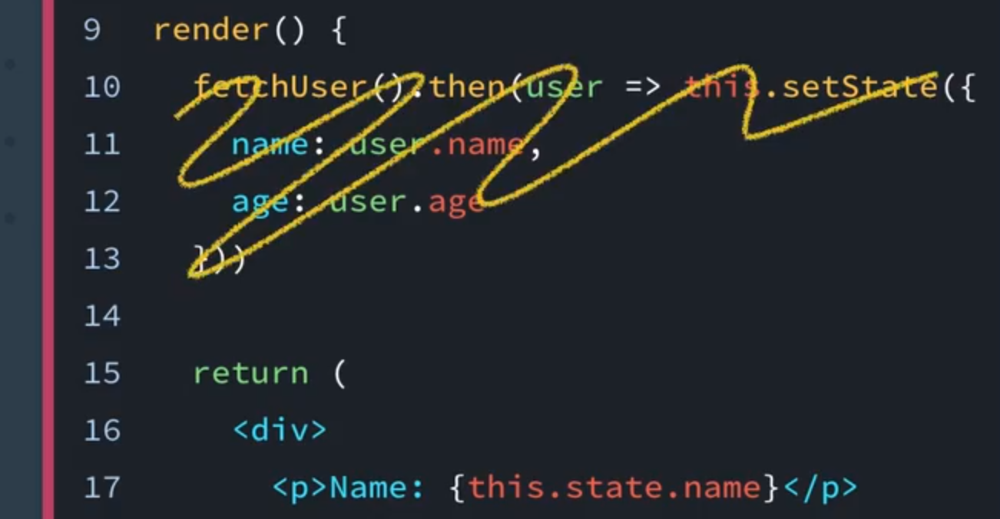
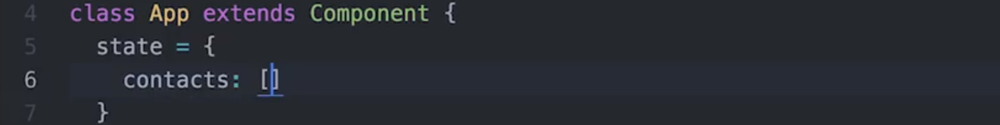
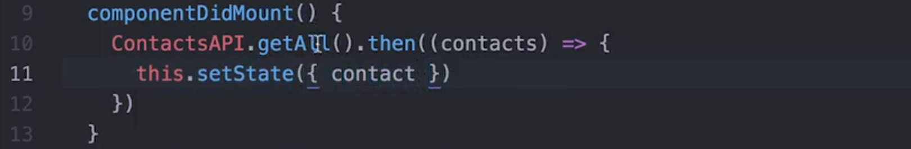
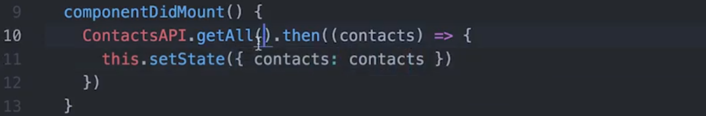
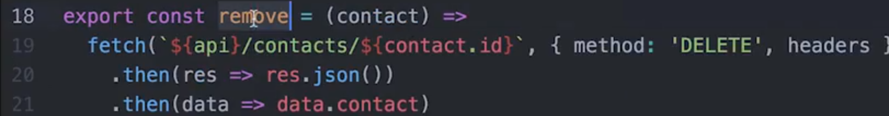
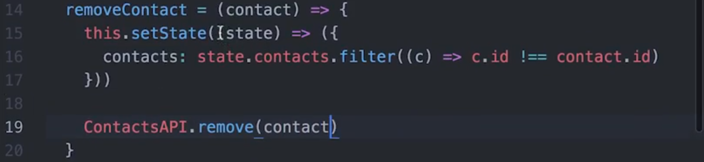

# 4. 使用外部数据渲染 UI

> 在这节课，你将学习在 React 应用的哪个位置获取远程数据，还将学习不同的生命周期阶段以及如何利用这些阶段。

[TOC]

---

## 4.1 简介

到目前，你应该对如何处理组件内的本地数据比较熟悉了。但是有一点我们还没有谈到，那就是**如何获取和管理存在于某个数据库中的数据**。

你的第一直接可能是在 render 方法中发送 AJAX 请求，不幸的是，这是一个非常糟糕的主意，因为 render 方法不能有**副作用**，它不能发出 AJAX 请求或执行具有异步性质的任何操作。它**只能接收 props 并返回对此 UI 的描述**。



那如果我们不能在 render 方法中发出 AJAX 请求，那应该在哪里呢？

这就引入了 React 中 lifecycle events（生命周期事件）的概念。

lifecycle events 是**每个组件具有的特殊方法**，**允许我们在组件声明的某些时间运行自定义行为**。比如当组件被创建和插入 DOM 中时，当组件接受 props 时等等。

React 拥有大量不同生命周期事件可供使用，但现在我们只谈谈最常见的一些。

- componentWillMount，它在组件插入 DOM 之前立即调用。
- componentDidMount，它在组件插入 DOM 之后立即调用。
- componentWillUnmount，它在组件从 DOM 移除之前立即调用。
- componentWillReceiveProps，它在组件即将接受全新的 props 时调用。

这里需要记住的信息很多，不要有压力，也**不要觉得你要把所有的都记住，而只是记住它们存在就好，然后在需要时查看它们的文档**。

现在，我们还是要回答最初的问题，如果我们想从 API 获取外部数据，要如何来做呢？

这正是使用 componentDidMount 生命周期事件的最佳时机。

---

### `render()` 仅用于渲染！

我在视频中刚刚提到过，但是我想再强调一遍 **不应在 render 方法中获取数据**！组件的 `render()` 方法应该仅用于渲染该组件；**不应发出任何 HTTP 请求、获取用于显示内容的数据，或者更高 DOM**。此外，`render()` 方法**不应调用任何执行这些操作的其他函数**。

> 但 render() 在 return UI 之前可以处理获取的数据然后再进行 return

因为 `render()` 仅用于显示内容，我们应该将处理 Ajax 请求等任务的代码放在 React 的**生命周期事件中**。

### 生命周期

生命周期事件是组件中名称特殊的方法。这些方法会自动绑定到组件实例，React 将**在组件生命周期的特定时间点调用这些方法**。有很多不同的生命周期事件，但是也有一些最常用的生命周期事件。

- `componentWillMount()`

  > 在组件插入 DOM 之前立即被调用

- `componentDidMount()`

  > 在组件插入 DOM 之后立即被调用

- `componentWillUnmount()`

  > 在组件从 DOM 中删除之前立即被调用

- `componentWillReceiveProps()`

  > 每当组件即将接收全新的属性时被调用

要使用其中一个事件，你只需**在组件中使用相关名称创建一个方法，React 将调用该方法。**这样可以轻松地挂接到 React 组件的不同生命周期阶段。

我们将介绍的生命周期事件（并且将经常在我们的应用中用到！）是 `componentDidMount()` 生命周期事件。

## 4.2 componentDidMount 生命周期事件

如果你想使用 React 发送 Ajax 请求，你需要使用 componentDidMount 这个生命周期事件。我们来看看它的工作原理：


在我们的组件添加到视图之后，componentDidMount  将被调用，并发起 Ajax 请求，一旦请求完成并返回正确的响应后，setState 将被调用，这会使用最新请求的数据更新我们的组件状态，这将会重新渲染组件并更新 UI。

---

### `componentDidMount()` 的工作原理

在上一部分，我们提到 `componentDidMount()` 是组件添加到 DOM 之后立即运行的**生命周期钩子**，如果你想获取远程数据或发出 Ajax 请求，则应该使用该方法。以下是相关的 React 文档介绍：

> `componentDidMount()` **在组件装载后立即被调用**。应该在需要初始化 DOM 节点的时候使用该方法如果你想从远程端点加载数据，那么此处适合实现网络请求。**在此方法中设置状态将触发重新渲染**。

我们看一个示例 User 组件：

```react
import React, { Component } from 'react';
import fetchUser from '../utils/UserAPI';

class User extends Component {
  constructor(props) {
    super(props)

    this.state = {
      name: '',
      age: ''
    }
  }

  componentDidMount() {
    fetchUser().then((user) => this.setState({
      name: user.name,
      age: user.age
    }))
  }

  render() {
    return (
      <div>
        <p>Name: {this.state.name}</p>
        <p>Age: {this.state.age}</p>
      </div>
    )
  }
}

export default User;
```

你将注意到，该组件具有一个 `componentDidMount()` 生命周期事件。这个组件很容易理解，但是我们还是逐步讲解下它的**工作原理**：

1. `render()` 方法被调用，然后它会更新具有 `<div>` 的页面（一段是名称，一段是年龄）。值得注意的是，`this.state.name` 和 `this.state.age` 是空字符串（一开始），所以名称和年龄实际上并不显示出来
2. **组件被装载后，发生 `componentDidMount()` 生命周期事件**。
   - 运行 `UserAPI` 的 `fetchUser` 请求，它会向用户数据库发出请求
   - 返回数据后，`setState()` 被调用，并更新 `name` 和 `age` 属性
3. **因为状态已变化，`render()` 再次被调用**。这样就会重新渲染页面，但是现在 `this.state.name` 和 `this.state.age` 具有值了

我们使用 `componentDidMount()` 从 Contacts 应用的服务器上获取真实用户吧！

> #### ⚠️ 必需的 API 文件 ⚠️
>
> 在这门课程的开始阶段，我们给了你两个选择：克隆我们的起始项目或使用 [create-react-app](https://github.com/facebookincubator/create-react-app) 从头开始。如果你使用 create-react-app 构建你的项目，那么在接下来的视频中，你将需要 [ContactsAPI 文件](https://github.com/udacity/reactnd-contacts-complete/blob/master/src/utils/ContactsAPI.js)。

---

你还记得在之前的视频中，我们说过对于这些联系人，我们不是直接将它们硬编码到 app 组件的状态中，实际上，我们想提出一个 API 请求从服务器的某个地方获取它们，然后添加到我们的状态中。

这些就是我们要在这个视频中做的。

我们仍然想让应用的初始状态包含一个联系人数组，但它里面没有数据，只是一个空数组：



还记得我们为你生成的文件吗？其中一个是 contactsAPI.js 文件。

我们要向它导出三个不同的函数：getAll、remove 和 create

你会注意到，它们每个都使用   fetch 来连接一些 API，在这个视频中，我们要使用 getAll 函数来向 API 发出请求并获取信息。对于获得的信息，我们可以将它们粘贴（stick）到状态中。

首先我们要将 './utils/contactsAPI' 文件中的所有东西作为 ContactsAPI 导入：


接下来我们需要向组件添加一个生命周期事件，它需要的是一个我们能在其中发出 API 请求的生命周期事件，而这个生命周期事件就是 componentDidMount，此函数将在这个组件被安装（mounted）到视图时由 react 调用。

发生这个之后我们要做的是调用 contactsAPI.getAll，它将返回一个 Promise 对象，然后我们调用 .then 方法，该方法将与我们的 contacts 一起被调用。

然后像我们之前所做的，我们可以调用 this.setState 然后传入 contacts，如果你不熟悉这个语法，它的作用基本上 和这个一样（指的是使用**对象字面量简写法**，当你的属性名与传入的变量名相同时，可以不写传入值）：



与



我们在这里定义了 setState 是一个对象，键为 contacts，值为我们从 API 获得的 contacts。因为键和值是相同的，所以可以直接删掉值的部分。

所以现在会发生的是，当组件安装时，我们发出一个 API 请求，此 API 请求解析后，此函数（ContactsAPI.getAll）将被特定的数据调用，这里就是我们的 contacts，然后有了这些 contacts 后，我们调用 setState 并更新我们的状态，这会重新渲染我们的组件，然后它会将这些新的联系人向下传递给我们的 ListContacts 组件，后者会将它们渲染为视图。

[这是本视频中所做更改的 commit。](https://github.com/udacity/reactnd-contacts-complete/commit/2f165b6f1c95092722486249b00cb172bcf1d3ab)

---

#### 习题 1/2

你应该在哪个生命周期方法中发出 Ajax/API 请求？

- componentDidMount
  - **只能**在 componentDidMount 生命周期方法中发出 Ajax 请求。 
- componentWillmount
- render
- shouldComponentUpdate


#### 习题 2/2

为何不能在 render 方法中发出 Ajax 请求？

- render 方法应该是一个“功能纯粹的函数”
  - **render 方法应该通过属性获得输入，并返回关于 UI (JSX) 的说明，除此之外，没有别的任务了。** 
- render 不支持普通的 JavaScript
- 你**无法完全控制 render 方法何时将被调用**
  - render 方法应该通过属性获得输入，并返回关于 UI (JSX) 的说明，除此之外，没有别的任务了。 
- 你无法在 render 方法中调用函数


- 我已经在 `App.js` 中将 `this.state.contacts` 设为空数组
- 我已经在 `App.js` 中导入 `ContactsAPI.js` 文件
- 我已经向 `App.js` 添加 `componentDidMount` 生命周期事件
- `componentDidMount` 使用 Contacts API 的 `getAll()` 方法返回的用户更新 `this.state.contacts`

很棒！`componentDidMount` 使用起来实际上很简单，对吧？


### 删除通讯录

到目前为止，我们已经能够从 Contacts API 中获取所有用户并将它们添加到 `this.state.contacts`。进展的很顺利。但是缺少的是删除功能。目前，当我们删除通讯录时，它从 `this.state.contacts` 中删除了，但是依然保留在后端数据库中。

我们使用 Contacts API 的 `remove()` 方法更新后端数据库。

---

如果你记得在我们的 contactsAPI 文件中，在这里定义了一个 remove 函数：



那么我们要做的是，在我们的 removeContact 函数中，我们只是在更新本地状态，却没有利用 API 发出请求，我们想在这里添加的是 contactsAPI.remove，然后传入特定联系人：



现在发生的是，我们不仅从外部 API 获取到了联系人，而且当我们删除联系人时，我们不仅从本地状态中删除了该联系人，还将向 API 发送请求从某处的数据库中删除它。


[这是本视频中所做更改的 commit。](https://github.com/udacity/reactnd-contacts-complete/commit/151ea430aea71230811cd395ee08398df9b8f170)

---

> #### 丢失所有的通讯录了？
>
> 我们正在将通讯录同步到服务器上，任何删除指令将删除所有通讯录。因为我们暂时无法添加新的通讯录，因此如果删掉所有通讯录的话，就卡住了。
>
> 要重新获得默认的通讯录列表，只需重启后端服务器。是后端服务器，不是 Contacts 应用本身。

Task List

- 我的代码在 `App.js` 中的 `removeContact()` 内对 Contacts API 的 `.remove()`方法进行了调用

### `componentDidMount()` 总结

`componentDidMount()` 是 React 提供的多个生命周期事件之一。当组件**被“装载”后**（即**被渲染之后**），`componentDidMount()` 被调用。如果你想动态地获取数据或运行 Ajax 请求，则应该在 `componentDidMount()` 中执行这些操作。

#### 深入研究

- [`componentDidMount()`](https://facebook.github.io/react/docs/react-component.html#componentdidmount) React 文档


## 4.3 课程总结

总结下，生命周期事件**是 React 提供的特殊方法**，使我们**能够挂接到组件生命周期的不同阶段以运行一些代码**。有**各种不同的生命周期事件，它们将在不同的时间点运行**，但是我们可以将它们划分为三大类别：

### 添加到 DOM 中

当组件正在被添加到 DOM 中时，这些生命周期事件被调用：

- `constructor()`
- `componentWillMount()`
- `render()`
- `componentDidMount()`

### 重新渲染-rendering

当组件正在重新渲染到 DOM 时，这些生命周期事件被调用

- `componentWillReceiveProps()`
- `shouldComponentUpdate()`
- `componentWillUpdate()`
- `render()`
- `componentDidUpdate()`

### 从 DOM 中删除

当组件正在从 DOM 中被删除时，以下生命周期事件被调用

- `componentWillUnmount()`

可以通过以下图表更清晰地了解所有这些方法都位于生命周期的哪个时间点：

[*位于组件生命周期不同阶段的 React 生命周期事件列表。*](https://classroom.udacity.com/nanodegrees/nd019-cn/parts/b2feddfa-4b79-4f8b-8657-ab8892feae08/modules/82766b2b-1870-4904-aa90-8ccbe63928c5/lessons/ceb0042f-3e00-4bd2-a1d4-7746ec9c138a/concepts/3612061d-6488-454c-9818-cc6bcba02f5e#)

从图片的左上角开始，当 ReactDOM 开始渲染组件时，一切开始了。

可以看出，在列表和此图中，有很多不同的生命周期事件。但是，最常用的是 `componentDidMount()`、`componentWillMount()`、`componentWillUnmount()` 和 `componentWillReceiveProps()`。

### 深入研究

- [`componentWillMount()`](https://facebook.github.io/react/docs/react-component.html#componentwillmount) React 文档|([翻译](https://doc.react-china.org/docs/react-component.html#componentwillmount))
- [`componentDidMount()`](https://facebook.github.io/react/docs/react-component.html#componentdidmount) React 文档|([翻译](https://doc.react-china.org/docs/react-component.html#componentdidmount))
- [`componentWillUnmount()`](https://facebook.github.io/react/docs/react-component.html#componentwillunmount) React 文档|([翻译](https://doc.react-china.org/docs/react-component.html#componentwillunmount))
- [`componentWillReceiveProps()`](https://facebook.github.io/react/docs/react-component.html#componentwillreceiveprops) React 文档|([翻译](https://doc.react-china.org/docs/react-component.html#componentwillreceiveprops))
- [Component Lifecycles](https://facebook.github.io/react/docs/react-component.html#the-component-lifecycle) React 文档|([翻译](https://doc.react-china.org/docs/react-component.html#%E7%BB%84%E4%BB%B6%E7%94%9F%E5%91%BD%E5%91%A8%E6%9C%9F))


