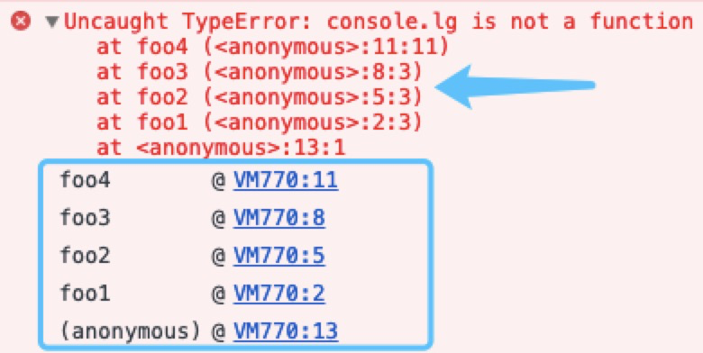
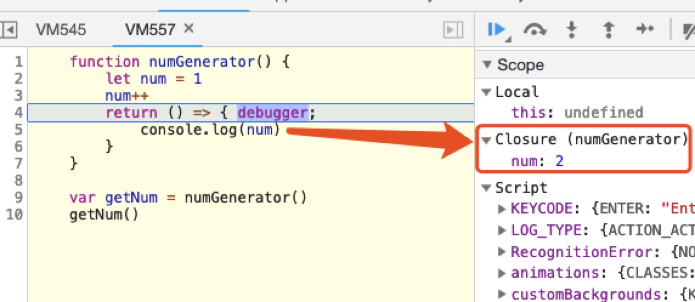

## 第1-2课：老司机也会在闭包相关知识点翻车（上）

> [原文地址](https://gitbook.cn/gitchat/column/5c91c813968b1d64b1e08fde/topic/5c99a9a3ccb24267c1d01960)

[TOC]

闭包是 JavaScript 中最基本也是最重要的概念之一，很多开发者都对它“了如指掌”。可是闭包又绝对不是一个单一的概念：**它涉及作用域、作用域链、执行上下文、内存管理等多重知识点。** 不管是新手还是“老司机”，经常会出现“我觉得我弄懂了闭包，但是还会在一些场景翻车”的情况。这一课我们就对这个话题进行梳理，并最后以“应试题”来强化理解闭包。

先看一下跟闭包相关的知识点：


接下来将通过两课的内容来学习这个主题。

### 基本知识

#### 作用域

作用域其实就是一套规则：这个规则**用于确定在特定场景下如何查找变量**。任何语言都有作用域的概念，同一种语言在演进过程中也会不断完善其作用域规则。比如，在 JavaScript 中，ES6 出现之前只有函数作用域和全局作用域之分。

##### 函数作用域和全局作用域

大家应该非常熟悉**函数作用域**了：

```js
function foo() {
    var a = 'bar'
    console.log(a)
}
foo()
```

执行 `foo` 函数时，变量 `a` 在函数 `foo` 作用域内，函数体内可以正常访问，并输出 `bar`。

而当：

```js
var b = 'bar'
function foo() {
    console.log(b)
}
foo()
```

执行这段代码时，`foo` 函数在自身函数作用域内并未查找到 `b` 变量，但是它会继续向外扩大查找范围，因此可以在**全局作用域**中找到变量 `b`，输出 `bar`。

如果我们稍加改动：

```js
function bar() {
    var b = 'bar'
}
function foo() {
    console.log(b)
}
foo()
```

执行这段代码时，`foo` 和 `bar` **分属于两个彼此独立的函数作用域**，`foo` 函数无法访问 `bar` 函数中定义的变量 `b`，且其作用域链内（上层全局作用域中）也不存在相应的变量，因此报错：Uncaught ReferenceError: b is not defined。

------

**总结一下**：在 JavaScript 执行一段函数时，遇见变量读取其值，这时候会“就近”先在函数内部找该变量的声明或者赋值情况。这里涉及“变量声明方式”以及“变量提升”的知识点，我们后面会涉及到。如果在函数内无法找到该变量，就要跳出函数作用域，到更上层作用域中查找。这里的“更上层作用域”可能也是一个函数作用域，例如：

```js
function bar() {
    var b = 'bar'
    function foo() {
        console.log(b)
    }
    foo()
}

bar()
```

在 `foo` 函数执行时，对于变量 `b` 的声明或读值情况是在其上层函数 `bar` 作用域中获取的。

同时“更上层作用域”也可以顺着作用域范围向外扩散，一直找到全局作用域：

```js
var b = 'bar'
function bar() {
    function foo() {
        console.log(b)
    }
    foo()
}

bar()
```

我们看到，变量作用域的查找是一个扩散过程，就像各个环节相扣的链条，逐次递进，这就是**作用域链**说法的由来。

------

##### **块级作用域和暂时性死区**

作用域概念不断演进，ES6 增加了 `let` 和 `const` 声明变量的块级作用域，使得 JavaScript 中作用域范围更加丰富。块级作用域，顾名思义，作用域范围限制在代码块中，这个概念在其他语言里也普遍存在。当然这些新特性的添加，也增加了一定的复杂度，带来了新的概念，比如**暂时性死区**。这里有必要稍作展开：说到暂时性死区，还需要从“变量提升”说起，参看以下代码：

```js
function foo() {
    console.log(bar)
    var bar = 3
}
foo()
```

会输出：`undefined`，原因是变量 `bar` 在函数内进行了提升。相当于：

```js
function foo() {
    var bar 
    console.log(bar)
    bar = 3
}
foo()
```

但在使用 `let` 声明时：

```js
function foo() {
    console.log(bar)
    let bar = 3
}
foo()
```

会报错：Uncaught ReferenceError: bar is not defined。

我们知道使用 `let` 或 `const` 声明变量，会针对这个变量形成一个封闭的块级作用域，**在这个块级作用域当中，如果在声明变量前访问该变量，就会报 referenceError 错误**；如果在声明变量后访问，则可以正常获取变量值：

```js
function foo() {
    let bar = 3
    console.log(bar)
}
foo()
```

正常输出 3。因此在相应花括号形成的作用域中，存在一个“死区”，起始于函数开头，终止于相关变量声明的一行。在这个范围内无法访问 `let` 或 `const` 声明的变量。这个“死区”的专业名称为： TDZ（Temporal Dead Zone），相关语言规范的介绍读者可参考 [ECMAScript® 2015 Language Specification](http://www.ecma-international.org/ecma-262/6.0/#sec-let-and-const-declarations) ，喜欢刨根问底看规范的读者可以了解一下。

参考下面图示，我们加深理解：


除了自身作用域内的 `foo3` 以外，`bar2` 函数可以访问 `foo2`、 `foo1`；但是 `bar1` 函数却无法访问 `bar2` 函数内定义的 `foo3`。


再啰嗦一遍，`bar1` 函数 `let foo3 = 'foo3'` 代码执行前，为“死区”，访问变量 `foo3` 会报错；该行后即可正常访问。

注意我在上图中勾出的暂时性死区区域，这里介绍一个比较“极端”的情况：函数的参数默认值设置也会受到 TDZ 的影响：

```js
function foo(arg1 = arg2, arg2) {
    console.log(`${arg1} ${arg2}`)
}
```

在上面 `foo` 函数中，如果第一个参数没有传，将会使用第二个参数作为第一个实参值。调用：

```js
function foo(arg1 = arg2, arg2) {
    console.log(`${arg1} ${arg2}`)
}

foo('arg1', 'arg2')
// 返回：arg1 arg2
```

返回内容正常，但是当第一个参数缺省时，执行 `arg1 = arg2` 会当作暂时性死区处理：

```js
function foo(arg1 = arg2, arg2) {
    console.log(`${arg1} ${arg2}`)
}

foo(undefined, 'arg2')

// Uncaught ReferenceError: arg2 is not defined
```

因为除了块级作用域意外，函数参数默认值也会受到 TDZ 影响。

这里我再“抖个机灵”，看看下面的代码会输出什么？

```js
function foo(arg1 = arg2, arg2) {
    console.log(`${arg1} ${arg2}`)
}

foo(null, 'arg2')
```

输出：`null arg2`，这就涉及到 `undefined` 和 `null` 的区别了。在执行 `foo(null, 'arg2')`时，不会认为“函数第一个参数缺省”，而会直接接受 `null` 作为第一个参数值。

这个知识点已经不是本课的主题了，具体 `undefined` 和 `null` 的区别我们会在后续课程中提到。

既然“已经偏题”，那我索性再分析一个场景，顺便引出下面的知识点：

```js
function foo(arg1) {
    let arg1
}

foo('arg1')
```

猜猜将会输出什么？

实际上会报错：Uncaught SyntaxError: Identifier 'arg1' has already been declared。这同样跟 TDZ 没有关系，而是因为函数参数名会出现在其“执行上下文/作用域”当中。

在函数的第一行，便已经声明了 `arg1` 这个变量，函数体再用 `let` 声明，会报错（这是 `let` 声明变量的特点，ES6 基础内容，不再展开），类似：

```js
function foo(arg1) {
    var arg1
    let arg1
}
```

请看示意图：


上面我提到了“执行上下文”，我们再看看它究竟是什么。

#### 执行上下文和调用栈

很多读者可能无法准确定义执行上下文和调用栈，其实，从我们接触 JavaScript 开始，这两个概念便常伴左右。我们写出的每一行代码，每一个函数都和它们息息相关，但它们却是“隐形”的，藏在代码背后，出现在 JavaScript 引擎里。这一小节，我们来剖析一下这两个熟悉但又经常被忽视的概念。

**执行上下文**就是当前代码的执行环境/作用域，和前文介绍的作用域链相辅相成，但又是完全不同的两个概念。直观上看，执行上下文包含了作用域链，同时它们又像是一条河的上下游：有了作用域链，才有了执行上下文的一部分。

##### **代码执行的两个阶段**

理解这两个概念，要从 JavaScript 代码的执行过程说起，这在平时开发中并不会涉及，但对于我们理解 JavaScript 语言和运行机制非常重要，请各位细心阅读。**JavaScript 执行主要分为两个阶段：**

- 代码预编译阶段
- 代码执行阶段

**预编译阶段是前置阶段，这个时候由编译器将 JavaScript 代码编译成可执行的代码。** 注意，这里的预编译和传统的编译并不一样，传统的编译非常复杂，涉及分词、解析、代码生成等过程 。这里的预编译是 JavaScript 中独特的概念，虽然 JavaScript 是解释型语言，编译一行，执行一行。但是在代码执行前，JavaScript 引擎确实会做一些“预先准备工作”。

**执行阶段主要任务是执行代码，执行上下文在这个阶段全部创建完成。**

在通过语法分析，确认语法无误之后，JavaScript 代码在预编译阶段对变量的内存空间进行分配，我们熟悉的变量提升过程便是在此阶段完成的。如下代码：

经过预编译过程，我们应该注意三点：

- 预编译阶段进行变量声明；
- 预编译阶段变量声明进行提升，但是值为 undefined；
- 预编译阶段所有非表达式的函数声明进行提升。

请看下面这道题目：

```js
function bar() {
    console.log('bar1')
}

var bar = function () {
    console.log('bar2')
}

bar()
```

输出：bar2，我们调换顺序：

```js
var bar = function () {
    console.log('bar2')
}

function bar() {
    console.log('bar1')
}

bar()
```

仍然输出：`bar2`，因为在预编译阶段变量 `bar` 进行声明，但是不会赋值；函数 `bar` 则进行创建并提升。在代码执行时，变量 `bar` 才进行（表达式）赋值，值内容是函数体为 `console.log('bar2')`的函数，输出结果 `bar2`。

请再思考这道题：

```js
foo(10)
function foo (num) {
    console.log(foo)
    foo = num;       
    console.log(foo)
    var foo
} 
console.log(foo)
foo = 1
console.log(foo)
```

输出：

```js
undefined
10
ƒ foo (num) {
    console.log(foo)
    foo = num     
    console.log(foo)
    var foo
}
1
```

在 `foo(10)` 执行时，函数体内进行变量提升后，函数体内第一行输出 `undefined`，函数体内第三行输出 `foo`。接着运行代码，到了整体第 8 行，`console.log(foo)` 输出 foo 函数内容（因为 foo 函数内的 `foo = num`，将 num 赋值给的是函数作用域内的 foo 变量。）

**结论**　作用域在预编译阶段确定，但是作用域链是在执行上下文的创建阶段完全生成的。因为函数在调用时，才会开始创建对应的执行上下文。执行上下文包括了：变量对象、作用域链以及 `this`的指向，如图所示：


代码执行的整个过程说起来就像**一条生产流水线**。第一道工序是在预编译阶段创建**变量对象**（Variable Object），此时只是创建，而未赋值。到了下一道工序代码执行阶段，变量对象转为**激活对象**（Active Object），即完成 VO → AO。此时，作用域链也将被确定，它由当前执行环境的变量对象和所有外层已经完成的激活对象组成。这道工序保证了变量和函数的有序访问，即如果当前作用域中未找到变量，则继续向上查找直到全局作用域。

这样的工序在流水线上串成一个整体，这便是 JavaScript 引擎执行机制的最基本原理。

##### 调用栈

了解了上面的内容，函数调用栈便很好理解了。我们在执行一个函数时，如果这个函数又调用了另外一个函数，而这个“另外一个函数”也调用了“另外一个函数”，便形成了一系列的调用栈。如下代码：

```js
function foo1() {
  foo2()
}
function foo2() {
  foo3()
}
function foo3() {
  foo4()
}
function foo4() {
  console.log('foo4')
}
foo1()
```

调用关系：`foo1` → `foo2` → `foo3` → `foo4`。这个过程是 `foo1` 先入栈，紧接着 `foo1` 调用 `foo2`，`foo2`入栈，以此类推，`foo3`、`foo4`，直到 `foo4` 执行完 —— `foo4` 先出栈，`foo3` 再出栈，接着是 `foo2` 出栈，最后是 `foo1` 出栈。这个过程“先进后出”（“后进先出”），因此称为**调用栈**。

我们故意将 `foo4` 中的代码写错：

```js
function foo1() {
  foo2()
}
function foo2() {
  foo3()
}
function foo3() {
  foo4()
}
function foo4() {
  console.lg('foo4')
}
foo1()
```

得到错误提示如图：



或者在 Chrome 中执行代码，打断点得到：


不管哪种方式，我们从中都可以借助 JavaScript 引擎，清晰地看到错误堆栈信息，也就是函数调用栈关系。

> **注意**　正常来讲，在函数执行完毕并出栈时，函数内局部变量在下一个垃圾回收节点会被回收，该函数对应的执行上下文将会被销毁，这也正是我们在外界无法访问函数内定义的变量的原因。也就是说，只有在函数执行时，相关函数可以访问该变量，该变量在预编译阶段进行创建，在执行阶段进行激活，在函数执行完毕后，相关上下文被销毁。

#### 闭包

介绍了这么多前置概念，终于到了闭包环节。

闭包并不是 JavaScript 特有的概念，社区上对于闭包的定义也并不完全相同。虽然本质上表达的意思相似，但是晦涩且多样的定义仍然给初学者带来了困惑。我自己认为比较容易理解的闭包定义为：

> 函数嵌套函数时，内层函数引用了外层函数作用域下的变量，并且内层函数在全局环境下可访问，就形成了闭包。

我们看一个简单的代码示例：

```js
function numGenerator() {
    let num = 1
    num++
    return () => {
        console.log(num)
    } 
}

var getNum = numGenerator()
getNum()
```

这个简单的闭包例子中，`numGenerator` 创建了一个变量 `num`，返回打印 `num` 值的匿名函数，这个函数引用了变量 `num`，使得外部可以通过调用 `getNum` 方法访问到变量 `num`，因此在 `numGenerator` 执行完毕后，即相关调用栈出栈后，变量 `num` 不会消失，仍然有机会被外界访问。

执行代码，能清晰地看到 JavaScript 引擎的分析：



`num` 值被标记为 Closure，即闭包变量。

对比前述内容，我们知道正常情况下外界是无法访问函数内部变量的，函数执行完之后，上下文即被销毁。但是在（外层）函数中，如果我们返回了另一个函数，且这个返回的函数使用了（外层）函数内的变量，外界因而便能够通过这个返回的函数获取原（外层）函数内部的变量值。这就是闭包的**基本原理**。

因此，直观上来看，闭包这个概念为 JavaScript 中访问函数内变量提供了途径和便利。这样做的好处很多，比如我们可以利用闭包实现“模块化”；再比如，翻看 Redux 源码的中间件实现机制，也会发现（函数式理念）大量运用了闭包。这些更加深入的内容我们后续课程都将会涉及。闭包是前端进阶必备基础。后面我们还会通过做题的方式，帮助读者深化理解闭包。

#### 内存管理

内存管理是计算机科学中的概念。不论是什么程序语言，内存管理都是指对内存生命周期的管理，而内存的生命周期无外乎：

- 分配内存空间
- 读写内存
- 释放内存空间

我们用代码来举例：

```js
var foo = 'bar' // 在堆内存中给变量分配空间
alert(foo)  // 使用内存
foo = null // 释放内存空间
```

##### **内存管理基本概念**

我们知道内存空间可以分为栈空间和堆空间，其中

- 栈空间：由操作系统自动分配释放，存放函数的参数值，局部变量的值等，其操作方式类似于数据结构中的栈。
- 堆空间：一般由开发者分配释放，这部分空间就要考虑垃圾回收的问题。

在 JavaScript 中，数据类型包括（未包含 ES Next 新数据类型）：

- 基本数据类型，如 Undefined、Null、Number、Boolean、String 等
- 引用类型，如 Object、Array、Function 等

一般情况下，基本数据类型保存在栈内存当中，引用类型保存在堆内存当中。如下代码：

```js
var a = 11
var b = 10
var c = [1, 2, 3]
var d = { e: 20 }
```

对应内存分配图示：


**对于分配内存和读写内存的行为所有语言都较为一致，但释放内存空间在不同语言之间有差异。**例如，JavaScript 依赖宿主浏览器的垃圾回收机制，一般情况下不用程序员操心。但这并不表示万事大吉，某些情况下依然会出现内存泄漏现象。

**内存泄漏**是指内存空间明明已经不再被使用，但由于某种原因并没有被释放的现象。这是一个非常“玄学”的概念，因为内存空间是否还在使用，某种程度上是不可判定问题，或者判定成本很高。内存泄漏危害却非常直观：它会直接导致程序运行缓慢，甚至崩溃。

##### **内存泄漏场景举例**

我们来看几个典型引起内存泄漏的例子：

```js
var element = document.getElementById("element")
element.mark = "marked"

// 移除 element 节点
function remove() {
    element.parentNode.removeChild(element)
}
```

上面的代码，我们只是把 `id` 为 `element` 的节点移除，但是变量 `element` 依然存在，该节点占有的内存无法被释放。

请仔细参考下图：


我们需要在 `remove` 方法中添加：`element = null`，这样更为稳妥。

再来看个示例：

```js
var element = document.getElementById('element')
element.innerHTML = '<button id="button">点击</button>'

var button = document.getElementById('button')
button.addEventListener('click', function() {
    // ...
})

element.innerHTML = ''
```

这段代码执行后，因为 element.innerHTML = ''，`button` 元素已经从 DOM 中移除了，但是由于其事件处理句柄还在，所以依然无法被垃圾回收。我们还需要增加 removeEventListener，防止内存泄漏。

另一个示例：

```js
function foo() {
  var name  = 'lucas'
  window.setInterval(function() {
    console.log(name)
  }, 1000)
}

foo()
```

这段代码由于 window.setInterval 的存在，导致 `name` 内存空间始终无法被释放，如果不是业务要求的话，一定要记得在合适的时机使用 `clearInterval` 进行清理。

##### **浏览器垃圾回收**

当然，除了开发者主动保证以外，大部分的场景浏览器都会依靠：

- 标记清除
- 引用计数

两种算法来进行主动垃圾回收。内容社区上有很多好文章介绍这方面的内容，我把自己收藏的几篇不错的跟大家分享一下，这些内容偏浏览器引擎实现，这里不再过多介绍，感兴趣的读者可以参考下面内容：

- [通过垃圾回收机制理解 JavaScript 内存管理](https://juejin.im/post/5c4409fbf265da616f703d5a)
- [如何处理 JavaScript 内存泄漏](https://mp.weixin.qq.com/s?__biz=MzA5NzkwNDk3MQ==&mid=2650585408&idx=1&sn=4de7b5bbfa969d9587c163e98bc90684&source=41#wechat_redirect)
- [垃圾回收](https://segmentfault.com/a/1190000003641343)
- [编写内存友好的代码](https://segmentfault.com/a/1190000007887891)
- [JavaScript 中 4 种常见的内存泄漏陷阱](https://mp.weixin.qq.com/s?__biz=MzAxODE2MjM1MA==&mid=2651551451&idx=1&sn=b8447a12eceb467992d432b014d9c026&chksm=8025a11ab752280c7915db4ef726611f645d2fee590d6f0f3f9aeedd55c956454f66f786873a&scene=0#wechat_redirect)
- [记一次网页内存溢出分析及解决实践](https://juejin.im/post/5c3dce07e51d4551e960d840)

##### **内存泄漏和垃圾回收注意事项**

**关于内存泄漏和垃圾回收，要在实战中分析，不能完全停留在理论层面，毕竟如今浏览器千变万化且一直在演进当中。** 从以上示例我们可以看出，借助闭包来绑定数据变量，可以保护这些数据变量的内存块在闭包存活时，始终不被垃圾回收机制回收。因此，闭包使用不当，极可能引发内存泄漏，需要格外注意。以下代码：

```js
function foo() {
    let value = 123

    function bar() { alert(value) }

    return bar
}

let bar = foo()
```

这种情况下，变量 value 将会保存在内存中，如果加上：

```js
bar = null
```

这样的话，随着 bar 不再被引用，value 也会被清除。

结合浏览器引擎的优化情况，我们对上述代码进行改动：

```js
function foo() {
    let value = Math.random()

    function bar() {
        debugger
    }

    return bar
}

let bar = foo()
bar()
```

在 Chrome 浏览器 V8 最新引擎中，执行上述代码。我们在函数 `bar` 中打断点，会发现 `value` 没有被引用，如下图：


而我们在 `bar` 函数中加入对 `value` 的引用：

```js
function foo() {
    let value = Math.random()

    function bar() {
        console.log(value)
        debugger
    }

    return bar
}

let bar = foo()
bar()
```

会发现此时引擎中存在闭包变量 value 值。如下图：


下面我们来看一个实战，借助 Chrome devtool，排查发现内存泄漏的场景。

代码：

```js
var array = []
function createNodes() {
    let div
    let i = 100
    let frag = document.createDocumentFragment()
    for (; i > 0; i--) {
        div = document.createElement("div")
        div.appendChild(document.createTextNode(i))
        frag.appendChild(div)
    }
    document.body.appendChild(frag)
}
function badCode() { 
    array.push([...Array(100000).keys()])
    createNodes()
    setTimeout(badCode, 1000)
}

badCode()
```

我们递归调用 `badCode`，这个函数每次向 `array` 数组中写入由从 0 到 100000 组成的新数组，在 `badCode` 函数使用完全局变量 `array` 之后，并没有手动释放内存，垃圾回收不会处理 `array`，导致内存泄漏；同时，`badCode` 函数调用 `createNodes` 函数，每 1s 创建 100 个 div 节点。

这时候，打开 Chrome devtool，我们选中 performance 标签，拍下快照得到：


由此可以发现，JS heap（蓝线）和 Nodes（绿线）线，随着时间线一直在上升，并没有被垃圾回收。因此，可以判定存在较大的内存泄漏风险。如果我们不知道有问题的代码位置，具体如何找出风险点，那需要在 Chrome memory 标签中，对 JS heap 中每一项，尤其是 size 较大的前几项展开调查。如图：


明显就是我们定义的 `array` 不对劲了。

这一节我们分析了涉及闭包知识的基础概念，介绍了内存管理和垃圾回收相关机制。下一节我们将集中学习代码示例，加强理解。