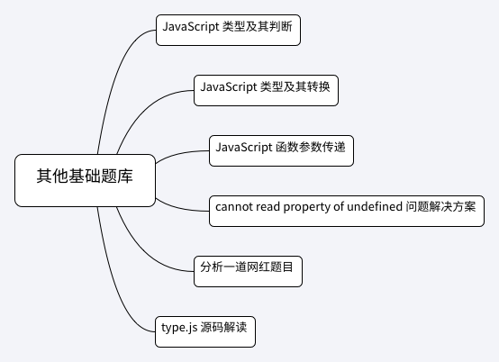

## 第1-6课：其他基础题库

> [原文地址](https://gitbook.cn/gitchat/column/5c91c813968b1d64b1e08fde/topic/5cbbe675bbbba80861a35bd4)

[TOC]

此节课程前，我们已经梳理了 JavaScript 当中 this、执行上下文、作用域、闭包、几个 APIs 实现等基础内容。在下一部分中，我们也将认识到原型、原型链、异步等知识。除了以上罗列的概念外，在 JavaScript 中还存在一些较为“细小”，却至关重要的概念和细节。这些内容看似零碎，但它们是 JavaScript 基础拼图的重要环节，是代码的基本单元，甚至在面试中也是单独的考察点。这一节，我们将对这些“其他”内容进行梳理。

主要关键字包括：类型（类型判断，类型转换，源码分析等），函数参数引用，相关面试题目分析等。

如图：



### JavaScript 类型及其判断

JavaScript 具有七种内置数据类型，它们分别是：

- null
- undefined
- boolean
- number
- string
- object
- symbol

其中，前面五种为基本类型。第六种 object 类型又具体包含了 function、array、date 等。

对于这些类型的判断，我们常用的方法有：

- typeof
- instanceof
- Object.prototype.toString
- constructor

#### 使用 typeof 判断类型

基本类型可以使用 typeof 来判断：

```JS
typeof 5 // "number"
typeof 'lucas' // "string"
typeof undefined // "undefined"
typeof true // "boolean"
```

但是也存在着一些特例，比如用 typeof 判断 null 时：

```JS
typeof null // "object"
```

我们再看使用 typeof 判断复杂类型时的表现：

```js
const foo = () => 1
typeof foo // "function"

const foo = {}
typeof foo // "object"

const foo = []
typeof foo // "object"

const foo = new Date()
typeof foo // "object"

const foo = Symbol("foo") 
typeof foo // "symbol"
```

因此，我们可以总结出：

使用 typeof 可以准确判断出除 null 以外的基本类型，以及 function 类型、symbol 类型；null 会被 typeof 判断为 object。

#### 使用 instanceof 判断类型

再来看看 instanceof。

**使用 a instanceof B 判断的是：a 是否为 B 的实例，即 a 的原型链上是否存在 B 构造函数**。因此如果使用：

```js
function Person(name) {
    this.name = name
}
const p = new Person('lucas')

p instanceof Person
// true
```

这里 p 是 Person 构造出来的实例。同时，顺着 p 的原型链，也能找到 Object 构造函数：

```js
p.__proto__.__proto__ === Object.prototype
```

因此：

```js
p instanceof Object

// true
```

原型原型链的知识我们会在后续章节中介绍，这里只需要理解 instanceof 的判断原理即可。另外，一个细节需要注意：

```js
5 instanceof Number // false
```

返回 false，是因为 5 是基本类型，它并不是 Number 构造函数构造出来的实例对象，如果：

```js
new Number(5) instanceof Number 

// true
```

结果返回 true。

我们使用以下代码来模拟 instanceof 原理：

```js
// L 表示左表达式，R 表示右表达式
const instanceofMock = (L, R) => {
    if (typeof L !== 'object') {
        return false
    }
    while (true) { 
        if (L === null) {
            // 已经遍历到了最顶端
            return false
        }
        if (R.prototype === L.__proto__) {
            return true
        }
        L = L.__proto__
    } 
}
```

L 表示左表达式，R 表示右表达式，我们可以如此使用：

```js
instanceofMock('', String)

// false

function Person(name) {
    this.name = name
}
const p = new Person('lucas')

instanceofMock(p, Person)

// true
```

#### 使用 constructor 和 Object.prototype.toString 判断类型

使用 Object.prototype.toString 判断类型，我们称之为“万能方法”，“终极方法”：

```js
console.log(Object.prototype.toString.call(1)) 
// [object Number]

console.log(Object.prototype.toString.call('lucas')) 
// [object String]

console.log(Object.prototype.toString.call(undefined)) 
// [object Undefined]

console.log(Object.prototype.toString.call(true)) 
// [object Boolean]

console.log(Object.prototype.toString.call({})) 
// [object Object]

console.log(Object.prototype.toString.call([])) 
// [object Array]

console.log(Object.prototype.toString.call(function(){})) 
// [object Function]

console.log(Object.prototype.toString.call(null)) 
// [object Null]

console.log(Object.prototype.toString.call(Symbol('lucas'))) 
// [object Symbol]
```

具体将会在本课程最后部分的 type.js 源码分析中重点使用。

使用 constructor 可以查看目标的构造函数，这也可以进行类型判断，但也存在着问题，具体请看：

```js
var foo = 5
foo.constructor
// ƒ Number() { [native code] }

var foo = 'Lucas'
foo.constructor
// ƒ String() { [native code] }

var foo = true
foo.constructor
// ƒ Boolean() { [native code] }

var foo = []
foo.constructor
// ƒ Array() { [native code] }

var foo = {}
foo.constructor
// ƒ Object() { [native code] }

var foo = () => 1
foo.constructor
// ƒ Function() { [native code] }

var foo = new Date()
foo.constructor
// ƒ Date() { [native code] }

var foo = Symbol("foo") 
foo.constructor
// ƒ Symbol() { [native code] }

var foo = undefined
foo.constructor
// VM257:1 Uncaught TypeError: Cannot read property 'constructor' of undefined
    at <anonymous>:1:5

var foo = null
foo.constructor
// VM334:1 Uncaught TypeError: Cannot read property 'constructor' of null
    at <anonymous>:1:5
```

我们发现对于 undefined 和 null，如果尝试读取其 constructor 属性，将会进行报错。并且 constructor 返回的是构造函数本身，一般使用它来判断类型的情况并不多见。

### JavaScript 类型及其转换

JavaScript 的一个显著特点就是“灵活”。“灵活”的反面就是猝不及防的“坑”多，其中一个典型的例子就是被诟病的类型“隐式转换”。先来看一个极端的例子：

```js
(!(~+[])+{})[--[~+""][+[]]*[~+[]]+~~!+[]]+({}+[])[[~!+[]*~+[]]] 
// "sb"
```

这就是“隐式转换”的“成果”。为什么会有这样的输出，这里不过多研究，先从基础入手来进行分析。

MDN 这样介绍过 JavaScript 的特点：

> JavaScript 是一种弱类型或者说动态语言。这意味着你不用提前声明变量的类型，在程序运行过程中，类型会被自动确定。

我们再来看一些基本例子，在使用加号进行运算时：

```js
console.log(1 + '1')
// 11

console.log(1 + true)
// 2

console.log(1 + false)
// 1

console.log(1 + undefined)
// NaN

console.log('lucas' + true)
// lucastrue
```

我们发现：

当使用 + 运算符计算 string 和其他类型相加时，都会转换为 string 类型；其他情况，都会转换为 number 类型，但是 undefined 和 null 会转换为 NaN，相加结果也是 NaN。

比如布尔值转换为 number 类型：true 为 1，false 为 0，因此：

```js
console.log(1 + true)
// 2

console.log(1 + false)
// 1
```

再看代码：

```js
console.log({} + true)
// [object Object]true
```

在 + 号两侧，如果存在复杂类型，比如对象，那么这到底是怎样的一套转换规则呢？

**结论：**当使用 + 运算符计算时，如果存在复杂类型，那么复杂类型将会转换为基本类型，再进行运算

这就涉及到“对象类型转基本类型”这个过程。具体规则：

对象在转换基本类型时，会调用该对象上 valueOf 或 toString 这两个方法，该方法的返回值是转换为基本类型的结果

那具体调用 valueOf 还是 toString 呢？这是 ES 规范所决定的，实际上这取决于内置的 toPrimitive 调用结果。主观上说，这个对象倾向于转换成什么，就会优先调用哪个方法。如果倾向于转换为 Number 类型，就优先调用 valueOf；如果倾向于转换为 String 类型，就只调用 toString。这里我建议大家了解一些常用的转换结果，对于其他特例情况会查找规范即可。

valueOf 以及 toString 是可以被开发者重写的。比如：

```js
const foo = {
  toString () {
    return 'lucas'
  },
  valueOf () {
    return 1
  }
}
```

我们对 foo 对象的 valueOf 以及 toString 进行了重写，这时候调用：

```js
alert(foo)
```

输出：lucas。这里就涉及到“隐式转换”，在调用 alert 打印输出时，“倾向于使用 foo 对象的 toString 方法，将 foo 转为基本类型”，得以打印出结果。

然而：

```js
console.log(1 + foo)
```

输出：2，这时候的隐式转换“倾向于使用 foo 对象的 valueOf 方法，将 foo 转为基本类型”，得以进行相加。

我们再全面总结一下，对于加法操作，如果加号两边都是 Number 类型，其规则为：

- 如果 + 号两边存在 NaN，则结果为 NaN（typeof NaN 是 'number）
- 如果是 Infinity + Infinity，结果是 Infinity
- 如果是 -Infinity + (-Infinity)，结果是 -Infinity
- 如果是 Infinity + (-Infinity)，结果是 NaN

如果加号两边有至少一个是字符串，其规则为：

- 如果 + 号两边都是字符串，则执行字符串拼接
- 如果 + 号两边只有一个值是字符串，则将另外的值转换为字符串，再执行字符串拼接
- 如果 + 号两边有一个是对象，则调用 valueof() 或者 toStrinig() 方法取得值，转换为基本类型再进行字符串拼接。

对于其他操作符也是类似的。

当然也可以进行显式转换，我们往往使用类似 Number、Boolean、String、parseInt 等方法，进行显式类型转换，这里不再展开。

### JavaScript 函数参数传递

我们知道 JavaScript 当中有“引用赋值”和“基本类型赋值”以及相关概念：“深拷贝”、“浅拷贝”区分。那么函数的参数传递有什么讲究呢？请看例题：

```js
let foo = 1
const bar = value => {
    value = 2
    console.log(value)
}
bar(foo)
console.log(foo) 
```

两处输出分别为 2、1；也就是说在 bar 函数中，参数为基本类型时，函数体内复制了一份参数值，而不会影响参数实际值。

```js
let foo = {bar: 1}
const func = obj => {
    obj.bar = 2
    console.log(obj.bar)
}
func(foo)
console.log(foo)
```

两处输出分别为 2、{bar: 2}；也就是说如果函数参数是一个引用类型，当在函数体内修改这个引用类型参数的某个属性值时，将会对参数进行修改。因为这时候函数体内的引用地址指向了原来的参数。

但是如果在函数体内，直接修改了对参数的引用，则情况又不一样：

```js
let foo = {bar: 1}
const func = obj => {
    obj = 2
    console.log(obj)
}
func(foo)
console.log(foo)
```

两处输出分别为 2、{bar: 1}；这样的情况理解起来较为晦涩，其实总结下来就是：

- 参数为基本类型时，函数体内复制了一份参数值，对于任何操作不会影响参数实际值
- 函数参数是一个引用类型时，当在函数体内修改这个值的某个属性值时，将会对参数进行修改
- 函数参数是一个引用类型时，如果我们直接修改了这个值的引用地址，则相当于函数体内新创建了一份引用，对于任何操作不会影响原参数实际值

### cannot read property of undefined 问题解决方案

这里我们分析一个常见的 JavaScript 细节：cannot read property of undefined 是一个常见的错误，如果意外的得到了一个空对象或者空值，这样恼人的问题在所难免。

考虑这样的一个数据结构：

```js
const obj = {
    user: {
        posts: [
            { title: 'Foo', comments: [ 'Good one!', 'Interesting...' ] },
            { title: 'Bar', comments: [ 'Ok' ] },
            { title: 'Baz', comments: []}
        ],
        comments: []
    }
}
```

为了在对象中相关取值的过程，需要验证对象每一个 key 的存在性。常见的处理方案有：

- && 短路运算符进行可访问性嗅探

```js
obj.user &&
obj.user.posts &&
obj.user.posts[0] &&
obj.user.posts[0].comments
```

- || 单元设置默认保底值

```js
(((obj.user || {}).posts||{})[0]||{}).comments 
```

- try...catch

```js
var result
try {
    result = obj.user.posts[0].comments
}
catch {
    result = null
}
```

- lodash 等库 get API

当然，我们也可以自己编写代码：

```js
const get = (p, o) => p.reduce((xs, x) => (xs && xs[x]) ? xs[x] : null, o)

console.log(get(['user', 'posts', 0, 'comments'], obj)) // [ 'Good one!', 'Interesting...' ]
console.log(get(['user', 'post', 0, 'comments'], obj)) // null
```

我们实现的方法中，接收两个参数，第一个参数表示获取值的路径（path）；另外一个参数表示目标对象。

同样，为了设计上的更加灵活和抽象，我们可以 curry 化方法：

```js
const get = p => o =>
    p.reduce((xs, x) =>
        (xs && xs[x]) ? xs[x] : null, o)

const getUserComments = get(['user', 'posts', 0, 'comments'])

console.log(getUserComments(obj))
// [ 'Good one!', 'Interesting...' ]
console.log(getUserComments({user:{posts: []}}))
// null
```

最后，TC39 提案中有一个新的提案，支持：

```js
console.log(obj?.user?.posts[0]?.comments)
```

由此可见，JavaScript 语言也在不断演进。通过这个案例，想告诉大家：熟练掌握基础环节，将对于进阶起到关键作用。

### 分析一道网红题目

综合以上知识点，我们来看一道“网红”题目：

> Can (a == 1 && a == 2 && a == 3) ever evaluate to true?

即：

> a == 1 && a == 2 && a == 3 可能为 true 吗？

直观上分析，如果变量 a 是一个基本 Number 类型，这是不可能为 true 的，因此解题思路也需要从变量 a 的类型及（对象）转换（基本类型）上来考虑。

方案一：

```js
const a = {
    value: 1,
    toString: function () {
        return a.value++
    }
}
console.log(a == 1 && a == 2 && a == 3) // true
```

这个方案中，我们将 a 定义为一个对象，并重写了其 toString 方法。因此在每次进行判断时，按照规则，== 号两边出现了对象类型，另一边是 Number 类型，需要调用 a 对象 toString 方法，toString 方法的返回值会作为对象转为基本类型的值，我们每次将 value 属性加 1。同样，如果按照相同的方式重写 valueOf 方法，也是可以达到同样目的的。

方案二：

```js
let value = 0
Object.defineProperty(window, 'a', {
    get: function() {
        return ++value
    }
})

console.log(a == 1 && a == 2 && a == 3) // true
```

这里我们同样将 a 定义成对象，并且采用了 Object.defineProperty 的方式，重写了其 getter 方法。

当然，以上两种方法并不惟一，社区上也有给出其他“奇技艺巧”的解决方案。这里我们聚焦在本节课程的知识点上即可。

### type.js 源码解读

[type.js](https://github.com/jsmini/type) 是由颜海镜编写的用于判断数据类型的方法库，其兼容 IE6，灵活运用了多种判断类型方式：

```js
const toString = Object.prototype.toString;

export function type(x, strict = false) {
    strict = !!strict;

    // fix typeof null = object
    if(x === null){
        return 'null';
    }

    const t = typeof x;

    // number string boolean undefined symbol
    if(t !== 'object'){
        return t;
    }

    let cls;
    let clsLow;
    try {
        cls = toString.call(x).slice(8, -1);
        clsLow = cls.toLowerCase();
    } catch(e) {
        // ie 下的 activex 对象
        return 'object';
    }

    if(clsLow !== 'object'){
        // 区分 String() 和 new String()
        if (strict && (clsLow === 'number' || clsLow === 'boolean' || clsLow === 'string')) {
            return cls;
        }
        return clsLow;
    }

    if(x.constructor == Object){
        return clsLow;
    }

    // Object.create(null)
    try {
        // __proto__ 部分早期 firefox 浏览器
        if (Object.getPrototypeOf(x) === null || x.__proto__ === null) {
            return 'object';
        }
    } catch(e) {
        // ie下无 Object.getPrototypeOf 会报错
    }

    // function A() {}; new A
    try {
        const cname = x.constructor.name;

        if (typeof cname === 'string') {
            return cname;
        }
    } catch(e) {
        // 无 constructor
    }

    // function A() {}; A.prototype.constructor = null; new A
    return 'unknown';
}
```

其中关键点提炼出来有：

- 通过 x === null 来判断 null 类型
- 对于 typeof x 不为 object 的情况，直接返回 typeof x 结果，这时候可以判断出 number，string，boolean，undefined，symbol 类型
- 其他情况，对于 IE6 以上版本，使用 Object.prototype.toString 方法并进行返回
- 兼容性处理，比如对于不支持 Object.prototype.toString 方法的情况，返回 object
- 其他兼容性处理

兼容性处理部分因为历史原因，我们不再追究。这里重点关注一下 Object.prototype.toString 方法，该方法确实可以称得上“终极方案”。对返回结果使用 .slice(8, -1)，更加方便拿到结果：

```js
Object.prototype.toString.call(true).slice(8, -1)

// "Boolean"
```

相关规范文档：[Object.prototype.toString](http://lzw.me/pages/ecmascript/#304)

### 总结

这节课程，我们“零散”介绍了很多细节，细心的同学会发现，这些细节本质上都围绕着“类型”这个概念。关于类型，以及相关的类型转换，涉及到 JavaScript 语言特点，涉及到语言规范内容。对此，对于这些规则，需要开发者“熟记”，如果在自己认知之外的，能够做到查阅规范，找到解释即可。不必钻牛角尖。