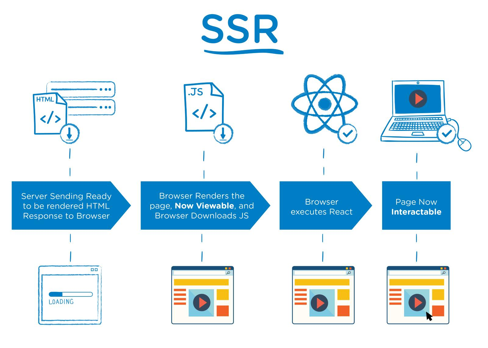
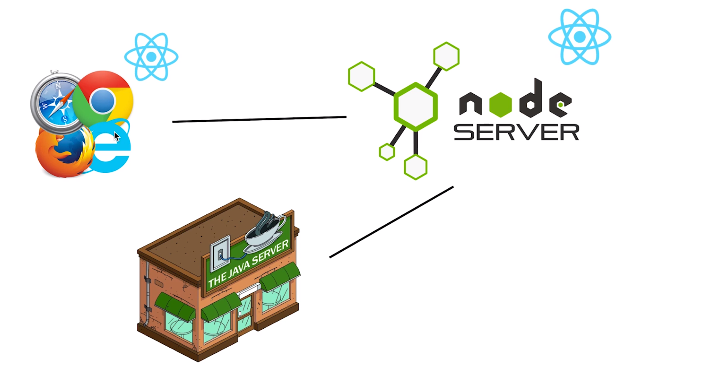

# Z.总结

[TOC]

## 1.服务器端渲染基础

### 什么是服务器端渲染和客户端渲染？

**服务器端渲染 - SSR（Server side rendering)**，如下图所呈现的步骤：



1. 服务器发送已经渲染好的 HTML 文本给客户端。
2. 客户端加载 HTML 并渲染出页面内容和请求下载 JS 等文件，这个时候网页中已经存在内容。
3. 客户端执行 React 等框架代码来重新加载页面，主要是因为需要实现一些交互逻辑。
4. 页面现在可以进行交互。

总的来说，SSR 就是将原本需要由客户端加载渲染的页面内容放到了服务器端来做，这样当客户端请求页面并收到响应的 html 时，需要渲染的内容已经存在于页面中了。

**客户端渲染 - CSR（Client side rendering）**，如下图所呈现的步骤：


1. 服务器响应并返回客户端请求的 html。
2. 但这个 html 中并没有网页需要呈现的内容，但有个 js 文件，请求这个 js 文件
3. 执行这个 js 文件中 React 等框架代码来呈现与加载交互逻辑。
4. 页面中出现了内容并能够交互。

CSR 是将页面所呈现的内容交由客户端来加载渲染呈现。客户端请求所接收到的文件中并不带有 html 的内容，这需要客户端自己通过执行 js 代码来加载渲染。

### 为什么会出现服务器渲染？

其实对于传统非前后端分离的架构模式，前端只需要负责写 HTML CSS 和一些简单的 js 逻辑，基本上所有的页面都可以算是服务器端渲染，因为服务器端发送到客户端的 HTML 文件中已经存在网页内容。

而如今由于像 React、Vue、Angular 等框架的流行，前后端分离的开发模式已成为主流，前端负责使用框架编写视图层的内容，而数据通过 AJAX 的方式向后端请求，当请求到数据以后再渲染页面中数据改变的部分，在这样的模式下，页面的渲染工作是交给了客户端来做，而服务器端更多的工作是处理数据和响应数据。在团队开发的过程中，这种前后端分离的架构体系对我们的**开发效率提升很大**。

但由于我们需要优化 SEO 和 TTFP，所以我们需要 SSR 这样的架构设计来帮助我们实现这一点。

### SSR 与 CSR 的优势与弊端

CSR 优势：

- 相对于传统服务器端渲染：
  - **提升开发效率**，后端不需要再去绑定数据
  - 减少服务器端性能损耗，服务器不需要再进行计算和填写模板

CSR 弊端：

- 不利于 SEO
- 相对 SSR，TTFP 过慢

SSR 优势：

- 首屏加载速度更快
- 利于 SEO

SSR 弊端：

- 对于服务区端过大的性能损耗，需要更多的服务器
- 开发繁杂，开发效率相对较低

## 2.React 中的服务器端渲染

### 项目的开始

- 一个项目使用 npm 来帮助我们开发是非常有利的，所以我们使用 `npm init` 来初始化我们的项目。

- 由于我们的项目中需要使用 ES6 JSX 等语法和语法糖，所以需要 webpack 来帮助编译和打包。

- 对于 node 环境下的项目，我们需要在 webpack 配置中添加 target 字段来说明我们是针对 node 环境中执行的文件：

- ```js
  module.exports = {
    target: 'node'
  }
  ```

  - 因为 node 环境下本身就带有很多依赖和包，我们不需要像客户端环境那样将这些依赖打包到最终的文件中。
- 这里关于 webpack 的内容就不过多描述。可以直接查看配置文件。

### package.json scripts 相关

首先，我们需要做两件事，第一是**打包我们的项目**，第二是**执行这个打包后的文件**，那么脚本如下：

```js
 "scripts": {
    "start": "node ./build/bundle.js",
    "build": "webpack --config webpack.server.js"
  },
```

由于我们每次更改了代码都需要再手动对进行打包和执行，因此我们添加 `--watch` 参数和使用 `nodemon` 这个工具来帮助我们自动监听文件并执行：

```js
"scripts":{
  "start": "nodemon --watch build --exec node ./build/bundle.js",
  "build": "webpack --config webpack.server.js --watch"
}
```

- 注意，`nodemon` 需要全局安装 `-g`

最后，使用 `npm-run-all` 这个工具来帮助我们只需在终端执行一个命令就自动帮助我们执行多个脚本命令：

```js
"scripts": {
    "dev": "npm-run-all --parallel dev:**",
    "dev:start": "nodemon --watch build --exec node ./build/bundle.js",
    "dev:build": "webpack --config webpack.server.js --watch"
  },
```

- 当我们运行 `npm run dev` 时，就会同时执行下面两个脚本。（dev:）可以想象为一个命名空间，方便我们将开发环境与生产环境分开。
- `npm-run-all` 也是需要全局安装。

## 3.同构的概念的梳理

### 什么是同构？

简单的说，同构就是一套代码在服务器端执行一次又在客户端执行一次的一种解决问题的方案。

### 为什么需要使用同构？

在我们使用 React 构建的 SSR 项目中，服务器端所渲染的内容是通过 `react-dom/server` 下的 `renderToString` 方法加载 react 代码而生产的字符串内容，因此 React 代码中组件内所实现的一些时间绑定或是数据请求等逻辑在发送给客户端时并没有执行，为了能够在客户端实现这些功能逻辑，我们需要将这部分逻辑代码发送给客户端，让客户顿通过`react-dom` 下的 `ReactDom.hydrate` 方法加载 react 代码来执行这部分的逻辑。

### 具体实现过程

1. 需要在发送给客户端的 html 文本内容中添加一个`<sript>`标签并添加 `src` 属性以让客户端请求并加载脚本以及应该到哪里去请求脚本。

2. 在服务器端设置路由并使用`express.static` 中间件，当客户端请求静态资源时会去固定的目录下查找相应的路径下的文件。

3. 使用 webpack 打包需要在客户端执行 index.js

4. 因为打包给服务器端执行的代码与打包给客户端执行的代码是不同的，所以需要将两端的 webpack.config 分开，并且将其中相同的代码配置到 webpack.base.js 中，使用 `webpack-merge` 包来合并这些配置。

5. 优化目录结构，客户端与服务器端的 webpack 入口文件分别拆分到 client 与 server 文件夹中。

6. 最后配置一下脚本，好让 `npm-run-all` 帮助我们一次性运行多个脚本：

   ```js
     "scripts": {
       "dev": "npm-run-all --parallel dev:**",
       "dev:start": "nodemon --watch build --exec node ./build/bundle.js",
       "dev:build:server": "webpack --config webpack.server.js --watch",
       "dev:build:client": "webpack --config webpack.client.js --watch"    
     },
   ```

### 需要注意的问题

- 同构在客户端的渲染需要使用 `ReactDom.hydrate()` 方法来进行渲染，而不是像以往那样使用 `ReactDom.render()`。

- 使用了 `ReactDom.hydrate()`，在服务器发送给客户端的文本中不能带有文本节点，因此需要把一些空格删掉：

  ```js
  `<div id="root">${reactContent}</div>`
  ```

- 需要添加一个 div#root 的元素，好让  `ReactDom.hydrate()`方法知道把渲染好的 DOM 添加到哪里。

## 4.在 SSR 框架中引入路由机制

在大部分使用 SSR 的项目中，基本上不可能只有一个页面，所以项目肯定是由不同的页面配合路由所组成。因此，需要将路由引入到同构项目中。

### 具体步骤

1. 创建一个公用组件 Header，用于无论什么路由状态下都会渲染它，并在其中添加 Link 组件用于跳转。
2. 创建一些其他的组件，用于在不同的路由状态下渲染。
3. 在 Routes.js 中添加路由配置
4. 在客户端与服务端分别使用`<BrowserRouter>`与 `<StaticRouter>`来管理路由，并使用`react-router-config` 包中的 `renderRoutes`方法解析路由配置
5. 在 node 服务器中配置服务器路由的响应中，对所有路由的请求都执行返回服务器端渲染的逻辑，也就是返回对应路由的 html 代码内容。
6. 优化代码，将服务器端渲染逻辑封装到 utils 中的 render 方法。

### 需要知道的

- 实际上，同构的路由只有第一次访问页面时，服务器端才需要客户端的路由状态（URL、路径、Path），而之后的所有关于路由的跳转和页面的渲染都由客户端来管理和控制。
- StaticRouter 组件是专门针对于服务器端渲染所使用的组件，它允许我们传入一个路由地址和附加的 context 用于注水。
- 所以说服务器端渲染，实际上是指第一次访问页面时的渲染。

## 5.SSR 框架与 Redux 的结合

### 应用架构体系中的中间层是什么？



如图，node 服务器在这里就是中间层。它负责将底层数据服务器的内容转发给客户端，也负责客户端第一次请求时渲染页面。

### 使用中间层有什么好处？

- 各司其职
  - java server 负责查询和计算数据。
  - node server 负责将 java server 返回的数据和 React 结合生成 HTML 文档内容。
  - 客户端（浏览器）执行 JS 代码来让 React 代码接管整个页面的渲染和事件绑定。
- 因为各司其职，所以更容易发现问题所在。

### 在同构项目中使用 Redux 来管理和存储数据

在引用 Redux 时，两端的使用方式基本相同，都是通过在最外层包裹一个`Provider` 组件，然后给其传入通过`createStore`方法所创建的 store 即可。但需要注意的是，由于创建 store 时两端所使用到的参数的区别，也需要在创建 store 之前执行不同的逻辑，因此需要利用函数来单独的返回不同的 store。

### 构建 Redux 代码结构

- 由于我们项目是使用按照特征的方式来组织 Redux 的目录结构，也就是一个组件有关的 reducer、action 是放到这个组件的目录下的，并且把它们放到 store 文件夹中。
- 将组件目录下的 store 目录中的 reducer 和 action 导出到当前目录的 index.js 文件中，将其作为一个向外暴露的接口。
- action.type 的命名最好是以 reducer 内部的操作逻辑作为参考，比如获取全新的数据与完全更改这个数据，实际上所做的逻辑是相同的，那么使用`CHANGE`比使用`GET`更合适。当然这也不是完全固定的。

### 解决数据只由客户端获取的问题

如果应用中的远程数据都放在 componentDidMount 或者是一些事件触发时所获取，那么应用只会在客户端获取这些数据。原因是因为 node 服务器不会执行 componentDidMount 和绑定事件。

而如果服务器端无法获取这些数据，那么服务器端在发给客户端的 HTML 内容中就缺少了这部分数据，从而无论是 SEO 还是首屏的优化都会没有意义。

由于数据是由 Redux 来管理和存储，数据是 Redux-Thunk 中间件帮我们请求的。那只需要请求这些数据

**具体步骤：**

1. 接受到客户端的请求后创建 store
2. 使用 matchRoutes 方法匹配出请求路径相关的路由配置数组 matchedRoutes
3. 循环 matchedRoutes 数组，判断路由配置是否带有 loadData 方法，如果有传入 store 执行并将其返回的 promise 添加到 promises 数组中。
4. 执行 Promise.all 方法并传入 promises 数组，当 promises 数组中的每一个 promise 都为 resolved 时返回执行 render 方法并发送 html 字符串给客户端。

### 数据的脱水和注水

通过以上的方式并不完美，因为当客户端运行代码时会再次请求服务器端已经请求的数据，所以我们可以通过水合的方式将服务器端已经请求获取的数据传递给客户端使用。

具体步骤：

- 在返回给客户端的 html 内容中，添加一段脚本内容：

  ```js
  window.context = {
    state:${JSON.stringify(store.getState())}
  }
  ```

  - 先将 store 中的数据对象转换为字符串，然后传入 window.context 中

- 然后在客户端调用 createStore 的地方，将水合 state 传给它的第二个参数位置：

  ```js
  export const getClientStore = () => {
    const preloadedState = window.context.state
    return createStore(reducer, preloadedState, applyMiddleware(thunk))
  }
  ```

注水：在服务器端，将 store 中的 state 存放在 window.context 中的过程。（将服务器端的数据通过 window.context 对象传递给客户端的过程）

脱水：在客户端，将 window.context.state 中的数据存传给 createStore() 的过程。（客户端通过 window.context 对象取得数据的过程）

### 通过判断 state 中的数据来执行请求操作

既然现在客户端通过水合获取了服务器端请求的数据，那是否可以在客户端不再请求了呢？

其实不行，因为服务器端请求的数据只是客户端第一次加载的页面，其他页面依然需要客户端来请求，但如果已经有了这部分数据还请求会浪费性能，因此可以先判断再请求：

```js
componentDidMount() {
  // 判断数组中是否有值
  if(!this.props.list.length){
    this.props.getHomeList()
  }
}
```


## 6.使用 Node 作为数据获取中间层

中间层：当客户端通过 API 请求远程数据时需要借助中间层来作为一个中转。

### 中间层架构的好处

中间层架构将客户端与远程数据服务器分离，这样当出现一些问题时减少了查找问题的范围。比如当页面中的逻辑出现问题时，可能是客户端与 node 端的问题，而不应该是数据端的问题，而数据发生错误时，应该是 node 端和数据端的问题，而不应该是客户端的问题。

### 使用 express-http-proxy 中间件与 axios instance 来实现 node 代理请求

1. 使用 express-http-proxy 中间件来代理转发客户端请求
2. 这样处理之后，使用 axois 发送的异步接口地址在客户端与服务器端应该不同，因此，使用 axios instance 将 baseURL 设置为不同的 url。
3. 通过 react-thunk 的 withExtraArgument 方法来实现向 actionFunction 中传入不同的 instance 

### renderRoutes 方法实现对多级路由的支持

- 这里只需要注意一点，使用 renderRoutes 方法，在有二级路由的情况下，需要在其一级路由所要渲染的组件中，通过获取 Router 所传进来的 route 的 routes 值，在需要渲染组件的地方再执行一次 renderRoutes，比如一级路由 App 组件下：

  ```jsx
  const App = ({ route }) => {
    return (
      <Fragment>
        <Header />
        {renderRoutes(route.routes)}
      </Fragment>
    )
  }
  ```

### 登陆功能的制作

有三个接口可以为我们所使用，查询是否登录、登录、注销。

步骤：

1. 创建 Header 中的 store
2. 在 App 组件中通过 loadData 方法来获取是否登录的状态（不需要在 componentDidMount 中获取，原因是 App 组件是无论你访问任何地址都会渲染）
3. 在 loadData 中记得返回 promise，否则当其他 promise 请求在前时可能并不会等待 App 中 loadData 的执行就将 HTML 返回。
4. 在 server 的 axiosInstance 的 headers 字段中发送从客户端请求中获取的 cookie 值，从而让 node 端将客户端的 cookie 发送给数据端。

### 翻译列表页面制作

- 这里只有一点比较重要，当为登录状态时返回正常内容，否则返回：

  ```jsx
  <Redirect to="/" />
  ```

- 其余的内容就是构建一个组件，然后添加 reducer、action、connect、mapDispatchToProps、mapStateToProps、loadData 等


## 7.细节问题处理

### secret 统一管理和 axios 实例中的 params 设置

- 由于 secret 会经常的改变并且两端都使用了这个查询字段，因此将其放到固定位置管理。

- 使用 axios 实例的 params 属性来自动添加查询部分的内容：

  ```js
  params:{
   	 secret: 'PP87ANTIPIRATE'
  }
  
  axiosInstance.get('/api/news.json')
  
  相当于：axiosInstance.get('/api/news.json?secret=PP87ANTIPIRATE')
  ```

### 借助 context 返回 404 和 301 状态码

- 一个应用网站应该是有 404 页面的，所以创建 404 页面，并将其添加到路由配置的最后，并且不添加 path 字段
- 通过 `<StaticrRouter>` 组件的 context 属性，在 404 组件的 componentWillMount 中为 context 属性添加一个表示加载了 404 组件的标示，然后通过这个标示来返回 404 状态码和页面内容。
- 由于组件内部加载了`<Redirect>`组件，`<StaticRouter>`组件就会在 context 属性中添加一些内容作为标示，同样通过这些表示来执行`res.redirect(301, context.url)`实现服务器端重定向。

### 数据请求失败情况下 promise 的处理

- 通过让所有 promise 都变为 fulfilled 的 promise 来将失败情况下的 promise 过滤掉：

  ```js
  const newPromise = new Promise((resolve, reject) => {
    item.route.loadData(store).then(resolve).catch(resolve)
  })
  ```

- 这样当然会存在问题，可能我们需要在恰当的地方提醒用户数据请求或者加载失败。

> 因为以上内容都是大概的描述，所以可能会忽略一些细节，如果对有些问题模糊，还是去看相应章节下更详细的描述。


## 8.处理 SSR 框架中的 CSS 样式

### 在项目中通过 webpack 解析 css：

- 先使用 css-loader 对 css 文件进行解析和更改（比如使用 localIdentName 选项将为类名更加一个 hash 值的标识符）
- 针对服务器端和客户端使用不同的 style-loader，原因是由于服务器端没有 window 这个全局对象。

以服务器端 webapck 配置为示例的代码：

```js
module: {
  rules: [
    {
      test: /\.css$/,
      use: ['isomorphic-style-loader', { 
        loader: 'css-loader',
        options: {
          importLoaders: 1, 
          modules: true, 
          localIdentName: '[name]_[local]_[hash:base64:5]' 
        }
      }]
    }
  ]
}
```

### styles 对象

通过以上 webpack 的配置，就可以在项目中通过引入 css 文件来使用 styles 对象，如下：

```css
.test {
  color: salmon;
}
```

然后我们在 Home/index.js 通过如下的方式引入，并且调用 styles 对象中的 test 参数：

```jsx
import styles from './style.css'

<h1 className={styles.test}>My first App</h1>
```

最后去查看我们服务器发送给客户端的 html 代码中，这个 h1 标签中的 class 内容：

```html
<h1 class="style_test_d3nG6">My first App</h1>
```


### CSS 样式的服务器端渲染

目前服务器端并不会返回 css 的内容，因此 css 内容还是由客户端加载的。所以，我们需要通过一些方式来将 css 的内容返还给客户端。

**步骤：**

1. 使用`styles`对象中的`_getCss`方法获取到相应 css 文件中的字符串内容
2. 在传递给`<StaticRouter>`组件的`context`对象中添加一个`css`数组
3. 然后将 css 的字符串内容在 `componentWillMount` 钩子中 push 到 context.css 数组中
4. 最后将字符串数组通过 join 方法转化为字符串添加到返回给客户端的 html 内容中

代码大致如下：

```js
const context = {css:[]}
```

```jsx
<StaticRouter location={req.path} context={context}>
```

```jsx
componentWillMount() {
    const { staticContext } = this.props
    if (staticContext) {
      staticContext.css.push(styles._getCss())
    }
}
```

```jsx
const cssStr = context.css.length ? context.css.join('') : ''

  return `
    <html>
      <head>
        ${helmet.title.toString()}
        ${helmet.meta.toString()}
        <style>${cssStr}</style>
//...
```


### 利用高阶组件将重复的逻辑从组件中提出来封装

以上代码中，只要使用了 css 的组件都需要执行 `componentWillMount` 中的逻辑，因此使用高阶组件进行抽象。

**具体步骤：**

1. 创建一个函数并返回一个组件，这个组件执行重复逻辑并 render 传入的回调组件。
2. 在需要使用这段逻辑的组件文件中，通过将被包装组件传入高阶组件函数返回一个具有封装好逻辑的新组件。

**代码如下：**

```jsx
export default (DecoratedComponent, styles) => {
   class NewComponent extends Component {
    componentWillMount() {
      const { staticContext } = this.props
      if (staticContext) {
        staticContext.css.push(styles._getCss())
      }
    }

    render() {
      return <DecoratedComponent {...this.props} />
    }
  }

  NewComponent.loadData = DecoratedComponent.loadData

  return NewComponent
}
```

- 需要来自回调组件文件中的 styles 
- 需要将被包装组件的 loadData 传入新的组件中
- 需要将父组件传给子组件的 props 传给被包装组件

最后，以 Header 组件为例，将通过使用高阶组件进行包装后返回：

```jsx
export default connect(
  mapStateToProps,
  mapDispatchToProps
)(withStyle(Header, styles))
```


## 9.SEO 技巧的融入

我们做服务器端渲染很大程度上是为了 SEO，而搜索引擎根据用户搜索内容而呈现的网页排列顺序却是由 html 内容决定的。

### Title 与 Description 的真正作用

搜索引擎对你网站的定位是基于全文匹配的机制，这个定位也就决定了当出现某些搜素内容时你网站在搜索结果中的排位，因此在很大程度上是看整体网页的内容而不仅仅是 title 和 descripttion。

而 title 和 description 又很重要，原因是当搜索结果出现以后，整个结果中有多个相关网站，而你的 title 和 description 如果足够有吸引力就有很大可能让搜索者点击，从而提高你网站在搜索结果中的转化率。

### 如果做好 SEO

基本上一个网站都是由文字、多媒体（图片、音乐、视频、flash、Canvas）、链接这三部分所组成的，搜索引擎在判断一个价值如何时也就是从这三方面来判断的，那么做好 SEO 就是对这三方面做好优化。

- 1.文字优化
  - 原创性
  - 相关性
- 2.链接优化
  - 内部链接所访问的网站内容要和主网站内容相关，相关性越强，则 SE 认为你的网站价值越大。
  - 外部链接越多，则越有价值

- 3.多媒体优化
  - 在两个文字与链接基本相同的网站上，有图的网站会比没图的网站排名更靠前，因为 SE 认为你的网站更丰富。

### 使用 React-Helmet 来定制页面独立的 title 和 description。

客户端就直接引入 Helmet 组件即可，如下：

```jsx
import { Helmet } from 'react-helmet'

<Helmet>
  <meta charSet="utf-8" />
	<title>欢迎来到首页 - Home 组件</title>
	<meta name="description" content="首页面的描述就是没有描述" />
</Helmet>
```

在服务器端则需要使用 Helmet 的 renderStatic 方法：

```jsx
const helmet = Helmet.renderStatic()

return `
    <html>
      <head>
        ${helmet.title.toString()}
        ${helmet.meta.toString()}
        <style>${cssStr}</style>
```


### 使用预渲染解决 SEO 问题的新思路

除非你的项目对 SEO 和 TTFP 有非常高的要求而且能够忽略性能上的影响时再去使用 SSR 这种架构体系去设计你的代码。如果你的网站在使用客户端渲染时就已经渲染很快了，而且对于 SEO 没有特别大的需求时，这个时候还是建议不要使用这么复杂的框架，直接正常的使用 react.js 就好了。这也是为什么 react 官方不推荐大家使用这种服务器端渲染的概念，因为这样会让你的项目变得会对以前复杂的多。

如果假设我们的项目对 SEO 有非常高的要求，但对 TTFP 要求不高时，就可以使用预渲染服务器。比如使用 prerener 包来实现一个预渲染服务器。

大概原理是因为，爬虫和用户是不同的，可以先判断是用户还是爬虫来让其访问预渲染服务器或是真实的客户端渲染网站。

### 步骤：

1. 通过 prerener 创建一个预渲染服务器，当这个服务器被访问时，会去访问我们客户端渲染的页面地址，然后生成 html 内容并返回。
2. 无论是用户访问还是爬虫访问都先走 nginx 服务器对外的一个接口，比如都访问的是 www.baidu.com，那么都会先去访问我们的 nginx 服务器，然后让他做判断，如果发现是一个爬虫的话，则让请求转发给 prerender 服务器，如果是一个普通的用户则直接把请求发送给 react 项目的服务器。