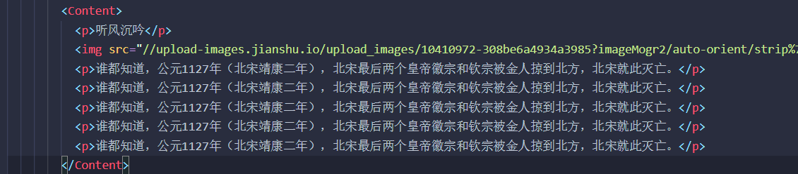
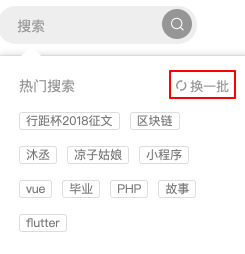
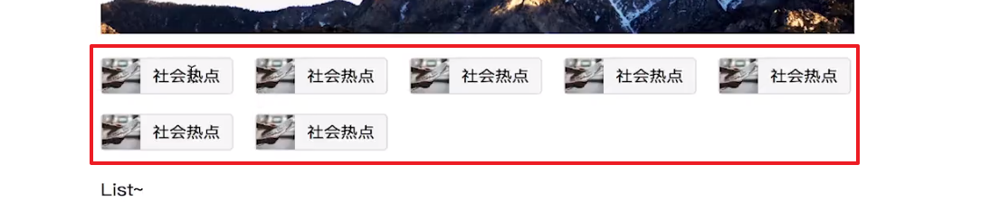

# 课程总结

> 我会将「模块」理解为具有一定功能性并且能够使用的元素，包括函数与变量，而「文件」则是可能包含多个「模块」的存储空间。
>
> 一下来自 [webpack-模块](https://webpack.docschina.org/concepts/modules/)
>
> 在 [模块化编程](https://en.wikipedia.org/wiki/Modular_programming) 中，开发者将程序分解为功能离散的 chunk(discrete chunks of functionality)，并称之为_模块_。
>
> 每个模块具有比完整程序更小的接触面，使得验证、调试、测试轻而易举。 精心编写的_模块_提供了可靠的抽象和封装界限，使得应用程序中每个模块，都具备了条理清楚的设计和明确的目的。
>
> Node.js 从最一开始就支持模块化编程。 然而，web 的*模块化*支持正缓慢到来。 在 web 存在多种支持 JavaScript 模块化的工具，这些工具各有优势和限制。 webpack 基于从这些系统获得的经验教训，并将_模块_的概念应用于项目中的任何文件。


[TOC]

## 技巧

### import

将 import 的文件相同的类型的放在一起，比如你可以先引入组件，然后再引入 css 和一些插件、脚本、库等

### index.html 中添加其他内容

React 只负责你所设定的节点（通常为 id='root'）下的渲染，那么在 index.html 中可以添加其他的代码。比如，你可以引入 jQuery 来操作其他的 DOM 也是可以的，他们相互之间不会影响。

### 将一个文件夹中的所有文件都通过 index.js 文件导出

- 在一个文件夹中建立一个 index.js，然后代码这样书写：

  ```jsx
  import reducer from './reducer'
  import * as actionCreators from './actionCreators'
  import * as constants from './constants'
  
  export { reducer, actionCreators, constants}
  ```

  - `export { }`的方式可以在一个表达式中同时导出多个模块

### 以组件为单位的文件管理形式：

- 一个组件可以分为以下几部分：
  - 负责样式的 `style.js`
  - 负责将样式组件安排到页面 UI 的容器组件 `index.js`
  - 负责状态管理的 `reducer.js`
- 这种组织页面代码的方式是按照特征组织，也就是将于组件相关的所有文件放在一起。
- 如果有任何问题可以去查看 jianshu-app 项目中的内容。

```
─common
│  └─header
│          actions.js
│          index.js
│          reducer.js
│          style.js
```

- 比如上面这个树状图中，公用组件 header 拥有所有跟它有关的文件，action、reducer、style、index 

### 设计文件目录结构的思路

我们之前所学习到的一种思路是将一个组件的所需文件都放入一个文件夹中，这种方式也被称为**按照特征组织**，比如之前 header 组件，在一个 header 文件夹中会有以下文件：

- actionCreators.js
- index.js
- reducer.js
- style.js

但是，如果我们将所有组件都以这样的方式进行组织就会使整个文件系统非常的庞大，所以我们可以在某些地方以上面的形式组织，比如一些非常大的组件，需要将 action 和 reducer 提出来。而我们将一些小的组件以另外一种方式进行组织，**按类型组织**。

这种方式是将多个组件所需要使用到的东西，比如样式组件（style.js），reducer，actionCreator 放入一个文件中统一管理。

比如，我们在项目中将 home 这个页面拆分成了 Topic、List、Recommend、Writer 四个组件，那么我们可以将这四个组件的 style.js、reducer、actionCreator 放入一个文件夹中，比如可以直接放到外层的 home 组件的这些文件中。

### 解决浪费性能的问题

> 在此项目中由于使用了`immutable`库，所以在使用 reducer 替换掉 store 中 state 时并不是深拷贝返回一个对象，而是返回一个只更改部分内容的对象，所以有可能因为这个原因，当某些组件需要更改数据而更改 store 中的 state 时并没有使另外一些使用 store 中的 state 的组件重新渲染。

可能在应用开发过程中，会遇到一些组件在自身所需要的数据没有发生变化的情况下也会重新渲染的问题。比如，一个父组件的 props 发生了变化，从而需要重新 render 这个父组件，但其子组件并不需要重新 render.

解决方法：

- 通过生命周期函数 shouldComponentUpdata()，判断是否组件中的所使用的数据发生了变化，发生变化返回 true，没有则返回 false。

- 但是每个组件都去写一个 shouldComponentUpdata() 就会很麻烦，因此 React 内置了一个新的组件类型：`PureComponent`

  - 这个组件内部帮我们实现了 shouldComponentUpdata，省去了自己写的麻烦

- 使用：

  - 让每一个使用 Component 组件生成的组件，变为使用 PureComponent 实现的组件

    ```jsx
    // 之前
    class List extends React.Component {
    	...
    }
        
    // 之后
    class List extends React.PureComponent  {
    	...
    }
    ```

需要注意的问题：

- 使用 PureComponent 是因为我们使用了 immutable.js 对数据进行了转换，如果不使用 immutable 而使用 PureComponent 会遇到坑，这个坑偏底层，作者没有讲解。
- 反正记住一点，要使用 PureComponent 优化性能，最好是使用 immutable 来管理数据。
- 如果不想使用 immutable，那最好还是使用 Component 来生成组件，并且使用 shouldComponentUpdata 来优化性能，否则会有潜在的坑。

### 如何在 React 中使用 html 作为内容

如图：



如果通过异步获取上图中的 html 然后再添加到视图中，如果直接添加会以整体字符串的形式传入，则标签也会是字符串内容，如果想要以 html 的结构运用到视图中，在 react 中应该如下使用：

```jsx
<Content dangerouslySetInnerHTML={{ __html: content }} />
```

- 注意 dangerouslySetInnerHTML 属性中需要传入的是一个对象，并向这个对象中的属性 __html 传入你想要显示的非转义字符。

###  如何在 react-router 中获取接口所需要的 id

如果对于有些数据，比如一篇文章，我们需要像接口添加一些参数，比如 id，那么在 react-router 中我们应该如何获取呢？

这需要根据客户端路由来决定

- 如果页面的路由是`/details/:id`的形式，那么就需要通过`this.props.match.params.id`来获取，然后将其添加到接口之中。

- 如果页面的路由是`/details?id=1`的形式，也就是带有查询字符串部分，那么就需要通过`this.props.location.search`来获取，并且通过一些办法将数字 1 取出来。

这部分内容可以查看 9.4

## 问题

### 使用 this.SetState 的问题

将 input 的 onChange 事件的监听函数做一个更改：

```react
  handleInputChang = e => {
    this.setState(() => ({
      inputValue: e.target.value
    }))
  }
```

- 这里会发生错误：`TypeError: Cannot read property 'value' of null`，是因为当 this.setState() 是异步执行，执行时已经无法获取到`e.target.value`的值。
- 如果想要解决这个问题，可以先将 e.target.value 的值存储在一个变量里，在 this.setState 中调用这个变量：

```react
  handleInputChang = e => {
   	const value = e.target.value
    this.setState(() => ({
      inputValue: value
    }))
  }
```

#### 其他相关补充：

- setState 是异步的(译者注：不保证同步的)

  - `setState` 方法第二个参数位置接收一个 `function` 作为回调函数。这个回调函数会在 `setState` 完成以后调用，这样就可以获取最新的 `state` 。对于之前的例子，就可以这样：

    ```jsx
    this.setState({
      selection: value
    }, this.fireOnSelect)
    ```

- 和渲染无关的状态尽量不要放在 `state` 中来管理

  - 通常 `state` 中只用来管理和渲染有关的状态，从而保证 `setState` 改变的状态都是和渲染有关的状态。这样就可以避免不必要的重复渲染。其他和渲染无关的状态，可以直接以属性的形式（也就是`this.x`）保存在组件中，在需要的时候调用和改变，不会造成渲染。
  - 如果你想阻止不必要的 render，可以在 shouldComponentUpdate 中判断状态，在某些条件下返回 false 就不会重新 render。
  - 只要调用 this.setState，React 就认为你修改了状态。

- 在使用`setState`的时候，如果要使用 state 的值，采用传入函数来更新 state 的方式，这样也是一个更合理的方式。

  - 因为这样在同一个事件中触发多次 this.setState() 时，**不会合并，而是依次执行**，并且会利用之前的状态
  - https://www.cnblogs.com/libin-1/p/6725774.html

#### 为什么在使用 this.setState 改变 state 时要传入新的值，而不是改变原来的值？

在`React`中，通过“有变化，就一定返回一个新对象；没变化，原对象不做变化直接返回”的原则，永远可以通过判断“**新旧变量是否对同一内存内容的引用**”来侦测变化，效率上比`deepwatch`高得多。

来源：https://segmentfault.com/q/1010000003733773

### 为什么要使用 combineReducers 这个方法

- 优达学城课程中的说法是，如果使用一个 reducer，那么如果出现一个值被两个属性使用，那我们就应该把这个属性抽离出来单独做成一个 reducer，减少内存的消耗，并且让数据的处理更加分明。
- 本课的作者认为
  - 一是如果使用一个 reducer 来进行数据的管理会使一个 reducer 文件的体积越来越庞大，所以我们需要将一个 reducer 进行拆分，方便管理。
  - 二是如果我们将 reducer 想象成一个管理员的手册，那如果只有一个手册去查看相应的信息会非常的缓慢。那我们可以将手册进行拆分，比如某一个分类的书我们就是用一个小手册来存放，这样图书管理员就可以先去查找分类，然后再从这个分类上去查找，这样的效率就会很高。


## 功能

### 通过回车键提交表单中的信息

```jsx
document.addEventListener("keydown", (e) => {
  let input = document.querySelector('input')
  if(e.keyCode === 13 && document.activeElement === input){
    this.handleClick()
  }
})
```

- 通过 `document.activeElement`可以获取当前 focus 的元素
- 回车键的`keyCode`为 13

### 点击按钮更改内容

UI 界面：



虽然看上去是点击按钮更换下面所显示的标签，但由于当我们 focus 搜索框时，是返回一组数据给我们，而我们要做的是将这组数据以每次显示 10 个的方式循环显示，那么实际上和做分页是非常相似的。

首先获取的数据如下：

```jsx
const list = ["行距杯2018征文", "区块链", "沐丞", "凉子姑娘", "小程序", "vue", "毕业", "PHP", "故事", "flutter", "理财", "美食", "投稿", "手帐", "书法", "PPT", "穿搭", "打碗碗花", "简书", "姥姥的澎湖湾", "设计", "创业", "交友", "籽盐", "教育", "思维导图", "疯哥哥", "梅西", "时间管理", "golang", "连载", "自律", "职场", "考研", "慢世人", "悦欣", "一纸vr", "spring", "eos", "足球", "程序员", "林露含", "彩铅", "金融", "木风杂谈", "日更", "成长", "外婆是方言", "docker"]
```

接着将这组数据进行分组显示，我们需要思考的是，如果进行分组，那显示的内容到底是什么？实际上就是这个数组中不同 index 下的数据，如果以 10 为一个基数进行分组，index 就应该是 0-9 10-19 20-29 … 这样的，所以只需要去循环使用这些 index 并通过 index 来取出对应的值添加到一个新的数组中，最终渲染这个新的数组数据即可，代码如下：

```jsx
const newList = list.toJS()
const pageList = []

for (let i = (page - 1) * 10; i < page * 10; i++) {
  if (!newList[i]) break
  pageList.push(newList[i])
}
```

- `page`是当前页，i 是 index，每点击一次`page`增加一，循环的 index 的值就从 0-9 变为 10-19 这样依次变化
- 由于在循环最后一页的数据时可能存在`undefined`的情况（存在余数），所以需要在第 5 行代码中进行判断并跳出循环

对于 page 的值的改变如下：

```jsx
// 计算 totalPage
const totalPage = Math.ceil(list / 10)

if (page < totalPage) {
  page++
} else {
  page = 1
}
```

对于这个功能， 我想谈一下关于循环的使用。

思考过程应该是这样的：想要循环获取数组中的每一个值 —> 获取 index —> 循环 index —> 循环数字


### 点击换一批让图表旋转 360deg

对于这个功能当然是直接修改其 style 即可，但需要注意几点，先看代码：

```jsx
// 让 spin 图标转动
// 匹配非数字
let originAngle = icon.style.transform.replace(/[^0-9]/gi, "")
if (originAngle) {
  originAngle = parseInt(originAngle, 10)
} else {
  originAngle = 360
}
icon.style.transform = `rotate(${originAngle + 360}deg)`
```

- R3 - 使用正则来清除非数字部分，方法是通过`replace`方法用空字符串替换匹配出来的非数字字符串
- 然后 R4-R8 给`originAgnle`进行转换或者赋值，因为需要不断的增加这个值来发生动画
- 注意，一开始在没有行内 style 特性时，`icon.style.transform`为空，所以需要先进行判断并通过 js 添加行内 style

还需要注意一点：

- 如果 display 不是 block 则无法发生动画

  ```css
  .spin {
    /* 如果 display 不是 block 则无法发生动画 */
    display: block;
    float: left;
    transition: all .3s;
    font-size: 12px;
    margin-right: 2px;
    transform: rotate(360deg);
    transform-origin: center center;
  }
  ```


### 点击换一批时搜索提示框不消失

因为如果只使用 Search Input 是否 focus 这一个状态来作为是否显示提示框的依据，那么当我们点击换一批按钮时由于 focus 为 false，则搜索提示框会消失，所以需要另外一个依据，当然这个依据就是鼠标是否在提示框内，代码如下：

```jsx
{searchFocused || mouseIn ? (
  <SearchInfo
    onMouseEnter={handleMouseEnter}
    onMouseLeave={handleMouseLeave}
    >
```

很简单，只要其中一个状态存在则提示框就会显示

### 使用 requestAnimationFrame 实现滑动至顶部

```jsx
// 滚动条距离文档顶部的距离
let topDistance = document.documentElement.scrollTop
// 用于存放 requestAnimationFrame 所返回的 id
let timer = null
//帧数 - 300 为 300ms 也指 300ms 内完成动画
let time = 300 / 16
//每帧所移动的长度
let lengthPreFrame = topDistance / time
requestAnimationFrame(function move() {
  // 重新获取距离文档顶部的距离,用于判断是否取消 requestAnimationFrame 的执行
  let top = document.documentElement.scrollTop
  if (top > 0) {
    document.documentElement.scrollTop -= lengthPreFrame
    timer = requestAnimationFrame(move)
  } else {
    cancelAnimationFrame(timer)
  }
})
```

- 这是点击事件所触发的代码，可以封装到一个函数中，接收一个时间的参数，替换掉 R6 上的 300 即可

## Redux

### Redux 入门内容

> 具体内容请查看「5.Redux 入门」文档

#### Redux 设计和使用的三项原则

1. store 是唯一的（整个 App 都使用这一个 store）
2. 只有 store 能够改变自己的内容（虽然表面上是 reducer 在改变 state，但 reducer 是返回了 state，让 store 进行了更新）
3. Reducer 必须是纯函数（纯函数：给固定的输入，返回固定的输出；不会有其他副作用）

#### 核心 API

- `createStore()` - 创建 store
- `store.dispatch()` - 用于向 store 派发 action
- `store.getState()` - 用于获取 store 中的内容
- `store.subscribe()` - 订阅 store 的改变，从而执行向其传入的回调函数


### React-Redux

`Redux` 是一个中立的用于管理应用状态的数据层框架，因此可以应用于任何需要使用状态管理的应用。而`React-Redux`则是`Redux`提供的能够帮助`React`更方便的使用`Redux`的软件包。

常用 API 如下：

- `connect(mapStateToProps,mapDispatchToProps)(Component)`
  - `mapStateToProps?: (state, ownProps?) => Object`
  - `mapDispatchToProps?: Object | (dispatch, ownProps?) => Object`
  - Component 是需要使用 connect 的组件
- `<Provider store={store}>` - 组件，需要 store 值，用于包裹需要使用 connect 的组件

### Redux-Thunk

> 更多内容可以查看这篇翻译稿：[为什么我们需要中间件来处理redux的异步流](http://www.xiaojichao.com/post/why-do-we-need-middleware-for-async-flow-in-redux.html)

#### 为什么要使用 Redux-Thunk

如果用简单的词汇来说明就是**封装**与**各司其职**

当需要使用到异步操作时，比如请求后端数据，那么这个异步行为就可以通过`Redux-Thunk`放到 actionCreator 中执行而不必放到组件中，并且也能够将整个行为封装在其中方便重复调用和更改，还有利于测试。


### Redux-Saga

Redux-Saga 比起 Redux-Thunk 而言，拥有更多的 API，并且将执行逻辑进一步拆分到了单独的 sagas.js 文件之中，毕竟 redux-thunk 只是允许了派发给 reducer 的 action 可以是一个函数，并且能够在异步逻辑之前通过`getState()`来获取 store 中的 state

关于这部分的更多内容可以查看文档：[redux-saga](https://github.com/redux-saga/redux-saga)，中文文档：[redux-saga-in-chinese](https://github.com/superRaytin/redux-saga-in-chinese)

## CSS

在本教程中我们所使用的是`styled-components`来解决`React`中 CSS 隔离的问题，当然其所运用到的依然是利用 webpack 打包时将类名进行更改，但相比于使用其他预编译工具，如`sass`、`less`、`stylus`而言，`styled-compnents`可以使用 JS 来帮助编写 CSS。

### 触发 BFC 清除内部浮动：

- 当子元素都浮动的时候，其父元素无法确定其高度，造成塌陷问题。给父元素一个 overflow: hidden 属性，则可以触发 BFC 清除浮动，从而知道其子元素的高度，解决塌陷问题。
- 可以去搜索了解 BFC 的内容，也可以直接看这篇文章：
  - https://blog.csdn.net/qq_26222859/article/details/52939671

#### 什么是 BFC

BFC(Block formatting context)直译为"块级格式化上下文"。它是一个独立的渲染区域，只有Block-level box参与， 它规定了内部的Block-level Box如何布局，并且与这个区域外部毫不相干。

看下面规则中的 6 和 5 条就知道为什么要使用`overflow:hidden`属性了

#### BFC布局规则：

1. 内部的Box会在垂直方向，一个接一个地放置。
2. Box垂直方向的距离由margin决定。属于同一个BFC的两个相邻Box的margin会发生重叠
3. 每个元素的margin box的左边， 与包含块border box的左边相接触(对于从左往右的格式化，否则相反)。即使存在浮动也是如此。
4. BFC的区域不会与float box重叠。
5. BFC就是页面上的一个隔离的独立容器，容器里面的子元素不会影响到外面的元素。反之也如此。
6. **计算BFC 的高度时，浮动元素也参与计算**

#### 哪些元素会生成BFC?

1. 根元素
2. float属性不为none
3. position为absolute或fixed
4. display为inline-block, table-cell, table-caption, flex, inline-flex
5. overflow 不为 visible

### 一种排列在区块内项目的方式

图示：



要实现这种每一行的第一个 item 与最后一个 item 都与上面对齐（实质是将整个包裹框占满）的效果，由于每个 item 除了每排最后一个 item 之外，其余 item 的右侧都与另外一个 item 之间存在空间，那么就应该添加 margin-right 来实现这个空间，但是每一排的最后一个 item 应该将其 margin-right:0，否则就会跳到下一行去（因为空间不够），这样的效果可以使用伪类选择器来做。如果不使用伪类选择我们可以这样来处理：

- 整个包裹 item 的区域给一个 margin-left: -18px，让其向左移动 18px
- 然后给每个 item 设置为 margin-left: 18px

这样看上去就会和图上的效果相同

### 浮动只忽视其高度，并不忽视其宽度

图示：


如上图这样的结构，头像与右边的关注是使用的浮动，而昵称和其他信息并没有浮动，所以从高度的角度来看，昵称和其他信息盒子是忽视了浮动元素的高度，但从宽度来看并没有。因此，你可以不用调整任何的宽度而实现文本靠左对齐的效果。

### absolute 能够使盒子的高度充满整个屏幕

利用设置 `position: absolute;` 来让这个盒子的高度变为占整个页面的高度。

## 路由

### 什么是路由

>  更多内容：[理解Web路由](https://zhuanlan.zhihu.com/p/24814675)

- 根据 URL 的不同，显示不同的页面。
- 在 web 开发中，“route”是指根据 url 分配到对应的处理程序（或者说是函数）。（贺师俊在知乎的回答）
- 对于客户端（通常为浏览器）来说，路由的映射函数通常是进行一些DOM的显示和隐藏操作。这样，当访问不同的路径的时候，会显示不同的页面组件。客户端路由最常见的有以下两种实现方案：
  - 基于Hash
  - 基于History API

### 为什么要使用 react-router ？

- 可以根据 url 来显示不同的页面内容，这样用户可以把页面保存在收藏夹中
- 出现页面跳转时不会刷新页面，用户体验更好

## 工具和包

### 包

- `prop-types`
- `axios `
- `react-transition-group`
  - 在笔记中的 4.12 - 4.13 查看基本使用
- `redux`
  - `import { createStore } from 'redux'`
  - `import reducer from './reducers'`
  - `import { combineReducers } from 'redux-immutable'`
- `styled-components`
  - 在笔记中的 7.1 - 7.4 中查看基本使用
  - [styled-components 中文文档翻译及不完全指北](https://segmentfault.com/a/1190000017060439)
- `immutable`
  - 一些资料
    - [官方文档](https://github.com/immutable-js/immutable-js)
    - [Immutable.js了解一下？](https://juejin.im/post/5ac437436fb9a028c97a437c)
      - 这一篇文章会提到 imuutable 的好处
    - [immutable.js中文文档](https://github.com/guisturdy/immutable-js-docs-cn)
    - [Immutable 常用API简介](https://juejin.im/entry/5992ca405188252425645017)
- `react-loadable`
  - 可以懒加载或者延迟加载，减少首次加载所需要的包的内容
  - 笔记位置 9.8，可以看到简单的使用
  - 其他资料（当然可以直接 google）
    - 知乎：[React Loadable 简介](https://zhuanlan.zhihu.com/p/25874892)
    - 简书：[React Loadable](https://www.jianshu.com/p/462bb9d1c982)
    - React China：[React Loadable - 以组件为中心的代码分割和懒加载](http://react-china.org/t/react-loadable/11518)
  - webpack2结合react-router4已经可以很好的支持组件分割加载了，router4官网也有代码展示。
  - 当然官方也提供代码拆分的解决方案


### 工具

- `Charles`

