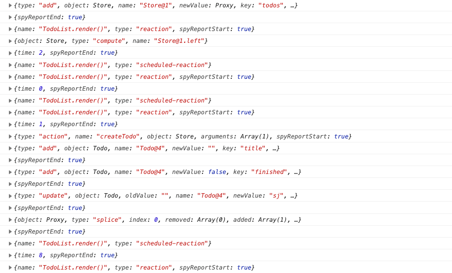

# mobx 的最佳实践

[TOC]

## 5-1 常用工具函数

mobx 为开发提供了一些工具函数，有些能提升开发时的效率，有些则是程序所必须的。

### observe

注意，此 `observe` 是 `mobx` 包中的，而非 `mobx-react` 中的 `observer`

`observe` 是一个纯函数，不能作为修饰器，它的功能如同它的名字是用于观察的，它更像是 `observable` 与 `reaction` 的结合体，或者也可以将其理解为监听器。如：

```jsx
class Store {
  @observable todos = []

  constructor(){
    // observe 只能监听当前所监听的对象，对于嵌套在其中的对象则不会被监听
    observe(this.todos, change => {
      // change 代表数据变化之后的状态，change.object 能够拿到被监听的对象
      console.log('change', change)
    })
  }
```

- 当 `todos`发生变化时，则会执行之后的回调，并传入 change 

对于嵌套在被监听对象中的对象，比如 `todos` 数组中的对象 `todo`，虽然 `observe` 无法直接监听，但也有办法简洁的监听到，如：

```jsx
class Store {
  @observable todos = []

  disposers = [];

  constructor(){
    // observe 只能监听当前所监听的对象，对于嵌套在其中的对象则不会被监听
    observe(this.todos, change => {
      // 先停止之前的监听
      this.disposers.forEach(disposer => disposer())
      // 并清空 disposer 清除器
      this.disposers = [];
      // 遍历 todos 中的 todo 对象并监听，然后将返回的 disposer 清除器添加到 disposers 数组中用于下一次停止监听
      for(let todo of change.object){
        // observe 会返回 disposer 函数，当 disposer 被执行则 observe 停止监视
        var disposer = observe(todo, change => {
          console.log('todo-change：',change);
        })
        this.disposers.push(disposer)
      }
      // change 代表数据变化之后的状态，change.object 能够拿到被监听的对象
      console.log('todos-change：', change)
    })
  }
```

- 通过在监听 `todos` 时所触发的回调中遍历 `todos`，再对 `todo` 条目进行监听，但要记得用一个 `disposers` 数组来存放 `disposer` 清除器，在每一次遍历之前将之前的监听清除掉。

不过这种方式只能监听一级嵌套，如果要监听 `todo` 中的对象则还需要再进行遍历，就会很麻烦。不过没有关系，mobx 还有更强大的 api —— `spy`

### spy

spy 顾名思义也是用于监控的，而其监控的是所有的事件，你所执行的每一个 action 和对可观察数据的每次修改，甚至 `autorun`，`reaction`的每次触发都能够被监控的到。

```jsx
import { spy } from 'mobx'
spy(event => {
  console.log(event);
});
```

- 全局监控，这样当我们做任何被 mobx 观察的数据、组件时都会执行这个回调，并传入 event：

  

- 可以看到，组件的 render() ，数据的添加、更新、拼接、删除都可以被监控到。

虽然 spy 很强大，可以监控所有的变化，但其强大的功能带来却是较大的性能损耗，如果没有强烈的需求，在生产环境中并不建议去使用。

 

### toJS

`toJS` 可以将 mobs 因监听而被转换的对象重新转换为纯对象，这样我们就可以序列化（字符串化）了。

比如有一个需求，我们需要在每次更改 `todos` 或者 `todo` 的时候将 `todos` 存储在本地的 localStorage 中，那么就需要将 `todos` 序列化为一个字符串方便存储。如下：

```jsx
constructor(){
    // observe 只能监听当前所监听的对象，对于嵌套在其中的对象则不会被监听
    observe(this.todos, change => {
      // 先停止之前的监听
      this.disposers.forEach(disposer => disposer())
      // 并清空 disposer 清除器
      this.disposers = [];
      // 遍历 todos 中的 todo 对象并监听，然后将返回的 disposer 清除器添加到 disposers 数组中用于下一次停止监听
      for(let todo of change.object){
        // observe 会返回 disposer 函数，当 disposer 被执行则 observe 停止监视
        var disposer = observe(todo, change => {
          // console.log('todo-change：',change);
          this.save()
        })
        this.disposers.push(disposer)
      }

      this.save()
      // change 代表数据变化之后的状态，change.object 能够拿到被监听的对象
      // console.log('todos-change：', change)
    })
  }

  // 由于 save 副作用并没有修改 observables，所以不需要使用 @action.bound 来修饰以提供性能
  save = () => {
    const todos = toJS(this.todos)
    localStorage.setItem('todos', JSON.stringify(todos))
  }
```

- 13 行中，监视 `todo` 时会执行 `save`，18 行中监视 `todos` 时会执行 `save`
- 由于 save 副作用并没有修改 observables，所以不需要使用 @action.bound 来修饰以提供性能


以上讲到的 mobx 工具函数都在很大程度上增强了应用程序的功能，到底都在关注着如何与数据打交道。

本来数据映射到副作用应该是 mobx 帮我们做的事情，但如果一旦发生不可预期的效果，我们还是应该知道如何去解决问题。以 React 为例，如果有连续性的前端交互需求，比如动画，我们应该知道一个组件何时会被重渲染，为何被重渲染，刚刚讲到的 `spy` 可以做到这一点，但是并不够直观。接下来我们将介绍 mobx 的另一个函数 `trace`


### trace

trace（追踪）需要在副作用中被调用，比如 react 中的 render 方法中调用 trace：

```jsx
import { trace } from 'mobx'
class TodoList extends Component {
  //...
  render(){
    trace()
    //...
  }
}
```

- 当我们在 `render` 中调用 `trance` 后，会在控制台中看到如下信息：

  ```
  [mobx.trace] 'TodoList.render()' tracing enabled
  ```

  表示 `TdoList.render()` 已经被追踪了

- 接着我们在输入框中输入信息时会收到如下信息：

  ```
  [mobx.trace] 'TodoList.render()' is invalidated due to a change in: 'reactive state'
  ```

  表示 state 的变化导致 TodoLIst 在重渲染


如果我们向 `trace` 中传入 `true` 参数：

```jsx
import { trace } from 'mobx'
class TodoList extends Component {
  //...
  render(){
    trace(true)
    //...
  }
}
```

- 当我们在输入框做输入操作的时候，程序会被断点阻断并在控制台中打印如下信息：

  ```jsx
  (function anonymous(
  ) {
  debugger;
  /*
  Tracing 'TodoList.render()'
  
  You are entering this break point because derivation 'TodoList.render()' is being traced and 'reactive state' is now forcing it to update.
  Just follow the stacktrace you should now see in the devtools to see precisely what piece of your code is causing this update
  The stackframe you are looking for is at least ~6-8 stack-frames up.
  
  
  
  The dependencies for this derivation are:
  
  TodoList.render()
  	reactive props
  	Store@1.todos
  	reactive state
  	Store@1.todos
  	Store@1.left
  		Store@1.todos
  		Store@1.todos
  */
  })
  ```

  这些注释会为我们说明被追踪的 `render()` 方法会因为哪些因素而重新执行更新，并且也能看到本次 `render()` 的执行是因为什么，比如这次是因为 `reactive state` 

trace 的这个功能对于 debugger 非常有用，并且还能帮助我们做性能优化。比如，这个应用中我们再在 `TodoItem` 组件的 `render` 方法中执行 `trace`，然后试着改变 `todo` 条目的 `finished` 状态，可以看到除了 `TodoItem` 组件重渲染以外，`TodoList` 也重新渲染了，并且也能知道是什么原因导致的，那么如果我们并不想让 `TodoList` 也重新渲染就可以根据信息做相应的处理。下节课我们将会尝试着来做一些处理使应用的性能变得更好。


## 5-2 最佳实践-提升性能

上节课所存在的问题是**不该重渲染的视图进行了重渲染**，而不该重渲染的视图是指 `TodoList` 组件，当我们改变某一 `todo` 条目的 `finished` 状态时，对于该状态应该只改变 `todo` 条目的视图也就是 `TodoItem` 才是，为什么却让 `TodoList` 也发生了重渲染呢？因为被 `computed` 修饰的数据与普通的可观察数据相同，当数据发生变化时则会触发行为，而在 `TodoList` 中的底部就使用到了 `computed` `left` 这个计算可观察数据，`left` 的改变则会强迫 `TodoList` 的更新，因此为了性能，我们可以将底部拆出来作为一个新的组件，使整个应用最小化的更新。

做这个事情之前，我们可以先在 `todoItem` 和 `todoList` 的 `render` 中调用 `trace`，这样会更方便调试，然后再声明一个新的组件 `TodoFooter`：

```jsx
@observer
class TodoFooter extends Component {
  render() { trace();
    const { left } = this.props
    return <footer>{left.length} items(s) unfinished</footer>
  }
}
// TodoList 组件的 render 中：
{/* 第三部分是提示区，提示当前的全局状态，比如还剩多少个 todo 没有完成 */}
<TodoFooter left={store.left} />
```

- 这里依然会触发 `TodoList` 的重渲染，原因是访问了 `computed` `left` ，所以我们需要传入 `store` 而非 `left`

```jsx
@observer
class TodoFooter extends Component {
  render() { trace();
    const { store } = this.props
    return <footer>{store.left.length} items(s) unfinished</footer>
  }
}
// TodoList 组件的 render 中：
{/* 第三部分是提示区，提示当前的全局状态，比如还剩多少个 todo 没有完成 */}
<TodoFooter store={store} />
```

- 所以如法则一所说那样：尽量晚（深）地解构（取出）可观察的数据

虽然我们将 store 传给了 `TodoFooter` ，让 `store.left` 在最需要使用这个数据时被访问，但依然会重渲染 `TodoList` 组件，原因是在 `ul` 元素中有遍历 `todos` 中的 `todo` 来输出视图的行为，react 在渲染列表时有一个怪癖，列表的任何成员有了变化则会尝试重新评估整个列表，这也会间接地触发 `TodoList` 的重渲染，所以我们需要将遍历 `todos` 的行为拆分到独立的组件中去，也就是法则二：用单独的组件映射集合。拆分如下：

```jsx
@observer
class TodoView extends Component {
  render() {
    trace()
    const { todos } = this.props
    return todos.map(todo => (
      <li className="todo-item" key={todo.id}>
        <TodoItem todo={todo} />
        <button className="delete" onClick={e => store.deleteTodo(todo)}>
          删除
        </button>
      </li>
    ))
  }
}

// TodoList 组件的 render 中：
{/* 第二部分为显示区，显示所有的 todo 条目，并提供操作方式给用户，可以 finish 这个条目，也可以删除这个条目 */}
<ul>
  <TodoView todos={todos} />
</ul>
```

- 这样拆分之后，当我们改变 `todo` 条目的 `finished` 状态时，`todoList` 组件就不会重新渲染了，而发生重渲染的组件是 `TodoItem` `TodoView` `TodoFooter`

不过现在还不够完美，因为当我们在输入框中输入内容时，`TodoList` 会不停的重渲染

（这里经由测试，我在所有组件的 `render` 方法中都添加了 `console.log`，当 `TodoList` 重新渲染时，只有 `TodoList` 的 `render` 会执行，其余的组件的 `render` 并不会执行）

为了让 `TodoList` 不随输入框的内容变化而重渲染，则将输入框部分的视图从 `TodoList` 提出来单独作为一个组件 `TodoHeader`：

 ```jsx
@observer
class TodoHeader extends Component {
  state = {
    inputValue: ''
  }

  // 由于 handleSubmit 是用户操作所触发的事件，所以它一定有一个事件对象参数 e
  handleSubmit = e => {
    // 由于是表单提交，我们要阻止整个页面被提交：
    e.preventDefault()
    // 现在让我们回到 handleSubmit 继续处理提交事件
    // 在阻止默认事件行为后，我们要从 state 中取得当前 input 的 value，然后创建一个 todo 条目并放到 store.todos 数组中去
    const { inputValue } = this.state
    const { store } = this.props

    store.createTodo(inputValue)

    this.setState({
      inputValue: ''
    })
  }

  handleChange = e => {
    let inputValue = e.target.value
    this.setState({
      inputValue
    })
  }

  render() {
    return (
      <header>
        {/* 为了提交的多样化，添加 form 元素，并监听其 submit 事件 */}
        <form action="" onSubmit={this.handleSubmit}>
          <input
            type="text"
            onChange={this.handleChange}
            value={this.state.inputValue}
            className="input"
            placeholder="What needs to be finished?"
          />
        </form>
      </header>
    )
  }
}

// TodoList 组件的 render 中：
{/* 第一个部分输入区域，有一个输入框用于输入一个新的 todo 条目的 title，回车会创建一个新的 todo 条目 */}
<TodoHeader store={store}/>
 ```

- 这样拆解过后，当你在输入框中输入内容，`TodoList` 就不会再重新渲染了，这也就是法则三：尽可能细的拆分视图组件。

这三个法则能够帮助我们在相当高的水平上优化 react 组件，这里的 Todo List 应用程序还只是一个比较简单的例子，理论上，数据结构和视图层次越复杂优化的效果就会越好，**如果做到极致，数据字段的变动与对应视图的变化是一对一的**，从而不会增加一丝一毫的多余渲染。


三大法则：

- 1.尽量晚（深）地解构（取出）可观察的数据
- 2.使用专用组件处理列表（用单独的组件映射集合）
- 3.细粒度拆分视图组件（尽可能细的拆分组件）


> 问答精选：
>
> TodoList 不会渲染了，但是新增加的 TodoView 会重新渲染，修改 finished 状态还是会导致列表组件(TodoView)重渲染，这个是正常的吗？
>
> - 正常， 相当于你已经在更细粒度的组件内进行重复渲染了，对其他不需要渲染的部分影响更小了
>
> 
>
> TodoList 的确不会重新渲染了，但是新增加的TodoView会重新渲染呀！如果trace新分离出的TodoView，就会发现TodoView还是渲染了！
>
> - TodoList除了TodoView、TodoFooter以外，还有TodoHeader，而TodoItem组件组成了TodoView组件，所以TodoList组件渲染和TodoView组件渲染是有本质区别的。TodoList组件相当于一个容器组件，它的渲染是整个大组件的渲染，TodoView的渲染只是其中一个部分的渲染。
>
>   在这里区别可能不明显，主要是因为这个项目太小了，如果是大型前端项目，一个小组件的改变引起整个大组件的渲染，渲染效率是会打很大折扣的。这也不符合React组件化的初衷。

 