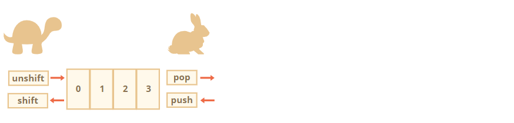
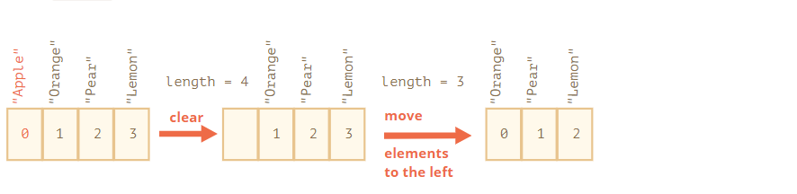
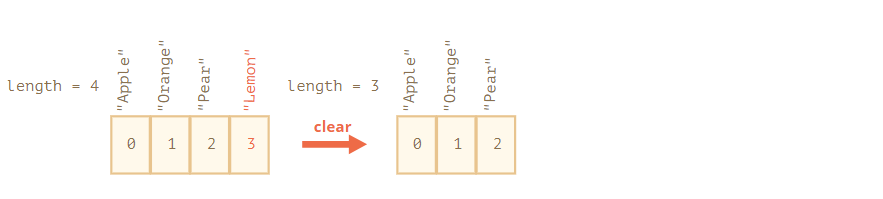

# 数组

[toc]

对象允许存储键值集合，这很好。

但很多时候我们发现还需要 **有序集合**，里面的元素都是**按顺序排列的**。例如，我们可能需要存储一些列表，比如用户、商品以及 HTML 元素等。

这里使用对象就不是很方便了，**因为对象不能提供能够管理元素顺序的方法**。我们不能在已有的元素“之间”插入一个新的属性。这种场景下对象就不太适用了。

> 虽然环境没有提供在对象中插入属性的方法，但我们自己可以尝试着写一下，比如：
>
> ```js
> function insertPropInObj(obj, beforeKey, insertProp){
>     return Object.entries(obj).reduce(function(res,[key,value]){
>         res[key] = value
>         if(key === beforeKey){
>            res[insertProp[0]] = insertProp[1]
>         }
>         return res // reduce 要记得返回
>     },{})
> }
> 
> var obj = {a:1, b:2, c:3}
> insertPropInObj(obj, 'b', ['d',4]) // -> {a: 1, b: 2, d: 4, c: 3}
> ```

这时一个特殊的数据结构数组（`Array`）就派上用场了，它能存储有序的集合。

## [声明](https://zh.javascript.info/array#sheng-ming)

创建一个空数组有两种语法：

```javascript
let arr = new Array();
let arr = [];
```

绝大多数情况下使用的都是第二种语法。我们可以在方括号中添加初始元素：

```javascript
let fruits = ["Apple", "Orange", "Plum"];
```

数组元素从 0 开始编号。

我们可以通过方括号中的数字获取元素：

```javascript
let fruits = ["Apple", "Orange", "Plum"];

alert( fruits[0] ); // Apple
alert( fruits[1] ); // Orange
alert( fruits[2] ); // Plum
```

可以替换元素：

```javascript
fruits[2] = 'Pear'; // 现在变成了 ["Apple", "Orange", "Pear"]
```

……或者向数组新加一个元素：

```javascript
fruits[3] = 'Lemon'; // 现在变成 ["Apple", "Orange", "Pear", "Lemon"]
```

`length` 属性的值是数组中元素的总个数：

```javascript
let fruits = ["Apple", "Orange", "Plum"];

alert( fruits.length ); // 3
```

也可以用 `alert` 来显示整个数组。

```javascript
let fruits = ["Apple", "Orange", "Plum"];

alert( fruits ); // Apple,Orange,Plum
```

数组可以存储任何类型的元素。

例如:

```javascript
// 混合值
let arr = [ 'Apple', { name: 'John' }, true, function() { alert('hello'); } ];

// 获取索引为 1 的对象然后显示它的 name
alert( arr[1].name ); // John

// 获取索引为 3 的函数并执行
arr[3](); // hello
```

**以逗号结尾**

数组就像对象一样，可以以逗号结尾：

```javascript
let fruits = [
  "Apple",
  "Orange",
  "Plum",
];
```

因为**每一行都是相似的**，所以这种以“逗号结尾”的方式使得插入/移除项变得更加简单。

## [pop/push, shift/unshift 方法](https://zh.javascript.info/array#poppushshiftunshift-fang-fa)

[队列（queue）](https://en.wikipedia.org/wiki/Queue_(abstract_data_type))是数组最常见的用途之一。在计算机科学中，这表示支持两个操作的一个有序元素的集合：

- `push` 在末端添加一个元素.
- `shift` 取出队列最前端的一个元素，整个队列往前移，这样原先排第二的元素现在排在了第一。


这两种操作数组都支持。

队列的应用在实践中经常会碰到。例如需要**在屏幕上显示消息队列**。

数组还有另一个用例，就是数据结构 [栈](https://en.wikipedia.org/wiki/Stack_(abstract_data_type))。

它支持两种操作：

- `push` 在末端添加一个元素.
- `pop` 从末端取出一个元素.

所以**新元素的添加和取出都是从“末端”开始的**。

栈通常被被形容成一叠卡片：要么在最上面添加卡片，要么从最上面拿走卡片：


对于栈来说，最后放进去的内容是最先接收的，也叫做 LIFO（Last-In-First-Out），即后进先出法则。而与队列相对应的叫做 FIFO（First-In-First-Out），即先进先出。

JavaScript 中的数组既可以用作队列，也可以用作栈。它们允许你从前端/末端来添加/删除元素。

这在计算机科学中，允许这样的操作的数据结构被称为 [双端队列（deque）](https://en.wikipedia.org/wiki/Double-ended_queue)。

**作用于数组末端的方法：**

- `pop`

  取出并返回数组的最后一个元素：

  ```js
  let fruits = ["Apple", "Orange", "Pear"];
  
  alert( fruits.pop() ); // 移除 "Pear" 然后 alert 显示出来
  
  alert( fruits ); // Apple, Orange
  ```

- `push`

  在数组末端添加元素：

  ```js
  let fruits = ["Apple", "Orange"];
  
  fruits.push("Pear");
  
  alert( fruits ); // Apple, Orange, Pear
  ```

  调用 `fruits.push(...)` 与 `fruits[fruits.length] = ...` 是一样的。

**作用于数组前端的方法：**

- `shift`

  取出数组的第一个元素并返回它：

  ```js
  let fruits = ["Apple", "Orange", "Pear"];
  
  alert( fruits.shift() ); // 移除 Apple 然后 alert 显示出来
  
  alert( fruits ); // Orange, Pear
  ```

  

- `unshift`

  在数组的前端添加元素：

  ```js
  let fruits = ["Orange", "Pear"];
  
  fruits.unshift('Apple');
  
  alert( fruits ); // Apple, Orange, Pear
  ```

`push` 和 `unshift` 方法都可以一次添加多个元素：

```javascript
let fruits = ["Apple"];

fruits.push("Orange", "Peach");
fruits.unshift("Pineapple", "Lemon");

// ["Pineapple", "Lemon", "Apple", "Orange", "Peach"]
alert( fruits );
```

## [内部](https://zh.javascript.info/array#nei-bu)

**数组是一种特殊的对象**。使用方括号来访问属性 `arr[0]` **实际上是来自于对象的语法**。它其实与 `obj[key]` 相同，其中 `arr` 是对象，而数字用作键（key）。

它们扩展了对象，提供了特殊的方法来处理有序的数据集合以及 `length` 属性。但从本质上讲，它仍然是一个对象。

记住，在 JavaScript 中只有 8 种基本类型。数组是一个对象，因此其行为也像一个对象。

例如，它**是通过引用来复制的**：

```javascript
let fruits = ["Banana"]

let arr = fruits; // 通过引用复制 (两个变量引用的是相同的数组)

alert( arr === fruits ); // true

arr.push("Pear"); // 通过引用修改数组

alert( fruits ); // Banana, Pear — 现在有 2 项了
```

……但是数组真正特殊的是它们的**内部实现**。JavaScript 引擎尝试**把这些元素一个接一个地存储在连续的内存区域**，就像本章的插图显示的一样，而且还有**一些其它的优化，以使数组运行得非常快**。

但是，**如果我们不像“有序集合”那样使用数组，而是像常规对象那样使用数组，这些就都不生效了**。

例如，从技术上讲，我们可以这样做:

```javascript
let fruits = []; // 创建一个数组

fruits[99999] = 5; // 分配索引远大于数组长度的属性

fruits.age = 25; // 创建一个具有任意名称的属性
```

这是可以的，因为数组是基于对象的。我们可以给它们添加任何属性。

**但是 Javascript 引擎会发现，我们在像使用常规对象一样使用数组，那么针对数组的优化就不再适用了，然后对应的优化就会被关闭，这些优化所带来的优势也就荡然无存了**。

数组误用的几种方式:

- 添加一个非数字的属性，比如 `arr.test = 5`。
- 制造空洞，比如：添加 `arr[0]`，然后添加 `arr[1000]` (它们中间什么都没有)。
- 以倒序填充数组，比如 `arr[1000]`，`arr[999]` 等等。

请将数组视为作用于 **有序数据** 的特殊结构。它们为此提供了特殊的方法。数组在 JavaScript 引擎内部是经过特殊调整的，使得更好地作用于连续的有序数据，所以请以正确的方式使用数组。如果你需要任意键值，那很有可能实际上你需要的是常规对象 `{}`。

## [性能](https://zh.javascript.info/array#xing-neng)

`push/pop` 方法运行的比较快，而 `shift/unshift` 比较慢。



为什么作用于数组的末端会比前端快呢？让我们看看在执行期间都发生了什么：

```javascript
fruits.shift(); // 从前端取出一个元素
```

**只获取并移除数字 `0` 对应的元素是不够的。其它元素也需要被重新编号**。

`shift` 操作必须做三件事:

1. 移除索引为 `0` 的元素。
2. 把所有的元素向左移动，把索引 `1` 改成 `0`，`2` 改成 `1` 以此类推，对其重新编号。
3. 更新 `length` 属性。



**数组里的元素越多，移动它们就要花越多的时间，也就意味着越多的内存操作。**

`unshift` 也是一样：为了在数组的前端添加元素，我们首先需要将现有的元素向右移动，增加它们的索引值。

那 `push/pop` 是什么样的呢？它们不需要移动任何东西。如果从末端移除一个元素，`pop` 方法只需要清理索引值并缩短 `length` 就可以了。

`pop` 操作的动作:

```javascript
fruits.pop(); // 从末端取走一个元素
```



**`pop` 方法不需要移动任何东西，因为其它元素都保留了各自的索引。这就是为什么 `pop` 会特别快。**

`push` 方法也是一样的。

> 这里也说明了对于语言或者计算机而言，其内部也遵循某种方式来操作数据或内存，而这种方式是有其利弊与限制的。并且其步骤也具有一定的逻辑顺序。

## [循环](https://zh.javascript.info/array#xun-huan)

遍历数组最古老的方式就是 `for` 循环：

```javascript
let arr = ["Apple", "Orange", "Pear"];

for (let i = 0; i < arr.length; i++) {
  alert( arr[i] );
}
```

但对于数组来说还有另一种循环方式，`for..of`：

```javascript
let fruits = ["Apple", "Orange", "Plum"];

// 遍历数组元素
for (let fruit of fruits) {
  alert( fruit );
}
```

`for..of` 不能获取当前元素的索引，只是获取元素值，但大多数情况是够用的。而且这样写更短。

技术上来讲，因为数组也是对象，所以使用 `for..in` 也是可以的：

```javascript
let arr = ["Apple", "Orange", "Pear"];

for (let key in arr) {
  alert( arr[key] ); // Apple, Orange, Pear
}
```

**但这其实是一个很不好的想法**。会有一些潜在问题存在：

1. `for..in` 循环会遍历 **所有属性**，不仅仅是这些数字属性。

   在浏览器和其它环境中有一种称为“类数组”的对象，它们 **看似是数组**。也就是说，它们有 `length` 和索引属性，但是**也可能有其它的非数字的属性和方法**，这通常是我们不需要的。`for..in` 循环会把它们都列出来。所以**如果我们需要处理类数组对象，这些“额外”的属性就会存在问题**。

2. **`for..in` 循环适用于普通对象，并且做了对应的优化**。但是不适用于数组，因此速度要慢 10-100 倍。当然即使是这样也依然非常快。只有在遇到瓶颈时可能会有问题。但是我们仍然应该了解这其中的不同。

**通常来说，我们不应该用 `for..in` 来处理数组**。

## [关于 “length”](https://zh.javascript.info/array#guan-yu-length)

当我们修改数组的时候，`length` 属性会自动更新。准确来说，**它实际上不是数组里元素的个数，而是最大的数字索引值加一**。

例如，一个数组只有一个元素，但是这个元素的索引值很大，那么这个数组的 `length` 也会很大：

```javascript
let fruits = [];
fruits[123] = "Apple";

alert( fruits.length ); // 124
```

要知道的是我们通常不会这样使用数组。

`length` 属性的另一个有意思的点是它是**可写的**。

如果我们手动增加它，则不会发生任何有趣的事儿。但是**如果我们减少它，数组就会被截断。该过程是不可逆的**，下面是例子：

```javascript
let arr = [1, 2, 3, 4, 5];

arr.length = 2; // 截断到只剩 2 个元素
alert( arr ); // [1, 2]

arr.length = 5; // 又把 length 加回来
alert( arr[3] ); // undefined：被截断的那些数值并没有回来
```

所以，**清空数组最简单的方法就是：`arr.length = 0;`**。

## [new Array()](https://zh.javascript.info/array#new-array)

这是创建数组的另一种语法：

```javascript
let arr = new Array("Apple", "Pear", "etc");
```

它很少被使用，因为方括号 `[]` 更短更简洁。而且这种语法还**存在一些诡异的特性**。

如果使用单个参数（即数字）调用 `new Array`，那么它会创建一个 **指定了长度，却没有任何项** 的数组。

让我们看看如何搬起石头砸自己的脚:

```javascript
let arr = new Array(2); // 会创建一个 [2] 的数组吗？

alert( arr[0] ); // undefined！没有元素。

alert( arr.length ); // length 2
```

在上面的代码中，`new Array(number)` 创建的数组的所有元素都是 `undefined`。

为了避免这种乌龙事件，我们通常都是使用方括号的，除非我们清楚地知道自己正在做什么。

## [多维数组](https://zh.javascript.info/array#duo-wei-shu-zu)

数组里的项也可以是数组。我们可以将其用于多维数组，例如存储矩阵：

```javascript
let matrix = [
  [1, 2, 3],
  [4, 5, 6],
  [7, 8, 9]
];

alert( matrix[1][1] ); // 最中间的那个数
```

## [toString](https://zh.javascript.info/array#tostring)

数组有自己的 `toString` 方法的实现，会返回以逗号隔开的元素列表。

例如：

```javascript
let arr = [1, 2, 3];

alert( arr ); // 1,2,3
alert( String(arr) === '1,2,3' ); // true
```

此外，我们试试运行一下这个：

```javascript
alert( [] + 1 ); // "1"
alert( [1] + 1 ); // "11"
alert( [1,2] + 1 ); // "1,21"
```

> `+` 操作符会首先让被操作元进行转换，这里 `[]` 在面对 `+` 二元操作符时会启用 `hint` 为 `default` 的值，但由于数组只有 `toString` 方法所以只会调用 `toString`

数组没有 `Symbol.toPrimitive`，也没有 `valueOf`，它们只能执行 `toString` 进行转换，所以这里 `[]` 就变成了一个空字符串，`[1]` 变成了 `"1"`，`[1,2]` 变成了 `"1,2"`。

当 `"+"` 操作符把一些项加到字符串后面时，加号后面的项也会被转换成字符串，所以下一步就会是这样：

```javascript
alert( "" + 1 ); // "1"
alert( "1" + 1 ); // "11"
alert( "1,2" + 1 ); // "1,21"
```

## [总结](https://zh.javascript.info/array#zong-jie)

数组是一种特殊的对象，适用于存储和管理有序的数据项。

- 声明:

  ```javascript
  // 方括号 (常见用法)
  let arr = [item1, item2...];
  
  // new Array (极其少见)
  let arr = new Array(item1, item2...);
  ```

  调用 `new Array(number)` 会创建一个给定长度的数组，但不含有任何项。

- `length` 属性是数组的长度，准确地说，它是数组最后一个数字索引值加一。它由数组方法自动调整。

- 如果我们手动缩短 `length`，那么数组就会被截断。

我们可以通过下列操作以**双端队列**的方式使用数组：

- `push(...items)` 在末端添加 `items` 项。
- `pop()` 从末端移除并返回该元素。
- `shift()` 从前端移除并返回该元素。
- `unshift(...items)` 从前端添加 `items` 项。

遍历数组的元素：

- `for (let i=0; i<arr.length; i++)` — 运行得最快，可兼容旧版本浏览器。
- `for (let item of arr)` — 现代语法，只能访问 items。
- `for (let i in arr)` — 永远不要用这个。

在下一章节 [数组方法](https://zh.javascript.info/array-methods) 中，我们会继续学习数组，学习更多添加、移除、提取元素和数组排序的方法。


## 任务

### [在数组上下文调用](https://zh.javascript.info/array#zai-shu-zu-shang-xia-wen-tiao-yong)

重要程度: 5

结果是什么？为什么？

```javascript
let arr = ["a", "b"];

arr.push(function() {
  alert( this );
})

arr[2](); // ?
```

> `arr[2]()` 调用从句法来看可以类比于 `obj[method]()`，与 `obj` 对应的是 `arr`，与 `method` 对应的是 `2`。
>
> 所以调用 `arr[2]` 函数也就是**调用对象函数**。自然地，它接收 `this` 引用的对象 `arr` 然后输出该数组：
>
> ```javascript
> let arr = ["a", "b"];
> 
> arr.push(function() {
>   alert( this );
> })
> 
> arr[2](); // "a","b",function
> ```
>
> 该数组有 3 项：最开始有两个，后来添加进来一个函数。


> 仔细看，我们可能注意到 `obj.method()` 语句中有**两个操作符**。
>
> 1. 首先，**点符号 `'.'` 取得这个 `obj.method` 属性**。
> 2. 其后的**括号 `()` 调用它**。
>
> 那么，**`this` 是怎样被从第一部分传递到第二部分的呢**？
>
> **如果把这些操作拆分开，那么 `this` 肯定会丢失**：
>
> ```javascript
> let user = {
>   name: "John",
>   hi() { alert(this.name); }
> }
> 
> // 将赋值与方法调用拆分为两行
> let hi = user.hi;
> hi(); // 错误，因为 this 未定义
> ```
>
> 这里 `hi = user.hi` 把函数赋值给变量，其后的最后一行代码是完全独立的，所以它没有 `this`。
>
> **为了让 `user.hi()` 有效，JavaScript 用了一个技巧 —— 这个 `'.'` 点符号返回的不是一个函数，而是一种特殊的 [引用类型](https://tc39.github.io/ecma262/#sec-reference-specification-type) 的值。**
>
> **引用类型是一种“规范中有的类型”**。我们不能明确地指定它，但**它被用在编程语言的内部**。
>
> 引用类型的值是三部分的结合 `(base, name, strict)`，如下：
>
> - `base` 是对象。
> - `name` 是属性名。
> - 在严格模式 `use strict` 下，`strict` 为真。
>
> 属性访问 `user.hi` 的结果不是函数，而是引用类型。在严格模式下的 `user.hi` 是：
>
> ```javascript
> // 引用类型值
> (user, "hi", true)
> ```
>
> 括号 `()` 调用引用类型时，将接收关于该对象及其方法的所有信息，并且可以设定正确的 `this` 值（这里等于 `user`）。
>
> **引用类型是一种特殊的“中间”内部类型**，用于将信息从点符号 `.` 传递到调用括号 `()`。
>
> 像**赋值** `hi = user.hi` 等**其他的操作**，**将引用类型作为一个整体丢弃，只获取 `user.hi`（一个函数）的值进行传递**。因此，任何进一步的操作都会“失去” `this`。
>
> 因此，结果是，**只有使用点符号 `obj.method()` 或方括号语法 `obj[method]()`（它们在这里作用相同）调用函数时，`this` 的值才被正确传递（这里的例子也一样）**。在本教程的后面，我们将学习解决此问题的各种方法，例如 [func.bind()](https://zh.javascript.info/bind#solution-2-bind)。


### [输入数字求和](https://zh.javascript.info/array#shu-ru-shu-zi-qiu-he)

写出函数 `sumInput()`，要求如下：

- 使用 `prompt` 向用户索要值，并存在数组中。
- 当用户输入了非数字、空字符串或者点击“取消”按钮的时候，问询结束。
- 计算并返回数组所有项之和。

P.S. `0` 是有效的数字，不要因为是 0 就停止问询。

> 请注意这个解决方案的细微但是很重要的细节。我们没有在 `prompt` 后立即把 `value` 转换成数字，因为在执行 `value = +value` 之后，就没办法区分出空字符串（中断标志）和数字 0（合法输入）了，所以要放到后面再处理。
>
> ```javascript
> function sumInput() {
> 
>   let numbers = [];
> 
>   while (true) {
> 
>     let value = prompt("A number please?", 0);
> 
>     // 应该结束了吗？
>     if (value === "" || value === null || !isFinite(value)) break; //(*)
> 
>     numbers.push(+value);
>   }
> 
>   let sum = 0;
>   for (let number of numbers) {
>     sum += number;
>   }
>   return sum;
> }
> 
> alert( sumInput() );
> ```
>
> > `(*)` 行的代码，在 `if` 条件中的最后一个表达式，我自己写的代码是使用 `isNaN(+input)` 来判断是否为数字，但是并不周全，没有考虑回有  `Infinity` 的情况（确实会有，当你输入够长的数字字符之后会自动转换为 `Infinity`），所以最好是通过 `isFinite()` 来判断是否为有限数字的情况。


### [最大子数组](https://zh.javascript.info/array#zui-da-zi-shu-zu)

重要程度: 2

输入是以数字组成的数组，例如 `arr = [1, -2, 3, 4, -9, 6]`.

任务是：找出所有项的和最大的 `arr` 数组的连续子数组。

写出函数 `getMaxSubSum(arr)`，用其找出并返回最大和。

例如：

```javascript
                                               getMaxSubSum([-1, 2, 3, -9]) == 5（高亮项的加和）
getMaxSubSum([2, -1, 2, 3, -9]) == 6
getMaxSubSum([-1, 2, 3, -9, 11]) == 11
getMaxSubSum([-2, -1, 1, 2]) == 3
getMaxSubSum([100, -9, 2, -3, 5]) == 100
getMaxSubSum([1, 2, 3]) == 6（所有项的和）
```

如果所有项都是负数，那就一个项也不取（子数组是空的），所以返回的是 0：

```javascript
getMaxSubSum([-1, -2, -3]) = 0
```

请尝试想出一个快速的解决方案：复杂度可以是 [O(n2)](https://en.wikipedia.org/wiki/Big_O_notation)，有能力达到 O(n) 则更好。

#### 慢的解决方案

> 我们可以计算所有可能的子集的和。
>
> 最简单的方法就是获取每个元素然后计算从它开始所有子数组的和。
>
> 以 `[-1, 2, 3, -9, 11]` 为例：
>
> ```javascript
> // 从 -1 开始：
> -1
> -1 + 2
> -1 + 2 + 3
> -1 + 2 + 3 + (-9)
> -1 + 2 + 3 + (-9) + 11
> 
> // 从 2 开始：
> 2
> 2 + 3
> 2 + 3 + (-9)
> 2 + 3 + (-9) + 11
> 
> // 从 3 开始：
> 3
> 3 + (-9)
> 3 + (-9) + 11
> 
> // 从 -9 开始：
> -9
> -9 + 11
> 
> // 从 -11 开始：
> -11
> ```
>
> 这样写出来的代码实际上是一个嵌套循环：外部循环遍历数组所有元素，内部循环计算从当前元素开始的所有子数组各自的和。
>
> ```javascript
> function getMaxSubSum(arr) {
>   let maxSum = 0; // 如果没有取到任何元素，就返回 0
> 
>   for (let i = 0; i < arr.length; i++) {
>     let sumFixedStart = 0;
>     for (let j = i; j < arr.length; j++) {
>       sumFixedStart += arr[j];
>       maxSum = Math.max(maxSum, sumFixedStart);
>     }
>   }
> 
>   return maxSum;
> }
> 
> alert( getMaxSubSum([-1, 2, 3, -9]) ); // 5
> alert( getMaxSubSum([-1, 2, 3, -9, 11]) ); // 11
> alert( getMaxSubSum([-2, -1, 1, 2]) ); // 3
> alert( getMaxSubSum([1, 2, 3]) ); // 6
> alert( getMaxSubSum([100, -9, 2, -3, 5]) ); // 100
> ```
>
> 该方案的时间复杂度是 [O(n2)](https://en.wikipedia.org/wiki/Big_O_notation)。也就是说，如果我们把数组大小增加 2 倍，那么算法的运行时间将会延长4倍。
>
> 对于大型数组（1000，10000 或者更多项）这种算法会导致严重的时间消耗。

#### 快的解决方案


让我们遍历数组，将当前局部元素的和保存在变量 `s` 中。如果 `s` 在某一点变成负数了，就重新分配 `s=0`。所有 `s` 中的最大值就是答案。

> 如果文字描述不太好理解，就直接看下面的代码吧，真的很短：
>
> ```javascript
> function getMaxSubSum(arr) {
>   let maxSum = 0;
>   let partialSum = 0;
> 
>   for (let item of arr) { // arr 中的每个 item
>     partialSum += item; // 将其加到 partialSum
>     maxSum = Math.max(maxSum, partialSum); // 记住最大值
>     if (partialSum < 0) partialSum = 0; // 如果是负数就置为 0
>   }
> 
>   return maxSum;
> }
> 
> alert( getMaxSubSum([-1, 2, 3, -9]) ); // 5
> alert( getMaxSubSum([-1, 2, 3, -9, 11]) ); // 11
> alert( getMaxSubSum([-2, -1, 1, 2]) ); // 3
> alert( getMaxSubSum([100, -9, 2, -3, 5]) ); // 100
> alert( getMaxSubSum([1, 2, 3]) ); // 6
> alert( getMaxSubSum([-1, -2, -3]) ); // 0
> ```
>
> 该算法只需要遍历 1 轮数组，所以时间复杂度是 O(n)。
>
> 你也可以在这获取更多该算法的细节信息：[最大子数组问题](http://en.wikipedia.org/wiki/Maximum_subarray_problem)。如果还是不明白，那就调试上面的例子，观察它是怎样工作的，**说得再多也没有自己去调试好使**。
>
> [使用沙箱的测试功能打开解决方案。](https://plnkr.co/edit/Bz05s6CXeeu3hZllIFQt?p=preview)