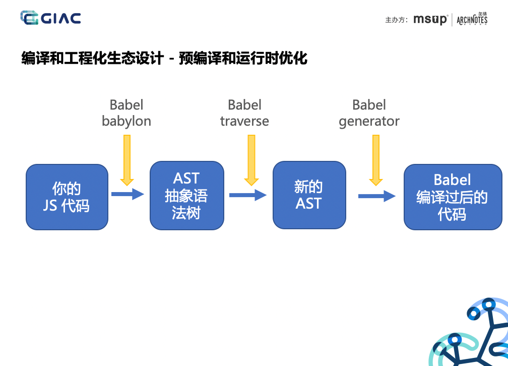
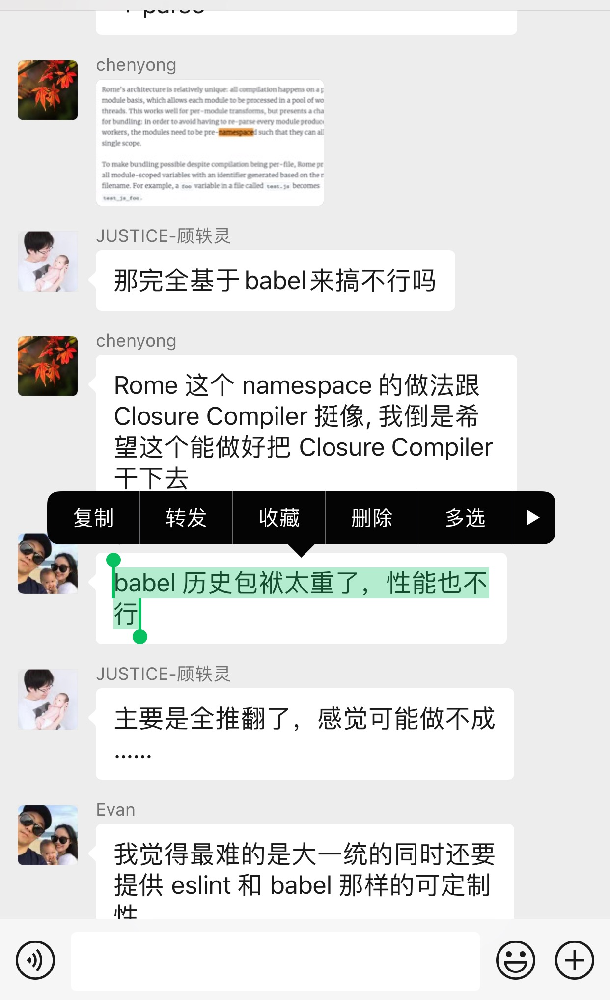

[toc]

### webql 比 canvas性能还好？

- canvas 2D上下文是cpu渲染 webgl 3D上下文是gpu渲染 当然好
- webgl本来就要借助canvas元素来渲染啊
- 上下文不同，分2d和3d的

#### canvas可以开启gpu渲染吗？

- 可以 css也行

### babel 的工作原理

其实问这个真的很好回答。因为一般面试官只能是简单聊聊，聊谁不会啊…又不真让你手写处理分词，手写一个 tokenizer 

你就回答，先把代码分析成 AST，再根据 AST 结构做变形，最后再把变形后的 AST 合成成代码就行了。再稍微详细点就是：babel 基于 babylon 分析成 AST，通过 babel transform 操作 AST，改变代码结构，再通过 babel generator 合成新的代码……

> AST：Abstract syntax tree（抽象语法树）

这只是概念啊……你知道了，就这么说，说都会吧……哈哈。一般面试官就问不了啥了…………顶多再问你有没有写过 babel 插件，你没写过就说了解过就行，原理就是上面那个…哈哈哈  不要怕，真的其实是送分题

Babel 通过 babylon  将 js 代码转化为 AST 语法树，通过 babel-traverse 修改 AST，最后，Babel 再通过 babel-generator 将 AST 生成 js 代码。——就这么一句话

就这个图 我在之前一个分享上的 PPT 临时改的。

[**面试官: 你了解过Babel吗？写过Babel插件吗? 答: 没有。卒**](https://cnodejs.org/topic/5a9317d38d6e16e56bb808d1)

现在有面试官再问 你就用小右刚说的……：

