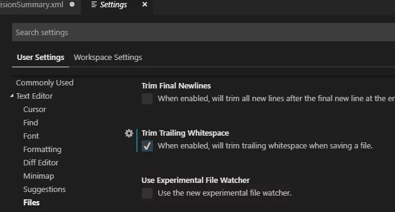

# 使用技巧

[toc]

## eslint 保存自动格式化

打开 文件 -> 首选项 -> 设置 -> 点击任意一个 ‘在setting.json中编辑’, 打开配置文件，添加一下代码就OK!

```json
 "eslint.autoFixOnSave": true,
 "eslint.validate": [
      "javascript",
      "javascriptreact",
      "html",
      {
        "language": "vue",
        "autoFix": true
      },
      "typescript",
      "typescriptreact"
  ]
```

## 代码片段的使用

通过代码片段，可以用预定义快捷键，快速生成自定的代码片段，对于开发效率的提高很有裨益。打开 文件 -> 首选项 -> 用户代码片段 弹出菜单有 ‘新建全局代码片段文件’和 ‘新建项目代码片段’，根据自己需要灵活选择 如下是笔者的react代码片段，供参考：

```json
{
  "React template": {
  "scope": "javascript,jsx",
  "prefix": "irea",
  "body": [
    "import React, {Component} from 'react'",
    "",
    "class $1 extends Component{",
    "  render () {",
    "    return (",
    "      <>",
    "         $2",
    "      </>",
    "   )",
    "  }",
    "}",
    "",
    "export default $1"
  ],
  "description": "react template"
  }
}
```

其中的scope 是代码片段用于那些文件，本例的用于js和jsx 文件；prefix 是自定义的快捷键；body是自定义的内容，将会插到文件中， $1 $2 等是光标的位置；description 是代码片段的描述。

## 引入文件路径提示

在开发时，我们可能会通过webpack定义一些路径别名，但是路径补全插件不认识这些路径别名，所以在别名引入时就不能用了，别着急，我们可以通过配置插件的路径别名来达到目的。如下是我的Path Intellisense 插件配置供参考，还是打开vscode配置 "setting.json" 文件,添加如下配置：

```json
  "path-intellisense.mappings": {
      "@": "${workspaceRoot}/src",
      "components": "${workspaceRoot}/src/components",
      "assets": "${workspaceRoot}/src/assets",
      "util": "${workspaceRoot}/src/util",
      "plugin": "${workspaceRoot}/src/plugin"
  },
```

需要注意的是这里配置的别名路径要和项目里配置的一一对应，可以把配置文件修改放在项目配置里而不是全局配置。

> 来源地址：https://mp.weixin.qq.com/s/4CylBqAQ7MWyU3Oqt5l0nA


## **清除行尾的空格**

这个命令帮助你删除行首和行尾的多余空白，并且把你从各式各样的严格代码检查中脱离出来。


提示： 在你完成文件中的代码的最后，使用它。或者，你可以在设置中启用空格清除设置：


1）打开用户设置（Preperences > Settings > User Settings tab）。

2）点击窗口右上角的{}`图标，会打开一个文档。

3）如果这里没有的话，添加一个新的设置"files.trimTrailingWhitespace": true。这样一来，你就可以添加一个设置，而不是直接修改默认设置。

4）保存用户设置文件。


我们也可以绑定一个快捷键去手动触发空格清除(快捷键面板里的 Trim Trailing Whitespace)。


如果你使用了新版本的 VS Code ，那么按照步骤一，然后看下面的图片。


