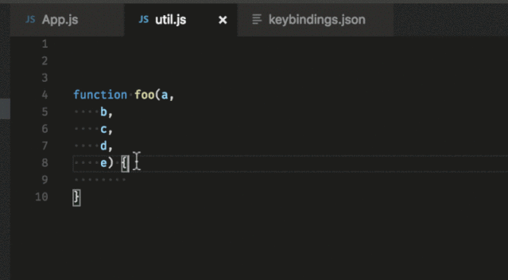

# 快捷键

[TOC]

## **合并为一行**

• On Mac: `Ctrl + J`

• 在 `Ubuntu`、`Windows`：在 `File` > `Preferences` > `Keyvoard shortcuts` 打开快捷键设置，并将选择的快捷键绑定在 `edtior.action.joinLines` 上。

## **折叠代码**

有时候如果代码很多，并且你只想整体了解下，那么折叠代码就会很有用。

1）收起光标处里边未折叠区域的代码

• On Windows /Ubuntu: `Ctrl + Shift + [`

• On Mac: `Command+ Option + [`

2）打开光标处折叠区域的代码

• On Windows /Ubuntu: `Ctrl + Shift + ]`

• On Mac: `Command+ Option + ]`

## **向上/向下复制代码**

• On Windows: `Shift + Alt + Up/Down`

• On Mac: `Shift + Option + Up/Down`

• On Ubuntu: `Ctrl + Shift + Alt + Up/Down`

而且，你可以通过 `File > Preferences > Keyboard Shortcuts` 查看绑定的快捷键，然后绑定到你喜欢的快捷键上

## 栅格编辑器布局

默认情况下，编辑器组是按照垂直列布局的。你可以很轻松的把编辑器组整理成任何你喜欢的布局，横向竖向都可以。

为了支持灵活的布局，你可以创建空的编辑器组。默认情况下，关闭编辑器组中的最后一个编辑器，同样会关掉这个编辑器组，但是你可以通过设置修改这个行为：

workbench.editor.closeEmptyGroups: false

在 View > Editor Layout 有预先定义的编辑器布局：

