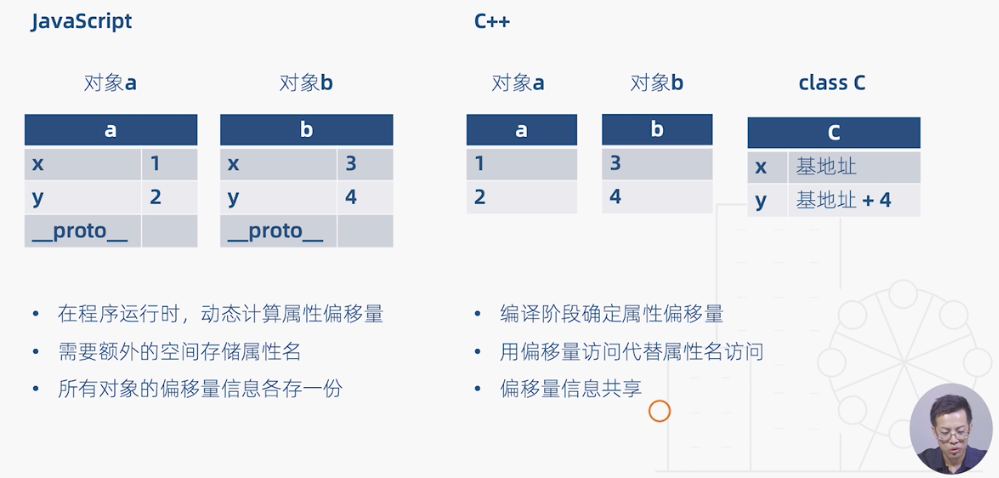
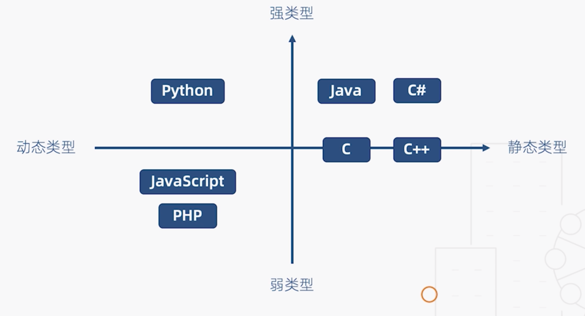

# 03 | 类型基础（2）：动态类型与静态类型

[TOC]

## 通俗定义

> 静态类型语言：在程序编译阶段确定所有变量的类型
>
> 动态类型语言：在程序执行阶段确定所有变量的类型

JS 代码：

```js
class C {
  constructor(x, y){
    this.x = x
    this.y = y
  }
}

// 将两个对象的属性相加
function add(a, b){
  return a.y + a.y + b.x + b.y
}
```

- 当 JS 编译器看到以上这段代码的时候，完全没有办法获知 add 函数中 a 与 b 的类型，只有在执行阶段的时候，根据程序传进来的对象来决定。

C++ 代码：

```c++
class C {
  	public:
  			int x;
  			int y;
}

int add(C a, C b){
  return a.y + a.y + b.x + b.y
}
```

- 与 JS 不同，C++ 在编译的时候就能够确认变量的类型，而且他们的类型一定是整型。


## 静态类型与动态类型对比

下面我们从内存分配的角度来看一下，JS 与 C++ 的不同：



在执行 add 方法的时候，两种语言都会创建两个实例对象 a 和 b，而所不同的是：

- JS 需要在程序运行的时候动态计算属性 x 和 y 的偏移量，这个偏移量就是相对于对象基地址的偏移量，而且需要额外的存储空间来存储 x 和 y 这两个属性名，并且所有对象的偏移量信息都要各自存一份
- C++ 在编译阶段就能确定 x 和 y 的偏移量，如果一个整型变量占据 4 个字节，那么 x 的偏移量就是 0，y 的偏移量就是 4，这样就能在运行的时候通过偏移量访问代替属性名访问，并且所有偏移量的信息是共享的，由此可以看到动态类型语言无论在时间还是空间上都有比较多的性能损耗。


静态类型与动态类型对比总结：

| 静态类型语言   | 动态类型语言             |
| -------------- | ------------------------ |
| 对类型极度严格 | 对类型非常宽松           |
| 立即发现错误   | Bug 可能隐藏数月甚至数年 |
| 运行时性能好   | 运行时性能差             |
| 自文档化       | 可读性差                 |

以上对比似乎发现静态类型语言有更好的优势，动态类型语言则有很多缺陷，如果是一门动态弱类型语言则更会被打入鄙视链的底端，但是动态类型的支持者也有他们的理由：

- 性能是可以改善的（V8 引擎），而语言的灵活性更重要
- 隐藏的错误可以通过单元测试发现
- 文档可以通过工具生成

这种对于语言的争论一直存在，这也说明任何语言特性都具有两面性，同时也是在不断发展和进化的，不能一概而论，需要看具体的场景与性价比，比如 JS 就是一门动态弱类型语言但却丝毫不能阻止其广泛的应用。


## 其他定义

美国加州大学的讲义中：

> 强类型：不允许程序在发生错误后继续执行

如果按照这个定义，C 和 C++ 就是弱类型，因为它们没有对数组越界进行检查，由此可能导致程序的崩溃。

所以如果没有特殊说明，本课程所提及类型定义，即指通俗的定义，也就是静态类型语言会在编译阶段确定所有变量的类型，而动态类型语言则会把这些工作推迟到程序的执行阶段。


## 小结

语言类型象限图：



## 思考题

如果将 TypeScript 当作一门语言来看待，那么其是动态还是静态，是强类型还是弱类型呢？