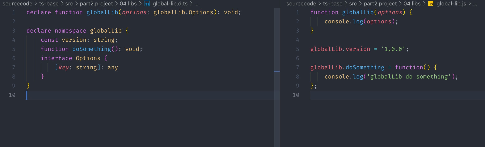

# 25 | 如何编写声明文件

[TOC]

本节课学习如果在 TS 中引入外部类库，以及如何为它们编写声明文件。

## 类库

我们先举一个最常用的类库——`jQuery`

在使用 `jQuery` 之前先安装一下：

```shell
npm i jquery
```

类库一般分为三类：

- 全局类库
- 模块类库
- UMD 类库

`jQuery` 是一种 **UMD 类库，也就是说既可以通过全局的方式来引入，通常我们需要配合 `webpack` 的一些插件来实现，也可以通过模块化的方式来引用。**这里为了方便我们采用模块化的方式来引用：

```ts
import $ from 'jquery'
```

这里会有一个提示：*无法找到模块 'jquery' 的声明文件* 。这是因为 `jQuery` 是用 JS 编写的，我们在使用非 TS 编写的类库的时候必须为这个类库编**写一个声明文件对外暴露它的 API**，有时候这些类库声明文件是包含在源码中的，但有时候是单独提供的，需要额外的安装，比如 `jquery` 就是这样。幸运的是，大多数类库的声明文件社区已经为我们编写好了，使用的方法就是安装一个**类型声明包**，这个包的名字就是以 `@types/` 为前缀，后面加上这个包的名字，比如以 `jquery` 为例：

```shell
npm i @type/jquery -D
```

`-D` 是安装为开发依赖。

当安装完声明文件之后，错误提示就会消失。接下来我们就可以在 TS 中使用 `jquery` 了。比如我们更改一下首页的文字颜色：

```ts
import $ from 'jquery'

$('.app').css('color', 'red')
```


那么我们在 TS 中使用一个外部的类库的时候，首先就应该考虑它是否有这个声明文件，那么可以在 [TypeSearch](https://microsoft.github.io/TypeSearch/) 中进行查询。比如搜索 `loadsh` ，就会提示有，点击就会跳转到声明文件包的 npm 页面。那么如果没有则需要你自己去写，这个时候也是贡献社区的好机会，我们可以通过 [DefinitelyTyped](https://definitelytyped.org/guides/contributing.html) 这个网站来看如何为社区贡献声明文件的方法，但在这之前你需要学会如何编写一个声明文件。


## 三种类库的声明文件写法

我们在 `src/libs` 目录中有三个类库：

- `global-lib.js` ——全局库
- `module-lib.js` ——模块库
- `umd-lib.js` ——umd 库

### 全局库

`./sourcecode/ts-base/src/part2.project/04.libs/global-lib.js` ：

```js
function globalLib(options) {
    console.log(options);
}

globalLib.version = '1.0.0';

globalLib.doSomething = function() {
    console.log('globalLib do something');
};
```

这里定义了一个全局方法 `globalLib` ，然后给它添加了两个属性 `version` 和 `doSomething` ，这是一个非常典型的全局类库的模式。如果要使用这个全局库，我们首先需要在 `index.html` 中用 `script` 标签把它引入进来：

```html
<body>
    <div class="app"></div>
  	<script src="src/libs/global-lib.js"></script>
</body>
```

引入进来之后，我们就可以在 `index.ts` 文件中调用：

```ts
import $ from 'jquery'

$('.app').css('color', 'red')

globalLib({x: 1})
```

这个类库的名字是 `globallLib` ，它需要传入一个参数。这个时候 TS 会报错提示：*找不到名称 "globalLib"* ，原因是我们没有为这个 JS 类库编写声明文件。

我们将之前编写好的声明文件拷贝到与这个类库同一个文件目录下，名称相同但是需要加上 `.d.ts` 后缀，全称则为：`globalLib.d.ts` ：

```ts
declare function globalLib(options: globalLib.Options): void;

declare namespace globalLib {
    const version: string;
    function doSomething(): void;
    interface Options {
        [key: string]: any
    }
}
```

下面我们来对比一下这个类库的**声明文件**与**源码**：



左边为声明文件，右边为源码。

在声明文件中，我们用到了 `declare` 关键字，**它可以为一个外部变量提供类型声明**。

> 来自 - [深入理解 TypeScript - 环境声明](https://jkchao.github.io/typescript-book-chinese/typings/ambient.html)
>
> 你可以通过 `declare` 关键字，来告诉 TypeScript，你正在试图表述一个其他地方已经存在的代码（如：写在 JavaScript、CoffeeScript 或者是像浏览器和 Node.js 运行环境里的代码）：
>
> ```ts
> foo = 123; // Error: 'foo' is not defined
> ```
>
> 
>
> 和：
>
> ```ts
> declare var foo: any;
> foo = 123; // allow
> ```
>
> 你可以选择把这些声明放入 `.ts` 或者 `.d.ts` 里。在你实际的项目里，我们强烈建议你应该把声明放入 `.d.ts` 里（可以从一个命名为 `globals.d.ts` 或者 `vendor.d.ts` 文件开始）。
>
> 如果一个文件有扩展名 `.d.ts`，这意味着每个顶级的声明都必须以 `declare` 关键字作为前缀。这有利于向作者说明，在这里 TypeScript 将不会把它编译成任何代码，同时他需要确保这些在编译时存在。
>
> TIP
>
> - 环境声明就好像你与编译器之间的一个约定，如果这些没有在编译时存在，但是你却使用了它们，则事情将会在没有警告的情况下中断。
> - 环境声明就好像是一个文档。如果源文件更新了，你应该同步更进。所以，当你使用源文件在运行时的新行为时，如果没有人更新环境声明，编译器将会报错。

首先，我们在源码中有一个全局的函数 `globalLib` ，在声明文件中，我们也提供了一个全局的声明 `declare function globalLib`，然后他的参数是一个 `options` ，`options` 是一个对象，这里我们使用一个接口来**约束**这个对象的结构，这个接口我们放在了一个命名空间 `globalLib` ，接口是一个可索引类型的接口，它可以接受任意的字符串属性，然后返回值也是 `any` 。

接下来可以看到在源码中，`globalLib` 挂载了一个 `version` 属性和 `doSomething` 方法， 这种情况我们就需要为这个类库 `declare` 一个命名空间，在这个命名空间中有两个成员分别就是 `version` 和 `doSomething` ，这样就利用到了我们前一节中学习到的**声明合并**，也就是命名空间与函数的声明合并，这就相当于为这个函数添加了一些属性。

这里需要注意一下 `interface` 接口是可以放在全局的，也就是可以拷贝出来放到外面： 

```ts
declare function globalLib(options: Options): void;

interface Options {
  [key: string]: any
}

declare namespace globalLib {
  const version: string;
  function doSomething(): void;
}
```

但是这样，这个接口就对全局暴露了出来，如果你不想暴露一个全局的接口，就可以将它放在命名空间之中。

那么这样这个全局的声明文件我们就编写完成了，回到程序中也不会有报错，也可以调用这个全局类库的方法：

```ts
import $ from 'jquery'

$('.app').css('color', 'red')

globalLib({x: 1}) // => {x: 1}
globalLib.doSomething() // => 'globalLib do something'
```


### 模块类库

`./sourcecode/ts-base/src/part2.project/04.libs/module-lib.js`：

```js
const version = '1.0.0';

function doSomething() {
    console.log('moduleLib do something');
}

function moduleLib(options) {
    console.log(options);
}

moduleLib.version = version;
moduleLib.doSomething = doSomething;

module.exports = moduleLib;
```

这是一个 CommonJS 模块，将其引入到 `index.ts` 中：

```ts
import moduleLib from './module-lib'
```

依然会提示我们：*无法找到模块 "./module-lib" 的声明文件* ，同样将声明文件 `module-lib.d.ts` 拷贝到类库文件的相同目录下，文件代码如下：

 ```ts
declare function moduleLib(options: Options): void

interface Options {
    [key: string]: any
}

declare namespace moduleLib {
    const version: string
    function doSomething(): void
}

export = moduleLib
 ```

和之前全局类库的声明文件相比其实差不太多，在 `module-lib.js` 中我们向外导出了一个顶级的 `moduleLib` 函数，然后在这个函数上也挂载了一个函数和方法。同样，声明和刚才的形式也差不多，首先用 `declare` 声明了一个 `moduleLib` ，而接口放在了文件的最外层环境下，因为声明文件本身也是一个模块，所以接口就不会向外暴露。同样，我们也定义了一个命名空间，在这个空间中也有两个成员，分别是 `version` 和 `doSomething` ，最后我们用 `export =` 这种形式导出，因为这样的兼容性是最好的。

这里需要说明一下，在 TS 的官网中，上面第 8 行代码是多了一个关键字 `export` 的：

```ts
export const version: string
```

但在实际中，添加 `export` 与不添加是区别的，因此可以不用写 `export`

这样模块类库的声明文件文件我们也编写完了，回到 `index.ts` 中调用一下：

```ts
import moduleLib from './module-lib'
moduleLib.doSomething() // 'moduleLib do something'
```

（可以这样理解，声明文件与库是一体的，是通过编写 ts 文件并使用 `declare` 关键字来告诉编译器库文件是有定义的，从而能够在 ts 开发环境中使用这些并非使用 ts 来编写的类库。需要将声明文件以 `.d.ts` 的方式命名，并将其放到类库文件相同的目录下）


### UMD 库

`./sourcecode/ts-base/src/part2.project/04.libs/umd-lib.js`：

```ts
(function (root, factory) {
    if (typeof define === "function" && define.amd) {
        define(factory);
    } else if (typeof module === "object" && module.exports) {
        module.exports = factory();
    } else {
        root.umdLib = factory();
    }
}(this, function() {
    return {
        version: '1.0.0',
        doSomething() {
            console.log('umdLib do something');
        }
    }
}));
```

在 `index.ts` 中引入：

```ts
import umdLib from './umd-lib'
```

同样也会报错，所以添加声明文件 `umd-lib.d.ts` ：

```ts
declare namespace umdLib {
    const version: string
    function doSomething(): void
}

export as namespace umdLib

export = umdLib
```

这里同样声明了一个命名空间，空间中有两个成员，就分别对应了 umd 中的两个成员。然后使用 `export` 默认导出，在第 6 行加了一个语句，专门为 umd 库设置的语句，如果我们要编写一个 umd 库，那么这条语句是不可缺少的。

umd 库其实是可以通过全局的方式来引用的，和 global-lib 是一样的，在 `index.html` 引入：

```html
<body>
    <div class="app"></div>
  	<script src="src/libs/global-lib.js"></script>
  	<script src="src/libs/umd-lib.js"></script>
</body>
```

那么，在 `index.ts` 中就可以删掉 es6 模块的引入方式，通过全局的方式使用：

```ts
// import umdLib from './umd-lib'
umdLib.doSomething()
```

这个时候，TS 会提示：*"umdLib"指 UMD 全局，但当前文件是模块。请考虑改为添加导入。* 有一个配置项可以关闭这个提示：`allowUmdGlobalAccess` 打开，设置为 `true` 

如果你想在全局的环境中调用 umd 类就需要在一个非模块的文件中去调用，那么这样就回到了最传统的开发模式，这里就不做演示了。

到此为止三种模块声明文件就介绍完了。


## 插件

### 模块插件

接下来看两种插件——模块插件与全局插件，它的意义是，允许我们给一个类库添加一些自定义的方法。比如我们想给 `moment` 类库增加一些自定义的方法。

```ts
import m from 'moment'
m.myFunction = () => {}
```

这里先引入 `moment` 库，然后给其添加自定义方法 `myFunction` ，这时会提示我们：*类型 "typeof momnet" 上不存在属性 "myFuntion"* 。

当然我们可以使用 `declare` 处理这个问题，方法是 `declare` 一个名称为 `moment` 的 `module` ，并导出自定义的方法：

```ts
import m from 'moment'
declare module 'moment' {
  export function myFunction(): void
}
m.myFunction = () => {}
```

这样我们就可以给一个外部的类库添加自定义的方法，这也就是模块化插件。


### 全局插件

全局插件就是给全局变量添加一些方法。可以使用 `declare global` ，下面我们就为 `globalLib` 添加一些自定义的方法：

```ts
declare global{
  namespace globalLib{
    function doAnything(): void
  }
}
globalLib.doAnything = () => {}
```

需要添加了一个命名空间，名称是需要被添加自定义方法的全局变量名称，然后在其中添加一个函数类型声明，有了这个声明之后我们就可以在 `globalLib` 上添加 `doAnything` 方法了。

不过实际上这样是对全局命名空间造成污染，所以一般不建议这样做。


## 声明文件的依赖

如果一个类库比较大的话，其声明文件会很长，一般会按照模块划分，这些声明文件之间就会存在一定依赖关系，我们来看一下 `jquery` 的声明文件是如何组织的。

打开 `node_modules/@types/jquery` 目录，这个目录下就有 `jquery` 的所有声明文件，先看一下 `package.json` ，这里面寻找一下 `types` 字段，其代表声明文件的入口：

```json
{
  "types": "index"
}
```

可以看到这个入口就是 `index` ，也就是 `index.d.ts` ：

```ts
/// <reference types="sizzle" />
/// <reference path="JQueryStatic.d.ts" />
/// <reference path="JQuery.d.ts" />
/// <reference path="misc.d.ts" />
/// <reference path="legacy.d.ts" />

export = jQuery;
```

除了贡献者的信息之外，就是一些依赖文件的引入，最后导出了 `jQuery` 。

这些依赖可以分为两种：

- 一种就是**模块依赖**，使用 `types` 属性，其含义就是 TS 会在这个 `@types` 目录下寻找这个模块，这里 `sizzle` 是 `jQuery` 的一个引擎，那么 TS 就会在 `@types` 目录下寻找 `sizzle` 目录，然后把 `sizzle` 相应的声明文件引入进来。
- 另一种就是**路径依赖**，使用 `path` 属性，这是一个相对路径，也就是和 `index.ts` 同级的一些文件，它们也会被引入进来。


如果你觉得编写一个声明文件很困难，或者官网的例子看不明白，那么一个比较好的方法就是去看一些知名类库的声明文件是如何编写的，从这个过程中也会受到很大的**启发**。


## 课后问答

老师，声明文件是干什么用的？为什么要写？

> 为 js 库提供类型声明，不写就会报错。


