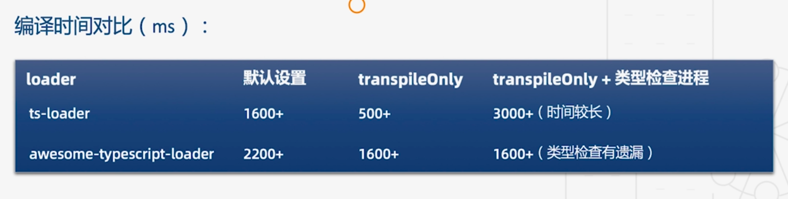
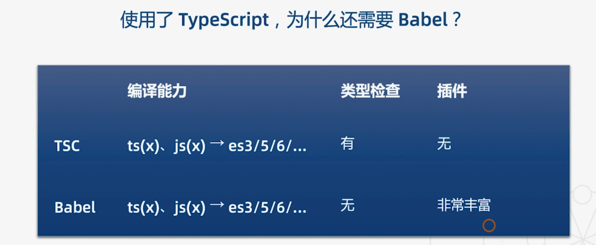
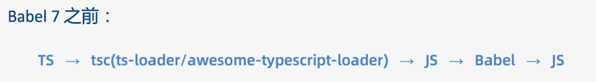

# 29 | 编译工具：从ts-loader到Babel

[TOC]

本节课我们来学习 ts 的编译工具。

在第 4 节课中，我们用 ts 编写了一个 HelloWorld 程序，为了能够将 typescript 编译成 JavaScript ，我们使用了一个 loader，也就是 ts-loader。本节课我们先来了解一些 ts-loader 的细节。

## ts-loader

我们回到 HelloWolrd 工程，这里纠正一下第 4 节中的错误，也就是关于 webpack 入口文件的写法。

我们在 npm 脚本中分别给 webpack-dev-server 和 webpack 命令传入了一个 mode 参数：

```json
"scripts": {
    "start": "webpack-dev-server --mode=development --config ./build/webpack.config.js",
    "build": "webpack --mode=production --config ./build/webpack.config.js",
    "lint": "eslint src --ext .js,.ts",
    "test": "jest"
  },
```

正确获取这个参数的方法不能通过 node 的环境变量，也就是 `process.env.NODE_ENV`。而正确的方法是通过导出函数的第二个参数来获取：

```js
const merge = require('webpack-merge')
const baseConfig = require('./webpack.base.config')
const devConfig = require('./webpack.dev.config')
const proConfig = require('./webpack.pro.config')

// Wrong!
let config = process.env.NODE_ENV === 'development' ? devConfig : proConfig
module.exports = merge(baseConfig, config)

// Right!
module.exports = (env, argv) => {
    let config = argv.mode === 'development' ? devConfig : proConfig;
    return merge(baseConfig, config);
};
```

第二个参数有一个 `mode` 属性，我们根据这个属性来判断当前的环境是什么。

接下来，我们回到基础配置——`webpack.base.config.js`：

```js
const HtmlWebpackPlugin = require('html-webpack-plugin')

module.exports = {
    entry: './src/index.ts',
    output: {
        filename: 'app.js'
    },
    resolve: {
        extensions: ['.js', '.ts', '.tsx']
    },
    module: {
        rules: [
            {
                test: /\.tsx?$/i,
                use: [{
                    loader: 'ts-loader',
                  	options: {
                      transplieOnly: false
                    }
                }],
                exclude: /node_modules/
            }
        ]
    },
    plugins: [
        new HtmlWebpackPlugin({
            template: './src/tpl/index.html'
        })
    ]
}
```

可以看到基础配置中我们配置了 `ts-loader`，在 `ts-loader` 的源码中我们可以看到期调用了 ts 官方的编译器，也就是 `tsc`。`tsc` 与 `ts-loader` 是共享 `tsconfig.json` 配置文件的。此外，`ts-loader` 还会有一些自己的配置，它会通过 `options` 属性来传入（第 17 行），其中配置项你可以去参考 `ts-loader` 的官方文档，这里介绍一个配置项 `transplieOnly`，这个配置项的默认值是 `flase` ，它的作用是当这个配置项开启之后，会告诉编译器只做语言转换而不做类型检查，因为在实际项目中会发现随着项目越来越大构建时间越来越长，原因之一就是 ts 编译器需要做很多事情，不只要做语言转换也要做类型检查，开启之后就能够启动快速的构建模式。这种模式缺点当然是不会进行类型检查，比如我们给一个 string 变量赋值 number，虽然 IDE 会提示我们，但 ts 比较柔性的地方是，即使 IDE 有报错也不会阻止我们进行编译。

那么如何在 `transplieOnly` 开启的情况下又进行类型检查呢？

我们需要借助一个插件来实现（`fork-ts-checker-webpack-plugin`），它会把类型检查放在独立的类型中进行。安装：

```shell
npm i fork-ts-checker-webpack-plugin -D
```

这个插件安装完毕了，下面我们在配置文件中将它引入进来并使用——`webpack.base.config.js`：

```js
const ForkTsCheckerWebapckPlugin = require('fork-ts-checker-webpack-plugin')

module.exports = {
    plugins: [
        new HtmlWebpackPlugin({
            template: './src/tpl/index.html'
        }),
      	new ForkTsCheckerWebapckPlugin()
    ]
}
```

使用方式很简单，直接在 `plugins` 字段的数组中直接 new 创建一个实例就可以了。

当我们重新构建之后，如果有类型错误就会收到提示。

以上就是 `ts-loader` `transplieOnly` 这个配置项的用法，在关闭的情况可以提高构建速度，在开启的情况下会失去类型检查，我们需要额外的插件来进行类型检查的工作。

除了 `ts-loader` 之外，官方也为我们提供了另一个 loader，也就是 `awesome-typescript-loader`，我们来看一下其与 `ts-loader` 的区别：

1. 更适合与 Babel 集成，使用 Babel 的转义和缓存
2. 不需要安装额外的插件就可以把类型检查放在独立进程中进行

下面来使用一下这个 loader，安装：

```shell
npm i awesome-typescript-loader -D
```

切换为 `awesome-typescript-loader` ，在 `webpack.base.config.js`中：

```js
const HtmlWebpackPlugin = require('html-webpack-plugin')
const { CheckerPlugin } = require('awesome-typescript-loader')

module.exports = {
    entry: './src/index.ts',
    output: {
        filename: 'app.js'
    },
    resolve: {
        extensions: ['.js', '.ts', '.tsx']
    },
    module: {
        rules: [
            {
                test: /\.tsx?$/i,
                use: [{
                    //loader: 'ts-loader',
                  	loader: 'awesome-typescript-loader'
                  	options: {
                      transplieOnly: false
                    }
                }],
                exclude: /node_modules/
            }
        ]
    },
    plugins: [
        new HtmlWebpackPlugin({
            template: './src/tpl/index.html'
        }),
      	new CheckerPlugin()
    ]
}
```

`awesome-typescript-loader` 依然有 `transplieOnly` 属性选项，开启减少构建速度，缺少类型检查。这里我们可以引入它自带的类型检查插件 `CheckerPlugin` ，使用方式和 `ForkTsCheckerWebapckPlugin` 相同。

### ts-loader 与 awesome-typescript-loader 编译时间对比



这两个插件在开启 `transplieOnly` 的情况下构建时间都有明显程度的缩短，但在加入类型检查进程的时候，`ts-loader` 的构建时间反而比较长，而 `awesome-typescript-loader` 的类型检查进程是有一些缺陷的，比如有时会检查不出类型赋值错误。

综合对比之后，还是建议使用 `ts-loader` 默认的配置就可以了。

## babel

在介绍完这两个 loader 之后，不得不提的就是 babel，你可能会有一些疑问，我们使用了 TypeScript，为什么还需要 Babel？

### TS 与 Babel 对比



- 首先从编译能力来看，TSC 与 Babel 都可以把 ts(x)、js(x) 编译成 es3/5/6 以及后续的更高级版本
- 类型检查，Babel 没有类型检查能力
- 插件，围绕 Babel 社区提供了非常丰富的插件，它的周边生态系统非常的完善，而 TSC 在这一块就非常的欠缺

在 Babel7 之前是不支持 TS 的，对于那么已经使用了 Babel 的项目，如果想要使用 TS 其实并不是一件非常容易的事情，需要结合我们之前介绍的 webpack loader，经过 loader 的转义转成 js，然后再交给 bebal 处理，如下：



这是一件非常痛苦的事情。

不过这在 Babel7 之后情况有了好转，Babel 现在已经支持了 TS，并且与官方进行了合作，具有正统的官方血统，这使得我们不需要各种 loader，Babel 甚至在编译的时候抛弃了 TS，让它去做 Babel 唯一还不能做的事情，也就是类型检查：


其实， 我们确实完全没有必要同时去配置两个编译器，可以让各种需要处理的事情让 Babel 的生态系统来支持，这样也会使我们构建系统更加统一和可维护。

### Babel 工程

首先来看一下我们安装了哪些包，`package.json`：

```json
{
  "name": "ts_babel",
  "version": "1.0.0",
  "description": "",
  "main": "./src/index.ts",
  "scripts": {
    "build": "babel src --out-dir dist --extensions \".ts,.tsx\"",
    "type-check": "tsc --watch",
    "test": "jest"
  },
  "keywords": [
    "TypeScript",
    "Babel"
  ],
  "author": "liangxiao",
  "license": "ISC",
  "devDependencies": {
    "@babel/cli": "^7.4.4",
    "@babel/core": "^7.4.5",
    "@babel/plugin-proposal-class-properties": "^7.4.4",
    "@babel/plugin-proposal-object-rest-spread": "^7.4.4",
    "@babel/preset-env": "^7.4.5",
    "@babel/preset-typescript": "^7.3.3",
  }
}
```

这里：

- `@babel/cli` 、`@babel/core` 、`@babel/preset-env` 都是使用 Babel 通常来说所必须的
- 我们也安装了 ts 的 preset——`@babel/preset-typescript`，它可以用来编译 ts 文件。
- 此外，我们还安装了两个插件，这两个插件能够让我们更方便的编写 ts：
  - `@babel/plugin-proposal-object-rest-spread` 插件可以支持对象「剩余」和「扩展」操作符
  - `@babel/plugin-proposal-class-properties` 插件（应该是支持类的写法）

接着，我们来看一下 Babel 的配置文件——`.babelrc`：

```json
{
    "presets": [
        "@babel/env",
        "@babel/preset-typescript"
    ],
    "plugins": [
        "@babel/proposal-class-properties",
        "@babel/proposal-object-rest-spread"
    ]
}
```

这里我们配置的比较简单，将两个 `preset` 和两个插件（`plugin`）都引入了进来。

然后，我们编写一个文件来编译一下。

创建一个 `src` 目录，然后在其中新建一个 `index.ts` 文件，在这个文件中我们编写之前所安装的两种插件所能够支持的语法：

```ts
class A {
	a: number = 1 
}

let { x, y, ...z} = {
  x: 1,
  y: 2,
  a: 3,
  b: 4
}

let n = { x, y, ...z}
```

- 首先，我们编写一个类 `A`，为其指定一个成员 `a` 类型为 number，值为 `1` 。
- 然后我们再编写一个解构赋值。（5 到 10 行）
- 然后我们在写一个扩展运算符。 （ 12 行）

下面，我们来编译一下，首先来看一下编译脚本：

```json
{
  "scripts": {
    "build": "babel src --out-dir dist --extensions \".ts,.tsx \""
  }
}
```

在这里我们调用了 babel 命令，然后指定了一个输出目录，babel 现在不能自动的识别 .ts .tsx 文件，所以我们要指定一下扩展名。

执行一下 `npm run build`，这样项目就构建成功了，这是最简单的 babel + ts 的配置。注意，在这个项目中我们并没有安装 ts，而完全使用 babel 作为编译工具编译了 ts 文件。

就如前面所说，babel 是不能进行类型检查的。如果想要引入类型检查，我们只能再安装一下 `typescript` 包：

```shell
npm i typescript -D
```

安装好 `typescript` 之后，我们来自动生成 `tsconfig.json` 配置文件，运行以下命令：

```shell
tsc --init
```

在配置文件中，我们开启一个选项——`tsconfig.json`：

```json
{
 "noEmit": true 
}
```

开启 `noEmit` 选项之后就表示 ts 不会输出任何文件，只会做类型检查。

然后，我们再添加一个类型检查脚本：

```json
{
  "scripts": {
    "type-check": "tsc --watch"
  }
}
```

在脚本中我们开启 tsc 的「监控模式」。

然后执行类型检查脚本需要独占一个终端，打开一个新的终端并执行脚本：

```shell
npm run tyep-check
```

之后 tsc 就会事实的监控我们编码中的错误。

这样我们就将 babel 和 ts 结合起来了，babel 只做语言转换，ts 只做类型检查。

### Babel 使用 ts 的注意事项

有四种语法在 babel 中是无法编译的：

1. 命名空间——`namespace` 

   ```ts
   namespace N {
     export const n = 1
   }
   ```

   命名空间在 babel 中编译是会报错，所以不要使用。

2. 关于类型断言的写法：

   ```ts
   class A {
     a: number = 1
   }
   
   let s = {} as A
   s.a = 1
   ```

   这里我们声明一个对象 `s`，给它绑定一个 a 属性，这个时候 a 是没有定义的，我们可以把它断言为 class 类型 A，但需要注意类型断言要使用 `as`，不要使用尖括号。

3. 常量枚举：

   ```ts
   const enum E { A }
   ```

   常量枚举在 babel 中也是会编译报错的。目前 babel 还不支持，我们期待未来 babel 可以支持常量枚举。（但我在 horizon 项目中使用了常量枚举也没有报错，一可能是 babel 已经支持，二是通过使用了什么插件来实现了支持）

4. 默认导出：

   ```ts
   export = s
   ```

   这个语法在 babel 也是会默认报错的，所以我们也不要使用。

## 关于如何选择 ts 的编译工具

1. 如果没有使用过 Babel，首选 TypeScript 自身的编译器（可配合 ts-loader 使用）
2. 如果项目中已经使用了 Babel，安装 `@babel/preset-typescript` 来做语言的转换（可配合 tsc 做类型检查）
3. 两种编译工具不要混用，否则只会增加工程的复杂度。


## 作业题

我们刚才的 babel 工程并没有使用 webpack 运行一个 server，那么请你使用 webpack 来搭建一个开发环境运行起一个简单的页面。


