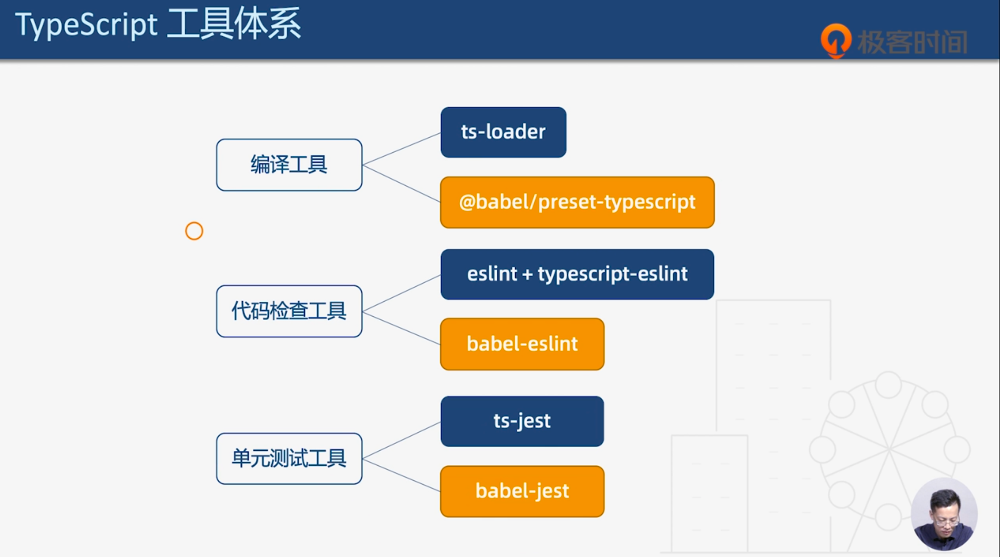
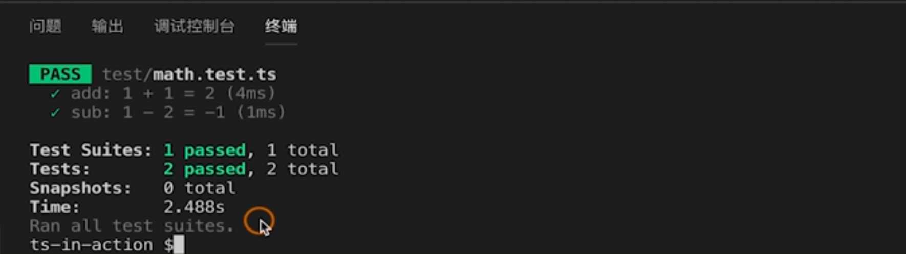
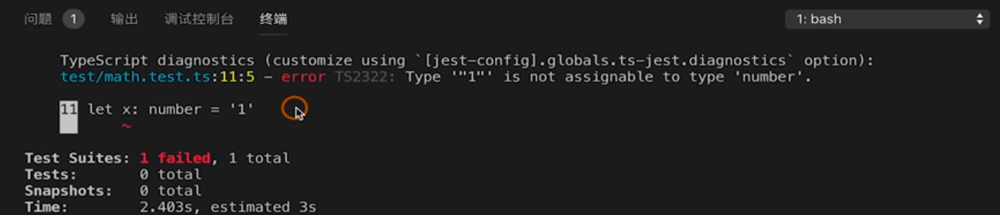
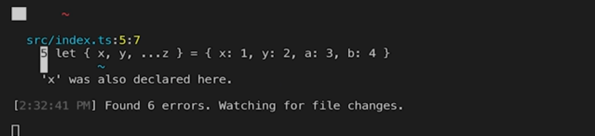

# 31 | 使用Jest进行单元测试

[TOC]

本节课我们将学习如何使用 **Jest** 进行单元测试，Jest 是 Facebook 推出的一款单元测试工具。

首先我们回顾一下上两节的课程。

## TS 工具体系

 

可以看到 TS 的「工具体系」基本分成了「babel 系」和「非 babel 系」，单元测试也不例外。我们可以使用 babel 系的 `babel-jest` ，当然它和 babel 系的工具具有同样的缺点，就是不能对测试代码进行类型检查。如果需要类型检查我们也可以使用非 bable 系的 `ts-jest` ，本节课我们就来学习这两种工具的使用。

## 两种工具的使用

### ts-jest

我依然基于 helloWorld 工程，首先我们需要安装几个包，一个是 `jest` 一个是 `ts-jest` ，另外还需要配置一个脚本：

```json
{
  "scripts": {
    "test": "jest"
  }
}
```

接下来我们运行一个命令来生成 jest 配置文件：

```shell
npx ts-jest config:init
```

通过这个命令我们生成 `jest.config.js` 文件：

```js
module.exports = {
  preset: 'ts-jest',
  testEnvironment: 'node',
}
```

在这里，指定 `preset` 是 `'ts-jest'` ，测试环境是 `node`。

下面我们就来编写两个简单的函数，然后为它们编写测试用例。

我们在 `src` 目录下，新建一个 `math.ts` ：

```tsx
function add(a: number, b: number) {
  return a + b
}

function sub(a: number, b: number) {
  return a - b
}

module.export = {
  add,
  sub
}
```

这里编写两个简单的函数，加法函数和减法函数，然后我们把这两个函数导出。

接着，编写测试用例。我们在根目录创建 `test` 文件夹，然后在其中新建 `math.test.ts` ：

```ts
const math = require('../src/math')

test('add: 1 + 1 = 2', () => {
	// 使用断言  
	expect(math.add(1, 1)).toBe(2)
})

test('sub: 1 - 2 = -1', () => {
  expect(math.sub(1, 2)).tbBe(-1)
})
```

先导入刚刚编写模块 `math.ts`，然后编写第一个测试用例，第一个用例检查 `1 + 1` 是否等于 `2`，在第 5 行我们使用了断言，然后我们再编写第二个用例，看一下 `1 - 2` 是否等于 `-1` 。

这样测试用例就编写完毕，下面执行一下脚本进行测试：

```shell
npm run test
```

可以看到两个测试用例都已经通过：



使用 ts-jest 的好处是它能够在测试用例中进行类型检查，比如在 `math.test.ts` 中：

```ts
const math = require('../src/math')

test('add: 1 + 1 = 2', () => {
	// 使用断言  
	expect(math.add(1, 1)).toBe(2)
})

test('sub: 1 - 2 = -1', () => {
  expect(math.sub(1, 2)).tbBe(-1)
})

let x: number = '1' // 报错
```

我们定义一个变量 `x`，类型为 `number`，然后将其赋值给一个字符串，那么这是一个明显的类型错误。我们运行脚本看看是否能够检测出来：



可以看到，提示我们不能将一个字符串赋值给 `numebr` 。

关于 ts-jest 我们就介绍到这里，下面看一下 babel-jest。

### babel-jest

打开 babel 工程，首先需要安装 jest，同时也需要安装 babel-jest，另外也需要 jest 的声明文件：

```shell
npm i -D jest babel-jest @types/jest
```

这样就安装完毕了。

接着，将之前的两个文件拷贝过来——位于 `test` 目录下的测试用例，和 `src` 下的 `math.ts` 

然后添加测试脚本：

```json
{
  "scripts":{
    "type-check": "tsc --watch",
    "test": "jest"
  }
}
```

执行一下：

```sshell
npm run test
```

可以看到两个测试用例通过了，但是没有进行类型检查。如果要进行类型检查，我们仍然需要启动类型检查脚本，在这里我们执行一下：

```shell
npm run type-check
```

可以看到一共报出了 6 个错误：



除了类型和重名的错误之外，会提示 `require` 没有定义，这是因为我们没有安装 `node` 的声明文件，安装一下：

```shell
npm i @types/node -D
```

这样没有错误了。


## 小结

到此为止，工程篇的内容就介绍完毕了，同样也准备了一张思维导图，方便你随时的记忆和查找。

下节课我们将进入实战篇，带你创建 `react` `node` 和 `vue` 的典型应用。


