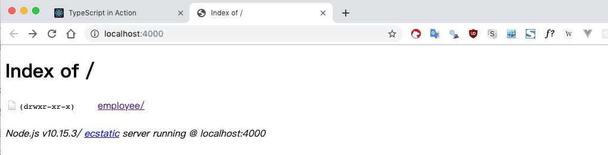
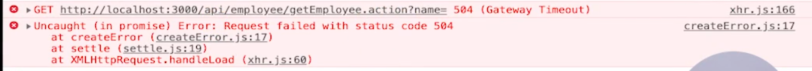
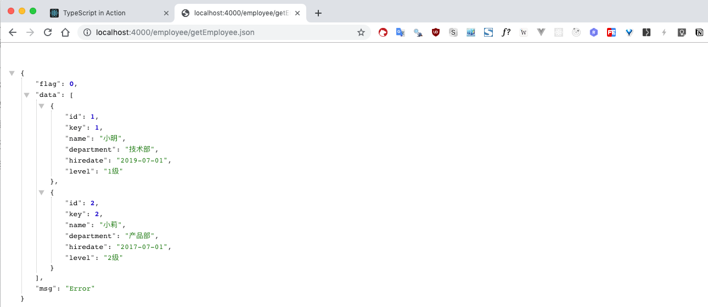

# 35 | 事件处理与数据请求

[TOC]

本节课我们学习如何使用 TS 来编写 React 中的**事件处理**和**数据请求**。

## 代码部分

> 本节课代码在项目 `ts-react-app` 中能够找到。

打开 `./src/employee/QueryForm.tsx` 组件：

```tsx
render() {
  return (
    <Form layout="inline">
      <Form.Item>
        <Input
          placeholder="姓名"
          style={{ width: 120 }}
          allowClear
          />
      </Form.Item>
      <Form.Item>
        <Select
          placeholder="部门"
          style={{ width: 120 }}
          allowClear
          >
          <Option value={1}>技术部</Option>
          <Option value={2}>产品部</Option>
          <Option value={3}>市场部</Option>
          <Option value={4}>运营部</Option>
        </Select>
      </Form.Item>
      <Form.Item>
        <Button type="primary" onClick={this.handleSubmit}>查询</Button>
      </Form.Item>
    </Form>
  )
}
```

在这个组件中，一共有 `Input` `Select` `Button` 三个表单组件，我们会将 `Input` 和 `Select` 更改为**受控组件**，也就是把它们的 `value` 与 `QueryForm` 的状态进行绑定。这就需要为它们绑定 `onChange` 事件，以及向 `Button` 组件绑定 `onClick` 事件，以便向后端发送数据请求来渲染员工信息列表。

下面我们为 `QueryForm` 设置状态，这个状态在这里其实就是我们向后端发送数据请求的格式，对于这一类的数据格式，它的每个字段和字段的类型其实都是接口文档的一部分，我们应该将其抽离出来，单独的定义成接口。

我们在 `src/interface` 目录中存放所有和后端交互的数据请求接口，打开已经创建好的 `employee.ts`：

```ts
export interface EmployeeRequest {
    name: string;
    departmentId: number | undefined;
}

interface EmployeeInfo {
    id: number;
    key: number;
    name: string;
    department: string;
    hiredate: string;
    level: string;
}

export type EmployeeResponse = EmployeeInfo[] | undefined
```

- `EmployeeRequest` 是请求数据接口。
- `EmployeeInfo` 是响应数组数据的单条数据接口，一共有 6 个字段，分别对应表格中的数据结构。
- `EmployeeResponse` 是后端的响应接口。

这样定义接口有两个好处：

1. 有利于项目的维护，后续开发人员接手这个项目，看到这些接口就会一目了然，使用了接口也会有自动提示功能。
2. 类型检查，对于我们没有考虑的一些边界的情况，TS 会及时给我们报错。对于这一点，下一节会讲到。

接下来，给 `QueryForm` 添加状态，这个状态的类型是 `EmployeeRequest`：

```tsx
import { EmployeeRequest } from '../../interface/employee';

class QueryForm extends Component<{}, EmployeeRequest> {
  state: EmployeeRequest = {
    name: '',
    departmentId: undefined
  }
 //...
}
```

- 导入之后，我们就给 `Component` 添加两个泛型变量，第一个表示属性的类型，因为不需要，则设置为空对象，第二个表示状态的类型，设置为 `EmployeeRequest` 。
- 接着，初始化状态。

接下来，我们就来将 `Input` 和 `Select` 设置为受控组件：

```tsx
render() {
  return (
    <Form layout="inline">
      <Form.Item>
        <Input
          placeholder="姓名"
          style={{ width: 120 }}
          allowClear
          value={this.state.name}
          onChange={this.handleNameChange}
          />
      </Form.Item>
      <Form.Item>
        <Select
          placeholder="部门"
          style={{ width: 120 }}
          allowClear
          value={this.state.departmentId}
          onChange={this.handleDepartmentChange}
          >
          <Option value={1}>技术部</Option>
          <Option value={2}>产品部</Option>
          <Option value={3}>市场部</Option>
          <Option value={4}>运营部</Option>
        </Select>
      </Form.Item>
      <Form.Item>
        <Button type="primary" onClick={this.handleSubmit}>查询</Button>
      </Form.Item>
    </Form>
  )
}
```

将它们的 `value` 值与 `state` 进行绑定，然后给它们增加 `onChange` 事件。接着我们来编写这两个回调 `this.handleNameChange` 和 `this.handleDepartmentChange` ：

```tsx
import { EmployeeRequest } from '../../interface/employee';

class QueryForm extends Component<Props, EmployeeRequest> {
  state: EmployeeRequest = {
    name: '',
    departmentId: undefined
  }
  handleNameChange = (e: React.FormEvent<HTMLInputElement>) => {
    this.setState({
      name: e.currentTarget.value
    })
  }

  handleDepartChange = (value: number) => {
    this.setState({
      department: value
    })
  }

  handleClick = () => {
		this.queryEmployee(this.state)
  }

  componentDidMount(){
		this.queryEmployee(this.state)
  }

  queryEmployee(param: EmpolyeeRequest){
		
  }
  //...
}


```

- 根据 `antd` 官方接口定义，`Input` 组件的 `onChange` 事件会给事件方法的第一个参数传入 `event` 事件类型，我们需要给 `event` 指定一个类型，这里我们使用 React 给我们提供的 `FormEvent` 类型，然后在这里设置一下状态，但会出现提示说：**类型“EventTarget & Element”上不存在属性“value”。** 这是因为 `FormEvent` 类型也是一个泛型接口，需要我们指定一个类型变量。因为我们绑定的是 `Input` ，所以这里指定为 `HTMLInputElement` ，这样就没有问题了。
- 接着，书写 `Select` 的事件回调方法 `handleDepartmentChange` ，传给这个回调的第一个参数值就是我们所选中的 `Option` 组件的 `value` 值，它的类型是 `number` ，同样，我们也设置一下状态。

- 接着，书写 `Button` 的 `Click` 事件回调方法 `handleSubmit` 。这里，我们不仅需要查询的时候发起请求，也需要页面初始化的时候自动的发起一个请求，那么就需要增加 `componentDidmount` 生命周期。在这里我们需要 `handleSubmit` 和 `componentDidmount` 执行同样的逻辑，所以将同样的逻辑放到 `queryEmpolyee` 函数中，它接受一个参数，参数的类型是 `EmpolyeeRequest`。

下面，就要发送请求了，发送请求我们使用的是 `axios` 这个第三方类库，通常我们需要将其包装一下。在 `src/utils/request.ts`：

```ts
import originAxios from 'axios';
import { message } from 'antd';

const axios = originAxios.create({
    timeout: 20000
});

axios.interceptors.response.use(
    function(response) {
        if (response.data && response.data.flag === 1) {
            /*
                successful response:
                {"flag": 0, "data": ""}

                unsuccessful response:
                {"flag": 1, "msg": "server error"}
            */
            let errorMsg = response.data.msg;
            message.error(errorMsg);
            return Promise.reject(errorMsg);
        }
        return response.data;
    },
    function(error) {
        return Promise.reject(error);
    }
);

export function get(url: string, data: any) {
    return axios.get(url, {
        params: data
    });
};

// By default, axios serializes JavaScript objects to JSON.
export function post(url: string, data: any) {
    return axios({
        method: 'post',
        url,
        data
    });
};

export default axios;
```

- 通过 `originAxios.crate` 创建了一个自定义的实例，然后指定请求的超时时间是 20s
- 接着，我们对 `response` 做了拦截，先判断了一下后端返回数据的**标志位**。我们和后端交互的接口格式是这样的（注释部分），首先会有一个 `flag` 字段，这个字段如果是 `0` ，表示请求成功，如果 `flag` 是 `1` 则表示请求失败，会返回一些错误信息。那么在这里我们判断一下，如果 `flag === 1` 那么就给出提示信息并且返回状态为 `reject` 的 `Promise` 并传入错误信息，否则，就返回 `response.data` 
- 然后，我们对 `get` 和 `post` 做了一些封装，这样调用起来也会方便一些。这里需要对 `post` 说明一下，没有直接调用 `axios` 的 `post` 属性方法，因为默认它会将数据序列化为一个 `json` 数据发送，这里改成了向 `axios` 方法传入配置参数的方式来调用，这样发送到后端的数据就是表单格式，后端就不需要做 `json` 解析。

好的，我们来发送请求，`QueryForm.tsx`：

```tsx
import { get } from '../../utils/request'
```

引入 `get` 方法，`get` 方法的一个参数是一个 url，通常我们不会将这个 url 写死在这里，而是将其定义为一个常量，我们在 `src/constants/urls.ts` 中存放了一些常量的定义：

```ts
export const GET_EMPLOYEE_URL = '/api/employee/getEmployee.action';
```

我们请求员工数据的接口就是 `'/api/employee/getEmployee.action'` ，以 `api` 为开头，以 `action` 为结尾，将其定义为一个常量。

好的，我们导入常量，继续书写发送请求的逻辑部分，在 `QueryForm.tsx`：

```tsx
import { get } from '../../utils/request';
import { GET_EMPLOYEE_URL } from '../../constants/urls';

class QueryForm {
  queryEmployee(param: EmployeeRequest) {
    get(GET_EMPLOYEE_URL, param).then(res => {
      
    });
  }
}
```

`get` 请求的第二个参数是 `param` ，`get` 会返回 `Promise` 对象。

我们在做前后端分离开发的时候，会对请求做 mock 处理，把发送到后端的请求代理到本地的 **mock server** 上。所以，我们先来学习一下如何搭建一个 **mock server**。

### mock server

我们会把所有的 mock 文件放到根目录下的 `./mock` 文件夹下，比如 `./mock/employee/getEmployee.json` ，也就是后端返回的数据。

这里需要说明的是，`create-react-app` 内部是使用 `webpack-server` ，它会把 `./public` 文件夹作为静态资源的根目录，所以我们将 mock 文件放到 `./public` 下就可以直接访问了，但是我们通常不会去这样做，而且 `webpack` 的配置也被隐藏了，所以我们需要再启动一个以 `./mock` 为根目录的 `api server` 来提供 mock 服务。

这里我们使用了 `http-server` ，并指定了一个 `server` 脚本：

```json
{
  "scripts": {
    "server": "cd mock && hs -p 4000 -a localhost"
  },
  "devDependencies": {
    "http-server": "^0.11.1",
  }
}
```

这个脚本首先是进入了 `mock` 目录，然后在当前的目录下启动 `http-server` 并设置端口为 `4000` ，服务的名称为 `localhost` 

新开一个终端来启动这个 server：

```shell
npm run server
```

通过浏览器访问这个服务器地址：



可以看到，正是我们在 mock 目录下创建的 employee 目录。

然后，我们再来看一下，发送给后端的接口格式：



这个接口是以 api 为开头，以 action 为结尾的，而我们 api server 所提供的服务是这样的：



前面没有 api，而且以 json 为结尾。

那么，这里我们就需要做一些自定义的配置。在 `./src/setupProxy.js` 文件中：

```js
const proxy = require('http-proxy-middleware');

module.exports = function(app) {
    app.use(proxy('/api/**/*.action', {
        target: 'http://localhost:4000',
        pathRewrite(path) {
            return path.replace('/api', '/').replace('.action', '.json');
        }
    }));
};
```

`create-react-app` 会在启动的时候自动的调用这个配置文件。我们来看一下，这里我们将以 `/api` 为开头，以 `.aciton` 为结尾的请求都代理到了本地的 4000 端口，然后修改了请求的 `path` ，把 `/api` 替换为了 `/` ，把 `.action` 替换为 `.json` ，这样在开发环境中，访问后端的接口就会代理到本地的 `json` ，在生产环境中，我们的代码也不必修改。


本节课的内容就到这里，下节课我们会从 get 请求返回开始继续编写表格的渲染逻辑以及整个应用的路由


