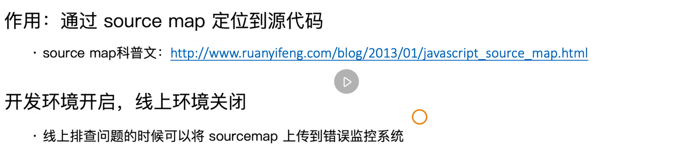
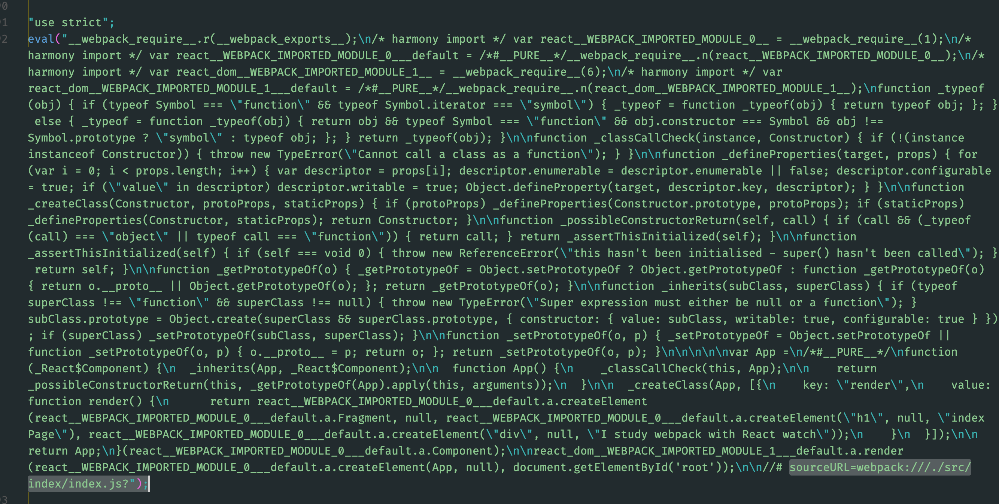
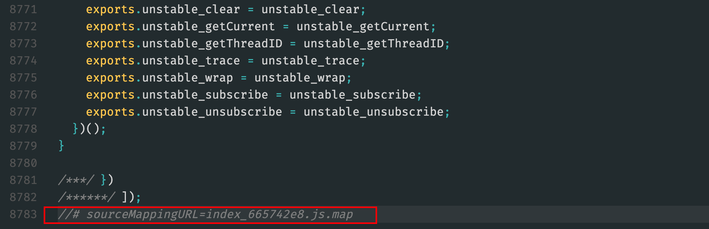
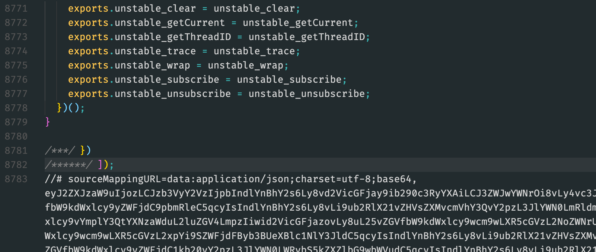
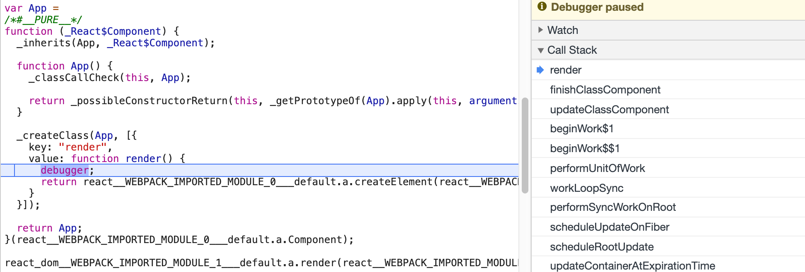
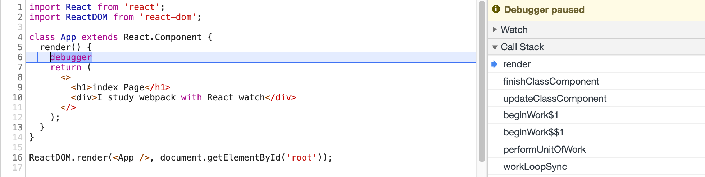

# 03-2.基础篇：webpack 进阶用法

[toc]

## 27 | 使用sourcemap

source map 是开发过程中的一个利器。webpack 会将源代码根据其配置使用不同的插件打包为一个 boundle 文件，这个文件已经和最初你所写的源代码千差万别了，很难通过这个文件来进行调试，所以我们需要 source map 来帮助我们进行调试。



默认情况下，在开发环境中构建 source map 的功能是开启的，在线上环境是需要关闭的，为什么要关闭是因为如果线上也有 source map 文件，则会将我们的代码逻辑暴露出来。

### source map 关键字

- eval：打包时，使用 eval 包裹source map 代码，包裹代码最后会有 url 来指定 source map 的源文件。
-  source map：产生 .map 文件，也就是与打包出来对应的文件，比如 js 或是 css 文件，相对应的文件。
- cheap：不包含列信息。有些时候报错，我们点开错误堆栈，这个时候可以看到其对应的行列，假设你使用的是 cheap 的 source map，那这个时候就不会定位到列，只会定位到行的信息。
- inline：将 .map 里的 js 代码作为 DataURI 嵌入，不单独生成 .map 文件，也就是 source map 的内容内联到 js 或是 css 之中。
- module：包含 loader 的 source map，也就是出错时可以进一步定位到 loader 

### source map 类型

| devtool（配置字段）            | 首次构建 | 二次构建 | 是否适合生产环境 | 可以定位的代码                           |
| ------------------------------ | -------- | -------- | ---------------- | ---------------------------------------- |
| (none)                         | +++      | +++      | yes              | 最终输出的代码                           |
| eval                           | +++      | +++      | no               | Webpack 生成的代码（一个个的模块）       |
| cheap-eval-source-map          | +        | ++       | no               | 经过 loader 转换后的代码（只能看到行）   |
| cheap-module-eval-source-map   | o        | ++       | no               | 源代码（只能看到行）                     |
| eval-source-map                | --       | +        | no               | 源代码                                   |
| cheap-source-map               | +        | o        | yes              | 是经过 loader 转换后的代码（只能看到行） |
| cheap-module-source-map        | o        | -        | yes              | 源代码（只能看到行）                     |
| Inline-cheap-source-map        | +        | o        | no               | 是经过 loader 转换后的代码（只能看到行） |
| Inline-cheap-module-source-map | o        | -        | no               | 源代码（只能看到行）                     |
| source-map                     | --       | --       | yes              | 源代码                                   |
| inline-source-map              | --       | --       | no               | 源代码                                   |
| hidden-source-map              | --       | --       | yes              | 源代码                                   |

从这个表格可以看到 source map 的类型非常的多，这些类型其实是根据**source map 关键字**排列组合得到的。

### 实际操作

这里，为了使打包后的打包不被默认的压缩，将 `webpack.prod.js` 的 `mode` 设置为 `none` ，而不是 `production` 。

接着，在配置中添加 `devtool` 字段，并设置不同的 source map 类型值。比如设置为 `eval` ：

```js
module.exports = {
  mode: 'none',
  //...
  devtool: 'eval'
}
```

那么就不会单独生成 .map 文件，而是在打包之后的文件中用使用 `eval` 来包裹 source map 代码，并在最后指定源文件地址：



如果设置为 `source-map`，则会生成一个 .map 文件，并在构建之后的文件最后指名所使用的是哪个 source map 文件：



如果设置为 `inline-source-map` 则会将 source map 的代码以 base64 的形式内联到构建之后的代码文件之中：



构建之后的文件大小是有 source map 代码的，所以会比没有 source map 的大很多。

#### 开发中使用 source map 来进行调试

首先，将上节课的代码拷贝到 `webpack.dev.js` 之中。然后，我们 index.js 中打一个断点，如下：

```js
import React from 'react';
import ReactDOM from 'react-dom';

class App extends React.Component {
  render() {
    debugger
    return (
      <>
        <h1>index Page</h1>
        <div>I study webpack with React watch</div>
      </>
    );
  }
}

ReactDOM.render(<App />, document.getElementById('root'));
```

然后在浏览器中打开开发者工具执行 `npm run dev` ，会看到会跳转到开发者工具的「Sources」面板下，并且窗口中出现如下代码：



这段代码是通过 webpack 构建之后生成的，和我们编写的源代码相差很大，这样并不方便我们进行调试。

所以，我们更改一下 `dev` 配置文件中的配置，添加 `devtool: 'source-map'` ，重新启动开发服务器，刷新网页，则会看到跳转到如下代码：




### 课后问答

基本上开发环境直接用source-map。
production环境就把source-map添加到Error Reporting Tool（e.g. Sentry）上。这样既不直接暴露源代码，也能方便解决production环境遇到的bug。

>作者回复: 嗯嗯，理解正确。


pdfT中source map 类型，首次构建，二次构建+++,++,+,--,-,0，是什么意思

> Webpack 官网有详细说明，请查阅，谢谢！
> https://webpack.docschina.org/configuration/devtool
>
>  
>
> 是构建代码（打包）速度的对比


老师， 你开篇说了，生产环境下不建议使用source map(我也觉得不应该将代码的业务逻辑暴露给其他人),  但是在这种情况下，线上报错我们应该如何来调试

> 作者回复: 一般情况下公司内应该是有前端监控系统的，一旦报错，可以把 sourcemap 上传到这个监控系统里面。但是不要把 sourcemap 文件和静态资源的 cdn 一起发布到线上就好了。


## 28 | 提取页面公共资源

## 29 | Tree Shaking的使用和原理分析

## 30 | Scope Hoisting使用和原理分析

## 31 | 代码分割和动态import

## 32 | 在webpack中使用ESLint

## 33 | webpack打包组件和基础库

## 34 | webpack实现SSR打包（上）

## 35 | webpack实现SSR打包（下）

## 36 | 优化构建时命令行的显示日志

## 37 | 构建异常和中断处理

