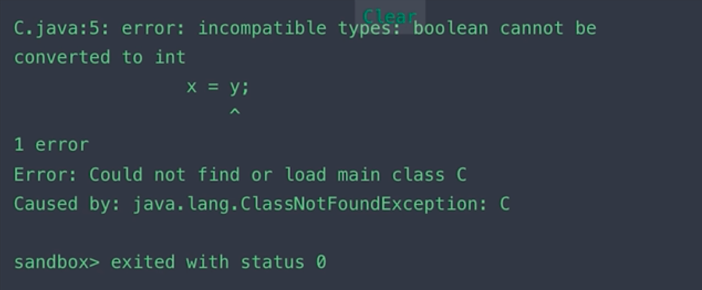

# 02 | 类型基础（1）：强类型与弱类型

 >课件及源代码地址
 >
 >https://github.com/geektime-geekbang/typescript-in-action

JS 是一门动态弱类型语言，那么与之对应自然就有静态和强类型语言，如何区分它们是在学习计算机语言之前首先要搞清楚的问题，理解了这些概念，你就会明白为什么在程序员之间有所谓的语言鄙视链，也会对 TS 诞生的原因有更深层次的认识。那么，本节课就将学习强类型语言和弱类型语言。

## 强类型语言

什么是强类型语言呢？遗憾的是对于这个概念有不同的解释，一个比较早的定义来自两位美国计算机科学家：

> 在强类型语言中，当一个对象从调用函数传递到被调用函数时，其类型必须与被调用函数中声明的类型兼容。
>
> —— Liskov, Zilles 1974

以下面的伪代码为例：

```js
A() {
  B(x)
}

B(y) {
  // y 可以被赋值 x，程序运行良好
}
```

这里我们调用了两个函数 A 和 B，当 A 调用 B 的时候，x 的类型必须与 y 的类型兼容，兼容意味着 y 可以被赋值 x，并且程序运行良好，这是一个相对宽泛的定义，并没有阐述具体的规则，后人对强类型语言的定义则会更精确一些。

> 强类型语言：不允许改变变量的数据类型，除非进行强制类型转换。

下面以 java 为例说明一下。

```java
class C {
  public static void main(String[] args) {
    int x = 1; //定义一个变量 x 为整型并赋值为 1
    boolean y = true; //定义一个布尔型变量 y 并赋值 true
    x = y; // 将 y 赋值给 x
    System.out.printIn(x) // 打印 x
  }
}
```

以上代码会报以下错误：



- 提示类型不兼容，不能将布尔型转换为整型

接着我们继续测试

```java
class C {
  public static void main(String[] args) {
    int x = 1; //定义一个变量 x 为整型并赋值 1
    boolean y = true; //定义一个布尔型变量 y 并赋值 true
		char z = 'a'; //定义一个字符型变量 z 并赋值 'a'
    x = z // 将 z 赋值给 x
    System.out.printIn(x) // 打印 x，这里会打印出 97
  }
}
```

- 不会报错，会打印出 97，这是因为 java 在这里进行了强制类型转换，将存储在字符型变量 `z` 中的 `'a'` 的 ASCII 码传递给了 `x`，这样 `x` 的类型依然是整型。


## 弱类型语言

> 弱类型语言：变量可以被赋予不同的数据类型

下面我们在 JavaScript 进行测试

```js
let x = 1; // 定义一个变量 a 赋值 1
let y = true; // 定义一个变量 y 赋值 true
x = y; // 将 y 赋值给 x，此时 x 的值为 true
let z = 'a'; // 定义一个变量 z 赋值 'a'
x = z;  // 将 z 赋值给 x，此时 x 的值为 'a'
```

- 上面这个过程中，x 从一开始的整型=>布尔型=>字符串，其类型一直在发生变化，从而可以看出 JS 是一门弱类型语言。


## 小结

在强类型中，对变量有严格的限制，不同类型的变量不允许相互赋值，从而避免产生很多低级错误。

而弱类型语言没有什么约束，虽然相对灵活，但也更加容易产生 bug。

下一节中我们将进一步学习「动态类型语言」与「静态类型语言」


> 老师讲课中所使用的在线编码平台工具：
>
> https://tool.lu/coderunner/


