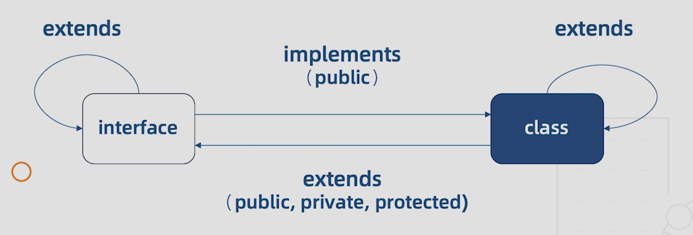

#  12 | 类与接口的关系

[TOC]

本节课将结合类与接口的知识来理清它们之间的关系。

## 类类型接口

类类型接口也就是一个接口可以约束类成员有哪些属性以及它们的类型。

```ts
interface Human {
  name: string;
  eat(): void;
}

class Asian implements Human {
  constructor(name: string) {
    this.name = name
  }
  private name: string //报错：属性“name”在类型“Asian”中是私有属性，但在类型“Human”中不是。ts(2420)
  eat() {}
  sleep() {}
}
```

这里我们定义了一个 `Human` 接口，它有一个 `name` 属性和一个 `eat` 方法，然后我们用 `Asian` 实现了这个接口，使用了 `implements` 关键字，这里需要注意：

- 类实现接口时，必须实现声明中所有的属性，缺少任意一个都会报错提示，但如果添加一个新的属性或者方法是可以的，比如上面第 12 行中的 `sleep` 方法

- 第二点是接口**只能约束类的公有成员**，比如如果将上面的 `name` 声明为私有成员为其添加 `private` 修饰符，则会提示：*属性“name”在类型“Asian”中是私有属性，但在类型“Human”中不是。ts(2420)*

- 接口也**不能约束类的构造函数**


## 接口的继承

接口可以像类一样相互继承，并且一个接口可以继承多个接口，比如：

```ts
interface Man extends Human {
  run(): void
}

interface Child {
  cry(): void
}
  
interfce Boy extends Man, Child {}
  
let boy: Boy = {
  name: 'Tom',
  eat() {},
  run() {},
  cry() {}
}
  

```

这里我们定义一个继承于 `Human` 的 `Man` 接口，并且给其添加 `run` 方法。然后，再单独定义一个 `Child` 接口，给它添加一个方法 `cry`。然后，再定义一个接口 `Boy` ，让它同时继承 `Man` 和 `Child`，继承多个接口时需要使用 `,` 将不同的接口分开。接着，我们定义一个对象，这个对象要符合 Boy 接口的定义，当我们没有为这个对象添加任何属性时，会提示我们其缺少 `run` `name` `eat` `cry` 四个属性，这个四个属性分别来自 `Human` `Man` `Child`，所以我们为其添加上。

从接口的继承可以看出，接口的继承可以**抽离出可重用的接口**，也可以**将多个接口合并为一个接口**。


## 接口继承类

**接口可以继承接口之外，也可以继承类**，这就相当于接口把类的成员都抽象了出来，也就是其只有类的成员结构而没有具体的实现，比如：

```ts
class Auto {
  state = 1
}

interface AutoInterface extends Auto {}

class C implements AutoInterface {
  state = 1
}
```

定义一个类 `Auto`，包含一个公共属性 `state` 并赋值为 1；接下来用一个接口 `AutoInterface` 继承这个类，之后，这个接口就隐含了 `state` 属性，要想实现这个 `AutoInterface` 接口，只要所实现的对象或者类中有 `state` 这个成员就可以了。

此外，`Auto` 的子类也能实现 `AutoInterface` 这个接口，比如：

```ts
class Bus extends Auto implements AutoInterface {
  
}
```

定义一个 `Auto` 的子类取名为 `Bus`，然后使用 `Bus` 实现 `AutoInterface` 接口，在这个子类中，我们就不必实现 `state` 属性，因为 `Bus` 是 `Auto` 的子类，自然就继承了 `state` 属性。

> new Bus().state // state 会直接添加到其实例上，并且已经赋值为 1，也就是说，子类会继承父类所声明的已赋值属性。

这里需要额外注意的是，接口在抽离类的成员时，不仅抽离了公共成员，而且抽离了私有成员和受保护成员。比如：

```ts
class Auto {
  state = 1
  private state2 = 2
}

interface AutoInterface extends Auto {}

class C implements AutoInterface { // 报错： 类“C”错误实现接口“AutoInterface”。
  state = 1
}
```

这里我们再给 `Auto` 定义一个私有成员 `state2` ，这样在类 `C` 中就会报错，由于 `C` 不是 `Auto` 的子类，自然也不能包含它的非公有成员。


## 类与接口的关系

由于接口和类的关系比较容易混淆，这里有整理一张图：



- 首先，接口与接口之间是可以相互继承的，这样就能够实现接口的复用
- 然后，类与类之间也可以相互继承，可以实现属性和方法的复用
- 然后，接口是可以通过类来实现的，但是接口只能约束类的公有成员
- 另外，接口也可以抽离出类的成员，抽离时会包含公有、私有、受保护成员（图中的方向有点问题）


## 课后问答

现在有这么一个问题，继承有私有属性和保护属性的类的接口用在什么地方呢？
首先根据课程中描述的这个接口不仅抽象了类的公共属性还抽象了其私有属性和受保护属性。
根据课程代码显示，这个接口只能在定义这个类的子类的时候才能使用。到目前为止的理解，定义子类继承父类的时候加不加这个接口好像都没啥影响，或者加不加有什么不同吗？这个继承有私有属性和保护属性的类的接口还能用在什么地方呢？

> 作者回复: 举个例子：一个UI类库定义了一个Button类并提供了ButtonInterface接口。现在你想实现一个自己的Button类，添加些自定义属性，那么只能是Button的子类去实现ButtonInterface接口，其他的类不能实现这个接口，即使与Button具有相同的成员。
>
> 这种接口的存在，对子类起到了约束作用，保证了继承关系。


最后那张图，中间的箭头标错了吧？

> 作者回复: 你可能是按照书写代码的顺序理解箭头的。
> PPT中间的剪头表示接口可以由类来实现，类可以由接口来继承，理解这个就行了。


所以接口继承类时，不应该继承带有私有属性和受保护成员的类，否则这个接口就不能实现除了 这个类的子类 外，别的类了，是这个意思吗？

> 作者回复: 这个意思是对的，但不存在应该不应该的问题，要看具体的目的是什么。（另外，接口是被类实现的，而不是实现类）


