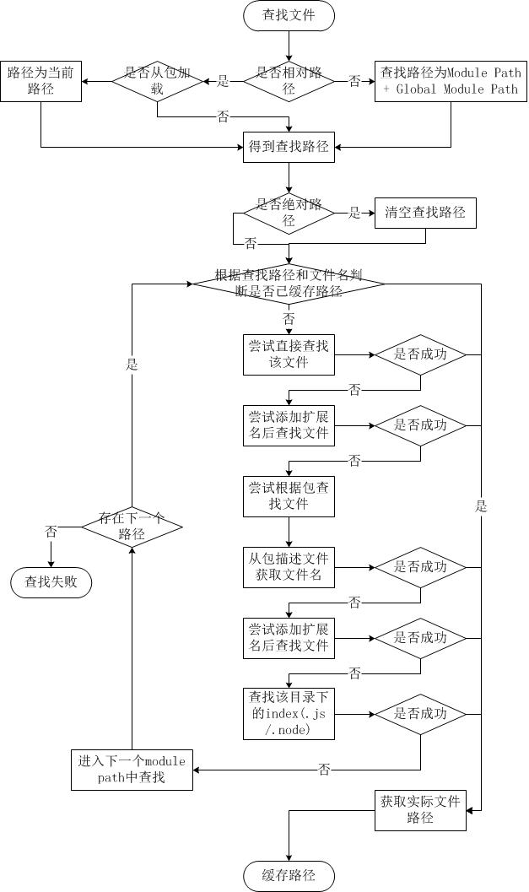

# 深入浅出 Node.js（三）：深入 Node.js 的模块机制

> 原文地址 - https://www.infoq.cn/article/nodejs-module-mechanism

专栏的第三篇文章《深入 Node.js 的模块机制》。之前介绍了 Node.js 安装的基础知识，本文将深入 Node.js 的模块机制。

## Node.js 模块的实现

之前在网上查阅了许多介绍 Node.js 的文章，可惜对于 Node.js 的模块机制大都着墨不多。在后续介绍模块的使用之前，我认为有必要深入一下 Node.js 的模块机制。

### CommonJS 规范

早在 Netscape 诞生不久后，JavaScript 就一直在探索本地编程的路，Rhino 是其代表产物。无奈那时服务端 JavaScript 走的路均是参考众多服务器端语言来实现的，在这样的背景之下，一没有特色，二没有实用价值。但是随着 JavaScript 在前端的应用越来越广泛，以及服务端 JavaScript 的推动，JavaScript 现有的规范十分薄弱，不利于 JavaScript 大规模的应用。**那些以 JavaScript 为宿主语言的环境中，只有本身的基础原生对象和类型，更多的对象和 API 都取决于宿主的提供，所以，我们可以看到 JavaScript 缺少这些功能**：

- JavaScript 没有模块系统。没有原生的支持密闭作用域或依赖管理。
- JavaScript 没有标准库。除了一些核心库外，没有文件系统的 API，没有 IO 流 API 等。
- JavaScript 没有标准接口。没有如 Web Server 或者数据库的统一接口。
- JavaScript 没有包管理系统。不能自动加载和安装依赖。

于是便有了 CommonJS（[http://www.commonjs.org](http://www.commonjs.org/)）规范的出现，其目标是为了构建 JavaScript 在包括 Web 服务器，桌面，命令行工具，及浏览器方面的生态系统。

**CommonJS 制定了解决这些问题的一些规范，而 Node.js 就是这些规范的一种实现。**Node.js 自身实现了 **require 方法作为其引入模块的方法**，同时 NPM 也基于 CommonJS 定义的包规范，实现了**依赖管理和模块自动安装等**功能。这里我们将深入了解一下 **Node.js 的 require 机制和 NPM 基于包规范的应用**。

### 简单模块定义和使用

在 Node.js 中，定义一个模块十分方便。我们以计算圆形的面积和周长两个方法为例，来表现 Node.js 中模块的定义方式。

```js
var PI = Math.PI;
exports.area = function (r) {
    return PI * r * r;
};
exports.circumference = function (r) {
    return 2 * PI * r;
};
```

将这个文件存为 circle.js，并新建一个 app.js 文件，并写入以下代码：

```js
var circle = require('./circle.js');
console.log( 'The area of a circle of radius 4 is ' + circle.area(4));
```

可以看到模块调用也十分方便，只需要 require 需要调用的文件即可。

在 require 了这个文件之后，定义在 exports 对象上的方法便可以随意调用。Node.js 将模块的定义和调用都封装得极其简单方便，从 API 对用户友好这一个角度来说，Node.js 的模块机制是非常优秀的。

### 模块载入策略

Node.js 的模块分为两类，一类为原生（核心）模块，一类为文件模块。原生模块在 Node.js 源代码编译的时候编译进了二进制执行文件，加载的速度最快。另一类文件模块是动态加载的，加载速度比原生模块慢。但是 **Node.js 对原生模块和文件模块都进行了缓存，于是在第二次 require 时，是不会有重复开销的。其中原生模块都被定义在 lib 这个目录下面，文件模块则不定性。**

```shell
node app.js
```

由于**通过命令行加载启动的文件几乎都为文件模块**。我们从 Node.js 如何加载文件模块开始谈起。加载文件模块的工作，主要由原生模块 module 来实现和完成，该原生模块在启动时已经被加载，进程直接调用到 runMain 静态方法。

```js
// bootstrap main module.
Module.runMain = function () {
    // Load the main module--the command line argument.
    Module._load(process.argv[1], null, true);
};
```

_load 静态方法在分析文件名之后执行

```
var module = new Module(id, parent);
```

并根据文件路径缓存当前模块对象，该模块实例对象则根据文件名加载。

```js
module.load(filename);
```

实际上在文件模块中，又分为 3 类模块。这三类文件模块以后缀来区分，Node.js 会根据后缀名来决定加载方法。

- .js。通过 fs 模块同步读取 js 文件并编译执行。
- .node。通过 C/C++ 进行编写的 Addon。通过 dlopen 方法进行加载。
- .json。读取文件，调用 JSON.parse 解析加载。

这里我们将详细描述 js 后缀的编译过程。**Node.js 在编译 js 文件的过程中实际完成的步骤有对 js 文件内容进行头尾包装**。以 app.js 为例，包装之后的 app.js 将会变成以下形式：

```js
(function (exports, require, module, __filename, __dirname) {
    var circle = require('./circle.js');
    console.log('The area of a circle of radius 4 is ' + circle.area(4));
});
```

这段代码会通过 vm 原生模块的 runInThisContext 方法执行（类似 eval，只是具有明确上下文，不污染全局），返回为一个具体的 function 对象。最后传入 module 对象的 exports，require 方法，module，文件名，目录名作为实参并执行。

这就是为什么 require 并没有定义在 app.js 文件中，但是这个方法却存在的原因。**从 Node.js 的 API 文档中可以看到还有 filename、dirname、module、exports 几个没有定义但是却存在的变量。其中 filename 和 dirname 在查找文件路径的过程中分析得到后传入的**。module 变量是这个模块对象自身，exports 是在 module 的构造函数中初始化的一个空对象（{}，而不是 null）。

在这个主文件中，可以**通过 require 方法去引入其余的模块。而其实这个 require 方法实际调用的就是 load 方法。**

load 方法在载入、编译、缓存了 module 后，返回 module 的 exports 对象。这就是 circle.js 文件中只有定义在 exports 对象上的方法才能被外部调用的原因。

以上所描述的模块载入机制均定义在 lib/module.js 中。

### require 方法中的文件查找策略

由于 Node.js 中存在 4 类模块（原生模块和 3 种文件模块），尽管 require 方法极其简单，但是内部的加载却是十分复杂的，其加载优先级也各自不同。


#### 从文件模块缓存中加载

尽管原生模块与文件模块的优先级不同，但是都不会优先于从文件模块的缓存中加载已经存在的模块。

#### 从原生模块加载

原生模块的优先级仅次于文件模块缓存的优先级。require 方法在解析文件名之后，优先检查模块是否在原生模块列表中。以 http 模块为例，尽管在目录下存在一个 http/http.js/http.node/http.json 文件，require(“http”) 都不会从这些文件中加载，而是从原生模块中加载。

原生模块也有一个缓存区，同样也是优先从缓存区加载。如果缓存区没有被加载过，则调用原生模块的加载方式进行加载和执行。

#### 从文件加载

当文件模块缓存中不存在，而且不是原生模块的时候，Node.js 会解析 require 方法传入的参数，并从文件系统中加载实际的文件，加载过程中的包装和编译细节在前一节中已经介绍过，这里我们将详细描述查找文件模块的过程，其中，也有一些细节值得知晓。

​	require 方法接受以下几种参数的传递：	http、fs、path 等，原生模块。

- ./mod 或../mod，相对路径的文件模块。
- /pathtomodule/mod，绝对路径的文件模块。
- mod，非原生模块的文件模块。

在进入路径查找之前有必要描述一下 module path 这个 Node.js 中的概念。对于每一个被加载的文件模块，创建这个模块对象的时候，这个模块便会有一个 paths 属性，其值根据当前文件的路径计算得到。我们创建 modulepath.js 这样一个文件，其内容为：

```js
console.log(module.paths);
```

我们将其放到任意一个目录中执行 node modulepath.js 命令，将得到以下的输出结果。

```js
[ '/home/jackson/research/node_modules',
'/home/jackson/node_modules',
'/home/node_modules',
'/node_modules' ]
```

Windows 下：

```js
[ 'c:\\nodejs\\node_modules', 'c:\\node_modules' ]
```

可以看出 module path 的生成规则为：从当前文件目录开始查找 node_modules 目录；然后依次进入父目录，查找父目录下的 node_modules 目录；依次迭代，直到根目录下的 node_modules 目录。

除此之外还有一个全局 module path，是当前 node 执行文件的相对目录（../../lib/node）。如果在环境变量中设置了 HOME 目录和 NODE_PATH 目录的话，整个路径还包含 NODE_PATH 和 HOME 目录下的.node_libraries 与.node_modules。其最终值大致如下：

```js
[NODE_PATH，HOME/.node_modules，HOME/.node_libraries，execPath/../../lib/node]
```

下图是笔者从源代码中整理出来的整个文件查找流程：



简而言之，如果 require 绝对路径的文件，查找时不会去遍历每一个 node_modules 目录，其速度最快。其余流程如下：

1. 从 module path 数组中取出第一个目录作为查找基准。
2. 直接从目录中查找该文件，如果存在，则结束查找。如果不存在，则进行下一条查找。
3. 尝试添加.js、.json、.node 后缀后查找，如果存在文件，则结束查找。如果不存在，则进行下一条。
4. 尝试将 require 的参数作为一个包来进行查找，读取目录下的 package.json 文件，取得 main 参数指定的文件。
5. 尝试查找该文件，如果存在，则结束查找。如果不存在，则进行第 3 条查找。
6. 如果继续失败，则取出 module path 数组中的下一个目录作为基准查找，循环第 1 至 5 个步骤。
7. 如果继续失败，循环第 1 至 6 个步骤，直到 module path 中的最后一个值。
8. 如果仍然失败，则抛出异常。

整个查找过程十分类似原型链的查找和作用域的查找。所幸 Node.js 对路径查找实现了缓存机制，否则由于每次判断路径都是同步阻塞式进行，会导致严重的性能消耗。

## 包结构

前面提到，JavaScript 缺少包结构。CommonJS 致力于改变这种现状，于是定义了包的结构规范（<http://wiki.commonjs.org/wiki/Packages/1.0> ）。而 NPM 的出现则是为了在 CommonJS 规范的基础上，实现解决包的安装卸载，依赖管理，版本管理等问题。require 的查找机制明了之后，我们来看一下包的细节。

一个符合 CommonJS 规范的包应该是如下这种结构：

- 一个 package.json 文件应该存在于包顶级目录下
- 二进制文件应该包含在 bin 目录下。
- JavaScript 代码应该包含在 lib 目录下。
- 文档应该在 doc 目录下。
- 单元测试应该在 test 目录下。

由上文的 require 的查找过程可以知道，Node.js 在没有找到目标文件时，会将当前目录当作一个包来尝试加载，所以在 package.json 文件中最重要的一个字段就是 main。而实际上，这一处是 Node.js 的扩展，标准定义中并不包含此字段，对于 require，只需要 main 属性即可。但是在除此之外包需要接受安装、卸载、依赖管理，版本管理等流程，所以 CommonJS 为 package.json 文件定义了如下一些必须的字段：

- name。包名，需要在 NPM 上是唯一的。不能带有空格。
- description。包简介。通常会显示在一些列表中。
- version。版本号。一个语义化的版本号（<http://semver.org/> ），通常为 x.y.z。该版本号十分重要，常常用于一些版本控制的场合。
- keywords。关键字数组。用于 NPM 中的分类搜索。
- maintainers。包维护者的数组。数组元素是一个包含 name、email、web 三个属性的 JSON 对象。
- contributors。包贡献者的数组。第一个就是包的作者本人。在开源社区，如果提交的 patch 被 merge 进 master 分支的话，就应当加上这个贡献 patch 的人。格式包含 name 和 email。如：

```json
"contributors": [{
    "name": "Jackson Tian",
    "email": "mail @gmail.com"
	}, {
    "name": "fengmk2",
    "email": "mail2@gmail.com"
}],
```

- bugs。一个可以提交 bug 的 URL 地址。可以是邮件地址（mailto:mailxx@domain），也可以是网页地址（http://url）。

- licenses。包所使用的许可证。例如：

```json
"licenses": [{
    "type": "GPLv2",
    "url": "http://www.example.com/licenses/gpl.html",
}]
```

- repositories。托管源代码的地址数组。

- dependencies。当前包需要的依赖。这个属性十分重要，NPM 会通过这个属性，帮你自动加载依赖的包。

以下是 Express 框架的 package.json 文件，值得参考。

```js
{
    "name": "express",
    "description": "Sinatra inspired web development framework",
    "version": "3.0.0alpha1-pre",
    "author": "TJ Holowaychuk 
```

除了前面提到的几个必选字段外，我们还发现了一些额外的字段，如 bin、scripts、engines、devDependencies、author。这里可以重点提及一下 scripts 字段。包管理器（NPM）在对包进行安装或者卸载的时候需要进行一些编译或者清除的工作，scripts 字段的对象指明了在进行操作时运行哪个文件，或者执行拿条命令。如下为一个较全面的 scripts 案例：

```js
"scripts": {
    "install": "install.js",
    "uninstall": "uninstall.js",
    "build": "build.js",
    "doc": "make-doc.js",
    "test": "test.js",
}
```

如果你完善了自己的 JavaScript 库，使之实现了 CommonJS 的包规范，那么你可以通过 NPM 来发布自己的包，为 NPM 上 5000+ 的基础上再加一个模块。

```shell
npm publish <folder>
```

命令十分简单。但是在这之前你需要通过 npm adduser 命令在 NPM 上注册一个帐户，以便后续包的维护。NPM 会分析该文件夹下的 package.json 文件，然后上传目录到 NPM 的站点上。用户在使用你的包时，也十分简明：

```shell
npm install <package>
```

甚至对于 NPM 无法安装的包（因为某些奇怪的网络原因），可以通过 github 手动下载其稳定版本，解压之后通过以下命令进行安装：

```shell
npm install <package.json folder>
```

只需将路径指向 package.json 存在的目录即可。然后在代码中 require('package') 即可使用。

Node.js 中的 require 内部流程之复杂，而方法调用之简单，实在值得叹为观止。更多 NPM 使用技巧可以参见<http://www.infoq.com/cn/articles/msh-using-npm-manage-node.js-dependence>。

## Node.js 模块与前端模块的异同

通常有一些模块可以同时适用于前后端，但是**在浏览器端通过 script 标签的载入 JavaScript 文件的方式与 Node.js 不同**。Node.js 在载入到最终的执行中，进行了包装，使得每个文件中的变量天然的形成在一个闭包之中，不会污染全局变量。而浏览器端则通常是裸露的 JavaScript 代码片段。所以为了解决前后端一致性的问题，类库开发者需要将类库代码包装在一个闭包内。以下代码片段抽取自著名类库 underscore 的定义方式。

```js
(function () {
    // Establish the root object, `window` in the browser, or `global` on the server.
    var root = this;
    var _ = function (obj) {
            return new wrapper(obj);
        };
    if (typeof exports !== 'undefined') {
        if (typeof module !== 'undefined' && module.exports) {
            exports = module.exports = _;
        }
        exports._ = _;
    } else if (typeof define === 'function' && define.amd) {
        // Register as a named module with AMD.
        define('underscore', function () {
            return _;
        });
    } else {
        root['_'] = _;
    }
}).call(this);
```

首先，它通过 function 定义构建了一个闭包，将 this 作为上下文对象直接 call 调用，以避免内部变量污染到全局作用域。续而通过判断 exports 是否存在来决定将局部变量 _ 绑定给 exports，并且根据 define 变量是否存在，作为处理在实现了 AMD 规范环境（<http://wiki.commonjs.org/wiki/Modules/AsynchronousDefinition>）下的使用案例。仅只当处于浏览器的环境中的时候，this 指向的是全局对象（window 对象），才将 _ 变量赋在全局对象上，作为一个全局对象的方法导出，以供外部调用。

所以在设计前后端通用的 JavaScript 类库时，都有着以下类似的判断：

```js
if (typeof exports !== "undefined") {
    exports.EventProxy = EventProxy;
} else {
    this.EventProxy = EventProxy;
}
```

即，如果 exports 对象存在，则将局部变量挂载在 exports 对象上，如果不存在，则挂载在全局对象上。

对于更多前端的模块实现可以参考国内淘宝玉伯的 seajs（<http://seajs.com/>），或者思科杜欢的 oye（<http://www.w3cgroup.com/oye/>）。

## 参考文献

- [http://www.commonjs.org](http://www.commonjs.org/)
- <http://npmjs.org/doc/README.html>
- <http://www.infoq.com/cn/articles/msh-using-npm-manage-node.js-dependence>
- <http://nodejs.org/docs/latest/api/modules.html>

## **关于作者**

田永强，新浪微博 @朴灵，前端工程师，现职于 SAP，从事 Mobile Web App 方面的研发工作，对 NodeJS 持有高度的热情，寄望打通前端 JavaScript 与 NodeJS 的隔阂，将 NodeJS 引荐给更多的前端工程师。兴趣：读万卷书，行万里路。个人 Github 地址:<http://github.com/JacksonTian>。