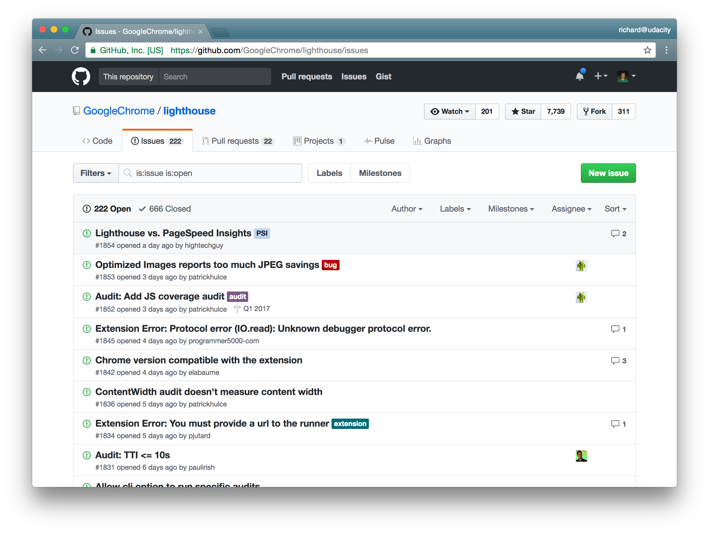
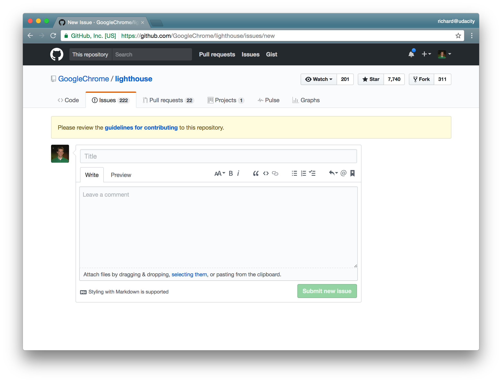

# 课程2：使用其他开发者的仓库

> 在这节课中，你将学习如何 fork 另一位开发者的项目。与其他开发者合作是个复杂的过程，所以接下来你将学习如何为公共项目做贡献。

---

[TOC]

---

## 1. 简介

在上节课我们学习了如何处理远程仓库，现在我们将在这节课利用这些技能复制另一个开发者的仓库，并着手进行处理。

我们在这节课中讲介绍的技能包括：

- 如何 fork 仓库（Forking a repository）
- 查看其它开发者对项目作出的更改（Reviewing another developer's changes）
- 以及有用仓库访问权限后需要作出什么样的更改（Knowing what changes to make）

在这节课中我们将经常使用的工具是 git log，我们将深入了解 git log 的各种功能，从而缩小信息在仓库中的范围。


---

## 2. fork 仓库

这是把叉子（fork），这是 fork 的名词含义（Noun）。当我们在版本控制中谈到 fork 的时候，我们要说的不是叉子的意思。而是 fork 的动词含义，即它代表的动作（分岔）。


想象一下你正在远程，你面前的路突然分开变成了两条，这时我们会说这条路分岔（forked）成了两条不同的路。这就是 fork 这个词的动词含义。

fork 就是指分裂（split），分成完全一模一样的两份。fork 一个仓库就是分出一个和这个仓库一模一样的副本。

注意 fork 不是 Git 的内容，你不能在命令行中运行 git fork 命令。git 没有 fork 这个子命令。

fork 是由宿主环境（hosting environment）提供的功能。GitHub 就是我们用到的宿主环境。在 GitHub 页面上有一个可以让你复制仓库的 fork 按钮。假设你在 GitHub 的仓库页面上点击了 fork 按钮，这是你就复制了这个仓库到你自己的账户下。


这就是 fork 的含义：

- 复制一个仓库，并成为这个仓库副本的所有者。

---

在版本控制术语中，如果你 "fork" 一个仓库，则是指**复制**它。特别是当你 fork 属于别人的仓库时，你将制作**他们**仓库的完全一样的副本，之后这个副本便变成**你的**。

"fork" 的概念也不同于"克隆"。在克隆仓库时，你也会获得完全一样的仓库副本，但**克隆发生在<u>本地</u>计算机上，并且克隆的是<u>远程</u>仓库。**当你 fork 仓库时，会创建**远程**仓库的一份新副本。新副本也是一个**远程**仓库，但它现在属于你。

### 有 `fork` 子命令吗？

fork 不在命令行上执行；也不存在 `git fork` 命令。你可以尝试运行以下命令:

```
$ git fork
```

[*终端上正在运行git fork（不存在！）命令。Git 没有 fork 子命令，所以它的回应是建议使用替代命令。*](https://classroom.udacity.com/courses/ud456/lessons/5e203cba-a6a7-4f9f-8a72-65ea05b1f74b/concepts/9462fdee-18d9-4e88-9442-85fcc5e42b69#)

如你所见，尝试运行 `git fork` 命令会产生错误。（另外，`fsck` 并不是粗话，它表示"文件系统检测"，指的是审核文件的一致性。）

### 修改克隆的仓库

##### 请执行以下步骤并回答下面的问题。

Task List

- 使用 `git clone` 克隆 Lam 的 my-travel-plans 项目
- 至少对它进行一项修改
- 提交更改
- 使用 `git push` 将你的更改推送回 Lam 的项目

#### 习题 1/2

你能否成功将更改推送到了远程仓库？

- 是
- 否
  - 由于你不是仓库所有者，你无法自动向它添加你的更改。 


#### 习题 2/2

在你尝试推送后显示的输出行中，有一行包含 "fatal" 一词。那么，该词之后的内容是什么？

- 你没有正确的权限
- 无法访问
  - 正确！ 
- 你是所有者吗？
- 尝试使用其他帐户


**我们可以从这个小实验中看出，如果一个仓库不属于你的帐户，那么你便不具有修改它的权限。**

**这里 fork 就要派上用场了！你不能直接修改原仓库，但如果你将仓库 fork 到自己的帐户中，便拥有完全控制权了。**

### fork Lam 的项目

我将自己克隆 Lam 的项目。我的帐户没有直接编辑她的仓库的权限，所以我要将此仓库 fork 到我自己的帐户。

##### 请登录你的 GitHub 帐户，然后按以下步骤操作：

Task List

- 在你的浏览器中转至 [Lam 的 my-travel-plans 项目](https://github.com/udacity/course-collaboration-travel-plans)
- 点击 fork 按钮将她的仓库复制到你的帐户
- 确认现在你的仓库中列出了 Lam 的项目

我们来看看仓库的名称：

[*fork 项目后你的 GitHub 配置文件名称旁边会显示新的项目名称。此外，名称下面还会说明原始项目所在的位置。*](https://classroom.udacity.com/courses/ud456/lessons/5e203cba-a6a7-4f9f-8a72-65ea05b1f74b/concepts/9462fdee-18d9-4e88-9442-85fcc5e42b69#)

可以看到我的帐户名 (richardkalehoff) 和仓库名称是如何显示的。并且，在仓库名称下，显示 "forked from udacity/course-collaboration-travel-plans"。这表明此项目在**我的**帐户中，但它与复制自的原始项目有联系。

挺不错的，对吧！现在你可以 fork GitHub 上的任何公共仓库 - 即你可以将仓库复制到自己的帐户中，并对获得的副本拥有完全控制权。

那么，不如你自己动手 fork 几个仓库练习一下吧！这里有几个你可以尝试：

- <https://github.com/udacity/course-git-blog-project>
- <https://github.com/udacity/frontend-nanodegree-styleguide>
- <https://github.com/GoogleChrome/lighthouse>
- <https://github.com/jquery/jquery>

## fork 推送/拉取

因为 fork 仓库会使你在自己的帐户中拥有一份副本，所以你可以将其克隆到你的计算机，对其进行更改，然后将这些更改推送回 fork 的仓库。但记住，它会将更改推送回**你的**远程仓库，而不是被 fork 的**原始**远程仓库。

---

现在打开的是 course-collaboration-travel-plans 仓库，它是从 Lam 的项目那边 fork 过来的。


现在要在本地机器上做一些修改，因此需要克隆该仓库。先获取克隆的 URL。


现在，转到终端并克隆该项目。

运行 `git clone https://...，` 粘贴该仓库的 URL 将其克隆到我的机器上。

使用 cd 命令转到该项目中。

现在，将切换到代码编辑器并做一些更改。

在切换到代码编辑器之前，先切换到一个新的分支，以便将所有更改添加到该分支，而不是添加到 master 分支上。

-  使用命令 `git checkout -b include-richards-destinations` 创建并切换到一个叫 include-richards-destinations 的分支上。

我希望 Lam 来到我的目的地，因此在这里想她的项目中添加这些目的地。我将添加为三个不同的 commit，因为在这门课的后期将使用这三个独立的 commit。

- 在 19 行的后面添加一个 Floride 的目的地，将 `<h2>` 中的内容换位 Florida，并将父元素 div 的 id 属性值修改为 florida
- 接着在 css 文件中，为 Florida 添加样式，添加背景颜色为 #03a9f4
- 最后 commit 这些更改，在 commit 前，我们应该运行下 git diff 确保添加了所有内容。
  - add 这些更改：`git add .`
  - 然后 commit 它们：`git commit -m 'Add destination to Florida`

现在我们继续添加目的地，这次我们将目的地设为 Paris，其余操作与上面相同。只是 bgc 为 #d32f2f

最后添加目的地 Scotland，bgc 为 #388e3c。

我们来快速查看下 git log

- `git log --oneline --graph --all`

可以看到这是新的 include-richards-destinations 分支，而 master 分支在这里，尤其是远程 origin/master 分支位于这个 commit 上。


所以，我们只需将这个分支推送到远程仓库上，以将这些 commit 提交到远程仓库中。

- 使用：`git push origin include-richards-destinations`
- 输入用户名和密码

这样就在远程仓库上创建了这个新分支。我们到网站上查看下。

现在位于远程仓库的 master 分支上。


我们需要切换到另一个我们刚刚推送的分支，以便查看这些更改。

---

### 小结

fork 是一种在托管服务上完成的操作，如 GitHub。fork 仓库会创建与原始仓库完全相同的副本，并将该副本移动到你的帐户。你对 fork 的仓库拥有完全控制权。修改 fork 的仓库不会更改原始仓库。

---

## 3. 查看现有工作

当你是项目唯一的开发者时，很容易知道项目已经取得的进展，因为一切都由你自己完成。但如果是团队协作，事情会变得有点复杂 - 无论该团队在本地办公室，还是通过互联网一同进行开发。

有时你可能很难看到其他开发者在项目中所做的工作，特别是当开发者位于多个不同的分支上时。我如何看到 Deepesh 所做的所有 commit？或者，如果 Christine 做了更改，并表示她的 commit 能解决我们的项目票跟踪系统中的 issue 47，我们如何在仓库中发现查明这些信息？

我们可以使用非常强大的 `git log` 命令，查明其他开发者所做工作的详细信息。

### 克隆 Lighthouse 项目

我们首先需要下载一个正在进行多人协作的项目。让我们下载 Google 的 Lighthouse 项目，这是一个用于对渐进式网页应用进行审计、性能度量和提供最佳实践的应用。

这是[GitHub 上的 Lighthouse 项目](https://github.com/GoogleChrome/lighthouse)。

[*从 GitHub 克隆 Google 的 Lighthouse 项目。*](https://classroom.udacity.com/courses/ud456/lessons/5e203cba-a6a7-4f9f-8a72-65ea05b1f74b/concepts/5764b331-ef76-44f5-b627-a917fa97d870#)

##### 为确保我们的步调一致，请完成：

Task List

- 克隆 [Lighthouse 项目](https://github.com/GoogleChrome/lighthouse)
- 使用 `cd` 命令进入目录

### 筛选协作者的 commit

将 commit 的范围缩小到你需要的那些是一件麻烦事。我们来看看查明我们的协作者所完成工作的几种不同方式！

#### 按 commit 作者分组

这不是一个巨大的项目，但仍有超过 1,000 个 commit 。要看到每位贡献者在此仓库中添加了多少 commit ，一个快捷的方法是使用 `git shortlog` 命令：

```
$ git shortlog
```

[*终端正在显示运行 git shortlog 命令的结果。它显示了按作者排序的所有 commit 。*](https://classroom.udacity.com/courses/ud456/lessons/5e203cba-a6a7-4f9f-8a72-65ea05b1f74b/concepts/5764b331-ef76-44f5-b627-a917fa97d870#)

在上面的截图中，我们可以看到：

- Abby Armada 在仓库中添加了一个 commit
- Addy Osmani 添加了七个 commitb
- Adriano Caheté 添加了一个 commit
- André Cipriani Bandarra 添加了一个 commit

`git shortlog` 显示了按字母顺序排序的人名列表，以及他们对应的提交说明。如果我们只想看到每个开发者的 commit 数量，我们可以添加几个选项：用 `-s` 仅显示 commit 的数量（而不是每个 commit 的消息），以及用 `-n` 来按数量排序（而不是按作者姓名的字母顺序）。

```
$ git shortlog -s -n
```

[*使用 git shortlog 与 -s -n 选项，仅显示每位作者的 commit 数量，并按数量排序。*](https://classroom.udacity.com/courses/ud456/lessons/5e203cba-a6a7-4f9f-8a72-65ea05b1f74b/concepts/5764b331-ef76-44f5-b627-a917fa97d870#)

我们可以在上图中看到，Surma 向 Lighthouse 项目添加了五个 commit 。这五个分散在整个仓库中。如果我们只想看到 Surma 的这五个 commit 呢？

#### 按作者筛选

另一种显示某个作者所有 commit 的方法是使用常规的 `git log` 命令，但包含 `--author` 选项来筛选所述作者的 commit 。

```
$ git log --author=Surma
```

[*终端应用显示了运行 git log --author=Surma 的结果。输出仅显示了 Surma 所做的 commit 。*](https://classroom.udacity.com/courses/ud456/lessons/5e203cba-a6a7-4f9f-8a72-65ea05b1f74b/concepts/5764b331-ef76-44f5-b627-a917fa97d870#)

#### 习题 1/3

再次运行 `git shortlog -s -n`，你会看到 "Paul Irish" 和 "Paul Lewis"。那如果运行下面的命令：

```
$ git log --author=Paul
```

会显示什么呢？

- 仅 Paul Irish 的 commit
- 仅 Paul Lewis 的 commit
- Paul Irish 和 Paul Lewis 的 commit 都有
  - 这将显示所有姓名以 "Paul" 开头的作者的 commit 。所以它将显示 Paul Irish 和 Paul Lewis 的 commit 。 
- 它会让你选择 Paul Irish 或 Paul Lewis
- 什么都不会显示


如果我们只想看到 Paul Lewis 的 commit ，我们需要运行：

```
$ git log --author="Paul Lewis"
```

> #### ⚠️ 引号很重要 ⚠️
>
> 注意上一个命令中使用的引号。如果它**不加**引号，像 `git log --author=Paul Lewis`，就无法正常运行。如果**不加**引号，Git 会认为 `Lewis` 不是 "author" 选项的一部分，从而导致错误。


Paul Lewis 在 Lighthouse 项目中的**第一个** commit ，其 SHA 的前七个字符是什么？

c09a442

- 我使用的命令是 `git log --oneline --author="Paul Lewis"`，然后我滚动到了列表底部。 

### 按搜索内容筛选 commit

在讲解“按搜索内容筛选 commit”这部分之前，我认为我需要强调一下编写好的**描述性**提交说明的重要性。编写描述性提交说明，会使你之后能很轻松地搜索提交说明，找到你想要的东西。

另外记住，**如果提交说明不足以解释 commit 的内容，则你可以在描述区域中提供关于该 commit 用途的详细说明。**

我们以 commit `5966b66` 为例，来说明如何在 lighthouse 项目的 commit 中包含额外详细信息：

```
$ git show 5966b66
```

[*终端应用显示了 Lighthouse 项目中的 commit 5966b66。作者提供了关于此 commit 的额外信息。*](https://classroom.udacity.com/courses/ud456/lessons/5e203cba-a6a7-4f9f-8a72-65ea05b1f74b/concepts/5764b331-ef76-44f5-b627-a917fa97d870#)

提交说明为“配置由白名单集成运行的 Lighthouse (#1830)”。但除此之外还有一些文本。在提交说明下面，你还会看到看到几行有关 commit 的其他信息。此部分提供了有关**为何**需要此 commit 的更多信息。

**那么这些详细信息为何重要呢？一方面，你将能更容易地回头查看对仓库所做的更改，其他人也更容易查看更改。另一方面是你将能根据当前说明或描述区域中的信息筛选 commit 。**

我们可以使用 `--grep` 选项筛选 commit 。

我们再来尝试筛选提到 "bug" 一词的 commit ，使用下面任何一个命令都可以这么做：

```
$ git log --grep=bug
$ git log --grep bug
```

> #### ⚠️ 注意空格 ⚠️
>
> 注意，空格在这里也是一个问题。如果你尝试搜索包含多个词且单词之间有空格的内容，则需要将空格也包含在引号内。例如，要搜索 `unit tests`，你需要使用以下命令 `git log --grep="unit tests"`。

> #### 💡 `grep` 的更多说明 💡
>
> 如果你不知道 `grep` 是什么，那么 `--grep` 选项可能看起来不像是选项名称的合理选择。Grep 是一个模式匹配工具，它**不在**本课程教学范围内。但是简单介绍一下，如果你运行 `git log --grep "fort"`，那么 Git 将显示顺序包含字符 `f`、`o`、`r`、`t` 的 commit 。
>
> 有关 Grep 的更多信息，请查看我们的 [Shell 讲习班课程](https://www.udacity.com/course/shell-workshop--ud206).

### 习题 3/3

以下浏览器之一具有一个 CSS 错误，但使用一个 commit 修复了。使用 `git log` 和 `--grep` 选项找出哪个浏览器有错误。

- Chrome
- Safari
- Firefox
  - 正确，是 Firefox！这可以通过运行 `git log --grep "css bug"` 并查看提交说明来确定。 
- Edge
- Opera


### 小结

`git log` 命令非常强大，你可以使用它来深入了解关于仓库的很多信息。而且，它在探索有关你与他人协作的仓库的信息这一方面很实用。你可以使用 `git log` 完成以下任务：

- 使用 `git shortlog` 按作者对 commit 分组

```
  $ git shortlog
```

- 使用 `--author` 选项筛选 commit

```
  $ git log --author="Richard Kalehoff"
```

- 使用 `--grep` 选项筛选 commit

```
  $ git log --grep="border radius issue in Safari"
```

grep 是一个复杂的话题，你可以[在此维基页面 - 英](https://en.wikipedia.org/wiki/Grep)|[百度百科 - 中](https://baike.baidu.com/item/GREP/5997841?fr=aladdin) 上找到关于它的更多信息，或参加我们的 [Shell 讲习班课程](https://www.udacity.com/course/shell-workshop--ud206)。 

---

## 4. 确定你的任务

### 你的任务

假设你正在使用某个第三方库构建一个项目。如果在使用此第三方库时遇到 bug 或拼写错误，该怎么办？虽然你有能力修复它，但你没有直接访问原库进行修改的权限。不过这不是问题，因为你知道 fork 其他开发者的仓库可以将其复制到你的帐户，使你可以全权对它执行 `git pull` 和 `git push`！

但是，当你获得了其他开发者项目的副本，并拥有完全访问权限后，你应该做什么？我们将在下节课学习这一部分，但是如果你 fork 了一个项目，并且你的 fork 中包含原项目所没有的代码，则可以通过向原项目的维护者发送一个请求，将你的代码更改包含在其中，请求维护者将这些更改拉取到原项目中。这种请求称为“拉取请求”（Pull Request）。再次说明，我们将在下一课中介绍发送和使用“Pull Request”。所以，现在你知道如何将你的代码加入到原项目中的方法，并且你想帮助解决这个拼写/代码错误。那么你有任务在身啦！但是，你如何以原项目维护者能接受的方式实际对项目做出贡献，并使他最终合并你的更改？记住，你要做的第一件事，是在项目中寻找一个名为 `CONTRIBUTING.md` 的文件。

### CONTRIBUTING.md 文件

`CONTRIBUTING.md` 文件的名称特别采用全大写，以方便查找。你可能会从它的名称猜到文件的用途，**此文件列出了你要为项目做出贡献时所应遵循的信息。**在开始任何开发工作之前，应先找到此文件。
我们来看看 Lighthouse 项目的 CONTRIBUTING 文件：

[*Google 的 Lighthouse 项目的 CONTRIBUTING.md 文件。*](https://classroom.udacity.com/courses/ud456/lessons/5e203cba-a6a7-4f9f-8a72-65ea05b1f74b/concepts/040ba8b2-066f-48fa-829d-1c66558c7e75#)

你可以看到文件的顶行说：

> 欢迎你提供帮助！本文档介绍了如何成为贡献者并向项目提交代码。

本文件有两个主要部分：

- "For Contributors" 面向贡献者的部分
- "For Maintainers" 面向维护者的部分

每部分都有各自的小节，指导读者如何加入此项目和做出贡献。

我们来看看签署贡献者许可证的小节。以下是在制作此课程时此小节的显示内容：

[*Google 的 Lighthouse 项目中 CONTRIBUTING.md 文件的“贡献者许可协议”（Contributor License Agreement）部分。*](https://classroom.udacity.com/courses/ud456/lessons/5e203cba-a6a7-4f9f-8a72-65ea05b1f74b/concepts/040ba8b2-066f-48fa-829d-1c66558c7e75#)

可以看到，要为此项目做出贡献，你需要签署 Google 的“贡献者许可协议”。


查看 [Lighthouse 项目的 CONTRIBUTING 文件](https://github.com/GoogleChrome/lighthouse/blob/master/CONTRIBUTING.md)。哪个文件包含有关 Lighthouse 项目的代码样式的信息？

> 正确！全都在 `.eslintrc` 文件中。 


可以看到，此贡献者文件中包含大量信息。所以**当你想对一个项目做出贡献时，一定要查阅 CONTRIBUTING.md 文件。**

### **GitHub Issues**

如果你的代码更改只是修改简单的拼写错误，那么你可以直接进行更改。但如果你要做涉及大量文件的重大修改，则你可能要在开始之前，先获得项目维护者的批准。你肯定不想花几个小时更改项目，最后却发现别人正在做同样的事情。到头来，花费了大量时间和精力做了重复工作。在 CONTRIBUTING.md 文件中，它解释了应该**如何**规范书写代码，以及你做出贡献的方式，但你如何知道应该贡献**什么**呢？你应该直接与项目维护人员交谈。GitHub 有一个非常赞的页面，使你能以公开的方式向项目维护者提问，让每个人都能看到项目的动态。

这是 GitHub 的 Issues 界面：

[*Lighthouse 项目的 Issues 页面。*](https://classroom.udacity.com/courses/ud456/lessons/5e203cba-a6a7-4f9f-8a72-65ea05b1f74b/concepts/040ba8b2-066f-48fa-829d-1c66558c7e75#)

注意，**这里说的"Issues（问题）"并不代表实际存在错误，它可以是需要对项目进行的任何改变。**GitHub 的问题跟踪器相当高级。每个问题都可以：

- 应用一个或多个标签
- 被分配给个人
- 确定一个里程碑（例如问题将由下一个主要版本解决）

但问题跟踪器最重要的一个方面在于，每个问题都可以有自己的评论区，使开发者围绕这个问题展开对话。

查看这个有很多评论的[问题](https://github.com/GoogleChrome/lighthouse/issues/1842)：

[*关于此 Issue 的前几个评论在讨论解决 Chrome 兼容性和 Lighthouse 扩展的方法。*](https://classroom.udacity.com/courses/ud456/lessons/5e203cba-a6a7-4f9f-8a72-65ea05b1f74b/concepts/040ba8b2-066f-48fa-829d-1c66558c7e75#)

Issue 的另一个很棒的功能在于：

- 你可以订阅某个 Issue ，这样你便会获得新评论和代码更改的通知
- 你可以就具体变更与项目维护者持续交流

在向某个文件贡献任何内容之前，请查看 `CONTRIBUTING.md` 中的说明。然后查看项目的 Issue，看是否有哪些与你要贡献的内容类似。如果有，则订阅该 Issue 并阅读现有的对话，看你是否可以提供帮助。如果你查看了 Issues 列表，没有看到与你要做的事情类似的内容，那么你可以创建自己的新 Issue。在 GitHub 问题界面的每个页面上，都能找到“New Issue（新建问题）”按钮：

[*Lighthouse 项目问题页面上的 New Issue（新建问题）按钮。*](https://classroom.udacity.com/courses/ud456/lessons/5e203cba-a6a7-4f9f-8a72-65ea05b1f74b/concepts/040ba8b2-066f-48fa-829d-1c66558c7e75#)

点击该按钮可以创建新问题

[*Lighthouse 项目的 New Issue 页。表格上方显示了要求参阅贡献准则的提醒。*](https://classroom.udacity.com/courses/ud456/lessons/5e203cba-a6a7-4f9f-8a72-65ea05b1f74b/concepts/040ba8b2-066f-48fa-829d-1c66558c7e75#)

### New Issue 页

新建问题页好的一点在于，如果项目有 CONTRIBUTING.md 文件，它会在页面顶部显示一个提醒，要求你查看有关如何为项目做贡献的准则。点击"guidelines for contributing"链接，可以转至 CONTRIBUTING.md 文件。

GitHub 问题页面支持 Markdown，所以当你创建了自己的问题后，可以使用 Markdown 编排格式，并通过包含链接、图像、项目符号列表和代码块按照你想要的方式进行编写。

> #### 💡 学习 Markdown！ 💡
>
> 从 README 文件，到新建问题页面及评论，Markdown 都极其重要！如果你不熟悉 Markdown，请查看我们的[编写 README] 课程 ([https://www.udacity.com/course/writing-readmes--ud777)，我们将会讲解关于](https://www.udacity.com/course/writing-readmes--ud777)%EF%BC%8C%E6%88%91%E4%BB%AC%E5%B0%86%E4%BC%9A%E8%AE%B2%E8%A7%A3%E5%85%B3%E4%BA%8E) Markdown 的所有知识。该课程十分简短，有什么理由不花上一小时时间学习这项强大的技能！

与编写描述性的提交说明一样，你在创建问题时，要给它一个信息丰富的标题，简要说明你想要做的事情。然后，在评论部分，提供大量关于此更改的详细信息，可以是你为什么认为此更改有必要，也可以是它如何改进项目。

通常情况下，项目的维护者都有全职工作，只在闲暇时间研究项目，因此，在你急着进行修改前，请给他们一些时间来回答你的问题。一旦项目维护者给予批准，你便可以开始应用想要贡献给项目的更改了。

### 特性分支

组织你想贡献给项目的一系列 commit 或更改的最佳方法，是**将它们全部放在一个特性分支上**。我说的**特性分支**是什么意思呢？与主分支不同，主分支是保存整个项目的所有 commit 的默认分支，而特性分支仅保存单个概念或单个更改区域的 commit 。

例如，如果登录某个网站的登录表单有问题，则解决此特定问题的分支名称可以叫做：

- `login`
- `login-bug`
- `signup-bug`
- `login-form-bug`
- 等等。

有很多名称可以用作特性分支的名称。你只需为分支提供一个清晰的描述性名称，以便在列出所有分支时，你可以立即根据名称确定要在分支中做哪些更改。

#### 习题 2/2

Lighthouse 项目的一个分支名称为 `add-a11y-tests`。你认为这是一个用于特性分支的好名字吗？ （提示 - `a11y` 代表"accessibility"。在"accessibility" 中，`a` 和 `y` 之间有十一个字母，所以缩写为了 `a11y`！）

- Yes
  - 是。它告诉我们它正在添加可访问性测试。 
- No


要记住的一点是，**有时项目会对特性分支的命名有特定要求。**例如，**如果一个分支将要解决错误修复，那么许多项目会要求添加一个 `bugfix-` 前缀**。回到我们处理登录表单错误的分支，它得被命名为 `bugfix-login-form`。所以一定要阅读 CONTRIBUTING.md 文件，确定项目是否对特性分支的命名提供了特别说明。

### 最佳实践

#### 编写描述性的提交说明

在谈论如何命名分支，以清晰描述分支会包含**哪些**更改的同时，我想另外提醒一下如何编写清晰、描述性的提交说明。**你的分支名称和提交说明描述得越清楚，项目维护者用于询问你的代码的用途，或者自己去深入了解代码的时间就越少。项目维护者需要做的工作越少，将你的更改纳入项目的速度就越快。**

#### 创建短小而明确的 commit

这一点我们之前已经强调了很多次，请确保在对项目 commit 更改时，使用短小的 commit。不要进行大量 commit，记录 10 多个文件和数百行代码的更改。最好频繁多次地进行小的 commit，只记录很少数量的文件和代码更改。

你可以这样想：如果开发者不喜欢你的大量 commit 中的**一部分**更改，他们不可能说"我赞成 commit A，只是不赞成改变边栏背景颜色的那部分。" **一个 commit 不能分解成几个小块，所以确保你的 commit 足够小，每个只集中解决一个更改。**这样，维护者可以说“我赞成 commit A、B、C、D 和 F，但不赞成 commit E。

#### 更新 README

最后，如果你添加的任何代码更改会使项目发生极大的变化，则应更新 README 文件以向其他人说明此更改。

### 小结

在开始任何工作之前，确保阅读项目的 CONTRIBUTING.md 文件。

接下来，查看项目的 GitHub 问题

- 查看现有的问题，看是否有哪些内容类似于你想贡献的更改
- 如有必要，创建一个新的 Issue
- 与项目维护者交流你想要做出的更改

当开始开发后，将所有工作 commit 到特性分支上：

- 不要在主分支上工作
- 确保给特性分支赋予一个清晰、描述性的名称

以及编写 commit 的一般最佳实践

- 频繁少量 commit
- 使用清晰、具有描述性的提交说明
- 必要情况下，更新 README 文件


