# p4. 构建 Redux Store

>  你将向应用的 store 添加其他属性，利用 reducer 组合和状态标准化来优化应用。你还将完成课程项目。

[TOC]

## 4.1 简介

看到这里，你可能已经对 Redux 很熟悉了，你可能注意到了，目前我们的 store 只限于一个 reducer 访问。这对于小应用完完全全够用，但是对于具有复杂数据结构的大应用而言，却是不可扩展的。

在本课中，我们将学习组合 reducer 和标准化 reducer 结构，这些技能将使你在构建复杂应用的同时保持数据的正确性和可维护性。

在这节课，我们将学习一些很重要，但却经常在创建 Redux 应用时被忽略的方面。 

---

## 4.2 combineReducers

假如说我们有一个 reducer 用于处理书籍 action，每当分派一个书籍 action 就会调用书籍 reducer 并返回书籍的状态。那如果我们扩展应用，使它包含用户和用户 action 呢？我们可以修改书籍 reducer 来处理用户 action，但这并非理想的做法，相反，我们应该创建另一个 reducer 来处理用户 action，这样的设计的问题是，为了创建一个 store，Redux 的 createStore 方法只能接收一个 reducer，我们将在更高的一个层级上创建一个 reducer，它使用组合来调用其他两个 reducer，我们来看看实际操作。


---

### Reducer 合成

到目前为止，我们只有一个 reducer，这也是可行的，但是随着应用规模变大，可能会变得难以管理。假设有一个 "users" reducer：

```react
function users (state = {}, action) {
  switch (action.type) {
    case 'ADD_USER' :
      return {}
    case 'REMOVE_USER': 
      return {}
    default :
      return state
  }
}
```

如果我们想向 Redux store 添加图书呢？用户和图书是两种截然不同的数据。让 users reducer 管理图书的状态并不合理。这就需要创建另一个 reducer：

```react
function users (state = {}, action) { 
   // ...
}

function books (state = {}, action) { 
   // ...
}
```

我们将使用单独的 reducer 处理独立的独特状态。这一流程称为 **reducer 合成**。但是，现在有个问题：Redux 的 `createStore()` 方法仅接受*一个* reducer！为了创建有效的 store，我们依然需要想办法**将这两个 reducer 结合成一个 reducer。**

---

现在我们的日历状态都设置好了，我们需要做的是找出当我们向食谱 API 发出 API 请求（我们最终会这么做）并当我们获得响应时，我们应该在 Redux store 的什么地方保存该事物，具体来说是食谱。

一种解决方式是直接抓取整个食谱对象，将它放入关联的餐饭（meal）中。但问题是，假如你想让周一的晚餐都一样，周二的晚餐也都一样，那么结果就是我们会有一个非常大的对象，即这里的周一晚餐：

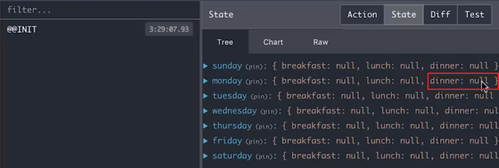

同样，周二晚餐也会有完全一样的重复对象。但是在 Redux 中，完全不建议复制数据，相反我们要做的是在状态上创建另一个属性。具体来说，我们需要做的是将所有这些属性都放在 calendar 属性内，然后我们想创建一个全新的叫做 food 的属性，这样我们的 state 对象就有了一个 food 属性和一个 calendar 属性。这样，每当这些餐饭需要引用食谱时，它们可以直接引用 food 属性。我们来看看具体操作是怎样的。

在 reducers 文件夹下的 index.js 文件中，我要做的是创建一个全新的 reducer。那么日历 reducer 指定了状态中 calendar 属性的形状，而我们要做的是同样创建一个食物 reducer，它将一些状态作为输入，初始状态设为一个空对象，并接受一个 action：

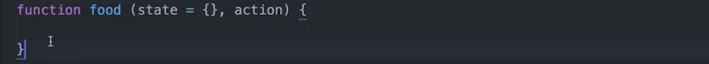

食物 reducer 将负责为我们处理食谱，我们要做的是跟之前一样，使用 switch(action.type) 语句，每当我们收到 ADD_RECIPE action 或分派 ADD_RECIPE action 时，我们要做的是从 action 抓取食谱，然后我们返回一个全新的对象，并且无论当前状态是什么，我们都将它赋值给 state，此特定食谱为抓取的食谱。然后跟之前一样，还会有一个默认情况，如果其他这些情况都不匹配，则返回 state：

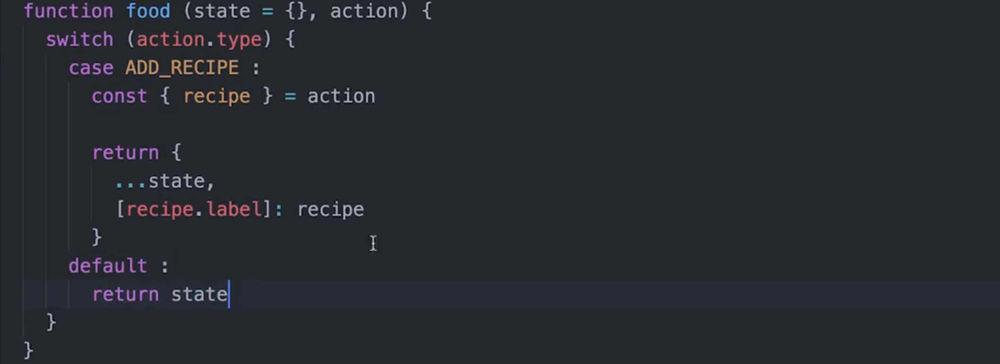

所以，接下来要发生的是，每当我们收到或每当分派 ADD_RECIPE action 时，我们不仅要修改日历状态，还要通过这里的逻辑来修改 store 的 food 部分。那么现在的问题是，我们有了日历状态，并在导出日历，但是对于食物应该如何处理呢？因为看看这里的设置，我们在从 reducers 文件夹导出日历：


然后在我们的 index.js 文件中，我们从 reducers 导入 reducer，也就是日历，然后将它传递给 createStore：


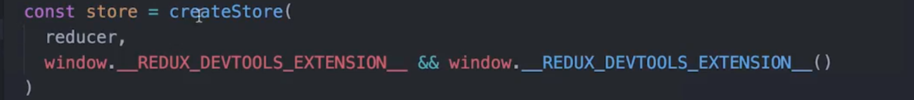

所以我们要找到一种方式来结合 calendar reducer 和 food reducer。


[这是本视频中所做更改的 commit。](https://github.com/udacity/reactnd-udacimeals-complete/commit/f92571e94b6b42cad3391983887261d91192a775)

---

### combineReducers()

到目前为止，状态树的形状都很简单。例如，可能如下所示：

```react
const initialState = {
  data: [],
  isFetching: false,
  error: ''
}
```

正如你所料，应用的状态将变得更加复杂。随着应用变得更复杂，我们将需要创建多个 reducer，而现在是一个 ruducer 管理状态的所有不同部分。我们希望状态能从上述形式转变成如下形式：

```react
{
  users: {},
  modal: {},
  posts: {},
  replies: {},
  listeners: {}
}
```

我们还需要进行 **reducer 合成**，使每个 reducer 负责状态的不同独立部分。这样的话，replies reducer 只会接收状态的"replies”部分。类似地，users reducer 将仅接收状态的"users”部分。即使变成多个 reducer，还是会遵守相同的规律：reducer 将接收一部分状态和一个 action，并返回该状态的新修改部分。**实现方法是首先创建多个 reducer，然后使用 Redux 的`combineReducers()` 方法。**

`combineReducers()` 是 Redux 提供的辅助函数，可以将值为不同的 reduce 函数的对象转换为单个 reduce 函数。然后，将这个单个“根 reducer”传入 `createStore()` 以创建应用的 store。看看具体代码：

```react
// reducers/root_reducer.js

import { combineReducers } from 'redux'

function users (state = {}, action) { 
   // ...
}

function books (state = {}, action) { 
   // ...
}

export default combineReducers({
  users,
  books,
})
```

```react
// store/store.js

import rootReducer from '../reducers/root_reducer'

const store = createStore(rootReducer)
console.log(store.getState()) // { users: {}, books: {} }
```

combineReducers 返回的主 reducer 将调用每个子 reducer，并将它们的结果汇集成一个状态对象。状态对象的形状与传递的 reducer 的键相匹配；也就是说，如果上述 'reducers' 对象具有 'users' 和 'books' 属性，这些属性现在将成为状态树上的属性！

---

我们上次讲到，我们拥有一个事物 reducer，它将处理我们 Redux store 的所有食谱，并且我们还有一个日历 reducer，它将处理我们 Redux store 中所有与日历相关的任务。现在的问题是，我们如何将这些结合起来，因为现在我们只是在导出日历，有没有办法将这两个结合起来以使我们有两个 reducer 而不是一个。

答案是，有的。那么，我们要做的是，从 redux 中导入 combineReducers：

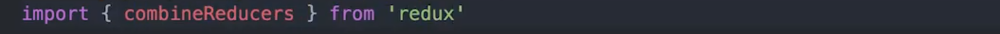

现在，我们不再只是导出日历，而是导出 combineReducer，我们会将两个 reducer 都传递给它，即事物和日历 reducer：

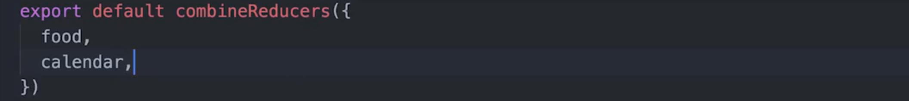

接下来要做的是，在 App.js 文件中，因为我们要将两个结合起来，我们不再只是获取日历，对吧？而是将日历和食物作为一个对象来获取：

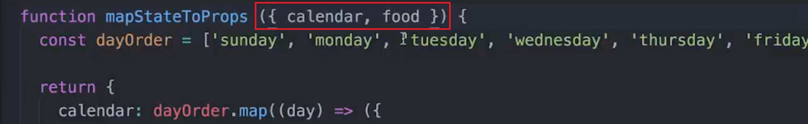

那么你能做的是，我们前往查看 Redux 开发工具，注意我们的状态看起来是这样的：

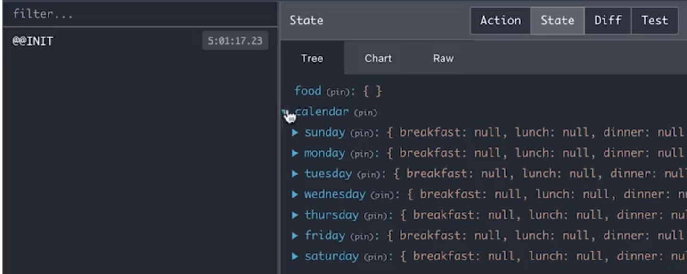

所有日子仍然都在这里，但它位于这个 calendar 属性内，然后是 food 属性，它只是一个空对象。

再次回到 mapStateToProps  函数，我们前面提到我们将像之前一样接收日历，但现在我们还接收食物，任何与食谱有关的东西都会进入食物中。例如，如果我们有比萨的食谱，那么它的 ID 或标签将是 pizza，然后在这里，我们将有关于比萨的所有信息：

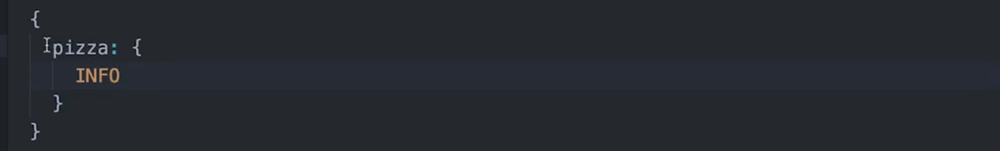

所以这将是我们 store 的食物片段的样子。

那么，我们日历片段的样子将是它将包含某一天，以及特定的一餐，而此餐的值将是食物的特定 ID，在这里我们不会放整个食物对象，而是放上它的 ID：

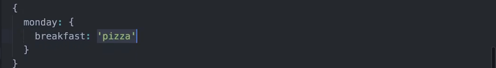

那么在下面不会是 `calendar[day][meal]`：

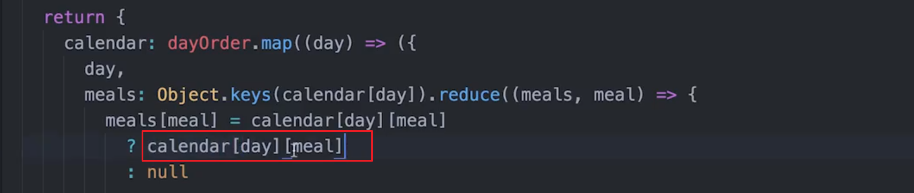

这将知识食物的特定标签或 ID ：

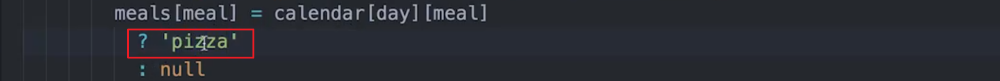

相反，我们想做的是获取该特定 ID 之食物下可找到的所有信息：

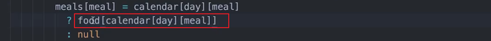

所以当我们实际开始从 API 获取数据时，你看到的会是这个，但是现在我们要更新 mapStateToProps，以获得实际的食物项，而不只是它的 ID。


[这是本视频中所做更改的 commit。](https://github.com/udacity/reactnd-udacimeals-complete/commit/8948986f81b9ff82640a484037445ecbbfc5dc8f)

---

检查进度！

Task List

- 我已经创建了两个 reducer 方法：`food` 和 `calendar`
- 我已经向 `combineReducers()` 传入了两个 reducer 并返回了一个对象
- 我更新了 `mapStateToProps` 方法
- 我已经导出了`combineReducers()`的返回值

#### 习题 1/2

关于合并 reducer 的描述，哪些正确？请选中所有适用项：

- 除了使用 `combineReducers()` 之外，一种替代方法是向 `createStore()` 传递多个 reducer 参数
- `combineReducers()` 导入自 `react-redux`
- `combineReducers()` 接受一个对象作为参数 :star:
  - 我们进行 **reducer 合成**的方式是拆分 reducer 来处理不同的状态部分，而 `combineReducers()` 使我们能够将它们相结合，并传入 `createStore()`。 
- `combineReducers()` 返回单个可用于创建 store 的 reducer :star:


#### 习题 2/2

下面的根 reducer 有何问题？

```react
import { combineReducers } from 'redux';
import booksReducer from './books_reducer';
import userReducer from './user_reducer';

const rootReducer = combineReducers(booksReducer, userReducer);

export default rootReducer;
```

- `combineReducers()` 应该导入自 `react-redux`

- `combineReducers()` 应该是科里化函数

- 导出了错误的值

- 传入给 `combineReducers()` 的参数应该是一个对象，该对象将状态的键映射到各自的 reducer :star:

  - `combineReducers()` 的正确用法是：

    ```react
    import { combineReducers } from 'redux';
    import booksReducer from './books_reducer';
    import userReducer from './user_reducer';
    
    const rootReducer = combineReducers({
        books: booksReducer,
        users: userReducer
    });
    
    export default rootReducer;
    ```

- `combineReducers()` 应该传入 store


### `combineReducers()` 总结

随着应用规模的扩大，我们将需要多个 reducer 来管理 Redux store 的不同方面。问题是，Redux 的 `createStore()` 方法只接受一个 reducer，而不是多个 reducer。要将所有 reducer 结合为一个 reducer，可以使用 Redux 的 `combineReducers()` 方法。该方法使你能够使用 **reducer 组合** 管理 store 中的状态。

---

## 4.3 标准化

我们看到了 reducer 组合是如何帮助我们将不同的 store 状态片段封装到单独的 reducer 中，现在我们将重点看看如何以更容易理解、更高效的方式构建 store，这个优化 store 构建方法的过程叫做**标准化（Normalization）**。

状态结构的标准化给了我们一些确保应用顺利运行所需遵守的管理和设计原则，让我们一起来看看。

---

### 构建有效的 Redux Store

在构建 Redux store 时，需要记住以下两个事项：

1. **数据不要重复**。如果数据存储在多个位置，就没有单一数据源，就会浪费资源来使数据相互同步。
2. **store 尽量很浅**。嵌套数据使 reducer 逻辑更复杂（尝试更新深度嵌套的数据会变得很复杂，并且很慢）

我们来看一个简单的示例。下面是一个 people 对象和一个 friends 数组。

```react
const people = {
  kassidi: {
    name: 'Kassidi Henry',
    age: 24,
    favoriteMovie: 'Remember the Titans'
  },
  tyler: {
    name: 'Tyler McGinnis',
    age: 25,
    favoriteMovie: 'Fatigue: A JavaScript Story'
  },
  jake: {
    name: 'Jake Lingwall',
    age: 26,
    favoriteMovie: 'Casablanca'
  },
}

const friends = ['kassidi', 'jake']
```

现在，如果我想创建引用所有好友的新数组，代码很简单：

```react
friends.map((friend) => people[friend])
```

我再也不会遇到数据一致性错误，因为**我的所有数据只是引用其他数据。Redux 中的数据就应该这样。应该尽量避免数据重复并创建引用。**

Redux 文档对这一模式进行了完美的总结：

> **“在更加复杂的应用中，需要让不同的实体相互引用。建议使状态尽可能标准化，<u>没有任何嵌套</u>。使对象中的每个实体存储时都具有 ID（作为键），并在其他实体或列表中使用 ID 引用它们。”**

下一个提示是**让 store 中的状态尽可能的浅**，这样可以提高性能并降低复杂性。

假设有个如下所示的对象：

```react
const books = {
  fiction: {
    fantasy: {
      teens: {
        0: {
          title: 'Harry Potter and the Nested Data',
          author: 'JK Rowling',
        }
      },
      adults: {}
    },
    romance: {},
    scifi: {},
  }, 
  nonFiction: {}
}
```

如果我们想要创建新的对象（因为我们从未希望修改原始状态），但是修改 Harry Potter 的标题，reducer 函数就会如下所示：

```react
function books (state, action) {
  const { bookType, genre, category, id, title } = action
  if (action.type = CHANGE_TITLE) {
    return {
      ...state,
      [bookType]: {
        ...state[bookType],
        [genre]: {
          ...state[bookType][genre]: {
            [id]: {
              ...state[bookType][genre][id],
              title,
            }
          }
        }
      }
    }
  }

  return state
}
```

看看这个嵌套结构，呃！你懂得。不仅非常不高效，因为我们每次克隆状态时，都要使用操作符 (`...`) ，而且无论对于代码编写者还是阅读者来说，都十分难以阅读。

**通过引用状态中的不同实体，并尽量减少状态的嵌套，可以提高应用性能，也能使你的代码更易于阅读。**

### 标准化总结

**标准化**是指**删除重复数据并尽量减少代码嵌套。这样不仅使应用在 store 的状态中保持“单一数据源”——更新状态的 reducer 逻辑也能保持整洁、合理。最终，标准化 Redux store 将使查询更高效和一致**。

### 更多资料

- [Normalize](https://github.com/paularmstrong/normalizr)
- Redux 文档中的 [State 范式化](https://cn.redux.js.org/docs/recipes/reducers/NormalizingStateShape.html) / [英](http://redux.js.org/docs/recipes/reducers/NormalizingStateShape.html) 部分

---

## 4.4 完成应用！

### 完成应用！

在这个部分，我们将完成 **Udacimeals** 食品日历应用的剩余部分。到目前为止，与 Redux 相关的一切都已经完成！虽然此部分的视频主要侧重于构建 React 组件，但是我们将一直利用 Redux。请务必跟着视频一步步操作！

> #### ⚠️ 已提供的代码 ⚠️
>
> 这部分包含了很多 *React* 代码，我们将粘贴它们，因为它与应用程序的 *Redux* 部分没有太大特别的关系。 我们将在下面的视频中详细介绍粘贴的代码，但你也可以随时查看提供的 GitHub 链接。

[这是 React 代码](https://github.com/udacity/reactnd-udacimeals-complete/blob/822085c8659757fe12c3489100dbefae832f9038/src/components/App.js) 包含下方视频出现的日历网格。

---

如果你看看此组件在接收的 props，你会注意到我们有 calendar、selectRecipe 和 remove：

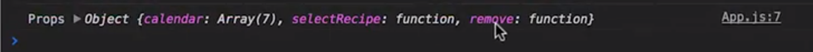

这基本上是我们渲染此特定视图所需的一切，所以我们在这个视频中要做的并不与 Redux 相关，更多的是将我们已接收的座位 props 的东西与 React **连接起来**。

所以第一件事是我要安装后面要用到的 react-icons，我们要在后面的日历网格使用它，完成后，重启你的服务器：


接下来，我们需要导入一些东西。首先我们获取 capitalize 因为我们将用到它，它将来自 utils/helpers，然后，我们要获取的是 CalendarIcon，它将来自我们刚安装的 React 图标包：

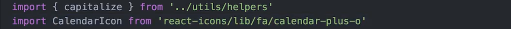

现在我们来继续在这里创建一些变量，而不是记录 props，首先，我从 props 抓取 calendar 和 remove，然后我要创建一个名为“餐饮订单”的数组，这只是一个包含早餐、午餐和晚餐的数组：

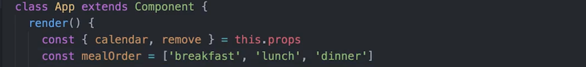

接着，我们不再返回 Hello world 而是返回一个 div，我们给它添加一个类名称 container，然后我们要做的是创建一个无序列表，它的类名称为 meal-types 然后在这里面，我们将映射餐饮订单，这会给我们餐饮类型（mealType），然后我们想做的是，对于餐饮订单中的每个项创建一个列表项。你需要确保给它一个键，并且我们还给它一个类名 subheader，然后在这个列表项中，我们要做的是说大写餐饮类型：

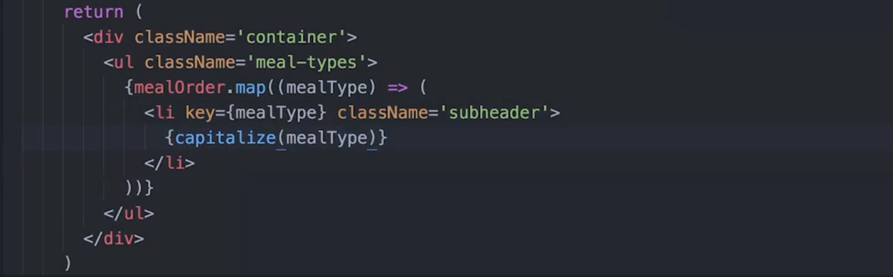

如果我们看看应用，会在这里看到水平方向上有 Breakfast、Lunch、Dinner，在垂直方向上，我们要放上星期几，以及在一个网格中列出所有食物：

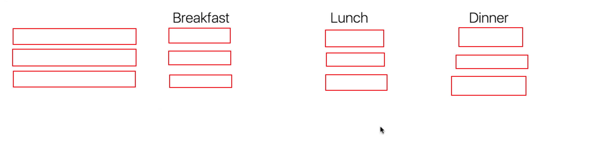

由于接下来只是打很多字，而与 Redux 没有多大关系，我直接将它粘贴在这里，然后过一遍。

首先你会注意到的第一点是我们在执行 mapStateToProps 时创建的这个日历数组。然后我们要做的是映射它，对于日历中的每一天，创建一个 h3 元素，然后首字母大写：

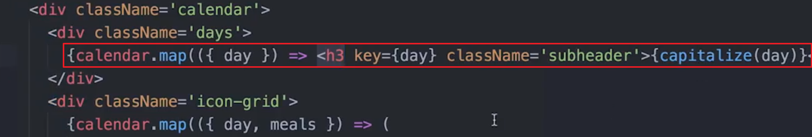

然后我们要做的是再次映射日历，但是我们现在要创建一个 ul 列表，然后执行 mealOrder.map，你应该记得我们在上面创建的 mealOrder，它包含早中晚三餐，我们映射它们并对其中的每一个创建一个列表项，然后如果改天有特定的一餐，则渲染这个，而它将给我们一个图像以及一个按钮，并在我们点击后清除，如果没有订餐，则将此按钮渲染为日历图标。

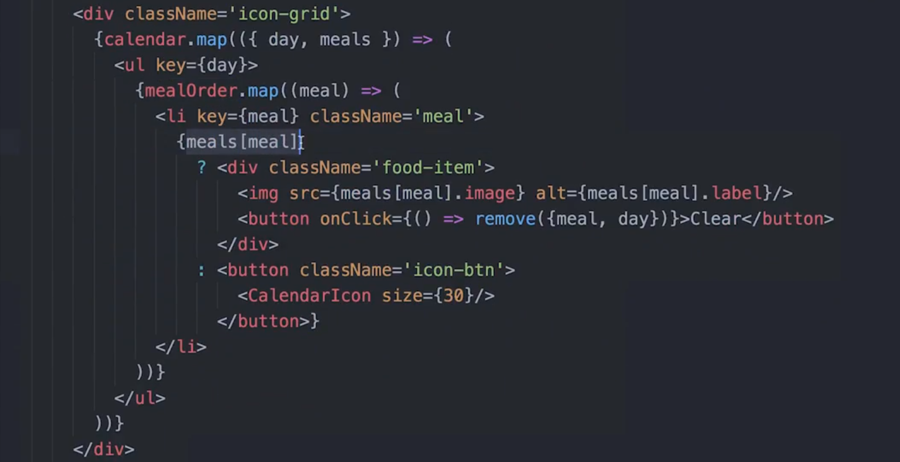

那么，由于现在我们的 Redux store 中没有数据，那么我们刷新后会得到这个网格，而其中的每个项只是日历图标：

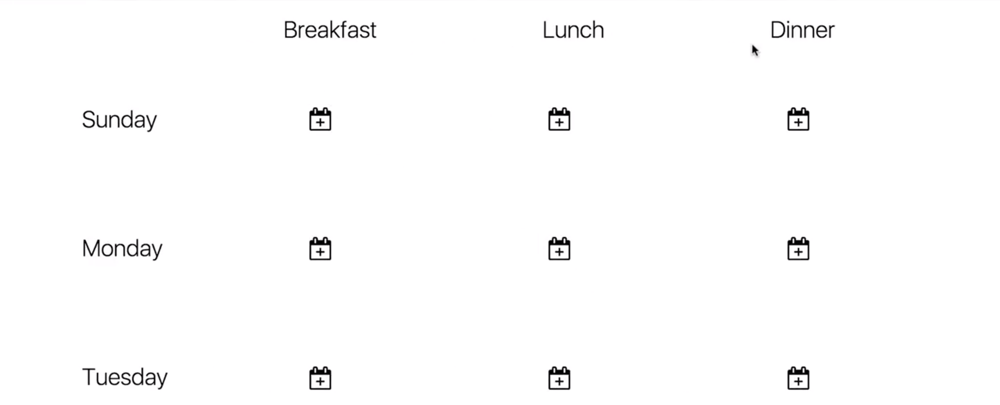

但是最终，当我们连接模型并开始向 Redux store 提供数据，那么看到的将不再是这些日历图标，而是将这部分渲染为你在此看到的食物图像，然后我们也可以点击一个按钮来清除图像，它会运行 remove，如果你还记得，它来自这里，位于 props 上，来自 mapDispatchToProps，所以点击按钮将运行 remove 函数，它将分派 removeFromeCalendar 传入数据，这将前往我们的 reducer 然后此部分将运行。那么我们就会从日历中清除此特定餐饮。


[这是本视频中所做更改的 commit。](https://github.com/udacity/reactnd-udacimeals-complete/commit/822085c8659757fe12c3489100dbefae832f9038)

---

在结束本节课学习之际，我们来看一下已完成的任务清单：

Task List

- 我已经安装了 `react-icons`
- 我已经从 `react-icons/lib/fa/calendar-plus-o` 导入了 `CalendarIcon`
- 我已经从 `../utils/helpers`导入了`capitalize()`函数
- 我已经更新过 `App` 组件的 `render()` 方法
- 我已经更新过`index.css` 并参考了这里的 [样式表](https://github.com/udacity/reactnd-udacimeals-complete/blob/master/src/index.css)

## Edamam API 密钥

接下来，你需要在 Edamam 上注册，以获取 API 密钥来搜索食谱。注册是免费的，花不了多长时间。你可以在 [Edamam 开发者网站](https://developer.edamam.com/edamam-recipe-api)上注册免费计划。

注册后，将你的唯一 ID 和 API 密钥放入位于你的根目录中的[.env文件](https://github.com/udacity/reactnd-udacimeals-complete/blob/823876c8e3b669c0338f630fa50120adb7168f6f/.env) 项目。

在我们开始之前，以下是我们在接下来视频中介绍的组件和方法：

- [`FoodList` 组件](https://github.com/udacity/reactnd-udacimeals-complete/blob/823876c8e3b669c0338f630fa50120adb7168f6f/src/components/FoodList.js)
- [Modal 方法 与 JSX](https://github.com/udacity/reactnd-udacimeals-complete/blob/823876c8e3b669c0338f630fa50120adb7168f6f/src/components/App.js)

---

在这个视频中，我们要做的设置是当我们点击其中一个图标时，会获得一个具有输入字段的模态框（modal），然后我们可以在输入字段中输入食物，从 API 获取该食物或食谱，然后将它保存在我们的 Redux store。此外，这个视频中会有很多与 React 相关的代码，我们会进行一些复制粘贴，以避免视频太长。

我们要做的第一件事是需要安装一些依赖项，我们使用 npm install 命令安装 react-loading，我们要将它用作 spinner，然后安装 react-modal，之后请重启你的开发服务器：

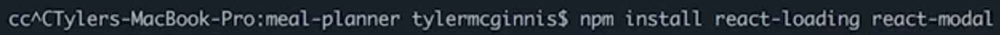

现在我们需要导入一些东西，首先导入我们刚安装的模态框，然后从我们之前安装的 right-icon 导入 ArrowRightIcon，然后我们将从 react-loading 导入 loading 组件，并抓取 fetchRecipes，它将来自我们的 utils 文件夹，最后，我们导入 FoodList 组件：

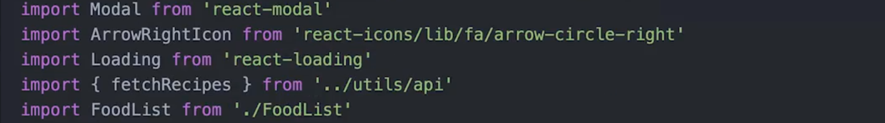

现在，我们需要向组件添加一些本地状态，foodModalOpen 属性设为 false，还有 meal、day 和 food 都设置为 null（注意还是一个 loadingFood 的状态）：

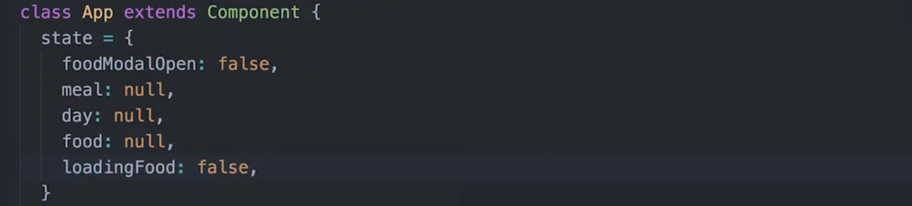

现在我们需要对组件使用一些不同的方法，前两个用于打开和关闭模态框，最后一个用于从 API 抓取一些食谱，这部分代码粘贴在这里，然后再详解。

第一个方法 openFoodModal，它将在我们的本地组件上设置状态，foodModalOpen 变为 true，然后我们传入 meal 和 day 并设置这些，在下面的 closeFoodModal 方法中我们做了同样的设置，只是这里是关闭模态框：

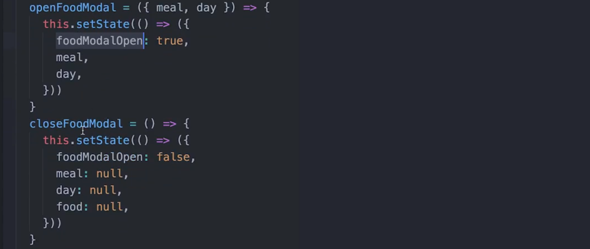

我们要做的最后一件事，是在此组件调用时，你会注意到我们将 loadingFood 设为 true，接下来我们要做的是调用 fetchRecipes，我们向它传递输入值，稍后在这里设置它，当它解析后，我们设置食物的本地状态：

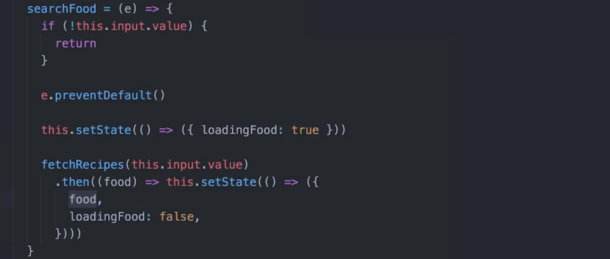

再次说明，这个现在还不存在于 Redux 中，因为当我们调用 fetchRecipes 时，我们将获得一个食物数组，让一堆食物存在于 Redux 的应用状态中是没有什么意义的。我们要做的是将此状态保存到本地组件状态，然后选择一个我们想要作为实际餐饭的食物，然后拿取它并保存到 Redux 因为这是我们真正关心的食物，我们一会儿再看这里。

那么现在我们有这些方法，我们向下到 reder 方法，我将在这里抓取另外一些 props，从状态中，我要做的是抓取 foodModalOpen、loadingFood 以及 food，再次说明，它们来自我们的状态，然后我们已经有了 calendar 和 remove 它们来自 props，我们再抓取 selectRecipe：

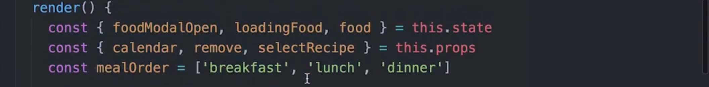

现在有了这些项，我们来填充其余的 UI，你会注意到这里有一个按钮（每一顿 meal 所在的地方），现在点击它还什么都不会发生，那么我们希望发生的是当这里的这些图标被点击时，我们想打开模态框，所以我们说 onClick，我们想运行 this.openFoodModal，我们将向它传递特定 meal 和特定 day，而它们来自对 mealOrder 和 Calendar 数组进行 map 时的所传入的回调中的值：

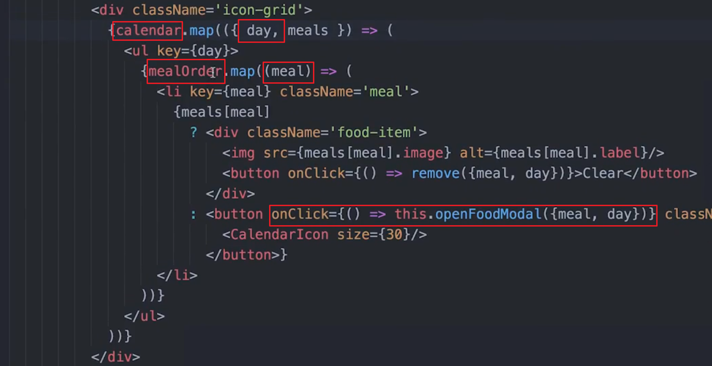

现在我们想做的是，渲染模态框，以使我们有东西打开，那么在下面这里，我们要做的是在这个 div 下，我们想渲染一个模态框，我在这里直接复制粘贴，因为这里有一大块代码：

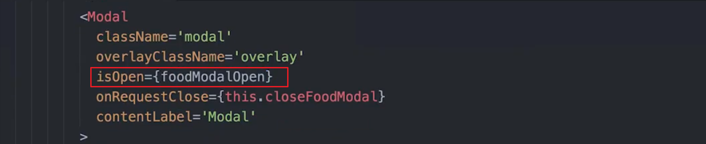

那么我们在此做的是渲染此模态框，我们说当 foodModalOpen 评估为 true 时，则打开此模态框，而当我们尝试关闭它时，这个将运行，它会将 foodModalOpen 改为 false，然后关闭模态框。

接下来我们在这里做的是渲染 div，而此 div 将是模态框中渲染的东西。我们说如果 loadingFood 为 true，则显示 spinner，如果不为 true 则显示这里的这个 div。我们要做的是渲染一个 h3 元素，并说查找某一天某一餐的餐饭。比如说星期六的早餐，我们渲染输入，然后每当此按钮被点击时，即这里的右向箭头图标则运行 searchFood，这是我们在前面创建的方法，我们调用 fetchRecipes，在获得食物后，我们将它加载到本地状态中：

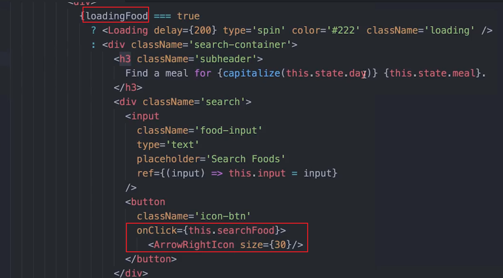

接下来要发生的是当我们有了此本地状态，且 loading 不再为 true 时，我们这里有 food，我们渲染食物清单，传递食物，并向它传递当选中特定项时要做什么，你会注意到我们调用 selectRecipe，还记得吗，它是在 mapDispatchToProps 中创建的，当此函数运行后我们将分派 addRecipe 向它传递数据，然后关闭食物模态框

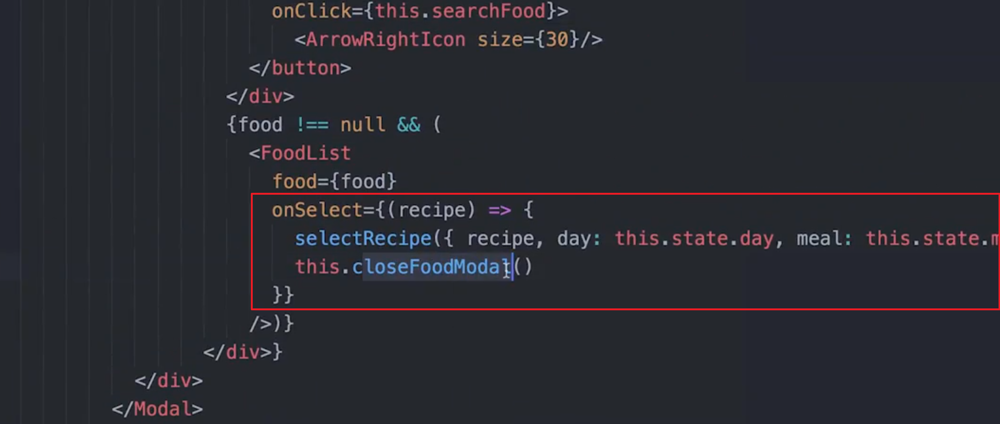


[这是本视频中所做更改的 commit。](https://github.com/udacity/reactnd-udacimeals-complete/commit/823876c8e3b669c0338f630fa50120adb7168f6f)

**注意**: 刚才视频的 state 中包含一个 `loadingFood: false` ，但它并没有出现在 commit 里，如果你跟随 commit 中的内容操作，记得一定要把它添加回来！

---

快要结束了！ 我们再来看一下任务清单：

Task List

- 我收到了 Edaman 的唯一 ID 和 API 密钥
- 我已经安装了 `react-loading`
- 我已经安装了 `react-modal`
- 我重启了我的开发服务器
- 我已经导入了所有必备的 assets
- 我已经将本地组件状态添加到 `App`
- 我已经创建了 `openFoodModal`, `closeFoodModal`, and `searchFood` 方法
- 我已经更新过 `App` 组件的 `render()` 方法
- `App` 的`render()` 方法 也渲染了`FoodList` 组件 (详情见 [提交的请求](https://github.com/udacity/reactnd-udacimeals-complete/blob/823876c8e3b669c0338f630fa50120adb7168f6f/src/components/FoodList.js))

正如 `FoodList` 组件一样，你也可以查看 [`ShoppingList` 组件](https://github.com/udacity/reactnd-udacimeals-complete/blob/0e343838ef120c458f3b3b4a5de74dbc167be4d6/src/components/ShoppingList.js)， 在接下来的视频中会引用。

---

现在我们想做的是能够生成购物清单，这样当我们点击一个按钮时，会获得一个 modal，而这个 modal 中讲师我们所需的所有食材，特别是这周的食物日历所需的食材。

我们要做的第一件事是导入购物清单，我们从前面的 tech 部分获得它，现在我们需要做的是向状态添加一个属性，我们称之为 ingredientsModalOpen，将它设为 false：

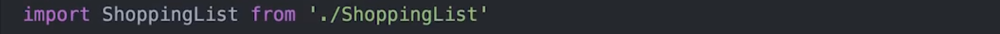

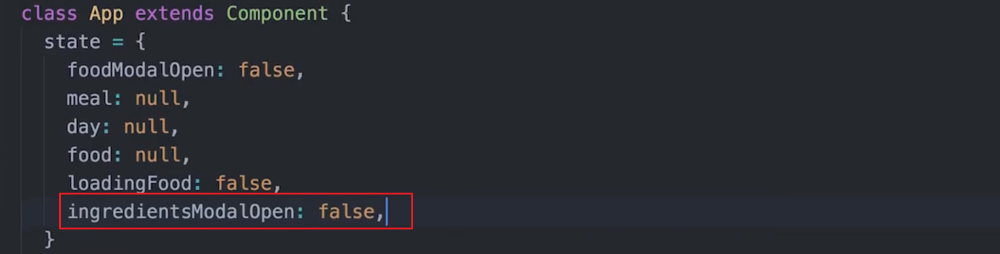

接下来，我们需要向组件添加三个方法，它们是 openIngredientsModal，它类似于我们的 openFoodModal，接下来我们要能关闭 IngredientsModal，所以有一个 closeIngredientsModal，然后是生成购物清单，为此，我们要做的是对日历使用 reduce 方法。我们将获得所有餐饭，并将它们全部推入单个数组中，然后基本上还需要将此数组展平，结束后，当我们调用 generateShoppingList 我们将获得的是包含这些餐饮所有不同食材的一个数组：

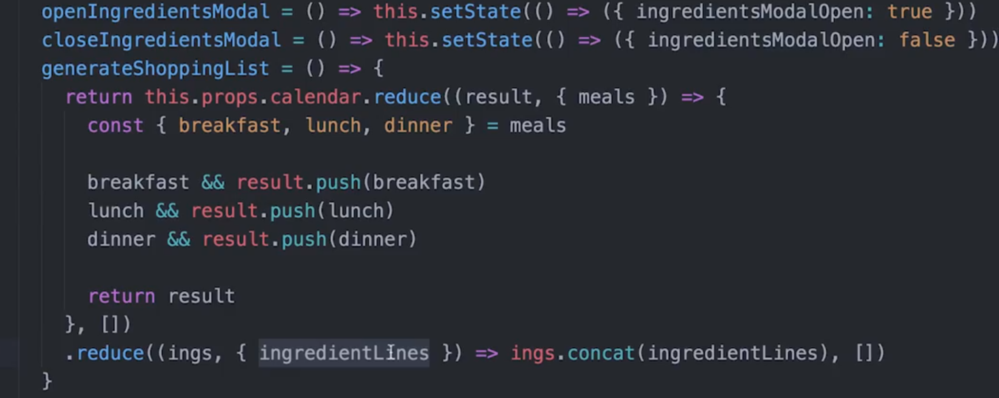

那么，现在我们到下面的 render 方法，我们要使用 ingredientsModalOpen，它来自我们的状态：

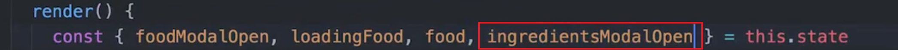

接下来我们要做的是，添加两个不同的部分。第一个部分是一个小的导航栏，我们将它放在上面这里，它的作用是，我关闭代码，让你实际看下一它，现在在这里，我们有购物清单按钮（Shopping List），我们点击它，它会运行 openIngredientsModal 这会打开 IngredientsModal：

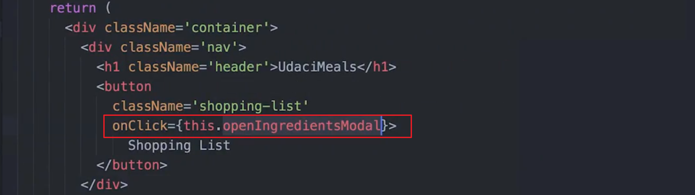

现在我们需要做的是实际构建出 IngredientsModal。那么，我们把它放在 FoodModal 的之前或之后，现在我们有了另一个 modal，它跟我们之前的 modal 非常相似，你会注意到当 ingredientsModalOpen 评估为 true 时，它是打开的，我们可以通过请求关闭来关闭它，即调用我们创建的 closeIngredientsModal 方法。接下来我们要做的是，我们说如果 IngredientsModal 是打开的，那就渲染购物清单。关于这个 modal 要注意的一点以及我添加这行的原因，是因为调用这个方法 generateShoppingList，它会很耗资源，其实也不是多大问题，但是如果 IngredientsModal 不是打开的，则没有必要在这里调用 generateShoppingList，这就是为什么我们在这加了这行，说仅在 IngredientsModal 打开时渲染组件，因为这将是你唯一实际看到组件的时候：

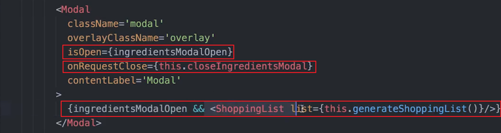

现在我们保存它，看看会发生什么，我们首先在周日餐饭中添加一些意大利面，pinky 意大利面看起来不错：

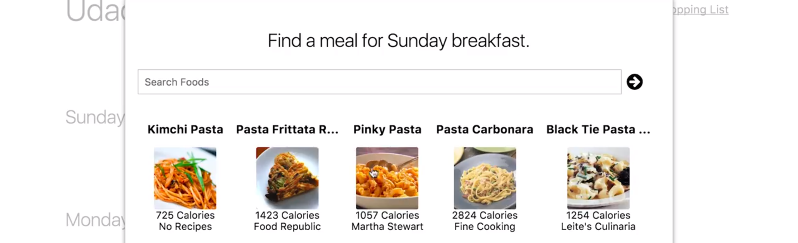

现在我点击购物清单，你会看到这些是我们制作意大利面需要构面的所有食材：

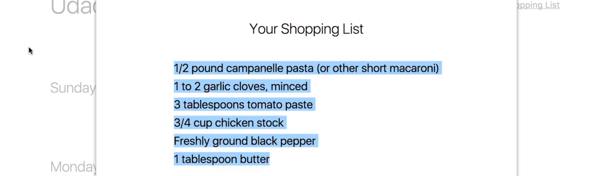

如果我到下面这里（另一天的另一顿饭中），添加一些比萨，则会在购物清单中看到比萨所需要的材料（和上面的图差不多）


[这是本视频中所做更改的 commit。](https://github.com/udacity/reactnd-udacimeals-complete/commit/0e343838ef120c458f3b3b4a5de74dbc167be4d6)

---

最终的任务清单

Task List

- 我已经导入了 `ShoppingList` 组件
- 我用 `ingredientsModalOpen` 属性更新了本地组件状态
- 我已经创建了 `openIngredientsModal`, `closeIngredientsModal`, 和`generateShoppingList` 方法
- 我已经更新过 `App` 组件的`render()` 方法
- `App` 的`render()` 方法 也渲染了`ShoppingList` 组件 (详情见 [提交的请求](https://github.com/udacity/reactnd-udacimeals-complete/blob/0e343838ef120c458f3b3b4a5de74dbc167be4d6/src/components/ShoppingList.js))

### 完成该应用总结

在此部分，我们完成了 UdaciMeals 项目的剩余部分。现在你已经知道，如果正确使用 Redux，可以让 React 应用的状态管理起来更高效和可预测。


## 4.5 课程总结

在之前的课程中，你了解了 reducers，但我们一次只能使用一个 reducer，在这节课中，我们将在这些知识的基础上，学习如何使用 Redux 的 combineReducers 方法将多个 reducer 结合起来，然后我们将深入了解 Redux store 构建中的归一化（normalization），**如果仍有哪里不清楚的，别担心，多花一些时间阅读此课程的材料，和别人交流并提问，最重要的是，不停地练习编码。**

