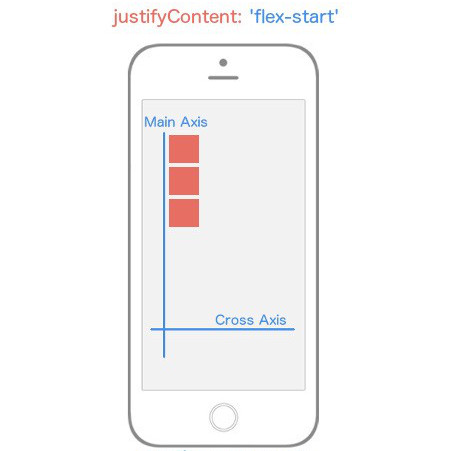
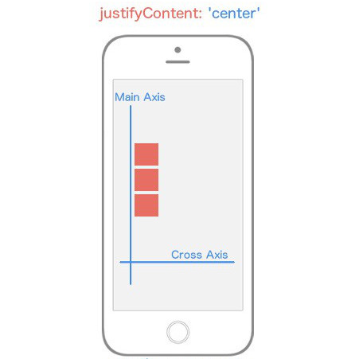
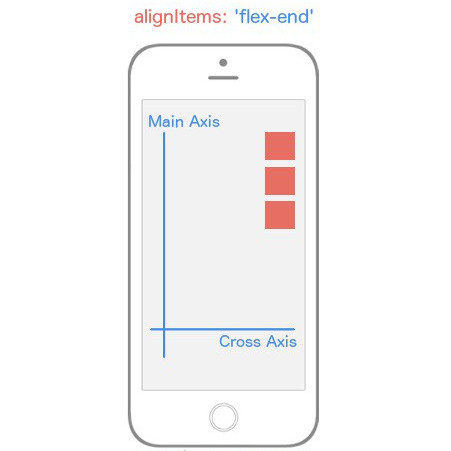
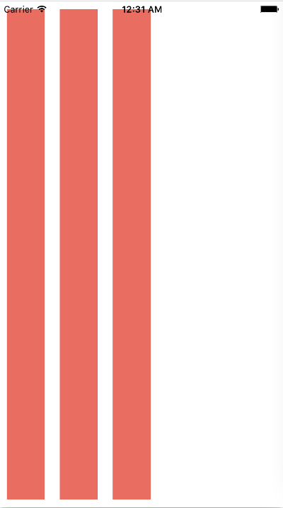
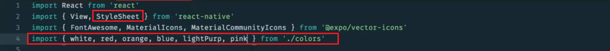

# 3. 样式和布局

> 你将学习 React Native 的 Flexbox 实现，以有效地设置应用的样式和布局。

[TOC]

---

## 3.1 简介

到目前为止，我们介绍了很多 React 原生 API 知识，但是如何设置应用样式呢？使用普通的样式表进行 CSS 设置吗？或者有什么特殊语法吗？我们将在这节课揭晓答案。

---

## 3.2 CSS in JS

还记得第一次见到 JSX 吗？


你可能觉得将标记语言与 JavaScript 相混合有点奇怪，但是当你见的多了，可能会喜欢这种模式。

**React 是在组件级别区分目标，而不是技术级别**。现在的问题是组件的目标是什么？

在我看来，组件有两个主要目标： 

- State 
- Presentation

React 组件具有本地状态，JSX 负责呈现标记部分，但对我来说 Presentation 不仅仅是标记，它是标记和样式的结合体，因此我建议将**样式从样式表中移到组件级别**，听起来有点疯狂，但实际上在 React 社区，这是很常见的。实际上已经是 React Native 设计组件样式的主要方式。

我们是让 CSS 位于组件中吗？如果你不习惯于这一概念，可能会觉得很奇怪，但在 React Native 中，要设置应用样式，我们将直接使用 JavaScript 而不是之前习惯使用的 CSS。

我们来看一个示例。

---

### CSS in JS

在研究 JavaScript 中的 CSS 如何工作之前，我们先来看一些 "普通" HTML 和 CSS 的例子:

```html
<!-- index.css -->
.avatar {
  border-radius: 5px;
  margin: 10px;
  width: 48px;
  height: 48px;
}

<!-- // index.html -->
<div>
  
</div>
```

都是一些常规的设置！但是，由于我们不是使用 HTML 或 CSS 文件来构建移动应用，那么这在 React Native 中看起来会有何不同呢？

首先，重要的一点是要知道 React Native 中的所有核心组件都可以接受一个名为 `style` 的属性。我们可以利用此属性的一种方式是使用内联 JavaScript 对象为组件提供样式：

```js
function Avatar ({ src }) {
  return (
    <View>
      <Image
        style={{borderRadius: 5, margin: 10, width: 48, height: 48}}
        source={{uri: 'https://tylermcginnis.com/tylermcginnis_glasses-300.png'}}
      />
    </View>
  );
}
```

在上面的例子中，`<Image>` 组件接收两个属性: `style` 和 `source`。`style` 的值只是一个简单的旧的 JavaScript 对象，带有 `borderRadius`、`margin`、`width` 和 `height` 属性。记住与 web 上的 CSS 不同，属性用驼峰式大小写书写（即：CSS in JS 为 `borderRadius`，但 web 上的为 `border-radius`）

这当然可以工作，但事情很快会变得混乱。想象如果内联对象包含十几个属性，或者我们想让一些样式应用到多个组件！使你的代码保持 DRY（Don't Repeat Yourself） 和可重用的一种方式是将对象存储在一个变量中：

```js
const styles = {
  image: {
    borderRadius: 5,
    margin: 10,
    width: 48,
    height: 48
  }
};

function Avatar ({ src }) {
  return (
    <View>
      <Image
        style={styles.image}
        source={{uri: 'https://tylermcginnis.com/tylermcginnis_glasses-300.png'}}
      />
    </View>
  );
}
```

这样可以很好地清理代码，但是 React Native 通过其 `StyleSheet` API 更进一步。查看以下示例：

```js
import React from 'react';
import { StyleSheet, Text, View } from 'react-native';

export default class TextExample extends React.Component {
  render() {
    return (
      <View>
        <Text style={styles.greenLarge}>This is large green text!</Text>
        <Text style={styles.red}>This is smaller red text!</Text>
      </View>
    );
  }
}

const styles = StyleSheet.create({
  greenLarge: {
    color: 'green',
    fontWeight: 'bold',
    fontSize: 40
  },
  red: {
    color: 'red',
    padding: 30
  },
});
```

在这里，一个包含样式的对象被传递到 `StyleSheet` 的 `create` 方法中。它看起来类似于使用 JavaScript 对象变量实现样式！但是如上所述，使用 `StyleSheet` 可以提高我们的代码质量和性能。我们会在稍后详细讲解，但是先来看看 React Native 文档中对它提供的好处描述：

> 提高代码质量
>
> - 通过将样式从 render 函数中移除，会使代码变得更容易理解。
> - 命名样式是向 render 函数中的低级组件添加意义的好方式。

> 性能
>
> - 从样式对象中创建样式表使我们能够按 ID 进行渲染，而不用每次创建新的样式对象。
> - 它还允许通过桥接传递一次样式。所有后续使用都将引用 ID（尚未实现）。

另一个好处是 `StyleSheet` 也能验证样式对象中的内容。这意味着如果你的样式对象中的任何属性或值存在任何错误，控制台将在编译而非运行时抛出错误。

> ### 💡 其他样式💡

> 如果要对组件实现多个样式，`style` 属性可以接受样式作为数组:
>
> ```jsx
> class FlexboxExamples extends Component {
>   render() {
>     return (
>       <View style={styles.container}>
>         <View style={[styles.box, {flex: 1}]}/>
>         <View style={[styles.box, {flex: 2}]}/>
>         <View style={[styles.box, {flex: 1}]}/>
>       </View>
>     )
>   }
> }
> 
> const styles = StyleSheet.create({
>   container: {
>     flex: 1,
>     flexDirection: 'row',
>     justifyContent: 'center',
>     alignItems: 'center',
>   },
>   box: {
>     width: 50,
>     height: 50,
>     backgroundColor: '#e76e63',
>     margin: 10,
>   }
> })
> ```
>
>
>
> （这里 Uda 上的文本有问题，所以可以自行去官方文档查看）

---

我们来看看设置 React Native 组件样式的几种方式

第一种，也是最明显的方式是向任何组件传入内嵌样式，向 View 组件和 Text 组件传入样式，然后向其中传入一个对象：


但这里有点奇怪，对于 React Native 来说，可以内嵌样式，因为样式和组件进行组合，但是这样内嵌所有这些样式有点奇怪，所以我们可以将这些样式提出来并放在下面的对象中：


然后在 style 中输入对象中的值。

但是现在和谐样式位于对象中，调整下样式，看起来更合理了，因为我们没有内嵌所有样式，虽然实际效果相同：


这是对 React Native 组件进行样式设置的很好方式，但实际上 React Native 内置了类似的功能。

我们可以导入 StyleSheet 方法，不再将这些设为原始对象，而是输入 StyleSheet.create，然后向其传入一个对象：


实际效果和上面的也一样，但现在 React Native 将稍微优化这些样式并帮助我们提升性能，每当你在 React Native 中设置样式时，如果是多个组件样式，我喜欢创建一个 StyleSheet 并移到下面（指给 View 设置的样式）

而像 Text 的样式，由于值有一对样式，就直接写在内嵌中，因为 Tyler 不喜欢记住名称：


这个文本的颜色将为红色，但是我们在这里设定了这些样式，因此将使用 StyleSheet.create 创建该 StyleSheet 然后使用 styles.（属性名称），应用这些样式，这里属性名称是 container

> ### 💡 CSS-in-JS 库💡

> React 中的样式正在经历一个复兴时期，就像 Flux 几年前一样（最终我们获得了 Redux）。许多不同的样式库不断涌现出来，每个都有利有弊。其中最受欢迎的两个是 [Glamorous](https://github.com/robinpowered/glamorous-native) 和 [Styled Components](https://github.com/styled-components/styled-components)。这两个库的整体思想是，样式是组件的重点所在，因此应该与组件本身结合。我们稍后看一下在 React Native 中使用样式化组件。

#### 练习题

以下有关 React Native 中样式的说法哪个正确？

- 使用 CSS in JS 使我们可以访问应用状态或组件中的属性 :milky_way:
- 实现 React Native 应用样式需要使用不同于传统 JavaScript 的特殊语法来定义样式
- 样式名称和值始终与 web 上的使用方式匹配（例如使用“background-color”） :man_playing_water_polo:
- `StyleSheet` API 使我们能在单个地方定义多个样式 :v:

React Native 中的样式允许我们使用熟悉的 JavaScript！可以说"仅需学习一次，编写任何平台"

---

## 总结

CSS in JS 是一个独特的样式实现方式。其主要思想是，样式由 JavaScript 对象而非传统的 CSS 来处理。样式可以直接写入行内或通过对象变量访问，但 React Native 提供一个 `StyleSheet` API，它提供了实现组件样式的高性能和组合方式。

现在我们看了 React Native 处理**样式**的方式，那么我们如何管理移动应用的**布局**呢？我们将在下一小节看看具有此功能的 CSS 的**flexbox**！

### 进一步学习

- [我如何安全地使用 CSS-in-JS？](https://reactarmory.com/answers/how-can-i-use-css-in-js-securely)

---

## 3.3 Flexbox 指南

我们讨论了 React Native 如何通过在 JSX 中使用 CSS 向应用添加样式，具体而言，是**向组件添加样式**。但是我们没有讨论的是 React Native 如何处理布局。

如果你已经有一段时间的网络应用开发经验的话，可能就会熟悉块模型和浮动，根据 MDN 的定义，悬浮 CSS 属性规定元素应该放置在容器的左侧或者右侧，并且文本和内前元素应用包裹在周围：


换句话说，浮动使我们能够制定元素如何相互放置。

如果你知晓过去几年内 CSS 中的一些布局可选方式，可能就会听过 flexbox，同样根据 MDN 的定义，flexbox 是一种旨在满足不同屏幕尺寸和不同显示屏幕设备的布局模式，对于很多应用来说 flexible box 模型比块级模型更容易实现，因为它不使用浮动：


Flexbox 本质上是旧版块级模型布局的替代形式，并且很多人都觉得它性能提高了很多。很自然地 react native 选择通过 flexbox 来实现布局，而不是原来的块级模型，如果你不知道 flexbox 的话，别担心，整个下一部分都会讲解 flexbox，但是，官方 flexbox 规范与 react native 对 flexbox 的实现之间存在一些细微差别，我们也会讲解到。

### Flexbox 入门

如果你不熟悉 Flexbox，那你有伴了，我也不会。哈哈开个玩笑。

每当我学习一门新技术，我都要先问一个问题“这种技术为何存在？” 对于 flexbox，这个问题的答案可能是使用 CSS 创建一个多用途的布局相当麻烦。而 flexbox 的目的就是创建一个更有效的方法来"布置、对齐和分配容器中项目之间的空间，即使它们的大小位置是未知 和/或 是动态的"。简而言之，flexbox 的主要用途在于创建动态布局。

Flexbox 的主要思想是使父元素能够控制其所有(_直接_!)子元素，而不是让每个子元素控制其自己的布局。当你这样做时，父元素变成了一个 **flex 容器**，而子元素变成了 **flex 项**。一个例子是，我们不必让一个元素的所有子元素浮动到左侧，并为每一个添加边距，而是由父元素指定将所有子元素排列成一行，使它们之间的间距相等。这样，布局责任就从子元素转移到了父元素，进而使你对应用的整个布局具有更精细的调整控制。


此小节有很多内容，分解为以下部分

- [Flexbox 轴](https://classroom.udacity.com/nanodegrees/nd019-cn/parts/0d0a3c80-7f21-4209-81d7-764df7519260/modules/be422d8e-8927-496d-b203-1868289e90c5/lessons/0d761c28-fb21-432e-a822-f9495ec1b64b/concepts/90f2cd35-dd1a-48a4-a764-cc6e9fec0122#flexbox-axes)
- [Flex 方向](https://classroom.udacity.com/nanodegrees/nd019-cn/parts/0d0a3c80-7f21-4209-81d7-764df7519260/modules/be422d8e-8927-496d-b203-1868289e90c5/lessons/0d761c28-fb21-432e-a822-f9495ec1b64b/concepts/90f2cd35-dd1a-48a4-a764-cc6e9fec0122#flex-direction)
- 对齐内容
  - [Flex-Start](https://classroom.udacity.com/nanodegrees/nd019-cn/parts/0d0a3c80-7f21-4209-81d7-764df7519260/modules/be422d8e-8927-496d-b203-1868289e90c5/lessons/0d761c28-fb21-432e-a822-f9495ec1b64b/concepts/90f2cd35-dd1a-48a4-a764-cc6e9fec0122#justify-content-flex-start)
  - [Center](https://classroom.udacity.com/nanodegrees/nd019-cn/parts/0d0a3c80-7f21-4209-81d7-764df7519260/modules/be422d8e-8927-496d-b203-1868289e90c5/lessons/0d761c28-fb21-432e-a822-f9495ec1b64b/concepts/90f2cd35-dd1a-48a4-a764-cc6e9fec0122#justify-content-center)
  - [Flex-End](https://classroom.udacity.com/nanodegrees/nd019-cn/parts/0d0a3c80-7f21-4209-81d7-764df7519260/modules/be422d8e-8927-496d-b203-1868289e90c5/lessons/0d761c28-fb21-432e-a822-f9495ec1b64b/concepts/90f2cd35-dd1a-48a4-a764-cc6e9fec0122#justify-content-flex-end)
  - [Space-Between](https://classroom.udacity.com/nanodegrees/nd019-cn/parts/0d0a3c80-7f21-4209-81d7-764df7519260/modules/be422d8e-8927-496d-b203-1868289e90c5/lessons/0d761c28-fb21-432e-a822-f9495ec1b64b/concepts/90f2cd35-dd1a-48a4-a764-cc6e9fec0122#justify-content-space-between)
  - [Space-Around](https://classroom.udacity.com/nanodegrees/nd019-cn/parts/0d0a3c80-7f21-4209-81d7-764df7519260/modules/be422d8e-8927-496d-b203-1868289e90c5/lessons/0d761c28-fb21-432e-a822-f9495ec1b64b/concepts/90f2cd35-dd1a-48a4-a764-cc6e9fec0122#justify-content-space-around)
- 对齐项目
  - [Flex-Start](https://classroom.udacity.com/nanodegrees/nd019-cn/parts/0d0a3c80-7f21-4209-81d7-764df7519260/modules/be422d8e-8927-496d-b203-1868289e90c5/lessons/0d761c28-fb21-432e-a822-f9495ec1b64b/concepts/90f2cd35-dd1a-48a4-a764-cc6e9fec0122#align-items-flex-start)
  - [Center](https://classroom.udacity.com/nanodegrees/nd019-cn/parts/0d0a3c80-7f21-4209-81d7-764df7519260/modules/be422d8e-8927-496d-b203-1868289e90c5/lessons/0d761c28-fb21-432e-a822-f9495ec1b64b/concepts/90f2cd35-dd1a-48a4-a764-cc6e9fec0122#align-items-center)
  - [Flex-End](https://classroom.udacity.com/nanodegrees/nd019-cn/parts/0d0a3c80-7f21-4209-81d7-764df7519260/modules/be422d8e-8927-496d-b203-1868289e90c5/lessons/0d761c28-fb21-432e-a822-f9495ec1b64b/concepts/90f2cd35-dd1a-48a4-a764-cc6e9fec0122#align-items-flex-end)
  - [Stretch](https://classroom.udacity.com/nanodegrees/nd019-cn/parts/0d0a3c80-7f21-4209-81d7-764df7519260/modules/be422d8e-8927-496d-b203-1868289e90c5/lessons/0d761c28-fb21-432e-a822-f9495ec1b64b/concepts/90f2cd35-dd1a-48a4-a764-cc6e9fec0122#align-items-stretch)
- [居中内容](https://classroom.udacity.com/nanodegrees/nd019-cn/parts/0d0a3c80-7f21-4209-81d7-764df7519260/modules/be422d8e-8927-496d-b203-1868289e90c5/lessons/0d761c28-fb21-432e-a822-f9495ec1b64b/concepts/90f2cd35-dd1a-48a4-a764-cc6e9fec0122#centering-content)
- [Flex 属性](https://classroom.udacity.com/nanodegrees/nd019-cn/parts/0d0a3c80-7f21-4209-81d7-764df7519260/modules/be422d8e-8927-496d-b203-1868289e90c5/lessons/0d761c28-fb21-432e-a822-f9495ec1b64b/concepts/90f2cd35-dd1a-48a4-a764-cc6e9fec0122#the-flex-property)
- [对齐单个项目](https://classroom.udacity.com/nanodegrees/nd019-cn/parts/0d0a3c80-7f21-4209-81d7-764df7519260/modules/be422d8e-8927-496d-b203-1868289e90c5/lessons/0d761c28-fb21-432e-a822-f9495ec1b64b/concepts/90f2cd35-dd1a-48a4-a764-cc6e9fec0122#aligning-individual-flex-items)


#### Flexbox 轴

目前，我们需要了解的关于 Flexbox 的最重要的概念是它由不同的[轴](https://www.quora.com/What-is-the-plural-of-axis)组成，包括**主轴**和**交叉轴**。


*Flexbox 的轴：**主轴**和**交叉轴***


在 React Native 中，默认情况下，**主轴**为垂直的，而**交叉轴**为水平的。后面的所有东西都将构建在**主轴**和**交叉轴**之上。

当我说"…沿主轴对齐所有子元素"时，我是说默认情况下，父元素的所有子元素将从上到下垂直布置。如果我说"…沿交叉轴对其子元素"时，我是说默认情况下，所有的子元素将从左到右水平布置。

Flexbox 的其余部分只是决定**如何在主轴和交叉轴上对齐、定位、拉伸、展开、收缩、居中和包裹子元素**。


#### Flex 方向

你会注意到在说到**主轴**和**交叉轴**时，我特别提到了"默认行为"。这是因为你实际上可以更改哪个轴作为主轴，哪个作为交叉轴。这就涉及我们的第一个 flexbox 属性`flex-direction`（或 React Native 中的`flexDirection`）。

`flex-direction` 有两个值:

- `row`（行）
- `column`（列）

默认情况下，React Native 中的每个元素都有 `flexDirection: column` 声明。当一个元素的 `flex-direction` 为`colum`时，它的_主*轴为垂直的，而它的*交叉_轴为水平的，就像我们在上图中看到的那样。但是，如果你给一个元素 `flexDirection: row` 声明，轴就颠倒过来了。主轴变为水平的，而交叉轴变为垂直的。再次说明，**这非常重要，因为你的整个布局都取决于这两个轴。**


*flex-direction 会改变哪个轴为\**主**轴。*


#### 对齐内容

接下来的内容变得有趣了。我们来看看我们可以用来沿这些轴对齐子元素的不同属性和值。 我们先主要来看_主_轴

为了指定子元素如何沿主轴对齐，你要使用 `justifyContent` 属性。`justifyContent` 具有五个你可以用来改变子元素的对齐方式的不同值。

- `flex-start`
- `center`
- `flex-end`
- `space-around`
- `space-between`

喔。我刚扔出了很多陌生的词。我会详细讲解每一个，所以不用担心。

如果你想跟我一起演练（_强烈_建议），那么请创建一个新的 React Native 项目，命名为 "FlexboxExamples"，并使用以下代码换出你的 `App.js` 代码：

```js
import React, { Component } from 'react'
import { StyleSheet, Text, View, AppRegistry } from 'react-native'

class FlexboxExamples extends Component {
  render() {
    return (
      <View style={styles.container}>
        <View style={styles.box}/>
        <View style={styles.box}/>
        <View style={styles.box}/>
      </View>
    )
  }
}

const styles = StyleSheet.create({
  container: {
    flex: 1,
  },
  box: {
    height: 50,
    width: 50,
    backgroundColor: '#e76e63',
    margin: 10,
  }
})
```

注意使用以上代码，我们更改的唯一东西是 `styles` StyleSheet 对象中的 `container` 对象的样式。暂时忽略 `flex: 1`。


#### 对齐内容: Flex-Start（主轴的起点对齐）




*justifyContent: flex-start 会使 flex 项目出现在\**主轴**的起点。*


`justifyContent: 'flex-start'` 会朝主轴的起点位置对齐每个子元素。

```js
container: {
  flex: 1,
  justifyContent: 'flex-start',
}
```

如果你之前对主轴和交叉轴的重要性还有所怀疑，希望你现在坚定了信心。因为 `flexDirection` 默认为 `column`，并且我们使用的是对准主轴的 `justifyContent`，所以我们的子元素会朝着主轴的*开始位置*（左上角）对其并向下排列。


#### 对齐内容：Center（居中）




*justifyContent: center 使 flex 项出现在\**主轴**的中心。*


`justifyContent: 'center'` 会朝主轴的中心对齐每个子元素。 

```js
container: {
  flex: 1,
  justifyContent: 'center',
}
```


#### 对齐内容：Flex-End（**交叉轴的起点对齐**）


*justifyContent: flex-end 会使 flex 项出现在\**主轴**的终点。*


`justifyContent: 'flex-end'` 会朝**主轴的终点**对其每个子元素。 

```js
container: {
  flex: 1,
  justifyContent: 'flex-end',
}
```


#### 对齐内容：Space-Between（两端对齐）


*justifyContent: space-between 会使 flex 项出现在\**主轴**的两端，子元素之间有间隔。*


`justifyContent: 'space-between'` 会沿**主轴两端**对其每个子元素，且**每项之间的间隔都相等**。 

```js
container: {
  flex: 1,
  justifyContent: 'space-between',
}
```

### 对齐内容：Space-Around（每个子项间隔相等）


*justifyContent: space-around 沿\**主轴**等距离间隔 flex 项。*


`justifyContent: 'space-around'` 会沿主轴**均匀地**排列每个子元素。 

```js
container: {
  flex: 1,
  justifyContent: 'space-around',
}
```

现在我想让你想一想，如果我们将容器的 `flexDirection` 更改为 `row`，而非默认值 `column`，会发生什么？结果就是我们的主轴将不再是垂直的，而是水平的。这意味着每个子元素将_水平*而不是*垂直_对齐。

```js
container: {
  flex: 1,
  flexDirection: 'row',
  justifyContent: 'space-around',
}
```


*将 justifyContent: space-around 设为 flex-direction: row 会将\**主轴**变为水平方向，并均匀地排列 flex 项目。*


注意，我们更改的是 `flexDirection` 的值，它大大改变了我们的布局。现在你已经开始认识到 flexbox 的真正功能了。


#### 对齐项目（交叉轴）

现在让我们将重点完全转向交叉轴。为了指定子元素如何沿交叉轴对齐，你可以使用 `align-items` 属性。

你会以为 `alignItems` 与 `justifyContent` 具有完全相同的值。这样猜测是合理的，但是你错了。此属性具有四个不同的值可以用来更改子元素沿交叉轴的对齐方式。

- `flex-start`
- `center`
- `flex-end`
- `stretch`


#### 对齐项目 - Flex-Start


*alignItems: flex-start 使 flex 项目出现在\**交叉轴**的起点。*


`alignItems: flex-start` 会朝交叉轴的起点对齐每个子元素。

```js
container: {
  flex: 1,
  alignItems: 'flex-start',
}
```


#### 对齐项目：Center（居中）


*alignItems: center 会使 flex 项目出现在\**交叉轴**中间。*


`alignItems: 'center'` 会朝交叉轴的中间对齐每个子元素。 

```js
container: {
  flex: 1,
  alignItems: 'center',
}
```


#### 对齐项目：Flex-End（交叉轴的终点对齐）




*alignItems: flex-end 会使 flex 项目出现在\**交叉轴**的终点。*


`alignItems: 'flex-end'` 会朝交叉轴的终点对齐每个子元素。 

```js
container: {
  flex: 1,
  alignItems: 'flex-end',
}
```


### 对齐项目：Stretch


*alignItems: stretch 会使 flex 项目占满\**交叉轴**的整个宽度。*


`alignItems: 'stretch'` 会沿交叉轴拉伸每个子元素 - **只要子元素没有特定的宽度**(`flexDirection: row`) 或**高度** (`flexDirection: column`)。 

```js
container: {
  flex: 1,
  alignItems: 'stretch',
},
box: {
  height: 50,
  backgroundColor: '#e76e63',
  margin: 10,
}
```

当你认为你完全掌握了它时，flexbox 总会让你出其不意。当你将 `alignItems` 设为 `stretch`，每个子元素将延伸到父容器的完全宽度或高度**（只要该子元素没有特定的宽或高）**。注意在框样式中，我删除了 `width: 50`，因为 `flexDirection` 默认设为 `column`，意味着 flex 项目将水平拉伸（因为我们在使用 `alignItems`）。

为了巩固这一点，如果我将样式改为下面这样，我们的 UI 会变成什么样？

```js
const styles = StyleSheet.create({
  container: {
    flex: 1,
    alignItems: 'stretch',
    flexDirection: 'row',
  },
  box: {
    width: 50,
    backgroundColor: '#e76e63',
    margin: 10,
  }
})
```

注意我将 `flexDirection` 改成了 `row`，并重新添加了 `width: 50` 和删除了 `height: 50`。




*flex-direction: row 和 alignItems: stretch 会使 flex 项目沿\**交叉轴**垂直拉伸。*


我们来分析一下。首先，主轴现在为水平的，因为我们添加了 `flexDirection: row`。这意味着 `alignItems` 将沿_垂直_轴对齐项目。由于我们删除了子元素的高度并添加了 `alignItems: stretch`，这些元素将沿其父组件的整个长度拉伸，在这个例子中是整个视图。

目前为止，我们只有一个 flex 容器或父元素。但是不要混淆；如果你创建更多嵌套的 flex 容器，上面的逻辑对于这些**子元素（flex 项目）**同样适用，但是它们并非与整个视图相关（例如在我们的示例中），而是**根据它们的父组件确定位置**。**你的整个 UI 将构建在嵌套 flex 容器上**。

到这里，你可以说是 React Native 样式跆拳道的红带级别了。但还有其他一些 flexbox 功能我们需要看看。

你很快会意识到 React Native 中没有基于百分比的样式。虽然我同意这增加了一点难度，但使用百分比可以做，使用 Flexbox 都可以做。记住我们在上述所有例子中使用的 `flex: 1` 声明，这是我们用于设置样式的属性。有趣的是，网上并没为此功能的精确比较，但是它类似于 `flex-grow`（如果你知道这是用来干嘛的）。

像我们前面一遍遍看到的，**flexbox 的作用是将控制权交给父元素，由它来处理其子元素的布局**。`flex` 属性有点不同，因为它允许子元素指定它们相比于兄弟元素的高或宽。解释 flex 的最佳方式是看一些例子。


#### 居中内容

我们从这样的视图开始：


*沿\**主轴**和**交叉轴**居中内容。*


你会如何实现它？注意我们的主轴是垂直的，这给了我们一个信号，那就是我们使用的是 `flexDirection: row`。这些方框位于两个轴的中间，这意味着我们使用的是 `justifyContent: 'center'` 和 `alignItems: 'center'`。

```js
const styles = StyleSheet.create({
  container: {
    flex: 1,
    flexDirection: 'row',
    justifyContent: 'center',
    alignItems: 'center',
  },
  box: {
    width: 50,
    height: 50,
    backgroundColor: '#e76e63',
    margin: 10,
  }
})
```


### Flex 属性

但是现在，如果我们想更改 UI，使它看起来像这样呢:


*使用 flex 属性来更改 Flex 项目相比其他 Flex 项目增加其尺寸的速度。*


在上图中，布局是完全一样的 -- 但现在中间部分的宽是其他部分的两倍！这就是 `flex` 属性让我们做的。下面是代码：

```js
class FlexboxExamples extends Component {
  render() {
    return (
      <View style={styles.container}>
        <View style={[styles.box, {flex: 1}]}/>
        <View style={[styles.box, {flex: 2}]}/>
        <View style={[styles.box, {flex: 1}]}/>
      </View>
    )
  }
}

const styles = StyleSheet.create({
  container: {
    flex: 1,
    flexDirection: 'row',
    justifyContent: 'center',
    alignItems: 'center',
  },
  box: {
    width: 50,
    height: 50,
    backgroundColor: '#e76e63',
    margin: 10,
  }
})
```

注意我没有添加任何样式！我只是将中间元素设为 `flex: 2`，而其他兄弟元素设为 `flex: 1`。这基本上是说"确保中间元素沿主轴的大小是第一和第三个子元素的的两倍"。这就是为什么 `flex` 可以取代百分比，因为通常基于百分比的布局是特定元素相对于其他元素，正如我们上面所做的。同样重要的是，要注意如果你将一个元素设置为 `flex: 1`，那个元素会与父元素占用同等多的空间。这就是为什么在我们上面的大部分例子中，我们想让"布局区域"的大小与父元素的相同，这在我们的示例中是整个视口。

我们将在之后更深入探讨！


### 对齐各个 Flex 项目

如果我们想要这样的布局呢？


*alignSelf: flex-end 将目标 flex 项目改为出现在\**交叉轴**结尾处。*


看起来第一个和第三个元素分别垂直和水平居中的，而第二个元素有自己的想法，它沿着交叉轴使用 `flex-end`。要实现它，我们需要一种方式来使子元素覆盖它从父元素收到的特定定位。好消息是：这正是 `alignSelf` 的功能所在！注意，它以 *align* 开头，所以像 `alignItems` 一样，它将沿交叉轴进行定位。它还与 `alignItems` 具有完全相同的选项（`flex-start`、`flex-end`、`center`、`stretch`）。

实现上图的代码是:

```js
class FlexboxExamples extends Component {
  render() {
    return (
      <View style={styles.container}>
        <View style={styles.box}/>
        <View style={[styles.box, {alignSelf: 'flex-end'}]}/>
        <View style={styles.box}/>
      </View>
    )
  }
}

const styles = StyleSheet.create({
  container: {
    flex: 1,
    flexDirection: 'row',
    justifyContent: 'center',
    alignItems: 'center',
  },
  box: {
    width: 50,
    height: 50,
    backgroundColor: '#e76e63',
    margin: 10,
  }
})
```

注意，我们所做的是向第二个子元素添加了 `alignSelf: flex-end`，它覆盖了父元素的指示 (`alignItems: 'center'`)。

如果这些你都搞懂了，棒极了！我意识到讲的东西确实有点多，但是希望这些帮助你掌握了 React Native 上的样式布局（特别是 flexbox）。

（alignItems，是对所有子元素在交叉轴上的一个排列设置，而 alignSelf 是单独的设置自己，会覆盖父元素的指示）


#### 练习题

考虑以下 CSS：

```css
.container {
  display: flex;
  flex-direction: row;
  justify-content: flex-end;
  align-items: flex-start;
  /* etc. */
}
```

嵌套在这个父容器中的条目会被如何渲染？请勾选所有适用项。

- 项目实际上并不位于 Flex 容器中
- 项目从左到右排列 :tongue:
- 项目包裹在容器的右侧 :closed_lock_with_key:
- 项目从上到下排列
- 项目包裹在容器的顶部 :electric_plug:

>  使用 flexbox，我们就对布局有了完全控制，特别是对于不同的屏幕尺寸。

### 总结

React Native 利用 **flexbox** 的一个版本来构建组件布局。这主要是因为 flexbox 能够**跨不同的屏幕尺寸提供一致的布局**。

Flexbox 容器包含两个轴: 一个**主轴**和一个**交叉轴**。使用 flexbox 构建布局时要考虑的一些关键属性包括 `flex-direction`、`justify-content` 和 `align-items`。然而，React Native 对 flexbox 的实现_有点_不同。我们将在下一小节看到不同之处！

**进一步研究**

- [Flexbox 的完整指南](https://css-tricks.com/snippets/css/a-guide-to-flexbox/)
- [Flexbox Froggy](http://flexboxfroggy.com/)

---

## 3.4 React Native 中的布局

React native 使用 Flexbox 来设置布局，但是官方 flexbox 规范与 react native 对 flexbox 的实现之间存在一些细微差别。

例如，在网络应用上，默认伸缩方向是横向（row），在 React Native 中，默认方向是纵向（column），因为我们是针对移动设备进行开发：


我们将在这部分介绍这些区别以及与样式相关的其他 React Native API。

---

### React Native 的 Flexbox 实现

React Native 实现了 flexbox 来构建布局，但是有一些关键区别你需要在开发应用时牢记于心。首先，**React Native 中的所有容器均默认为 *flex 容器***。回想一下，在传统的 CSS flexbox 中，我们通常会这样定义 flex 容器:

```css
/*example.css*/

.container {
  display: flex;
}
```

但是，这在 React Native 中完全*没有必要*，因为它全部默认为 `display: flex;`。你直接使用默认值即可，无需添加不同的属性或编写额外的代码。

另一个重要区别在于 React Native 如何处理 `flex-direction`（这是建立主轴的属性，即定义 flex 项的放置方向）**。在 web 应用中，项目默认为 `row`。但是由于我们现在是面向移动设备，React Native 将默认值设置为 `column`，它会_垂直_布局项目。**

你还会遇到的另一个主要区别在于如何使用 `flex` 属性。**在 web 上，`flex` 指定了一个 flex 项目如何增大或缩小，以管理其周围的空间（沿主轴）。在 React Native 中，`flex` 通常用于位于同一级别但具有不同 `flex` 值的 flex 项目。**例如:

```js
import React from 'react';
import { View } from 'react-native';

const FlexDemo = props => (
  <View style={{flex: 1}}>
    <View style={{flex: 1, backgroundColor: 'red'}} />
    <View style={{flex: 2, backgroundColor: 'green'}} />
    <View style={{flex: 3, backgroundColor: 'blue'}} />
  </View>
);

export default FlexDemo;
```

这里，`FlexDemo` 是一个无状态函数式组件，它使用不同的 `flex` 值渲染 `<View>` 组件。它最外层的容器设为 `flex: 1`，这将沿着主轴（即本示例中的整个屏幕）延伸到整个可用宽度。它的子 `<View>` 组件会相应地填充空间，渲染`蓝色`背景颜色，占用`红色`三倍的空间，而`绿色`占用的空间会是`红色`的两倍。


### 其他区别

除上述外，这里是 React Native 应用于组件的其他常见 CSS 属性中的默认值列表:

```css
box-sizing: border-box;
position: relative;
align-items: stretch;
flex-shrink: 0;
align-content: flex-start;
border: 0 solid black;
margin: 0;
padding: 0;
min-width: 0;
```


#### 练习题

React Native 对 CSS flexbox 的实现与 web 上有何不同？请选择所有适用项：

- React Native 中的容器默认为 flex 容器（即，不需要设置`display：flex`）。 :dagger:
- React Native 属性采用驼峰式 (camelCase)大小写。 :dancers:
- `flex-direction` 的默认值在 React Native 和 web 中都是一样的。 
- React Native 中的尺寸都是无单位的。:detective:

> 虽然 flexbox 的很多理论对 Web 和 React Native 应用都适用，但是 React Native 实现 flexbox 的方式有一些明显的区别。

---

现在我们终于可以设定应用样式了，我们将会去对一开始没有设定样式的组件进行样式设置，可以采取几种不同的方式来设定样式，如果你能熟练创建 flexbox 或者想要挑战下，可以自己尝试一下。如果不太熟练，可以观看我的步骤。

首先我们将打开 App.js 文件，在此文件中，**我们唯一要设定的样式是将此父视图的 flex 设为 1，这么设置的原因是希望此组件占用所有可用空间，这样的话，任何子组件都将展开为整个手机屏幕尺寸**，不这么设置的话，就无法实现这一点：


接着，我们将对 getMetricMetaInfo 函数中的所有组件设置样式，导入 StyleSheet 还需要导入一些颜色：



然后在下面创建一些样式，我们将使用 StyleSheet.create API，输入 iconContainer，它将是图标（即下面的 View）的容器。我们将 padding 设为 5 ...，其中的所有内容都沿着主轴和侧轴居中，所以 `justifyContent: ‘center’` `alignItems: ‘center’`：


然后，选中此文件中的所有视图，为其设定这一 iconContainer 样式，同时设定其他样式，我们可以向数组中传入样式，首先向此组件添加样式 iconContainer，然后让每个组件都具有自己的背景色，`run：red`、`biking：orange`、`swimming：blue`、`sleeping：lightPurp`、`eating：pink`（这些都是指相应的 backgroundColor 的值）：


最后我们将图标的黑色改为白色就行了（在图标组件内部的相应 color 改变 white）


[这是包含此视频中所做更改的提交。](https://github.com/udacity/reactnd-UdaciFitness-complete/commit/4b145ff1126a60b026aaffc72970f46c5e8692d2)

---

### Platform API

你应该记得，React 进行应用开发的方式是"一次学会，到处可用。（learn once, write anywhere.）”它的目的是使用相同的原理、技术和（在 React Native 的情况下）-- 相同的_代码_ --来开发应用。但是，有时候我们会遇上需要针对每个移动平台使用_不同_代码的情况。例如，我们可能希望 iOS 和 Android 视觉组件具有各自独特的样式。

React Native 为我们提供了一种方便的方法，来通过 `Platform` API 组织和区分代码。我们来看一个例子！

---

我们一直都提到无论是 iOS 还是 Android 平台，每个平台都具有自己的独特外观和独特样式，在构建应用时，请务必记住这一点。

举个例子，之前构建图标时，我搜索了披萨图标，我们使用的披萨图标是 iOS 版，现在你可以看到几种不同的披萨图标：


md-pizza 即 Material Design 版本，在 Android 设备上肯定不能使用 iOS 披萨图标，我们应该使用 Material Design 披萨图标，如果你让用户使用 iOS 版的披萨图标，他们可能觉得在 Android 设备上使用 iOS 披萨图标很奇怪，他们希望自己的体验更加 Android 化，更加符合 Materail Design 设计风格，解决方案是使用 React Native 的 Platform 属性。

我们可以在这里输入 `Platform.OS === ‘ios’` 则显示 ios-pizza 图标，如果不等于 ‘ios’ 则表明是 Android 平台，我们将显示 md-pizza 图标：


现在当我们刷新应用时，不同的平台具有不同的披萨图标：


因为我们使用 Platform.OS 检测我们位于哪个平台上，我们也可以对样式执行相同的操作。假设这些是 stylesheet 类名称，可以表示如果位于 iOS 平台上，则应用 iOS 按钮，如果不是，则应用 Android 按钮。

---

我们继续对添加条目屏幕设置样式，查看这两个最终版之后，你会发现一些不同之处，不同平台上的按钮有所不同，还会主要到这些递增和递减按钮也不同，因此，在设置样式时我们需要注意这些：


首先，从 react-native 中导入一些内容，我们需要导入 Platform 以便知道当前位于哪个平台上，还需要 StyleSheet API，我们转到下面创建一些样式，它将是调用 StyleSheet.create 的结果，我们首先对这里的提交按钮设置样式，创建一个 ios 按钮和一个 Android 提交按钮的对象，因为我们提到它们有所不同，然后创建提交按钮文本，两个平台上是一样的，先设置文本样式：


现在将这些样式添加到我们的按钮上：


然后我们继续在我们的 style 中添加新的样式，在这里添加一个 container，它将是主容器，几乎每当我们添加容器组件时都需要将 flex 设为 1 以便其自容器占据整个所有空间：


然后将其添加到最外层的 view 中：


现在在这里应用一些样式，你会发现我们将映射这些内容，默认情况下，这些垂直对齐，但是我们希望能水平对齐。所以，我们在这里输入 `style = styles.row`：


 然后在 StyleSheet 中，添加一个 row，输入 `flexDirection: ‘row’`，将主轴设为横向，将 flex 设为 1，它将占据所有空间，希望沿着交叉轴对齐内容，即垂直居中：


然后是设置提交后的样式，对应的是这个部分：


首先为其设置一个容器，称为 center，我们希望一切居中，因此输入 `flex:1, justifyContent: ‘center’, alignItems: ‘center’`：


然后将此样式应用到视图中，这样一切都居中了，然后在 TextButton 中设置内嵌样式，添加一些内边距：


现在你会发现我们将图标放在了这里：


现在，我希望在不同的平台上显示不同的图标，因为肯定有具体的 Android 和 iOS 笑脸图标：


[这是包含此视频中所做更改的提交。](https://github.com/udacity/reactnd-UdaciFitness-complete/commit/31c3e56aca1db6c7ea01d94529ac2a8289df42bc)

---

现在我们将对优达学城步进器组件设置样式，也就是这个组件（下图红色部分）：


这个组件比较有意思，因为在最终版上，iOS 版本与 Android 版本截然不同，我们希望将这些内容横向排列，然后对按钮设置不同的样式。

转到 UdaciSteppers 组件，我们需要导入 StyleSheet 以及 Platform，和往常一样，将 styles 设为 StyleSheet.create 返回的内容，首先创建 row 属性：


然后将最外层的 View 的 style 设为 styles.row，还将 justifyContent 设为 space-between，这样子元素之间存在间隔，然后把第二层的 View 的 style 设为 styles.row，但这里没有设置其他的属性：


接着设置 iOS 按钮样式，输入 iosBtn：


我们希望下图中的红色部分两个按钮之间没有 radius：


所以将左边按钮的 `borderTopRightRaius` 和 `borderBottomRightRadius` 设为 0，然后右边按钮的 `borderTopLeftRaius`  和 `borderBottomLeftRadius`  设为 0：


将按钮中的图标的颜色设置为 purple：


接下来，我们来对指标设置样式：


将这个样式放到指标的 View 中，然后再单独对文本进行一些设置：


然后我们再来设置 Android 的样式，称之为 androidBtn：


现在我们根据所在的平台应用样式：


（这里我对这张图做一些补充。整块代码是缺失的，上面会有平台的判断，并且少了一个 `<View>` 标签的开始元素。然后是红色的框是做的一些修改。


[这是包含此视频中所做更改的提交。](https://github.com/udacity/reactnd-UdaciFitness-complete/commit/2c0d0b9ef0b36f53d793ae1452d2d20857bd9d96)

---

添加条目视图的样式快设置完毕了，还需要进行几项明显的更改，一个是滑块，以及下面的指标，还有日期，还有 reset 按钮设置样式。

首先，我们来设置 DataHeader 样式，因为内容少。

添加一个内嵌样式：


接着是设置滑块样式，转到 UdaciSlider.js 文件。

首先还是设置一个 row 属性，用来将元素横向排列（用于最外层的 View）：


然后像之前一样，设置一个 metricCounter 的样式属性：


然后依然是对指标 View 中的两个 Text 组件设置一些内嵌样式：


以上的这些与我们在 UdaciSteppers 文件中的设置非常相似。

如果你想整个这些样式，可以在某个位置设置一个对象，然后向这两个组件中导入该对象，这样就不用重复设置这些样式了，我不太喜欢这么做，因为最终如果你想更改其中一个的样式，还需要拆开来。**当然看你喜欢哪种方式了**。

对于滑块，你会发现它没有占用父组件的整个空间，要解决该问题，我们转到这里，并输入 `flex:1`：


这就是为何我一直提到，每当你希望某个组件占用于父组件的整个空间时，需要将 flex 设为 1。

最后我们需要对 TextButton.js 中的 Reset 按钮设置样式：


由于他希望在 Text 中不仅使用 `styles.reset` 属性还能够将 style 当做属性导入，因此，如果 style 是 undefined 则设为空的对象。

---

> ### 💡 `Dimensions` API💡
>
> React Native 还带有一个 [Dimensions](http://facebook.github.io/react-native/releases/0.47/docs/dimensions.html) 组件, 它可以让你选择用户设备中窗口的宽和高！
>
> 首先，确保从 React Native 拉取 API：
>
> ``` jsx
> import { Dimensions } from 'react-native';
> ```
>
> 然后，你可以直接使用 Dimensions API 的 `get` 方法抓取窗口大小：
>
> ```jsx
> const { width, height } = Dimensions.get('window');
> ```
>
> 你可以自行使用这些尺寸来计划你的 `<View>` 会是什么样的。

---

我们的添加条目屏幕已经设置好所有的样式，现在我们将设置主历史记录视图的样式，也就是这个带日历的视图：


在渲染任何 UI 之前，我们需要从虚假数据库中获取日历，以便获取所有这些数据，所有这些项目，最终我们就可以渲染看起来像这样的日历。

为此，转到 api.js 文件，新建一个函数，称之为 `fetchCalendarResults`，我们将调用 `AsyncStorage.getItem`，我们使用 AsyncStorage 作为虚假的小数据库，我们将获取位于 CALENDAR_STORAGE_KEY 属性中的所有项目。

在将获取的项目返回给调用 `fetchCalendarResults` 的函数之前，我们需要导入 `formatCalendarResults`，它来自于 calendar 文件，我们将对这些设定格式，然后返回 `formatCalendarResults` 返回的内容。获得 `formatCalendarResults`  之后，我们可以从 `AsyncStorage`（即我们的虚假数据库）中获取整个日历。

现在我们需要新建一个 History.js 组件文件，粘贴所有这些典型代码：


在 App.js 文件中，我们不再渲染 AddEntry，先导入 History 然后渲染 History 组件：


正如之前提到的，现在我们将在 History.js 文件中调用刚刚创建的 fetchCalendarResults 函数，我们在这里导入一些组件，我们将需要 connect 还需要一些 aciton，导入 receiveEntries，表示从数据库中获取条目，还需要导入 addEntry，以防止当天没有任何条目，它们来自于 actions。还需要从 helpers 文件导入一些组件，我们将使用 timeToString，然后我们将使用 getDailyReminderValue，二者都来自 utils/helpers。最后，我们需要导入刚刚创建的 fetchCalendarResults 函数：


现在，当该组件挂载时，我们希望获取日历结果，在此之前，	我们连接下组件，以便访问该组件的 props.dispatch：


然后我们获取我们的日历结果，我们调用 fetchCalendarResults 获得所有条目，然后分派 receiveEntries，它最终将跑到 reducers 文件夹中的 index.js 的其中一个 case 中，然后我们将所有这些条目添加到 store 上。接着我们在后面输入 .then，将 entries 当做对象的属性，在这里，如果 `entries[timeToString()]` 没有内容，表明我们没有为当天输入任何信息，如果你还记得的话，在 helpers 文件中创建的 getDailyReminderValue 方法中，我们希望将 Redux Store 上的当天属性设为 `{ today: “:wave:​ Don’t forget to log your data today”​ }` ，我们要做的是，如果当天没有数据，则分派 addEntry 并传入 timeToString 作为键，值为调用 getDailyReminderValue 后的结果：


注意，我们在这里没有任何本地状态，因为日历状态位于 Redux 中。

我们要快速设置的是，在组件的后面新建一个函数，名称为 mapStateToProps，我们将接受状态，其实就是 entries，我们想要返回所有的 entrie。现在我们将 mapStateToProps 传给 connect 将获得所有的条目（作为 props）：


我们在组件的返回值中渲染 JSON.stringfy(this.props)：


最终你会看到这个庞大的对象，表示 Redux 状态中的所有内容，即所有的条目，也就是整个日历：


[这是包含此视频中所做更改的提交。](https://github.com/udacity/reactnd-UdaciFitness-complete/commit/f2f0342661d87060376bf54c425793b4c3b239c9)

---

我们已经在这里显示了所有日历信息，下一步是渲染日历。

转到终端，运行 yard add 该组件的名称是 `udacifitness-calendar`，安装完毕后，重启应用。

回到 History.js 文件，我们需要导入 UdaciFitnessCalendar 来自于我们刚刚安装的组件：


现在我们不再渲染 this.props 的字符串化版本，而是渲染日历，并且需要传入一些内容，首先是获取 entries，也就是 this.props 提供的完整日历。向 UdaciFitnessCalendar 传入几项参数，首先是一些 items 即 entries，然后是 renderItem 属性和 renderEmptyData 属性。对于 renderItem 属性，我们向其传入一个函数，并返回一些 UI 或一些 JSX，当日历渲染特定的某一天时，将渲染它。如果这一天为空，则渲染传递给 renderEnptyDate 的这个函数返回的 JSX，对于 renderItem 我们将创建一个方法，叫做 renderItem，对于 renderEmptyDate 你可能已经猜到了，我们将创建一个方法，叫做 renderEmptyDate：


首先我们创建 renderItem，它将传入一个对象，其中具有 today 属性以及所有的指标，这个项目看起来像是这样：


或者是这样：


（以上是指 renderItem 函数中传入的两个参数 today 和 metric 的形式）

具体取决于当天的 redux 状态，因此这个将是 redux store 中的日期，下一项是 formattedDate 然后获取 key，将函数体的返回改为小括号以便获得隐式返回内容（也就是直接返回，你不需要使用 return 关键字）。输入 View 如果 today 存在的话，表示我们没有输入当天的信息，再次使用 JSON.stringify 传入 today，如果 today 不存在的话，意味着这是我们已经输入信息的一天，我们直接传入 metrics：


renderItem 暂时就是这些作用。

接着，输入 renderEmptyDate，如果在 redux 状态中这一天的特定项为空，则 renderEmptyDate 被调用，同样传入 formattedDate，这个不需要成为箭头函数，因为我们在括号里使用这个关键字（return），里面具有文本，内容为 No Data for this day：


现在看起来很正常了，当日历被渲染时，如果我们输入这一天的信息，我们将获得 renderItem 返回的 UI，如果没有输入，则获得 renderEmptyDate 返回的 UI。

因为我们只是渲染 UdaciFitnessCalendar 这个组件，因此没必要在外面添加 view 组件。

现在转到 App.js 文件，添加一个 View，将 height 设为 20，暂时将状态栏挪开，最终会将这个替换为实际的状态栏：


（这个方法挺好的，利用一个 view 组件来先占位）

现在刷新一下应用，这里出现了日历，如果选择一天，屏幕上将显示所选日期，以及之后日期的所有信息，如果当天没有信息，则提示：No Date for this day：


（这里只是显示数据，到时候会使用 UI 组件将这些数据以更美观的形式渲染出来，当然也更方便查看）


[这是包含此视频中所做更改的提交。](https://github.com/udacity/reactnd-UdaciFitness-complete/commit/57d249307036bc97c8b539fc3b5fcc38455a3419)

---

现在，我们不再只渲染这些 text 组件，而是渲染历史记录组件，使其看起来和我们应用最终的样子相同。

首先导入一些组件，StyleSheet、Platform 以及 TouchableOpacity。还需要导入 white，最后获取 DateHeader 组件，因为我们将在这里使用该组件。

现在，我们需要创建一些样式。

首先，对特定的某一天设置样式，在这里输入 `style={styles.item}`：


转到组件外，创建一些样式：


（注意两点，一是由于 borderRaius 在不同的平台值不同，因此使用 Platform.OS 来做判断；二是设置阴影与 css 是不同的，并且 shadowOffset 是通过传入一个对象来实现设置多个值）

现在，对这里的代码进行更改：


我们要进行的设置是，如果是 today，则显示这个 View，在此 View 中显示 DateHeader，date 将是这个传入的 formattedDate 参数，在下面输入 Text，将 style 设为 styles.noDataText，然后显示 today 所表示的内容：


如果不是 today，则渲染 touchableOpacity 按钮，现在传入 onPress，输入 `console.log(‘Pressed!’)`，在内部依然渲染 Text 组件，输入 `JSON.stringify(metrics)：


然后快速设置 renderEmptyDate，和上面基本相同，如下：


最后一个任务是填写 styles.noDataText：


[这是包含此视频中所做更改的提交。](https://github.com/udacity/reactnd-UdaciFitness-complete/commit/556a167f9f773c128c6d982c27130fe7b0b27d82)

---

下一步，是对这部分设置样式：


我们将为这一部分创建一个组件，称之为 MetricCard，先导入一些东西：


这是一个无状态函数组件，它将接受 date 以及所有的指标，返回一个 View，如果存在 date，则渲染 DateHeader，传入特定的 date，如果没有 date，则不需要渲染任何内容；接着，输入 `Object.keys(metrics)` 获得一个数组，所有项目是指标的键，然后对其调用 `.map`，剩下的代码我们都看过：


然后在 History 文件中导入 metricCard，现在，使用 metricCard 来替换之前的内容，然后输入 `metrics={metrics} data={formattedDate}`：


[这是包含此视频中所做更改的提交。](https://github.com/udacity/reactnd-UdaciFitness-complete/commit/cdcef7571fecac412cdb1995538114b0f36a91c7)

---

我们的应用看起来很棒，但是你会发现一个问题，尤其是在 Android 设备上，当我点击刷新时，你会发现摇晃的页面，先出现一个屏幕，然后再进入应用中：


（会先出现左边这个界面才会进入到应用中）

我们希望尽量避免这种卡顿现象，**在应用准备好之前，我们想要显示一个加载屏幕**。

我们可以转到 HIstory 文件，从 expo 导入这个叫做 AppLoading 的组件，然后在组件内添加一个 ready 的状态，设为 false，现在 state 上具有叫做 ready 的属性：


然后转到 render 中，从 state 中获取该 ready 属性，如果 ready 等于 false，则返回 AppLoading 这个加载组件：


当应用准备好所有数据之后，我们需要告诉并更新 ready，我们可以转到调用 fetchCalendarResults 的地方，然后在链上加上另一个 .then，当所有这一切发生时，一切完成后运行 this.setState 将 ready 设为 true，这并不能解决我们的所有问题，因为当这个函数解析后，就会立即调用这个，但是离我们的目标更近了。（依然会出现短暂的闪屏现象）：


[这是包含此视频中所做更改的提交。](https://github.com/udacity/reactnd-UdaciFitness-complete/commit/1cc6fd9ce59e9acf6012aa5800b872ac98b5e209)

---

##### 布局课程接近尾声了！在进入下一小节课前我们再来检查一下学过的内容。

Task List

- 我在 `api.js` 中创建了 `fetchCalendarResults()` 函数
- 我创建了 `History` 组件
- 我实现了 `History` 的样式
- 我使用 `connect()` 将 `History` 连接到了存储器上下文
- 我在 `History` 中渲染了 `UdaciFitnessCalendar`
- 我在 `app.js` 中渲染了 `History`
- 我创建了 `MetricCard` 组件
- 我实现了 `MetricCard` 的样式
- 我在 `History` 中渲染了 `MetricCard`
- 我通过利用 `AppLoading` 在 `History` 中显示了一个加载屏幕


### 总结

React Native 使用 **flexbox** 来管理移动应用中的布局。但是，官方 flexbox 规范（即 CSS *on the web*）和 React Native 自己的实现之间有一些细微差别。大多数差别只是默认设置的不同。

由于 Android 和 iOS 应用在外观和感觉方面也存在差异，React Native 还提供了一个 `Platform` API 来处理它们。

在下一节课中，我们将会介绍一些常见的"陷阱"以及实现组件样式的最佳实践。

#### 进一步研究

- [理解 React Native flexbox 布局](https://medium.com/the-react-native-log/understanding-react-native-flexbox-layout-7a528200afd4)
- [特定于平台的代码](https://facebook.github.io/react-native/docs/platform-specific-code.html) 来自于 React Native 文档


## 3.5 专业人士如何处理样式

你已经知道了如何对 React Native 应用设置样式和布局，我们再学习一些高级知识，在这一部分，我们将了解一些热门 CSS 和 JavaScript 库，因为借助它们，我们可以通过不同的方式对 React 和 React Native 应用设置样式。

---

### 样式：样式表与内联

早些时候，你认识了 React Native 的 `StyleSheet` API，用于从 JavaScript 对象创建“样式表”。一开始这种做法似乎有点奇怪，但背后是有原因的，而主要原因在于代码质量和性能。我们来看看有关代码质量的一些比较。

```jsx
<View style={{
  borderRadius: 4,
  borderWidth: 0.5,
  borderColor: '#d6d7da',
}}>
  <Text style={[
    {fontSize: 19, fontWeight: 'bold'}, 
    props.isActive && { color: 'red' }
  ]}>
    Welcome
  </Text>
</View>
```

上面我们有一些用于简单 UI 的 JSX。请注意，即使这个 UI 很简单，但它的样式实现却相当凌乱。这可能是 StyleSheet API 最大的优点: 通过将样式从 render 函数中移除，使代码变得更容易阅读和理解。不仅如此，_命名_样式是使样式更具声明性的好方法。使用 `StyleSheet` API，我们可以将上面的代码改为如下所示：

```jsx
var styles = StyleSheet.create({
  container: {
    borderRadius: 4,
    borderWidth: 0.5,
    borderColor: '#d6d7da',
  },
  title: {
    fontSize: 19,
    fontWeight: 'bold',
  },
  activeTitle: {
    color: 'red',
  },
});

<View style={styles.container}>
  <Text style={[styles.title, props.isActive && styles.activeTitle]} />
</View>
```

除了质量效益之外，还有**性能优势**。从样式对象制作样式表让我们可以使用 ID 引用它，而无需在每次渲染时创建一个新的样式对象。

### 媒体查询

你可能注意到 React Native（以及特别是`StyleSheet` API）不支持[媒体查询](https://developer.mozilla.org/en-US/docs/Web/CSS/Media_Queries/Using_media_queries)。这是因为在大多数情况下，你可以使用 flexbox 设计响应式网格，这会省去使用媒体查询的需要。在极少数情况下，如果 flexbox 无法满足你的特定需求，你可以使用我们前面提到的 [Dimensions](https://facebook.github.io/react-native/docs/dimensions.html) API 得到类似的结果。

### CSS in JS 库

React 中的样式正在经历一个复兴时期，就像 Flux 几年前一样（最终我们获得了 Redux）。许多不同的样式库不断涌现出来，每个都有利有弊。

其中最受欢迎的两个是 [Glamorous](https://github.com/robinpowered/glamorous-native) 和 [Styled Components](https://github.com/styled-components/styled-components)。这两个库的整体思想是，样式是组件的重点所在，因此应该与组件本身结合。我们稍后看一下在 React Native 中使用样式化组件。

下面我们来看看 Styled Components 库，以及如何与 React Native 一同使用。

---

在本视频中，我要讨论的是 react-native 借助 StyleSheet.create API 提供的 CSS 和 JS 替代方式。

它是一个叫做 styled-components 的库，在这门课程中，我们不会用到该库，但是我觉得有必要了解该库，它在设定组件样式方面提供了不同的方式，如果你想了解该库，在使用之前，先运行 NPM 或 Yarn add styled-components，然后你将能够从 styled-components 导入 styled，它位于 react-native 上，因此输入 /native：


现在我们拥有了这个 styled 对象，styled-components 的作用是让样式成为组件中的第一类公民，对此我们已经讨论过，因为组件具有状态，因此还应该包含样式，这里是一个具有 container 样式的 View，该样式让一切都居中，然后是这个 Text：


如果我们不想这样添加样式，而是构建一个组件并内置这些样式呢？这就是 styled-components 的主要作用。

我们在这里创建一个组件，叫做 centerView，然后调用 styled.View，这里有一个小小的 Tab 模板字面量显示为反引号，这实际上是 ES6 功能，它使我们能够直接在这里编写真正的 CSS，而不是使用对象的形式编写样式和 JavaScript。

输入 flex: 1; align-items: center; 注意，不应该使用逗号，也没有应用任何驼峰拼写法，因为我们就像对待普通 CSS 一样，输入 justify-content: center 等等等：


现在 CenterView 将是一个 react-native View 组件，但是这些样式是内置样式，我们可以将原来的带有样式的 View 直接改为 CenterView，这样就可以删掉下面使用 StyleSheet 创建的样式了：


然后我们继续创建一个叫 WelcomeText 的带有样式的 Text 组件：


然后替换掉 APP 组件中渲染的 Text 组件：


我们再进一步修改下，假设我们想要使用一个按钮，并且想要向按钮上添加这些样式：


（Tyler 说：实际上你可以在这门课程的后续阶段一直使用 styled-components，这样你将会学到更多知识）

现在的问题是，如果要对按钮进行操作，在何处添加 onPress 属性？我们可以直接在组件本身上添加该属性，**传递给 styled-component 的任何属性都将传递给真正的组件**：


刚刚这些修改的作用是进一步将 CSS 添加到组件中，现在它们已经内置到组件本身中了。

如果你没有见过 styled-components、glamorous，其实它们很相似，请务必了解下这些库，因为它们现在很热门。

（styled-components 20+k，glamorous 3+k）

---

### 总结

在此小节，我们深入探讨了 StyleSheet API 以及样式化组件 API 的优点，以及它如何在 React Native 使用。

#### 进一步研究

有关样式化组件的进一步研究，请访问[官方文档](https://www.styled-components.com/)。

---

## 3.6 课程总结

恭喜你终于学完了第三节课，在这节课中，你学习了：

- 如何在 React Native 中设置样式和布局
- 了解了 FlexBox 以及 React Native 的实现方法与官方规范中的有所不同
- 并且还了解了一些热门 CSS 和 JS 库。

现在，为了进一步构建我们的应用，我们还需要学习一项知识，也就是如何进行导航，接下里我们将学习这方面的知识。


