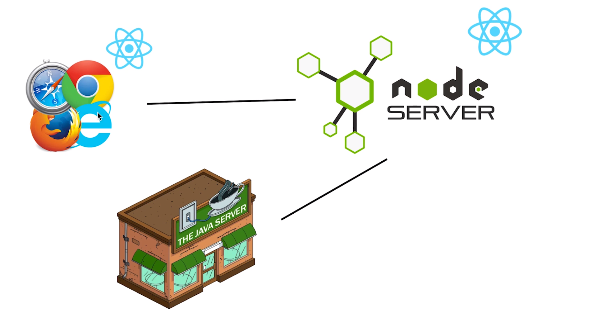
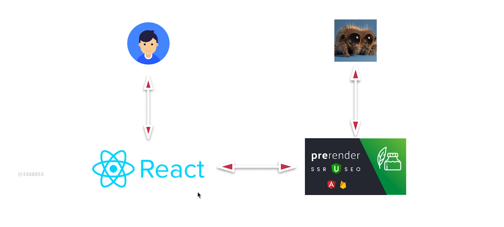
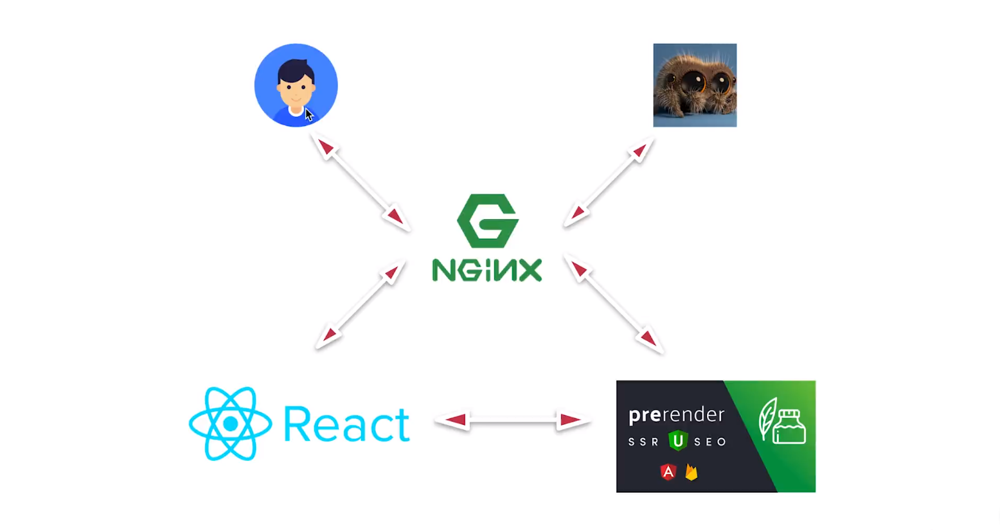

# 	归纳

[TOC]

## 概念

> 关于**渲染**
>
> 如果从词的直接意思来看，应该是指对图像的再加工，使图像变得更好、更美观、更真实或者更震撼。但在浏览器中，渲染是指浏览器通过执行代码中的内容来显示图像。而浏览器显示图像，从直接关系来看是由 HTML 来决定的（当然也和 CSS 有关），所以所谓服务器端渲染就是指服务器创建了页面中主要显示页面内容的 HTML，而客户端渲染是指由浏览器通过执行 JS 文件来生成 HTML（DOM 树）来显示页面内容。

### SSR & CSR

#### 基本概念

- SSR（Server Side Rendering 服务器端渲染）：指由服务器来生成页面内容的过程，传统方式的过程是后端利用前端所写 HTML 模版绑定已有数据。比如早期的网站使用 java 与 php 开发的页面都是由服务器端渲染的。
- CSR（Client Side Rendering 客户端渲染）：指由客户端来生成页面内容的过程，主要通过一些框架，比如 React、Vue 等将已编写好的 JS 代码与异步请求的数据结合生成页面内容。

#### 优缺点

- SSR
  - 更快的首屏速度
  - 利于 SEO
  - 开发效率较低
- CSR
  - 首屏较慢
  - 不利于 SEO
  - 开发效率较高（前后端分离开发）

#### 使用 React 作为基础框架的 SSR 与 CSR

##### React 客户端渲染流程

1. 用户通过浏览器向服务器发送请求
2. 服务器返回 HTML
3. 浏览器发送 bundle.js 请求
4. 服务器返回 bundle.js
5. 浏览器执行 bundle.js 中的 React 代码从而渲染页面

##### React 服务器端渲染流程

1. 浏览器向服务器发送请求
2. 服务器运行 React 代码生成页面内容
3. 服务器返回页面从而渲染页面

区别：React 代码从客户端运行转移到服务器端运行（但其实只有部分在服务器端运行，比如首屏代码）

### SEO

搜索引擎优化（SEO Search Engine Optimization）：通过对 HTML 代码的优化来使页面在搜索引擎的搜索结果中更靠前的过程。

#### 为什么需要使用 SSR

因为百度的搜索引擎爬虫只能够识别 HTML 文本上的内容（对于大多数搜索引擎的爬虫而言，当然也存在识别 JS 的爬虫），因此客户端渲染的内容都在 js 中，无法识别，从而无法让网站的内容出现在搜索结果中。因此，SSR 的意义就在于能够通过服务器渲染出 HTML 内容并让搜索引擎爬虫能够识别。

#### title 和 desciption 的作用

 title 与 description 对网站排名依据非常小，通过只在网站中添加 title 和 description 来提升排名是很困难的，但 title 与 description 却又很重要，因为当你的网站出现在搜索结果中时，title 和 description 便会展示给搜索者关于你网站的信息，它能帮助搜索者了解你网站的具体内容，那么好的 description 对于搜索者而言也会具有吸引力，他点开你的网站的可能性也会增加，因此，title 和 description 是增加网站在搜索结果中被点击的概率，也可以说为转化率。

#### 使用 React-Helmet 来定制页面独立的 title 和 description

> 完整内容请查看 9-4 或者官方文档 https://github.com/nfl/react-helmet

客户端代码：

```jsx
// Home/index.js
import { Helmet } from 'react-helmet'

render() {
  const { name, list } = this.props
  return (
    <Fragment>
      <Helmet>
        <meta charSet="utf-8" />
        <title>欢迎来到首页 - Home 组件</title>
        <meta name="description" content="首页面的描述就是没有描述" />
      </Helmet>
      <h1 className={styles.homeTest}>My first App</h1>
      ......
```

- 引入 'react-helmet' 中的 Helmet 组件，然后在这个组件内部写入一些 head 中需要引入的标签即可。

- 如果一个路由状态下渲染的多个组件都使用了 Helmet，那么嵌套内部的 Helmet 组件会覆盖外层的 Helmet，而下面的组件会覆盖前面组件的 Helmet。比如在这个项目中，如果 Header 组件中也有 Helmet，那么会被 Home 组件中的 Helmet 给覆盖掉。

服务器端代码：

由于以上的方式只能在客户端渲染时有效，我们通过官方文档中 「Server Usage」 部分的说明来搞定服务器端的使用。

官方代码示例：

```jsx
ReactDOMServer.renderToString(<Handler />);
const helmet = Helmet.renderStatic();

const html = `
    <!doctype html>
    <html ${helmet.htmlAttributes.toString()}>
        <head>
            ${helmet.title.toString()}
            ${helmet.meta.toString()}
            ${helmet.link.toString()}
        </head>
        <body ${helmet.bodyAttributes.toString()}>
            <div id="content">
                // React stuff here
            </div>
        </body>
    </html>
`;
```

它的意思是在你使用了 renderToString 方法的下面，对 Helmet 组件执行其 renderStatic() 静态方法，就可以在返回的字符串模板中通过返回的示例 helmet 来获取页面中 Helmet 组件内对 header 的配置了。

我们到 .src/server/utils.js 下来对自己的代码进行更改：

```jsx
import { Helmet } from 'react-helmet'

export const render = (req, store, routes, context) => {
  const reactContent = renderToString(
    <Provider store={store}>
      <StaticRouter location={req.path} context={context}>
        <div>
          {/* {routes.map(route => (
              <Route {...route} />
            ))} */}
          {renderRoutes(routes)}
        </div>
      </StaticRouter>
    </Provider>
  )
  const helmet = Helmet.renderStatic()
  
  ...
  
    return `
    <html>
      <head>
        ${helmet.title.toString()}
        ${helmet.meta.toString()}
        <style>${cssStr}</style>
      </head>
      <body>
```

#### 如何做好 SEO

首先我们考虑一下，一个网站如果从内容的角度来说，是由哪些部分组成的呢？基本上都是由文字、多媒体（图片、音乐、视频、flash、Canvas）、链接这三部分所组成的。

而我们知道，搜索引擎在判断一个网站价值如何时也就是从这三方面来判断的，那么做好 SEO 就是对这三方面做好优化，以下是一些简单的方式：

- **文字优化**：对于谷歌、百度这样的搜索引擎在分析文字时，会把原创性作为一个非常重要的指标。

- **链接优化**：链接分为两种，一种是网站内部自己的链接跳转到自己的网站，被称为**内部链接**。而另一种是其他网站的链接跳转到到你自己的网站，被称为**外部链接**。

  - 1.内部链接所访问的网站内容要和主网站内容相关，相关性越强，则 SE 认为你的网站价值越大。

    因为，如果你的网站是做教育培训的，而你的网站的链接却是去到一些体育、游戏等网站，则你的网站就会被认为不靠谱，认为没有在做本职工作的培训，而是做在其他的事情。

  - 2.外部链接越多，则越有价值。

    外部链接越多说明你的网站影响力更大则更有价值，因此你可以到别的网站去多发一些你自己网站的链接，这样你的网站就有可能更靠前一些。

- **多媒体优化**：如今的搜索引擎已经可以对图片等多媒体进行识别和收集，尤其像是 google 这样比较先进的搜索引擎。在两个文字与链接基本相同的网站上，有图的网站会比没图的网站排名更靠前，因为 SE 认为你的网站更丰富。


### 同构

**将一套代码，在服务器端执行一次，再在客户端执行一次的方案**就叫**同构**。（这里我们的一套代码指的是 React 代码）

我们来看一段 react 代码：

```jsx
const Home = (props) => {
  return (
  <Fragment>
    <h1>My first App</h1>
    <p>This is my first app,It's awesome!</p>
    <button onClick={()=>{alert('hi~')}}>click me</button>
  </Fragment>
  )
}
```

对于上面这段 Home 组件代码，我们使用 `renderToString(<Home/>)` 方法将其转换为 HTML 字符串代码并添加到服务器端，当客户端发送请求并收到服务器端发送过来的 HTML 文本并渲染时，我们点击页面上的 button 按钮并不会执行 `alert('hi~')` ，原因是因为 `renderToString()` 方法只负责将 React 代码转换为 HTML 文本，但并不会绑定事件。

因此，我们需要一个办法来让绑定的事件生效，所以将上面这段代码再在浏览器端运行一次，从而让浏览器端能够实现事件的绑定。

#### React 同构项目流程

1. 服务器端代码运行 React 代码渲染出 HTML
2. 发送 HTML 给浏览器
3. 浏览器接收到内容并展示
4. 浏览器请求并加载 JS 文件
5. JS 中的 React 代码在浏览器端重新执行
6. JS 中的 React 代码**接管页面操作**（实现一些事件绑定）

### 路由

在后端中，路由是根据 url 来执行不同的函数。

在前端中，路由是根据 url 来显示不同的页面。

#### 客户端渲染 React 项目中执行路由的流程

1. 客户端向服务器发送一个请求，服务器返回一个有 div#root 的 HTML 和一个 script 标签用于获取 js
2. 获取到 js 后，js 中的 React 代码执行
3. js 中的 React 代码**接管页面操作**
4. js 代码拿到浏览器上的地址
5. js 代码根据地址返回不同的页面内容

#### 使用 react-router-dom 管理路由

- 客户端需要使用`<BrowserRouter>`组件管理

  ```jsx
  const App = () => {
    return (
      <BrowserRouter>
        {Routes}
      </BrowserRouter>
    )
  }
  ```

- 服务器端需要使用`<StaticRouter>`组件管理，并需要通过`res.path`获取路径并传入给`<StaticRouter>`

  ```jsx
  app.get('/', (req, res) => {
    const reactContent = renderToString((
      <StaticRouter location={req.path} context={{}}>
        {Routes}
      </StaticRouter>
    ))
  
    res.send(`
      <html>
        <head>
          <title>App</title>
        </head>
        <body>
          <div id="root">${reactContent}</div>
          <script src='./index.js'></script>
         </body>
      </html>`)
  }) 
  ```

#### 当我们做同构路由时，页面的访问流程的思考

实际上，同构的路由只有第一次访问页面时，服务器端才需要客户端的路由状态（URL、路径、Path），而之后的所有关于路由的跳转都由 React 代码来执行跳转并渲染相应的页面。

服务器端之所以需要 StaticRouter 组件来帮助返回 HTML 代码，是因为客户端第一次请求需要返回 HTML 用于显示页面和获取其他资源，比如 js，并且也为了 SEO，我们也需要服务器端来帮助渲染任何路由状态下的 HTML 代码。

所以说服务器端渲染，实际上是指第一次访问页面时的渲染。

### 中间层

我们在做服务器端渲染时，经常会听到一个概念叫中间层。那到底是什么？先看一张图：



之前我们所简单构建的一个同构项目中，就像上图中上半部分一样，我们的浏览器主要是与 node server 进行通信，浏览器请求页面，node server 执行 React 代码渲染出 HTML 返回，但是对于大型项目，我们的服务器不只是使用 node，因为项目中大量的数据查询与计算一般不会使用 node 去做，而是使用更底层的服务器，比如 Java Server ，让它们来承接一些底层的运算。原因是相较于 node server，java 与 C++ 这样的服务器的计算性能效率更高。

对于上面所描述的架构也有一个好处，Java server 只需要专注于数据的计算与数据的获取，而 node server 则将 java server 取到数据与 React 做一个结合然后负责生成页面的内容。

因此，node server 在这里就是一个中间层，负责拼装需要展示给用户的内容，并且返回。

这样拆分过后，每一部分的职责就非常的明确了：

- java server 负责查询和计算数据。
- node server 负责将 java server 返回的数据和 React 结合生成 HTML 文档内容。
- 客户端（浏览器）执行 JS 代码来让 React 代码接管整个页面的渲染和事件绑定。

因此系统的架构更加的复杂，这样前端不只是要关注于前端代码，也需要关注于 node.js 的代码，维护 node 服务器，并且一些自动化重启服务器的运维工作也需要去学习。

### 注水与脱水

在 React 同构项目中：

- 注水：在服务器端，将 store 中的 state 存放在 window.context 中的过程。（将服务器端的数据通过 window.context 对象传递给客户端的过程）

- 脱水：在客户端，将 window.context.state 中的数据存传给 createStore() 的过程。（客户端将 window.context 对象取得数据的过程）


---

## 问题与解决

### 服务器端如何异步获取数据

#### 问题分析

在使用 React 作为视图层框架进行开发时，一般会在`componentDidMount`生命周期钩子中获取数据，获取到数据之后通过`this.setState()`改变组件 state 来达到将远端数据渲染到页面的目的。如果使用`Redux`作为数据层，则是通过`dispatch`派发`action`来改变`store`，但问题是服务器端渲染所使用的`renderToString`方法不同于客户端渲染所使用的`ReactDom.render`方法或是同构项目中使用的`ReactDom.hydrate`方法，它并不会执行`componentDidMount`生命周期钩子，所以服务器端获取远端数据需要在其他地方获取。

> 更详细的问题描述可以查看`5-7 流程回顾及问题分析`。

#### 解决思路

解决这个问题的关键在于，改变服务器端传入`<Provider>`的 `store`，这样一开始 store 中就存在数据也就不需要在组件内部再发送异步请求然后再改变 `store` 从而改变页面内容。

但在改变`store`之前，我们需要获取数据，不过应该获取什么数据呢？

在同构项目中，只有第一屏是需要服务器来渲染的，而第一屏的内容是由**请求地址**和**路由状态**决定的，从请求地址中能够获取到当前路由状态，也就是能够知道需要渲染哪些组件，但如果只是渲染哪些组件则无法真正的获取到数据，所以让使用`<Route>`组件所组成的路由状态更改为由数组组成的路由状态，这样就能够给每一项路由添加一个属性`loadData`用于获取数据。`routes.js`如下：

```jsx
export default [
  {
    component: Header,
    key: 'header',
    routes: [{
      path: '/home',
      component: Home,
      loadData: Home.loadData,
      key: 'home',
      routes: [{
        path: '/home/homechild',
        exact:true,
        component: HomeChild
      }]
    },
    {
      path: '/login',
      component: Login,
      exact: true,
      key: 'login'
    },]
  },
]
```

- R8 就是为路由`/home`所添加的`loadData`方法

#### 解决步骤

> 具体实现过程查看 5-8 至 5-10

1. 匹配用户路径与路由配置，返回成功匹配的路由项，目的是获取这些路由项中的 `loadData` 方法
2. 对路由项进行循环，判断组件中是否有 `loadData` 的方法，如果有则说明这个组件中有我们需要异步加载的数据
3. 我们把所有 `loadData` 中返回的 `promise` 添加到传给 `Promises.all` 的数组中。
4. 对 `Promise.all` 方法传入 `promises`，当异步加载到数据完成之后，我们再把 `store` 传给 `render` 并返回页面内容的字符串
5. 最终通过 `res.send()` 发送页面内容

#### 部分代码

- 使用`Thunk`而返回函数的`action`中，返回函数中需要将`axios`返回的`promise`返回出去

  ```jsx
  export const getHomeList = () => {
    return dispatch => {
      return axios.get('http://47.95.113.63/ssr/api/news.json?secret=' + secret)
        .then((res) => {
          const list = res.data.data
          dispatch(changeListAction(list))
        })
    }
  }
  ```

- 每一个`loadData`方法都是路由对应组件的静态方法，并且接收`store`用于`dispatch`

  ```jsx
  Home.loadData = (store) => {
    // 这个静态方法是负责在服务器端渲染之前，提前加载好这个组件需要的数据
    return store.dispatch(getHomeList())
  }
  ```

### 同构项目中已有数据页面重新请求数据

#### 问题描述

这个问题如标题所述，对于首次加载的页面已经在服务器端请求并添加到页面内容之中，但一到客户端依然需要重新获取，原因是一回到客户端，客户端会让`React`接管页面渲染，所以会重新渲染，但由于客户端并没有数据，所以需要请求。

#### 问题思路

解决的方式是利用「注水」与「脱水」。

- 在返回给客户端的`HTML`代码中，添加一段脚本，脚本中会对`window.context.state`属性添加已经获取到数据的`store`中的数据（注水）
- 然后在客户端执行代码时，通过向`createStore`方式中的第二个参数传入这个`state`，让`store`中的初始状态下是有服务器端所请求的数据的。（脱水）
- 最后，在异步请求数据的地方先判断是否已经存在数据，再决定是否发送异步请求。

#### 部分代码

- 注水

  ```jsx
  // utils.js
  return `
      <html>
        <head>
          <title>App</title>
        </head>
        <body>
          <div id="root">${reactContent}</div>
          <script>
              window.context = {
                state: ${JSON.stringify(store.getState())}
              }
          </script>
          <script src='http://localhost:3000/index.js'></script>
        </body>
      </html>`
  ```

- 脱水

  ```jsx
  export const getServerStore = () => {
    return createStore(reducer, applyMiddleware(thunk))
  }
  
  export const getClientStore = () => {
    const preloadedState = window.context.state
    return createStore(reducer, preloadedState, applyMiddleware(thunk))
  }
  ```

  - 这两个生成 store 的函数是在不同的环境下执行的

- 判断是否请求

  ```jsx
  componentDidMount() {
    // 判断数组中是否有值
    if(!this.props.list.length){
      this.props.getHomeList()
    }
  }
  ```

### 使用 proxy 代理，让中间层承担数据获取职责

如标题，这其实是一种方案而非问题。客户端请求数据并非向数据服务器请求而是向 node 服务器请求， node 中间层服务器在这里作为代理，替客户端向数据服务器请求数据并返回给客户端。

这样的好处在于：

- 使中间层服务器有更大的职责，比如能够对请求进行加工、数据进行加工或者解决跨域问题。
- 减少查找错误的范围，比如当页面中的逻辑出现问题时，可能是客户端与 node 端的问题，而不应该是数据端的问题，而数据发生错误时，应该是 node 端和数据端的问题，而不应该是客户端的问题。（对于这一点我表示有一些疑问，这需要结合一些实际的开发经验来理解）

#### 代码层面

> 具体过程查看 6-1 到 6-4，这里只描述一些重要部分

- 使用`express-http-proxy`模块搭建 proxy 服务器

  ```jsx
  // server/index.js
  import proxy from 'express-http-proxy'
  
  // /api/news.json 客户端请求路径
  // req.url = 'news.json'
  // proxyReqPathResolver: /ssr/api/news.json  这个函数会返回的路径字符串
  // http://47.95.113.63 + proxyReqPathResolver() 在服务器端请求的路径
  // http://47.95.113.63/ssr/api/news.json
  
  app.use('/api', proxy('http://47.95.113.63', {
    proxyReqPathResolver: function (req) {
      return '/ssr/api' + req.url
    }
  }))
  ```

  - 通过使用中间件，当客户端访问服务器根目录下的 `/api` 目录时，服务器就会代理访问 `http://47.95.113.63` 这个服务器。配置 proxyReqPathResolver() 方法可以帮助我们解析客户端请求的路径，我们通过 `req.url` 来获取到 `'/api'` 之后的路径字符串并通过字符串拼接来返回我们需要访问的数据服务器的路径字符串。最终，服务器就会去访问数据服务器上这个路径资源并返回。

- 使用`axios.create`的方法创建两个不同的实例用于在不同环境下的异步请求 

  ```jsx
  // client/request.js
  import axios from 'axios'
  
  const instance = axios.create({ 
    baseURL: '/', // URL 是全大写
  })
  export default instance
  
  // server/request.js
  import axios from 'axios'
  
  const instance = axios.create({
    baseURL: 'http://47.95.113.63/ssr',
  })
  
  export default instance
  ```

- 使用 `redux-thunk` 中的 `withExtraArgument` 方法来传入不同的`axios`实例

  ```jsx
  // .src/store/index.js
  import clientAxios from '../client/request'
  import serverAxios from '../server/request'
  
  export const getServerStore = () => {
    return createStore(reducer, applyMiddleware(thunk.withExtraArgument(serverAxios)))
  }
  
  export const getClientStore = () => {
    const preloadedState = window.context.state
    return createStore(reducer, preloadedState, applyMiddleware(thunk.withExtraArgument(clientAxios)))
  }
  
  // action.js
  export const getHomeList = () => {
    return (dispatch, getState, axiosInstance) => {
      return axiosInstance.get('/api/news.json?secret=' + secret).then(res => {
        const list = res.data.data
        dispatch(changeListAction(list))
      })
    }
  }
  ```

### renderRoutes 方法实现对多级路由的支持

#### 问题描述

在项目中为了能够在不同的路由状态中存储`loadData`，使用了数组的方式来描述路由，并且通过遍历数组项中的数据与`<Route>`组件结合来实现使用`react-router`管理路由的办法。但如果在数组中使用嵌套路由则会使嵌套路由无法被遍历，如下这样的嵌套路由：

```jsx
export default [
  {
    path: '/',
    component: App,
    routes: [{
      path: '/home',
      component: Home,
      loadData: Home.loadData,
      routes: [{
        path: '/home/homechild',
        exact:true,
        component: HomeChild
      }]
    },
    {
      path: '/login',
      component: Login,
      exact: true,
    },]
  },
]
```

- 在路由`'/'`中存在`routes`属性，此属性所存储的数组可以视为路由`'/'`的子路由。

#### 解决办法

为了解决这个问题，我们可以使用 `react-router-config` 包所提供的 `renderRoutes` API 来遍历，这样嵌套的子路由便能够被遍历出来。

#### 其他问题

> 具体查看 6-5

使用`renderRoutes`加上数组形式的路由会有一个问题，父路由如果不能够被匹配则子路由就算匹配也无效，比如父路由是`'/'`并且`exact: true`，子路由为`/homechild`，当路由为`'/homechild'`时，由于父路由的`exact:true`则无法被匹配，其子路由虽然路由匹配，但依然无效。


### 一会儿为登陆一会儿为未登陆

刷新页面会出现一会儿是登录状态一会儿是非登录状态。

原因是在 ./src/server/index.js 中，我们将匹配路由中所携带的 loadData 执行完成返回的 promise push 到了 promises 数组中并在接下来通过 Promise.All 方法来同一执行逻辑，但我们在 App.loadData 中并没有返回 promise 如下：

```jsx
// ./src/App.js

// 之前
App.loadData = store => {
  store.dispatch(actions.getLogin())
}

// 更改之后
App.loadData = store => {
  return store.dispatch(actions.getLogin())
}
```

我们通过添加 return 关键字将 store.dispatch(actions.getLogin()) 中要执行的函数所返回的 promise 返回出去。通过这个修改就能够解决这第一个问题。

但具体的原因是，由于没有返回这个通过异步请求登录状态接口的 promise，当我们请求首页时，就会通过组件 Home 中的 loadData 所返回的 promise 来执行渲染页面的代码（render()），这个时候，如果登录状态的异步请求执行比 Home 中请求 List 快，那么就会改变组件的状态为未登录（默认是登录），如果慢了，则会保持登录的状态。这就是为什么刷新是一会儿为登录，一会儿又是未登录。

> 这里补充一点，Promise.all() 方法是当传入的 promise 数组中返回的 promise 都为 resolve 时就会执行 .then() 中的逻辑，如果其中有一个为 reject，那么就执行 .catch() 中的逻辑，并且不会等待其他 promise 是否执行完成（pending 状态）。

### 点击登录以后依然为未登录状态

#### 问题原因

讲解一下具体的逻辑：

1. 刚进入页面，Cookies 为空，处于非登录状态
2. 用户点击登录，进行登录操作：
   1. 浏览器发请求给 node 服务器
   2. 转发给 api 服务器，进行登录
   3. api 服务器生成 cookie
   4. 浏览器上存在 cookie，登录成功
3. 当用户重新刷新页面的时候：
   1. 浏览器请求 html（携带了 cookie，只要之前登录过，浏览器上存在 cookie，发送请求时就会带着 cookie 发送过去）
   2. node 服务器进行服务器端渲染
   3. 进行服务器端渲染，首先要去 api 服务器取数据（没有携带 cookie，使用 proxy 代理，默认不会转发 cookie）
4. 由于 api 服务器没有收到 cookie，所以 api 服务器返回的依然为未登录状态的 fasle

### 解决思路

为了解决这个问题，我们需要将客户端发送过来的 `cookie` 让 node 代理服务器帮忙发给 api 服务器，而发送的请求的工作是`axios`来执行的，所以我们向 node 端`axios`实例中的`headers`字段中添加`cookie`即可。

### 代码部分

1. 获取 req 对象用于获取`cookie`

   ```jsx
   // ./src/server/index.js
   app.get('*', (req, res) => {
    const store = getServerStore(req)
     ...
   }
   ```

2. 将导出为`axios`实例对象更改为导出函数用于接收`req`对象，并添加`headers`字段：

   ```jsx
   // ./src/server/request.js
   
   import axios from 'axios'
   
   const Createinstance = (req) => axios.create({
     baseURL: 'http://47.95.113.63/ssr',
     headers:{
       cookie: req.get('cookie') || ''
     }
   })
   
   export default Createinstance
   ```

3. 将`req`传入`CreateInstance`方法：

   ```jsx
   import createServerAxios from '../server/request'
   
   export const getServerStore = (req) => {
     return createStore(reducer, applyMiddleware(thunk.withExtraArgument(createServerAxios(req))))
   }
   ```

   

### 数据请求失败情况下 promise 的处理

有时我们会遇到一种情况，也就是数据接口出现问题返回错误，那么在当前的代码中，遇到这样的问题我们 node 服务器不会加载页面并返回任何东西，原因如下：

```jsx
// .src/server/index.js
Promise.all(promises)
  .then(() => {
  const context = {}
  const html = render(req, store, routes, context)
  
  if(context.action === 'REPLACE'){
    console.log('redirect')
    res.redirect(301, context.url)
  }else if (context.NOT_FOUND) {
    res.status(404)
    res.send(html)
  }else{
    res.send(html)
  }
})
  .catch(error => {
  new Error(error)
})
```

Promise.all() 方法中所传入的 promise 数组中只要存在一个 reject 状态的 promise，那么就会去执行 .catch() 中的逻辑，上面代码中，catch() 内部并没有执行 res.send() 类型响应客户端的代码，所以客户端会一直处于请求状态。

为了解决这个问题，最简单的方式是在 .catch() 中也做和 .then() 一样的逻辑即可，只是不会显示错误接口的数据。但这样的方式也是存在的问题的，下面是讲师所举的例子：

- 一个页面要加载 A，B，C，D 四个组件，这四个组件都需要异步加载数据，也就是都会执行相应组件下的 loadData 方法来会一个 promise。假设 A 组件请求数据时发生错误，就会有如下大致两种情况：
  1. B，C，D 组件所访问的接口返回比 A 组件的快，那么 B，C，D 组件的数据都会显示，只是不显示 A 组件的。
  2. B，C，D 组件所访问的接口返回比 A 组件的慢，那么由于 `Promise.all()` 方法一旦接收到 `promise` 数组中有 `reject`  状态的 `promise` 就会去执行 `.catch()` 中的方法，而不会等到处于 `pending` 状态下的其他 `promise` 加载完成。
- 所以，上面例子中的第二种情况，使那些能够加载数据的组件也可能无法显示数据。

接下来我们使用一个技巧，让 promises 数组中的所有 `promise` 都变为 `fulfilled` 状态，这样就可以使 `Promise.all()` 方法等待所有组件的 `promise` 加载完成后才执行后面 .`then()` 中的逻辑。如下：

```jsx
// .src/server/index.js
const promises = []
matchedRoutes.forEach(item => {
  if (item.route.loadData) {
    const newPromise = new Promise((resolve, reject) => {
      item.route.loadData(store).then(resolve).catch(resolve)
    })
    promises.push(newPromise)
  }
})

Promise.all(promises)
	.then(...)
...
```

在第 5 行代码中，我们通过`new Promise` 创建一个实例，在其内部，将 `item.route.loadData(store)` 返回出来的 `promise` 做了处理，无论返回的 `promise` 是 fulfilled 状态还是 rejected 状态，都执行 resolve 函数使其变为 fulfilled 状态的 promise，然后将这个 promise 添加到 promises 数组中传给 Promise.all() 方法来执行。

> 这里我想补充一点内容。
>
> 因为平时的项目中肯定不会是像讲师这样的方式来让能加载的数据加载出来，不能加载的数据就算了。而应该是不能加载的数据会做一些提示，我想到的情况有如下两种：
>
> 1. 对于单独处理的情况，那应该会在发送异步请求的位置进行处理，这个项目中是在 action.js 中的 axios 部分，只需要在其后添加 .catch() 的处理逻辑即可。
> 2. 对于统一处理的情况，可以就在上面第 6 行的代码部分进行处理，先 .catch() 处理之后，再 .catch() 来使其变为 fulfilled 状态。

### 不同环境下的 css-loader 不同

 style-loader 是通过在 window 上挂载样式的方式来实现打包 css 的，但是服务器渲染时，服务器是没有 window 这个对象的。解决这个问题的办法是使用 isomorphic-style-loader 来做服务器端打包 css 的工作。因此，我们需要将 css 的 rules 从 webpack.base.js 分离出来分别添加到 webpack.client.js 和 webpack.server.js 中，并分别使用不同的 style-loader：

```jsx
// webpack.client.js
module: {
  rules: [
    {
      test: /\.css$/,
      use: ['style-loader', { 
        loader: 'css-loader',
        options: {
          importLoaders: 1,
          modules: true, 
          localIdentName: '[name]_[local]_[hash:base64:5]'
        }
      }]
    }
  ]
}

// webpack.server.js
module: {
  rules: [
    {
      test: /\.css$/,
      use: ['isomorphic-style-loader', { 
        loader: 'css-loader',
        options: {
          importLoaders: 1, 
          modules: true, 
          localIdentName: '[name]_[local]_[hash:base64:5]' 
        }
      }]
    }
  ]
}
```

### 页面抖动问题

#### 问题描述

当我们访问页面或者刷新页面时，会发现页面存在“抖动”，也就是一开始没有任何样式，然后突然又有了样式。造成这个问题的原因是服务器返回的 html 中并没有携带 style 部分的内容，而我们页面的样式是由后来加载客户端的 js 文件生成的，因此会产生这个抖动的现象。

#### 解决思路

style-loader 将 css 解析为 js 代码，在执行的过程以 style 标签的形式添加到 header 标签内，这样我们就可以在客户端中看到有样式的页面。而在服务器端我们需要手动添加 style 的内容。

首先来查看一下 styles 这个对象在服务器端与在客户端返回的内容：

```jsx
// 客户端
{test: "style_test_d3nG6"}

// 服务器端
{ test: 'style_test_d3nG6',
  _getContent: [Function],
  _getCss: [Function],
  _insertCss: [Function] }
```

- 可以看到，客户端只返回了类名，而服务器端返回了三个方法，而这三个方法会返回不同的内容：

```jsx
// _getContent:
_getContent: [ [ './node_modules/css-loader/dist/cjs.js?!./src/containers/Home/style.css',
    'body {\r\n  background-color: slategrey;\r\n}\r\n\r\n.style_test_d3nG6 {\r\n  color: salmon;\r\n}\r\n',
    '' ],
  toString: [Function: toString],
  i: [Function],
  locals: { test: 'style_test_d3nG6',
    _getContent: [Function],
    _getCss: [Function],
    _insertCss: [Function] } ]

// _getCss:
getCss: body {
  background-color: slategrey;
}

.style_test_d3nG6 {
  color: salmon;
}

// _insertCss:
insertCss: function () { [native code] }
```

- 通过 getCss 方法可以获得 style.css 中的内容，那么我们就可以通过这个方法将内容传给 render() 方法让其返回的 html 代码中带有 styles 的内容从而实现样式内容的返回。

#### 解决步骤

1. 客户端代码中，在向`render()`函数传入的`context`对象中添加一个`css`数组：

   ```jsx
   // server/index.js
   Promise.all(promises)
     .then(() => {
     const context = {css:[]}
     const html = render(req, store, routes, context)
    ...
   ```

2. 在不同的组件中将从`styles._getCss`方法中获取的 css 内容 push 到数组中，以 Home 组件为例：

   ```jsx
   // Home/index.js
   class Home extends Component {
     componentWillMount() {
       const { staticContext } = this.props
       if(staticContext){
         staticContext.css.push(styles._getCss())
       }
     }
     ...
   ```

3. 将`context.css`数组中的内容连接成字符串并添加到返回的 html 文档的`<style>`标签中：

   ```jsx
   // server/utils.js
   
   const cssStr = context.css.length ? context.css.join('\n') : ''
   
     return `
       <html>
         <head>
           <title>App</title>
           <style>${cssStr}</style>
         </head>
   ...
   ```

#### 使用高阶组件精简代码

上面代码中那样的方式，实际上会在不同组件的 componentWillMount 中执行了相同的逻辑，因此可以使用 HOC 来精简代码。代码如下：

在 ./src 目录下创建一个 withStyle.js 的文件，里面创建一个函数用于返回一个组件：

```jsx
import React, { Component } from 'react'

// 这个函数，返回一个组件
export default (DecoratedComponent, styles) => {
   class NewComponent extends Component {
    componentWillMount() {
      const { staticContext } = this.props
      if (staticContext) {
        staticContext.css.push(styles._getCss())
      }
    }

    render() {
      return <DecoratedComponent {...this.props} />
    }
  }

  NewComponent.loadData = DecoratedComponent.loadData

  return NewComponent
}
```

- 可以看到，withStyle.js 导出了一个函数，这个函数返回了一个新的组件（一个构建函数，也可以称为类），函数需要传入两个参数，一个是需要渲染的组件，一个是该组件使用的样式对象。而这个新的组件我们可以称之为高阶组件，因为它是用于返回组件的组件。

- 然后，在这个组件中写一些需要传入的组件的相同逻辑代码，比如这里是 componentWillMount 部分的代码。

- 最后返回传入的组件即可，但记得要将高阶组件中的 props 在返回的组件中进行解构。原因是高阶组件是「传入组件」的父组件，之前其他传给「传入组件」的 props，现在都传给了这个高阶组件了。
- R18，将「传入组件」的 loadData 静态方法添加至返回的高阶组件之中。

接着，以 Home 组件为例来使用这个 HOC ：

```jsx
// Home/index.js

import withStyle from '../../withStyle'

const ExportHome = connect(
  mapStateToProps,
  mapDispatchToProps
)(withStyle(Home, styles))
```

其他代码都一样，主要是两点：

- 1.删掉 componentWillMount，因为现在高阶组件已经帮我们做了这些事情。
- 2.在导出 Home 的地方，将 Home 导入 withStyle 函数中来返回一个新的组件。

总之，高阶组件是利用函数的方式，将那些需要执行相同逻辑的组件传入这个函数，在函数内部需要返回一个新的组件，在新的组件中可以做一些需要共享的行为。

### SSR 的复杂度与高性能消耗

#### 问题描述

服务器端渲染是一个非常复杂的技术流程，之前我们只要写一些 js 前端代码即可，现在我们要去写 node 端的代码，所以它让我们项目的整体架构变得复杂了，我们需要在前端与后端之前再引入一个 node 中间层，以前一个项目可以只需要一个好的前端工程师和一个后端工程师，现在维护一个 ssr 项目还需要一个 node 工程师，从而增加了我们项目的复杂度。同时，我们也知道，我们的 js 代码不只要在客户端执行一遍，也需要在服务器端执行一遍，这就意味着我们的 node 端需要执行大量  react 渲染计算，而这样的计算是非常消耗性能的，因此也就增加了我们项目额外的损耗，中间层需要更多的机器来帮忙运算，这样无论在费用还是维护成本上也算是一个比较大的负担，所以这是 SSR 的一些缺点。包括调错，以前前后端进行联调测试的时候，或是线上出现 bug 的时候，不是前端出错就是后端出错，现在如果出错了则还需要定位 node 端。

但是，SSR 却可以带来用户体验的提升，一个是首屏渲染时间（TTFP)，这个的时间会明显的缩短，因为当用户看到用户返回的 html 的时候就能直接看到页面，不需要像客户端渲染那样等待 js 加载完成才能看到页面。

还有一点，SSR 可以帮助我们提升 SEO，以前客户端渲染的内容是没有办法帮我们做 SEO 的，因为其返回给客户端的内容就是一个空白的 HTML，SSR 让我们的 html 包含了整个网页的内容，这样你的搜索排名会相对更好一些。

讲师建议，除非你的项目对 SEO 和 TTFP 有非常高的要求而且能够忽略性能上的影响时再去使用 SSR 这种架构体系去设计你的代码。如果你的网站在使用客户端渲染时就已经渲染很快了，而且对于 SEO 没有特别大的需求时，这个时候还是建议不要使用这么复杂的框架，直接正常的使用 react.js 就好了。这也是为什么 react 官方不推荐大家使用这种服务器端渲染的概念，因为这样会让你的项目变得会对以前复杂的多。

如果假设我们的项目对 SEO 有非常高的要求，但对 TTFP 要求不高时，这种请求我们应该如何去做呢？

答案是使用**预渲染**

#### 使用预渲染解决 SEO 问题的新思路



比如我们有一个 React 项目，这个项目不必是一个 SSR 的项目，只要是一个普通的 React 项目就行。对于一个普通用户来说（如上图中的男孩子）去访问这个 react 项目时，你正常返回一个带有 react.js 的页面，我在本地执行 js 来渲染页面即可，也不需要做 SSR 的处理。但对于一个爬虫而言，如何和用户一样直接去访问这个项目的话，那对于绝大多数爬虫而言肯定就不知道你页面中的内容是什么，因此就不会有一个好的排名。这个时候我们就需要使用到预渲染。

当我的网站被访问时，我们先判断一下到底是普通用户还是爬虫在访问我们的网站，如果是爬虫，那么就让它访问我们的预渲染服务器，预渲染服务器会去访问我们的 react 项目的内容，然后预先渲染生成一个带有内容的 html 返回给这个爬虫，这样爬虫所看到的就不是一个简单的客户端渲染的页面，而是一个包含所有内容的 html。

预渲染的过程是：访问本来的 react 项目，将执行项目过后生成的 html 页面返回给爬虫。

> 例子可以查看 9-6

#### 如何区别访问网站的是一个普通用户还是一个爬虫？



如上，我们可以在访问我们的项目之前架一台 nginx 服务器，无论是用户访问还是爬虫访问都先走 nginx 服务器对外的一个接口，比如都访问的是 www.baidu.com，那么都会先去访问我们的 nginx 服务器。nginx 服务器会根据 useragent（UA）的一些信息或者 IP 的一些信息识别出访问者到底是一个真实的用户还是一个爬虫。如果 nginx 发现是一个爬虫的话，则让请求转发给 prerender 服务器，如果是一个普通的用户则直接把请求发送给 react 项目的服务器。

所以，通过这样的架构同样可以让我们的代码有一个好的 SEO 的效果。

如果大家对 prerender 感兴趣也可以去看他的底层代码，其实其底层有一个 pendent.js 的东西。

predender 的原理是，当我们访问`http://localhost:8000/render?url=http://localhost:3000/`  这个链接访问 prerender 服务器时，这个服务器会自动的生成一个小的浏览器，然后在这个小的浏览器中去访问 `localhost:3000`，浏览器就可以查看 js 所渲染的 dom 内容并拿出来，接着 prerender 服务器把这个浏览器关掉，然后把内容再返回给爬虫。其实就是创建一个浏览器识别网站内容拿到内容给爬虫。但是会有一个问题，爬虫去访问页面时，prerender 服务器会调用浏览器去访问 react 项目，拿到结果之后再给爬虫，所以 prerender 耗时会非常长，但时间无所谓，因为你是给爬虫看。

如果对于预渲染比较感兴趣可以去看 www.prerender.io 这个网站，这个网站就详细的讲解了 prerender 的原理和使用的方式，同时也提供了 prerender 的一些便捷的使用接口。


### 在控制台出现错误时，解决了问题依然提示错误

对于已经解决了的问题，在控制台中依然提示错误，重新启动开发服务器后就恢复正常了，有可能是 IDE 内部出现的 bug 而引起的，或者是缓存的问题，所以有时**重启服务器也是一个尝试解决问题的方式**。


### Favicon 的问题

当浏览器在请求到页面内容以后，也会请求根路径下的 favicon，也就是网站图标，由于我们使用了 `express.static(‘public’)` 中间件，则会去 public 下寻找资源，如果没有寻找到则会去走 `app.get(‘*’,function(){})` 中的逻辑，所以，我们需要放一个 favicon.icon 在 public 来解决这个问题。


### 相对路径与绝对路径在返回的 html 中的问题

当访问 'http://localhost:3000/home/homechild' 这个路径时，click me 按钮没有点击事件，并且 Header 组件中的超链接被点击时也会重新加载页面，那么我能肯定的是，访问这个页面时，客户端没有加载 js 文件。

这个问题并不是客户端没有加载 js，而是 js 返回的是和 homechild 路径下相同的 HTML 代码。而造成这个问题的原因是在返回 html 内容中的返回 js 的部分，也就是 script 标签中的属性 src 的值是一个相对路径：

```js
return `
 <html>
   <head>
     <title>App</title>
   </head>
   <body>
     <div id="root">${reactContent}</div>
     <script src='./index.js'></script>
   </body>
 </html>`
```

那么，当页面加载到 script 标签时，会去查找http://localhost:3000/home/index.js 文件，而我们服务器上这个目录下是没有 js 文件的。因此需要更改为绝对路径：

```jsx
return `
 <html>
   <head>
     <title>App</title>
   </head>
   <body>
     <div id="root">${reactContent}</div>
     <script src='http://localhost:3000/index.js'></script>
   </body>
 </html>`
```

---

## 功能

### 实现 404 页面并返回 404 状态码

在使用`react-router-config`的`renderRoutes`方法的情况下，在路由数组中添加如下路由：

```jsx
export default [
  {
    path: '/',
    component: App,
    loadData: App.loadData,
    routes: [
			...
      {
        component: NotFound
      }
    ]
  }
]
```

- 是`'/'`的子路由
- 路由配置中不需要添加 path 路由，这样配置的作用逻辑是，当路由不匹配除了根路径的任何路由配置时，便会匹配这个路由配置并渲染组件。

接下来，需要解决一个问题，如何让 node 服务器知道路由所对应的是 404 页面，有两种方式。

1. 使用向`<StaticRouter>`添加`context`属性并向其传入一个空对象，这个`context`属性会在路由匹配所渲染的组件的 props 中接收到，然后在`componentWillMount`中向`context`对象添加一个用于确定是否为 404 的属性即可。带代码如下：

   ```jsx
   class NotFound extends Component {
     componentWillMount(){
       const { staticContext } = this.props
       staticContext && (staticContext.NOT_FOUND = true)
     }
     render() {
   //...
   ```

   ```jsx
   export const render = (req, store, routes, context) => {
     const reactContent = renderToString(
       <Provider store={store}>
         <StaticRouter location={req.path} context={context}>
   ......
   ```

   ```jsx
   Promise.all(promises)
     .then(() => {
     const context = {}
     const html = render(req, store, routes, context)
   
     if(context.NOT_FOUND){
       res.status(404)
       res.send(html)
     }
   })
     .catch(error => {
     new Error(error)
   })
   ```

2. 利用路由数组中的 key 值，404 页面在目前的路由状态中一定为所匹配出来的路由数组中的最后一项，只需要获取 key，看是否为 404 即可，如下：

   ```jsx
   // server/util.js
   
   Promise.all(promises).then(() => {
   	// 得到最后一项路由的key值，事先在路由中写入key：404
   	const lastRouteKey = matchedRoutes[matchedRoutes.length - 1].route.key;
   	const html = render(req, store, context);
   	if (lastRouteKey == '404') {
   		res.status(404);
   	}
   	res.send(html);
   });
   ```

### 实现服务器端 301 重定向

在目前的应用中，如果用户为未登录状态，访问 `/translation` 页面会重定向到首页，但是有个问题，这种重定向只在客户端有用，而在服务器端依然是返回 `/translation` 页面的内容，原因是服务器端不会执行 `<Redirect/>`组件中的重定向逻辑。

具体的解决方式其实很简单，在使用 `<StaticRouter>` 加上 `renderRoutes()` 方法来做路由渲染时，只要 `renderRoutes()` 中所渲染的组件加载 `<Redirect/>` 组件，`<StaticRouter>` 就会往其 context 属性中添加一些表示执行了重定向的参数，然后利用这个参数来做一些逻辑处理就可以了。

首先我们来看看当加载了 `<Redirect/>` 组件，`<StaticRouter>` 会往其 context 属性中添加的参数：

```jsx
context = { 
  action: 'REPLACE',
  location: { pathname: '/', search: '', hash: '', state: undefined },
  url: '/' 
}
```

利用这些参数，我们在 Promise.all() 所要执行的 promise 中添加一些逻辑：

```jsx
// ./src/server/index.js

Promise.all(promises)
  .then(() => {
  const context = {}
  const html = render(req, store, routes, context)

  if(context.action === 'REPLACE'){
    res.redirect(301, context.url)
  }else if (context.NOT_FOUND) {
    res.status(404)
    res.send(html)
  }else{
    res.send(html)
  }
})
```

这里注意一点，`res.redirect(301, context.url)` 会重定向以后重新访问服务器的 `/` 路径，因此你不需要在其后执行 `res.send(html)`


### 使用 css-loader 的自动为类名添加 hash 值

在 React 项目中，style-loader 将 css 解析为 js 代码，在执行的过程以 style 标签的形式添加到 header 标签内，这样我们就可以在客户端中看到有样式的页面。但这样就会存在一个问题，类名如果不严谨的情况下会出现共用和冲突，所以可以使用`css-loader`在解析 css 代码时为每一个类名添加一段使用 hash 作为其类名的一部分用于区别。

先来看看使用 css-loader 的配置：

```jsx
module: {
    rules: [
      {
        test: /\.css$/,
        use: ['style-loader', { // loader 的处理是从下到上，从右到左
          loader: 'css-loader',
          options: {
            importLoaders: 1, //使用 loader 的数量
            modules: true, // 支持 css 的模块化
            localIdentName: '[name]_[local]_[hash:base64:5]'  // 自定义 Class 的名称 —— [name] = 文件名， [local] = class 名称， [hash:base64:5]=添加 hash 部分
          }
        }]
      }
    ]
  }
```

- `options`字段中的`localIdentName`的设置可以用你所想要的类名来进行命名，并且可以使用 hash 作为区别。

然后，需要在组件中通过引入的方式来使用，如下：

比如在 Home/style.css 中添加一个类选择器：

```css
.test {
  color: salmon;
}
```

然后在 Home/index.js 通过如下的方式引入，并且调用 styles 对象中的 test 参数：

```jsx
import styles from './style.css'

<h1 className={styles.test}>My first App</h1>
```

最后去查看我们服务器发送给客户端的 html 代码中，这个 h1 标签中的 class 内容：

```html
<h1 class="style_test_d3nG6">My first App</h1>
```

可以看到 styles.test 的值是 `"style_test_d3nG6"` 字符串，这是因为我们在之前 webpack 中对 css-loader 进行了配置，让 class 生成的名称是以这样的形式返回的。

所以，对于在任何 css 文件中创建的类选择器而言，在引入这个 css 文件时，都可以从中获取到一个 styles 对象来帮助我们将 css-loader 所生成的新类名传入标签之中使用。

---

## 技巧

### Redux 中 action.type 的命名 - 添加与改变

`action.type`的命名一定是遵守`reducer`行为的，比如对于数据「删除」、「添加」、「改变」，但「添加」与「改变」在`reducer`的行为中是相同的，都是将一个数据进行完全的替换，因为对于 store 来说需要接受一个新的对象，而非在原有对象上进行添加，比如：

```jsx
export default (state = defaultState, action) => {
  switch (action.type) {
    case CHANG_LIST:
      return {
        ...state,
        newsList: action.list
      }
    default:
      return state
  }
}
```

- R6，我们用`action.list`中的数据替换掉了`newsList`的数据

所以，很多时候使用`CHANGE`这个词会比使用`ADD`或者`GET`更宽泛一些，并且行为上也能确实做了比另外两者更多的事情，那么在大多数情况下使用`CHANGE`就是比较合理的方式。

### 对于向 undefined 属性赋值的技巧

有些时候会有这样的情况：

```jsx
window.context.state = ${JSON.stringify(store.getState())}
```

也就是向某一变量的某一属性的某一属性赋值。

如果只是为`window.context`赋值，则会添加`context`属性并赋值，但这里是向`context`的属性赋值，如果`context`为`undefined`，则向其属性赋值则会报错，一般的解决手段如下：

```jsx
window.context && window.context.state = ${JSON.stringify(store.getState())}
```

通过「短路求值」的方式先返回`window.context`的值看是否为真，如果为真则执行后面的语句。不过这是对于`context`可能为`undefined`也可能部位`undefined`的情况，但要是已经明确知道是`undefined`又应该如何去做的呢？这里有一个比较巧妙的方式：

```jsx
window.context = {
  state: ${JSON.stringify(store.getState())}
}
```

我们通过将一个带有`state`属性的对象赋值给`window.context`来再一条语句中实现对两个属性的赋值。

### 利用 axios 实例的 params 字段来简化接口字符串

在此项目中，每一个数据接口字符串都需要添加查询字符串`secret`，为了将这重复的行为简化，可以在创建`axios`实例的对象中添加`params`字段，如下：

```jsx
import config from '../utils/config'

const instance = axios.create({ 
  baseURL: '/', // URL 是全大写
  params:{
    secret: config.secret
  }
})
```

由于`secret`的值是不固定的，需要经常更改，所以我们将其放到固定的位置——`./utils/config`之中并导出，如下：

```jsx
export default {
  secret: 'PP87ANTIPIRATE'
}
```

---

## 思考

### 对比同构项目中客户端与 node 端使用 React 时的异同点

#### 相同点

- 在编写组件代码时，基本相同
- 都使用数组路由并通过 `renderRoutes` 方法进行遍历

#### 不同点

- 渲染时
  - 客户端挂载为 DOM 时使用的 API 为 `React.hydrate` 
  - node 端使用的是 `renderToString` 返回字符串
- 使用 `react-router` 来管理路由时
  - 客户端使用的是 `<BrowserRouter>` 
  - node 端使用的是 `<StaticRouter>` ，并且需要传入 `location` 来告诉 `<StaticRouter>` 匹配的路由
- 添加样式时
  - 客户端引入 styles 并将其传入标签的 `className` 属性
  - node 端则需用使用 `context` 和 `styles._getCss` 方法获取到首屏所要渲染组件的 css 字符串，然后添加到返回给客户端的 html 文档中的 style 标签下
- 获取数据
  - 客户端在组件 `componentDidMount` 生命周期中获取
  - node 端是在组件静态方法 loadData 中获取
- 使用 webpack
  - 客户端使用 style-loader
  - node 端由于缺少 window 对象而使用 isomorphic-style-loader
- axios 实例
  - 客户端的 api 地址没有变化，并么有没有 headers 字段
  - node 端需要更改 api 地址，并且由于默认不带 cookie 值，需要添加 headers 字段并添加 cookie 属性
- 添加 head 标签时
  - 客户端在组件内使用 `<Helmet>` 组件进行添加
  - node 端需要先等组件加载完毕之后，通过 `Helmet.renderStatic()` 获取实例，并将使用实例方法所获取的字符串添加到返回的 html 文档中的 head 标签下


---

## 工具、包、库

### nodemon

> 介绍来源：https://www.jianshu.com/p/fc7664e9025c

- nodemon 用来监视 node.js 应用程序中的任何更改并自动重启服务,非常适合用在开发环境中。

- nodemon 将监视启动目录中的文件，如果有任何文件更改，nodemon 将自动重新启动 node 应用程序。

- nodemon 不需要对代码或开发方式进行任何更改。 nodemon 只是简单的包装你的 node 应用程序，并监控任何已经改变的文件。nodemon 只是 node 的替换包，只是在运行脚本时将其替换命令行上的 node。

- nodemon Git地址：[github.com/remy/nodemon#nodemon](https://link.jianshu.com?t=https://github.com/remy/nodemon#nodemon)


在课程中的运用：

```jsx
// ./package.json
"scripts":{
  "start": "nodemon --watch build --exec node ./build/bundle.js",
  "build": "webpack --config webpack.server.js --watch"
}
```

- 监听`./build`目录中的文件，如果发生变化则执行`—exec`之后的命令。


### npm-run-all

> [npm 使用总结](https://www.ruphi.cn/archives/183/#anchor14) 这篇文章会有介绍 npm 的一些命令和`npm-run-all`

`npm-run-all`用于运行多个`scripts`脚本命令。


在课程中的运用：

```jsx
// ./package.json

"scripts": {
  "dev": "npm-run-all --parallel dev:**",
  "dev:start": "nodemon --watch build --exec node ./build/bundle.js",
  "dev:build:server": "webpack --config webpack.server.js --watch",
  "dev:build:client": "webpack --config webpack.client.js --watch"
},
```

当我们运行 `npm run dev` 时，就会同时执行以`dev`命名的脚本。（dev:）可以想象为一个命名空间，方便我们将开发环境与生产环境分开。