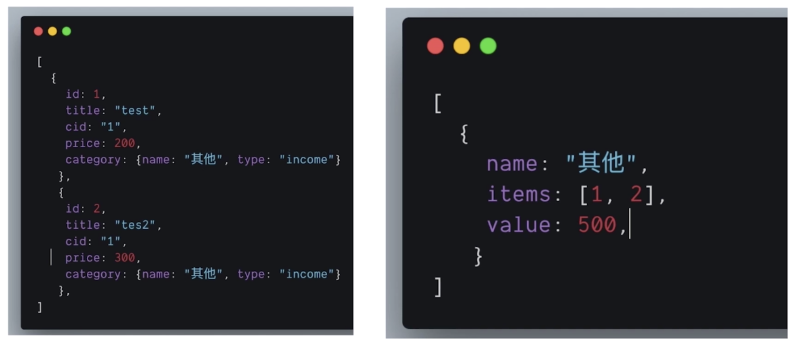
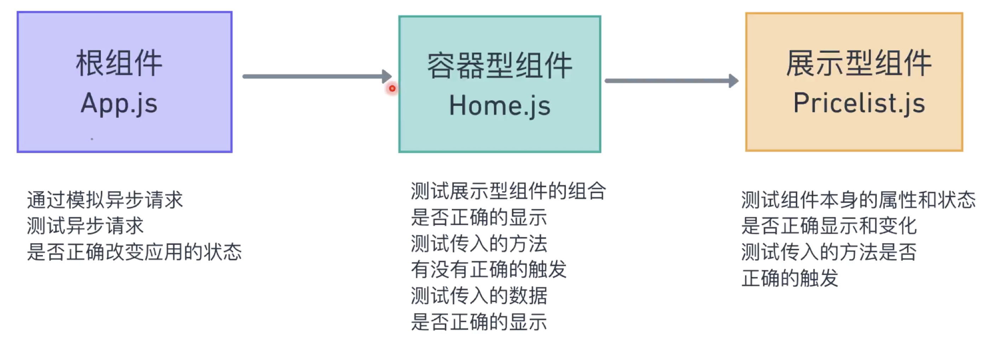

归纳与总结

[TOC]

## 我的思考

### 如何阅读组件代码

对于前端，在阅读组件代码之前，我们应该对组件有一个清晰的认识，至少知道它要显示什么内容以及它所能做的交互，通过了解这些再去阅读组件的代码就能够非常清楚的知道每一部分代码的作用。

相反，如果直接去阅读代码没有对组件或者应用有一个预先的了解，在阅读代码的过程中可能并不太清楚有些部分到底在做什么。但要说有什么益处，可能是在阅读代码的过程中逐渐对组件有一个认识，虽然这认识并非是从视觉视角而是从功能视角。

### 展示型组件是否应该有自己的 state

在官方所提供的文档说明中，不太提倡展示型组件拥有自己的 state，但是对于部分带有交互的展示型组件而言我们需要 state 来帮助实现一些 UI 上的交互效果，比如说此项目中的 MonthPicker 组件，需要一个 state 来帮助显示或隐藏下拉菜单，还有点击不同的月份和年份可以切换按钮的高亮显示，这些如果在没有容器型组件时我们只能通过在展示型组件内部添加 state 来实现。但如果有容器型组件时，对于是否应该把 state 提升到容器型组件中，则可以提升也可以不用，你可以将展示型组件 UI 由自身来控制，当容器型组件需要数据时，利用回调直接向容器型组件传递数据即可。

### 编写代码的技巧

- 有时我们并不需要一次性就将回调写完，比如我们可以先写一个回调来改变其 state，如果需要更改路由等其他功能，再逐步添加即可。
- 不要惧怕于写错误的代码或者不完整的代码，因为对于一个人而言很难将所有的问题都考虑进去，我们需要做的是先解决能够想到的问题，对于之后可能出现的问题或者说目前代码的冗余可以在之后来解决，重要的是在这个过程中逐步累积经验，这样在之后遇到同样的问题时才有可能考虑的更加的周全。也可以说，在缺少对应用有一个整体的认识和经验之前，存在缺失与问题是很自然的事情，我们需要的是逐步修正问题和改善功能。

### 容器型组件中的回调

**对于容器组件中传递给展示型组件的回调函数，其实是用于获取在其内部的数据**，而这个数据是通过给函数传参来实现的，那么我们就可以这样来写这些回调，先写一个函数传入一些参数，然后再来写回调用这些参数所做的逻辑，我想这样的方式其实在很多地方都这么用，而且大部分程序员也是这么去写的。先考虑有什么数据需要传入，再写逻辑。而不是先写逻辑，再传值。当然，两种方式实际上都是可取的。总之，**将回调的实参位置看作是获取数据的入口，而回调本身则是接口**。

### 对象与数组

在构建 React 项目时，可能使用最多的数据结构是数组，因为需要使用其来渲染重复的项，并且也可以使用其各种方便的 api 来进行计算出一些需要的参数，而对象这样的数据结构很多时候只是数组中的一项，用于通过键名的方式存储很多数据方便我们快速获取想要的值。那么，位于数组中的每一项是否可以将其 id 作为键名来构建一个对象呢？当然是可以的，而且这个项目中也是这样做的，这样的好处是当我们需要某一项时只需要直接使用键名即可获取这一项，而不需要像数组那样去遍历，而且需要使用数组时直接通过`Object.keys()`这个 API 进行转换即可。

### 展示型组件的纯粹性

可能展示型组件内部可以去执行一些不需要在容器型组件执行的逻辑，比如改变路由跳转页面，那么是否可以将这部分逻辑只写到展示型组件而不用写在容器型组件呢？我觉得当然没有问题，但是如果要保证展示型组件的纯粹性，也就是不添加任何的副作用，作为展示型组件你只需要接受数据渲染 UI 和接受回调执行逻辑，但具体的数据和逻辑你不需要来管，这部分的任务是容器型组件来管理的，这样的方式我会认为更好一些，将职责拆分对于整体上的组件管理更有帮助。

### 测试

- 测试做的事：传入一个输入，测试是否返回预期输出。
- 测试一个组件，实际上就是测试根据你所传入的数据所渲染的 DOM 与你预期返回的结果是否相同。因为对于代码所最终呈现的效果而言就是一个 DOM 结构，只不过在代码层面上我们无法看到其真实的效果，而大部分公司的所谓测试只是通过查看页面或在浏览器、手机中所呈现的 UI 来检查是否与预期相同，通过点点点拉拉拉的实际操作来查看交互是否有错误，但这样的测试一是并不完全能够覆盖所有应该测试的点，二是人工的测试对于人的要求太高，不能要求人和机器一样能完全不发生错误，比如忽视了某个地方数据的错误，或者缺少某个交互的测试等。
- 注意：测试环境和生产环境还有开发环境是有区别的，而且与后两者有比较大的区别，因为测试环境是没有在浏览器环境下进行的，而是通过使用`enzyme`这个库来帮助我们模拟另外两个环境中的情况。
- 测试可以覆盖面非常广，也可以非常窄，全看你在对项目了解的何种程度下觉得哪些测试是否有必要。
- 写测试的过程中，实际上也是在梳理应用数据流动的过程与组件状态，帮助自己更好的理解应用。
- 测试实际上只是在测试内部逻辑是否顺畅，比如我传入一个数据，看它是否正常的显示在页面中，或者点击某个按钮执行某个方法是否执行了，并且是否传入了预期的参数，至于函数执行之后的结果，有些时候并不是这个组件所能决定的，而且也并不应该是这个组件的测试任务。
- 对于被使用了 HOC 包裹的组件的测试，我们只需要测试被包裹的组件即可，而不是测试被被包裹之后返回的组件，因为对于 HOC 所做的处理，可以由更上层的组件来测试，如果 HOC 只是提供了数据，那么就直接模拟这些数据进行测试即可。
- 可以使用颗粒度更细腻的测试来测出不同的问题，但要有这么细的颗粒度，就要去要思考函数、方法中执行的步骤或者说输入与输出的变化，执行过程中所影响的数据变化等等。所谓颗粒度是指从应用的显示效果到实现这些效果的代码的区别，越是贴近代码越是具有更细的颗粒度。

### 通过画图来辅助开发

虽然之前我的几个小项目都是我一边思考一边做出来的，但如果在这之前有一个简单的规划会好很多，至少在有些时候短路时可以看看这些规划来帮助自己继续开发，而最好的方式就是画图，比如可以简单的把组件的块画出来，或者将数据的流向和存储的位置画出来，其实就是简单的几个图形而已，不需要特别复杂的东西。

### 对于组件的看法

react 通过将组件进行组合，最终传递给`ReactDOM.render`，这个 API 就会将我们在组件内的元素（标签）与 props、state 进行渲染成 DOM 放置到所传入的节点之下，比如我们应用中是这样的：`ReactDOM.render(<App />, document.getElementById('root'));`，我们放置在了一个 id 为 root 的节点之下。

那么，最终我们在页面中所看到的内容不过都是 DOM 元素所组成的而已，HOC 所返回的组件，组件返回的所有内容都是 DOM，这就是我想说的，我们要`render()`这些 DOM，无论是使传入 HOC 后的新组件，还是没有传入 HOC 的旧组件，**都是为了返回这些 DOM**。

只是相较于之前我们纯使用 html 或者 js 来渲染的 DOM 而言，组件不只是渲染 DOM，从组件的整体上来看，它也会管理数据的状态、流动，并且会有一些副作用。

### 组件状态 与 state

一个使用术语的问题，之前写的是「App 组件状态」，更改为了「App 组件 state」，原因是组件状态其实包含组件所要渲染的一切，包括元素、子组件、从父组件中所获取的 props，这些 HTML 与 数据。所以，我会觉得使用 state 比使用状态这个词要好准确的多。当然更准确的是 App 实例的属性 state，但很少接触到实例所以可以不用说的这么麻烦。

### 如何解决一个始终无法解决的问题

在学习的过程中出现过一些编码行为上的错误，造成的原因是对于数据的来源并没有一个清晰的认识就开始去写代码，从而陷入一种无法解决问题的状态，最好的方式是重新梳理需要实现的功能并对数据的来源具体表示什么了解清楚，然后在有数据的情况下去考虑如何实现功能。

> 具体情况看 9-6

## 遇到的问题

### 对象数据的引用和拷贝

```jsx
const itemsWithCategory = items
.map(item => {
  item.category = categories[item.cid]
  return item
})
```

上面代码中虽然返回了一个新的带有 item.category 的数组，但原始 item 中也添加了 category，因为这里的 item 是将 items 中的每一个对象的引用调用到这里，所以需要进行拷贝：

```jsx
const itemsWithCategory = items
.map(item => {
  // 注意这里的 item 是 items 中的对象，所以需要先进行拷贝，否则会更改掉 items 中每个对象的值
  const copyItem = {...item}
  copyItem.category = categories[copyItem.cid]
  return copyItem
})
```

更多内容也可以百度了解，或者查看这篇文章：[什么是js深拷贝和浅拷贝及其实现方式](https://www.haorooms.com/post/js_copy_sq)

## 技巧

### 如何寻找一个好的开源库来完成工作

- 可以使用谷歌直接搜索相关的关键词，比如这里可以搜索「react charts library」，可能会获取到很多关于对比不同开源库的文章，当然我们可以去阅读这些文章来获取想要的信息，但这里我们也可以看到一个叫做 Recharts 库的链接，那说明这个库应该是非常受欢迎的。

- 打开主页，来查看一下 API 和这些示例是否符合你所想要的需求。

- Github 项目页了解更多信息 —— issues、start 等等。

- 使用 [npm-stat](https://npm-stat.com/) 查看这个 package download 数量

- 使用 npm view 查看发布频率 - 发布频率代表着 fix bug 和新功能更快

  ```shell
  npm view recharts
  ```

  但似乎没有查看到，但可以直接去 [npmjs](https://www.npmjs.com/package/recharts) 搜索查看相关信息

### 学习使用开源库

1. 如果官网有教程，先查看教程
2. 教程中会有安装，可以查看如何安装
3. 然后开始学习入门 —— 起步
4. 将实例代码放到应用中尝试，对于属性值可以去查看 API 文档

### ViewTab 组件的不足

因为这里的支出与收入 Tab 和 ViewTab 很像，所以可以考虑直接复用，但目前我们的 ViewTab 由于很多地方是写死的，所以有很多不足：

- 针对完全局限的场景（只能使用在切换 View）
- 内容无法定制（图标和名称都是固定的）
- 难以扩展（只能有两项 Tab，无法增加新的 Tab）

因此，我们需要对 ViewTab 进行重构，将其适用于更多场景和可以扩展。

也可以看到，**项目的重构一般是发生在*项目进行中*的**，当发现项目出现一些问题时，我们就可以通过重构来解决这些问题。

**可能会在项目中遇到的重构情况**：

- 组件的状态提升，当两个组件共用相同数据的时候，可以将其提升到共同的父组件中。
- 组件的扩展性更改，当发现组件能够在多处使用，但却有一定局限时，可以通过更改组件将其具备一定的扩展性。

> 实际的改变内容放在了本文「利用 props.children 实现组件扩展性和可定制化」

### 将对象数组转换为对象对象

将对象数组转换为对象对象的好处是使删除和调用更方便，如下：


- 可以直接使用`items[selectedId]`的形式来调用数据
- 也可以使用`delete items[deletedId]`的方式来删除数据

从数组转换为对象的方法：

```jsx
export const flattenArr = (arr) => {
  return arr.reduce((map, item) => {
    map[item.id] = {...item}
    return map
  }, {})
}
```

## 构建一个 React 应用的步骤

> 本部分内容来自——[React 哲学](https://zh-hans.reactjs.org/docs/thinking-in-react.html)
>
> 这部分内容也是整个课程的基础，整个课程也是按照官方的指导思想进行的。

假设我们已经有了一个返回 JSON 的 API，以及设计师提供的组件设计稿。

### 第一步：将设计好的 UI 划分为组件层级

- 需要在设计稿上用方框圈出每一个组件（包括它们的子组件），并且以合适的名称命名。

- 单一功能原则：一个组件原则上只能负责一个功能。如果它需要负责更多的功能，这时候就应该考虑将它拆分成更小的组件。

- 在实践中，因为你经常是在向用户展示 JSON 数据模型，所以**如果你的模型设计得恰当**，UI（或者说组件结构）便会与数据模型一一对应，这是因为 UI 和数据模型都会倾向于遵守相同的*信息结构*。因此，将用户界面划分为组件的工作量就可以忽略不计了。只需使组件完全对应地展现数据模型的某部分即可。

  > 我们应该始终注意数据模型与 UI 的联系，可能 API 的数据结构并没有那么恰当与完美，但我们可以将其进行适当的转换、更改使其与 UI（或者说组件结构）一一对应。

- 把框选出来的组件描述为更加清晰的层级。比如这样：

  - `FilterableProductTable`
    - `SearchBar`
    - `ProductTable`
      - `ProductCategoryRow`
      - `ProductRow`

### 第二步：用 React 创建一个静态版本

- 先用已有的数据模型渲染一个不包含交互功能的 UI。最好将渲染 UI 和添加交互这两个过程分开。这是因为，编写一个应用的静态版本时，往往要编写大量代码，而不需要考虑太多交互细节；添加交互功能时则要考虑大量细节，而不需要编写太多代码。所以，将这两个过程分开进行更为合适。我们会在接下来的代码中体会到其中的区别。

- 在构建应用的静态版本时，我们需要创建一些会重用其他组件的组件，然后通过 *props* 传入所需的数据。*props* 是父组件向子组件传递数据的方式。即使你已经熟悉了 *state* 的概念，也**完全不应该使用 state** 构建静态版本。state 代表了随时间会产生变化的数据，应当仅在实现交互时使用。所以构建应用的静态版本时，你不会用到它。

  > 也不一定完全不使用 state，对于组件的一些动画交互效果我们也可以使用 state 来进行管理。

- 你可以自上而下或者自下而上构建应用：自上而下意味着首先编写层级较高的组件，自下而上意味着从最基本的组件开始编写。当你的应用比较简单时，使用自上而下的方式更方便；对于较为大型的项目来说，自下而上地构建，并同时为低层组件**编写测试**是更加简单的方式。

### 第三步：确定 UI state 的最小（且完整）表示

- 想要使你的 UI 具备交互功能，需要有触发基础数据模型改变的能力。React 通过 **state** 来完成这个任务。
- 为了正确地构建应用，你首先需要找出应用所需的 state 的最小表示，并根据需要计算出其他所有数据。其中的关键正是 [DRY: *Don’t Repeat Yourself*](https://en.wikipedia.org/wiki/Don't_repeat_yourself)。只保留应用所需的可变 state 的最小集合，**其他数据均由它们计算产生**。比如，你要编写一个任务清单应用，你只需要保存一个包含所有事项的数组，而无需额外保存一个单独的 state 变量（用于存储任务个数）。当你需要展示任务个数时，只需要利用该数组的 length 属性即可。
- 通过问自己以下三个问题，你可以逐个检查相应数据是否属于 state：
  1. 该数据是否是由父组件通过 props 传递而来的？如果是，那它应该不是 state。
  2. 该数据是否随时间的推移而保持不变？如果是，那它应该也不是 state。
  3. 你能否根据其他 state 或 props 计算出该数据的值？如果是，那它也不是 state。

### 第四步：确定 state 放置的位置

- 哪个组件应该拥有某个 state 这件事，**对初学者来说往往是最难理解的部分**。尽管这可能在一开始不是那么清晰，但你可以尝试通过以下步骤来判断，对于应用中的每一个 state：
  - 找到根据这个 state 进行渲染的所有组件。
  - 找到他们的共同所有者（common owner）组件（在组件层级上高于所有需要该 state 的组件）。
  - 该共同所有者组件或者比它层级更高的组件应该拥有该 state。
  - 如果你找不到一个合适的位置来存放该 state，就可以直接创建一个新的组件来存放该 state，并将这一新组件置于高于共同所有者组件层级的位置。

### 第五步：添加反向数据流

- React 通过一种比传统的双向绑定略微繁琐的方法来实现反向数据传递。尽管如此，但这种需要显式声明的方法更利于人们理解程序的运作方式。

> 也就是通过向展示型组件传入回调，利用触发回调更改容器型组件来更改 state 从而更改 UI 状态

### 这就是全部了

希望这篇文档能够帮助你建立起构建 React 组件和应用的一般概念。尽管你可能需要编写更多的代码，但是别忘了：**比起写，代码更多地是给人看的**。我们一起构建的这个模块化示例应用的代码就很适合阅读。当你开始构建更大的组件库时，你会意识到这种代码**模块化和清晰度的重要性**。并且随着代码重用程度的加深，你的代码行数也会显著地减少。:)


## 构建一个静态版本的步骤

- 分析组件需要实现的功能和 UI

- 分析实现这些 UI 和功能所需要的 props：

  - 状态，比如一个列表可能会需要一个数组来渲染，那么我们就需要一个数组。
  - 交互，比如一个按钮需要的点击事件所触发的回调方法。

- 给这些 props 合理的名称，比如：

  ```jsx
  <PriceList
    items={???}
    onDeleteItem={???}
    onEditItem={???}
  />
  ```

- 一步一步完成组件，比如一个带有下拉菜单的按钮，先完成按钮再来完成下拉菜单

- 使用虚拟数据来模拟从 props 中传入的数据来调试组件 UI

## JS 部分

### 为月份数据填补 0

```jsx
export const padMonthLeft = month => month < 10 ? '0'+ month : month
```

### 通过初始值与长度来获取一个连续数组

```jsx
export const createRangeArr = (size, startAt = 0) => {
  const arr = []
  for(let i = 0; i < size; i++){
    arr[i] = startAt + i
  }
  return arr
}
```

- 1 到 12 的数组 => `createRangeArr(12, 1)`
- 2015 到 2023 的数组 => `createRangeArr(2015, 9)`
  或者 => `createRangeArr(9, -4).map(number => 2019 + number)`
- 当前年份上下 4 年的数组 => `createRangeArr(9, year - 4)`

### 对生成类名的封装

```jsx
addActiveClass = (propValue, arrValue) => {
  return propValue === arrValue ? "dropdown-item active" : "dropdown-item"
}
```

- 传入 props 值与循环数组中的值，然后通过判断是否相等来返回类，相等即使当前所选的"积极分子"

### 一个返回年月对象的工具函数

```jsx
export const parseToYearAndMonth = str => {
  const date = str ? new Date(str) : new Date()
  return {
    year: date.getFullYear(),
    month: date.getMonth() + 1
  }
}
```

- 函数名很长，但这样的名称很清楚的能知道这个函数在做什么
- `str`函参可以用来初始化年月，如果不传入，则使用当前的年月

### 使用 Promise.all

对于应用在一个行为期间内如果存在多次异步请求使用`Promise.all`可以简化代码，这里「一个行为期间」是指应用从一个静止状态到下一个静止状态之间的时间段，比如某一个区域从无数据到有数据，或者从静止状态下的应用通过交互到下一个静止状态之间。不过，「一个行为期间」其实范围过于大了，可能其中会执行多次不同的函数，**对于`Promise.all`很多情况下应该是在一个行为函数（一个行为函数可能执行多个函数）内如果多次的异步请求并且异步请求之间有相似处理逻辑时使用**。如：

```jsx
getInitalData: () => {
  const currentDate = parseToYearAndMonth('2018-12-03')
  const itemsURL = `/items?monthCategory=${currentDate.year}-${currentDate.month}&_sort=timestamp&_order=desc`
  const promiseArr = [axios.get(itemsURL),axios.get('/categories')]
  Promise.all(promiseArr).then( arr => {
    const [items, categories] = arr
    this.setState({
      items: flattenArr(items.data),
      categories: flattenArr(categories.data)
    })
  })
},
```

- 异步获取两个数据，而其处理逻辑相同，就可以使用。
- 好处当然是简化代码，并且错误也能统一处理。

- 第 3 行，items 接口的拼接，使用了查询和排序，`_sort`是排序，可以使用任何在你数据结构中的字段，`_order`是设置是升序（asc）还是降序（desc），因为我们需要最新的一项靠近最上面，所以使用降序（desc）

### 使用 ES7 的新特性  async 函数

> [ES6 入门 - async 函数](<http://es6.ruanyifeng.com/?search=await&x=0&y=0#docs/async>)
>
> - async 函数是什么？一句话，它就是 Generator 函数的语法糖。
> - `async`函数就是将 Generator 函数的星号（`*`）替换成`async`，将`yield`替换成`await`，仅此而已。
> - `async`函数返回一个 Promise 对象，可以使用`then`方法添加回调函数。当函数执行的时候，一旦遇到`await`就会先返回，等到异步操作完成，再接着执行函数体内后面的语句。
> - `async`函数内部`return`语句返回的值，**会成为`then`方法回调函数的参数**。
>
> - `async`函数返回的 Promise 对象，必须等到内部所有`await`命令后面的 Promise 对象执行完，才会发生状态改变，除非遇到`return`语句或者抛出错误。也就是说，只有`async`函数内部的异步操作执行完，才会执行`then`方法指定的回调函数。

目前项目中请求数据的方式是使用`Promise.all().then()`或者`axios.get().then()`这样基本的`promise`的用法，而接下来我们会 async 函数来进行替换。

async 函数是目前异步操作最好的解决方案，是对 generate 函数的一种语法糖，async 函数会返回一个 promise 对象，然后可以使用 then 方法利用回调函数来获取 async 函数的返回值，当函数执行时遇到 await 会等着这个异步操作完成时再执行函数体内后面的语句。

现在，我们来将我们的 actions.getInitalDate 更改为使用 async 函数：

```jsx
getInitalData: async () => {
  this.setState({
    isLoading: true
  })
  const currentDate = parseToYearAndMonth("2018-12-03")
  const itemsURL = `/items?monthCategory=${currentDate.year}-${
  currentDate.month
  }&_sort=timestamp&_order=desc`
  const promiseArr = [axios.get(itemsURL), axios.get("/categories")]
  const response = await Promise.all(promiseArr)
  const [items, categories] = response
  this.setState({
    items: flattenArr(items.data),
    categories: flattenArr(categories.data),
    isLoading: false
  })
  return response
},
```

- R1 - 使用`async`关键字来表示这个函数是一个`async`函数
- R10 - 在函数体内使用`await`关键字来直接获取由`Promise`返回给调用`then()`时传入的回调函数中的参数，这样我们不需要再使用`then(callback(response))`来获取`response`
- async 函数会返回一个 promise 对象，所以当我们调用`getInitalData`之后，可以通过`then()`来进一步获取返回值并做一些操作，比如重新更新**当前组件**的 state

### 使用高阶函数减少重复代码

先来分析上节课留下的问题，每一个异步操作在之前都需要先`this.setState({isLoading: true})`，这样是一件很繁琐的事情，那么对于组件可以使用高阶组件来帮助我们做一些重复性的事情，对于函数一样也应该有高阶函数来处理一些重复的事情，只是一个返回的是组件，一个返回的是函数。代码如下：

```jsx
const withLoading = (cb) => {
  return (...args) => {
    this.setState({
      isLoading: true
    })
    return cb(...args)
  }
}
```

- R2 与 R6 - 使用展开运算符将获取到的参数传递给 cb 进行调用，这样就不会让一些需要参数的 async 函数发生错误。
  - R2 使用了剩余参数，可以将传入函数中的参数都放入 args 这个数组中
  - R6 使用了展开运算符，将 args 数组中的参数解构出来，一一放入函参的不同位置上

使用：

```jsx
getInitalData: withLoading(async () => {
  const currentDate = parseToYearAndMonth("2018-12-03")
  const itemsURL = `/items?monthCategory=${currentDate.year}-${
  currentDate.month
  }&_sort=timestamp&_order=desc`
  const promiseArr = [axios.get(itemsURL), axios.get("/categories")]
  const response = await Promise.all(promiseArr)
  const [items, categories] = response
  this.setState({
    items: flattenArr(items.data),
    categories: flattenArr(categories.data),
    isLoading: false
  })
})
```

- 很简单，只需要将这些需要使用`this.setState`的函数传入`withLoading`这个高阶函数即可。

> 高阶函数与高阶组件有共同的一些特点：
>
> - 首先都是函数
> - 返回函数或组件
> - 执行一些需要重复的操作
> - 被返回的函数或者组件需要接收外面传进来的参数或者值，然后传入回调或者传递给组件内部的子组件。

### 数组去重



- 左边为 items 的数据结构，右边是我们想要获得的数据结构。
- 对于右边的数据结构，我们需要一个`name`来表示这是什么分类，需要一个`items`来表示哪些项属于这一分类，需要`value`来合计金额。
- 这样一道题就是传说中的数组去重，然后归类，所以第一个撞到我们脑子里的想法应该就是字典类型，在 JS 中就是 Object 来完成这项任务。

**代码部分：**

```jsx
const generateChartDataByCategory = (items, type = TYPE_INCOME) => {
  let categoryMap = {}
  items
    .filter(item => item.category.type === type)
    .forEach(item => {
      if (categoryMap[item.cid]) {
        categoryMap[item.cid].value += item.price * 1
        categoryMap[item.cid].items.push(item.id)
      } else {
        categoryMap[item.cid] = {
          name: item.category.name,
          value: item.price * 1,
          items: [item.id]
        }
      }
    })
  return Object.keys(categoryMap).map(key => ({ ...categoryMap[key] }))
}
```

我们要明白为什么最后要返回的是一个数组，但在中间过程中用一个对象来存放这些数据？

因为使用对象能更快的找到需要更改项的位置，在循环的过程中，如果发现了已经存在使用相同分类类型的项，那么就能够直接通过`obj[key]`的方法快速找到这个对象，从而将其 id 添加到`items`中，并将其`price`添加到`value`之中，组合成我们所要使用的数据形式，最终只需要简单的通过`Object.keys()`和`map`就能够转换成所需要的数组类型。

## React 部分

### 阻止冒泡

> [React-阻止事件冒泡](https://www.jianshu.com/p/d51574db5e32)

React 中分为合成事件、原生事件。

- **合成事件**是在 jsx 中直接绑定的事件，如

```jsx
<a ref="aaa" onClick={(e)=>this.handleClick(e)}>更新</a>
```

- **原生事件**是通过 js 原生代码绑定的事件，如

```jsx
document.body.addEventListener('click',e=>{
    // 通过e.target判断阻止冒泡
    if(e.target&&e.target.matches('a')){
        return;
    }
    console.log('body');
})
或
this.refs.update.addEventListener('click',e=>{
    console.log('update');
});
```

- 这里使用`matches`来匹配所点击的元素是否为不要继续执行之后代码的元素，其实也就是阻止 click 冒泡到 document 上。

**阻止冒泡事件分三种情况**：

1. 阻止合成事件间的冒泡，用e.stopPropagation()：

   ```jsx
   handleClick(e){
     // 阻止合成事件间的冒泡
     e.stopPropagation();
     this.setState({count:++this.state.count});
   }
   ```

2. 阻止合成事件与最外层 document 上事件的冒泡，用e.nativeEvent.stopImmediatePropagation()

   ```jsx
   handleClick(e){
     // 阻止合成事件与最外层document上事件的冒泡
     e.nativeEvent.stopImmediatePropagation();
     this.setState({count:++this.state.count});
   }
   ```

3. 阻止合成事件与除最外层 document 上的原生事件上的冒泡，通过判断 e.target 来避免

   ```jsx
   document.body.addEventListener('click',e=>{
     // 通过e.target判断阻止冒泡
     if(e.target&&e.target.matches('a')){
       return;
     }
     console.log('body');
   })
   ```

还有一种方式可以阻止冒泡：

```jsx
componentDidMount() {
  document.addEventListener("click", this.handleDocumentClick)
}

componentWillUnmount() {
  document.removeEventListener("click", this.handleDocumentClick)
}

handleDocumentClick = e => {
  if (this.node.contains(e.target)) {
    return
  }
  this.setState({
    isOpen: false
  })
}
```

获取不想触发冒泡事件的 ref（这里是 this.node），然后通过`contains`来判断是否在这个节点以内，如果是则不执行后面的逻辑（其实也就是等于阻止了冒泡，和上面的第三种情况类似）

### 利用 props.children 实现组件扩展性和可定制化

`props.children`这个属性很像是一种「插值」，将被包裹在组件中的内容放在其中，这样就可以在组件中将其插入到任意位置，实现一定的扩展性。

我们以项目中的`<Tabs>`组件为例来讲解一下具体的实现，但在之前还需要说明一下`<Tabs>`组件。

`<Tabs>`组件是会显示一排的标签，我们的扩展性在于能够在每一个标签内随意的使用想要使用的内容，并且可以添加任意的标签数量，这里面有一个特点是很像是数据列表，和我们之前所使用数组遍历出来的数据列表是类似的，只不过这里是一个一个的标签而之前所遍历出来的是一条一条的数据显示，但其实也可以理解为对于应用中重复的项都可以使用遍历来实现，不过对于这里的`<Tabs>`而言我们并不是传入数组在内部遍历，而是使用`props.children`，虽然内部也是一个数组，并且也进行了遍历，但和直接通过`props`来传入数组还是有一些区别，虽然本质上是相同的。好了，说一下具体步骤吧：

首先我们可以使用一个叫做`<Tab>`组件来包裹每一个所要渲染的"差异内容"，也可以理解为可定制化，代码如下：

```jsx
export const Tab = ({ children }) => <React.Fragment>{children}</React.Fragment>
```

- `{children}`部分就是可自行传入的内容
- 当然也可以不使用`<Tab>`而直接使用`<div>`，但这样会多出很多 div，不过也可以直接使用`<Fragment>`。使用`<Tab>`的好处是能够和`<Tabs>`有一个关联性，在看代码时会比较清楚是什么。

然后是`<Tabs>`部分：

```jsx
render() {
  const { children } = this.props
  const { activeIndex } = this.state
  return (
    <ul className="nav nav-tabs nav-fill my-4">
      {React.Children.map(children, (child, index) => {
        const active = activeIndex === index ? " active" : ""
        return (
          <li className="nav-item">
            <a
              href="#1"
              className={`nav-link${active}`}
              onClick={event => {
                this.tabChange(event, index)
              }}
              >
              {child}
            </a>
          </li>
        )
      })}
    </ul>
  )
}
```

- 这里只贴出了`render()`部分的内容，因为这里面最关键的是`React.Children.map()`，传入`children`，然后遍历出每一个`child`进行渲染，而`child`所放的位置就是可定制化的位置。
- `React.Children.map`可以帮我们做一些工作，如果子节点为 `null` 或是 `undefined`，则此方法将返回 `null` 或是 `undefined`，而不会返回数组，如果 `children` 是一个 `Fragment` 对象，它将被视为单一子节点的情况处理，而不会被遍历。所以这比使用数组方法`map`要更安全有效。

最后就是使用了，代码如下：

```jsx
<Tabs activeIndex={tabsText.indexOf(tabView)} onTabChange={this.handleChangeView}>
  <Tab>
    <Ionicon
      className="rounded-circle"
      fontSize="30px"
      color="#007bff"
      icon="ios-paper"
      />
    列表模式
  </Tab>
  <Tab>
    <Ionicon
      className="rounded-circle"
      fontSize="30px"
      color="#007bff"
      icon="ios-pie"
      />
    图标模式
  </Tab>
</Tabs>
```

- `<Tab/>`中的「插值」决定了每一项中显示的内容，这里是一个图标和文字。

### 使用 Context

> [Context](https://zh-hans.reactjs.org/docs/context.html) 提供了一个无需为每层组件手动添加 props，就能在组件树间进行数据传递的方法。
>
> 具体内容查看 7-3

几个关键点：

- `AppContext = React.createContext()`创建一个`Context`组件

- 使用`<AppContext.Provider>`组件包裹需要使用 Context 的组件，并传入 value 作为其内部可以获取的数据。
- 使用`<AppContext.Consumer>`组件包裹需要使用共享数据的组件，并且在内部需要使用一个函数来接受数据并返回需要渲染的内容。

### 使用 HOC

什么是 HOC

- 为解决组件逻辑重用的一种技术

- HOC 并不是 API，而是由 React 自身的这种组件组合模式而产生

- **是一个函数**，且该函数接受一个组件作为参数，并返回一个新的组件

  - 对比于一个组件是将 props 和 state 转化为一个 UI，HOC 是将一个组件转换为一个自带内部逻辑的新组件

- 对于用于封装使用 Context 的 HOC 而言，它并**不关心数据如何被使用**，只负责数据的传递，而传入的被包裹组件也并**不关心数据来自何处**，只负责数据的处理，让两个行为在不同的组件中分离开来，互不影响。

- HOC 除了提供数据之外也可以让组件中一些共同的操作，比如在`componentDidMount`中获取数据。

- 需要注意，对于 HOC，一定要将本来传递给旧组件而现在传递给新组件的 props，在旧组件的属性中用展开运算符进行展开，保证旧组件依然能够使用这些 props

  ```jsx
  export default function withContext(Component) {
    return props => {
      return (
        <AppContext.Consumer>
          {({ state }) => {
            return <Component {...props} data={state} />
          }}
        </AppContext.Consumer>
      )
    }
  }
  ```

- HOC 可以将重复的逻辑放在其中，比如给不同的组件添加一个 loading 功能，在没有获取数据之前显示 loading

具体内容查看 7-4


## 测试

### 测试是什么和重要性

人类面对重复的流程时会感到厌倦，面对复杂的流程时又容易犯错，但计算机非常喜欢处理重复性的复杂的流程，它们不会疲倦劳累，也很少犯错。所以，聪明的程序员就会写一些任务让计算机来自动化完成一些流程，比如可以每提交一次代码就让流程跑一遍，不需要让自己在界面上点来点去。

- 测试可以减少代码的 bug，使代码拥有更高的质量
- 更早的发现 bug，减少公司成本
  - 因为上线后的 bug 对于用户使用产品会产生不好的印象，减少用户量
- 让重构和升级更加容易和可靠
- 让开发流程更加的敏捷

### 测试金字塔

「测试金字塔」是由马丁福勒在 2012 年提出的，这个标准现在很多大公司设计自动化测试和持续化集成的最佳实践。如图：


### Jest

那么对于测试，我们可以使用通用的测试框架来帮助我们使用特定的语法来写测试用例，并且可以运行这些测试。

mocha jamine 这两个框架是用的比较多的两个框架，但这节课我们要介绍的是测试框架的后起之秀 Jest，是由 Facebook 出品的一款通用测试框架，拥有之前所说两个框架的特点，并且内置了许多新的特性。

#### Jest 特点

- 通用测试框架
- 支持多平台，比如浏览器、node
- 运行速度极快
- 内置代码覆盖率测试
- 为 React 提供了一些特殊的测试方法

> 官网地址：<https://jestjs.io/>
>
> Jest is a delightful JavaScript Testing Framework with a focus on simplicity.
>
> It works with projects using: Babel, TypeScript, Node, React, Angular, Vue and more!

#### Jest API

- `test('描述文本',cb)` 或者`it`可以用于写单独的测试用例。

- `describe('描述文本',cb)`是对一组测试的总体描述集合，在测试结果中，如果发现错误能够更详细的告诉我们是在哪个集合下的哪个测试发生了错误。

- `beforEach()`可以在每一个单独测试用例之前执行一段代码，比如可以用于在每一个测试用例之前重新挂载组件，从而让每一次的被挂载的组件相互之间没有影响。对应的`afterEach()`会在所有测试用例之后调用的钩子函数。

- `expect(wrapper).toMatchSnapshot()`能够生成一组「快照」并且保存在当前测试代码文件目录中的`__snapshots__`文件夹中，这是用于对修改之后代码做一个比较从而了解前后差异。

  - 这种测试方法可以避免出现组件在修改之后出现不可预见的 bug，比如你不小心在代码中添加了一些字符，通过 snapshot 就能直接观察到具体是哪个位置上，而不是发现在浏览器的页面结果或者控制台中发现异常，然后到代码中去寻找问题。

- 在测试用例前面把 `it` 更换为 `fit`，这样就会单跑这一个用例，就等于把这一个用例隔离开来，其他的信息就不会干扰。

- `jest.fn().mockReturnValue()`用于模拟函数返回值，比如：

  ```jsx
  jest.fn().mockReturnValue(Promise.resolve({ editItem: testItem, categories: flattenArr(testCategories)}))
  ```

  - 这是在应用中需要返回一个`promise`来调用`then()`，所以传入`Promise.resolve`来直接模拟 resolve 情况下返回的值。

### Enzyme

我们对使用 React 的项目进行测试时，光使用通用测试工具是不够的，**还需要特殊的工具可以把 React Component 渲染或者说是挂载到测试用例中**。

Facebook 推出了一套专门的测试工具 —— [ReactTestUtils](https://zh-hans.reactjs.org/docs/test-utils.html) 

不过这套工具的方法、API 复杂难记，在使用时不太方便，所以有开发者将这套工具做了封装，其中 AirBnB 推出的 —— [Enzyme](https://airbnb.io/enzyme/) 就是一个非常好的工具。

#### Enzyme 的两种挂载方式

- Shallow Rendering —— `shallow()`
  - React 中实际返回的是一些 Virtual DOM 的对象，那么这个方法就会帮助你生成 Virtual DOM 的实例，然后测试其属性，但是它并不会渲染组件中的子组件，所以渲染速度很快。
  - 这个方法是专为单元测试所准备，因为不需要考虑子组件（不渲染）。所以，这个方法也很适合测试无状态组件。
  - 由于是 Virtual DOM 所以是缺少事件对象`event`的，比如当你使用`simulate('click')`时，如果所绑定的点击事件方法有和事件对象有关的代码，比如`e.preventDefault()`，那么就会报错。
- DOM Rendering —— `mount()`
  - 其引入了一个渲染真实 DOM 的工具以生成一个**模拟真实 DOM 环境**，所以它可以渲染组件和组件中的子组件，同时可以调用生命周期函数。
  - 缺点就是速度相对较慢。

#### Enzyme 在 React 中的使用

安装依赖

```shell
npm i enzyme enzyme-adapter-react-16 --save-dev
```

- 使用`—-save-dev`命令可以使包的名称与版本添加到`devDependencies`字段中。

创建 enzyme 与 jest 的连接 configures

在 src 下创建 setupTests.js 文件，create-react-app 会自动寻找这个文件，并且把这个文件与 jest 进行关联。

```jsx
import { configure } from 'enzyme'
import Adapter from 'enzyme-adapter-react-16'

configure({ adapter: new Adapter() })
```

- 我们需要使用这个文件来做连接，至于它们到底做了什么，可以去了解一下。

#### Enzyme API

- `.find('css 选择器或组件')`可以用于筛选出组件或元素的实例。
  - 注意使用`find()`方法所获得的是一个数组，无论你获取的是一个元素还是多个元素还是没有元素，都会返回一个数组，所以需要使用`first()`来获取其中第一个元素。
- `.text()`可以获取 DOM 节点的内容
- `.simulate("事件名称")`模拟事件监听，但无法模拟 document 上的事件监听，因为 Enzyme 是模拟页面中某一部分的挂载而非整个页面。
- 通过`.props()`可以获取组件所有属性，比如想要获取 props.icon 则这样调用：
  `iconList.first().props().icon`
- `.first()`是获取 DOM 数组的第一个元素，对应的`.last()`则获取最后一个元素，`.at()`传入 index 来获取相应位置上的元素。
- 事件触发后的测试是否执行的回调是`jest.fn()`所 Mock 的，而不是我们在实际代码中所传入的回调
  - `toHaveBeenCalled()`可以测试是否调用了回调
  - `toHaveBeenCalledWith()`可以测试是否调用了回调并且传入了某个参数
- 获取一个组件的状态是通过`.state('state 属性名')`API，并且传入对应状态的字符串来获得值。
- 通过`.instance()`来获取原生`DOM`从而使用原生的 API 来获取和存储值。
- 使用`wrapper.update()`之后就能够更新为最新的`State`了。


### 测试技巧

- `expect(wrapper.find('.dropdown-menu').length).toEqual(0) `，测试一个元素是否显示可以使用`find()`方法来获取这个元素，查看返回数组中的长度是否为 0。

- 可以传入不同的`props`来测试不同情况，比如某一个 prop 是可以不传入也可以传入的，那就可以分成带这个 prop 与不带这个 prop 的情况进行测试。

- 通过`wrapper.find(selector).instance().value`来获取表单的值。

- 利用`setImmediate`API 来使 this.setState() 传入的数据生效之后再来执行测试之后的步骤：

  ```jsx
  const waitForAsync = () => new Promise(resolve => setImmediate(resolve))
  
  //测试根组件 App 初始化时的行为
  describe('test app component init behavior', () => {
    afterEach(() => {
      //清除所有的模拟调用
      jest.clearAllMocks()
    })
    it('check App home state with inital action', async () => {
      const wrapper = mount(<App />)
      // mockAxios 会自动调用
      expect(mockAxios.get).toHaveBeenCalledTimes(2)
      await waitForAsync()
      const currentState = wrapper.instance().state
      //预期 state 中 items 的长度与测试模拟数据 testItems 的长度相同，注意在 state 中的 items 已经被“对象化”
      expect(Object.keys(currentState.items).length).toEqual(testItems.length)
      expect(Object.keys(currentState.categories).length).toEqual(testCategories.length)
    })
  })
  ```

  

### TDD 

> **TDD** 是测试驱动开发（Test-Driven Development）的英文简称，是敏捷开发中的一项核心实践和技术，也是一种设计方法论。 **TDD** 的原理是在开发功能代码之前，先编写单元测试用例代码，测试代码确定需要编写什么产品代码。

一种写测试用例的方式，因为一开始应用的需求都是由 PM 所提出的，所以可以根据这些需求来将这些测试用例写出来，不过这时候的测试用例都是 fail 的状态，然后在我们用代码将这些需求逐步完成的过程中，这些测试用例也被逐步的 fix

不过从我在知乎的「[TDD（测试驱动开发）是否已死](https://www.zhihu.com/question/37623307)」 这个问题下看到，似乎 TDD 是一个非常耗费时间的过程，并且对于互联网开发这样短时间就要出产品的开发模式似乎不太适用，当然也有好处，如果感兴趣可以去仔细的了解一下这方面的内容。

### 应用测试的三层模型

- 展示型组件的测试
- 容器型组件的测试
- 项目根组件的测试

这是讲师自己所定义的测试三层模型，通过这三个维度来完成项目组件的测试。



### mock Axios 库

App 组件和其他的组件有一些不同，它使用了`axios`发出了很多异步请求（但实际上并不是这个组件所产生的行为，而是这个组件所定义的行为），但是对于测试而言，我们不能去对应的发送网络请求，因为这个行为的结果是非常不稳定的，无法确定是否返回和返回的内容，对于测试来说，这被称为「不确定因素」，所以需要将整个库都 mock 出来，用 mock 程序来控制它返回我们想要确定的值，而 jest 提供了一个非常方便的方法来完成这个任务。

这里，我们可以使用自己的代码来模拟用于异步请求的第三方库`axios`的返回和实现。

#### 具体步骤：

在 src 中创建`__mocks__`目录，然后创建一个`axios.js`来 mock 这个库。

比如，当使用`axios.get`来发送请求时会返回一个特定的数据，如下：

```jsx
// __mocks__/axios.js
import { testCategories, testItems } from "../testData"

export default {
  get: jest.fn(url => {
    if (url.indexOf("categories") > -1) {
      return Promise.resolve({ data: testCategories })
    } else if (url.indexOf("items?") > -1) {
      return Promise.resolve({ data: testItems })
    } else if (url.indexOf("items/") > -1) {
      return Promise.resolve({ data: { ...testItems[0], id: "testID" } })
    }
  })
}
```

- 传入`jest.fn()`中的 cb 是 mock 函数实现会运行的函数
- 根据 url 的不同返回不同的 mock 数据，注意这里需要根据实际代码中请求的 url 来编写
- 注意：一定得是`__mocks__`目录，这个目录是为了模拟所有从外部引进的库，比如这里模拟了`axios`，当测试开始时，程序中调用了`axios`则会去`__mocks__`寻找是否有这个文件，如果有就直接使用这个文件夹中的`axios`，而不是在开发环境中所引入的`axios`
- 使用`indexOf`判断字符串中是否带有某段字符，记得要`> -1`
- `.indexof('') > -1`可以换为使用`inclues('')`

## Mock

### 优秀的 mock server 应该有的特性

- 快速搭建
- 支持标准的 Restful 操作
  - 比如 PUT、DELETE、POST 等
- 支持标准的 Restful 路由规则
  - 比如查询 customers 这个集合需要访问`/customers`，查询单个的 customer 需要访问`/customers/{customerId}`
  - 也可以使用一些查询的操作`?`、排序、分页等等
- 一些进阶扩展，比如说自定义路由、中间件支持等等

最后，隆重推出 [json-server](https://github.com/typicode/json-server) 

```shell
npm install json-server --save-dev
```

### 使用 json-server

安装：

```shell
npm install json-server --save-dev
```

在项目根目录下，使用一些数据来创建一个`db.json`的文件

```json
{
  "posts": [
    { "id": 1, "title": "json-server", "author": "typicode" }
  ],
  "comments": [
    { "id": 1, "body": "some comment", "postId": 1 }
  ],
  "profile": { "name": "typicode" }
}
```

在`package.json`的`scripts`字段中添加一条快捷命令：

```json
{
  "scripts": {
		//...
    "mock":"json-server --watch db.json"
  },
}
```

运行这个脚本：

```shell
npm run mock
```

### Restfull API

> 更详细的内容可以查看阮一峰的博客：[RESTful API 最佳实践](http://www.ruanyifeng.com/blog/2018/10/restful-api-best-practices.html )

#### 分析应用的接口

> 在分析接口时应看着**原型图**来进行思考和分析

- `/items` - GET，POST
  - 在 Home 页面中我们需要获取整个列表项，并且我们需要能够在 Create 中添加新的项
- `/items/{id}` - GET，PUT，DELETE（singleton 方法）
  - 当我们点击修改按钮进入修改页面时，我们需要通过 id 来请求单一数据（GET），并且当我们修改之后也需要对这一条数据进行修改（PUT）
  - 当我们点击删除按钮时，也需要删除这一条数据（DELETE）
- `/items?monthCategory=2018-8&_sort=timestamp` - GET
  - 在 Home 页面中，我们需要通过选择不同的年月来筛选出所需要显示的条目，那么就需要一个查询接口并且也需要支持能够以某种方式排列返回接口
- `/categories` - GET，POST
  - 在 Create/Edit 页面中我们也需要分类图标的数据
  - （这里的 POST 我不知道有什么用）
- `/categories/{id}` - GET，PUT，DELETE
  - （这三个操作似乎都没有用到，我觉得应该是 json-server 这个 server 帮我们自动生成了这些操作）

### 更改 mock server 端口号

在开始使用 axios 之前，我们先来更改一下使用 json-server 所创建的服务器的默认端口，在`package.json`的`"scripts"`字段下：

```jsx
"scripts": {
		//...
    "mock": "json-server --watch db.json --port 3008"
  },
```

- 添加一个命令`--port 3008`

### 使用 concurrently 同时运行多个脚本

我们现在需要在终端中通过两个不同的命令启动两个服务器，是否有一种方式可以通过一个命令来完成呢？

[concurrently](https://github.com/kimmobrunfeldt/concurrently) 就是这样的一个工具，安装：

```shell
npm i concurrently --save-dev
```

这个工具就是作者认为在不同的终端窗口中去运行不同的命令是很烦躁的一件事情。

使用，我们在`package.sjon`文件中的`"scripts"`字段中添加一个新的命令：

```jsx
"scripts": {
  //...
	"sm": "concurrently \"npm run start\" \"npm run mock\""
}
```

- 讲师是将`"start"`进行了更改，而我觉得有些时候我并不需要运行 mock server 所以就自己添加了一个新的脚本`"sm"`

### 解决跨域问题

可能我们需要使用 JSONP 等方法来解决这个问题，不过在这里我们可以直接使用 create-react-app 提供给我们的一个功能就可以解决。

在`package.json`中添加一个字段（参数）`"proxy"`，然后传入一段字符串，就可以解决：

```json
"proxy":"http://localhost:3008"
```

- 意思是 create-react-app 可以自动把我们的异步请求代理到上面那个参数中的地址从而解决异步问题。
- [相关文档](https://github.com/facebook/create-react-app/blob/7ec36479b303939f320c6c5c353dceb00ae0e2e9/docusaurus/docs/proxying-api-requests-in-development.md)

## 部署

> 部署内容查看第 11 章

### 11 章涉及内容

- 开发环境和生产环境的异同
- 服务器的不同类型
- middleware
- 使用 Leancloud 进行部署
- 使用`nodemon`监听 node.js 文件


