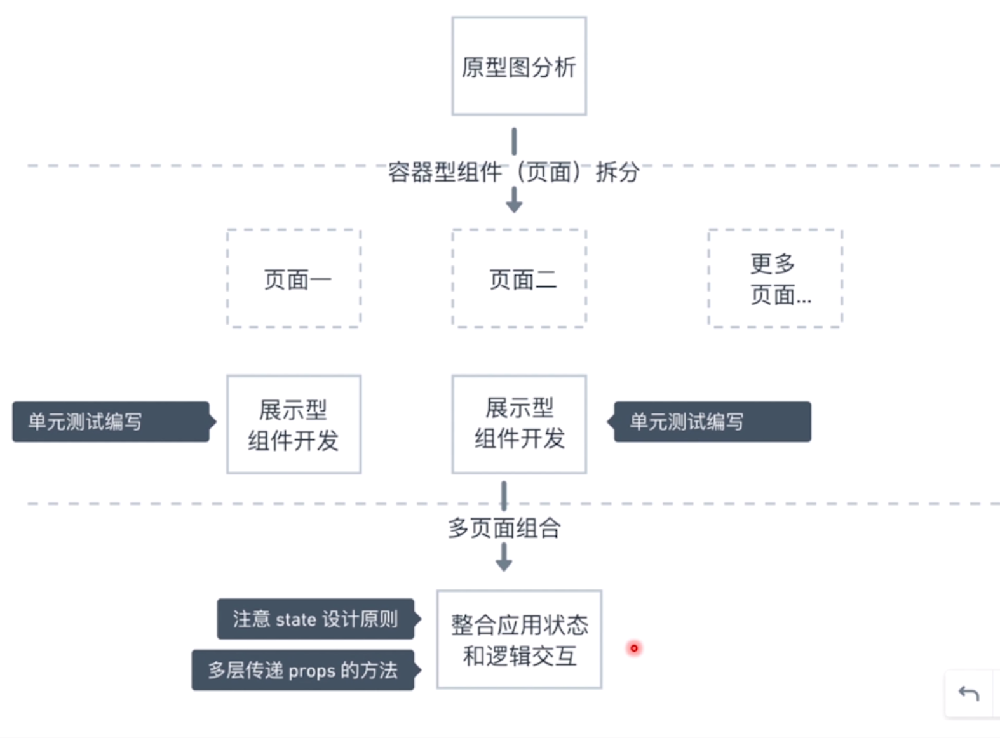
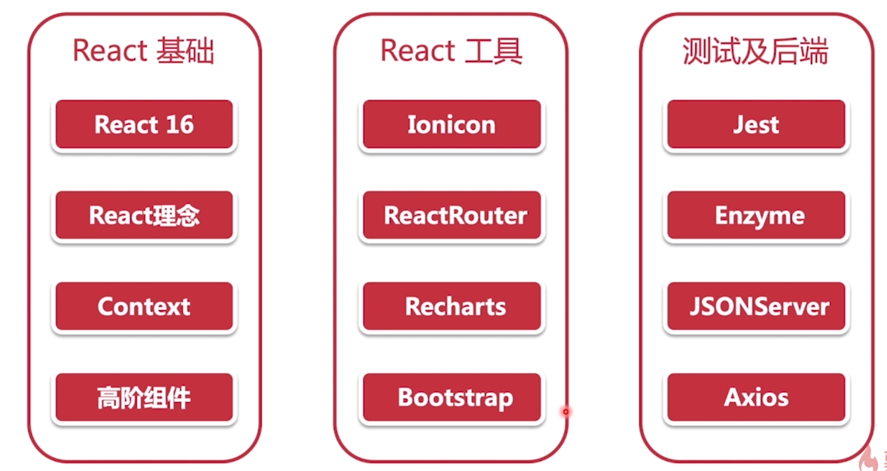

# 第 1 章 课程介绍

[TOC]

## 1-1 课程导读

### 学习 React 的误区

- 基础知识掌握不够牢固
- 没有弄懂 React 独特的数据流和状态管理
- 盲目的学习 React 全家桶，没有弄懂它究竟解决什么问题，从而人云亦云的去学习这些工具，并且也不考虑对于你的项目而言是否适合。（这也是学习之前一定要搞清楚，这个工具大概解决了什么问题）
- 堆积大量逻辑重复的代码（指不断的重复学习，并没有一个实质性的提升，只是提高熟练度）
- 不懂测试，完全没有测试的概念

本课程就是为了解决这些误区，遵循从原型图出发，侧重于页面分析、数据流分析、状态分析、组件测试、前后对接、部署上线的过程。

### 为什么这是个完美的实战项目

- 没有太多重复的逻辑
- 五脏俱全，几乎涵盖了所有的 React 知识
- 可以完美体现 React 理念的开发方式（Thinking-React，React 官方开发指导思想，可以去查看官方的文章）
- 难易度适中，不会轻易产生挫败感

### 课程亮点

- React 理念 - React 应用开发的官方指导思想

- React 状态和数据流分析 - React 真正的精髓（数据流适合使用图形来加以理解）

- React 组件测试 - 为什么需要测试和怎样做（组件化的思想是非常适合测试的）

  - > 在编程世界中，即使是微不足道的错误也可能会花费很多时间。这就是我们进行测试的原因。- [原文](https://baijiahao.baidu.com/s?id=1620078606603592382&wfr=spider&for=pc)

- Mock 环境搭建 - 怎样进行前后端分离开发（前端与后端并行的进行工作内容，所以在前端开发过程中，如何实现与后端接口一样的 Mock 环境就是非常重要的）

- 部署上线 - 怎样从开发环境到线上地址（从而了解开发环境与生产环境的异同）

- 授之以渔 - 不讲重复的逻辑，带动学生自己的学习和动手能力

### 教学流程

单页开发

- 原型图分析 - 分析页面需求从而决定页面的划分
- 组件拆分和实现
- 组件组合和状态分析 - 确定 state 的**最小化组合**并且引出容器型组件与展示型组件的异同
- 数据流交互和最终实现 - 分析容器性组件的交互方法，将交互与展示型组件结合实现最终的版本

单页测试

- 测试工具简介 - 框架 jest 与 React 测试工具 Enzyme
- 展示型组件编写单元测试
- 容器型组件编写集成测试

多页面结合

- React-Router 和 SPA 简介 - 单页面的概念和优势
- 整个应用状态分析和提取
- 使用 Context 整合多页面数据和行为

对接后端及上线

- JSON-Server 打造 Mock 环境
- 使用 Axios 完成异步逻辑
- 使用 Leancloud 完成应用部署

**流程图：**

### 掌握的知识点

### 课程收获

- React 基础知识以及高级概念
- React 应用程序的分析过程和正确的开发理念
- 了解什么是测试，测试为什么重要，React 怎样写测试
- 前后端分离开发的流程是什么，Mock Server 应该怎样搭建
- 可以上手中型 React 应用的开发

### 学习方法

- 全程手写代码
- 通过已经学到的知识解决一些课后练习
- 遇到问题的解决方法
  - 根据之前所学知识和错误提示来判断
  - 使用英文到 google 或者 bing 搜索关键字
  - 课程的问答区域

