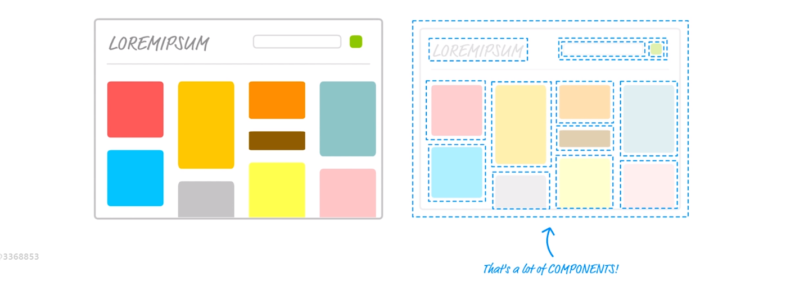

# 2. React 初探

[TOC]

---

## 2.1 React 简介

React 可以认为是一种新的编程思想或者说编程方式。

- React JS 面向网页端，使用 React 语法来编写一些网页端的交互效果。
- React Native 使用 React 语法来编写原生的 App 应用
- React VR/React 360，使用 React 来编写 VR 与 全景应用

React JS 是 **Facebook** 在 2013年 5 月**开源推出**的一款前端框架，带来了**函数式编程**的风格。

React 16 之后的版本称为 **React Fiber**，之所以这样称呼，是因为在 16 版本中，React 底层在时间循环中加入了优先级等概念，可以利用事件循环的一些碎片时间执行一些高优先级的用户交互，提高 React 应用的用户体验。


## 2.2 React 开发环境准备

### 使用 react 的方法

1. 引入 .js 文件
   - 这是一种古老的编码方式，如果项目较大，就会对项目的 js 文件进行拆分，然后页面通过 script 标签加载很多拆分出来的 js 文件。这样的页面性能会比较低，维护性也很差。
2. 使用脚手架工具
   - 脚手架实际上是前端开发过程中的一个**辅助工具**，会自动帮我们构建一个大型项目的开发流程和目录，允许我们以一定的方式来实现 js 文件的相互引用，让我们更方便的进行项目管理。但是，我们在脚手架里写的代码并不能直接运行，需要脚手架工具帮我们做代码的编译，编译的代码才可以被浏览器识别和运行。
   - 一般我们使用 grunt、webpack、gulp 来帮助我们编写脚手架。
   - 脚手架工具有很多，包括很多公司内部都有自己的脚手架工具，但如果是初学者，推荐使用 react 官方所推荐的脚手架工具 create-react-app

### 安装脚手架工具

```
npm install -g create-react-app
```

## 2.3 工程目录文件简介

- `yarn.lock`  - 项目依赖安装包的版本号，这个文件一般不用动

- `README.md` - 项目说明文件，用于介绍项目
- `package.json` - 任何一个脚手架工具里都会有 package.json 这个文件，是 node 包文件的一些说明（也就是现在这个文件夹实际上是 node 的一个包）。会有一些项目的介绍，name 项目名称、version 版本号、private 是否私有、dependencies 依赖包、scripts 指令为我们的调用
- `.gitignore` - 使用 git 时，git 所忽视的文件
- `node_modules` - 放的是项目所依赖的第三方的包、模块，不用动
- `public/favicon.ico` - 浏览器网页标签上的图标
- `public/index.html` - 首页 html 模板
- `<noscript>` 用于当网页无法使用 `<script>` 标签时的提示
- `public/manifest.json` - 是 index.html 文件中的 link 标签所引入的。
- 定义了网页如果是当作一个 app 来使用，就可以作为一个图标快捷方式存储在桌面上，manifest.json 中定义了图标的样式、快捷方式的网址、主机颜色。
- `src/` - src 目录是项目开发时最重要的目录，里面所放的是项目的所有源代码，所有代码的入口在 src/index.js 文件中。
- `src/index.js`整个程序的入口文件，**整个程序是从这个文件开始逐行的执行**。
- 在文件中我们可以看到引入了 'index.css' 文件，在这里我们要谈一下 react。react 的设计理念是 `all in js`，在以前，css 与 js 是相分离的，但在 react 中，css 可以像 js 一样通过模块的形式嵌入到 js 里。


scr/index.js：

```react
import registerServiceWorker from './registerServiceWorker';
```

- 目前前端有一个比较新或者说流行的概念是 **PWA（progressive web application）**，通过写网页的形式来写一些手机的 app 应用。
- 引入这个文件就是通过这个文件来帮助我们实现这个功能。
- 如何使用呢？当完成一个网页以后，把网页上线到一台支持 https 的协议的服务器上，那么我们的网页就会具备这样一个特性：
  - 当用户第一次登陆这个网页时，需要联网才能查看到这个网页，然后之后断网也能看到这个页面。
  - 这是由于 registerServiceWorker 会把我们的网页存储在我们的浏览器内，这样就算你没有网络也能够看到网页。

- `src/App.test.js` 这个文件是自动化测试文件，当我们做 react 或者 vue 项目时，里面会涉及到一些函数式的编程，所以a以做一些自动化的测试。

## 2.4 react 中的组件

组件可以直接理解为页面中因某一特点或某一功能所划分出来的一部分。

看下图：



我们可以将一个大的网页拆分成不同的小的部分，比如

- 标题部分对应一个组件就是标题组件。
- 搜索部分对应一个组件就是搜索组件。这个组件我们还可以进一步的拆分：
  - 一个 input 框
  - 一个 button
- 页面中的内容区域的不同部分也可以拆分成许许多多的小组件

因此，一个页面最终就被拆分成了很多不同的组件。

一个页面很复杂，有的时候我们很难编写，但当我们将其拆分成一个一个小组件时，我们再来维护这些小组件就比较简单了。

这也就是前端组件化的一个概念。

### 一个 react 组件是如何定义的？

```react
import React from 'react'

class App extends React.Component {
  render() {
    return (
      <div className="App">
        Hello World
      </div>
    );
  }
}

export default App;
```

- 通过 class、extends 关键字定义一个 App 类并继承 React.Component 这个类。所以，当一个类继承 React.Component 类时就成为了一个 React 组件。
- return 返回的是什么呢？
  - 我们说组件是页面的一部分，**这部分到底显示什么，显示的样子就是由 render() 函数来定义**，render() 函数 return 什么，那么这个组件就展示什么内容。
- 最后我们通过 `export default App;` 语法将组件导出。

关于导入的一点说明：

 ```react
import {Component} from 'react'
// 等价于
import React from 'react'
const Component = React.Component
 ```

- 但并不是完全是这样，只是 'react' 包是这样的结构，也就是，Component 是 React 的一个属性。

### ReactDOM.render() 在做什么

ReactDOM 是一个第三方的模块，有一个第三方的方法叫做 render()，这个方法可以帮助我们把一个组件**挂载**到某个 DOM 节点上。

### 其他补充

- 当你在页面中使用了 JSX 语法则必须要引入 React，否则无法编译 JSX 语法。

## 2.5 React 中最基础的 JSX 语法

什么是 JSX 语法：

- 我们在 React 项目的 .js 文件中使用 HTML 标签所书写的代码成为 JSX 语法

基础语法特点：

- 可以使用除 html 标签以外的自定义的标签（一般为组件），但注意，在 JSX 中如果要使用自己的组件，则需要使用大写字母开头作为标签的名称。


