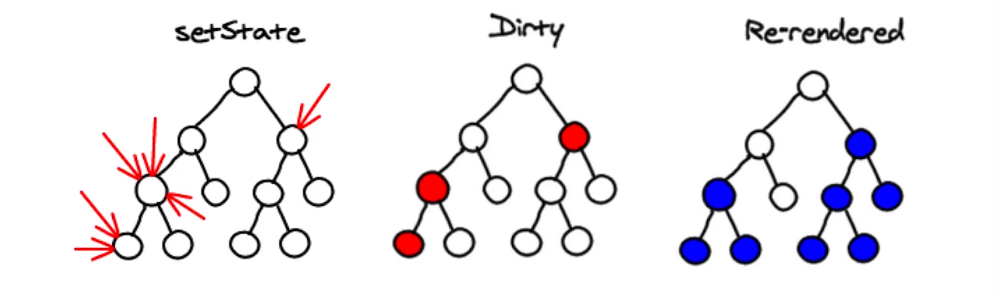
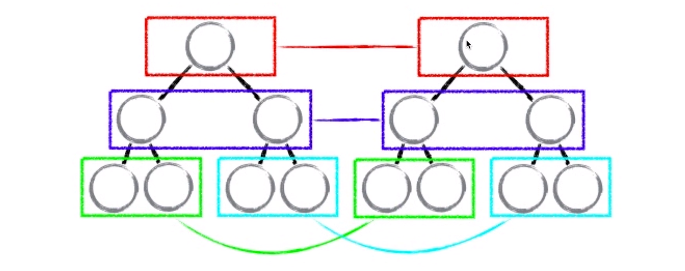
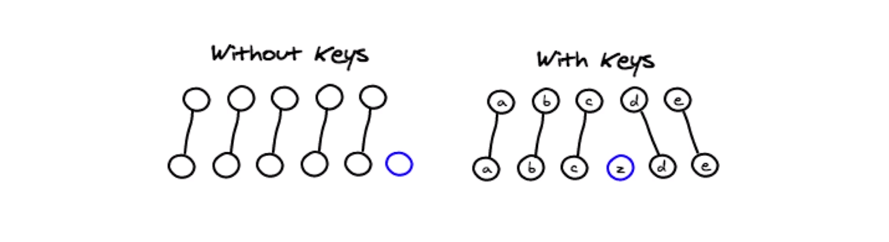
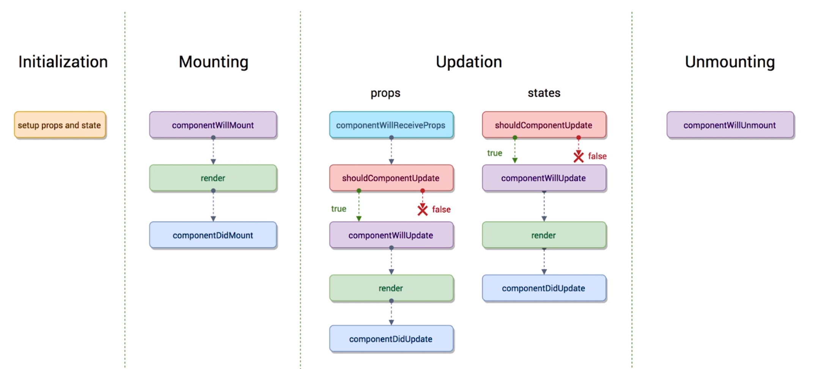
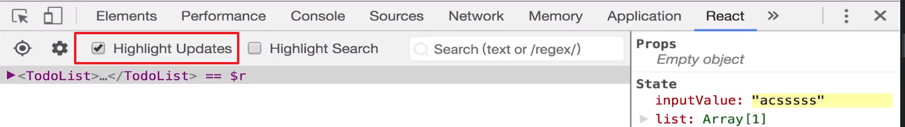

# 4. React 高级内容

[TOC]

---

## 4.1 React developer tools 安装及使用

好处：

- 可以查看组件内的 state 与 props，减少对 console.log 的使用

## 4.2 PropTypes 与 DefaultProps 的应用

### 使用 PropTypes 来检测数据类型：

```react
import PropTypes from 'prop-types'

TodoItem.propTypes = {
  text: PropTypes.string.isRequired,
  content: PropTypes.string,
  handleClick: PropTypes.func,
  index: PropTypes.number,
  name: PropTypes.oneOfType([PropTypes.number, PropTypes.string]) //允许多种数据类型
}
```

1. 引入 'prop-types' 包中的 PropTypes
2. 给组件的 propTypes 属性添加一个对象
3. 对象中的键是需要检验的、props 中的属性，值为 PropTypes 的相应检测属性

#### 为什么使用？

- 开发过程中可能会遇到传入数据类型与预期不同，从而产生的 bug，使用 PropTypes 能够有效的提示你错误的信息，修正 bug。
- 除了提示与预期传值不同以外，还能检测是否传入值，因为有时父组件并没有向子组件传入参数，但可能并不会报错，比如上面代码块中的 `text: PropTypes.string.isRequired`，在后面添加一个 `isRequired` 属性则可以检测是否传入了值。

更多的检测可以去官网文档中查看：

- https://react.docschina.org/docs/typechecking-with-proptypes.html

### 使用 DefaultProps 来设置 props 的默认值：

当父组件没有向子组件传入属性时，使用如下的默认值：

```react
TodoItem.defaultProps = {
  test: 'Hello World'
}
```

不过也可以使用三元操作符在父组件中传入默认值：

```react
<TodoItem test={this.state.test ? this.state.test : 'Hello World'}
```


## 4.3 props，state 与 render 函数的关系

- 数据驱动，数据发生变化页面的内容就会发生变化。
- 当组件的 state 或者 props 发生改变的时候，他自己的 render 函数就会重新执行
- 当父组件的 render 函数被运行时，它的子组件的 render 都将被重新运行

## 4.4 React 中的虚拟 DOM

React 中的组件重新渲染性能非常高，因为引入了一个虚拟 DOM 的概念。虚拟 DOM 只重新渲染需要重新渲染的 DOM。

### 什么是虚拟 DOM？为什么虚拟 DOM 带来了革命性的改变？

先来思考一下，如果没有 React，我们怎么来通过 state 的改变重新渲染页面？

1. 创建 state 数据
2. 创建 HTML 模板
3. 数据 + 模板 结合生成真实的 DOM 来显示
4. state 发生改变
5. 数据 + 模板 结合生成真实的 DOM 来替换原始 DOM

缺陷：

- 第一次生成了一个完整的 DOM 片段，第二次又生成了一个完整的 DOM 片段，第二次的 DOM 替换第一次的 DOM，非常的消耗性能。

改良：

1. 创建 state 数据
2. 创建 HTML 模板
3. 数据 + 模板 结合生成真实的 DOM 来显示
4. state 发生改变
5. 数据 + 模板 结合生成真实的 DOM，并不直接替换原始的 DOM
6. 用新的 DOM（DocumentFragment，文档碎片，在内存中，并没有真实挂载） 与原始 DOM 作比对，找差异
7. 找出 input 框发生了变化
8. 只用新的 DOM 中的 input 元素，替换老的 DOM 中的 input 元素。 

改良后的缺陷：

- 性能的提升并不明显

虚拟 DOM 式改良：

1. 创建 state 数据
2. 创建 HTML 模板
3. 生成虚拟 DOM（**虚拟 DOM就是一个 JS 对象**，用它来描述真实 DOM）
4. 数据 + 模板 结合生成真实的 DOM 来显示。下面模拟一下虚拟 DOM 如何表示真的 DOM。

```jsx
// 原始 DOM 结构
<div id='abc'><span>Hello World</span></div>

// 虚拟 DOM 对象使用数组的大致表示
['div', {id:'abc}, ['span',{},'Hello World']]

// 说明一下：每一个虚拟 DOM 元素如果使用数组来表示，第一项参数为 DOM 元素的名称，第二项为 DOM 元素的属性，第三项为 DOM 元素的内容。
```

5. state 发生变化
6. 生成一个新的虚拟 DOM
7. 比较原始虚拟 DOM 和新的虚拟 DOM 的区别，找到区别是 span 中的内容。
8. 直接操作 DOM 改变 span 中的内容

上面这种改良中，第 3 步生成一个虚拟 DOM，实际上是有性能的损耗的（任何操作都有损耗），但使用 JS 来生成 JS 对象所消耗的性能很低。相比于之前的方法中使用 JS 来生成 DOM 会低很多。因为生成 DOM 所调用的 API 性能损耗大。

所以，在第 6 步与第 7 步中，由于都是对 js 的操作，相比之前性能的提升就很大了。

注意：实际过程中，第 3 步与第 4 步是反过来的（先有虚拟 DOM 再有实际 DOM），由于与前面两种方式的比对而这样写。

## 4.5 深入了解虚拟 DOM

### react 中使用 JSX 生成 DOM 的过程：

JSX -> createElemet -> 虚拟 DOM（JS 对象） -> 真实 DOM

```react
// JSX
<div>item</div>
// JS 的实际代码：
React.createElement('div',{},'item')
```

### 虚拟 DOM 带来的好处：

- 提升了性能
- 使跨端应用得以实现（React Native）
  - 实现原理是，在不同的平台将虚拟 DOM 渲染为那个平台显示内容的容器。比如网页端为 DOM


## 4.6 虚拟 DOM 中的 Diff 算法

Diff 算法的应用：

- 在之前讲解的 React 渲染步骤的第 7 步中会比较改变后的虚拟 DOM 与之前的虚拟 DOM，而这个比对的过程就会使用到 diff 算法。
- diff 算法实际上是在比对和寻找差异
- diff 算法提高了比对性能

渲染图示：



- setSate 异步的原因是，如果在很短的时间内发生了多次 setState，那每一次都重新比对、重新渲染会浪费性能，因此通过异步的方式让它们在同一时期改变状态，然后再比对、渲染会提高性能。

算法图示：



- 算法中比较重要的一项叫做“**同层比对**”，之前与之后的两个虚拟 DOM 会同层的进行比对，如果最上层中比对发现不同，则不会再往下比对，而是重新渲染下面的 DOM。

### 为什么不能使用 index 作为 key 值



如上图，假设我们有 1 个数组，包含 5 个数据，第一次渲染将这 5 个数据映射为 5 个虚拟 DOM 节点生成一个小的虚拟 DOM 树。接着往数组中增加一项内容，由于数据发生了变化，我们会生成一个新的虚拟 DOM 树，然后做两个虚拟 DOM 的比对。

在左图中，由于没有 key 值，节点与节点之间的关系很难的确立，这样会很消耗性能。

在右图中，我们给每个节点一个 key 值（起个名字），由于存在 key 值，比对时就很容易发现前后相同节点的位置。

- 如果使用 index 作为 key 值会有可能造成前后节点中 key 值不同。如下：

```jsx
改变前的数组数据：['a','b','c']
对应的 index： a:0 b:1 c:2
// 删除 'a'
改变后的数组数据：['b','c']
对应的 index： b:0 c:1
// 相同节点下的 key 不同
```

### 那使用上面作为 key 值呢？

- 应该使用稳定的参数作为 key 是最好的

- 可以直接使用数值，比如上面的 'a','b','c'（但会出现相同 key 的情况）
- 如果传过来的数组对象有 id，使用 id 是最好的

## 4.7 React 中 ref 的使用

> ref 是 reference（引用）的简写

ref 属性是可以将这个元素的引用存储在一个变量中，使用：

```react
<input
	ref={(input) => {this.input = input}}
	/>
```

- 需要向 ref 属性传入一个回调函数，回调函数的第一个参数为当前元素的引用，然后通过另一个变量或者使用 this.input 的方式来指向这个引用。
- 这里：this.input 和 绑定事件中的 e.target 相同

> 注意：不推荐使用 ref。（但如果想不出一些办法要用也是可以的啊）
>
> - 在 react 中，推荐我们使用数据驱动的方式来编写我们的代码，尽量不要操作 DOM，使用 ref 就是在获取 DOM 节点，实际上就是在操作 DOM。
>
> - 使用 `ref` 也会遇到各种问题（虽然视频中没有说为什么）
> - 在给一些元素添加动画的时候，可能会不可避免的要使用到 ref 来获取这个元素进行操作。
> - 有时使用 `ref` 和 `this.setState()` 合用时会出现一些坑，DOM 的获取并不及时，所以将获取 DOM 的过程放到 `this.setState()`的第二个回调函数来解决这个问题。

下面是利用 this.setState() 这个方法的第二个参数来解决由于异步而造成的问题：

```react
handleBtnClick = e => {
  this.setState(
    state => ({
      inputValue: '',
      list: [...state.list, state.inputValue]
    }),
    () => {console.log(this.ul.querySelectorAll('li').length)}
  )
}
```

1. this.setState() 方法的第二个参数为一个回调，会在重新渲染页面以后执行。
2. 可以使用 querySelectorAll() 来获取元素的子元素。

> 关于为什么在使用 this.setState 改变 state 时要传入新的值，而不是改变原来的值的问题。
>
> 在`React`中，通过“有变化，就一定返回一个新对象；没变化，原对象不做变化直接返回”的原则，永远可以通过判断“**新旧变量是否对同一内存内容的引用**”来侦测变化，效率上比`deepwatch`高得多。
>
> 来源：https://segmentfault.com/q/1010000003733773


## 4.8 React 的生命周期函数

### 什么叫做生命周期函数？

生命周期函数指在某一个时刻**组件**会**自动调用执行的函数**。比如，每个组件中的 `render()`、`constructor()`

- 注意：是指每一个组件都有的生命周期函数！

### 生命周期图示及详解



- Initialization 初始化时，会设置、加载 props 和 state
- Mounting 挂载 - 组件第一次出现在页面的时候
  - componentWillMount() 组件**即将被挂载到页面的时刻**，自动执行
  - render() 执行后先构建虚拟 DOM，然后再生成实际 DOM 
  - componentDidMount() 组件**被挂载到的页面之后**，自动执行
- Updation 更新 - 当你的 props 或者 states 发生变化时（数据发生变化）
  - props 会比 states 发生变化时多执行一个生命周期函数，先看一下其他的函数：
  - shouldComponentUpdate() 组件被更新之前，自动执行。但要求返回一个 boolean 的返回结果，为什么？
    - 这个函数名：应该更新组件吗？
    - 所以，他是在问你是否更新组件，你需要返回一个 boolean 告诉程序是否应该更新，如果返回 false 则后面的生命周期函数都不会再执行了。
    - 在某些时候你可以利用这个判断来让组件不更新。比如子组件因为其父组件的更新而更新，但子组件本身并没有发生变化时，可以根据其数据是否发生改变来判断是否更新。
  - componentWillUpdate() 组件被更新之前，它会自动执行，但是它在 shouldComponentUpdate() 之后**（16.4 已删除）**
  - render() 执行后先构建虚拟 DOM，比对，生成真实 DOM 更新页面
  - componentDidUpdate() 在更新后执行
  - Props 更新后的 componentWillReceiveProps()，当一个组件从父组件**接受参数**，只要父组件的 render 函数**重新**被执行了，子组件的这个生命周期函数就会被执行。**（16.4 删除）**
    - 一个组件如果没有 props，那么是不会执行这个生命周期函数。
- Unmounting 卸载 -  将组件从这个页面去除时
  - componentWillUnmount() 当这个组件即将被从页面中剔除的时候，会被执行。

## 4.9 React 生命周期函数的使用场景

利用小卡片来每天去过一遍这些生命周期函数（也可以利用这种方式去记忆一些非常重要的东西）

> 除了 render() 以外的其他生命周期函数都可以不用定义，因为在 React.component 这个类中，是没有定义 render 的，所以缺少 render 就会报错（因为到时候会执行 render()）



勾选 React 开发者工具中的 Highlight Updates 以后，当组件重新渲染时就会在组件的周围有提示框的出现。

### 一种性能浪费情况和如何解决这种情况

当父组件的数据发生改变后，重新渲染父组件，此时也会重新渲染其子组件，但如果子组件其实并不需要被重新渲染（因为没有数据或样式发生变化），那么这个时候就是一种性能上的浪费。

利用生命周期函数 shouldComponentUpdate() 的解决办法：

```react
shouldComponentUpdate(nextProps,nextstate){
  if(nextProps.content !== this.props.content){
    return true
  }else{
    return false;
  }
}
```

- 利用当前 props 的值与新的 props 的对比来判断是否更新渲染，从而节省性能。

> 总结一下，目前所使用到的一些性能优化策略：
>
> - 把一些需要使用 bind() 来改变作用域的函数统一放入 constructor() 中，这样的好处是，可以让整个组件中数据绑定的操作只会执行一次。（当然可以使用箭头函数，不过在没有使用脚手架的情况，需要使用 webpack 自己进行配置）
> - 虚拟 DOM、同层比对、key 值比对来提高 React 的性能。
> - 借助 shouldComponentUpdata() 方法来提高组件的性能。

### 在 React 中发送 Ajax 请求该怎么做？

- 如果把 Ajax 请求放到 render() 中，会有一个问题，每当页面 Updata，就会发送请求，而我们的数据只需要请求一次（当然这是一种情况）
- 所以，如果只想请求一次，就可以将异步请求放入 componentDidMount() 中。（这是一种约定）
- 为什么不能放到 componentWillMount() 中？
  - 我的想法是因为组件还没有渲染出来所以你先获得数据，数据并不会将这些新的数据渲染出来。但其实由于是异步的原因，组件应该也会在你获得数据之前就渲染了，所以也可以这样使用。
  - 那其实真正的原因是，如果你使用一些 React 更高级的技术时，比如你使用 React Native 就会有问题，所以，为了避免这些冲突，还是不要写在 componentWillMount() 中比较好。
- 放在 constructor() 中也可以，但放在 componentDidMount() 中，几乎不会有任何的问题。


### 使用 axios 来发送 ajax 请求

- 安装 `npm install axios`

- 使用:

```react
import axios from 'axios'

componentDidMount() {
  axios.get('/api/todolist').then((res)=>{
    this.setState(()=>({
      list: [...res.data]
    }))
  }).catch(()=>{
    console.log('error')
  })
}
```


## 4.10 使用 Charles 实现本地数据 mock（模拟）

下载并安装 https://www.charlesproxy.com/latest-release/download.do

### 为什么要使用 Charles？

因为我们在项目开发中是前后端分离的，也就是数据需要向后台进行请求。但我们在平时的开发过程中，有可能只能在本机上进行开发而缺少能够请求的数据接口。这个时候我们就可以使用 Charles 来帮助我们实现一个数据接口的模拟。

### Charles 的功能

中间代理服务器，抓到我们浏览器向外发送的请求，并对这些请求做一些处理。所以，我们可以将一些请求的指向改变到我们自己的电脑上的文件，从而可以本机模拟一些数据接口。

### 如何使用？

1. 打开软件
2. 打开菜单栏中的 Tools -> Map local... -> add
3. 配置
   


## 4.11 React 中实现 CSS 过度动画

话不多说，看代码：

```react
import React,{Fragment} from 'react'
import './css/animateTest.css'

class AnimateTest extends React.Component {
  state = {
    show: true
  }

  handleToggle = () => {
    this.setState((state)=>({
      show: state.show ? false : true
    }))
  }

  render(){
    return(
      <Fragment>
        <h1 className={this.state.show ? 'show' : 'hide'}>Hello World!</h1>
        <button onClick={this.handleToggle}>点我让上面这个家伙消失</button>
      </Fragment>
    )
  }

}

export default AnimateTest

// css 部分
.show{
  opacity: 1;
  transition: all .3s;
}

.hide{
  opacity: 0;
  transition: all .3s;
}

```

- R18 - 利用三元操作符来判断状态中的值给元素设置不同的类
- R9&R19 - 通过一个事件来改变状态从而改变元素的类
- R31&R36 - 类设置不同的属性，通过 transition 来实现过渡动画

## 4.12 React 中使用 CSS 动画效果

通过`@keyframes` 来定义动画，如下：

```css
@keyframes hide-itme {
  0% {
    opacity: 1;
    color: red;
  }
  50% {
    opacity: .5;
    color: green;
  }
  100% {
    opacity: 0;
    color: blue;
  }
}

.hide {
  animation: hide-item 2s ease-in forwards;  
}

/* 使用 forwards 属性值来保存动画最后一帧的样式
```

使用 css 只能实现一些基本的动画，有些时候还是得使用到 js 来实现一些复杂的动画。

## 4.13-4.14 使用 react-transition-group 实现动画

以上两种使用 css 实现动画的方式比较局限，而使用`react-transition-group`包可以方便实现更加复杂的动画效果。

> 文档地址：https://reactcommunity.org/react-transition-group/

对于之前的动画是通过我们手动来改变`className`来实现的，而使用包则是由`CSSTransition`组件或者`CSSTransitionGroup`组件来帮我们自动改变`className`

### 如何使用？

以 CSSTransition 为例

- 先使用 `yarn add react-transition-group` 安装这个模块

- 然后引入 `import { CSSTransition } from 'react-transition-group';`

- 对**单一节点**使用`CSSTransition`进行包裹，并传入相应的属性来实现相应的效果：

  ```jsx
  <CSSTransition
    in={this.state.isShow} //in 数据用于感知组件状态，当为 true 时表示组件入场，false 为出场
    timeout={300} //动画的执行时间，所对应的就是改变类的时间，所以 transition-time css 属性值和这个值应该是相同的
    classNames={"fade"} //动画过程中添加所添加类名的前缀
    unmountOnExit //当出场动画执行完毕后卸载这个元素，也就是从 DOM 中删除
    appear={true} //第一次加载时也添加入场动画，但是是通过在第一帧添加 fade-appear 类和之后添加 fade-appear-active 来实现的
    onEnter={this.showConsoleLog('OnEnter')} //入场动画第一帧或者说动画开始时的钩子 
    onEntering={this.showConsoleLog('onEntering')} //入场动画第一帧到最后一帧或者说动画进行中的钩子
    onEntered={this.showConsoleLog('onEntered')} //入场动画最后一帧或者说动画结束时的钩子
    onExit={this.showConsoleLog('OnExit')} //出场动画第一帧或者说动画开始时的钩子 
    onExiting={this.showConsoleLog('OnExiting')} //出场动画第一帧到最后一帧或者说动画进行中的钩子
    onExited={this.showConsoleLog('OnExited')} //出场动画最后一帧或者说动画结束时的钩子
    >
  ```

- 最后，添加类名和对应想要实现的动画：

  ```css
  /* fade 为 class 前缀，且为 CSSTransition 组件的 classNames 属性值 */
  /* 当 in 的值从 flase 变为 true 时，也就是入场动画的第一帧所添加的 class */
  .fade-enter, .fade-appear{
    opacity: 0;
    display: block;
  }
  
  /* 从第二帧到入场动画执行完毕所添加的 class */
  .fade-enter-active, .fade-appear-active{
    opacity: 1;
    transition: opacity .3s ease-in;
  }
  
  /* 整个入场动画执行完成后所添加的 class */
  .fade-enter-done{
    opacity: 1;
  }
  
  /* 出场动画的第一帧所添加的 class */
  .fade-exit{
    opacity: 1;
  }
  
  /* 从第二帧到出场动画执行完毕所添加的 class */
  .fade-exit-active{
    opacity: 0;
    transition: opacity .3s ease-in;
  }
  
  /* 整个出场动画执行完成后所添加的 class */
  .fade-exit-done{
    opacity: 0;
    display: none;
  }
  ```

  

### 好处

- 能够很方便的通过`unmountOnExit`实现当出场动画执行完毕后从 DOM 中移除组件
- 能够通过很多钩子函数来处理一些效果，比如可以通过 js 来实现动画。


### 使用 TransitionGroup 组件实现多个元素的动画

就是将一组列表元素放到`TransitionGroup`组件之中，这样就可以通过在`TransitionGroup`中传入一些属性来统一设置子元素的显示并且能够简化列表中每一项的入场与出场动画的实现，代码如下：

```jsx
<TransitionGroup appear>
  {this.state.list.map((item, index) => (
    <CSSTransition
      timeout={300} //动画的执行时间，所对应的就是改变类的时间，所以最好 transition-time 和这个值是相对应的
      classNames={"fade"} //动画过程中添加所添加类名的前缀
      unmountOnExit //当出场动画执行完毕后卸载这个元素，也就是从 DOM 中删除
      key={index}
      >
      <div>
        {index} - {item}
      </div>
    </CSSTransition>
  ))}
</TransitionGroup>
```

- 不需要在`CSSTransition`组件中通过添加`in`来管理入场与出场动画。


