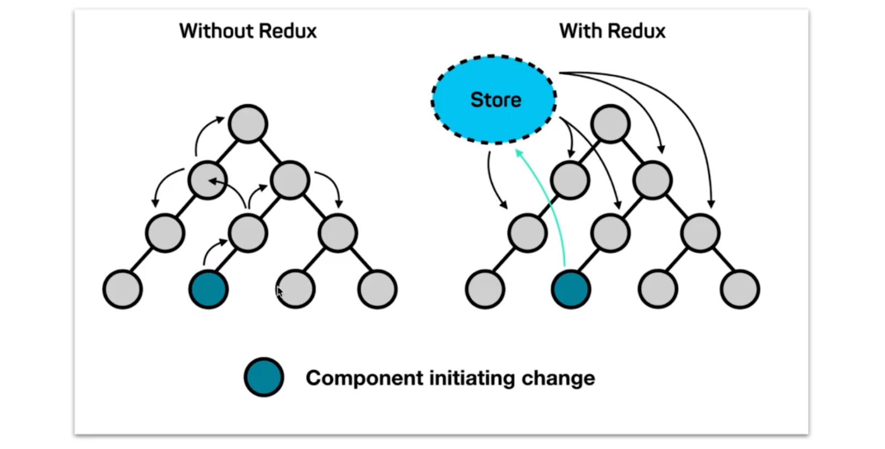
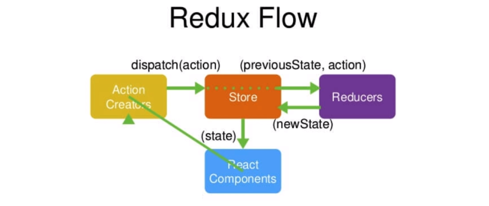

# 5. Redux 入门

[TOC]

## 5.1 Redux 概念简述

### 首先我们需要明白，为什么我们需要使用 Redux？

因为 React 是一个用于构建用户界面的框架，它实际上不负责帮助我们管理数据，所以我们需要 Redux 来帮助我们的管理数据。（当然是在需要使用的时候构才使用，比如当组件之间的关系很复杂的时候）

### 图示：



这里我们还是简单的讲解一下关于使用与不使用 Redux 进行数据通信的过程。

- 左图中没有使用 Redux，我们可以看到，如果我们想要让深蓝色的组件改变数据，则需要我们在深蓝色的组件中调用从父组件传过来的方法来改变其值。如果层级较多，我们就需要传递多次方法，这样会非常的繁琐，维护性很低。
- 而右图中使用了 Redux 的应用，只需要从公共存储区 Store 获取数据和直接改变 Stroe 中的数据即可。并且，当 Store 中数据发生变化时会告诉其他相关组件数据发生了变化，我们可以因此来改变视图层。

### Redux = Reducer + Flux

Flux 是 Facebook 伴随 React 一起发布的一个数据层框架。但其有一些缺点，比如公共数据 Store 可以由很多 Store 所组成。

## 5.2 Redux 的工作流程

### 图示：



如果把整个 Redux Flow 想象成在图书馆借阅图书的流程，那么这个图示中的不同部分及流程可以这样理解：

- React Components - 借书的用户
- Action Creators - 用户借书、还书等想要告诉管理员的所说的话
- Store - 图书管理员
- Reducers - 图书记录本（用于管理员去查找用户所描述的行为）

- 流程：
  - 用户说我们要借一本什么书（话），图书管理员听见这句话后会去图书记录本中寻找这本书，找到这本书后管理员会将书返还给借书人。

### 如果是在代码中，如何理解呢？

- 组件要去获取 Store 中的数据，就会跟 Store 说要获取什么样的数据或者改变或者删除等等（这句话是 Action Creators），但 Store 并不能理解从这句话的意思，所以它需要拿着这个 Action 去 Reducer 中查找这句话的意思，然后根据其意思来传递给你数据。

- > 我的理解是，如果你想要一些对于数据的操作，那么就将这些操作的名称类型定义到 Action 中，并且要在 Reducer 中写下相应类型的实际过程。
  >
  > - Action 负责数据的传递和创建一个动作的名称。
  > - Reducer 负责判断动作并将传递过来的数据在 Store 中进行操作。（当然也存在没有数据的情况）

## 5.3 使用 Antd 实现 TodoList 页面布局

Antd 中继承了很多带有样式和漂亮的组件。

我们会使用到的 Antd 的组件：

- Input
- Button
- List


## 5.4 创建 redux 中的 store

```jsx
import {createStore} from 'redux'
import reducer from './reducers'

const store = createStore(reducer)

// reducer
const defaultState = {
  inputValue: '',
  list: []
}

export default (state = defaultState, action) => {
  return state;
}

// 在组件中引入使用
import store from './store'

class TodoList extends React.Component {
  state = store.getState()
}
```

- 需要传入一个 Reducer（笔记本）来初始化数据，也就是告诉 Store 我们到底有哪些数据并且告诉我们如何去管理这些数据。
- Reducer 是一个函数，接受两个参数，一个是初始状态 state，一个是 action
- 可以使用 `store.getState()` 方法来获取 store 中的状态
- 可以在任何组件中去导入这个 store


## 5.5 Action 和 Reducer 的编写

### 使用 chrome 中 Redux 的开发者工具

- 在 chrome store 中安装插件

- 然后在使用 creactStore 创建 Store 的地方传入一个新的参数，如下：

  ```jsx
  const store = createStore(
    reducer,
    // 如果 window 下有这个属性就执行这个方法
    window.__REDUX_DEVTOOLS_EXTENSION__ && window.__REDUX_DEVTOOLS_EXTENSION__()
  )
  ```

### 编写 Action 和 Reducer

```jsx
const action = {
  	  type: 'CHANGE_INPUI_VALUE',
  	  value: e.target.value
}

// reducer
// reducer 可以接受 state，但是绝不能修改 state，所以就需要使用拷贝（其中一个原因好像是他需要将原始数据与新数据进行比对吧）
export default (state = defaultState, action) => {
  if(action.type === 'CHANGE_INPUI_VALUE'){
    // 对数据进行一次深拷贝
    const newState = JSON.parse(JSON.stringify(state))
    newState.inputValue = action.value
    return newState;
  }
  return state;
}

// 在 constructor() 中使用 store.subscribe() 来订阅：当分派任务改变 store 时执行一些步骤，当然主要是调用 this.setState() 改变组件状态从而改变界面
constructor(props){
  supper(props)
  store.subscribe( () => {
		this.setState(store.getState())
	} )
}

// 通过事件触发回调时调用 store.dispatch()
handleInputChange = (e) => {
  const action = {
    type: 'CHANGE_INPUT_VALUE',
    value: e.target.value
  }
  store.dispatch(action)
}
```

- > 讲师建议将 todoList 这个项目自己实现 5 次以上，这样你才能快速的反应出使用 Redux 的步骤，要不你后面的课程就可能跟不上啦。（不过我基本上都没什么问题啦）

## 5.6 使用 Redux 完成 TodoList 删除功能

```jsx
case 'DELETE_TODO_ITEM':{
  // 第一种方式
  const newState = JSON.parse(JSON.stringify(state))
  newState.list.splice(action.index,1)
  return newState
  // 第二种方式
  const newState = [...state.list]
  newState.splice(action.index,1)
  return {
    ...state,
    list : newState
  }
}
```

- 技巧：使用 `[...state.list].splice(action.index,1)` 可以选择列表中的一项省下来而不是删除那一项

## 5.7 ActionTypes 的拆分

### 一种容易出现错误的情况与解决方案：

在写 action.type 的属性值时，或者在 reducer 中对 action.type 进行判断时，如果出现拼写错误，那么就会发现功能的失效并且毫无提示信息。比如：

```jsx
const action = {
  type: 'CHANGE_INPUT_VALUE'
}

// reducer 中的 action.type 所判断的值拼写错误
const reducer = (state,action) => {
  if(action.type === 'CHANGE_INPVT_VALUE') return ...
}
```

解决方法：

- 在一个单独的 js 文件中声明定义并导出一些常量来存储 type 的字符串值，在一些创建 action 的地方使用这些常量，一旦发生拼写错误就会报错。

  ```jsx
  export const CHANGE_INPUT_VALUE = 'CHANGE_INPUT_VALUE'
  export const ADD_ITEM = 'ADD_ITEM'
  export const DELETE_TODO_ITEM = 'DELETE_TODO_ITEM'
  ```


## 5.8 使用 actionCreator 统一创建 action

Action 实际上不能像我们之前那样在组件中直接声明定义，这样的方式虽然是允许的，但是不利于管理。所以，我们将在同一个地方对 action 进行统一的管理和定义，并通过 actionCreator 来创建它。

```jsx
export const CHANGE_INPUT_VALUE = 'CHANGE_INPUT_VALUE'
export const ADD_ITEM = 'ADD_ITEM'
export const DELETE_TODO_ITEM = 'DELETE_TODO_ITEM'

export const getInputValueAction = (value) => ({
  type: CHANGE_INPUT_VALUE,
  value
})

export const getDeleteItemAction = (index) => ({
  type: DELETE_TODO_ITEM,
  index
})

export const getAddItemAction = () => ({
  type: ADD_ITEM
})
```


## 5.9 Redux 知识点复习补充

### Redux 设计和使用的三项原则

1. store 是唯一的（整个 App 都使用这一个 store）
2. 只有 store 能够改变自己的内容（虽然表面上是 reducer 在改变 state，但 reducer 是返回了 state，让 store 进行了更新）s
3. Reducer 必须是纯函数（纯函数：给固定的输入，返回固定的输出；不会有其他副作用）

### 核心 API

- `createStore()` - 创建 store
- `store.dispatch()` - 用于向 store 派发 action
- `store.getState()` - 用于获取 store 中的内容
- `store.subscribe()` - 订阅 store 的改变，从而执行向其传入的回调函数 