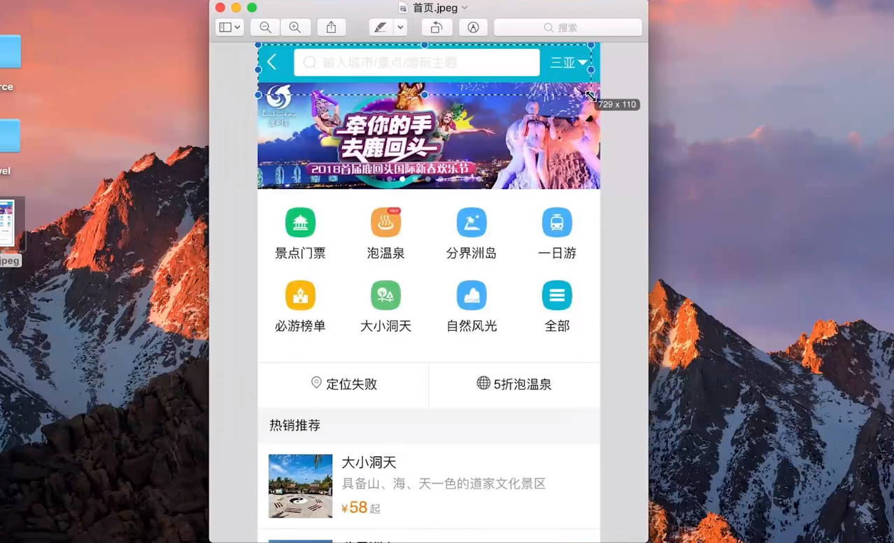
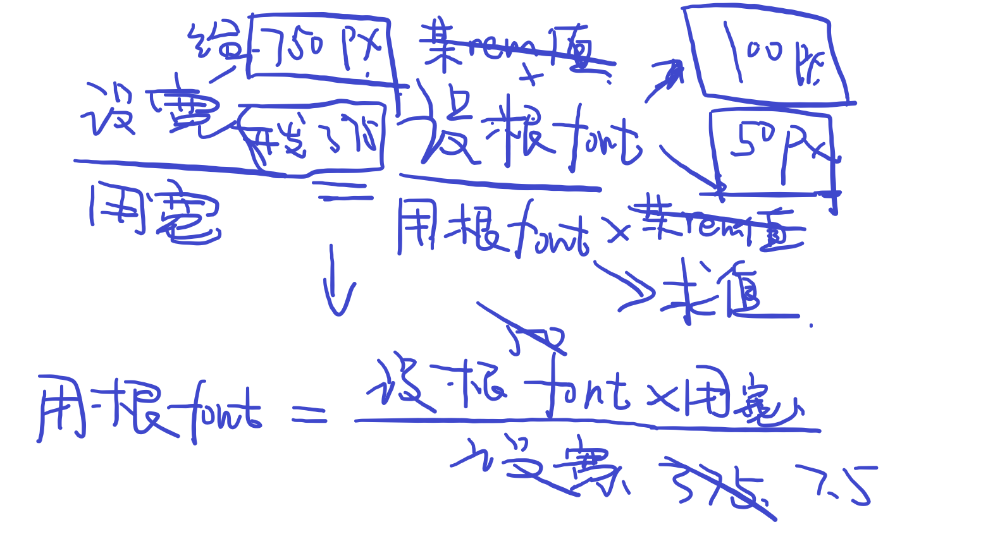
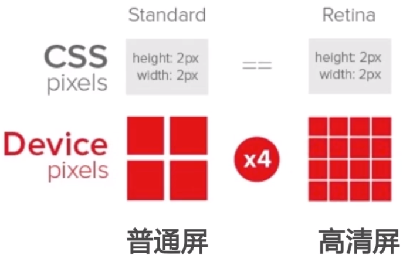
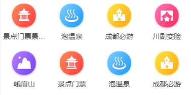
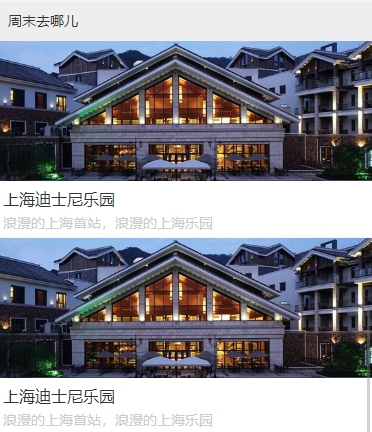

# 7.第7章 项目实战 - 旅游网站首页开发

[TOC]

## 7-1 Vue项目首页 - header区域开发

首页 UI 图：



- 宽度是 750px，这是一张以 iphone 为基础做的 2 倍图设计稿，因此在开发的时候也会以 2 倍图来制作。


### 使用 stylus 作为 css 的预编译器

stylus 与 less、sass 相同，可以让我们使用变量、mixin、嵌套等扩展形式来方便、快速编写 css 代码。

首先，需要安装几个依赖包：

- stylus
- stylus-loader


### 编写 Home 页面

我们将 Home 组件作为一个容器组件来组装一些更小的组件从而形式一个更大的组件，并且在这里，Home 也是一个页面。

这些小的组件可以放到 Home 文件夹下的 components 文件夹中。

接着，我们在 components 中的创建一个 Header 组件，取名为 Header.vue：

```html
<template lang="">
  <div>
    HomeHeader
  </div>
</template>

<script>
export default {
  name: 'HomeHeader'
}
</script>

<style>

</style>

```

然后，我们在 Home 组件中引入并使用 Header 组件。如下：

```html
<template lang="">
  <div>
    <home-header></home-header>
  </div>
</template>

<script>
import HomeHeader from './components/Header.vue'
export default {
  name: 'Home',
  components: {
    HomeHeader
  }
}
</script>

<style>
</style>
```

- 引入要在 script 标签内
- 在 Home 组件的选项中添加一个 components 属性来添加一个局部组件
- 在 template 中需要使用 kebab-case 的方式来引入组件


### 实现 header 样式

template 结构：

```html
<template>
  <div class="header">
    <div class="header-left">返回</div>
    <div class="header-input">输入城市/景点/游玩主题</div>
    <div class="header-right">城市</div>
  </div>
</template>
```

样式结构：

```html
<style lang="stylus" scoped>
.header {
  display: flex;
  line-height: 0.86rem;
  background-color: #00bcd4;
  color: #fff;
<!-- ... -->
}
</style>
```

- 使用的 css 预处理器是 stylus，它是由 node.js 编译的。
- 使用 scoped 可以让这些规则添加一些特性选择器并且给标签中也会添加相应的特性，从而将 css 分隔开不会互相影响。
- 注意，我们的长度单位和字体大小单位是使用 rem 为单位，下面会单独讲这一块的内容


### 关于使用 rem 单位的相关问题

为什么使用 rem，原因在于我们需要使不同的设备在页面显示的整体效果上大致相同。

比如宽度为 750px 的手机和宽度为 375px 的手机的比例关系为 1:1，对应的，如果 750px 手机的其中一个块的高度为 100px ，那么 375px 手机的相同块的高度应该为 50px，这样才会使两者的显示效果大致相同。

好，那么如何才能在程序上实现这一点呢？

首先我们要知道一点，rem 的单位的值最终会转换为 px 的单位，但其转换是基于根元素（html）的字体大小为准，转换方式是以现在 rem 单位的值乘以根字体大小的 px 值。比如 0.86rem 的高度和 50px 的根字体大小转换为 px，则为 0.86 *50 = 43px。

那么，既然页面中元素的显示是基于根字体大小，那获取用户设备相应的根字体大小就能决定整个页面的显示。

还有，页面的显示效果是基于设计师给的设计稿，而设计稿是基于某个设备的宽度来设计的，因此可以利用设计师给的设备宽度与用于设备宽度之比等于设计师设备根字体大小与用户设备根字体大小这个等式，从而求出用户根字体大小。如下图：



这里需要讲解几个点：

- 在我们开发的这个项目中，设计师是基于 iphone6 的宽度，也就是 750px，而需要注意的是，这个 750px 并不是开发所使用的**设备独立像素（device-independent pixel）**，而是**物理像素值（physical pixel）**。因为 css 所使用的 px 单位值是会转换为设备独立像素而非物理像素值，而 iphone6 是高清屏，其真实像素也就是所谓的物理像素值是开发时所使用的设备独立像素值的两倍，计算公式如下：

  - 当前浏览器宽度 （设备独立像素）* 设备像素比 = 屏幕像素值（物理像素值）

  - 因此，设计师给的 750px，在我们开发时其实为 375px，只是当显示在设备上时，会自动转换为屏幕像素值，在像素点上放大了一倍，可以看下图：

    

  - 那么，我们就得在开发时注意将所有设计师给的长度值或者字体大小值 /2 来设置。

- 在此基础上，我们来看我上面画的草图，可以看到我们给的根字体大小为 50px，是因为这样更方便于我们进行设置，原因是这样的：比如，现在设计师图上有一个高度位 86px 的块，那么其浏览器高度 （设备独立像素）则应该为其一半的 43px，为了让设置参数时方便，那么设计师的 86px，我们就直接设置为 0.86rem，只需要简单的除以 100 就可以了，那需要根字体大小为多少呢？

  - 假设根字体大小为 X，公式为：X * 0.86rem = 43px（设备独立像素）
  - 所以根字体大小为 50px

- 好了，剩下的就是简单的把这些数值带进之前的那个比例公式中，就能得出代码如下：

```js
document.documentElement.style.fontSize = document.documentElement.clientWidth / 7.5 + 'px'
```

- 最后还是稍微补充一下第一排公式右侧的内容：
  - 设备某元素高（设备根字体大小 x 设置的相同 rem 值）/ 用户某设备元素高（用户根字体大小 x 设置的相同的 rem 值）


## 7-2 Vue项目首页 - iconfont 的使用和代码优化

### 使用 iconfont

1. 去 iconfont 选择一些需要使用的矢量图标并添加到购物车 -> 添加到项目 -> 下载

2. 由于我们是使用 css 的方式通过 `@font-face` 来引入图标字体，因此需要引入字体文件，将字体文件放入 iconfont 文件夹，然后将 iconfont.css 文件放入 styles 中，最后修改一下 css 中的路径和删除自动帮我们生成的一些类，因为我们可以通过字符编码来引用，并不需要这些类

3. 在 main.js 中引入 iconfont.css

4. 在 Header.vue 中建立一个 span 标签，通过添加`iconfont`类来引入 iconfont 字体，然后去 iconfont 网站的项目中复制你要使用的字体图标的字符编码，使用如下：

   ```html
   <div class="header-left">
     <span class="iconfont">&#xe624;</span>
   </div>
   ```


### 两个 inline 元素之间的距离问题

```html
<div class="header-right">城市
  <span class="iconfont arrow-icon">&#xe64a;</span>
</div>
```

一个 div 中，有内容「城市」与一个 span 图标，现在之间的距离太远，想要挨得近一些，可以使用 margin 给负值：

```css
.arrow-icon {
  margin-left -0.08rem
  font-size: 0.24rem;
}
```

如果想远一点则给正值就行。


### 将相同的颜色提出来放入变量中

如标题，这样的好处是如果整个应用的颜色主题发生改变，我们只需要改变其变量的值就可以让整个应用都改变。

1. 在 styles 文件夹中创建 `variables.styl` 文件存放 stylus 的全局变量，然后添加一个变量并设置值

   ```stylus
   $bgColor = #00bcd4
   ```

2. 然后在 Header.vue 中的 styles 部分引入

   ```stylus
   @import '../../../styles/variables.styl'; 
   
   background-color: $bgColor;
   ```

3. 由于引入的相对路径太长，因此在 webpack.base.conf.js 中的 resolve 字段下的 alias 属性中添加一个别名来使用，使引入更加方便：

   ```js
   resolve: {
       extensions: ['.js', '.vue', '.json'],
       alias: {
         'vue$': 'vue/dist/vue.esm.js',
         '@': resolve('src'),
         'styles': resolve('src/styles')
       }
     },
   ```

4. 重新引入：

   ```stylus
   @import '~styles/variables.styl'; 
   ```

   - 需要注意，在 css 部分通过 @import 关键字所引入的路径使用 alias 时需要在前面加上 `~`符，原因在于，如果不添加`~`符则相当于是引入相对路径而非 webpack 所定义的路径。

     > 资料来源于 npm 上的 [less-loader](https://www.npmjs.com/package/less-loader)

5. 同样，我们可以在其他引入 `styles`目录的地方，使用 alias，比如 main.js 中：

   ```js
   import 'styles/reset.css'
   import 'styles/border.css'
   import 'styles/iconfont.css'
   ```

   - 不同于 css 中的引入，我们不需要添加 `~`符


## 7-3 Vue项目首页 - 首页轮播图

### 创建分支

因为在实际的项目开发过程中，每有一个新的功能就需要创建一个分支，然后在这个分支上进行开发。等这个分支上的任务结束后，就会将这个分支合并到主分支上。

这里讲师采取的创建分支的方式是通过在码云上的项目中进行添加分支的操作，然后拉取到本地，接着通过 `git checkout index-swiper` 命令让项目跳转到 `index-swiper` 分支。

### 使用 vue-awesome-swiper 制作轮播

安装老版本的 vue-awesome-swiper：

```shell
npm i vue-awesome-swiper@2.6.7
```

由于整个项目中的很多部分都需要还是用到轮播，所以在全局引入，官方代码：

```js
import Vue from 'vue'
import VueAwesomeSwiper from 'vue-awesome-swiper'

// require styles
import 'swiper/dist/css/swiper.css'

Vue.use(VueAwesomeSwiper, /* { default global options } */)
```

具体使用：

1. 在 Home/components 文件夹中创建一个 Swiper.vue 的组件文件

2. 然后可以去官方文档中查看 SPA 部分的实例代码，引入 html 结构，大概如下：

   ```html
   <template>
     <swiper :options="swiperOption" ref="mySwiper" @someSwiperEvent="callback">
       <!-- slides -->
       <swiper-slide>I'm Slide 1</swiper-slide>
       <swiper-slide>I'm Slide 2</swiper-slide>
       <swiper-slide>I'm Slide 3</swiper-slide>
       <swiper-slide>I'm Slide 4</swiper-slide>
       <swiper-slide>I'm Slide 5</swiper-slide>
       <swiper-slide>I'm Slide 6</swiper-slide>
       <swiper-slide>I'm Slide 7</swiper-slide>
       <!-- Optional controls -->
       <div class="swiper-pagination"  slot="pagination"></div>
       <div class="swiper-button-prev" slot="button-prev"></div>
       <div class="swiper-button-next" slot="button-next"></div>
       <div class="swiper-scrollbar"   slot="scrollbar"></div>
     </swiper>
   </template>
   ```

   - `<swiper-slide>`是每一个单独的 轮播图 或者说是 滑动块
   - `div.swiper-pagination`是用于添加页码
   - `div.swiper-button-prev`和`div.swiper-button-next`是用于添加左右按钮
   - `div.swiper-scrollbar`是滚动条

3. 由于`<swiper-slide>`是重复的因此可以使用 `v-for`来进行循环，并且我们只需要`div.swiper-pagination`部分：

   ```html
   <template>
     <div class="wrapper">
       <swiper :options="swiperOption">
         <!-- slides -->
         <swiper-slide v-for="item of swiperList" :key="item.id">
           
         </swiper-slide>
         <!-- Optional controls -->
         <div
           class="swiper-pagination"
           slot="pagination"
         ></div>
       </swiper>
     </div>
   </template>
   ```

   - 首先应该注意需要添加`:key`，然后如果是使用变量或者属性值则需要使用`:`来绑定

   - `div.wrapper`是用于给整个轮播添加高度和对子元素设置一些样式，如下：

     ```css
     <style lang="stylus" scoped>
     .wrapper >>> .swiper-pagination-bullet-active {
       background: #fff;
     }
     
     .wrapper {
       overflow: hidden;
       height: 2rem;
     }
     
     .swiper-image {
       width: 100%;
     }
     </style>
     ```

     - 由于我们需要给`.swiper-pagination-bullet-active`类的元素设置样式，但是如果单独在 `scoped`下设置则会将其变为特性选择如：`.swiper-pagination-bullet-active[data-v-1a2e1f3a]`，而我们不想其为特性选择器，那么就可以使用`>>>`操作符，如上。
     - 需要给整个轮播一个高度，否则会出现一个问题，就是出现整个页面在加载过慢时会抖动（比如在控制台的 Network 选项中可以设置为 3G 网络来看到这个效果）

4. 最后是 script 部分：

   ```js
   export default {
     name: 'HomeSwiper',
     data () {
       return {
         swiperOption: {
           pagination: '.swiper-pagination',
           loop: true
         },
         swiperList: [
           {
             id: '001',
             imgUrl:
               'http://img1.qunarzz.com/piao/fusion/1812/d6/daa880b254940402.jpg_750x200_b114308a.jpg'
           },
           {
             id: '002',
             imgUrl:
               'http://img1.qunarzz.com/piao/fusion/1901/81/f65f67c168e5f102.jpg_750x200_2ec00db3.jpg'
           },
           //...
         ]
       }
     }
   }
   ```

   - 在组件中使用 data 需要以函数的形式返回一个对象
   - `swiperOption` 属性是 swiper 的设置属性
     - `pagination`是告诉 swiper 哪个元素是标签页
     - `loop`是可以让轮播循环
   - 然后添加了一个 swiperList 的属性用于循环出多个`<swiper-slide>`


### 合并分支

当我们的分支上的开发完成没有问题后，我们就需要将这个分支合并到我们的主分支上。

1. 先提交代码：`git add .` -> `git commit -m ‘change’` -> `git push`
2. 切换到主分支：`git checkout master`
3. 将目标分支合并到当前主分支：`git merge index-swiper` 或者 `git merge origin/index-swiper`
4. 最后记得再提交：`git push`

> 上面是通过命令行来进行的操作，也可以通过 Github Desktop 或者 VSC 都可以。
>
> - 记得合并时要先切换到主分支上


## 7-4 Vue项目首页 - 图标区域页面布局

在码云上创建分支 ：index-icon

### UI 部分



### 代码部分

还是一样创建一个 Icons.vue 组件，然后添加一些 html 和 css，如下

```html
<template>
  <div class="wrapper">
    <div class="icon">
      <div class="icon-img">
        
      </div>
      <p class="keywords">景点门票</p>
    </div>
  </div>
</template>
```

```stylus
.wrapper {
  background-color: blue;
  height: 0;
  padding-bottom: 50%;
}

.icon {
  height: 1.85rem;
  width: 25%;
  box-sizing: border-box;
  padding-top: 0.1rem;
  background-color: #fff;
}

.icon-img {
  height: 1.1rem;
  text-align: center;

  .icon-img-content {
    height: 1.1rem;
  }
}

.keywords {
  text-align: center;
  margin-top: 0.1rem;
  font-size: 0.28rem;
  color: $textColorDark;
}
```

- img 的本身是一个 inline 元素，所以如果让其有一个更好的显示效果，最好是给包裹一个元素，这样能更方便的居中和设置大小。
- 注意 .wrapper 部分的 css，使用了一个技巧，如何设置一个宽：高 = 2:1 的盒子呢？如果只是将高设置为 50%，其实是不正确的，因为高的 50% 指的是其父元素高的 50%，而这里使用了 padding-bottom：50% 和 height 0，原理是 pt 的 50% 为父元素宽度的 50%，所以就能有一个 2:1 的效果。
  - 但这里其实做了一件很奇怪的事情，因为实际盒子的内容高是 0，盒子的内容就显示在了 padding 上，这很不符合直觉。并且会有一些问题，你没法使用 padding 来让内容和盒子之间产生距离，你只能通过绝对定位或者 translate 让内容元素移动从而达到一个和盒子之间产生距离的效果。所以，我个人是不太推荐使用这样的方式的，只是为了说明有这样的技巧而放在这里，其实可以直接设置一个 height 就好了，因为设计师已经给了你具体的高度。
  - 其实 .icon 这个元素讲师也是使用了 padding 的方式来实现高度是其父元素宽度的 25%，这样就可以出现一个正方形，我并没有这样做，我是直接设置了一个 height，主要的原因是因为我需要使用到 padding 来实现一些效果。


## 7-5 Vue项目首页 - 图标区域逻辑实现

> 插播一个内容：之前一直在被 ESlint 提示，所以就去找了一下关于如何配置 vscode 的自动格式化，可以去这个地址看看：[VSC配置--自动格式化ESLint](https://www.jianshu.com/p/dc799008bc68)

### 制作轮播

总体上很简单，只需要引入 swiper 就好，但这里需要考虑一个问题，如果将一个可以滑动的块称为 swiper-slide 的话，swiper-slide 的数量取决于有多少个 icons-item，因为一个 swiper-slide 会有 8 个 icons-item，所以需要对 iconList 数据做一个处理来返回一个数组，大致代码如下：

```js
export default {
  name: 'HomeIcons',
  data: function () {
    return {
      iconList: [
        {
          id: '001',
          text: '景点门票景点门票景点门票景点门票',
          imgUrl: 'http://img1.qunarzz.com/piao/fusion/1803/95/f3dd6c383aeb3b02.png'
        },
        //... 还有 9 个对象
      ]
    }
  },
  computed: {
    pages: function () {
      const pages = []
      this.iconList.forEach((item, index) => {
        let page = Math.floor(index / 8)
        if (!pages[page]) {
          pages[page] = []
        }
        pages[page].push(item)
      })
      return pages
    }
  }
}
```

- 首先要明白一个思路，我们需要多个 swiper-slide 就需要一个用于循环 swiper-slide 的数组，而这个数组是通过 iconList 中的数据来获得的，如上的逻辑，并且 pages 中的 page 也是一个数组用于循环出多个 icon-item。

  > 这部分的处理分页的逻辑可以用于很多地方，可以仔细去思考一下关于这部分的数学问题。

```html
<template>
  <div class="wrapper">
    <swiper>
      <swiper-slide v-for="(page,index) of pages" :key="index">
        <div class="icon" v-for="item of page" :key="item.id">
          <div class="icon-img">
            
          </div>
          <p class="keywords">{{item.text}}</p>
        </div>
      </swiper-slide>
    </swiper>
  </div>
</template>
```

- html 部分就是如上这样，需要注意有两个 `v-for`
- 注意在浏览器控制台中查看元素时，不会存在`<swiper-slide>`这样的标签，一旦存在就说明有问题。


### 文本超出一定范围的省略号和 mixin 的使用

在 styles 文件夹中创建一个 mixins.styl 来存在一些混合的属性，比如这里用于超出文本出现省略号：

```stylus
ellipsis()
  overflow hidden
  white-space nowrap
  text-overflow ellipsis
```

然后在组件中引入并使用：

```stylus
@import '~styles/mixins.styl'

.keywords
  text-align center
  margin-top 0.1rem
  font-size 0.28rem
  color $textColorDark
  ellipsis()
```


OK


提交并切换在 master 主分支合并

。。。不过我忘记之前在 icons 分支上进行操作了。。所以记得先切换到相应的分支再编写代码

不过，有两个办法可以弥补

- 第一切换到 icons 分支上之后 merge 主分支的内容
- 第二是删除 icons 分支之后重新创建一个 icons 分支，这样就可以让 icons 分支也能有最新的代码


## 7-6 Vue项目首页 - 热销推荐组件开发

码云上创建新的分支：index-recommend

### 代码部分

说明两个地方，其他的和之前差不多。

实现如下 UI：


代码如下：

```stylus
.item
  display flex
  height 1.9rem

  .item-img
    width 1.7rem
    height 1.7rem
    padding 0.1rem

  .item-info
    flex 1
    padding 0.1rem
    min-width 0 // 黑科技：保证内容不超出外层容器

  .item-title
    line-height 0.54rem
    font-size 0.32rem
    ellipsis()

  .item-desc
    line-height 0.4rem
    color #cccccc
    ellipsis()
```

- 当使用 flex 布局时，右边的 div 不会跑到下面去，因为其子元素会成为 flex 元素，则不是 block，就不需要换行。
- 然后第二点是让标题或者描述的文字超过整个宽度后显示 ...，但是需要设置一个宽度，这里使用的是 `min-width 0` 我使用 width 0 也是可以的，因为给了 `flex 1`，会自动让其 width 变为剩下宽度的

html 部分代码：

```html
      <li class="item border-bottom" v-for="item of recommendList" :key="item.id">
        
```

- 使用了之前兼容不同的高清屏而引入的 border.css 中的 border-bottom 类，它会根据媒体查询来获取不同的屏幕从而让显示效果出现相同的 border

## 7-7 Vue 项目首页 - 开发周末游组

### UI 部分



### 代码部分

对于图片依然使用了 `height:0;padding-bottom:37.4375%`的方式：

```stylus
.item-img-wrapper
  overflow hidden
  width 100%
  height 0
  padding-bottom 37.4375%

  .item-img
    width 100%
```

- 虽然我觉得这样的方法真的不是很好，但是对于一张图片，如果你知道其高宽之比，那么你可以直接通过计算高宽度比来设置其父容器的大小来包裹它，至少这样在任何设备上都没有问题。当然，你也可以计算出在 750 屏幕上是显示高度来设置，基本上也是一样的。。。


提交代码吧


## 7-8 Vue 项目首页 - 使用 axios 发送 ajax 请求

新的分支：index-ajax

### axios

在 vue 中发送 ajax 的工具其实有很多，比如：

- 浏览器自带的 API fetch
- 也可以使用 vue 推荐的 vue-resource
- 如今（截止这个课程的时间）vue 官方推荐的 axios 的第三方模块
  - axios 可以实现跨平台的数据请求，比如在浏览器端可以帮助你发送 xhr，在 node 服务器可以帮助你发送 http 请求

因此，我们使用 axios 来发送 ajax 请求

安装：

```shell
npm i axios
```


### 代码部分

对于我们项目目前的情况，需要请求很多数据，好几个组件都需要一组数据来渲染，但如果每一次组件都单独发一次 ajax 请求相比于只发一次请求而言肯定性能要差一些，所以我们在 Home 页面组件中发一次 ajax 请求就行了。

在 vue 的组件中，发送 ajax 最好的钩子函数是 mounted，也就是组件已经挂载到页面之后。代码如下：

```js
import axios from 'axios'

export default {
  name: 'Home',
  components: {
    HomeHeader,
    HomeSwiper,
    HomeIcons,
    HomeRecommend,
    HomeWeekend
  },
  mounted () {
    this.getHomeInfo()
  },
  methods: {
    getHomeInfo () {
      axios.get('/api/index.json')
        .then((res)=>{
          console.log(res)
        })
    }
  }
}	
```

但是，现在并没有一个服务器可以让我们请求数据，所以需要使用模拟数据。

在 vue 的脚手架工具所创建的项目中存在一个 static 目录，这个目录允许我们在本地用于开发的服务器上进行访问，比如我们在 static 目录中创建一个 mock 文件夹，然后在这个文件夹中创建一些模拟的 json 数据，如 index.json，然后我们就可以对这个路径上的资源进行访问了。如下：

```js
axios.get('/static/mock/index.json')
```

当然你也可以通过浏览器访问`http://localhost:8080/static/mock/index.json`地址

> 讲师觉得本地的模拟数据不应该提交到 git 仓库，所以在 .gitignore 文件中添加了对 static/mock 的忽视，但因为我需要在不同的机器上做开发，所以还是需要这个数据的，也就没有添加。

现在有一个问题，如果使用上面那样的接口地址会有麻烦，也就是当我们上线时肯定都需要整体的替换掉，因为一般上线时所访问的地址如下：

```js
axios.get('/api/index.json')
```

- 注意，这里也可能不是这个地址，因为现在的接口可能和网站所在服务器不同，不能使用相对地址来访问。但如果你使用 axios 的一些辅助功能，比如自动帮你补全服务器的 id 地址和端口部分，也可以使用这样的接口地址。

所以，为了解决这个问题，vue 的脚手架所构建的项目也提供了代理的功能，当我们在开发环境中访问`/api/index.json`时，会自动帮我们将请求转发到`/static/mock/index.json`，从而不需要在项目上线时还去手动的更改请求的地址。

使用方式：

在 `config/index.js`文件中，会有一个 dev 字段下有一个 proxyTable 配置项，只需要添加一些配置就可以实现上述的效果，代码如下：

```js
module.exports = {
  dev: {
    // Paths
    assetsSubDirectory: 'static',
    assetsPublicPath: '/',
    proxyTable: {
      '/api':{
        target:'http://localhost:8080',
        pathRewrite:{
          '^/api':'/static/mock'
        }
      }
    },
```

- 这个功能实际上是 webpack-dev-server 提供的

- 改动了配置项文件需要重启服务器


## 7-9 Vue 项目首页 - 首页父子组组件间传值

### 父组件向子组件传值

vue 中的父组件像子组件传值的方式是通过向子组件中传入属性，比如：

```jsx
// 父组件中
data () {
    return {
      city: '',
    }
  },

<home-header :city="city"></home-header>

// 子组件中
props:{
    city: String,
  },
    
<div class="header-right">{{city}}
```

- 先在父组件的 data 字段中定义一个数据项，然后再向子组件中传入这个数据
- 然后在子组件的 props 字段中声明它，再引入使用即可


利用这个方法，我们就可以把从服务器获取来的数据相应的传递给子组件。


### 解决使用轮播图时，默认为最后一张

这个的原因是，一开始挂载时，使用的默认数据是一个空数组，而通过 ajax 请求过后获取了新的数组重新重新渲染页面后就会出现这样的问题（具体不知道），解决这个问题的办法是通过先判断数组中是否有数据再决定是否渲染，如下：

```jsx
<swiper :options="swiperOption" v-if="list.length">
  <!-- slides -->
  <swiper-slide v-for="item of list"
    :key="item.id">
    
      </swiper-slide>
    <!-- Optional controls -->
    <div class="swiper-pagination"
      slot="pagination"></div>
</swiper>
```

- 使用 `v-if`指令来做判断

但是这样是是将计算放到了模板之中（虽然只是简单的查询了一下 length），我们应该尽量这样这样的逻辑代码放到脚本中而不应该放在模板，所以可以使用计算属性来帮助我们做逻辑的判断，如下：

```jsx
computed:{
  isShowSwiper(){
    return !!this.list.length
  }
}

<swiper :options="swiperOption" v-if="isShowSwiper">
```


### icon 组件取消 swiper 的自动轮播

```jsx
<swiper :options="swiperOption">

data: function () {
    return {
      swiperOption: {
        autoplay: false
      }
    }
}
```


