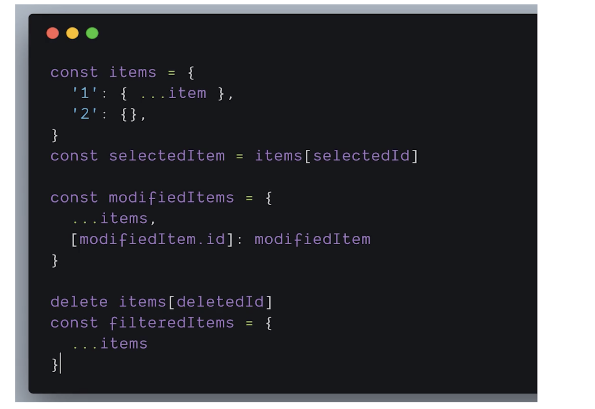
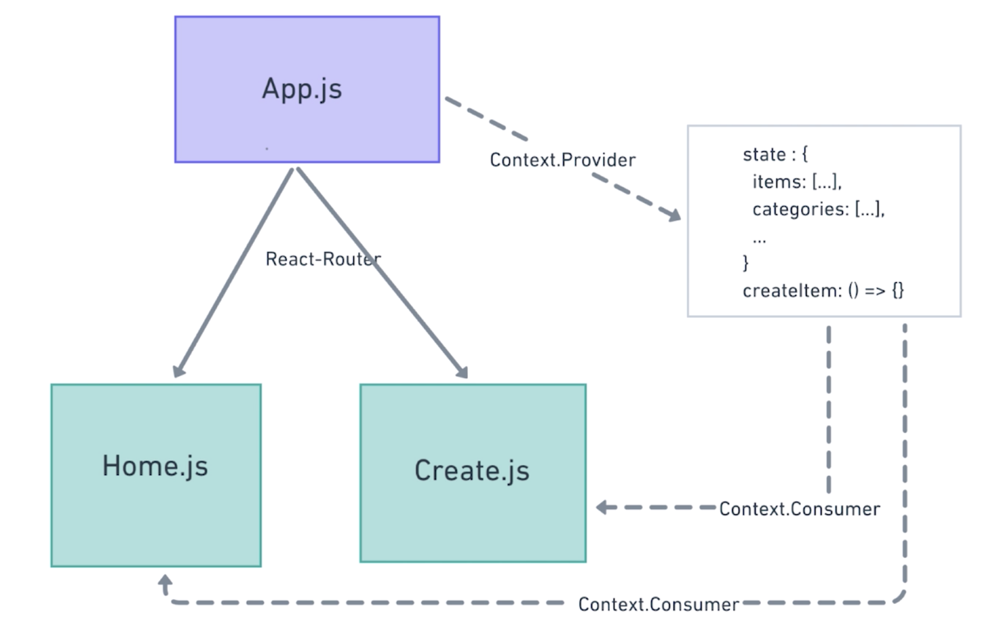
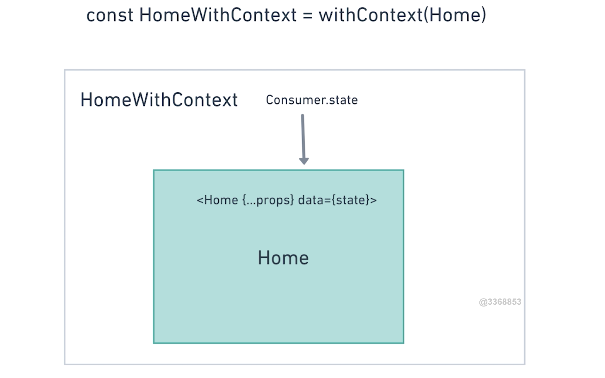

# 第7章 多页面结合

[TOC]

## 7-1 分析和优化整个应用的state 结构

### 再次分析整个项目的状态结构


- 可以看到，现在的两个页面 Home.js 和 Create.js 是放在 App.js 这个父组件中由 React-Router 来进行路由的管理，并且两个页面是相互分离的，并没有任何的数据或者逻辑的关联。
- 不过，Home 组件和 Create 组件在某些数据上其实是相同的，因此我们需要将这部分数据进行共享，而目前最好的方式是将这些数据提升到父组件中进行管理——状态提升。

因此，状态发生一些变化，如图：


- 这里启发了我一个想法，当你在编写代码之前对项目进行分析时就应该去寻找很多共同逻辑与数据，比如不同的页面或者不同的容器组件中显示的内容是否相同，是否存在相同的删除相同内容的逻辑在不同的容器之中？这些都是可以在编写代码之前做一个规划的，以方便我们更好的进行开发。
- 虽然将状态提升到统一的地方进行管理是减轻整个项目重量的好办法，但是如果组件过多，就会造成传递数据的麻烦，所以之后肯定会将数据放在统一的地方进行管理，而不是单纯的将组件状态进行提升，比如使用 Redux
- 目前还是要考虑应用最小可变状态集，依然是那句老话 DRY（Don't Repeat Yourself），**找出应用程序的最小表示并计算所需要的任何请求**。比如我们之前在 Home 组件中所做的，将`category`数据抽象到一个新的对象`categories`中，然后将之前的`category`属性变为`cid`，通过这个 id 来获取`categories`中的对象。

### 目前 state 结构的数据操作方法


- 目前`items`是一个数组，所以如上代码所示，我们在做相关的处理时，基本都是使用数组方法对数组进行遍历，通过与当前所选项进行对比从而筛选出所需要的项，总的来说，稍微有点点麻烦。
- 所以，如果我们将`items`数组更改为像是之前所更改过的`categories`对象一样，使用`id`作为键名，然后每一项作为键值，这样的话，我们就不需要遍历，而是直接通过键名来获取想要的项即可。

### 数据结构更改之后的数据和操作数据的方法



- 可以看到，`items`从 Array 变为了一个 Object
- 从而，查找数据变得很简单，直接通过`id`就返回想要的项
- 这里使用了`delete`这个关键字用来删除对象中的值

### Flatten State

这样的数据方式被称为「Flatten State」，可以从字面意思上看出是将数据变的平面化，也可以是将复杂的数据嵌套结构转换为扁平的结构（一层），然后使用将高层的数据存放到一个新的对象中，再添加一个外键来从这个对象中获取相关数据，从而与其他数据有一个扁平的依赖关系，而不是像之前那样一层一层去调用和获取数据。

#### 优点

- 解决数据冗余（因为很有可能会有重复数据，除非很特殊）
- 数据处理更容易（从对数组的遍历到使用键名来获取对象中的值）

### State 的进一步进化


- 上面就是新的 state 的形式，一是将`category`抽象到`categries`中，二是将`items`从数组转变为对象。


## 7-2 Redux 和  Context 的解决方案

### 思考问题

有什么方法可以把一个组件的状态不通过 Props 传递给子组件？

- 全局 State，比如 Redux、Context

### 简单谈谈 Redux

官网 Slogan：Redux is a predictable state container for JavaScript apps.（为 JS apps 提供一个可预测状态的容器）

#### 什么是状态


这个网页应用中存在着好几个页面，不同的页面都有各自的数据，但是这些数据相互之间有可能是有关系的，那么当前这些数据所展示出来的形式就可以称为状态。比如最外层的 Document Settings 有自己的状态，灰色页面的 Document 也有自己的状态。当状态复杂到一定程度之后，页面状态之间又有很复杂的相互关系时那就会有很多问题，比如状态同步，可能你改变了这个页面的状态之后也需要改变另一个页面的状态。

所以，我们需要把这些状态这些数据放到一个地方来统一管理，对于这些相同数据而言，在一个地方修改过后的数据，在另一个地方通过一些方法来告诉它们数据发生了改变，从而改变它们的状态，也就不需要我们再想办法去更改另一个地方的数据。

#### 解决方法

所以可能会存在这样的数据：


Redux 和上面这个的数据结构其实很像，大概也是这样的一个数据结构，不过其改变数据的方式不同，你不能直接进行更改。

直接修改数据的麻烦在于如果出现了了 bug，你很难发现数据是有由谁修改的。

#### Redux 解决方案


- store 的更改和获取需要使用特殊的方法。

#### Redux 简单总结

- 一种特殊的数据结构，类似于 Object
- 使用一些特殊的方法来实现数据的更改

- 不是 React 特有的，其他的框架或者使用原生 JS 进行开发都是可以的

#### Redux 和 React


- 不使用 Redux 的情况下，我们需要一层一层的传递数据
- 使用 Redux 的情况下，我们就可以直接从 Store 中获取数据和对 Store 改变数据

#### 为什么不使用 Redux

- 学习成本（确实存在学习成本的问题，不过对于目前的我而言已经基本上会使用了）
- 增加数据流复杂度
- 需要增加太多的模版（Boilerplate）代码（Actions，Actions 常量，Reducer），从而使项目变得稍微有一点复杂

### 使用 Context 后的数据流



- 使用`Context.Provider`对`App.js`中的数据和数据方法进行包裹
- 使用`Context.Consumer`对`Home.js`和`Create.js`进行包裹
- 这样之后，就能够轻松的获取到父组件中的数据和方法了

对于小的项目又需要将数据统一管理并且组件层级较多传递数据麻烦而言，使用 Context 比使用 Redux 更加轻量级而且简单、方便。


## 7-3 添加 Context

> [Context](https://zh-hans.reactjs.org/docs/context.html) 提供了一个无需为每层组件手动添加 props，就能在组件树间进行数据传递的方法。

Context 分为两部分——Provider（数据提供者）和 Consumer（数据的使用者）

### 代码部分

#### 使用 Context 把状态和数据操作方法抽象到顶层

我将讲师的 testData.js 拷贝到了我的项目中，不过我们需要对这个这个数据进行更改，因为现在是对象数据的形式，我们要将其更改为对象形式，所以需要创建一个工具函数。如下：

```jsx
export const flattenArr = (arr) => {
  arr.reduce((map, item) => {
    map[item.id] = {...item}
    return map
  }, {})
}
```

- 使用了`reducer()`方法，可以创建一个初始值（第二个参数），然后将这个初始值放入回调中进行处理，返回后的新值会传入下次回调之中。这里我们是创建一个空对象，然后对这个对象添加属性，然后返回它。

#### 为 App 组件添加状态和 Context

```jsx
import { flattenArr } from "./utility"
import { testItems, testCategories} from './testData'

export const AppContext = React.createContext()
class App extends Component {
  state = {
    items: flattenArr(testItems),
    categories: flattenArr(testCategories)
  }
  render() {
    return (
      <AppContext.Provider value={{ state: this.state }}>
        <Router>
          <div className="App container">
            <ul>
              <li>
                <Link to="/">Home</Link>
              </li>
              <li>
                <Link to="/create">Create</Link>
              </li>
              <li>
                <Link to="/edit/32/zhaoenxiao">Edit</Link>
              </li>
            </ul>
            <Route path="/" exact component={Home} />
            <Route path="/create" component={Create} />
            <Route path="/edit/:id/:name" component={Create} />
          </div>
        </Router>
      </AppContext.Provider>
    )
  }
}
```

- 使用`Context`
  - 我们通过`React.createContext()`创建一个`AppContext`
  - 然后使用`AppContext.Provider`将组件包裹起来，并通过`value`属性传入想要传入的数据
  - 这样之后就可以在其内部组件中获取数据

- App 组件状态中的`items`数据和`categories`数据现在都是经过「flatten」之后的对象

### 为两个容器型组件添加 Context.Consumer

#### 为 Create.js 添加 Context

```jsx
import { AppContext } from "../App"

class Create extends Component {
  render() {
    const filterCategories = categories.filter(
      (item, index) => item.type === TYPE_INCOME
    )
    return (
      <AppContext.Consumer>
        {({ state }) => {
          console.log("AppContext", state)
          return (
            <div>
              <Tabs activeIndex={0} onTabChange={() => {}}>
                <Tab>支出</Tab>
                <Tab>收入</Tab>
              </Tabs>
              <CategorySelect
                categories={filterCategories}
                selectedCategory={categories[1]}
                onSelectCategory={this.handleSelectCategory}
              />
              <PriceForm onFormSubmit={() => {}} onCancelSubmit={() => {}} />
            </div>
          )
        }}
      </AppContext.Consumer>
    )
  }
}
```

- 先从 App 组件中会引入`AppContext`，然后使用`AppContext.Consumer`对组件进行包裹，最后使用一个回调用来接受从`AppContext.Provider`中传递过来的`value`，最后在这个回调中返回`Create`组件需要渲染的内容即可
- 注意这里使用了`{ state }`对`value`进行了解构，从而直接获取传入进来的 state

#### 为 Home.js 添加 Context.Consumer

操作和在 Creact.js 中一样，但后面我们会使用 WithContext 这个 HOC 来实现重复的部分

### 问题

上面使用 Context 的操作，会发现有一个很麻烦的地方，每一次我们都需要引入`AppContext`然后使用`AppContext.Consumer`进行包裹，然后又要传入一个回调，回调中来返回组件应该渲染的内容。

这样的一系列操作所写的代码实际上是可以抽象出来的，下节课我们就会做这个工作。


## 7-4 使用高阶组件实现 Context 重用

上节课最后的为两个页面组件添加使用 Context 的代码其实很大一部分都是重复的，对于一个程序员而言如果有 DRY 出现，我们就应该想办法解决这个问题。

### HOC - 高阶组件

- 为解决组件逻辑重用的一种技术
- HOC 并不是 API，而是由 React 自身的这种组件组合模式而产生
- **是一个函数**，且该函数接受一个组件作为参数，并返回一个新的组件
  - 对比于一个组件是将 props 和 state 转化为一个 UI，HOC 是将一个组件转换为一个自带内部逻辑的新组件

图示：



- 这里，`withContext`就是 HOC，传入旧组件`Home`，返回新的组件`HomeWithContext`
- 新的组件`HomeWithContext`中拥有 Consumer.state，然后将它传递给 `Home` 组件，从而可以在 `Home` 组件中通过 data 来处理数据和渲染内容。
- 在这个例子中，高阶组件并**不关心数据如何被使用**，只负责数据的传递，而传入的被包裹组件也并**不关心数据来自何处**，只负责数据的处理，让两个行为在不同的组件中分离开来，互不影响。

#### 一个关于 React-Router 的例子

代码：

```jsx
import React from "react";
import PropTypes from "prop-types";
import { withRouter } from "react-router";

// A simple component that shows the pathname of the current location
class ShowTheLocation extends React.Component {
  static propTypes = {
    match: PropTypes.object.isRequired,
    location: PropTypes.object.isRequired,
    history: PropTypes.object.isRequired
  };

  render() {
    const { match, location, history } = this.props;

    return <div>You are now at {location.pathname}</div>;
  }
}

// Create a new component that is "connected" (to borrow redux
// terminology) to the router.
const ShowTheLocationWithRouter = withRouter(ShowTheLocation);
```

如果想在一个组件之中使用 Router 提供的方法，比如现在的路由本身、改变路由的方法、location 的信息，这个时候就可以使用`withRouter`这个高阶组件将组件进行包裹，比如这里被包裹的组件`ShowTheLocation`，那么`ShowTheLocation`的 props 中就会多出一些由`withRouter`所传传递来的数据，比如这里的`math` `loation` 还有 `history`。

所以，这里的 HOC 就是一个提供数据和方法的提供者，当然 HOC 除了提供数据之外也可以让组件中一些共同的操作，比如在`componentDidMount`中获取数据。

### 编写高阶组件

> 在编写高阶组件之前，我想谈论一些关于组件的想法。
>
> react 通过将组件进行组合，最终传递给`ReactDOM.render`，这个 API 就会将我们在组件内的元素（标签）与 props、state 进行渲染成 DOM 放置到所传入的节点之下，比如我们应用中是这样的：`ReactDOM.render(<App />, document.getElementById('root'));`，我们放置在了一个 id 为 root 的节点之下。
>
> 那么，最终我们在页面中所看到的内容不过都是 DOM 元素所组成的而已，HOC 所返回的组件，组件返回的所有内容都是 DOM，这就是我想说的，我们要`render()`这些 DOM，无论是使传入 HOC 后的新组件，还是没有传入 HOC 的旧组件，都是为了返回这些 DOM

代码：

```jsx
import React from "react"
import { AppContext } from "./App"

export default function withContext(Component) {
  return props => {
    return (
      <AppContext.Consumer>
        {({ state }) => {
          return <Component {...props} data={state} />
        }}
      </AppContext.Consumer>
    )
  }
}
```

- 注意这里的`return`关键字有点多，我们从最里面的`return`开始说
  - 第 9 行的`return`，是返回传入 props data 后的组件，这是使用`Context`的特殊写法
  - 第 6 行的`return`，实际上是函数组件的`render`所返回的组件中需要渲染的 DOM 或者组件
  - 第 5 行的`return`，是返回一个新的函数组件
- 还需要注意，对于 HOC，一定要将本来传递给旧组件而现在传递给新组件的 props，在旧组件的属性中用展开运算符进行展开，保证旧组件依然能够使用这些 props，代码在第 9 行

#### 在 HOME 组件中使用 HOC

```jsx
import WithContext from "../WithContext"

//...

export default WithContext(Home)
```

- 很简单，引入`WithContex` HOC，然后传入 HOME 组件，接着返回这个经过 HOC 处理而获得 data 的新组件即可

（这里讲师又将 Create.js 传入了 HOC，但由于我想能够更直观的看到不使用 HOC 的情况，所以并没有进行更改）


## 7-5 扩展作业

现在要完成这么两个组件，一个是新闻列表组件，一个是用户列表组件，他们的逻辑很相似，从某个 URL 发送异步请求获取数据，在读取的时候显示 Loading 图标，数据获取完毕后显示不同的界面结构，如下面的图所示。你应该怎样设计这两个组件？有没有什么方法把他们重复的逻辑整合？假如我再有一个读取评论列表也可以很快的把逻辑应用进去？


考虑创建一个 HOC 来完成这样的类似的功能。


## 7-6 整合两个页面的逻辑和交互 — 首页和创建页

### Home 组件的修改

Home 组件之前的一些功能，比如创建一个新的记账记录、修改记录这两个功能都只是为了能让按钮有其作用而模拟做了一些虚假的功能，所以这里我们需要更改一下，还有删除功能也需要重新做一些处理。

#### 创建功能更改

点击创建一条新的记账记录以后我们应该是需要跳转到 Create 页面，所以需要使用到`react-router`提供给我们的 props 中的方法，这里可以使用`history.push`。

在写代码之前，我想先说明一个问题，因为目前我的代码中，Home 组件是在 App.js 中通过将其传入到`<Router>`组件的`component`属性中来进行渲染的，所以在 Home 组件的 props 中是有`history`这个属性的。但是，在讲师的讲解中，他所使用的方式是通过将 Home 组件传入`withRouter`这个由`react-router-dom`所提供的 HOC 来将`history`传入到 Home 之中来使用，大概代码如下：

```jsx
import { withRouter } from 'react-router-dom'

//...

export default withRouter(withContext(Home))
```

- 通过两个 HOC 一个传入了公用的 state，一个传入了`react-router`所提供的一些方法

创建按钮功能代码：

```jsx
handleCreateItem = () => {
  this.props.history.push('/create')
}
```

#### 修改功能更改

修改功能实际上也是跳页面，但要跳转到的路由是`'/edit/:id'`，而且需要传一个 id，表示我们需要更改的是哪一条数据。

代码如下：

```jsx
handleModifyItem = modifiedItem => {
  this.props.history.push('/edit/' + modifiedItem.id)
}
```

#### 删除功能更改

在修改删除功能之前，我们需要将之前使用 Home 状态中的 items 数据更换为使用 Context 后 App 中的 items，代码如下：

```jsx
const { data } = this.props
const { items, categories} = data
const { selectedDate, tabView } = this.state
// 为 items 中添加 category 值，并且过滤出当前年月的条目
const itemsWithCategory = Object.keys(items).map((key,index) => {
  // 注意这里的 item 是 items 中的对象，所以需要先进行拷贝，否则会将存放在 context 中的 items 中每个对象添加一个 category
  const copyItem = {...items[key]}
  copyItem.category = categories[items[key].cid]
  return copyItem
})
.filter(item =>
	//过滤出所选择月份的条目
	item.date.includes(
  `${selectedDate.year}-${padMonthLeft(selectedDate.month)}`
	)
)
```

- 第 5 行中使用了`Object.keys()`这个 API，可以将对象中的 key 提出来放到一个数组中，从而使用`map`来重新将一个对象数据转换为一个数组数据，方便我们使用`filter`和在 JSX 中使用`map`来进行渲染

由于现在我们需要操作的数据是位于 App 中的 state，所以，我们需要传递一些行为给这些需要操作数据的组件。具体操作由如下几步：

1.在 App 组件中创建 actions：

```jsx
actions = {
  deleteItem: (item) => {
    delete this.state.items[item.id]
  }
}
```

- 注意，这个 actions，实际上是实例的属性，也就是`this.actions`

- 然后在`actions`中添加一个行为`deleteItem`函数，接受所要删除的项，并`delete`位于`this.state.items`中的对应的那一项

- 虽然从实际的页面效果来看没有问题，点击删除按钮之后删除了那一项，但是却存在其他问题——组件的状态最好不要直接进行更改，而应该通过`this.setState`这个 API，所以，这里最好的方式是先将 items 进行拷贝，然后删除这个 items 中的那一项之后，再传入`this.setStaet`之中，代码如下：

  ```jsx
  actions = {
    deleteItem: (item) => {
      const clone = {...this.state.items}
      delete clone[item.id]
      this.setState({
        items: clone
      })
    }
  }
  ```

  

2.将`actions`传入`<AppContext.Provider>`的属性`value`中，以使其被包裹的组件能够接收到`actions`

```jsx
<AppContext.Provider value={{ state: this.state, actions: this.actions }}>
```

3.在`withContext`HOC 中所要返回的组件中添加`actions`这个 prop，以使经过处理的组件能够使用`actions`

```jsx
<AppContext.Consumer>
  {({ state, actions }) => {
    return <Component {...props} data={state} actions={actions} />
  }}
</AppContext.Consumer>
```

4.在 Home 组件中调用：

```jsx
handleDeleteItem = deletedItem => {
  this.props.actions.deleteItem(deletedItem)
}
```

### Create 组件的修改

首先我们还是要转换数据类型，因为从 Context 中传递过来的`categories`是一个对象，而我们需要一个数组，代码如下

```jsx
const filterCategories = Object.keys(categories).filter(
  (item, index) => categories[item].type === seletedType
).map(key => categories[key])
```

- 如果一组数据需要`map`又需要`filter`，先`filter`可以优化性能
- 第 2 行中，可以看到筛选出来的数据是由`this.state.seletedType`所决定的

所以，我们还需要添加组件状态：

```jsx
const TypeArr = [TYPE_EXPENSE, TYPE_INCOME]
state = {
  seletedType: TypeArr[0]
}
```

- 为什么需要一个`TypeArr`？是因为我们的`Tabs`组件传递出来的是所点击标签的`index`，所以需要用一个数组来映射出想要的值。

#### 添加取消按钮逻辑

很简单，如下：

```jsx
handleCancelSubmit = () => {
  this.props.history.push("/")
}
```

#### 添加提交按钮逻辑

首先，我们需要知道，最终我们数据提交到的位置应该是 App 中的`state.items`，那么我们就需要在 App 中创建能够向`state.items`中添加数据的逻辑——运用函数，并且将这个函数传递给向其传递数据的 Create 组件之中。

首先，在 App.js 中创建 createItem 方法：

```jsx
actions = {
  deleteItem: (item) => {
    //...
  },
  createItem: (item, cid) => {
    console.log('createItem',item,cid)
  }
}
```

- 一样，我们依然放在`App.actions`中
- 这里先使用`console.log()`替代一下

然后，在 Create 接收这个方法，并利用这个方法来传递参数：

```jsx
render() {
  const { seletedType } = this.state
  return (
    <AppContext.Consumer>
      {({ state, actions }) => {
        //...
        return (
          <div>
						{//...}
            <PriceForm
              onFormSubmit={(date, isEditMode) => {
                this.handleFormSubmit(date, isEditMode, actions)
              }}
              onCancelSubmit={this.handleCancelSubmit}
              />
          </div>
        )
      }}
    </AppContext.Consumer>
  )
}
```

- 由于我这里`<Create>`组件并没有通过`withContext`HOC 进行包裹，所以是在`render()`中的 JSX 部分手动添加`AppContext.Consumer`来将 App 中的 state 传递过来的，因此会和讲师的代码有一些不同，至少要使用`actions`，就需要将`actions`传递位于组件内部的方法`this.handleFormSubmit`

```jsx
handleFormSubmit = (date, isEditMode, actions) => {
  if (isEditMode) {
    // Edit
  } else {
    // Create
    actions.createItem(date, this.state.selectedCategory.id)
  }
}
```

- 这里会根据是否为编辑模式，也就是`isEditMode`这个变量的值来做不同的处理。

有了以上这些处理逻辑之后，我们就要在`createItem`这个 action 中将数据组合在一起最终添加进 state.items 中，首先来看一下我们需要组合成的完整数据形式：

```jsx
  {
    "title": "buy stuff for kitten",
    "price": 100,
    "date": "2018-08-15",
    "monthCategory": "2018-8",
    "id": "_kly1klf4g",
    "cid": "1",
    "timestamp": 1534291200000
  }
```

- 大概会是这样的形式，目前来说，我们有`title`、`price`、`date`、`cid`，但是缺少`monthCategory`、`timestamp`、`id`，所以需要想办法来获取
- 提醒：最终添加`state.items`中的是一个对象，所以有键，当然键就是`id`

添加 id，id 是由一个方法随机生成的，方法如下：

```jsx
export const generageID = () => {
  // Math.random should be unique because of its seeding algorithm.
  // Convert it to base 36 (numbers + letters), and grab the first 9 characters
  // after the decimal.
  return '_' + Math.random().toString(36).substr(2, 9)
}
```

最终的处理逻辑：

```jsx
createItem: (data, cid) => {
  const newID = generageID()
  const parsedDate = parseToYearAndMonth(data.date)
  data.monthCategory = `${parsedDate.year}-${parsedDate.month}`
  data.timestamp = new Date(data.data).getTime()
  const newItem = {...data, id: newID, cid}
  this.setState({
    items: {...this.state.items, [newID]: newItem}
  })
}
```

- 总体上来说都没有什么好说的，就是逐步添加数据的过程，最后将数据展开拷贝，然后添加新的数据即可。

#### 为选择类型添加提示

当我们在输入表单结束之后，在没有选择类型时依然可以提交数据，可是这样存在一个问题，也就是 cid 为`undefined`，在选择该数据所对应的月份时会报错，因为没有类型值，那么为了解决这个问题，我们可以设置一个提示，告诉用户必须选择一个类型图标。

不过，我们现在的提醒功能是在`<PriceForm>`组件之中的，如果要显示提示，我们还得往`<PriceFrom>`组件传递一个属性，这样很麻烦，而且也不符合组件功能的定位，一个组件最好只做一件事情，所以我选择将其拆分到一个组件之中，这样就只需要我们把需要提醒的文本传入其中就可以了。

`<Alter>`组件：

```jsx
export default function Alter({ text }) {
  return (
    <div className="alert alert-danger text-left mt-2" role="alert">
      {text}
    </div>
  )
}
```

然后，在容器组件`<Create>`中添加一个状态`alterText`，这样我们就可以通过这个状态来判断是否需要显示`Alter`组件和应该显示什么内容了。

`Create.js`：

```jsx
state = {
  seletedType: TypeArr[0],
  selectedCategory: null,
  alterText: ''
}

{alterText && (<Alter text={alterText}/>)}
```

接着我们需要对交互做一些处理，当点击提交时，除了要判断表单中是否为空以外，还需要判断是否选择了分类：

```jsx
handleFormSubmit = (data, isEditMode, actions) => {
  if (isEditMode) {
    // Edit
  } else {
    // Create
    if(!this.state.selectedCategory){
      this.setState({
        alterText: '请选择一个图标'
      })
      return 
    }
    actions.createItem(data, this.state.selectedCategory.id)
  }
  this.props.history.push('/')
}
```

- 对于`isEditMode`下的逻辑我们不需要做处理的原因是，编辑模式下肯定会选择一个分类，并且目前也没有取消分类的逻辑，所以不需要放在其中，但是其实最好还是将第 6 行到第 11 行的处理逻辑放在最前面，因为这样的好处是，以后添加了取消功能可以直接使用。

对于`<PriceForm>`组件我们也需要修改一些东西，主要是不需要再有`isAlter`和`alterText`这两个状态值了，因为我们直接可以将需要显示的提醒内容通过`onAlter`这个事件传递出去。

PriceForm.js：

```jsx
handleSubmit = event => {
  event.preventDefault()
  const { isEdit, titleValue, priceValue, dateValue } = this.state
  if (!titleValue.trim()) {
    this.props.onAlert('标题不能为空')
  } else if (!priceValue.toString().trim()) {
    this.props.onAlert('金额不能为空')
  } else if (Number(priceValue) < 0) {
    this.props.onAlert('金额不能为负数')
  } else if (!dateValue.trim()) {
    this.props.onAlert('日期不能为空')
  } else {
    this.props.onFormSubmit(
      {
        title: titleValue,
        price: Number(priceValue),
        date: dateValue
      },
      isEdit
    )
  }
}
```


## 7-7 整合两个页面的逻辑和交互 二 - 编辑页面

这节课的内容就是利用 url 中的 id 来获取需要编辑的项，然后将这一项中的数据填充到页面之中。

首先来看看我们的`<PriceForm>`组件：

```jsx
state = {
  isEdit: !!this.props.item,
  titleValue: this.props.item ? this.props.item.title : "",
  priceValue: this.props.item ? this.props.item.price : "",
  dateValue: this.props.item ? this.props.item.date : ""
}
```

- 可以看到，在组件初始化时就会根据是否传入了 item 而选择使用 item 中的数据还是使用空字符串来渲染表单中的内容。

所以，我们只需要获取 item 然后将其传入到`<PriceForm>`组件即可。

在 Create.js 中：

```jsx
const { id } = this.props.match.params
const { categories, selectedCategory, items } = state
const item = id && items[id]
```

- 很简单，只需要依次获取`id`、`items`，再利用短路求值的方式来返回`item`即可

接着，我们需要让类型也有根据传入的数据而显示默认的选项。

在此之前，出现了一个问题，由于`<Create>`组件没有使用`withContext`HOC，所以当我们需要使用到`Provier`中提供的`value`数据时（这个`value`中的数据是由`App`的 state 所提供，可以防止重渲染问题）就得受到「“函数作为子元素（function as a child）”模式」的限制，因为似乎只能在这个函数中获取到这些数据（当然可以想办法将这个数据传递出去，但目前我还没有想到，而且官方文档我也没有找到什么办法），但是我又需要在初始化的 state 中利用`value`中的值。代码如下：

```jsx
render(){
  const { alterText,seletedType } = this.state
  const { id } = this.props.match.params
  return (
    <AppContext.Consumer>
      {({ state, actions }) => {
        const { categories, items } = state
        const item = id && items[id]
        this.setState({
          selectedType: id ? categories[items[id].cid].type : TYPE_EXPENSE
        })
        const selectedCategory = categories[items[id].cid]
        const filterCategories = Object.keys(categories)
        .filter((item, index) => categories[item].type === seletedType)
        .map(key => categories[key])
//...
        	return (
          <Tabs activeIndex={typeArr.indexOf(seletedType)} onTabChange={this.handleTabChange}>
          )
```

- 首先提醒一下，这里的这部分代码是有问题的，因为不能在`render()`中使用`this.setState()`，否则会无限`render()`，出现死循环。
- 好，来看代码。
  - 我们需要的最关键的状态值是`seletedType`，刚开始我将这个状态删掉了，因为觉得没有必要，但发现有问题，我们所要从`categories`中筛选出来的图标是基于我们所选标签的类型，而所选标签的类型在编辑模式下**默认**是由`id`与`items`、`categoires`决定的，但当我们点击标签中另外一项时（一项是支出，另一项是收入）这时候如果没有状态则无法改变，因为 react 是由状态驱动 UI 改变的，所以需要添上状态。
  - 但是，如果添加了状态，图标类型是由状态决定了，我们点击不同的 Tab 可以切换出不同的图标，可是初始状态没有办法了，因为我们需要`items`和`categories`，而这两个数据是在「函数子元素」中的。

差不多就是这么一回事，所以数据源的位置很关键，一个组件如果能够在任何时间点获取数据就非常的完美，在组件中数据存放在`props`或者`state`中就很好，而如果是放在「函数子元素」中就很麻烦，因此使用`withContext`来传递`value`给`<Create>`就非常好用了。

使用`withContext`后的`<Create>`组件的状态：

```jsx
constructor(props) {
  super(props)
  const { categories, items} = props.data
  const { id } = props.match.params
  this.state = {
    selectedType: id ? categories[items[id].cid].type : TYPE_EXPENSE,
    selectedCategory: id && categories[items[id].cid],
    alterText: ""
  }
}
```

- 之后，我们就可以直接使用 state 中的值来决定所选图标和对应的类型了。

好了，内容的填充完成，接下来就是处理数据的逻辑，这个处理数据的逻辑还是应该在`<App>`组件中的`actions`中来添加。

```jsx
updateItem: (data, cid) => {
  const parsedDate = parseToYearAndMonth(data.date)
  const item = {
    ...data,
    cid,
    timestamp: new Date(data.date).getTime(),
    monthCategory: `${parsedDate.year}-${parsedDate.month}`
  }
  this.setState({
    items: { ...this.state.items, [item.id]: item}
  })
}
```

- 需要知道一点的是，这里传入的 data 与向`createItem`中传入的`data`不同，这个 data 是由在`<PriceForm>`组件中传递给过来的，是带有 id 等默认的值，所以在第 4 行直接展开，添加需要更改的值即可。

PriceForm.js 中根据不同的模式传入不同的 data：

```jsx
if (isEdit) {
  this.props.onFormSubmit(
    {
      ...item,
      title,
      price: Number(price),
      date
    },
    isEdit
  )
} else {
  this.props.onFormSubmit(
    {
      title,
      price: Number(price),
      date
    },
    isEdit
  )
}
```

接着，在`<Create>`组件中进行调用：

```jsx
handleFormSubmit = (data, isEditMode) => {
    const { selectedCategory } = this.state
    if (isEditMode) {
      // Edit
      this.props.actions.updateItem(data, selectedCategory.id)
//...
```

### 补充说明一个关于命名的问题

对于 PriceFrom 组件的状态，之前是这样的：

```jsx
state = {
  isEdit: !!this.props.item,
  titleValue: this.props.item ? this.props.item.title : "",
  priceValue: this.props.item ? this.props.item.price : "",
  dateValue: this.props.item ? this.props.item.date : ""
}
```

- 也就是对于表单中的值都添加了「Value」这个单词来区分

但是这样的方式在实际使用中有点麻烦，比如像是将其包装成一个对象传递给其他组件时，会这样使用：

```jsx
{
  ...item,
  title: titleValue,
  price: priceVlaue
  date: dateValue
}
```

而如果没有「Value」这个单词就可以这样写：

```jsx
{
  ...item,
  title
  price
  date
}
```

- 直接省略掉传入值，它会直接使用 title 作为键名并且以 title 中的值作为键值，会少写一些代码

所以，如果能够将一个应用中的所有数据都统一命名就会非常的方便，不过我觉得有可能不是这么容易实现的一件事情，因为如果一个很大的容器组件需要管理很多数据的话，就会很难做到统一命名，可能就需要一些添加一些像是「Value」这样的单词来加以区分，但总的来说如果**能够统一命名尽量统一命名**。这样在之后开发过程中能够更加的简便，虽然发生问题后更改也会比较麻烦，这就需要你对全局有一定的把握了。

### 回顾数据流


- 现在用于渲染 UI 的数据都存在放了 App.state 中
- 但 Home 或者其他一些组件也可以通过一些自己的状态用来实现一些效果
- 如果添加一个新的页面容器也可以通过`withContext`HOC 来使这个组件能够调用数据

## 7-8 阶段性总结

### 学习流程总结


### 以后可以采用的开发流程


- 容器型组件不一定是页面，也可以是页面中的某一部分

### 接下来的任务

我们的应用目前存在一个问题当我们编辑、删除、创建条目之后，刷新页面之前所做的操作结果都会消失。

所以接下来我们要做的就是数据持久化，如何让这些数据保留下来的问题。

而前后端分离开发，让后端来保存这些数据并且提供接口给前端，让前端来获取数据就是我们需要做的。


## 7-9 扩展作业 - 应用状态分析与设计

项目状态设计，现在有一个博客的 SPA 项目，有三个页面，一个是「首页」，是所有文章的「列表」，一个是「文章详情」，点进去以后有一篇「文章的详情」和这篇文章的「评论列表」，还有一个是「某个分类下面的文章列表」，点击进去会显示「这个分类下的所有文章」，现在请你为这个应用设计总体的状态。

提示：
请注意考虑 最小化状态集合，数据的 cache，flatten 数据结构 等等要点。

### 我的做法

数据肯定是同一进行管理的，无论是使用 Redux 还是 Context，都需要在统一的地方存放数据，这样方便任何一个页面或者组件进行读取和修改。

```jsx
const store = {
  articles:[{
    id: '1',
    author: 'xxx',
    title: 'xxx',
    tab: ['a','b','c'],
    content: 'xxxxxx',
    date: '2019-04-13',
    type: 'entertainment',
    timestamp: 1555113600000,
    readAmount: 20,
    likeAmount: 20,
    commentAmount: 20
  }],	
  comments:{
    '1': {
      author: 'xxx',
      content: 'xxx',
      date:'',
      timestamp: 1111,
      criticalCommentID: 12
    }
  }
}
```

