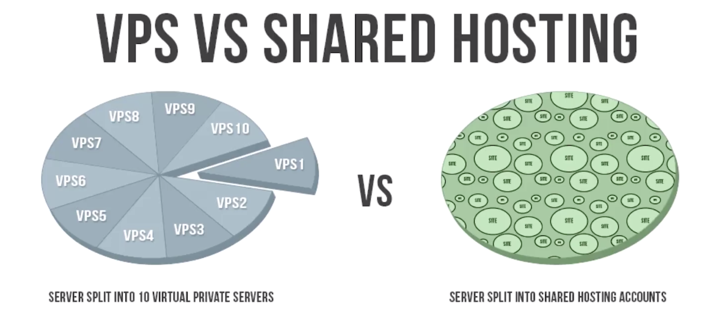
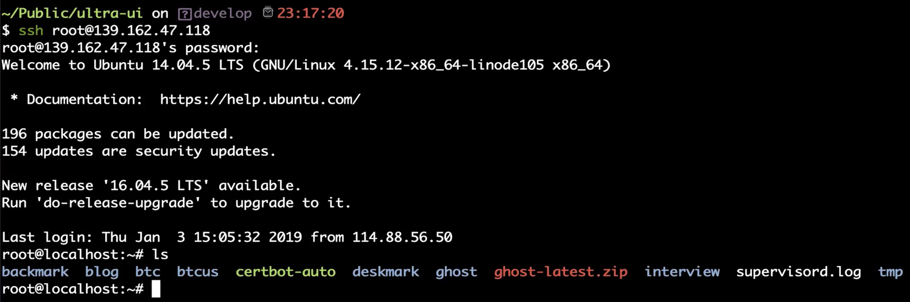
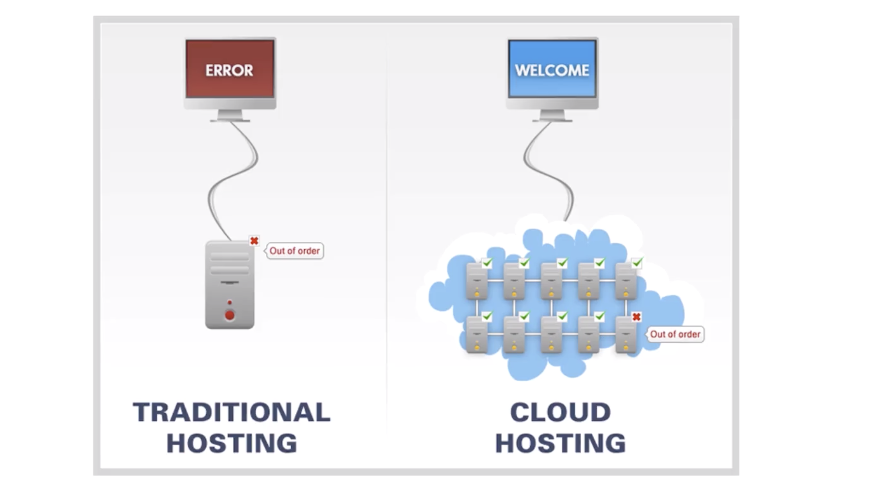
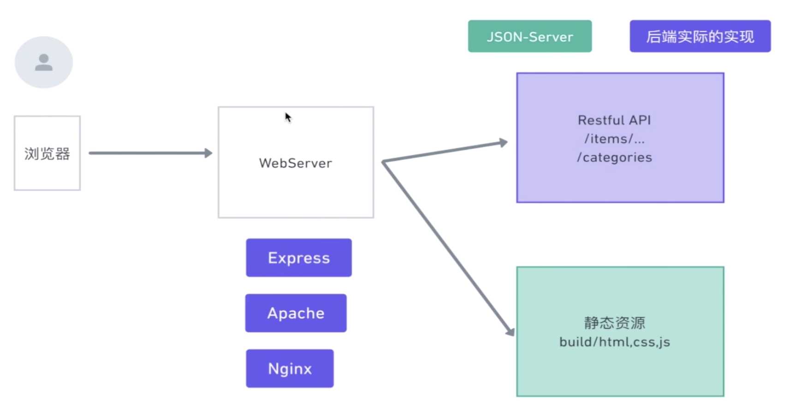
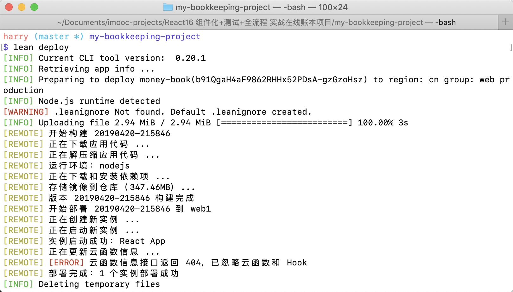

# 第11章 项目部署

[TOC]

## 11-1 开发环境和生产环境的异同

目前，在我们本地的开发环境下所有的功能已经开发完成，测试也写完并且通过，那么在正常的工作流程中就只剩下最后一步，将我们的应用部署上线，让所有的人能够公开访问我们的应用。

### 生产环境与开发环境

- 线上运行的环境被称为生产环境（production environment）
- 本地运行的环境被称为开发环境（development environment）。

#### 开发环境

开发环境可以比喻为排练话剧的过程，在这个过程中是封闭与私人的，允许修改与有各种瑕疵，作为导演就要指挥每一人，使让这一出话剧尽量完美，那么对于开发程序而言，开发环境可以做到以下几点：

- 有尽量丰富的信息帮助程序员定位问题并且处理这些问题
- 使用本地的 mock 数据

#### 生产环境

生产环境可以比喻为话剧排列结束准备上演，要面对的是所有观众，在这个过程中最好不要发生任何的问题，否则会影响到你的观众。所以，生产环境应该做到以下几点：

- 尽量消除程序错误和调试信息，因为用户并不关心这些信息，并且这些信息会泄漏一些关于你程序的问题，从而涉及到程序的安全
- 使用线上真实数据
- 访问速度是第一要务

### 不同库对于两种环境的适配

- express 对于两种不同环境的优化（[express 性能最佳实践](https://expressjs.com/en/advanced/best-practice-performance.html)）
  - 使用 gzip 压缩
  - 不要使用同步代码
  - 设置 node 的环境变量为 production
  - ...
- React 对于两种不同环境的优化
  - 比如在开发环境中 React 会为我们提供提示错误的信息，但在生产环境中就会删除掉这部分的功能代码从而减小体积从而加快运行速度
- [官网提供的关于如何加快 React 应用的文档](https://zh-hans.reactjs.org/docs/optimizing-performance.html)


## 11-2 为生产环境 build 代码

对于使用 create-react-app 的应用，只需要使用`nom run build`就可以生成用于生产环境的代码。

执行完命令之后，就会在项目根目录下创建 build 目录，文件结构如下：

```jsx
.
├── asset-manifest.json
├── favicon.ico
├── index.html
├── manifest.json
├── precache-manifest.5a3a2de3a1601a0527a02a69836f8e1b.js
├── service-worker.js
└── static
    ├── css
    │   ├── 2.848642de.chunk.css
    │   ├── 2.848642de.chunk.css.map
    │   ├── main.aa604fd7.chunk.css
    │   └── main.aa604fd7.chunk.css.map
    ├── js
    │   ├── 2.14d71fbd.chunk.js
    │   ├── 2.14d71fbd.chunk.js.map
    │   ├── main.0908c7d6.chunk.js
    │   ├── main.0908c7d6.chunk.js.map
    │   ├── runtime~main.a8a9905a.js
    │   └── runtime~main.a8a9905a.js.map
    └── media
        ├── img1.7a954738.jpg
        ├── img2.67a1eac2.jpg
        ├── img3.8807661e.jpg
        ├── img4.c489a7df.jpeg
        └── logo.5d5d9eef.svg
```

- manifest.json 是 HTML5 推荐的一个离线缓存策略
- favicon.icon 是显示在浏览器标签上的图标文件
- Service-worker.js 也是用于离线缓存
- index.html 是程序的主入口
- static/js/main.0908c706.chunk.js 是使用哈希值的命名

可能对于很多人来说，为什么之前开发所使用的那么多文件现在都不见了，还有难道不能直接使用我们在开发过程中使用的文件吗？

答案是不行的，因为我们代码使用了 ES6 的模块语法，这些语法目前浏览器是无法识别的，所以实际上`create-react-app`帮我们做了一些工作，它利用了`webpack`帮助我们在本地启动了一个开发服务器，也帮助我们转换代码、压缩代码等等。

`webpack`可以帮助我们处理开发环境中相互引用的模块之间的依赖关系，使其被打包成能够被浏览器识别和使用的静态资源——js、html、css、媒体文件等等。

## 11-3 服务器的不同类型

我们已经打包生成好了代码，现在就需要将代码部署到服务器中，部署实际上就是将我们本地的开发环境放到远端服务器中运行。

### 什么是服务器

服务器就是在远端存放着很多文件并运行着很多程序能够被访问并获取这些资源和处理一些任务的计算机，但相比于个人计算机而言，会更强大，因为需要处理大量的人的访问需求，不过和个人电脑的结构差不多，有 cpu、内存、硬盘等等，也有自己的操作系统，当通常是 linux 系统，比如下面这些：


为我们应用提供服务器的个人或公司被称为服务器提供商，当然个人也可以搭建服务器，只需要将个人电脑开着然后保持 24 不断电能够随时被他人访问就行，但是这样的成本较高，所以一般而言还是购买服务器比较划算。

我们选择服务器提供商时，一般会有几种不同的类型，定价和受用的人群也不太一样。

### shared host 和 VPS

#### shared host

sharedhost 或者称为 shared server，顾名思义就是共享服务器，就像一个小区的单元，一大堆人租用了一个服务器，里面的各种设施都是共享的，可能对于几年前搭建 WordPress 的人都搭建过这样的主机，给你一个 FTP 账号你就可以传一堆文件进去，然后你的网站就可以运行了，优点是便宜，缺点性能差，因为机器性能不变，当别人运行更耗费资源的程序时，你所能使用的性能就会减少，自然而然就会变慢。

#### VPS

VPS，全称为 Virtual Private Server 虚拟专用服务器（虚拟个人服务器），这是一种比较折中的方案，也是多人共享一台服务器，但是和 shared host 是有一些区别的。

#### Shared Hosts 和 VPS 的区别



- 左边为 VPS，右边是 shared hosting
- 可以从图中看出，VPS 每个人是相对隔离的，而 shared hosting 则是相互影响的
- VPS 会给你开一个 SSH 的权限，让你能够自行管理你的机器
  
  - 这是讲师使用 ssh 命令登陆他使用 [linode](http://www.linode.com/) 购买的位于新加坡的 unbantu 14.04 的主机


### Clound Hosts


现在比较火的服务器是云主机，它将大量的 server 组合在一起，形成了一个聚合的网络，也可以叫机群，分配给你的资源可以从这个资源池里抽取，当你不使用这个资源的时候他可以自动的回收，这样的方式最棒的地方在于它的可扩展性，你需要多少资源可以根据你的需求进行扩容而不是一个固定死的值，还有一个优势是，假如有一台 server 在使用过程中崩溃也会自动帮你切换到其他的 server，相比于传统的 server，当你的服务器挂了之后依然能够访问：



除此之外，这些云平台也提供各种服务，比如像 VPS，你可能需要安装不同的环境 PHP、Node、Python、数据库等等，而云平台已经给你准备好了这些环境，只需要点击某个按钮就会自动帮你安装，也可以叫做 Platform and servers，可以理解将软件当作一种服务来卖，也可以称为 software and servers，这样的平台有：

- [heroku](https://www.heroku.com/) 
- aws - 亚马逊
- google cloud engine
- 阿里云
- 腾讯云
- ...


## 11-4 本地完成应用部署

我们的应用想要在服务器上运作的话，需要支持两部分的内容，如图



- 第一部分是静态资源，在 build 目录中
- 第二部分是动态的 Restful API
  - 在本地我们是使用 json-server 创建了一个 mock 的环境，它可以根据 db.json 文件生成多个支持标准 restful 方法的接口，而真正实际的接口应该是由后端开发程序员所完成的，他们可以使用任意类型的语言和数据库来完成这项任务，比如 java+oracle，nodejs+mongoDB 等等
  - 本课程由于没有关于后端开发内容，所以我们依然使用 json-server 所提供的接口。

所以，我们现在需要完成两个任务，一个是 serve 静态文件，一个是支持 restful 的接口，完成这两个任务的软件我们也称之为 WebServer，但是 WebServer 和之前所讲到的服务器不是一个概念，之前所讲到的服务器是物理层的概念，也就是实体是机器，而 WebServer 是指完成上述服务器的软件，如上图中紫色部分的 Express（create-react-app 的静态服务器和 json-server 的底层）、Apache、Nginx（高性能、反向代理服务器） 等等

这节课我们将使用 express 来完成以上提到的两项任务。

### 实际操作

在根目录下创建一个新的文件 server.js，它是服务器端脚本。

由于 macOS 与 linux 类似，所以在本地部署和在服务器端部署差不多，所以现在本地尝试完成以上两项任务。

代码：

```jsx
const jsonServer = require('json-server')
//使用 json-server 会自动安装 express
const express = require('express')
const server = jsonServer.create()

// 内置变量 __dirname，是当前文件夹位置
const root = __dirname + '/build'
// maxAge 为过期时间
server.use(express.static(root, { maxAge: 86400000 }))
server.listen(3000, () => {
  console.log('server is running')
})
```

然后在根目录下执行`node server.js`则会在 3000 端口启动一个服务器，访问这个端口则会加载 build 文件中的 index.html，然后 index.html 中又会去引入 css、js，js 又会去请求数据，但是无法请求到数据，因为并没有启动一个带有 restful 的接口。

```jsx
const jsonServer = require('json-server')
//使用 json-server 会自动安装 express
const express = require('express')
const server = jsonServer.create()
// 使用 router 方法导出 jsonServer 中的路由
const router = jsonServer.router('db.json')
const middlewares = jsonServer.defaults()

// 内置变量 __dirname，是当前文件夹位置
const root = __dirname + '/build'
// maxAge 为过期时间
server.use(express.static(root, { maxAge: 86400000 }))
server.use(router)
server.use(middlewares)
server.listen(3000, () => {
  console.log('server is running')
})
```

- 添加了中间件和由`jsonServer.router`生成的路由，这样就可以访问这些接口获取数据

这里提供一个小工具——`nodemon`，可以自动监听文件的变化重新加载文件。安装：

```jsx
npm i -g nodemon
```

使用：

```jsx
nodemon server.js
```

不过现在依然存在一个问题，我们在主页面点击创建按钮跳转到创建页面，然后刷新页面会出现一个空对象，原因是我们在主页面跳转到创建页面是 react-router 在本地实现的，但是刷新页面时，会请求服务器，而请求的地址在服务器端是由 json-server 来管理的，而 json-server 发现这个路由没有资源时就会返回一个空白的数据。

解决这个问题是通过我们手动来添加路由，当访问这些路由时，不要由 json-server 来管理，而是跳转到首页 index.html 中去。

```jsx
const jsonServer = require('json-server')
//使用 json-server 会自动安装 express
const express = require('express')
const path = require('path')
const server = jsonServer.create()
// 使用 router 方法导出 jsonServer 中的路由
const router = jsonServer.router('db.json')
const middlewares = jsonServer.defaults()

// 内置变量 __dirname，是当前文件夹位置
const root = __dirname + '/build'
// maxAge 为过期时间
server.use(express.static(root, { maxAge: 86400000 }))
server.use(middlewares)
const reactRouterWhiteList = ['/create','/edit/:itemId']
server.get(reactRouterWhiteList, (request, response) => {
  response.sendFile(path.resolve(root, 'index.html'))
})
server.use(router)
server.listen(3000, () => {
  console.log('server is running')
})
```

- 注意`server.get`要在`server.use(router)`	之前调用，否则无效。

### middleware

middleware 实际是一个函数，这个函数可以访问请求对象和响应对象，它像一个管道一样，可以在输入输出中做一系列的操作，比如我们需要监控一个错误，这时候我们就可以添加一个自建的 errorMoniter，errorMoniter 就可以监控到 request 和 response 从而做一些处理，比如我们想打印日志，可以添加一些 middleware。就像我们可以控制管道中的水流一些，它也可以称为一个阀门让这个水流变小变大，也可以加一些颜料让水流变成红色变成蓝色等等。


现在我们本机的部署就算是完成了，如果要将这个部署到之前所提到的 VPS 上，则还要有一大堆的工作要做，首先要在那台主机上安装 node 之类的环境 npm 等，将我们的代码以某种方式拷贝过去，还要安装依赖，启动脚本，考虑应用崩溃之后的重启，等等等等，整个过程非常的繁琐。

而使用云服务器，以上很多工作是已经帮我们完成了，可以帮助我们节省很多时间和过程。


## 11-5 使用 Leancloud 进行部署

这里使用 [Leancloud](leancloud.cn) 来完成远端部署任务，当然也可以使用阿里云、腾讯云等等云平台。

这里我们使用命令行工具来进行部署：[命令行工具 CLI 使用指南](https://leancloud.cn/docs/leanengine_cli.html#hash-1980387332)

安装：

```shell
brew update
brew install lean-cli
```

登陆：

```shell
lean login
```

在网页的控制台中「创建应用」，然后初始化：

```jsx
lean init
```

初始化会选择后端语言和框架，然后先进入你的项目**本地目录**再 switch 到你的应用：

```jsx
lean switch
```

接下来就是部署，但是在部署之前需要稍微更改一点代码。

当我们使用 LeanCloud 服务器之后，在环境中会创建一个端口供我们使用，存放在一个环境变量中，所以我们需要先做一下判断，如果有这个端口则使用这个端口，没有还是则使用我们的 3000 端口：

```jsx
//server.js
const port = process.env.LEANCLOUD_APP_PORT || 3000

server.listen(port, () => {
  console.log('server is running')
})
```

然后是，LeanClould server 默认启动命名是`nom run start`，而目前我们项目中的 start 是运行本地开发环境，所以做一点更改：

```json
// package.json

"scripts": {
  "start": "node server.js",
   "dev": "react-scripts start",
```

- 将之前的`start`更改为`dev`，而用`start`来执行`node server.js`启动我们的 express node 服务器。

然后，我们需要将`json-server`从`devDependencies`字段从移到`dependencies`字段，因为现在`json-server`并不是开发环境中在使用而是生成环境中也在使用：

```json
"dependencies": {
    "json-server": "^0.14.2"
```

最后的更改是，添加`engines`字段并传入一个 json 对象，对象中指定 node 版本是`>=6.0.0`，希望应用的 node 版本为 6.0.0 以上，因为如果不指定会默认安装 0.12，这个版本比较老，容易出现一些问题：

```json
"engines":{
  "node": ">=6.0.0"
}
```

好了，接下来进入部署，命令如下：

```shell
lean deploy --no-cache
```

- `—no-cache`参数是不使用之前的缓存进行部署，如果对于第一次可以不实用这个参数。
- 记得是在本地项目目录下运行这个命令

等待很长的一段时间之后就完成了部署，log 信息如下：



但是目前还不能通过域名进行访问，因为得先实名认证，但也可以直接使用私有域名，不过我目前没有，所以只有等待审核通过之后，设置一个域名就可以让全世界的人通过这个域名来访问项目了。

经过上面的部署发现使用云平台对于开发来说还是很有好处的，不需要自己去维护服务器或者是安装任何的环境，平台提供命令行工具或者是 web 界面帮助我们简便快捷的完成部署任务，不过我们只是使用了云平台的部分功能，关于云平台的更多功能可以自己去探索。


## 12-1 课程总结

温故而知新，可以为师矣。


整套课程其实就是按照上图的步骤进行的，但中间有很多细节需要我们去记录和归纳，这一部分我会自己来做。

### 软能力

- 对测试的重视，尽量给代码写测试，了解测试对程序员带来的好处
- 举一反三，触类旁通的发散性思维
- 自我学习和自我解决问题的能力


