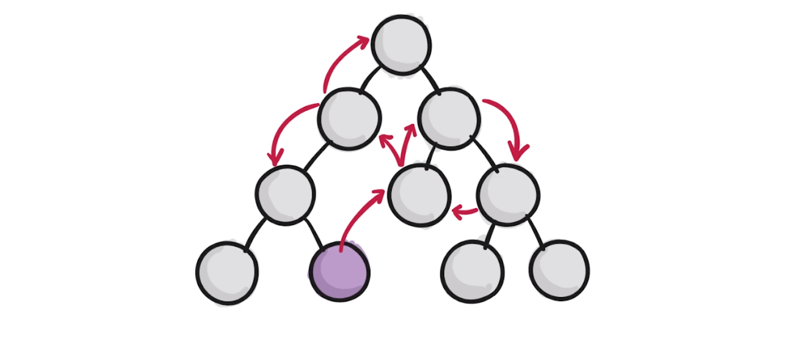

# 3. React 基础精讲 - 编写 TodoList

> 注：这里的 React 为 React.js

[TOC]

JSX 语法要求 render() 函数所返回的内容必须整体被包含在一个大的元素之中。所以一般会在最外层添加一个 `<div>`，但是如果你不想最外层是一个 div，则可以使用`Fragment` 这个占位符，来替代 div：

```react
import React, { Component, Fragment } from 'react';

class TodoList extends Component {
  render() {
    return (
      <Fragment>
        <input type="text"/><button>提交</button>
        <ul>
          <li>学英语</li>
          <li>看代码</li>
        </ul>
      </Fragment>
    );
  }
}
```


## 3.2 React 中的响应式设计思想和事件绑定

响应式设计思想（声明式），不用再去考虑操作 DOM，我们只需要去关注数据层就行了。（数据驱动）

那么，关于 TodoList 这个简单的示例中我们需要存储多少数据呢？两组。

- 一组存储 input 中的值
- 一组存储列表中的每一项

### 在 React 中如何定义数据？

```jsx
class TodoList extends Component {
  constructor(props){
    super(props)
    this.state = {
      inputValue: '', // 存储 input 中输入的内容
      list: [] // 存储 todolist 中的每一项
    }
  }
```

- constructor(props) 函数**会优先在组件中执行**，并且会接收 props 参数
- spuer(props) 是指**调用父类的构造函数**，这也是 js 继承经常会用到的
- react 中定义数据需要我们将数据定义到 state(状态) 对象中


由于 input 框中的内容都存储在 `this.state.inputValue` 中，所以我们需要将 input 框与我们的状态进行绑定：

```react
handleInputChang = (e) => {
    this.setState({
      inputValue: e.target.value
    })
  }

<input value={this.state.inputValue} onChange={this.handleInputChang} type="text" />
```

- 当你想在 JSX 中使用 js 的语法或者变量时，需要在最外层加上 `{}` （花括号）
- `e.target` 为元素本身
- 在 react 中，想改变组件状态，不能直接通过 `this.state.inputValue = '...'` 的**引用形式**，而是要通过 `this.setState()` 这个方法。


给 button 绑定 click 监听函数时，需要注意的地方：

```react
// 第一种方法：
handleBtnClick = e => {
  this.setState(state => {
    state.list.push('123')
    return {
      list: state.list
    }
  })
}

// 第二种方法：
handleBtnClick = e => {
  this.setState(state => ({
    list: [...state.list,state.inputValue] // 展开运算符
  }))
}
```

- 两种方法的目的都是为了通过 `this.setState` 方法来改变状态从而改变视图
- 需要注意的是：
  - 通过 `this.setState()` 方法，传入回调函数需要返回一个对象，并且传入新的需要改变的键与值。
- 第一种方法使使用了 `push` 方法，但需要注意，`push` 方法会返回现在数组的长度，而不是当前数组，并且直接改变了 list
- 第二种方法比较推荐，是使用了展开运算符，会将以前数组或者对象中的值或键值对展开放入到新的数组或对象当中。


给每一个 li.item 绑定一个 onclick 事件用于删除 item：

```react
// JSX 部分
<li key={i} onClick={()=>{this.handleItemDelete(i)}}>{item}</li>

// 第一种方式
handleItemDelete = (i) => {
  this.setState(state => ({
    list: state.list.filter((item,index) => i !== index)
  }) 
 )
}

// 第二种方式
handleItemDelete = i => {
  let list = [...this.state.list]
  list.splice(i, 1)
  this.setState({
    list
  })
}
```

- JSX 部分需要注意的是，由于需要每个元素的 index 值，所以传入 `handleItemDelete` 来接受这个值。
- 第一种方式是利用 filter 将数组进行筛选，只留下相同的 index
- 第二种方式是利用 splice 方法，将原来数组中的值删除掉
  - `splice(a,b,[c])`，a 是 index 的位置，b 是删除的数量，c 是添加的新数值，返回被删除值的数组

> 补充：React 中有一个概念叫做 **immutable**，他的意思是 state 不允许我们做任何的改变，因为你直接通过操作 state 来修改 state 中的内容会有性能方面的问题。所以，以上两种方式中：
>
> - 第一种就存在一个关于性能的问题，因为我们操作了 state（但我似乎记得 UDACITY 那边也是这样操作的，我查过了，就是的！！但是，通过 filter 方法处理后会返回一个新的数组，而不是改变 state，所以也没有真正的改变 state 本身，我们只是引用了这个数据，和使用 ...state.list 相同）。
> - 第二种方式似乎就比较合理，因为我们所操作的是 state.list 的一个副本。

## 3.3 JSX 语法细节补充

- 在 JSX 中的元素属性会和 HTML 中的元素属性略有不同，比如：
  - 在 HTML 中的 class，在 JSX 中为 className，原因是怕和 class 这个声明类的关键字混淆。
  - 在 HTML 中 label 的 for，在 JSX 中为 htmlFor，原因如上。
- 在 li 标签中使用非转义字符（也就是可以允许使用 html 代码）：

```react
<li
	key={i}
	onClick={() => {
	this.handleItemDelete(i)
	}}
	dangerouslySetInnerHTML={{__html: item}}
>
</li>
```


### 3.4 拆分组件&组件之间的传值

什么是组件？

- 页面中所有的最小单位部分（一个标签），我们可以将他们称为组件，每个组件都有其特定的功能。

为什么需要将一个页面拆分成多个组件呢？

- 因为一个页面的逻辑会比较复杂，当我们将其拆分为一个一个小的组件时，每个部分的逻辑就相对的比较清晰与简单了。（这也是去理解一个页面的思路，可以帮助你去思考一个页面的功能而不至于混乱）

对于 TodoList 的这个项目如何拆分？ 两部分：

- 输入部分 - 输入框 + 提交按钮
- 输出部分 - 每一个 li.item 项

使用 React 来写项目时的组件结构，还带有一些数据流动的情况：




#### 父组件如何向子组件传递数据？

- 通过向父组件的属性传值，然后子组件可以通过 `this.props.xxx` 来获取值

#### 子组件如何向父组件传递数据？

- react 是不允许子组件直接修改父组件的。
- 通过父组件传递一个带有 `this.setState()` 方法的组件方法给子组件，子组件调用方法来间接操作父组件的数据。（面试：React 中，如何做父子组件的通信）
  - 虽然这种方式你是在子组件调用的方法，但其实还是由父组件来执行数据操作。

> 补充：
>
> ```react
> <label htmlFor="todoInput" onClick={e => {
>           debugger
>         }}>请输入内容：</label>
> ```
>
> 可以通过以上的方式来调试在控制台查看 `e.target` 对象中能够使用的属性和方法
>

## 3.6 TodoList 代码优化及新语法

### 关于 import 文件的使用

- 将 import 的文件相同的类型的放在一起，比如你可以先引入组件，然后再引入 css 和一些插件、脚本、库等

### 书写代码的规范

- 在编程时，如果你的代码写的一坨一坨的时候，你就应该将这些代码进行拆分封装到函数中，会使你的代码整体看起来更整洁，更好阅读。

- 视频中他将 ul 下 map TodoItem 组件的操作封装到了一个函数中，如下

```react
getTodoItem(){
    return this.state.list.map((item, i) => (
        <TodoItem
            content={item}
            handleClick={(e) => {
                console.log(e.target)
                this.handleItemDelete(i)
            }}
            >
        </TodoItem>
    ))
}

// JSX 部分
<ul>
   	{this.getTodoItem()}
</ul>
```


### 使用 this.SetState 的问题

将 input 的 onChange 事件的监听函数做一个更改：

```react
  handleInputChang = e => {
    this.setState(() => ({
      inputValue: e.target.value
    }))
  }
```

- 这里会发生错误：`TypeError: Cannot read property 'value' of null`，原因是因为当 this.setState() 传入函数时，是异步执行的。
- 如果想要解决这个问题，可以先将 e.target.value 的值存储在一个变量里，在 this.setState 中调用这个变量：

```react
  handleInputChang = e => {
   	const value = e.target.value
    this.setState(() => ({
      inputValue: value
    }))
  }
```

#### 其他相关补充：

- setState是异步的(译者注：不保证同步的)

  - `setState` 方法第二个参数位置接收一个 `function` 作为回调函数。这个回调函数会在 `setState` 完成以后调用，这样就可以获取最新的 `state` 。对于之前的例子，就可以这样：

    ```jsx
    this.setState({
      selection: value
    }, this.fireOnSelect)
    ```

- 和渲染无关的状态尽量不要放在 `state` 中来管理
  - 通常 `state` 中只来管理和渲染有关的状态 ，从而保证 `setState` 改变的状态都是和渲染有关的状态。这样子就可以避免不必要的重复渲染。其他和渲染无关的状态，可以直接以属性的形式保存在组件中，在需要的时候调用和改变，不会造成渲染。
  - 如果你想阻止不必要的 render，可以在 shouldComponentUpdate 中判断状态，在某些条件下返回 false就不会重新 render。
  - 只要调用 this.setState，React就认为你修改了状态。
- 在使用 `setState` 的时候，采用传入函数来更新 state 的方式，这样也是一个更合理的方式。
  - 因为这样在同一个事件中触发多次 this.state() 时，不会合并，而是依次执行，并且会利用之前的状态
  - https://www.cnblogs.com/libin-1/p/6725774.html


## 3.7 围绕 React 衍生出来的思考（特点）

### 关于声明式开发与命令式开发

在之前使用 jQuery 写代码时是直接操作 DOM，这样的方式是命令式的编程，也就是你需要告诉 DOM 怎么去挂载，频繁的操作 DOM。

声明式开发，可以理解为建造一栋大楼你不需要一步一步的去告诉工人怎么去做，而是直接给他们一张图纸（数据），他会根据图纸来帮你建造大楼。在开发网页中就是帮助你构建 DOM。这样的好处是，帮助你节约大量操作 DOM 的代码。

### 可以与其他框架并存

React 只负责你所设定的节点（通常微 id='root'）下的渲染，那么在 index.html 中可以添加其他的代码。比如，你可以引入 jQuery 来操作其他的 DOM 也是可以的，他们相互之间不会影响。

### 组件化

如何区分一个页面中的不同部分到底是组件还是元素呢？（代码中）

- 元素为普通标签，组件是大写字母开头的标签

### 单向数据流

父组件可以向子组件传值，子组件可以使用这个值，但是子组件不能去改变这个值。（如果你在子组件改变其父组件的值，则会报错：`TypeError: Cannot assign to read only property 'list' of object` ，这里的 list 是只读属性，大致代码如下：

```react
// 父组件中
<TodoList list={this.state.list} />

// 子组件中
render(){
    this.props.list = ['新数组值'];
}
```

#### 为什么使用单向数据流

这样的数据流动方式容易调试和发现问题，并且不容易遇到坑。举例：

- 一个父组件中有五个子组件，每个子组件都向父组件传入了相同的数据，当某一个组件中因为这个数据发生 bug 时，因为五个子组件都拥有相同的数据，所以很难去确定是哪个组件中出现的问题而导致的 bug。

## 视图层框架

#### 什么是视图层框架？为什么 React 不是一个大型框架呢？


视图层框架只复杂视图部分的任务，也就是 UI 的部分。而大型框架往往包括了模型层，也就是数据管理部分的任务，而 React 虽然也有负责数据管理，但并不没有管理大型数据结构便利性。

根据上面这个树状图来举一个例子。如果紫色的这个组件想要与右上角的这个组件进行通信，只使用 react 就非常的繁琐，你需要一层一层的传递方法与数据。所以要使用 react 开发大型项目，那么你就需要使用到其他的库，比如 redux。由于这个原因，react 就把自己定义为一个视图层的框架，只帮助你解决页面视图渲染的问题，组件之间的传值或者说数据层就交由给别的框架来做。

## 函数式编程

#### 函数式编程的好处：

- 如果一个函数过于庞大，可以进行拆分
- 每一个函数各司其职
- 更利于前端自动化测试
  - 前端中有一个面向测试的开发流程，也就是现在很多前端项目已经引入了自动化测试的概念。函数式编程的好处就是易于这种测试，只需传入一些值，根据返回是否符合预期来判断是否测试成功。
