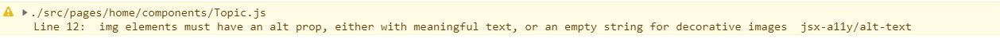
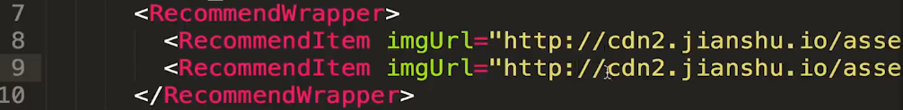
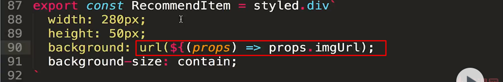
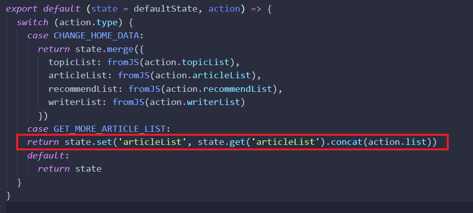
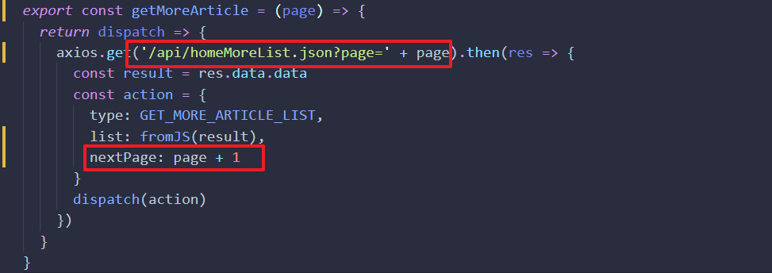
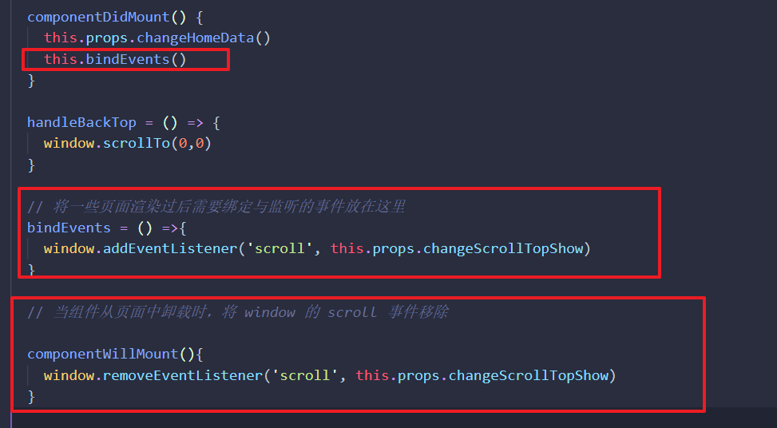
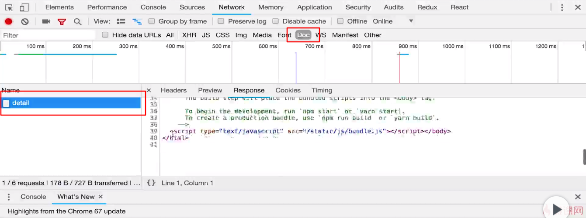

# 8. 项目实战：首页开发

[TOC]

---

## 8.1 什么是路由，如何在 React 中使用路由功能

### 什么是路由

>  更多内容：[理解Web路由](https://zhuanlan.zhihu.com/p/24814675)

- 根据 URL 的不同，显示不同的页面。
- 在 web 开发中，“route”是指根据 url 分配到对应的处理程序（或者说是函数）。（贺师俊在知乎的回答）
- 对于客户端（通常为浏览器）来说，路由的映射函数通常是进行一些DOM的显示和隐藏操作。这样，当访问不同的路径的时候，会显示不同的页面组件。客户端路由最常见的有以下两种实现方案：
  - 基于Hash
  - 基于History API

### 为什么要使用 react-router ？

- 可以根据 url 来显示不同的页面内容，这样用户可以把页面保存在收藏夹中
- 出现页面跳转时不会刷新页面，用户体验更好


### 如何使用路由

- 安装 `npm install react-router-dom`

- 需要使用路由的地方导入 `BrowserRouter` 和 `Router` ，如下：

  ```jsx
  import { BrowserRouter, Route } from 'react-router-dom'
  
  class App extends Component {
    render() {
      return (
        <Provider store={store}>
          <div>
            <Header />
            <BrowserRouter>
              <div>
                <Route path='/' exact component={A}></Route>
                <Route path='/detail' exact component={B}></Route>
              </div>
            </BrowserRouter>
          </div>
        </Provider>
      )
    }
  }
  ```

- 需要注意的地方：

  - `Provider` 和 `BrowserRouter`  组件下只能有一个子元素，因此需要用 div 包裹一下
  - `Route` 的 `path` 属性是一个模糊匹配，也就是如果路径中存在这样的子集也是算匹配成功，会显示 `component` 中的组件，使用 `exact` 属性就是严格匹配。

## 8.2 首页组件的拆分

- BrowserRouter 代表路由器，Route 代表路由，用于根据 url 来显示不同的组件。

### 对路由进行升级

- 创建一个叫做 pages 的文件夹，并在里面建两个文件夹，一个 home，一个 detail
- home 文件夹中创建 index.js，为 react 组件。对 detail 执行相同的操作。
- 接下来就是写 home 和 detail 这两个页面组件了。

### 触发 BFC 清除内部浮动：

- 当子元素都浮动的时候，其父元素无法确定其高度，造成塌陷问题。给父元素一个 overflow: hidden 属性，则可以触发 BFC 清除浮动，从而知道其子元素的高度，解决塌陷问题。
- 可以去搜索了解 BFC 的内容，也可以直接看这篇文章：
  - https://blog.csdn.net/qq_26222859/article/details/52939671

看下面规则中的 6 和 5 条就知道为什么要使用`overflow:hidden`属性了

#### BFC布局规则：

1. 内部的Box会在垂直方向，一个接一个地放置。
2. Box垂直方向的距离由margin决定。属于同一个BFC的两个相邻Box的margin会发生重叠
3. 每个元素的margin box的左边， 与包含块border box的左边相接触(对于从左往右的格式化，否则相反)。即使存在浮动也是如此。
4. BFC的区域不会与float box重叠。
5. BFC就是页面上的一个隔离的独立容器，容器里面的子元素不会影响到外面的元素。反之也如此。
6. **计算BFC 的高度时，浮动元素也参与计算**

#### 哪些元素会生成BFC?

1. 根元素
2. float属性不为none
3. position为absolute或fixed
4. display为inline-block, table-cell, table-caption, flex, inline-flex
5. **overflow不为visible**

### 将 home 页面拆分成不同的组件

页面图示：


拆分：

- 由于 banner 区域在这个示例项目中只是一张图，所以并没有进行拆分
- banner 下的专题区域为 Topic.js
- Topic 下面的的列表区域为 List.js
- 右侧上方的推荐区域为 Recommend.js 
- 右侧下方的作者区域为 Writer.js


### 当写很多个组件时的技巧：

先把页面需要哪些组件想清楚，可以一次性创建多个组件。

写一个初始化组件的模板在那，然后进行复制粘贴：

```jsx
import React from 'react'

class Template extends React.Component {
  render(){
    return (
      <div>Template</div>
    )
  }
}

export default Template
```

## 8.3 首页专题区域布局及 reducer 的设计

### 设计文件目录结构的思路

我们之前所学习到的一种思路是将一个组件的所需文件都放入一个文件夹中，这种方式也被称为**按照特征组织**，比如之前 header 组件，在一个 header 文件夹中会有以下文件：

- actionCreators.js
- index.js
- reducer.js
- style.js

但是，如果我们将所有组件都以这样的形式进行组织就会使整个文件系统非常的庞大，所以我们可以在某些地方以上面的形式组织，比如一些非常大的组件，需要将 action 和 reducer 提出来。而我们将一些小的组件以另外一种方式进行组织，**按类型组织**。

这种方式是将多个组件所需要使用到的东西，比如样式组件（style.js），reducer，actionCreator 放入一个文件中同一管理。

比如，我们在上节课中将 home 这个页面拆分成了 Topic、List、Recommend、Writer 四个组件，那么我们可以将这四个组件的 style.js、reducer、actionCreator 放入一个文件夹中，比如可以直接放到外层的 home 组件的这些文件中。

### 一种排列在区块内项目的方式

图示：


这种要使每一行的第一个 item 与最后一个 item 都与上面对齐（实质是将整个包裹框占满），但对于每个 item 而言，除了每排最后一个 item 之外，其余 item 的右侧都与另外一个 item 之间存在空间，那么就应该添加 margin-right 来实现这个空间，但是每一排的最后一个 item 应该将其 margin-right:0，否则就会跳到下一行去（因为空间不够），但这样的方式需要使用伪类选择器来做。如果不使用伪类我们可以这样来处理：

- 整个包裹 item 的区域给一个 margin-left: -18px，让其向左移动 18px
- 然后给每个 item 设置为 margin-left: 18px

这样看上去就会和图上的效果相同

### immutable 数组与对象的使用

```jsx
const defaultState = fromJS({
  topicList: [
    {
      id: 1,
      title: '手绘',
      imgUrl: '//upload.jianshu.io/collections/images/283250/%E6%BC%AB%E7%94%BB%E4%B8%93%E9%A2%98.jpg?imageMogr2/auto-orient/strip|imageView2/1/w/64/h/64'
    },
    {
      id: 2,
      title: '故事',
      imgUrl: '//upload.jianshu.io/collections/images/95/1.jpg?imageMogr2/auto-orient/strip|imageView2/1/w/64/h/64'
    }
  ]
})
```

- R1 - `defaultState` 是一个 immutable 对象，其内部的所有属性也会转换为 immutable 对象。
- R2 - `topicList` 是 immutable 数组，数组是可以直接使用数组方法的，可以直接作为一个数组来使用，不过其长度属性不再是 length，而是 size
- topicList 所遍历出的每一项也为 immutable 对象，需要使用 get 来获取其值。

## 8.4 首页文章列表制作

需要注意的地方：

```jsx
<ul>
  {list.map(item => (
    <ListItem key={item.get('id')}>
      <a className='pic' href="">
        
      </a>
      <div className='content'>
        <a className='title' href="https://www.baidu.com">{item.get('title')}</a>
        <p className='abstract'>{item.get('abstract')}</p>
      </div>
    </ListItem>
  ))}
</ul>
```

- 注意这里的 list 是 immutable 数组，其内部对象也是 immutable 对象，所以要使用 `get()` 方法来获值。



- 使用 img 标签要记得添加 alt 属性，这是 ESlint 的提示。


## 8.5 首页推荐部分代码编写

### styled-components 使用 props 属性





- 这样使用以后就可以在样式组件传入属性，在编写样式组件的地方调用，从而让相同的样式组件显示不一样的内容。
- 第二张图中少一个花括号。

### CSS 内容 - 浮动只忽视其高度，并不忽视其宽度

图示：


如上图这样的结构，头像与右边的关注是使用的浮动，而昵称和其他信息并没有浮动，所以从高度的角度来看，昵称和其他信息盒子是忽视了浮动元素的高度，但从宽度来看并没有。因此，你可以不用调整任何的宽度而实现文本靠左对齐的效果。

## 8.6 首页异步数据获取

调用接口来获取数据，由于我们所使用到的数据都是首页的，因此我们可以和后端的同学定一个这样的接口：

- /api/home.json

需要注意的：

- 由于我们使用了 immutable 对象，因此我们需要将获取的数据转换为 imuutable，在 reducer 中改变数据时也要使用 set() 或者 merge() 方法

## 8.7 异步操作代码拆分优化

由于被 connect 所调用过的组件我们可以认为是 UI 组件，在 UI 组件中写很多业务逻辑不是很合理，因此我们可以将 UI 组件中的逻辑代码放到 mapDispatch 中，因为你可以想象成 mapDispatch 是某个容器组件中的一部分，而 connect 方法是将这个容器组件和 UI 组件相互连接的工具。

之前在 Home 组件中的代码：

```jsx
class Home extends React.Component {
  componentDidMount() {
    axios.get('/api/home.json').then(res => {
      const result = res.data.data
      const action = {
        type: 'change_home_data',
        topicList: result.topicList,
        articleList: result.articleList,
        recommendList: result.recommendList,
        writerList: result.writerList
      }
      this.props.dispatch(action)
      console.log(res.data)
    })
  }
}
```

优化过后的代码：

```jsx
class Home extends React.Component {
  componentDidMount() {
      this.props.changeHomeData()
  }
}

const mapDispatch = (dispatch) => ({
  changeHomeData: () => {
    axios.get('/api/home.json').then(res => {
      const result = res.data.data
      const action = {
        type: 'change_home_data',
        topicList: result.topicList,
        articleList: result.articleList,
        recommendList: result.recommendList,
        writerList: result.writerList
      }
      dispatch(action)
    })
  }
})

export default connect(null,map)(Home)
```

- 实际上就是把异步请求的过程放到了 mapDispatch 中。

我们除了将异步请求放到 mapDispatch 之内，还可以通过 thunk 将异步请求放到 action 中。

- 放到 action 中时，要记得使用 thunk 的 action 是一个返回函数的 actionCreator。

  ```jsx
  const mapDispatch = (dispatch) => ({
    changeHomeData: () => {
      dispatch(getHomeInfor())
    }
  })
  ```

## 8.8 实现加载更多功能

### 点击获取更多信息：

- 通过点击获取新的数组信息，请求另外一个接口：`/api/homeMoreList.json`
- 发送请求是利用 thunk 中间件在 actionCreator 中发出的。

- 连接两个数组使用方法 concat()：
  
  - 并且两个 immutable 数组也可以这样连接

### 如何让获取的信息每一次都是不同的？

- 给接口传一个值，不过这个要和后台商量好，比如下面这个接口：
  - `/api/homeMoreList.json?page=1`

- 后面那个 1，你可以将其存储在状态中，每一次点击就加 1，然后连接接口字符串：
  - 


### 8.9 返回顶部功能实现

- 由于返回顶部的按钮样式可能只需要一个标签，所以这里就直接放到了 home 文件夹下的 index 中了。并且将其点击事件的回调函数也放在了 home 组件中。这里就有问题了，因为 home 组件是一个 ui 组件，按道理不应该存在处理逻辑的代码，但是结构嘛，不一定要那么严谨，有些时候为了方便就先写在这里了，不行就到时候花点时间重构嘛。
- 使用 `window.scrollTo(0,0)` 方法就可以回到顶部。

### BackTop  的展示和隐藏功能

- 先在 reducer default 中声明一个状态：showScroll 用于判断显示隐藏。
- 绑定一个滚动事件，判断滚动条到某个位置时，使 showScroll 状态为 true
- 绑定浏览器的一些事件可以放入一个固定位置统一管理：
- 
  - 将这个统一存放绑定事件的函数放在 componentDidMount 生命周期函数中执行。
  - 记得当组件卸载时（比如由于路由的跳转改变页面时）要在 componentWillMount 中执行删除绑定的监听事件。


## 8.10 首页性能优化及路由跳转

### 解决浪费性能的问题：

问题：

- 组件使用 connect 与 store 相互连接后，只要 store 发生变化，则组件的 render() 就会重新执行并且重新渲染。那如果这个组件所使用的数据并没有发生变化，但由于其他组件的 action 让 store 发生了变化，这个组件也会 render()，就会浪费性能。

解决方法：

- 通过生命周期函数 shouldComponentUpdata()，判断是否组件中的所使用的数据发生了变化，发生变化返回 true，没有则返回 false。

- 但是每个组件都去写一个 shouldComponentUpdata() 就会很麻烦，因此 React 内置了一个新的组件类型：`PureComponent`

- 这个组件内部帮我们实现了 shouldComponentUpdata，那我们就不用自己来写了。

- 使用：

  - 让每一个使用 Component 组件生成的组件，变为使用 PureComponent 实现的组件

    ```jsx
    // 之前
    class List extends React.Component {
    	...
    }
        
    // 之后
    class List extends React.PureComponent  {
    	...
    }
    ```

需要注意的问题：

- 使用 PureComponent 是因为我们使用了 immutable.js 对数据进行了转换，如果不使用 immutable 而使用 PureComponent 会遇到坑，这个坑偏底层，作者没有讲解。
- 反正记住一点，要使用 PureComponent 优化性能，最好是使用 immutable 来管理数据。
- 如果不想使用 immutable，那最好还是使用 Component 来生成组件，并且使用 shouldComponentUpdata 来优化性能，否则会有潜在的坑。

### 实现 List 中的列表内容跳转到详情页的功能

#### 什么是单页面应用及为什么不使用 a 标签来进行跳转。

- 你可以使用 a 标签将 List 中的 item 包裹起来，并让其 href='/detil'，这样做能够跳转到详情页。但我们这里要使用 'react-router-dom' 这个第三方模块来实现跳转，因为这种跳转是单页面应用跳转。
- 单页面应用跳转：不管你怎么跳转，整个网站只加载一次，而其余数据是通过 ajax 来获取的。
- 如果使用 a 标签，则会加载新的页面：
  
- 我们所创建的项目应该是一个单页面应用，只需要加载一次 html。但是如果我们使用 a 标签进行跳转则会加载多次页面，会有多次请求，会很慢。
- 我们使用'react-router-dom' 就可以实现单页面应用，不需要多次跳转页面。

#### 使用:

- 引入 Link 组件，并将其放入需要跳转的地方。

  ```jsx
  import {Link} from 'react-router-dom'
  
  <Link to='/detail' key={index}>
    <ListItem>
      <div className='pic' href="">
        
      </div>
      <div className='content'>
        <div className='title' href="https://www.baidu.com">{item.get('title')}</div>
        <p className='abstract'>{item.get('abstract')}</p>
      </div>
    </ListItem>
    </Link>
  ```

  - Link 组件的子元素中不能出现 a 标签，否则会报错。
>>>>>>> ea0eed50e655c64bc726e5069556c99c91e44c74
