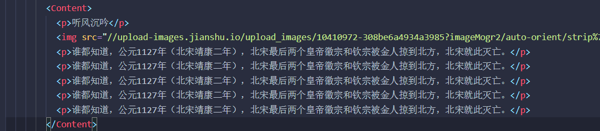
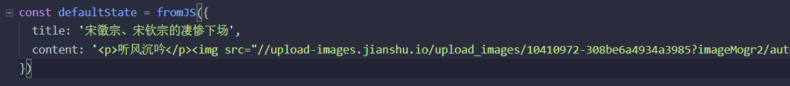
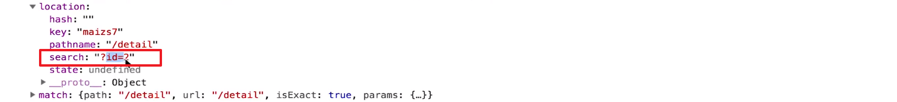

# 9. 项目实战：详情页面和登录功能开发

[TOC]

---

## 9.1 详情页面布局

## 9.2 使用 redux 管理详情页面数据

- 又要给 detail 这个页面组件添加 action、reducer，所以去复制吧，少年！

### 如何把带有 html 的内容存储在 store 中使用：

图示：



- 我们需要将 Content 中的这段内容提出来存储到 store 中（不过实际上这段内容应该是由我们向服务器请求获取的）

- 这段内容的特点是带有 html

- 先将这段内容放在一行，并使他们成为一个字符串，使用单引号，放入 store：
  

- 好，现在出现了一个问题，如果直接使用这个字符串来替代 detail 页面中的内容，就会显示转义后内容，也就是标签也是字符串。不想转义则使用：

  ```jsx
  <Content dangerouslySetInnerHTML={{ __html: content }} />
  ```

  - 注意 dangerouslySetInnerHTML 属性中需要传入的是一个对象，并向这个对象中的属性 __html 传入你想要显示的非转义字符。

## 9.3 异步获取数据

又来了，熟悉的异步获取。

- 由于我们这次的获取是在页面第一次加载的时候，所以可以把这次的异步请求到 `componentDidMount()` 生命周期函数中。（其他的代码就差不多了）
  - 由于使用了 thunk ，我们得把异步请求放到 actionCreator 中。
  - actionCreator 返回一个函数，这个函数内会执行异步请求，最后向 store 派发任务。
  - reducer 接受到任务后执行相关改变 state 的操作。
  - state 更改后，由于我们使用了 react-redux 的 connect 方法给组件传入了 state，所以，只要 store 中的 state 发生变化，那么使用到这个 state 的组件会执行 render() 重新渲染。
  - 记得是使用 mapStateToProps 和 mapDispatchToProps 两个函数来向组件传入 state 和向 store 分派任务。

像 detail 这样的页面向后台请求内容的接口会是这样：`/api/detail?id=1`，然后根据这个返回的内容来渲染页面。也就是不同的详情页面会请求不同的接口。

原因是，我们不可能一次性将这些内容都请求到，我觉得非常重要的一点是，**我们需要什么样的内容才向后台请求什么样的数据。**当然，如果想在某些地方让页面显示更快速，也可以提前请求，不过那个提前请求的时间应该是**在页面显示到用户操作的间隙之间**。

## 9.4 页面路由参数的传递
好了，我们知道我们需要请求不同的页面，但是如何得到这个信息呢？那就要从我们如何跳转到详情页的地方去获取了，比如这里是通过 list 列表中的每一项，因此，我们需要当我们点击这个 list 中的某一项时便获取这一项的 id，用这个 id 去连接一个新的接口出来，然后发送出去。

我们现在要做的是，当我们点击 List 中某一篇内容时会显示这个内容的详情页面。如上面所说，我需要获取 id 并传递给异步请求，下面我们来说一下具体的操作流程：

### 第一种方式：动态路由

- 首先，我们应该将 Link 的跳转路径改变成特定的带有 id 形式的 url：

  ```jsx
  // 之前
  <Link key={index} to='/detail'></Link>
  
  // 之后
  <Link to{'/detail/' + item.get('id')}></Link>
  ```

- 接着，由于我们的 `Route` 使用了 `exact` 属性，因此无法显示带有 id 形式的路由，所以 `path` 需要改变：

  ```jsx
  // 之前
  <Route path='/detail' exact component={Detail} />
  
  // 之后
  <Route path='/detail/:id' exact component={Detail} />
  ```

  - 加上了一个 `:id`

- 接下来是获取 url 中的 id 值。可以在组件的 props 获取：`this.props.match.params.id`

- 把这个 id 值传递给 actionCreator，这样就能使用这个 id 组成一个请求某个文章内容的接口了。

  ```jsx
  axios.get('/api/detail.json?id=' + id)
  ```

这一种方式是通过 url 来获取的 id，然后给接口一个参数，来获取想要的内容。

### 第二种方式：

- 让 Link 跳转的内容带有参数：

  ```jsx
  // 之前
  <Link to{'/detail/' + item.get('id')}></Link>
  
  // 之后
  <Link to{'/detail?id=' + item.get('id')}></Link>
  ```

- 然后把路由状态改回来。

- 这一次 id 的值没有在 `this.props.match.params.id` 里，通过 ? 传递的参数是在 location 中：
  

  - `this.props.location.search`
  - 并且获取的是 `?id=2` 这样的值，所以你可以使用正则把 2 取出来。

- 剩下的操作和第一种方式就一样了。

推荐使用第一种方式。

## 9.5 登录页面布局

- 提高性能使用 `PureComponent` 来创建组件
- 如果一个盒子 A 中的某一部分被盒子 B 遮蔽，可以让 A 的 z-index 值大于 B，从而让 A 的一部分能够显示。

- 利用设置 `position: absolute;` 来让这个盒子的高度变为占整个页面的高度：

  ```jsx
  export const LoginWrapper = styled.div`
    z-index:0;
    position: absolute;
    left: 0;
    right: 0;
    bottom: 0;
    top: 56px;
    background: #eee;
  `
  ```

## 9.6 登录功能实现

通过 innerRef 属性来获取使用了 styled-components 包所创建的 input 的真实引用：

```jsx
<Input placeholder='账号' innerRef={(input) => this.account = input} />
```

- 注意这里的 Input 组件是由 styled-components 所生成的。


使用 `react-router-dom`中的 `Redirect` 组件能够让页面自动重定向到指定位置（无需点击）：

```jsx
  render() {
    const { disptchLogin, isLogin } = this.props

    if (!isLogin) {
      return (
        <LoginWrapper>
          <LoginBox>
            <Input placeholder='账号' innerRef={(input) => this.account = input} />
            <Input placeholder='密码' type='password' innerRef={(input) => this.password = input} />
            <Button onClick={() => { disptchLogin(this.account, this.password) }}>登录</Button>
          </LoginBox>
        </LoginWrapper>
      )
    } else {
      return <Redirect to='/' />
    }
  }
}
```

## 9.7 登录鉴权及代码优化

如何有一个页面只有用户登录才能够访问，比如这个项目中的写文章页面 Write。这个情况我们应该如何做呢？

- 其实很简单，因为你登录以后会给 store 中的 loginReducer.islogin 传入是否登录的信息，登录了为 true 没有登录则为 fasle。因此，我们可以使用这个参数来让 Write 组件中的 render 以上面那段代码的形式进行返回，如果为 true 则能够显示页面内容，为 false 则重定向到 '/login'

### 代码优化

- reducer 部分如果内容较多可以将其中的一部分提出来封装（其实对于整个项目而言都应该这样做）
- 在一些 actionCreators 中有一些 actionCreactor 我们使用了异步，但很多时候都只处理了请求成功，也就是调用 then() ，而实际开发过程中我们应该请求也要处理请求失败的情况，也就是要调用 catch() ，比如可以告诉用户，这次请求失败请刷新重试。

## 9.8  异步组件及 withRouter 路由方法的使用

在目前这个项目中，第一次请求页面以后会获得一个 bundle.js 的文件，当你去跳转到其他页面时，并不会再次请求，因为所有页面的内容都在这个 bundle.js 文件中。但这种情况是不太好的，因为这样首页的加载会变得很慢。因此，我们想当我们访问首页时，只加载首页的内容，当我们访问详情页时只加载详情页的代码，这个时候我们就应该使用异步组件。

异步组件的底层实际是很复杂的，但我们使用第三方的模块来实现就非常的简单。比如：

- `react-loadable`  可以去 GitHub 上查看相关文档。

### 如何使用？

- 安装

- 接下来到我们需要加载的页面文件夹中，比如这里的 detail 页面，创建一个叫 `loadable.js` 的文件，拷贝官方示例的代码到文件中并修改：

  ```jsx
  import React from 'react' // 引入 React 以使用 JSX 语法
  import Loadable from 'react-loadable';
  
  const LoadableComponent = Loadable({
    loader: () => import('./'), // 需要加载的组件，是当前文件的 index.js
    loading: () => <div>正在加载...</div>, // 加载时所显示的组件，需要传入一个函数
  });
  
  export default () => <LoadableComponent/> // 返回这个无状态组件
  ```

- 接下来我们需要改 App.js 文件中的路由，把加载 Detail 组件的地方改为加载异步组件：

  ```jsx
  // 之前
  import Detail from './pages/detail'
  
  //之后
  import Detail from './pages/detail/loadable'
  
  // 没有被改变的路由
  <Route path='/detail/:id' exact component={Detail} />
  ```
  - 这里会有一个问题，由于现在 Detail 是 loadable.js 这个组件，而真正的 Detail 是 loadable.js 这个组件的子组件，所以，真正的 Detail 无法获取由 Route 组件所传来的 `this.props.match.params.id` 属性值。这里需要处理一下

  - 在 Detail 组件中引入 withRouter 方法，并在导出 Detail 组件的地方，将 Detail 传入到这个方法中就行了：

    ```jsx
    import { withRouter } from 'react-router-dom'
    
    export default connect(mapState, mapDisptch)(withRouter(Detail))
    ```

  - 这样以后，Detail 组件就能获取到 route 传过来的参数。