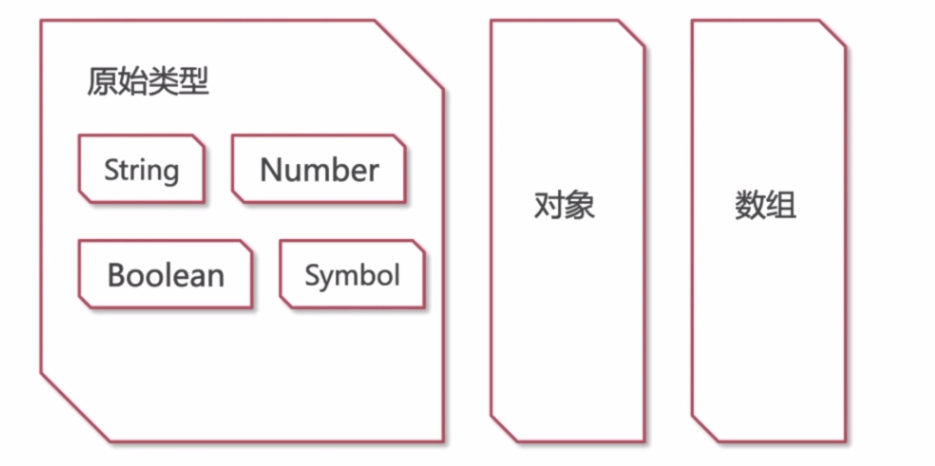
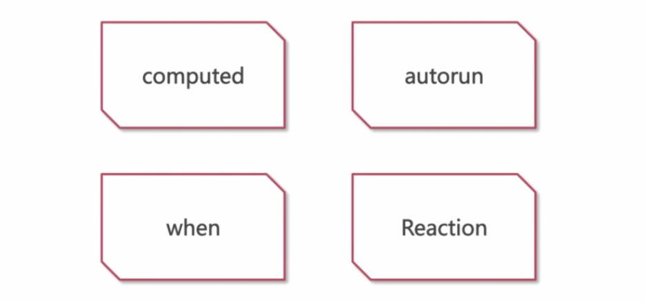

[TOC]

## 3-1 可观察的数据

> 第3章 mobx常用api讲解:
>
> api的使用场景；
>
> 运行结果演示，说明；
>
> 可观察数据

在接下来的三节课中，我们将分别认识 mobx 的三种基础概念，可观察的数据、对可观察的数据做出反应、修改可观察的数据。掌握这几个概念以及它们相对应的 api 后，我们也就掌握了灵活的控制数据流的能力，换句话说，我们也就具备了利用 mobx 维护应用程序状态的能力。

这节课先来学习**可观察的数据** - observable

### 什么是 observable

observable 是一种让数据的变化可以被观察的方法，本节课我们将学习如何利用 mobx 将数据变得可被观察，至于如何去观察数据的变化，我们将在接下来的两节课中继续学习。

### 哪些数据可被观察

理论上来说，所有数据都可被观察，但是我们常用的无外乎就以下几种：



### 项目代码部分

安装 mobx 依赖：

```js
npm i mobx -S
```

代码：

```js
import { observable, isArrayLike, extendObservable } from 'mobx'

// observable.box 是另一个重要的函数

// 接下里使用 observable 将变量转化为可被观察的对象
// mobx 对任意变量的处理方式有两种，
//一、对于数组、对象、ES6 的 map，直接把 observable 作为函数将变量转化为可观察对象，之后对数组、对象、map 内部数据进行合理的操作都将会被监视
//二、对于第一点中没有包含的其他类型，都必须调用 observable.box 来将变量包装为可观察的对象，之后对该变量直接赋值都会被监视

// 第一类：array object map

// array
const arr = observable(['a', 'b', 'c'])

console.log(arr) // Proxy {0: "a", 1: "b", 2: "c", Symbol(mobx administration): ObservableArrayAdministration}
console.log(isArrayLike(arr)) // true

// 虽然被 observable 处理后的数组不是真正数组，但是却保留的数组中的大部分功能和方法
// 比如可以直接访问数组的成员
console.log(arr[0]) // 'a'

// 又比如调用数组的常用方法
console.log(arr.pop(), arr.push(1))  // c 3

// 但是尽量不要使用下标越界来访问数组成员，否则会被警告
//因为越界的值不会被监视，所以在处理数组之前最好先判断数组的长度并进行处理，避免越界长度的访问
console.log(arr[4]) // [mobx.array] Attempt to read an array index (4) that is out of bounds (3). Please check length first. Out of bound indices will not be tracked by MobX

// object
const obj = observable({a: 1, b: 2}) 
console.log(obj) // Proxy {Symbol(mobx administration): ObservableObjectAdministration}

// mobx 只对已有的属性进行监视，如果要监视新增加的属性，需要调用 mobx 提供的 extendObservable() 方法
// 因此，最佳的实践应该是在程序初始化时就声明所有可能使用到的属性
console.log(obj.a, obj.b) // 1 2

// map
const map = observable(new Map())

console.log(map) // ObservableMap {enhancer: ƒ, name: "ObservableMap@3", _keysAtom: Atom, _data: Map(0), _hasMap: Map(0), …}

map.set('a',1)

console.log(map.has('a')) // true

map.delete('a')

console.log(map.has('a')) // false

// 上面所讲到三种类型，是应用中使用最多的复杂变量类型，mobx 对他们都有很好的封装，可以实现对复杂数据结构内部成员的监视
// 对于其他的原始类型，mobx 实现了对其他原始类型整体赋值的监控，也就是说虽然原始类型 mobx 没有监控，但做到了对变量引用本身的监控，这在原始类型状态数据上非常有用
// 比如 number string boolean 类型
// 对于这些类型，mobx 需要使用 observable.box 函数，将其包装为可被观察的对象
var num = observable.box(20)
var str = observable.box('hello')
var bool = observable.box(true)

console.log(num, str, bool) 
//ObservableValue {name: "ObservableValue@4", isPendingUnobservation: false, isBeingObserved: false, observers: Set(0), diffValue: 0, …} 
//ObservableValue {name: "ObservableValue@5", isPendingUnobservation: false, isBeingObserved: false, observers: Set(0), diffValue: 0, …} 
//ObservableValue {name: "ObservableValue@6", isPendingUnobservation: false, isBeingObserved: false, observers: Set(0), diffValue: 0, …}

// 如何获取原始类型值？ 使用 get 方法
console.log(num.get(), str.get(), bool.get())  // 20 "hello" true
// 使用 set 方法则修改原始值
num.set(30), str.set('world'), bool.set(false)
console.log(num.get(), str.get(), bool.get())  // 30 "world" false

//之前无论是使用 observable.box 方法还是 observable 函数本身对数据变量的封装都是函数式风格的
// mobx 为我们提供了更简单易用的 decorator 修饰器
// 在上节课中我们学习到 decorator 只能用于修饰类与类成员，这里我们修饰一个 class，然后在其中添加用于修饰的类成员
class Store{
  @observable arr = [];
  @observable obj = {};
  @observable map = new Map();
  // mobx 对 observable 函数做了手脚，能够识别是通过普通函数调用还是修饰器调用，如果是修饰器则自动帮我们识别变量类型并使用不同的包装转换方案
  @observable string = 'hello';
  @observable number = 20;
  @observable bool = false;
}
```

本节课我们首先学习了 使用 `observable` 和 `observable.box` 将各种类型转换为可观察对象，对于复杂类型，转换后的可观察对象有原来对象相似的操作方法，接着我们接触到了 mobx 为我们提供的 decorator API，为我们以后使用面试对象的方式管理应用程序状态打下了基础。

下节课我们将学习如何知道对象被修改了，也就是如何对可观察对象做出反应。


## 3-2 对可观察对象做出反应

上一节课我们学习了利用 mobx API 将状态变量转换为可观察数据，特别是使用 decorator 装饰器的方式，但这不是我们的最终目的，我们的目的是要监视到变量的更改并执行我们自定义的逻辑。这节课，我们就要学习如何对可观察的数据做出反应。

本节课要接触的 API：



使用方法代码：

```js
class Store {
  @observable arr = []
  @observable obj = {}
  @observable map = new Map()
  // mobx 对 observable 函数做了手脚，能够识别是通过普通函数调用还是修饰器调用，如果是修饰器则自动帮我们识别变量类型并使用不同的包装转换方案
  @observable string = 'hello'
  @observable number = 20
  @observable bool = false
  
  @computed get mixed() {
    return store.string + '/' + store.number
  }
}

// computed - 计算值，将其他可观察数据以你所想要的方式组合起来变成一个新的可观察数据，因此从不同的角度看，computed 则具有不同的功用
// 比如说，从其他可观察数据角度来看，computed 就是对可观察数据的反应
// 如果是从使用 computed 的值的角度来看，它就是一个可观察数据
// 一般我们还是将其当作是可观察数据所做出的反应
// 从使用方法上 computed 也有两种用法，作为普通函数和作为 decorator

// 普通函数用法
var store = new Store()
// 使用 store 实例的 string 和 number 来实现一个计算值,注意我们需要传给 computed 一个无参数的函数,函数内部可以引用其他可观察数据,最后返回计算值
var foo = computed(function() {
  return store.string + '/' + store.number
})

console.log(foo) // ComputedValue {dependenciesState: -1, observing: Array(0), newObserving: null, isBeingObserved: false, isPendingUnobservation: false, …}

// 使用 get 方法获得这个计算值的最终值
console.log(foo.get()) // hello/20

// 为了能够监视到数据的变化，我们必须在返回的 computed 的 value 对象上调用 observe 方法
// 该方法需要一个函数入参，该函数入参也需要一个 change 的入参，change 本身存储了修改前后变量的值
foo.observe(function(change){
  console.log('change', change)
})

// 接下来我们修改实例上的 string 与 number
store.string = 'world'
store.number = 30

// 会打印两个 change 对象，第一个是因为 string 发生了变化，第二个是因为 number 发生了变化
// change {type: "update", object: ComputedValue, newValue: "world/20", oldValue: "hello/20"}
// change {type: "update", object: ComputedValue, newValue: "world/30", oldValue: "world/20"}
// 这样我们就实现了通过 computed 监视到两个可观察数据的变化
// 不过 computed 更多情况下是作为 decorator 来修饰类的 getter 的守信成员的，比如在 Store 中修饰一个 get mixed 成员
// 但使用修饰器的方式则无法调用 observe 方法了，这个时候我们就要使用一个新的 api ：autorun
// atuorun 从名字上来看是自动运行，那么就有两个问题，一是自动运行什么，二是什么触发自动运行
// autorun 自动运行的是传入 autorun 的函数参数
autorun(() => {
  console.log(store.string + '/' + store.number) // 这里会被执行一次
})
// 什么操作会触发自动运行？ - 修改 autorun 中的引用的任意可观察数据
store.string = 'world2'
store.number = '40'
// world2/30
// world2/40
// 可以看到这两次操作分别让 autorun 自动运行了一次

// 总结来看，autorun 作用是在可观察数据被修改之后，自动去执行依赖可观察数据的行为，这个行为一般指的是传入 autorun 的函数
// 那么 autorun 的这种行为有什么用处？
// 试想一想，如果应用程序的状态都是可观察数据，而应用程序渲染 UI 写入缓存等副作用都是 autorun，那么我们是否可以无视这个副作用逻辑，专心编写代码，只与数据状态打交道呢？
// 这个想法很令人兴奋，但我们还遇到一个问题，那就是如果状态数据数量众多，每修改一个就触发 autorun 副作用则很浪费计算资源，这个问题下节课再讲解

// 在 autorun 中单独引用 mixed
autorun(() => {
  console.log(store.mixed)
})
store.string = 'world2'
store.number = '40'
// world2/30
// world2/40
// 会发现和之前单独对实例中的属性进行调用是一样的，这就说明了 computed 的值是可以作用一种新的可观察数据来看待的,这也是 computed 的常用使用方式
// 再提一点，computed 的值除了可以引用普通观察数据之外，也可以嵌套引用其他 computed 的值，但不能有循环引用
// autorun 执行的条件是其引用的可观察数据发生了变化，这个条件很宽泛
// 在日常的逻辑开发中，我们会经常遇到只有条件 A 成立才去执行逻辑 B 这样需求场景
// 在 autorun 中去实现则需要自己去判断条件 A，而 mobx 为我们提供了一个简单的 API 来做这件事情：when

// when 接受两个函数参数，第一函数必须根据可观察数据来返回一个布尔值，当该布尔值为 true 的时候，就去执行第二个函数，并且保证最多只执行一次
// 第一个函数依然会先执行一次
when(() => store.bool, () => console.log("It's true"))

store.bool = true
// It's true

//使用 when 需要注意两点
// 一是第一个函数中必须使用可观察数据来布尔类型的计算返回值，不能使用普通变量
// 二是如果一个函数一开始就返回真，那么第二个函数就会同步立即执行，比如上面将 store.bool 初始值设为 true，创建 when 的时候就会同步执行第二个函数

// 对于 autorun，无论是否修改可观察数据，autorun 传入的函数都会先执行一次，这种行为是可以理解的，因为如果不执行也不知道哪些观察数据被引用，更做不到这些数据被修改时再去触发 autorun 的逻辑来
// 但是假单独告诉 mobx 我引用了哪些可观察数据，是否这些副作用逻辑就不会先行执行了
// 是的，mobx 为我们提供了reaction api 可以很好的解决这个任务 
// reaction 函数也接受两个函数类型的参数，第一个函数引用可观察数据并返回一个值，这个值会作为第二个函数的参数
// 在初始化的阶段，第一个函数会被先执行一次，这样 mobx 就会知道有哪些可观察数据被引用了,并在这些数据被修改后，执行后面的第二个函数
// 这样就可以不必执行副作用，就可以建立副作用到可观察数据之间的联系
reaction(() => [store.string, store.number], arr => console.log('arr', arr))
store.string = 'hello reaction'
store.number = '50'
//arr (2) ["hello reaction", "40"]
//arr (2) ["hello reaction", "50"]

// 有什么创建会使用到 reaction 呢？
// 在没有数据之前，我们不想也没有必要调用写缓存的逻辑，可以用 reaction 来实现数据第一次被填充之后来启动写缓存的逻辑
```


###  回顾：

- computed 可以将多个可观察数据组件成一个可观察数据
- autorun 可以自动追踪所引用的可观察数据，并在数据发生变化时重新触发传入的回调
- when 提供来条件来执行逻辑，算是 autorun 的一种变种
- readtion 可以通过分离可观察数据声明以副作用的方式对 autorun 做出来改进

它们各有特定互为补充，都能在合适的需求中发挥作用。

本节课可以说是 mobx 的精髓，与上节课的内容配合起来几乎构成了 mobx 的核心功能。

在本节课中我们遗留了一个问题——频繁的数据变动会重复触发副作用，虽然功能实现了，但是却会浪费性能，下节课会解决这个问题。


> 课后问题：
>
> reaction 和 when有什么具体区别吗，课中内容给我的感觉两者功能是一样的
>
> when 和 autorun 是一个类型，依赖到的数据符合条件就会执行，但是 **when 只执行一次，会自动销毁。**
>
> reaction 是对期望的数据进行观察，并且会将观察的数据作为参数传给你的回调，当你期望观察的数据变化，执行相应的操作
>
> https://www.imooc.com/qadetail/293662


## 3-3 修改可观察数据

> mobx 常用 API - 修改可观察数据（ action）

上节课在谈到对可观察数据做出反应的时候，需要我们手动修改可观察数据的值，这种修改是通过直接向变量赋值来实现的。虽然简单易懂，但会带来一个较为严重的副作用，也就是每一次的修改都会触发 `autorun` 或 `reaction` 运行一次，在多数情况下，这种高频的触发是完全没有必要的。比如用户对视图的一次点击操作就要同步修改 N 个状态变量，但是视图的更新却只需要一次就够了，为了优化这个问题， mobx 同样引入了 action 的概念， action 被定义为任何修改状态的行为。使用 action 的收益是将多次对状态进行赋值合并为一次从而减少触发 autorun 或者 reaction 的次数。

### 实例代码：

 ```js
// action
// action 依然有两种使用方式---普通函数和 decorator
// 这里先使用 decorator 的方式，定义一个方法 bar，并用 action decorator 来装饰
class Store {
  @observable arr = []
  @observable obj = {}
  @observable map = new Map()
  // mobx 对 observable 函数做了手脚，能够识别是通过普通函数调用还是修饰器调用，如果是修饰器则自动帮我们识别变量类型并使用不同的包装转换方案
  @observable string = 'hello'
  @observable number = 20
  @observable bool = false

  @computed get mixed() {
    return store.string + '/' + store.number
  }

  @action.bound bar() {
    store.string = 'hello action'
    store.number = 60
  }
}

const store = new Store()

// 这里我们通过调用 bar 方法来对 string 和 number 实现连续修改，来观察其对 reaction 的影响
reaction(() => [store.string, store.number], (arr) => console.log(arr))

store.bar() // (2) ["hello action", 60]
// 可以看到 reaction 只被调用了第一次

// 作为 decorator，action 还有一种变种——action.bound
// 与 action 相比 action.bound 只是多了把被修饰的方法的上下文强制绑定到该对象上而已
let bar = store.bar
bar() // ["hello action", 60]
// 仍然可以正常调用
// 这种写法（action.bound）特别是在将方法作为 callback 传给其他对象时特别有用，无论是 action 还是 action.bound 都需要绑定在预先定义的方法上

// mobx 还提供了一种语法糖，允许随时定义匿名的 action 方法并运行它，这个 API 叫做 runInAction
runInAction('modify',() => {
  store.string = 'hello runInAction'
  store.number = 70
})
// => (2) ["hello runInAction", 70]
// 实际上这和调用 start.bar 相同的
// 对于有多处重复调用的修改状态逻辑，建议使用 action 来实现复用，则用 runInAction 即可 
// runInAction 用可以接受一个字符串类型参数，就像用 decorator 修饰的方法名一样，一般来说对调试比较友好，如上面中的 ‘modify'

 ```

从程序性能的角度来看，我们应该始终使用 action，即使 action 内部只会对一个状态进行修改，因为使用 action 相比直接修改状态更利于 debug。

在接下来的课程中，会看到我们会编写大量的 action 方法。

本章围绕着数据，从三个角度对 mobx 的 API 进行了学习，**可观察数据**、**对可观察数据的反应**和**修改可观察数据**构成了一个闭环，着重强调了 mobx 的运作机理。


