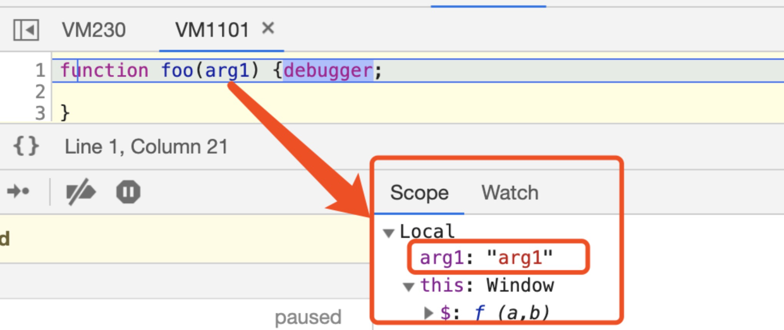
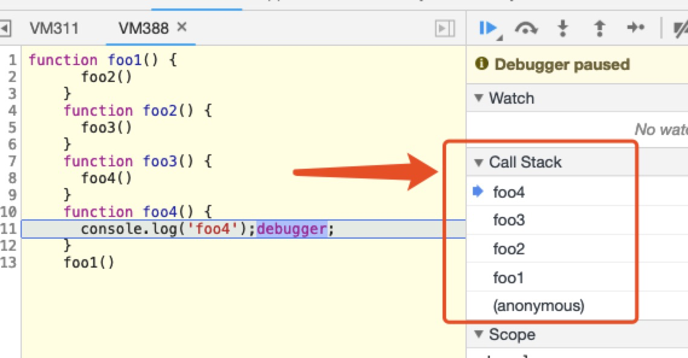
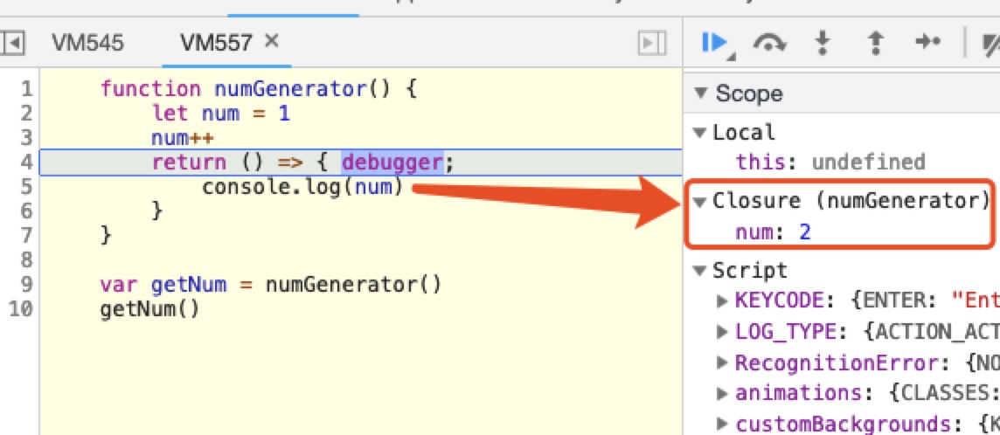

# 第一部分的总结与归纳

[TOC]

## 1-1 this

### 概念

#### this

调用函数时会创建新的属于函数自身的执行上下文。执行上下文的调用创建阶段会决定 `this`的指向。到此，我们可以得出的一个结论：`this` 的指向，是在调用函数时根据执行上下文所动态确定的。

具体环节和规则，可以先“死记硬背”以下几条规律，后面再慢慢一一分析：

- 在函数体中，简单调用该函数时（非显式/隐式绑定下），严格模式下 `this` 绑定到 `undefined`，否则绑定到全局对象 `window`／`global`；
- 一般构造函数 `new` 调用，绑定到新创建的对象上；
- 一般由 `call`/`apply`/`bind` 方法显式调用，绑定到指定参数的对象上；
- 一般由上下文对象调用，绑定在该对象上；
- 箭头函数中，根据外层上下文绑定的 `this` 决定 `this` 指向。

#### this 优先级相关

我们常常把通过 `call`、`apply`、`bind`、`new` 对 `this` 绑定的情况称为显式绑定；根据调用关系确定的 `this` 指向称为隐式绑定。

**那么显式绑定和隐式绑定谁的优先级更高呢？**

-  `call`、`apply` 的显式绑定一般来说优先级更高。
- new 绑定的优先级比显式 bind 绑定更高。

### 问题

#### new 操作符调用构造函数，具体做了什么？

1. 创建一个其属性 `__proto__` 的指向为构造函数的 `prototype` 属性的对象，有两种方式：

   - 使用 `Object.create(Constructor.prototype)` 方法创建一个对象

   - 创建一个空白对象，然后将其 `__proto__` 指向构造函数的`prototype`

     ```js
     var obj = {}
     obj.__proto__ = Constructor.prototype
     ```

2. 将新创建的对象赋值给 `this`

   ```jsx
   this = Object.create(Constructor.prototype)
   
   // 或者
   
   this = obj
   ```

3. 执行构造函数中的逻辑，主要是为 `this` 对象实例赋值

4. 返回 `this` 实例

> 如果在构造函数中出现了显式 `return` 的情况
>
> 如果构造函数中显式返回一个值，且返回的是一个对象，那么 `this` 就指向这个返回的对象；如果返回的不是一个对象，那么 `this` 仍然指向实例。

### 面试题

#### 实现一个 bind 函数

在实现 bind 函数之前，你得先了解 bind 函数的作用，根据 MDN 的描述，如下：

> `bind()` 方法创建一个新的函数，在调用时设置`this`关键字为提供的值。并在调用新函数时，将给定参数列表作为原函数的参数序列的前若干项。

也就是说，`bind()` 除了能够改变 `this` 参数之外，也能够在返回的函数执行之前提前传递参数，并将参数作为原函数的前若干项。如下：

```js
function.bind(thisArg[, arg1[, arg2[, ...]]])
```

那么，我们自己实现时就应该注意除了绑定 `this` 之外也需要将之后的参数列表传入新的返回函数之中执行，比如：

```js
// 先通过短路求值进行兼容处理，如果已有 bind 方法，那么就执行使用环境现有的
Function.prototype.bind = Function.prototype.bind || function (context) {
  	// 当调用 bind 方法时，this 就是函数本身
    var me = this;
    // 拿到传入给 bind 除第一个参数之后的参数列表
    var args = Array.prototype.slice.call(arguments, 1);
    return function bound () {
        // 获取返回后的函数的参数
        var innerArgs = Array.prototype.slice.call(arguments);
        // 将传入 bind 的参数列表与返回后的参数列表合并
        var finalArgs = args.concat(innerArgs);
        // 利用 apply 来更改 this 指向并传入合并后参数进行调用
        return me.apply(context, finalArgs);
    }
}
```

这样的实现已经非常不错了。但是，就如同之前 `this` 优先级分析所示：**bind 返回的函数如果作为构造函数，搭配 new 关键字出现的话，我们的绑定 this 就需要“被忽略”。**

为了实现这样的规则，开发者就应该需要考虑如何区分这两种调用方式。**具体来讲 bound 函数中就要进行 this instanceof 的判断。**

另外一个细节是，函数具有 `length` 属性，表示形参的个数。上述实现方式形参的个数显然会失真。我们的实现就需要对 `length` 属性进行还原。可是**难点在于：函数的 length 属性值是不可重写的。**

这样的内容一般属于“超纲”范畴，但在面试中能够很好地体现面试者平时的积累，以及对源码的阅读和思考，显然是加分项。对此进一步的理解，读者可参考我的原创文章：[从一道面试题，到“我可能看了假源码”](https://www.jianshu.com/p/6958f99db769)。这篇文章发表于 2017 年年初，可以说是现在很多研究 `bind` 相关文章的启蒙。

## 1-2 作用域、执行上下文、调用栈、闭包、内存管理和内存泄漏

### 概念

#### 作用域

作用域其实就是一套规则：这个规则**用于确定在特定场景下如何查找变量**。任何语言都有作用域的概念，同一种语言在演进过程中也会不断完善其作用域规则。比如，在 JavaScript 中，ES6 出现之前只有函数作用域和全局作用域之分。

在 JavaScript 执行一段函数时，遇见变量读取其值，这时候会“就近”先在函数内部找该变量的声明或者赋值情况。这里涉及“变量声明方式”以及“变量提升”的知识点，我们后面会涉及到。如果在函数内无法找到该变量，就要跳出函数作用域，到更上层作用域中查找。同时“更上层作用域”也可以顺着作用域范围向外扩散，一直找到全局作用域。

变量作用域的查找是一个扩散过程，就像各个环节相扣的链条，逐次递进，这就是**作用域链**说法的由来。

#### 暂时性死区

使用 `let` 或 `const` 声明变量，会针对这个变量形成一个封闭的块级作用域，**在这个块级作用域当中，如果在声明变量前访问该变量，就会报 referenceError 错误**，因此在相应花括号形成的作用域中，存在一个“死区”，起始于当前作用域开头，终止于相关变量声明的一行。在这个范围内无法访问 `let` 或 `const` 声明的变量，这个“死区”的专业名称为： TDZ（Temporal Dead Zone），相关语言规范的介绍读者可参考 [ECMAScript® 2015 Language Specification](http://www.ecma-international.org/ecma-262/6.0/#sec-let-and-const-declarations) ，喜欢刨根问底看规范的读者可以了解一下。

##### 极端例子

函数的参数默认值设置也会受到 TDZ 的影响：

```js
function foo(arg1 = arg2, arg2) {
    console.log(`${arg1} ${arg2}`)
}
```

在上面 `foo` 函数中，如果第一个参数没有传，将会使用第二个参数作为第一个实参值。调用：

```js
function foo(arg1 = arg2, arg2) {
    console.log(`${arg1} ${arg2}`)
}

foo('arg1', 'arg2')
// 返回：arg1 arg2
```

返回内容正常，但是当第一个参数缺省时，执行 `arg1 = arg2` 会当作暂时性死区处理：

```js
function foo(arg1 = arg2, arg2) {
    console.log(`${arg1} ${arg2}`)
}

foo(undefined, 'arg2')

// Uncaught ReferenceError: arg2 is not defined
```

因为除了块级作用域意外，函数参数默认值也会受到 TDZ 影响。

这里我再“抖个机灵”，看看下面的代码会输出什么？

```js
function foo(arg1 = arg2, arg2) {
    console.log(`${arg1} ${arg2}`)
}

foo(null, 'arg2')
```

输出：`null arg2`，这就涉及到 `undefined` 和 `null` 的区别了。在执行 `foo(null, 'arg2')`时，不会认为“函数第一个参数缺省”，而会直接接受 `null` 作为第一个参数值。

既然“已经偏题”，那我索性再分析一个场景，顺便引出下面的知识点：

```js
function foo(arg1) {
    let arg1
}

foo('arg1')
```

猜猜将会输出什么？

实际上会报错：Uncaught SyntaxError: Identifier 'arg1' has already been declared。这同样跟 TDZ 没有关系，而是因为函数参数名会出现在其“执行上下文/作用域”当中。

在函数的第一行，便已经声明了 `arg1` 这个变量，函数体再用 `let` 声明，会报错（这是 `let` 声明变量的特点，ES6 基础内容，不再展开），类似：

```js
function foo(arg1) {
    var arg1
    let arg1
}
```

请看示意图：



#### 执行上下文

**执行上下文**就是当前代码的执行环境/作用域，和前文介绍的作用域链相辅相成，但又是完全不同的两个概念。直观上看，执行上下文包含了作用域链，同时它们又像是一条河的上下游：有了作用域链，才有了执行上下文的一部分。

**JavaScript 执行主要分为两个阶段：**

- 代码预编译阶段
  - **预编译阶段是前置阶段，这个时候由编译器将 JavaScript 代码编译成可执行的代码。** 注意，这里的预编译和传统的编译并不一样，传统的编译非常复杂，涉及分词、解析、代码生成等过程 。这里的预编译是 JavaScript 中独特的概念，虽然 JavaScript 是解释型语言，编译一行，执行一行。但是在代码执行前，JavaScript 引擎确实会做一些“预先准备工作”。
- 代码执行阶段
  - **执行阶段主要任务是执行代码，执行上下文在这个阶段全部创建完成。**

在通过语法分析，确认语法无误之后，JavaScript 代码在预编译阶段对变量的内存空间进行分配，我们熟悉的变量提升过程便是在此阶段完成的。经过预编译过程，我们应该注意三点：

- 预编译阶段进行变量声明；
- 预编译阶段变量声明进行提升，但是值为 undefined；
- 预编译阶段所有非表达式的函数声明进行提升。

结论：作用域在预编译阶段确定，但是作用域链是在执行上下文的创建阶段完全生成的。因为函数在调用时，才会开始创建对应的执行上下文。执行上下文包括了：变量对象、作用域链以及 `this`的指向，如图所示：


代码执行的整个过程说起来就像**一条生产流水线**。第一道工序是在预编译阶段创建**变量对象**（Variable Object），此时只是创建，而未赋值。到了下一道工序代码执行阶段，变量对象转为**激活对象**（Active Object），即完成 VO → AO。此时，作用域链也将被确定，它由当前执行环境的变量对象和所有外层已经完成的激活对象组成。这道工序保证了变量和函数的有序访问，即如果当前作用域中未找到变量，则继续向上查找直到全局作用域。

这样的工序在流水线上串成一个整体，这便是 JavaScript 引擎执行机制的最基本原理。

#### 调用栈

了解了上面的内容，函数调用栈便很好理解了。我们在执行一个函数时，如果这个函数又调用了另外一个函数，而这个“另外一个函数”也调用了“另外一个函数”，便形成了一系列的调用栈。

比如我们通过「打断点」的方式来查看 chrome 中的执行情况：



可以看到「Call Stack」栏中关于函数的调用信息。

> **注意**　正常来讲，在函数执行完毕并出栈时，函数内局部变量在下一个垃圾回收节点会被回收，该函数对应的执行上下文将会被销毁，这也正是我们在外界无法访问函数内定义的变量的原因。也就是说，只有在函数执行时，相关函数可以访问该变量，该变量在预编译阶段进行创建，在执行阶段进行激活，在函数执行完毕后，相关上下文被销毁。

#### 闭包

闭包并不是 JavaScript 特有的概念，社区上对于闭包的定义也并不完全相同。虽然本质上表达的意思相似，但是晦涩且多样的定义仍然给初学者带来了困惑。我自己认为比较容易理解的闭包定义为：

> 函数嵌套函数时，内层函数引用了外层函数作用域下的变量，并且内层函数在其他环境下可访问，就形成了闭包。

我们看一个简单的代码示例：

```js
function numGenerator() {
    let num = 1
    num++
    return () => {
        console.log(num)
    } 
}

var getNum = numGenerator()
getNum()
```

这个简单的闭包例子中，`numGenerator` 创建了一个变量 `num`，返回打印 `num` 值的匿名函数，这个函数引用了变量 `num`，使得外部可以通过调用 `getNum` 方法访问到变量 `num`，因此在 `numGenerator` 执行完毕后，即相关调用栈出栈后，变量 `num` 不会消失，仍然有机会被外界访问。

执行代码，能清晰地看到 JavaScript 引擎的分析：



`num` 值被标记为 Closure，即闭包变量。

我们知道正常情况下外界是无法访问函数内部变量的，函数执行完之后，上下文即被销毁。但是在（外层）函数中，如果我们返回了另一个函数，且这个返回的函数使用了（外层）函数内的变量，外界因而便能够通过这个返回的函数获取原（外层）函数内部的变量值。这就是闭包的**基本原理**。

闭包这个概念为 JavaScript 中访问函数内变量提供了途径和便利。这样做的好处很多，比如我们可以利用闭包实现“模块化”；再比如，翻看 Redux 源码的中间件实现机制，也会发现（函数式理念）大量运用了闭包。

#### 内存管理

内存管理是计算机科学中的概念。不论是什么程序语言，内存管理都是指对内存生命周期的管理，而内存的生命周期无外乎：

- 分配内存空间
- 读写内存
- 释放内存空间

我们用代码来举例：

```js
var foo = 'bar' // 在堆内存中给变量分配空间
alert(foo)  // 使用内存
foo = null // 释放内存空间
```

我们知道内存空间可以分为栈空间和堆空间，其中

- 栈空间：由**操作系统自动分配释放**，存放函数的参数值，局部变量的值等，其操作方式类似于数据结构中的栈。
- 堆空间：一般**由开发者分配释放**，这部分空间就要考虑垃圾回收的问题。

在 JavaScript 中，数据类型包括（未包含 ES Next 新数据类型）：

- 基本数据类型，如 Undefined、Null、Number、Boolean、String 等
- 引用类型，如 Object、Array、Function 等

一般情况下，基本数据类型保存在栈内存当中，引用类型保存在堆内存当中。如下代码：

```js
var a = 11
var b = 10
var c = [1, 2, 3]
var d = { e: 20 }
```

对应内存分配图示：


**对于分配内存和读写内存的行为所有语言都较为一致，但释放内存空间在不同语言之间有差异。**例如，JavaScript 依赖宿主浏览器的垃圾回收机制，一般情况下不用程序员操心。但这并不表示万事大吉，某些情况下依然会出现内存泄漏现象。

#### 内存泄漏

**内存泄漏**是指内存空间明明已经不再被使用，但由于某种原因并没有被释放的现象。这是一个非常“玄学”的概念，因为内存空间是否还在使用，某种程度上是不可判定问题，或者判定成本很高。内存泄漏危害却非常直观：它会直接导致程序运行缓慢，甚至崩溃

**示例**

```js
var element = document.getElementById("element")
element.mark = "marked"

// 移除 element 节点
function remove() {
    element.parentNode.removeChild(element)
}
```

上面的代码，我们只是把 `id` 为 `element` 的节点移除，但是变量 `element` 依然存在，该节点占有的内存无法被释放。

我们需要在 `remove` 方法中添加：`element = null`，这样更为稳妥。

再来看个示例：

```js
var element = document.getElementById('element')
element.innerHTML = '<button id="button">点击</button>'

var button = document.getElementById('button')
button.addEventListener('click', function() {
    // ...
})

element.innerHTML = ''
```

这段代码执行后，因为 element.innerHTML = ''，`button` 元素已经从 DOM 中移除了，但是由于其事件处理句柄还在，所以依然无法被垃圾回收。我们还需要增加 removeEventListener，防止内存泄漏。

另一个示例：

```js
function foo() {
  var name  = 'lucas'
  window.setInterval(function() {
    console.log(name)
  }, 1000)
}

foo()
```

这段代码由于 window.setInterval 的存在，导致 `name` 内存空间始终无法被释放，如果不是业务要求的话，一定要记得在合适的时机使用 `clearInterval` 进行清理。

##### **浏览器垃圾回收**

当然，除了开发者主动保证以外，大部分的场景浏览器都会依靠：

- 标记清除
- 引用计数

两种算法来进行主动垃圾回收。内容社区上有很多好文章介绍这方面的内容，我把自己收藏的几篇不错的跟大家分享一下，这些内容偏浏览器引擎实现，这里不再过多介绍，感兴趣的读者可以参考下面内容：

- [通过垃圾回收机制理解 JavaScript 内存管理](https://juejin.im/post/5c4409fbf265da616f703d5a)
- [如何处理 JavaScript 内存泄漏](https://mp.weixin.qq.com/s?__biz=MzA5NzkwNDk3MQ==&mid=2650585408&idx=1&sn=4de7b5bbfa969d9587c163e98bc90684&source=41#wechat_redirect)
- [垃圾回收](https://segmentfault.com/a/1190000003641343)
- [编写内存友好的代码](https://segmentfault.com/a/1190000007887891)
- [JavaScript 中 4 种常见的内存泄漏陷阱](https://mp.weixin.qq.com/s?__biz=MzAxODE2MjM1MA==&mid=2651551451&idx=1&sn=b8447a12eceb467992d432b014d9c026&chksm=8025a11ab752280c7915db4ef726611f645d2fee590d6f0f3f9aeedd55c956454f66f786873a&scene=0#wechat_redirect)
- [记一次网页内存溢出分析及解决实践](https://juejin.im/post/5c3dce07e51d4551e960d840)

##### 借助 Chrome devtool，排查发现内存泄漏的场景。

代码：

```js
var array = []
function createNodes() {
    let div
    let i = 100
    let frag = document.createDocumentFragment()
    for (; i > 0; i--) {
        div = document.createElement("div")
        div.appendChild(document.createTextNode(i))
        frag.appendChild(div)
    }
    document.body.appendChild(frag)
}
function badCode() { 
    array.push([...Array(100000).keys()])
    createNodes()
    setTimeout(badCode, 1000)
}

badCode()
```

我们递归调用 `badCode`，这个函数每次向 `array` 数组中写入由从 0 到 100000 组成的新数组，在 `badCode` 函数使用完全局变量 `array` 之后，并没有手动释放内存，垃圾回收不会处理 `array`，导致内存泄漏；同时，`badCode` 函数调用 `createNodes` 函数，每 1s 创建 100 个 div 节点。

这时候，打开 Chrome devtool，我们选中 performance 标签，拍下快照得到：


由此可以发现，JS heap（蓝线）和 Nodes（绿线）线，随着时间线一直在上升，并没有被垃圾回收。因此，可以判定存在较大的内存泄漏风险。如果我们不知道有问题的代码位置，具体如何找出风险点，那需要在 Chrome memory 标签中，对 JS heap 中每一项，尤其是 size 较大的前几项展开调查。如图：


明显就是我们定义的 `array` 不对劲了。


## 1-3 闭包例题

> 这里我只归纳一道题，其余题目我觉得并没有太大难度

### 思考例题 5：如何利用闭包实现单例模式

单例模式，是一种常用的软件设计模式。GoF 在《设计模式：可复用面向对象软件的基础》一书中给出了如下定义：

> Ensure a class only has one instance, and provide a global point of access to it.
>
> 保证一个类只有一个实例，并提供一个访问它的全局访问点。

使用闭包我们可以保持对实例的引用，不被垃圾回收机制回收，因此：

```js
function Person() {
    this.name = 'lucas'
}

const getSingleInstance = (function(){
     var singleInstance
    return function() {
         if (singleInstance) {
            return singleInstance
         } 
        return singleInstance = new Person()
    }
})()

const instance1 = getSingleInstance()
const instance2 = getSingleInstance()
```

事实上，我们有 instance1 === instance2。因为借助闭包变量 singleInstance，instance1 和 instance2 是同一引用的（singleInstance），这正是单例模式的体现。


## 2-2 异步

JavaScript 中**所有任务分为同步任务和异步任务**。

- 同步任务是指：当前主线程将要消化执行的任务，这些任务一起形成执行栈（execution context stack）。s
- 异步任务是指：不进入主线程，而是进入任务队列（task queque），即不会马上进行的任务。

**当同步任务全都被消化，主线程空闲时，即上面提到的执行栈 execution context stack 为空时，将会执行任务队列中的任务，即异步任务。**

这样的机制保证了：**虽然 JavaScript 是单线程的，但是对于一些耗时的任务，我们可以将其丢入任务队列当中，这样一来，也就不会阻碍其他同步代码的执行。等到异步任务（准备条件）完成之后，再去进行相关逻辑的操作。**


 setTimeout 最容易被忽视的其实是一个非常小的细节。 请看题目：

```js
setTimeout(() => {
  console.log('here 100')
}, 100)

setTimeout(() => {
  console.log('here 2')
}, 0)
```

不要被吓到，这个题目并没有陷阱。因为第二个 setTimeout 将更快到时，所以先输出 here 2，再在 100 毫秒左右，输出 here 100。

但是如果：

```js
setTimeout(() => {
    console.log('here 1')
}, 1)

setTimeout(() => {
    console.log('here 2')
}, 0)
```

按道理，也应该是第二个 setTimeout 将更快到时，先输出 here 2，再输出 here 1。但是在 Chrome 中运行结果相反，事实上针对这两个 setTimeout，谁先进入任务队列，谁先执行并不会严格按照 1 毫秒和 0 毫秒的区分。

表面上看，1 毫秒和 0 毫秒的延迟完全是等价的。这就有点类似“最小延迟时间”这个概念。直观上看，最小延迟时间是 1 毫秒，在 1 毫秒以内的定时，都以最小延迟时间处理。此时，在代码顺序上谁靠前，谁就先会在主线程空闲时优先被执行。

值得一提的是，MDN 上给出的最小延时概念是 4 毫秒，读者可以参考 [最小延迟时间](https://developer.mozilla.org/zh-CN/docs/Web/API/Window/setTimeout)，另外，setTimeout 也有“最大延时”的概念。这都依赖于规范的制定和浏览器引擎的实现。

> 经过我在 chrome 74.0.3729.169 中的测试，1ms 以上都会是延迟时间越短的先执行，以上输出为例，就是 here 2 先打印。

