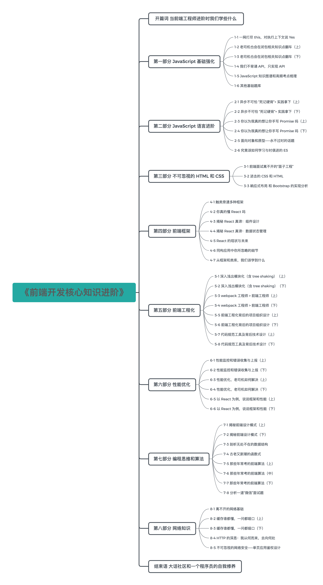

## 开篇词：如何突破前端开发技术瓶颈

> [原文地址](https://gitbook.cn/gitchat/column/5c91c813968b1d64b1e08fde/topic/5c9c68b9ccb24267c1d0e2e5)

[TOC]

日本后现代主义作家村上春树写过一本富有哲理的书——《当我谈跑步时我谈些什么》。

书中，他谈到，跑步跟写作一样：都需要坚毅隐忍，追逐超越；都需要心无杂念，持之以恒。全书落笔之处，没有浮华旖旎，而是娓娓道来迷惘、失败和挣扎。

这本书名义上是在谈跑步，却是在个人创作低潮时期对突破的不断思考。仔细想来，这样的思考对于一位工程师也至关重要。

前端领域，入门相对简单，可是想要“更上一层楼”却难上加难，也就是我们常说的“职业天花板较低”，君不见——市场上高级/资深前端工程师凤毛麟角。这当然未必完全是坏事，一旦突破瓶颈，在技能上脱颖而出，便是更广阔的空间。那么，如何从夯实基础到突破瓶颈？

接下来就让我们一起来讨论下：当前端工程师需要进阶时，我们学些什么。

### 直面自我——前端工程师的焦虑和迷茫

说到进阶，我想先谈谈我们每个人内心的焦虑和迷茫，正视这种情绪是学习的第一步。对于每一个追求进步的人来说，瓶颈期总会在各个阶段“如约而至”。早在公元前某年，庄子就说过：

> 吾生也有涯，而知也无涯。以有涯随无涯，殆已！已而为知者，殆而已矣！

而现如今，信息爆炸时代，信息量呈几何级数增长，知识似乎唾手可得。那么“该学什么？”，“到底该怎么学？”，“学完之后又该做什么？”，大部分人都会在知识面前焦虑、迷茫。

同样地，对于有一定工作经验的工程师来说：

- 我该如何避免相似的工作做三年，而不是具备了三年的工作经验？
- 我该如何从繁杂而千篇一律的业务需求中提炼技术点并总结提高？
- 我该如何为团队带来更大的价值，体现经验能力？

这些困扰对**前端工程师**来说貌似来得更加猛烈：前端技术发展备受瞩目，前端工程师变得越发重要的背后是相关技术的不断扩张和更新换代。因此，我们比以往任何时候都更需要主动学习。但据我观察，目前网络上的学习资料往往存在以下两个问题：

- 过于碎片化，这类知识某种程度上只能成为缓解焦虑的精神鸦片
- 追求短平快，大牛经验、快速搞定“面经题目”，渐渐演变成为跳槽加薪的兴奋剂

前端学习，尤其是进阶阶段的学习是一个**系统曲折**的过程。每个学习者所接触的知识内容和其背后的原理构建成了他的思维方式。短期速成的内容或者大量碎片化的知识很难帮助我们深度思考。坦白来说，我也是这些“学习资料”的搜集者，如果没有系统针对性地学习和反复的刻意练习，那么结果就是**以为收藏的是知识，其实收藏的是“知道”。以为掌握了知识，其实只是囤积了一堆“知道”。**

当 GitChat 联系我想要打造一门系统而全面的前端进阶课程时，我欣然接受。不光是因为想把自己在海外和 BAT 服务多年积累的经验分享给大家，也是想把长时间以来收藏的“干货”梳理一遍，系统性整理输出，和大家一起总结提高。最终，就是呈现在大家面前的这门《前端开发核心知识进阶》课程。

爱因斯坦说过：

> 只是学习他人的智慧并不足够，你需要自己想明白才行。花时间记录、通盘考虑和深入思考你学到的东西。

海伦·凯勒说过：

> 知识使人进步，而智慧使人得道。

希望这门课程不仅详述“知识”，更能体现编程“智慧”，能让所有订阅的朋友们一起思考，一起进步。

配图来自：电影《银河系漫游指南》海报

### 课程特色——基础和进阶，理论和实践

说到课程特色，我想一边聊聊前端开发的发展，一边说说我们课程的聚焦点。

#### **前端的大航海时代，有旧工具淘汰，更有新力量崛起**

记得我刚接触前端编程时，jQuery 风靡一时，其清新优雅的 DOM 操作、稳如磐石的兼容性处理、灵活高效的封装和链式调用，让人如沐春风。

彼时，我幼稚地以为“这就是颠覆”，事实却是“这只是开始”——随着三大框架的崛起，技术更迭就像“暴风雨前的宁静”，jQuery 突然就被其他“先进的生产力”抛在背后了。于是我们看见：2018 年 9 月，[Removing jQuery from GitHub.com frontend](https://github.blog/2018-09-06-removing-jquery-from-github-frontend/)，各大平台技术进行“改朝换代”，引领开发潮流。

这还只是一个类库在前端浪潮中的兴衰。再想想 ES 语言规范的演进速度，HTML5 的扩张幅度，跨端从 Ionic 到 React Native 再到 Flutter，CSS 从基本布局模型到弹性盒模型再到原生 Grid 方案，构建工具从 Grunt 到 Gulp 再到 webpack/Rollup......

这门课程，我们在重视“亘古不变”的语言基础上，力求为大家介绍更先进的开发技术。比如服务端渲染，比如 HTTP 3.0，比如使用 Lerna、yarn workspaces 构建 monorepo 项目，比如框架演进和虚拟 DOM，等等。

> [点击了解更多《前端开发核心知识进阶》](http://gitbook.cn/m/mazi/comp/column?columnId=5c91c813968b1d64b1e08fde&utm_source=hcsd001)

配图来自：《海贼王》

#### **前端开发有着与生俱来的混乱，需要我们披荆斩棘，在实践中勇往直前**

前端三大方向 JavaScript、CSS、 HTML 的背后是无尽的碎片化场景。前端是最贴近用户的“战线”，它基因里就需要处理“大象万千”。同时，不管是跨平台还是语言特性，它都会让开发者感到迷茫：

- “我们该使用哪些 HTML 标签以达到最佳的语义化？”
- “我们该如何面对不同终端的诡异问题，并保证体验一致性？”
- “我们如何写 JavaScript 做到 bug free？”
- “this 乱七八糟，它到底指向谁？”
- ……

这门课程，我们除了剖析理论，更加注重经验指导和最佳实践。

比如：

- 《性能监控和错误收集与上报》是分析多种场景和业界解决方案的产出；
- 《深入浅出模块化（含 tree shaking）》中，实战观摩 webpack 打包结果，对比 Rollup 解决方案，同时分析 tree shaking 的实施细节；
- 《前端工程化背后的项目组织设计》探索究竟该如何组织架构代码，解放开发效率；
- 《不可忽视的网络安全：单页应用鉴权设计》不去讲解 CSRF、XSS 等“死概念”，而是从鉴权角度出发，让读者对安全有一个立体认知。

配图来自：《七龙珠》

#### **前端开发工程师有广阔的未来，但“打铁还需自身硬”**

目前我们正在经历所谓的“资本寒冬”，不管是大厂、二线公司还是创业团队，“优化人员结构（裁员）”的新闻层出不穷。但是据我观察，“高级前端工程师”的招聘需求却“逆流而上”，具备高水平和经验的开发者无论在任何时候都备受追捧。因此，磨练技能、积累项目经验将是所有前端工程师的核心诉求。

作为内容贡献者，我也在思考如何让这门课程更有价值，真正帮助大家突破瓶颈，让读者感到“物有所值”，进而实现进阶。

这门课程中，我将穿插大量经典面试例题，其中既包括我作为 BAT 面试官的“私房题”，又涵盖我作为面试者遇见的“经典题”，以及和业界前辈讨论过的“开放题”。在平时开发和学习中，我也收藏积累了大量精品文章，会一并分享给大家。

从开发菜鸟到资深工程师，除了主观能动性以外，我个人认为成长过程中的一大瓶颈在于“不是每个人都能有机会接触到好项目”。这里的“好项目”是指类似“项目重构”、“类库迁移”、“复杂应用设计”、“疑难 bug 定位”等对开发者基础和设计能力有高要求的项目。

在这门课程中，我会插入大量代码设计模式、函数式、源码分析、组件设计和封装、开源库解读、项目代码组织等内容，也会手把手带领大家查阅 issue、changelog，从社区中汲取精华。构建更为真实的开发场景，直击实践中的高频痛点。

最后，也希望和每一位读者保持长线联系，一起讨论问题，共同进步。

配图来自：《蜘蛛侠：平行宇宙》

### 课程简介——8 部分 36 个主题 50 课

- **第一部分：JavaScript 基础强化（第 1-1~1-6 课）**

  **第二部分 JavaScript 语言进阶（第 2-1~2-6 课）**

  **第三部分 不可忽视的 HTML 和 CSS（第 3-1~3-3 课）**

  其中前三部分介绍 JavaScript、 HTML、CSS ，对于一些热点、重点话题，比如“this 指向”、“闭包、作用域、执行上下文”，以及一些高频考察点进行了深入分析；对面向对象、原型与原型链、异步这些内容进行强化，从实现的角度，结合具体实例分析 Promise；结合 ES Next，从 ES 的发展来看语言的演进。

- **第四部分 前端框架（第 4-1~4-7 课）**

  接下来进入了**前端框架**部分，我们以 React 为主，分析框架对前端到底意味着什么，以及我们应该如何学习 React。事实上，对 React 的学习，不能只停留在“会用”的层面，其设计原理和思想演进，对于培养编程思维非常有益，也有利于学习者能从更高的角度看待问题。

- **第五部分 前端工程化（第 5-1~5-8 课）**

  资深程序员永远逃不开的工作之一就是“基础构建”、“项目架构”。前端工程化部分我们从代码组织谈起，从规范实施谈起，结合 webpack、Lerna 等工具，为大家还原一个真实的“基建”场景，共同探索学习。

- **第六部分 性能优化（第 6-1~6-6 课）**

  性能优化是理论和实践相结合的重要话题。

  我们需要大量理论知识：明白缓存策略，了解浏览器渲染特点，清楚 JavaScript 异步单线程对性能意味着什么，还要了解网络传输知识，等等。我们也需要大量实践经验：用得了 Chrome Devtool 分析火焰图，跑得出准确的 benchmark，知道防抖和节流的区别，懂得资源合并、拆分的利弊，了解业界最新性能优化方案，等等。

  这一部分，我们除了介绍重要大量知识点外，也会结合代码/项目实例来展开。

- **第七部分 编程思维和算法（第 7-1~7-8 课）**

  前端开发离不开编程基础，培养良好的编程思维，了解基本的算法知识，是每一个工程师所必须具备的。在这一部分，我们用 JavaScript 来描述多种设计模式，设计模式并不是纸上谈兵，实实在在地存在于我们的业务代码当中；手把手带大家用 JavaScript 处理各种数据，说到底前端还是处理数据，展示 UI；当然更少不了对一些常见算法的强化。

- **第八部分 网络知识（第 8-1~8-5 课）**

  作为一名前端开发者，不了解互联网传输的奥秘，不清楚网络细节是难以进阶的。网络知识关联着性能优化、前后端协作等核心环节，因此这一部分我们将重点强化网络基础。

- **结束语：软技巧**

  学习进步离不开社区的力量，“授人予鱼不如授人予渔”。在课程的最后，我会讲述我的学习方法：如何投身到社区当中，与广大开发者一起讨论；如何阅读前人的经典思想，站在巨人的肩上看得更远；如何解读开源库，从中汲取养分；如何在面试和述职当中，正确地表达汇报……

> [点击了解更多《前端开发核心知识进阶》](http://gitbook.cn/m/mazi/comp/column?columnId=5c91c813968b1d64b1e08fde&utm_source=hcsd001)

### 学习建议

建议大家在阅读课程过程中，手动执行文内代码，同时养成打断点或 console.log 调试的好习惯。此课程对应的代码仓库：https://github.com/HOUCe/lucas-gitchat-courses