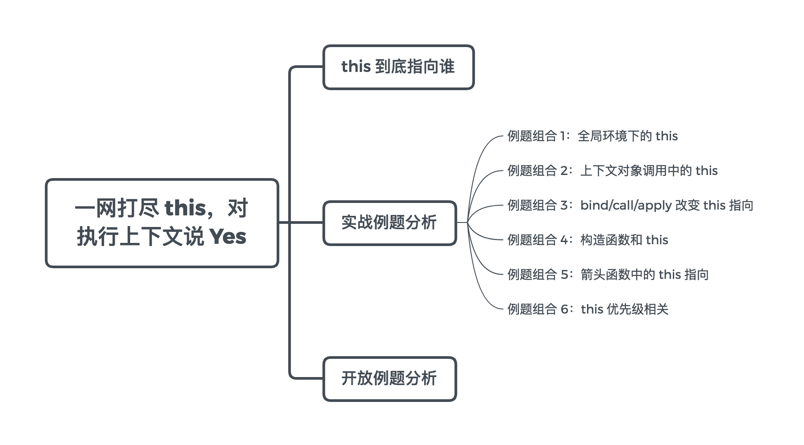

## 第1-1课：一网打尽 this，对执行上下文说 Yes

> [原文地址](https://gitbook.cn/gitchat/column/5c91c813968b1d64b1e08fde/topic/5c99a854ccb24267c1d0194f)

[TOC]

JavaScript 中的 `this`，因其灵活的指向、复杂的使用场景一直是面试中的热点，不论是初级还是中高级开发者，这都是一道必考题。这个概念虽然基础，但是非常重要，是否能深刻理解 `this`，是前端 JavaScript 中进阶的重要一环。`this` 指向多变，很多隐蔽的 bug 都缘于它。与此同时，`this` 强大灵活，如果能熟练驾驭，就会写出更简洁、优雅的代码。

社区上对于 `this` 的讲解虽然不少，但缺乏统一梳理。本节课，让我们直面 `this` 的方方面面，并通过例题真正领会与掌握 `this`。

`this` 相关知识点如下：



### this 到底指向谁

曾经在面试阿里某重点部门时，面试官从多个角度考察过我对 `this` 的理解：全局环境下的`this`、箭头函数的 `this`、构造函数的 `this`、`this` 的显隐性和优先级，等等。尽管我能一一作答，可是最后的问题：**请用一句话总结 this 的指向，注意只用一句话。** 我却犯难了。

有一种广泛流传的说法是：

> 谁调用它，`this` 就指向谁。

也就是说，`this` 的指向是在调用时确定的。这么说没有太大的问题，可是并不全面。面试官要求我用更加规范的语言进行总结，那么他到底在等什么样的回答呢？

我们还要回到 JavaScript 中一个最基本的概念分析——**执行上下文**，这个概念，我们会在下一讲《老司机也会在闭包相关知识点翻车》中进行扩展。

事实上，调用函数时会创建新的属于函数自身的执行上下文。执行上下文的调用创建阶段会决定 `this`的指向。到此，我们可以得出的一个结论：

`this` 的指向，是在调用函数时根据执行上下文所动态确定的。

具体环节和规则，可以先“死记硬背”以下几条规律，后面再慢慢一一分析：

- 在函数体中，简单调用该函数时（非显式/隐式绑定下），严格模式下 `this` 绑定到 `undefined`，否则绑定到全局对象 `window`／`global`；
- 一般构造函数 `new` 调用，绑定到新创建的对象上；
- 一般由 `call`/`apply`/`bind` 方法显式调用，绑定到指定参数的对象上；
- 一般由上下文对象调用，绑定在该对象上；
- 箭头函数中，根据外层上下文绑定的 `this` 决定 `this` 指向。

当然，真实环境多样，我们来逐一梳理。

> [点击了解更多《前端开发核心知识进阶》](http://gitbook.cn/m/mazi/comp/column?columnId=5c91c813968b1d64b1e08fde&utm_source=hcsd001)

### 实战例题分析

#### 例题组合 1：全局环境下的 this

这种情况相对简单直接，函数在浏览器全局环境中被简单调用，非严格模式下 `this` 指向 `window`；在 `use strict` 指明严格模式的情况下就是 `undefined`。我们来看例题，请描述打印结果：

```js
function f1 () {
    console.log(this)
}
function f2 () {
    'use strict'
    console.log(this)
}
f1() // window
f2() // undefined
```

这样的题目比较基础，但是需要候选人格外注意其变种，请再看一道题目：

```js
const foo = {
    bar: 10,
    fn: function() {
       console.log(this)
       console.log(this.bar)
    }
}
var fn1 = foo.fn
fn1()
```

这里 `this` 仍然指向的是 `window`。虽然 `fn` 函数在 `foo` 对象中作为方法被引用，但是在赋值给 `fn1` 之后，`fn1` 的执行仍然是在 `window` 的全局环境中。因此输出 `window` 和 `undefined`，它们相当于：

```js
console.log(window)
console.log(window.bar)
```

还是上面这道题目，如果调用改变为：

```js
const foo = {
    bar: 10,
    fn: function() {
       console.log(this)
       console.log(this.bar)
    }
}
foo.fn()
```

将会输出：

```js
{bar: 10, fn: ƒ}
10
```

因为这个时候 `this` 指向的是最后调用它的对象，在 `foo.fn()` 语句中 `this` 指向 `foo` 对象。请记住：

在执行函数时，如果函数中的 `this` 是被上一级的对象所调用，那么 `this` 指向的就是上一级的对象；否则指向全局环境。

#### 例题组合 2：上下文对象调用中的 this

如上结论，面对下题时我们便不再困惑：

```js
const student = {
    name: 'Lucas',
    fn: function() {
        return this
    }
}
console.log(student.fn() === student)
```

最终结果将会返回 `true`。

当存在更复杂的调用关系时，请看例题：

```js
const person = {
    name: 'Lucas',
    brother: {
        name: 'Mike',
        fn: function() {
            return this.name
        }
    }
}
console.log(person.brother.fn())
```

在这种嵌套的关系中，`this` 指向**最后**调用它的对象，因此输出将会是：`Mike`。

到此，`this` 的上下文对象调用已经理解得比较清楚了。我们再看一道更高阶的题目：

```js
const o1 = {
    text: 'o1',
    fn: function() {
        return this.text
    }
}
const o2 = {
    text: 'o2',
    fn: function() {
        return o1.fn()
    }
}
const o3 = {
    text: 'o3',
    fn: function() {
        var fn = o1.fn
        return fn()
    }
}

console.log(o1.fn())
console.log(o2.fn())
console.log(o3.fn())
```

答案是：`o1`、`o1`、`undefined`，你答对了吗？

我们来一一分析。

- 第一个 `console` 最简单，`o1` 没有问题。难点在第二个和第三个上面，关键还是看调用 `this`的那个函数。
- 第二个 `console` 的 `o2.fn()`，最终还是调用 `o1.fn()`，因此答案仍然是 `o1`。
- 最后一个，在进行 `var fn = o1.fn` 赋值之后，是“裸奔”调用，因此这里的 `this` 指向 `window`，答案当然是 `undefined`。

如果面试者回答顺利，可以紧接着追问，如果我们需要让：

```js
console.log(o2.fn())
```

输出 `o2`，该怎么做？

一般开发者可能会想到使用 `bind/call/apply` 来对 `this` 的指向进行干预，这确实是一种思路。但是我接着问，**如果不能使用 bind/call/apply，有别的方法吗？**

这样可以考察候选人基础掌握的深度以及随机应变的思维能力。答案为：

```js
const o1 = {
    text: 'o1',
    fn: function() {
        return this.text
    }
}
const o2 = {
    text: 'o2',
    fn: o1.fn
}

console.log(o2.fn())
```

还是应用那个重要的结论：`this` 指向**最后**调用它的对象，在 `fn` 执行时，挂到 `o2` 对象上即可，我们提前进行了赋值操作。

#### 例题组合 3：bind/call/apply 改变 this 指向

上文提到 bind/call/apply，在这个概念上，比较常见的基础考察点是：**bind/call/apply 三个方法的区别。**

这样的问题相对基础，我们直接上答案：一句话总结，他们都是用来改变相关函数 `this` 指向的，但是 `call/apply` 是直接进行相关函数调用；`bind` 不会执行相关函数，而是返回一个新的函数，这个新的函数已经自动绑定了新的 `this` 指向，开发者需要手动调用即可。再具体的 `call/apply` 之间的区别主要体现在参数设定上，这里不再展开。

用代码来总结：

```js
const target = {}
fn.call(target, 'arg1', 'arg2')
```

相当于：

```js
const target = {}
fn.apply(target, ['arg1', 'arg2'])
```

相当于：

```js
const target = {}
fn.bind(target, 'arg1', 'arg2')()
```

具体基础用法这里不再科普，如果读者尚不清楚，需要自己补充一下知识点。

我们来看一道例题分析：

```js
const foo = {
    name: 'lucas',
    logName: function() {
        console.log(this.name)
    }
}
const bar = {
    name: 'mike'
}
console.log(foo.logName.call(bar))
```

将会输出 `mike`，这不难理解。**但是对 call/apply/bind 的高级考察往往会结合构造函数以及组合式实现继承。实现继承的话题，我们会单独讲到。构造函数的使用案例，我们结合接下来的例题组合进行分析。**

#### 例题组合 4：构造函数和 this

这方面最直接的例题为：

```js
function Foo() {
    this.bar = "Lucas"
}
const instance = new Foo()
console.log(instance.bar)
```

答案将会输出 `Lucas`。但是这样的场景往往伴随着下一个问题：**new 操作符调用构造函数，具体做了什么？**以下供参考：

- 创建一个新的对象；
- 将构造函数的 `this` 指向这个新对象；
- 为这个对象添加属性、方法等；
- 最终返回新对象。

以上过程，也可以用代码表述：

```js
var obj  = {}
obj.__proto__ = Foo.prototype
Foo.call(obj)
```

当然，这里对 `new` 的模拟是一个简单基本版的，更复杂的情况我们会在原型、原型链相关的第2-5课《面向对象和原型——永不过时的话题》中讲述。

需要指出的是，如果在构造函数中出现了显式 `return` 的情况，那么需要注意分为两种场景：

```js
function Foo(){
    this.user = "Lucas"
    const o = {}
    return o
}
const instance = new Foo()
console.log(instance.user)
```

将会输出 `undefined`，此时 `instance` 是返回的空对象 `o`。

```js
function Foo(){
    this.user = "Lucas"
    return 1
}
const instance = new Foo()
console.log(instance.user)
```

将会输出 `Lucas`，也就是说此时 `instance` 是返回的目标对象实例 `this`。

**结论：**如果构造函数中显式返回一个值，且返回的是一个对象，那么 `this` 就指向这个返回的对象；如果返回的不是一个对象，那么 `this` 仍然指向实例。

#### 例题组合 5：箭头函数中的 this 指向

首先我们再来温习一下相关结论。

**结论：**箭头函数使用 `this` 不适用以上标准规则，而是根据外层（函数或者全局）上下文来决定。

来看题目：

```js
const foo = {  
    fn: function () {  
        setTimeout(function() {  
            console.log(this)
        })
    }  
}  
console.log(foo.fn())
```

这道题中，`this` 出现在 `setTimeout()` 中的匿名函数里，因此 `this` 指向 `window` 对象。如果需要 `this` 指向 `foo` 这个 object 对象，可以巧用箭头函数解决：

```js
const foo = {  
    fn: function () {  
        setTimeout(() => {  
            console.log(this)
        })
    }  
} 
console.log(foo.fn())

// {fn: ƒ}
```

单纯箭头函数中的 `this` 非常简单，**但是综合所有情况，结合 this 的优先级考察，这时候 this 指向并不好确定。请继续阅读。**

#### 例题组合 6：this 优先级相关

我们常常把通过 `call`、`apply`、`bind`、`new` 对 `this` 绑定的情况称为显式绑定；根据调用关系确定的 `this` 指向称为隐式绑定。

**那么显式绑定和隐式绑定谁的优先级更高呢？**

请看例题：

```js
function foo (a) {
    console.log(this.a)
}

const obj1 = {
    a: 1,
    foo: foo
}

const obj2 = {
    a: 2,
    foo: foo
}

obj1.foo.call(obj2)
obj2.foo.call(obj1)
```

输出分别为 2、1，也就是说 `call`、`apply` 的显式绑定一般来说优先级更高。

```js
function foo (a) {
    this.a = a
}

const obj1 = {}

var bar = foo.bind(obj1)
bar(2)
console.log(obj1.a)
```

上述代码通过 `bind`，将 `bar` 函数中的 `this` 绑定为 `obj1` 对象。执行 `bar(2)` 后，`obj1.a` 值为 2。即经过 `bar(2)` 执行后，`obj1` 对象为：`{a: 2}`。

当再使用 `bar` 作为构造函数时：

```js
var baz = new bar(3)
console.log(baz.a)
```

将会输出 3。我们看 `bar` 函数本身是通过 `bind` 方法构造的函数，其内部已经对将 `this` 绑定为 `obj1`，它再作为构造函数，通过 `new` 调用时，返回的实例已经与 `obj1` 解绑。 也就是说：

**new 绑定修改了 bind 绑定中的 this，因此 new 绑定的优先级比显式 bind 绑定更高。**

我们再看：

```js
function foo() {
    return a => {
        console.log(this.a)
    };
}

const obj1 = {
    a: 2
}

const obj2 = {
    a: 3
}

const bar = foo.call(obj1)
console.log(bar.call(obj2))
```

将会输出 2。由于 `foo()` 的 `this` 绑定到 `obj1`，`bar`（引用箭头函数）的 `this` 也会绑定到 `obj1`，箭头函数的绑定无法被修改。

如果将 `foo` 完全写成箭头函数的形式：

```js
var a = 123
const foo = () => a => {
    console.log(this.a)
}

const obj1 = {
    a: 2
}

const obj2 = {
    a: 3
}

var bar = foo.call(obj1)
console.log(bar.call(obj2))
```

将会输出 `123`。

这里我再“抖个机灵”，仅仅将上述代码的第一处变量 `a` 的赋值改为：

```js
const a = 123
const foo = () => a => {
    console.log(this.a)
}

const obj1 = {
    a: 2
}

const obj2 = {
    a: 3
}

var bar = foo.call(obj1)
console.log(bar.call(obj2))
```

答案将会输出为 `undefined`，原因是因为使用 `const` 声明的变量不会挂载到 `window` 全局对象当中。因此 `this` 指向 `window` 时，自然也找不到 `a` 变量了。关于 `const` 或者 `let` 等声明变量的方式不再本课的主题当中，我们后续也将专门进行介绍。

到这里，读者是否有“融会贯通”的感觉了呢？如果还有困惑，也不要灰心。进阶的关键就是基础，基础需要反复学习，“死记硬背”后才能慢慢体会。

### 开放例题分析

不知道实战例题分析是否已经把你绕晕了。事实上，`this` 的指向涉及的规范繁多，优先级也较为混乱。**刻意刁难并不是很好的面试做法，一些细节候选人如果没有记住也不是太大的问题。作为面试官，我往往会另辟蹊径，出一些开放性题目。**

其中，最典型的一道题目为：**实现一个 bind 函数。**

作为面试者，我也曾经在头条的面试流程中被问到模拟 `bind`。这道题并不新鲜，部分读者也会有自己的解答思路，而且社区上关于原生 `bind` 的研究也很多。但是，我们这里想强调的是，可能有一些细节被大家忽略了。在回答时，我往往先实现一个初级版本，然后根据 ES5-shim 源码进一步说明。

```js
Function.prototype.bind = Function.prototype.bind || function (context) {
    var me = this;
    var args = Array.prototype.slice.call(arguments, 1);
    return function bound () {
        var innerArgs = Array.prototype.slice.call(arguments);
        var finalArgs = args.concat(innerArgs);
        return me.apply(context, finalArgs);
    }
}
```

这样的实现已经非常不错了。但是，就如同之前 `this` 优先级分析所示：**bind 返回的函数如果作为构造函数，搭配 new 关键字出现的话，我们的绑定 this 就需要“被忽略”。**

为了实现这样的规则，开发者就应该需要考虑如何区分这两种调用方式。**具体来讲 bound 函数中就要进行 this instanceof 的判断。**

另外一个细节是，函数具有 `length` 属性，表示形参的个数。上述实现方式形参的个数显然会失真。我们的实现就需要对 `length` 属性进行还原。可是**难点在于：函数的 length 属性值是不可重写的。**

这样的内容一般属于“超纲”范畴，但在面试中能够很好地体现面试者平时的积累，以及对源码的阅读和思考，显然是加分项。对此进一步的理解，读者可参考我的原创文章：[从一道面试题，到“我可能看了假源码”](https://www.jianshu.com/p/6958f99db769)。这篇文章发表于 2017 年年初，可以说是现在很多研究 `bind` 相关文章的启蒙。

### 总结

通过本课的学习，我们看到 `this` 纷繁多象，确实不容易彻底掌握。本节尽可能系统地进行讲解、说明，例题尽可能地覆盖更多 case。与此同时，需要读者在阅读之外继续进行消化与吸收。只有“记死”，才能“用活”。请读者随时关注课程，接下来会更新更多大家感兴趣的话题，让我们一起进步。

> [点击了解更多《前端开发核心知识进阶》](http://gitbook.cn/m/mazi/comp/column?columnId=5c91c813968b1d64b1e08fde&utm_source=hcsd001)