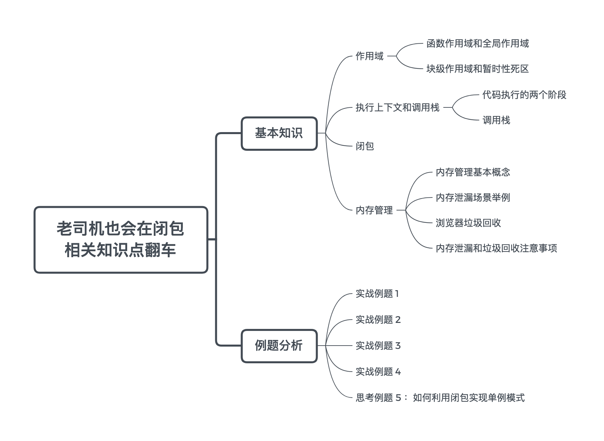
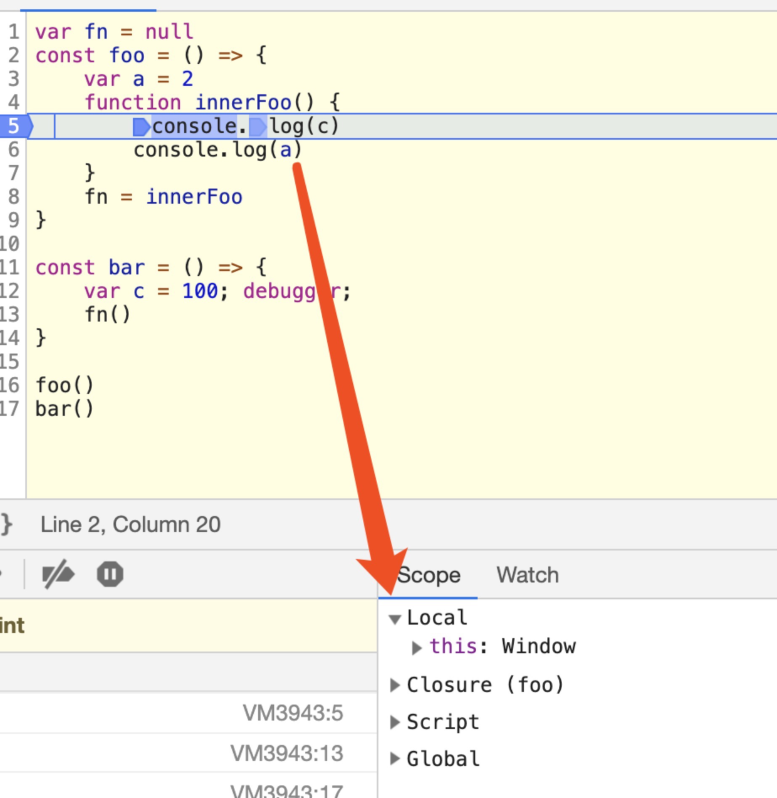

## 第1-3课：老司机也会在闭包相关知识点翻车（下）

> [原文地址](https://gitbook.cn/gitchat/column/5c91c813968b1d64b1e08fde/topic/5c99b05accb24267c1d019ee)

[TOC]

有了上一课的理论知识，这一课我们来分析例题。

我们再次列出「闭包」主题的知识点：



### 例题分析

接下来，我们通过几道题目来加深理解闭包。

#### 实战例题 1：求下面代码的输出

```js
const foo = (function() {
    var v = 0
    return () => {
        return v++
    }
}())

for (let i = 0; i < 10; i++) {
    foo()
}

console.log(foo())
```

答案：10

##### **例题 1 分析**

`foo` 是一个立即执行函数，我们尝试打印 `foo`：

```js
const foo = (function() {
    var v = 0
    return () => {
        return v++
    }
}())

console.log(foo)
```

输出：

```js
() => {
    return v++
}
```

在循环执行时，执行 `foo()`，这样引用自由变量 10 次，`v` 自增 10 次，最后执行 `foo` 时，得到 10。（自由变量是指没有在相关函数作用域中声明，但是使用了的变量。）

#### 实战例题 2：求下面代码的输出

```js
const foo = () => {
    var arr = []
    var i

    for (i = 0; i < 10; i++) {
        arr[i] = function () {
            console.log(i)
        }
    }

    return arr[0]
}

foo()()
```

答案：10，这时自由变量为 `i`，分析类似例题 1：`foo()` 执行返回的是 `arr[0]`, `arr[0]` 此时是函数：

```js
function () {
    console.log(i)
}
```

变量 `i` 值为 10。

#### 实战例题 3：求下面代码的输出

```js
var fn = null
const foo = () => {
    var a = 2
    function innerFoo() { 
        console.log(a)
    }
    fn = innerFoo
}

const bar = () => {
    fn()
}

foo()
bar()
```

答案：2

##### **例题 3 分析**

正常来讲，根据调用栈的知识，`foo` 函数执行完毕之后，其执行环境生命周期会结束，所占内存被垃圾收集器释放，上下文消失。但是通过 `innerFoo` 函数赋值给 `fn`，`fn` 是全局变量，这就导致了 `foo` 的变量对象 `a` 也被保留了下来。所以函数 `fn` 在函数 `bar` 内部执行时，依然可以访问这个被保留下来的变量对象，输出结果为 `2`。

#### 实战例题 4：求下面代码的输出

我们将上面的例子稍作修改：

```js
var fn = null
const foo = () => {
    var a = 2
    function innerFoo() { 
        console.log(c)            
        console.log(a)
    }
    fn = innerFoo
}

const bar = () => {
    var c = 100
    fn()    
}

foo()
bar()
```

执行结果：报错。

##### **例题 4 分析**

在 `bar` 中执行 `fn()` 时，`fn()` 已经被复制为 `innerFoo`，变量 `c` 并不在其作用域链上，`c` 只是 `bar` 函数的内部变量。因此报错 ReferenceError: c is not defined。

图示分析：



#### 思考例题 5：如何利用闭包实现单例模式

单例模式，是一种常用的软件设计模式。GoF 在《设计模式：可复用面向对象软件的基础》一书中给出了如下定义：

> Ensure a class only has one instance, and provide a global point of access to it.
>
> 保证一个类只有一个实例，并提供一个访问它的全局访问点。

使用闭包我们可以保持对实例的引用，不被垃圾回收机制回收，因此：

```js
function Person() {
    this.name = 'lucas'
}

const getSingleInstance = (function(){
     var singleInstance
    return function() {
         if (singleInstance) {
            return singleInstance
         } 
        return singleInstance = new Person()
    }
})()

const instance1 = getSingleInstance()
const instance2 = getSingleInstance()
```

事实上，我们有 instance1 === instance2。因为借助闭包变量 singleInstance，instance1 和 instance2 是同一引用的（singleInstance），这正是单例模式的体现。

### 总结

本课我们通过介绍理论知识加例题实战的方式梳理了 JavaScript 中闭包、内存、执行上下文、作用域、作用域链等概念。

这些内容说基础，确实不算很难；说复杂，它绝对又能衍生出很多知识点。这些知识点不是 JavaScript 所特有的，但是在前端开发中又极具自身语言风格。它绝不只是纯理论概念，只有解决真实的开发问题才有实际意义。

一个合格的高级前端工程师需要做的并不是如数家珍地背诵“闭包和 GC 原理”，而是根据面临的场景，凭借扎实的基础，能够通过查阅资料，提升应用性能，分析内存事故和突破瓶颈。