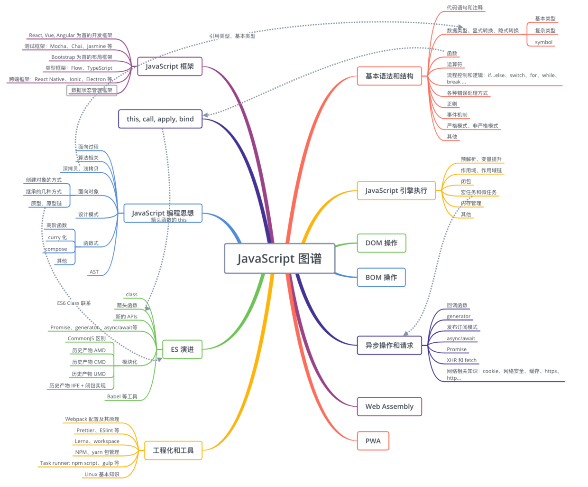

## 第1-5课：JavaScript 知识图谱和高频考点梳理

今天这一课，让我们来放松一下：不再去解剖概念、分析题目，而是了解一下 JavaScript 知识点和高频考点，在更高的层面上对我们所学、以及将要学到的内容有一个更加清晰的认识。

为什么不在一开始介绍这个主题呢？相信读者经过几章节的学习，已经对本课程有了一个初步印象。在这个基础上，此时进行知识图谱和高频考点梳理，我认为能让大家能好的进入接下来章节，进行更加深入的内容。

### 知识图谱和重要考点

本课程中的 JavaScrip 部分，会面向进阶，一些基础的概念点，如流程控制语句、运算操作符、基本方法等不会再过多介绍，相反在 ES 语言演进、具体方案解决、编程思维、算法、工程化和框架等方面展开。

其中，编程思维、JavaScript 框架、工程化三个主题分别属于课程中的三大部分，系统地进行介绍；this 相关话题、ES 语言演进、异步、原型原型链、面向对象、数据类型、闭包、作用域、执行上下文、内存管理分别在独立的章节中展开；函数相关、重要 APIs 等内容，会融入到具体文章内容中进行渗透。

另外，图中虽然一些有强关联的知识模块已经用虚线画出，但是整个内容都是融会贯通的。在本课程中的一些章节会进行梳理，比如：性能优化话题就涉及到 JavaScript 引擎执行、浏览器渲染、网络知识等诸多内容。

最后，提一下面试考点，一般对于初中级职位，对于基础内容，例如：this 指向、数据类型转换考察非常频繁。这些内容能够很好体现开发者对于基础的理解，也是通往高级所必备的知识点。对于原型、原型链这方面的内容考察逐渐降温，转而对于 ES6 中 class 等面向对象内容考察越来越频繁。笔者认为，原型、原型链及其相关面向对象知识仍然非常重要，这对于理解 JavaScript 语言具有重要意义。对于高级职位的考察，异步是个不得不说的话题，同时工程化方面以及基础构建方面的经验也至关重要。