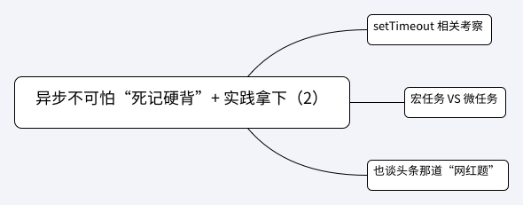

## 第 2-2 课：异步不可怕“死记硬背”+ 实践拿下（下）

> [原文地址](https://gitbook.cn/gitchat/column/5c91c813968b1d64b1e08fde/topic/5cbbe7a5bbbba80861a35beb)

[TOC]

上一讲了解了如何优雅地处理复杂异步任务。这一讲，我们回归理论，研究“同步异步”到底是个什么样的概念。我们从例题入手，梳理一下相关面试考点。这些题目有一个共同特点，判断输入输出的顺序：这是一类面试的“必考题”，考察点围绕着 JavaScript 和浏览器引擎交织的异步行为，包括 eventloop、宏任务、微任务等。

再次重复相关知识点，如下：



### setTimeout 相关考察

观察以下代码：

```js
setTimeout(() => {
    console.log('setTimeout block')
}, 100)

while (true) {

}

console.log('end here')
```

将不会有任何输出。

原因很简单，因为 while 循环会一直循环代码块，因此主线程将会被占用。

但是：

```js
setTimeout(() => {
    while (true) {

    }
}, 0)

console.log('end here')
```

会打印出：end here。这段代码执行后，如果我们再执行任何语句，都不会再得到响应。

由此可以延伸出：JavaScript 中**所有任务分为同步任务和异步任务**。

- 同步任务是指：当前主线程将要消化执行的任务，这些任务一起形成执行栈（execution context stack）。s
- 异步任务是指：不进入主线程，而是进入任务队列（task queque），即不会马上进行的任务。

**当同步任务全都被消化，主线程空闲时，即上面提到的执行栈 execution context stack 为空时，将会执行任务队列中的任务，即异步任务。**

这样的机制保证了：**虽然 JavaScript 是单线程的，但是对于一些耗时的任务，我们可以将其丢入任务队列当中，这样一来，也就不会阻碍其他同步代码的执行。等到异步任务（准备条件）完成之后，再去进行相关逻辑的操作。**

回到例题，程序遇见 setTimeout 时，会将其内容放入任务队列（task queque）当中，继续执行同步任务，直到 while 循环，因为我们写死了一个循环条件，导致主线程同步任务被阻塞，主线程永远不会空闲。因此 console.log('end here') 代码不会执行，更没有可能在同步任务结束后，执行任务队列当中的 console.log('setTimeout block')。

如果稍做更改：

```js
const t1 = new Date()
setTimeout(() => {
  const t3 = new Date()
  console.log('setTimeout block')
  console.log('t3 - t1 =', t3 - t1)
}, 100)

let t2 = new Date()

while (t2 - t1 < 200) {
  t2 = new Date()
}

console.log('end here')
```

输出：

```js
// end here
// setTimeout block
// t3 - t1 = 200
```

我们看，即便 setTimeout 定时器的定时为 100 毫秒，但是同步任务中 while 循环将执行 200 毫秒，计时到时后仍然会先执行主线程中的同步任务，只有当同步任务全部执行完毕，end here 输出，才会开始执行任务队列当中的任务。此时 t3 和 t1 的时间差为 200 毫秒，而不是定时器设定的 100 毫秒。

上面两个例题比较简单，关于 setTimeout 最容易被忽视的其实是一个非常小的细节。 请看题目：

```js
setTimeout(() => {
  console.log('here 100')
}, 100)

setTimeout(() => {
  console.log('here 2')
}, 0)
```

不要被吓到，这个题目并没有陷阱。因为第二个 setTimeout 将更快到时，所以先输出 here 2，再在 100 毫秒左右，输出 here 100。

但是如果：

```js
setTimeout(() => {
    console.log('here 1')
}, 1)

setTimeout(() => {
    console.log('here 2')
}, 0)
```

按道理，也应该是第二个 setTimeout 将更快到时，先输出 here 2，再输出 here 1。但是在 Chrome 中运行结果相反，事实上针对这两个 setTimeout，谁先进入任务队列，谁先执行并不会严格按照 1 毫秒和 0 毫秒的区分。

表面上看，1 毫秒和 0 毫秒的延迟完全是等价的。这就有点类似“最小延迟时间”这个概念。直观上看，最小延迟时间是 1 毫秒，在 1 毫秒以内的定时，都以最小延迟时间处理。此时，在代码顺序上谁靠前，谁就先会在主线程空闲时优先被执行。

值得一提的是，MDN 上给出的最小延时概念是 4 毫秒，读者可以参考 [最小延迟时间](https://developer.mozilla.org/zh-CN/docs/Web/API/Window/setTimeout)，另外，setTimeout 也有“最大延时”的概念。这都依赖于规范的制定和浏览器引擎的实现。

> 经过我在 chrome 74.0.3729.169 中的测试，1ms 以上都会是延迟时间越短的先执行，以上输出为例，就是 here 2 先打印。

我个人认为没有太大的“钻牛角尖”必要。读者只需要心里清楚“有这么一个概念”即可。我们进入下一环节的学习。

### 宏任务 VS 微任务

在介绍宏任务和微任务之前，我们先看一下 Promise 相关输出情况：

```js
console.log('start here') 1

new Promise((resolve, reject) => {
  console.log('first promise constructor') 2
  resolve()
})
  .then(() => {
  console.log('first promise then') 4
  return new Promise((resolve, reject) => {
    console.log('second promise') 5
    // 由于这里先执行了 resolve，所以会先将此 promise.then 所要执行的逻辑添加到队列当中
    resolve()
  })
    .then(() => {
    console.log('second promise then') 6
  })
})
  .then(() => {
  console.log('another first promise then') 7
})

console.log('end here') 3
```

我们来分析一下：

- 首先输出 start here 没有问题
- 接着到了一个 Promise 构造函数中，同步代码执行，输出 first promise constructor，同时将第一处 promise then 完成处理函数逻辑放入任务队列
- 继续执行同步代码，输出 end here
- 同步代码全部执行完毕，执行任务队列中的逻辑，输出 first promise then 以及 second promise
- 当在 then 方法中返回一个 Promise 时（第 9 行），由于其先执行了 `resolve()` 第一个 promise 的第二个完成处理函数（第 17 行）会置于返回的这个新 Promise 的 then 方法（第 13 行）后
- 此时将返回的这个新 Promise 的 then 方法放到任务队列中，由于主线程并没有其他任务，转而执行第二个 then 任务，输出 second promise then
- 最后输出 another first promise then

这道题目并不是很简单，主要涉及到了 Promise 的一些特性。我们会在下一课《你以为我真的让你手写 Promise 吗》中继续分析。

事实上，我们不难发现，Promise 完成处理函数也会被放到任务队列当中。但是这个“任务队列”和前面所提的 setTimeout 相关的的任务队列又有所不同。

任务队列中的异步任务其实又分为：**宏任务（macrotask）与微任务（microtask）**，也就是说宏任务和微任务虽然都是异步任务，都在任务队列中，但是他们也是在两个不同的队列中。

那宏任务和微任务如何区分呢？

一般地宏任务包括：

- setTimeout
- setInterval
- I/O
- 事件
- postMessage
  - **window.postMessage()** 方法可以安全地实现跨源通信。
- setImmediate (Node.js)
- requestAnimationFrame
- UI 渲染

微任务包括：

- Promise.then
- MutaionObserver
  - [`MutationObserver`](https://developer.mozilla.org/zh-CN/docs/Web/API/MutationObserver)接口提供了监视对DOM树所做更改的能力。它被设计为旧的Mutation Events功能的替代品，该功能是DOM3 Events规范的一部分。
- process.nextTick (Node.js)

那么当代码中同时存在宏任务和微任务时，谁的优先级更高，先执行谁呢？请看代码：

```js
console.log('start here') 1

const foo = () => (new Promise((resolve, reject) => {
  console.log('first promise constructor') 2

  let promise1 = new Promise((resolve, reject) => {

    console.log('second promise constructor') 3

    setTimeout(() => {
      console.log('setTimeout here') 7
      resolve()
    }, 0)

    resolve('promise1') 
  })

  resolve('promise0')

  promise1.then(arg => {
    console.log(arg) 5
  })
}))

foo().then(arg => {
  console.log(arg) 6
})

console.log('end here') 4
```

这是一个更加复杂的例子，不要慌，我们一步一步分析。

- 首先输出同步内容：start here 1，执行 foo 函数，同步输出 first promise constructor 2
- 继续执行 foo 函数，遇见 promise1，执行 promise1 构造函数，同步输出 second promise constructor 3，以及 end here 4。同时按照顺序：setTimeout 回调进入任务队列（宏任务），promise1 的完成处理函数（第 20 行）进入任务队列（微任务），第一个（匿名） promise 的完成处理函数（第 25 行）进入任务队列（微任务）
- 虽热 setTimeout 回调率先进入任务队列，但是优先执行微任务，按照微任务顺序，先输出 promise1（promise1 结果），再输出 promise0（第一个匿名 promise 结果）
- 此时所有微任务都处理完毕，执行宏任务，输出 setTimeout 回调内容 setTimeout here

由上分析得知，**每次主线程执行栈为空的时候，引擎会优先处理微任务队列，处理完微任务队列里的所有任务，再去处理宏任务。**

如同：

```js
console.log('start here')

setTimeout(() => {
    console.log('setTimeout')
}, 0)

new Promise((resolve, reject) => {
    resolve('promise result')
}).then(value => {console.log(value)})

console.log('end here')
```

输出：

```js
start here
end here
promise result
setTimeout
```

### 也谈头条那道“网红题”

综合上述所有知识，我们最后再来看一到头条的题目。这道题目非常“网红”，相信有的读者已经看过这道题目了。说实话，我个人认为这属于对异步理论纯知识点的考察，有些内容属于“你知道你就会，不知道就不会”，对于候选者的动手和解决问题能力的衡量稍欠。但是，面试官既然要考，不妨我们认真梳理分析一番。

题目：

```js
async function async1() {
    console.log('async1 start') 2
    await async2()
    console.log('async1 end') 
}

async function async2() {
    console.log('async2')  5
}

console.log('script start') 1

setTimeout(function() {
    console.log('setTimeout') 
}, 0)  

async1()

new Promise(function(resolve) {
    console.log('promise1') 3
    resolve()
}).then(function() {
    console.log('promise2')
})

console.log('script end') 4
```

千万不要看到 async 就害怕，其实它并不神秘。这里我并不打算赘述 async/await 的基础内容，读者需明白：

- async 声明的函数，其返回值必定是 promise 对象，如果没有显式返回 promise 对象，也会用 Promise.resolve() 对结果进行包装，保证返回值为 promise 类型
- await 会先执行其右侧表达逻辑（从右向左执行），并让出主线程，跳出 async 函数，而去继续执行 async 函数外的同步代码
- 如果 await 右侧表达逻辑是个 promise，让出主线程，继续执行 async 函数外的同步代码，等待同步任务结束后，且该 promise 被 resolve 时，继续执行 await 后面的逻辑
- 如果 await 右侧表达逻辑不是 promise 类型，那么 async 函数之外的同步代码执行完毕之后，会回到 async 函数内部，继续执行 await 之后的逻辑

因此我们来分析：

- 首先执行同步代码，输出 script start 1，并向下执行，遇见 setTimeout，将其回调放入宏任务当中
- 继续执行同步代码逻辑，遇见 async1()，执行 async1 内同步代码，输出 async1 start 2，继续下后执行到 await async2()，执行 async2 函数
- async2 函数内并没有 await，按顺序执行，同步输出 async2 3，按照 async 函数规则，async2 函数仍然返回一个 promise，作为 async1 函数中的 await 表达式的值。相当于：

```js
Promise.resolve().then(() => {})
```

同时 async1 函数让出主线程，中断在 await 一行。

- 回到 async1 函数外，继续执行，输出 Promise 构造函数内 promise1 4，同时将这个 promise 的执行完成逻辑放到微任务当中
- 执行完最后一行代码，输出 script end 5
- 此时同步代码全部执行完毕，回到 async1 函数中断处，优先执行微任务

```
Promise.resolve().then(() => {})
```

其实什么也没做。但这时候 await 中断失效，继续执行 async1 函数，输出 async1 end

- 这时候检查微任务，输出 promise2
- 这时候微任务全部执行完毕，检查宏任务，输出 setTimeout

这时候，我将代码重新拷贝，加上注释，我们再来回顾一下：

```js
async function async1() {
    console.log('async1 start') // step 4: 直接打印同步代码 async1 start
    await async2() // step 5: 遇见 await，首先执行其右侧逻辑，并在这里中断 async1 函数
    console.log('async1 end') // step 11: 再次回到 async1 函数，await 中断过后，打印代码 async1 end
}

async function async2() {
    console.log('async2') // step 6: 直接打印同步代码 async2，并返回一个 resolve 值为 `undefined` 的 promise
}

console.log('script start') // step 1: 直接打印同步代码 script start

// step 2: 将 setTimeout 回调放到宏任务中，此时 macroTasks: [setTimeout]
setTimeout(function() {            
    console.log('setTimeout') step 13: 开始执行宏任务，输出 setTimeout
}, 0)  

async1() // step 3: 执行 async1 

// step 7: async1 函数已经中断，继续执行到这里
new Promise(function(resolve) {
    console.log('promise1') // step 8: 直接打印同步代码 promise1
    resolve()
}).then(function() { // step 9: 将 then 逻辑放到微任务当中
    console.log('promise2') // step 12: 开始执行微任务，输出 promise2
})

console.log('script end') // step 10: 直接打印同步代码 script end，并回到 async1 函数中继续执行 
```

至此，读者理解到这里就可以了。作为一个附加内容，其实在上面这道题目中，关于 promise2 和 async1 end 输出先后问题，是有一定争议的。比如在 Node10 版本前后，结果不一致。

关于这个争论，和 NodeJS 以及 V8 实现有关，相关文章：[《Faster async functions and promises》](https://link.juejin.im/?target=https%3A%2F%2Fv8.dev%2Fblog%2Ffast-async)，以及相关 [ECMA pull request](https://link.juejin.im/?target=https%3A%2F%2Fgithub.com%2Ftc39%2Fecma262%2Fpull%2F1250)。

### 总结

由上述例题可见，这一类面试常见的“必考题”灵活多变，且会受到语言规范以及浏览器实现的影响。虽然有些考察点“涉嫌”“刁难”面试者，但是掌握最基本的异步理论、清楚规范要求细节，确实是能够灵活运用的关键，也是能够避免或追查 bugs 的必备知识。

我对大家的建议是，对于这些内容不必头大，见一个分析一个，分析一个就“死记”一个，规范永远没有为什么，但是仔细思考却总有它的道理。不然你们想想，JavaScript 为什么一开始就是单线程异步的？