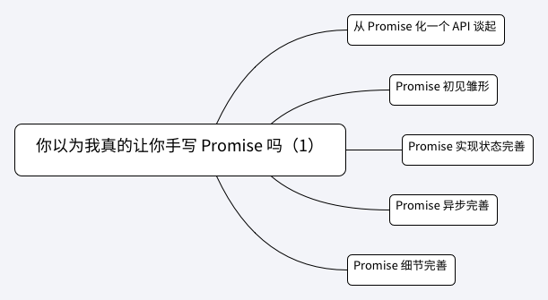

# 第2-3课：你以为我真的想让你手写 Promise 吗（上）

> [【翻译】Promises/A+规范](http://www.ituring.com.cn/article/66566)

通过前面几节课的学习，我们认识到：想优雅地进行异步操作，必须要熟识一个极其重要的概念 —— Promise。它是取代传统回调，实现同步链式写法的解决方案；是理解 generator、async/await 的关键。但是 Promise 对于初学者来说，并不是很好理解，其中的概念纷杂，且抽象程度较高。

与此同时，在中高级前端开发面试当中，对于 Promise 的考察也多种多样，近几年流行“让开发者实现一个 Promise”。那么这一讲，我就带大家实现一个简单的 Promise。注意：**实现不是最终目的，在实现的过程中，我会配以关键结论和关于 Promise 的考察题目，希望大家可以融会贯通。**

整个过程将分两节课完成，本讲的相关知识点如下：



### 从 Promise 化一个 API 谈起

熟悉微信小程序开发的读者应该知道，我们使用 wx.request() 在微信小程序环境中发送一个网络请求。参考官方文档，具体用法如下：

```
wx.request({
  url: 'test.php', // 仅为示例，并非真实的接口地址
  data: {
    x: '',
    y: ''
  },
  header: {
    'content-type': 'application/json' // 默认值
  },
  success(res) {
    console.log(res.data)
  }
})
```

配置化的 API 风格和我们早期使用 jQuery 中 Ajax 方法的封装类似。这样的设计有一个小的问题，就是容易出现“回调地狱”问题。如果我们想先通过 ./userInfo 接口来获取登录用户信息数据，再从登录用户信息数据中，通过请求 `./${id}/friendList` 接口来获取登录用户所有好友列表，就需要：

```
wx.request({
  url: './userInfo',
  success(res) {
    const id = res.data.id
    wx.request({
      url: `./${id}/friendList`,
      success(res) {
        console.log(res)
      }
    })
  }
})
```

这只是嵌套了一层回调而已，还够不成“地狱”场景，但是足以说明问题。

我们知道解决“回调地狱”问题的一个极佳方式就是 Promise，将微信小程序 wx.request() 方法进行 Promise 化：

```
const wxRequest = (url, data = {}, method = 'GET') => 
  new Promise((resolve, reject) => {
    wx.request({
      url,
      data,
      method,
      header: {
        //通用化 header 设置
      },
      success: function (res) {
        const code = res.statusCode
        if (code !== 200) {
          reject({ error: 'request fail', code })
          return
        }
        resolve(res.data)
      },
      fail: function (res) {
        reject({ error: 'request fail'})
      },
    })
  })
```

Promise 基本概念不再过多介绍。这是一个典型的 Promise 化案例，当然我们不仅可以对 wx.request() API 进行 Promise 化，更应该做的通用，能够 Promise 化更多类似（通过 success 和 fail 表征状态）的接口：

```
const promisify = fn => args => 
  new Promise((resolve, reject) => {
    args.success = function(res) {
      return resolve(res)
    }
    args.fail = function(res) {
      return reject(res)
    }
  })
```

使用：

```
cosnt wxRequest = promisify(wx.request)
```

通过上例，我们知道：

Promise 其实就是一个构造函数，我们使用这个构造函数创建一个 Promise 实例。该构造函数很简单，它只有一个参数，按照 Promise/A+ 规范的命名，把 Promise 构造函数的参数叫做 executor，executor 类型为函数。这个函数又“自动”具有 resolve、reject 两个方法作为参数。

请仔细体会上述结论，那么我们可以通过结论，开始实现 Promise 的第一步：

```
function Promise(executor) {

}
```

好吧，初始起步是够基本的了。如果读者还不理解构造函数的概念，我给大家推荐阅读： [构造函数与 new 命令](http://javascript.ruanyifeng.com/oop/basic.html)，在理解的基础上，让我们继续吧。

### Promise 初见雏形

在上面的 wx.request() 介绍中，实现了 Promise 化，因此对于嵌套回调场景，可以：

```
wxRequest('./userInfo')
  .then(
    data => wxRequest(`./${data.id}/friendList`),
    error => {
      console.log(error)
    }
  )
  .then(
    data => {
      console.log(data)
    },
    error => {
      console.log(error)
    }
  )
```

通过观察使用例子，我们来剖析 Promise 的实质：

**结论**　Promise 构造函数返回一个 promise 对象实例，这个返回的 promise 对象具有一个 then 方法。then 方法中，调用者可以定义两个参数，分别是 onfulfilled 和 onrejected，它们都是函数类型。其中 onfulfilled 通过参数，可以获取 promise 对象 resolved 的值，onrejected 获得 promise 对象 rejected 的值。通过这个值，我们来处理异步完成后的逻辑。

这些都是规范的基本内容： [Promise/A+](https://promisesaplus.com/)。

因此，继续实现我们的 Promise：

```
function Promise(executor) {

}

Promise.prototype.then = function(onfulfilled, onrejected) {

}
```

继续复习 Promise 的知识，看例子来理解：

```
let promise1 = new Promise((resolve, reject) => {
  resolve('data')
})

promise1.then(data => {
  console.log(data)
})

let promise2 = new Promise((resolve, reject) => {
  reject('error')
})

promise2.then(data => {
  console.log(data)
}, error => {
  console.log(error)
})
```

**结论**　我们在使用 new 关键字调用 Promise 构造函数时，在合适的时机（往往是异步结束时），调用 executor 的参数 resolve 方法，并将 resolved 的值作为 resolve 函数参数执行，这个值便可以后续在 then 方法第一个函数参数（onfulfilled）中拿到；同理，在出现错误时，调用 executor 的参数 reject 方法，并将错误信息作为 reject 函数参数执行，这个错误信息可以在后续的 then 方法第二个函数参数（onrejected）中拿到。

因此，我们在实现 Promise 时，应该有两个值，分别储存 resolved 的值，以及 rejected 的值（当然，因为 Promise 状态的唯一性，不可能同时出现 resolved 的值和 rejected 的值，因此也可以用一个变量来存储）；同时也需要存在一个状态，这个状态就是 promise 实例的状态（pending，fulfilled，rejected）；同时还要提供 resolve 方法以及 reject 方法，这两个方法需要作为 executor 的参数提供给开发者使用：

```
function Promise(executor) {
  const self = this
  this.status = 'pending'
  this.value = null
  this.reason = null

  function resolve(value) {
    self.value = value
  }

  function reject(reason) {
    self.reason = reason
  }

  executor(resolve, reject)
}

Promise.prototype.then = function(onfulfilled = Function.prototype, onrejected = Function.prototype) {
  onfulfilled(this.value)

  onrejected(this.reason)
}
```

为了保证 onfulfilled、onrejected 能够强健执行，我们为其设置了默认值，其默认值为一个函数元（Function.prototype）。

**注意，因为 resolve 的最终调用是由开发者在不确定环境下（往往是在全局中）直接调用的。为了在 resolve 函数中能够拿到 promise 实例的值，我们需要对 this 进行保存，上述代码中用 self 变量记录 this，或者使用箭头函数：**

```
function Promise(executor) {
  this.status = 'pending'
  this.value = null
  this.reason = null

  const resolve = value => {
    this.value = value
  }

  const reject = reason => {
    this.reason = reason
  }

  executor(resolve, reject)
}

Promise.prototype.then = function(onfulfilled = Function.prototype, onrejected = Function.prototype) {
  onfulfilled(this.value)

  onrejected(this.reason)
}
```

**为什么 then 放在 Promise 构造函数的原型上，而不是放在构造函数内部呢？**

这涉及到原型、原型链的知识了，虽然不是本讲的内容，这里还是简单地提一下：每个 promise 实例的 then 方法逻辑是一致的，在实例调用该方法时，可以通过原型（Promise.prototype）找到，而不需要每次实例化都新创建一个 then 方法，这样节省内存，显然更合适。

### Promise 实现状态完善

我们先来看一到题目，判断输出：

```
let promise = new Promise((resolve, reject) => {
  resolve('data')
  reject('error')
})

promise.then(data => {
  console.log(data)
}, error => {
  console.log(error)
})
```

**只会**输出：data，因为我们知道 promise 实例状态只能从 pending 改变为 fulfilled，或者从 pending 改变为 rejected。状态一旦变更完毕，就不可再次变化或者逆转。也就是说：如果一旦变到 fulfilled，就不能再 rejected，一旦变到 rejected，就不能 fulfilled。

而我们的代码实现，显然无法满足这一特性。执行上一段代码时，将会输出 data 以及 error。

因此，需要对状态进行判断和完善：

```
function Promise(executor) {
  this.status = 'pending'
  this.value = null
  this.reason = null

  const resolve = value => {
    if (this.status === 'pending') {
      this.value = value
      this.status = 'fulfilled'
    }
  }

  const reject = reason => {
    if (this.status === 'pending') {
      this.reason = reason
      this.status = 'rejected'
    }
  }

  executor(resolve, reject)
}

Promise.prototype.then = function(onfulfilled, onrejected) {
  onfulfilled = typeof onfulfilled === 'function' ? onfulfilled : data => data
  onrejected = typeof onrejected === 'function' ? onrejected : error => {throw error}

  if (this.status === 'fulfilled') {
    onfulfilled(this.value)
  }
  if (this.status === 'rejected') {
    onrejected(this.reason)
  }
}
```

我们看，在 resolve 和 reject 方法中，我们加入判断，只允许 promise 实例状态从 pending 改变为 fulfilled，或者从 pending 改变为 rejected。

同时注意，**这里我们对 Promise.prototype.then 参数 onfulfilled 和 onrejected 进行了判断，当实参不是一个函数类型时，赋予默认函数值**。这时候的默认值不再是函数元 Function.prototype 了。为什么要这么更改？后面会有介绍。

这样一来，我们的实现显然更加接近真实了。刚才的例子也可以跑通了：

```
let promise = new Promise((resolve, reject) => {
  resolve('data')
  reject('error')
})

promise.then(data => {
  console.log(data)
}, error => {
  console.log(error)
})
```

但是不要高兴得太早，promise 是解决异步问题的，我们的代码全部都是同步执行的，似乎还差了更重要的逻辑。

### Promise 异步完善

到目前为止，实现还差了哪些内容呢？别急，我们再从示例代码分析：

```
let promise = new Promise((resolve, reject) => {
  setTimeout(() => {
    resolve('data')
  }, 2000)
})

promise.then(data => {
  console.log(data)
})
```

正常来讲，上述代码会在 2 秒之后输出 data，但是我们实现的代码，并没有输入任何信息。这是为什么呢？

原因很简单，因为我们的实现逻辑全是同步的。在上面实例化一个 promise 的构造函数时，我们是在 setTimeout 逻辑里才调用 resolve，也就是说，2 秒之后才会调用 resolve 方法，也才会去更改 promise 实例状态。而结合我们的实现，返回实现代码，then 方法中的 onfulfilled 执行是同步的，它在执行时 this.status 仍然为 pending，并没有做到“2 秒中之后再执行 onfulfilled”。

那该怎么办呢？我们似乎应该在“合适”的时间才去调用 onfulfilled 方法，这个合适的时间就应该是开发者调用 resolve 的时刻，那么我们先在状态（status）为 pending 时，把开发者传进来的 onfulfilled 方法存起来，在 resolve 方法中再去执行即可：

```
function Promise(executor) {
  this.status = 'pending'
  this.value = null
  this.reason = null
  this.onFulfilledFunc = Function.prototype
  this.onRejectedFunc = Function.prototype

  const resolve = value => {
    if (this.status === 'pending') {
      this.value = value
      this.status = 'fulfilled'

      this.onFulfilledFunc(this.value)
    }

  }

  const reject = reason => {
    if (this.status === 'pending') {
      this.reason = reason
      this.status = 'rejected'

      this.onRejectedFunc(this.reason)
    }
  }

  executor(resolve, reject)
}

Promise.prototype.then = function(onfulfilled, onrejected) {
  onfulfilled = typeof onfulfilled === 'function' ? onfulfilled : data => data
  onrejected = typeof onrejected === 'function' ? onrejected : error => {throw error}

  if (this.status === 'fulfilled') {
    onfulfilled(this.value)
  }
  if (this.status === 'rejected') {
    onrejected(this.reason)
  }
  if (this.status === 'pending') {
    this.onFulfilledFunc = onfulfilled
    this.onRejectedFunc = onrejected
  }
}
```

测试一下，发现现在我们的实现也可以支持异步了！

同时，**我们知道 Promise 是异步执行的：**

```
let promise = new Promise((resolve, reject) => {
   resolve('data')
})

promise.then(data => {
  console.log(data)
})
console.log(1)
```

正常的话，这里会**按照顺序**，输出 1 再输出 data。

而我们的实现，却没有考虑这种情况，先输出 data 再输出 1。因此，需要将 resolve 和 reject 的执行，放到任务队列中。这里姑且先放到 setTimeout 里，保证异步执行（这样的做法并不严谨，为了保证 Promise 属于 microtasks，很多 Promise 的实现库用了 MutationObserver 来模仿 nextTick）。

```
const resolve = value => {
  if (value instanceof Promise) {
    return value.then(resolve, reject)
  }
  setTimeout(() => {
    if (this.status === 'pending') {
      this.value = value
      this.status = 'fulfilled'

      this.onFulfilledFunc(this.value)
    }
  })
}

const reject = reason => {
  setTimeout(() => {
    if (this.status === 'pending') {
      this.reason = reason
      this.status = 'rejected'

      this.onRejectedFunc(this.reason)
    }
  })
}


executor(resolve, reject)
```

这样一来，在执行到 executor(resolve, reject) 时，也能保证在 nextTick 中才去执行，不会阻塞同步任务。

同时我们在 resolve 方法中，加入了对 value 值是一个 Promise 实例的判断。看一下到目前为止的实现代码：

```
function Promise(executor) {
  this.status = 'pending'
  this.value = null
  this.reason = null
  this.onFulfilledFunc = Function.prototype
  this.onRejectedFunc = Function.prototype

  const resolve = value => {
    if (value instanceof Promise) {
      return value.then(resolve, reject)
    }
    setTimeout(() => {
      if (this.status === 'pending') {
        this.value = value
        this.status = 'fulfilled'

        this.onFulfilledFunc(this.value)
      }
    })
  }

  const reject = reason => {
    setTimeout(() => {
      if (this.status === 'pending') {
        this.reason = reason
        this.status = 'rejected'

        this.onRejectedFunc(this.reason)
      }
    })
  }

  executor(resolve, reject)
}

Promise.prototype.then = function(onfulfilled, onrejected) {
  onfulfilled = typeof onfulfilled === 'function' ? onfulfilled : data => data
  onrejected = typeof onrejected === 'function' ? onrejected : error => {throw error}

  if (this.status === 'fulfilled') {
    onfulfilled(this.value)
  }
  if (this.status === 'rejected') {
    onrejected(this.reason)
  }
  if (this.status === 'pending') {
    this.onFulfilledFunc = onfulfilled
    this.onRejectedFunc = onrejected
  }
}
```

这样的实现：

```
let promise = new Promise((resolve, reject) => {
   resolve('data')
})

promise.then(data => {
  console.log(data)
})
console.log(1)
```

也会**按照顺序**，输出 1 再输出 data。

```
let promise = new Promise((resolve, reject) => {
   resolve('data')
})
promise.then(data => {
  console.log(data)
})
console.log(1)
```

也会**按照顺序**，输出 1 再输出 data。

### Promise 细节完善

到此为止，似乎我们的 Promise 实现越来越靠谱了，但是还有些细节需要完善。

比如当我们在 promise 实例状态变更之前，添加多个 then 方法：

```
let promise = new Promise((resolve, reject) => {
  setTimeout(() => {
    resolve('data')
  }, 2000)
})

promise.then(data => {
  console.log(`1: ${data}`)
})
promise.then(data => {
  console.log(`2: ${data}`)
})
```

应该输出：

```
1: data
2: data
```

而我们的实现，只会输出 2: data，这是因为第二个 then 方法中的 onFulfilledFunc 会覆盖第一个 then 方法中的 onFulfilledFunc。

这个问题也好解决，只需要将所有 then 方法中的 onFulfilledFunc 储存为一个数组 onFulfilledArray，在 resolve 时，依次执行即可。对于 onRejectedFunc 同理，改动后的实现为：

```
function Promise(executor) {
  this.status = 'pending'
  this.value = null
  this.reason = null
  this.onFulfilledArray = []
  this.onRejectedArray = []

  const resolve = value => {
    if (value instanceof Promise) {
      return value.then(resolve, reject)
    }
    setTimeout(() => {
      if (this.status === 'pending') {
        this.value = value
        this.status = 'fulfilled'

        this.onFulfilledArray.forEach(func => {
          func(value)
        })
      }
    })
  }

  const reject = reason => {
    setTimeout(() => {
      if (this.status === 'pending') {
        this.reason = reason
        this.status = 'rejected'

        this.onRejectedArray.forEach(func => {
          func(reason)
        })
      }
    })
  }

  executor(resolve, reject)
}

Promise.prototype.then = function(onfulfilled, onrejected) {
  onfulfilled = typeof onfulfilled === 'function' ? onfulfilled : data => data
  onrejected = typeof onrejected === 'function' ? onrejected : error => {throw error}

  if (this.status === 'fulfilled') {
    onfulfilled(this.value)
  }
  if (this.status === 'rejected') {
    onrejected(this.reason)
  }
  if (this.status === 'pending') {
    this.onFulfilledArray.push(onfulfilled)
    this.onRejectedArray.push(onrejected)
  }
}
```

另外一个细节，在构造函数中如果出错，将会自动触发 promise 实例状态为 rejected，我们用 try...catch 块对 executor 进行包裹：

```
try {
  executor(resolve, reject)
} catch(e) {
  reject(e)
}
```

当我们故意写错时：

```
let promise = new Promise((resolve, reject) => {
  setTout(() => {
    resolve('data')
  }, 2000)
})

promise.then(data => {
  console.log(data)
}, error => {
  console.log('got error from promise', error)
})
```

就可以对错误进行处理，捕获到：

```
got error from promise ReferenceError: setTimeouteout is not defined
    at <anonymous>:2:3
    at <anonymous>:33:7
    at o (web-46c6729d4d8cac92aed8.js:1)
```

### 总结

这一小节，我们已经初步实现了基本的 Promise，实现结果固然重要，但是在实现过程中，也加深了对 Promise 的理解，得出了一些重要结论：

- Promise 状态具有凝固性
- Promise 错误处理
- Promise 实例添加多个 then 处理

最后，附上到此为止的全部代码：

```
function Promise(executor) {
  this.status = 'pending'
  this.value = null
  this.reason = null
  this.onFulfilledArray = []
  this.onRejectedArray = []

  const resolve = value => {
    if (value instanceof Promise) {
      return value.then(resolve, reject)
    }
    setTimeout(() => {
      if (this.status === 'pending') {
        this.value = value
        this.status = 'fulfilled'

        this.onFulfilledArray.forEach(func => {
          func(value)
        })
      }
    })
  }

  const reject = reason => {
    setTimeout(() => {
      if (this.status === 'pending') {
        this.reason = reason
        this.status = 'rejected'

        this.onRejectedArray.forEach(func => {
          func(reason)
        })
      }
    })
  }


  try {
    executor(resolve, reject)
  } catch(e) {
    reject(e)
  }
}

Promise.prototype.then = function(onfulfilled, onrejected) {
  onfulfilled = typeof onfulfilled === 'function' ? onfulfilled : data => data
  onrejected = typeof onrejected === 'function' ? onrejected : error => { throw error}

  if (this.status === 'fulfilled') {
    onfulfilled(this.value)
  }
  if (this.status === 'rejected') {
    onrejected(this.reason)
  }
  if (this.status === 'pending') {
    this.onFulfilledArray.push(onfulfilled)
    this.onRejectedArray.push(onrejected)
  }
}
```

下一讲我们将会继续实现 Promise、处理 Promise 实例的返回问题，以及更多的 Promise 静态方法。