# 课程1 - 什么是版本控制？

> 版本控制是专业程序员应该掌握的重要技能。在本节课，你将了解版本控制的优势，并学习如何安装版本控制工具 Git！

[TOC]

---


## 1. 什么是版本控制（version control）

我们将全面了解版本控制，并且我们将使用版本控制工具 Git 帮助我们管理我们项目的不同版本。在深入学习之前，我们来先讲个故事。

TOM 和 Jerry 玩二战策略型桌游，该桌游展示一张世界地图，你把棋子放在棋盘上并移动它们。玩一局这个游戏需要花费很长时间，有时候一天，有时候可能会更长。现在，因为这个大棋盘上有许多棋子分布在上面，如果他们不得不暂停游戏，他们会用手机拍一张照片。这些照片将作为游戏的保存点，以防棋盘或棋子发生什么变动，比如有人撞到了桌子或者狗狗走过并把棋子碰得到处都是。如果出了问题，他们可以用照片来重现当时的棋局，并且跳回到游戏里的时间点，所以每张图片都是一个保存点，这些图片记录了时间、拍摄者以及棋子的状态和位置，**这样的保存点正是版本控制所做的**。

它的强大之处在于，**当你使用版本控制的时候，你就创建了保存项目的安全区**，这让你可以自由地改变任何关于你的项目的信息并确保不会遗失任何东西。


---


我刚刚提到“版本控制”。因为你已经在学习这门课程，可能已经对版本控制有所了解。如果不了解的话，我可以教个小技巧：试着倒过来读，“版本控制”变成了“控制版本”！**版本控制系统是帮助你控制（或管理）某个事物（通常是源代码）的不同版本**。 


### 深入研究

- [维基百科版本控制页面(英)](https://en.wikipedia.org/wiki/Version_control) 
- [百度百科版本控制页面](https://baike.baidu.com/item/%E7%89%88%E6%9C%AC%E6%8E%A7%E5%88%B6/3311252?fr=aladdin)


---

市面上有许多版本控制系统，其中最为流行的三种为 Git、Subversion 和 Mercurial。尽管有几十个不同的版本控制系统，实际上只有两个不同的类别，**集中式模型（centralized model）和分布式模型（distributed model）**。

- 在集中式模型中，有一台功能强大的中央服务器托管项目，每个互动都必须通过这台中央服务器。

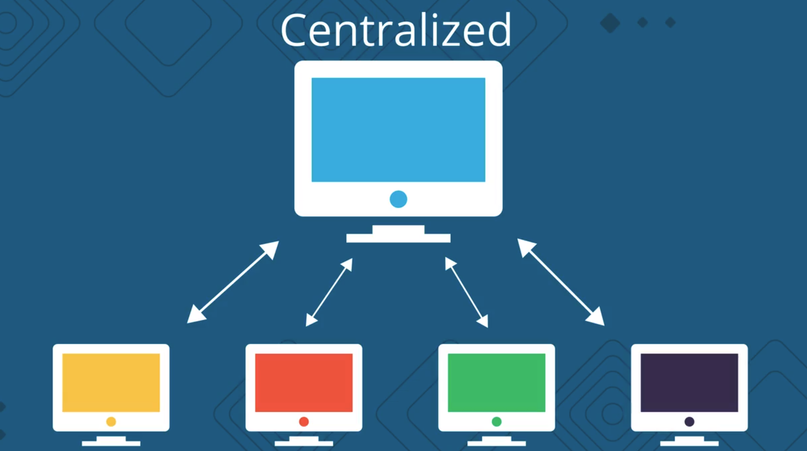

- 在分布式模型中，没有中央信息库。每个开发者的计算机里都有一份完整的项目拷贝。这非常酷，因为这意味着你可以离线工作。

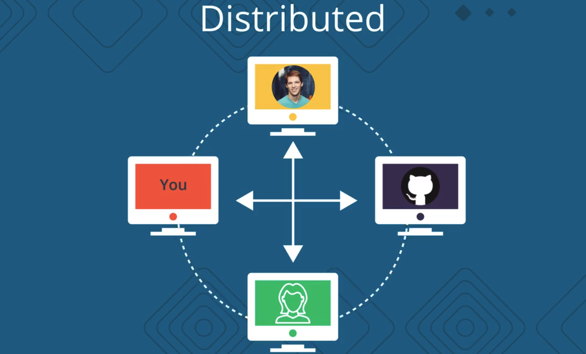

在本课程中，我们将使用版本控制系统 Git，它是分布式版本控制系统。你可能听说过，GitHub，Git 和 GitHub 是完全不同的。

- Git 是版本控制工具。
- GitHub 是托管 Git 项目的服务。

要使用 Git 项目，你未必要使用 GitHub，但它是一个非常棒的工具，你一定要看看。你可以基本上把它当作**可以上传你的项目副本的另一台计算机**。

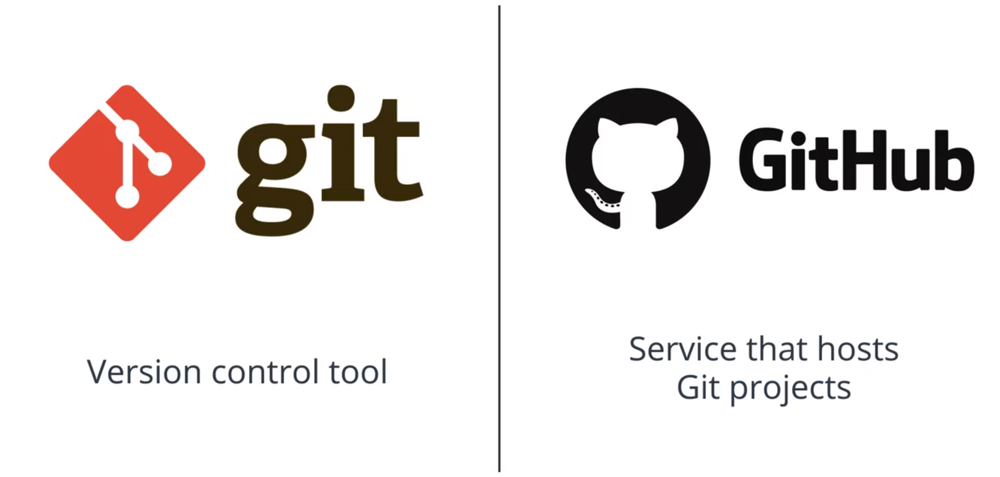

---


### 版本控制系统信息

有很多版本控制系统可供我们选择

- [Git](https://git-scm.com/)
- [Subversion](https://subversion.apache.org/)
- [Mercurial](https://www.mercurial-scm.org/)

版本控制系统模型包括两大主要类型：

- **集中式模型** - 所有用户都连接到一个中央的主仓库（master repository）
- **分布式模型** - 每个用户都在自己的计算机上拥有完整的仓库

### 深入研究

- [集中式与分布式版本控制系统的比较（Atlassian 博文 - 英）](http://blogs.atlassian.com/2012/02/version-control-centralized-dvcs/)
- 分布式版本控制：[维基百科链接](https://en.wikipedia.org/wiki/Distributed_version_control) | [百度百科链接](https://baike.baidu.com/item/DVCS/19310970)

### 小结

版本控制系统的主要目的是帮助你**保留项目的详细历史记录**，并且能够在不同的版本上进行工作。保留详细的项目历史记录很重要，因为这样可以看出一段时间内项目的进度。如果需要，你还可以回到项目的某个阶段，并恢复数据或文件。

在这门课程中，我们将使用分布式版本控制系统 Git。你可能很惊讶，其实你一直都在进行版本控制！


---


## 2. 日常开发中的版本控制

### 版本控制随处可见

我的工作是处理文档。我一直都在新建文档，并在文档中输入信息（希望是有用的信息！），然后编辑...编辑...编辑！你的工作也是这样吗？可能不是包含文字的文档，但是**你可能处理的是某种形式的数据，并且这些数据会逐渐改变。**

你可能觉得，在处理文档时，你没有用到版本控制，在某种程度上，你是对的。你在编写文档时，没有经常保留不同的文档版本。但是这并不表明没有不同版本的文档。计算机一直在帮助你记录不同的版本！

不相信我说的话？除了推测你是否表示怀疑的态度，我来证明下我的观点是正确的：

- 打开你最喜欢的文本编辑器
- 输入一些内容（不妨输入"version control is dull!"）
- 更改其中一个单词（例如将 "dull" 改为 "life-changing awesome"）
- 现在（到了精彩的部分了！）按下 `cmd` + `z` 或 `ctrl` + `z`

💥 版本控制起作用啦！（对吧？我说了我没有撒谎）我猜你肯定一直使用撤销命令。反正我是经常用！

实际上，我用到的**每个应用都具有撤销功能。你可以将它看做一种版本控制形式**，但是却是很简单的形式。我们来看看 Google 文档，了解一种更强大的版本控制形式。

[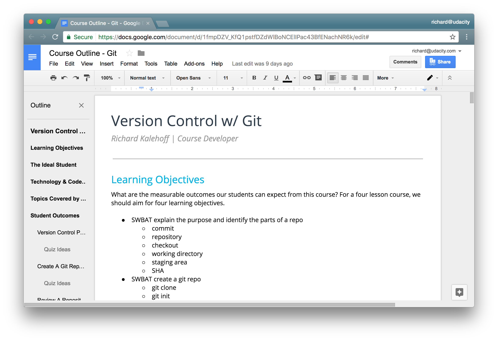*这门 Git 课程的 Google 文档大纲。*](https://classroom.udacity.com/courses/ud123/lessons/1b369991-f1ca-4d6a-ba8f-e8318d76322f/concepts/68d60539-7530-4c25-b038-41c81bc677c2#)

如果你用过 Google 文档的话，有没有注意到顶部的灰色小字，告诉你文档的状态？每当你输入内容时，它都在不断保存文档。当你输入完毕后，它会告诉你文档已保存。

[*Google 文档的状态栏。当你正在编辑文档时，状态栏提示“正在保存…”，内容保存后，提示“所有更改都已保存到云端硬盘”。*](https://classroom.udacity.com/courses/ud123/lessons/1b369991-f1ca-4d6a-ba8f-e8318d76322f/concepts/68d60539-7530-4c25-b038-41c81bc677c2#)

真正的问题是，你知道你可以点击这个链接吗？要不要点击看看？在你自己的 Google 文档中试试。

点击该链接将转到“版本历史记录（Revision history）”页面。（看到 Revision 一词了吗？Revision 和 Version 是同义词！表示：版本、修订）

### 版本历史记录并不足够强大

Google 文档的版本历史记录页面非常强大！我经常使用它，有时候输入了一些文字，然后删了，后来又意识到确实还要这些文字。

但是虽然功能很强大，但也并非十全十美。缺少了什么？我能想到的包括：

- 标记更改的功能
- 做出为何更改的详细描述的功能
- 在同一文档的不同版本之间切换的功能
- 撤消更改 A，编辑 B，然后回到更改 A 并且不影响编辑 B 的功能

版本控制工具 Git 可以实现以上所有功能，甚至更多！！！（猜测你没料到这一点吧！）我跟你提过 Git 非常强大吗？希望提过，因为我们将在下个部分详细了解 Git。


## 3. Git 和版本控制术语

刚刚开始学习 Git 的时候，会觉得最难上手的事情之一就是所用到的各种术语。但不用担心，只要浏览列表了解大体情况就好。

这些术语词汇是我们用来谈论关于版本控制系统，版本控制系统的功能，我们希望对版本控制系统中的代码作出的更改等等。

常用的一些术语包括：

- 版本控制系统（version control system）
- 源代码管理器（source code manager）
- 提交（commit）
- 存储库（repository）
- 库（repo）
- 检出（checkout）
- 工作目录（working directory）
- 暂存区（staging area）
- 索引（the index）
- 暂存索引（staging index）
- SHA（Secure Hash Algorithm）
- 分支（branching）
- 合并（merging）
- 合并冲突（merge conflicts）
- 远程（remotes）

虽然这些术语让人有点应接不暇，不过，这门课程为大家创建了一份讲义。这份讲义列出了最重要的术语及其简短定义，作为本课程的辅助材料。

强烈建议你立即下载，将其放在桌面上、或者打印出来放在桌子上。在课程学习过程中使用它来查看关键术语。

一开始，这些词可能让人难以理解，这是一个“先有鸡还是先有蛋”的问题。我应该先学术语，还是先学如何实际使用 Git？我觉得**如果你对 Git 术语有所了解，你在学习 Git 时也会事半功倍**。

另外，**创建自己的速查表**也会对你有所帮助。**如果你记不住某个词或概念，不妨将其写下来**。如果你掌握了有点拗口的版本控制术语，你已经朝着成为 Git 大师迈出了一大步。

你可以在课程资源面板中找到术语讲义。文件名称为“Git Terms PDF”，在辅助材料中也可以找到它。 


---


### 术语

#### 版本控制系统 / 源代码管理器

**版本控制系统**（简称 **VCS**）是一个**管理源代码不同版本的工具**。**源代码管理器**（简称 **SCM**）是版本控制系统的**另一个名称**。

Git 是一个 SCM（因此也是 VCS！）。Git 网站的 URL 是 <https://git-scm.com/> （注意它的域名中直接包含“SCM”！）。

#### 提交（Commit）

Git **将数据看做微型文件系统的一组快照**。每次 **commit**（在 Git 中保持项目状态），它都对文件当时的状况拍照，并存储对该快照的引用。你可以将其看做游戏中的保存点，它会保存项目的文件和关于文件的所有信息。

你**在 Git 中的所有操作都是帮助你进行 commit**，因此 **commit 是 Git 中的基本单位。**

#### 仓库（Repository / repo）

**仓库**是**一个包含项目内容以及几个文件（在 Mac OS X 上默认地处于隐藏状态）的目录**，**用来与 Git 进行通信**。仓库可以存储在本地，或作为远程副本存储在其他计算机上。**仓库是由 commit 构成的**。

#### 工作目录 / 工作区（Working Directory）

**工作目录**是你**在计算机的文件系统中看到的文件**。当你在代码编辑器中打开项目文件时，你是在工作目录中处理文件。

**与这些文件形成对比的是保持在仓库中（在 commit 中！）的文件。**

在使用 Git 时，工作目录与命令行工具的 *current working directory* （当前工作目录）不一样，后者是 shell 当前正在查看的目录。

#### 检出（Checkout）

**检出**是**指将仓库中的内容复制到工作目录下。**

#### 暂存区 / 暂存索引 / 索引（Staging Area / Staging Index / Index）

Git 目录下的一个文件，存储的是即将进入下个 commit 内容的信息。可以将**暂存区**看做准备工作台，Git 将在此区域获取下个 commit。**暂存索引中的文件是准备添加到仓库中的文件**。

#### SHA

**SHA** 是**每个 commit 的 ID 编号**。以下是 commit 的 SHA 示例：`e2adf8ae3e2e4ed40add75cc44cf9d0a869afeb6`。

它是一个长 40 个字符的字符串（由 0–9 和 a–f 组成），并**根据 Git 中的文件或目录结构的内容计算得出**。SHA 的全称是"Secure Hash Algorithm"（安全哈希算法）。如果你想了解哈希算法，请参阅我们的[计算机科学入门课程](https://www.udacity.com/course/intro-to-computer-science--cs101)。

#### 分支（Branch）

**分支**是从主开发流程中分支出来的新的开发流程。这种分支开发流程可以在不更改主流程的情况下继续延伸下去。

回到之前关于游戏保存点的示例，你可以将分支看做在游戏中设立保存点后，尝试一个有风险的招式。如果有风险的招式不奏效，则回到保存的位置。令分支非常强大的关键之处是你可以在一个分支上设定保存点，然后切换到另一个分支并继续设定保存点。

了解这些术语后，我们将探寻使用版本控制的一般流程，从更高的层面了解如何使用 Git。


---


假设我们有一个由这三个文件组成的项目。

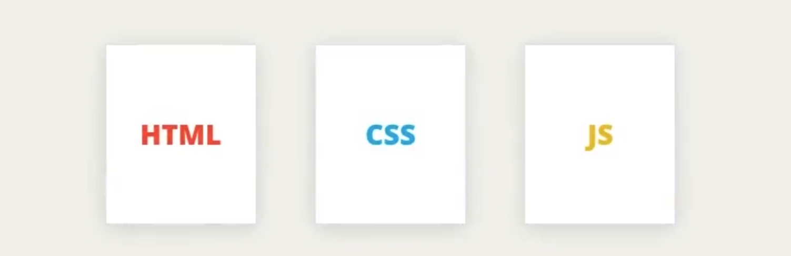

我们想在这个项目中使用版本控制，因此要创建一个新的 git 仓库。在 git 仓库中，有三个我们需要知道的主要区域。

- 首先是**工作区**
- 其次是**暂存区**
- 最后是**仓库区**

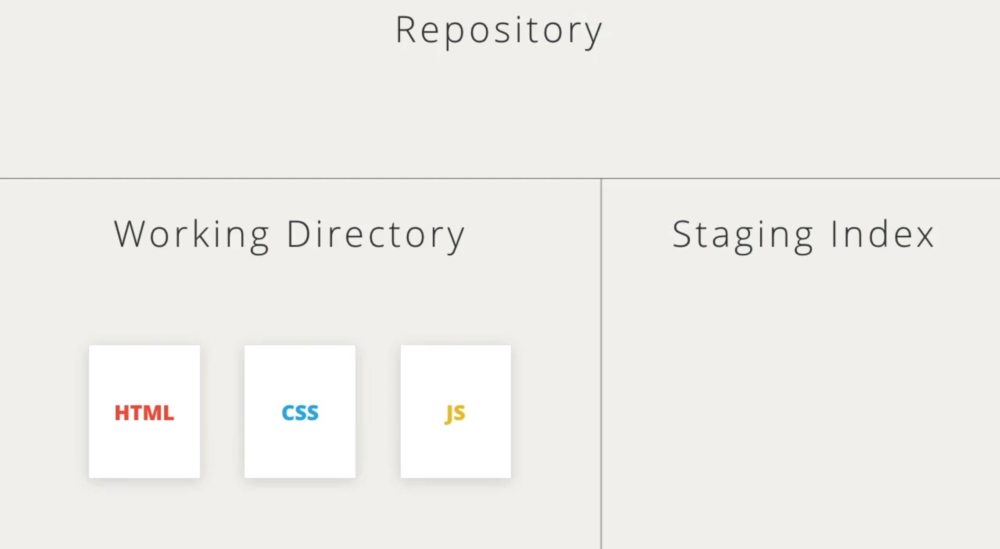

所以在 git 中有这三个不同的区域。当你第一次使用 git 时，可能不太容易意识到有这三个不同的区域，因为你并不会在计算机上的文件中看到任何可见的更改，但 git 的确管理着这三个不同的区域。

我们将使用 git shell 命令与文件进行交互，并将其移动到不同的区域。现在，我们已经创建了这个空的 git 仓库，我们知道它是一个空仓库，因为仓库区是空的。git 能够分辨从未见过的文件，让我们用绿色星标来表示一个新文件。git 通过将文件添加到仓库来跟踪文件，但**我们不能将这些文件直接移动到仓库区中，它们必须首先被移动到暂存区**，因此，我们使用 git 将更改移动到暂存区。请记住，暂存区可以用于存放所有**即将**提交的文件。

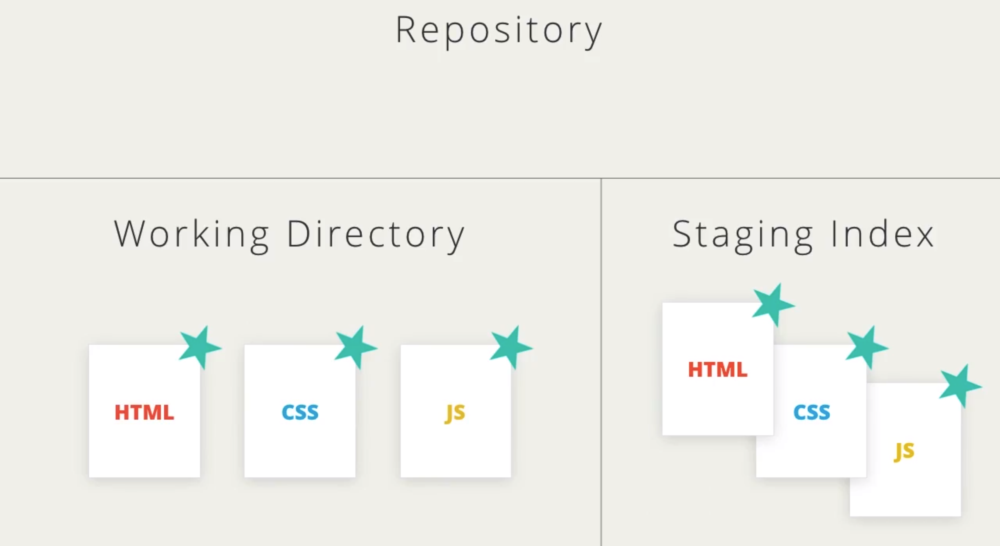

现在让我们提交文件，这会将其移动到仓库区中。这些文件在目前状态下是安全的，假设我们对网站的 CSS 文件进行了一些更改，git 看到这个更改后会将该文件标记为已修改。我们采取相同的步骤，将 CSS 文件中的更改移动到暂存区中，然后将其提交。

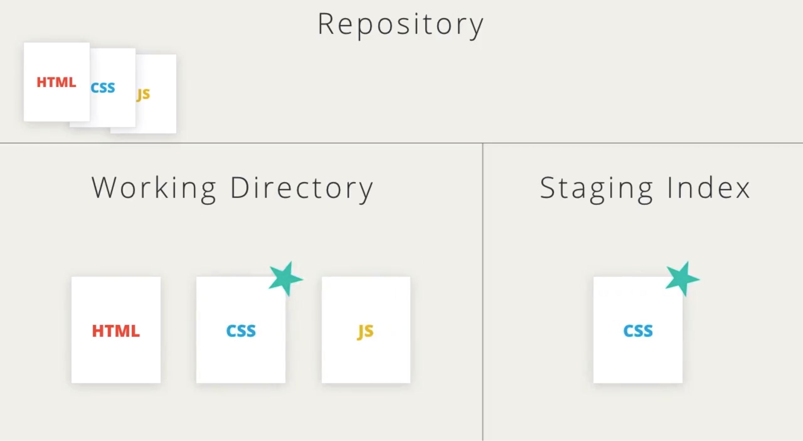

让我们再来描述一次，假设 HTML 和 JavaScript 文件发生了更改，请记住 **git 知道哪些文件是新的或已更改**。我们将这些更改移动到暂存区中，然后将其提交。

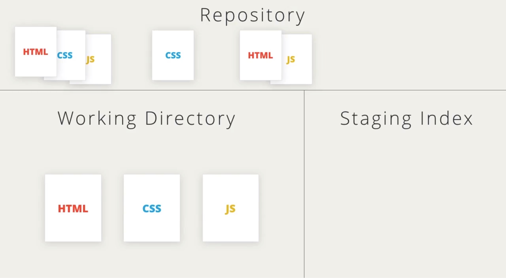

所以步骤就是：

1. 添加一个新文件或修改一个现有文件
2. 将更改移动到暂存区中
3. 然后再将更改提交到仓库区。

那么，如果出现以下呢？

假设 HTML 和 CSS 文件发生了更改，我们也暂存了更改，如果我们决定再次修改 HTML 文件，然后立即提交，会发生什么？

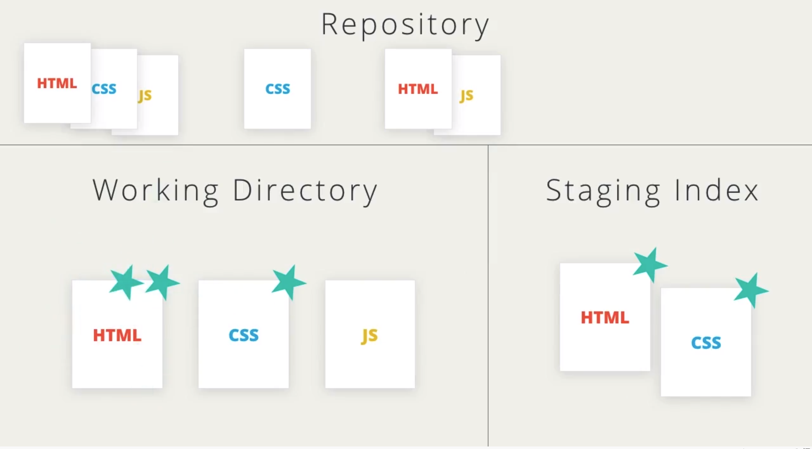


#### 练习题

HTML 文件在暂存区具有 HTML 和 CSS 更改，并在工作目录中具有其他 HTML 更改。根据你现目前所学的 commit 工作原理知识，如果现在 commit 的话，会 commit 什么内容？

- 只有暂存区的 HTML 文件更改。
- 只有暂存区的 CSS 文件更改。
- √ 暂存区的 HTML 和 CSS 文件更改。
- 工作目录和暂存区的 HTML 文件更改。


当我们进行提交时，只有暂存区中的更改才会被移动到仓库区中。如果我们想在提交中包含第二组更改，则需要暂存这些更改。**当我们将 HTML 文件的第二组更改暂存后，HTML 文件的这两组更改会被合并为一组更改**，然后我们就可以正常提交，将这些更改移动到仓库区。

我们已经将所有更改保存在仓库区中，但如何访问这些提交呢？如果我们想查看这个具体的提交信息怎么办？

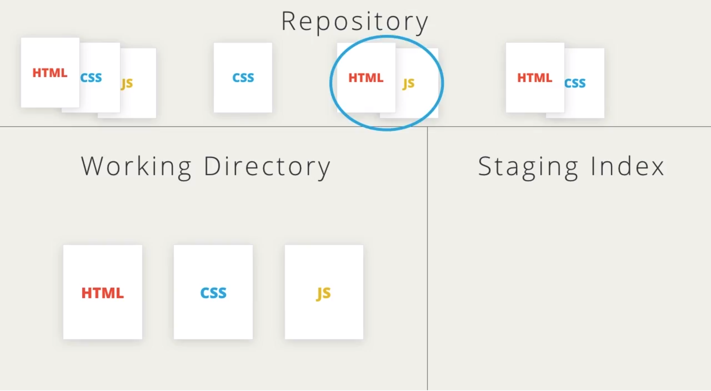

针对每个提交，git 都会为其创建一个 ID，**每个提交的 ID 即其 SHA**。每个提交的 SHA 的前七个字符就像这样。

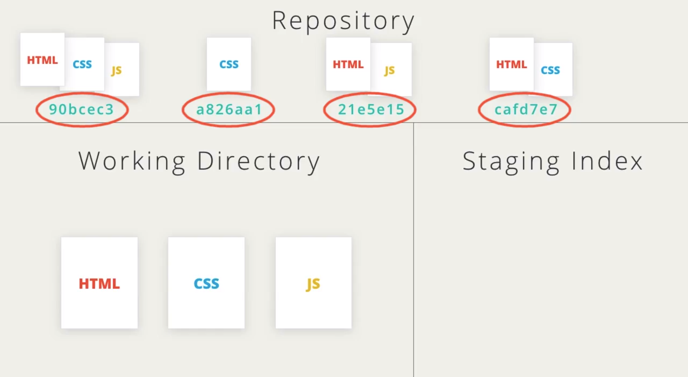


---


**git 的核心是将文件更改记录为提交**，这些提交都保存在仓库区中。其他一切，像工作区目录和 SHA，都是用于生成和引用提交的。

如你所见，版本控制使用的术语起初有点晦涩难懂。希望你下载术语讲义，并参照这份讲义浏览有关 git 使用方法的粗略概述。

在下节课中，我们将安装和配置 git，请确保顺序执行每个步骤，让你的计算机跟我的配置相同。当然，你不需要配置终端也能正常使用 git 和继续学习本课程。你可以跳过这一步来完成整个课程，但配置终端不仅能让 git 更容易使用，而且所有专业人士都会自定义终端，我们要做的自定义将为终端添加色彩并可显示特定的 git 信息。


### 资源

[优达学城 Git 关键术语](https://udacity.github.io/frontend-nanodegree-styleguide-zh/udacity-git-keyterms.pdf)

(↓英文原版请点击下方链接↓)

#### 辅助材料

[ Git Terms PDF](http://video.udacity-data.com.s3.amazonaws.com/topher/2017/March/58d31eb5_ud123-git-keyterms/ud123-git-keyterms.pdf)


## 4. MAC/Linux 设置

### 安装 Git

Mac OS 实际上已经安装了 Git，但是我们可以重新安装，以便使用最新的版本：

1. 转到 <https://git-scm.com/downloads>
2. 下载 Mac 版软件
3. 安装 Git 并选择所有默认选项

安装完毕后，你应该能够在命令行工具中运行 `git`。如果显示了使用信息，则一切正常！

如果遇到任何问题，请在论坛中告诉我们。

### 配置 Mac 的终端

我们即将配置终端，以便当我们位于版本控制目录下时，可以显示有用的信息。*这是可选步骤！*你不需要重新配置终端，Git 就能运行。你可以完成整个课程而不用重新配置终端。但是，重新配置的话，使用起来更方便。

如果你选择配置终端，完毕后，看起来如下图所示。

[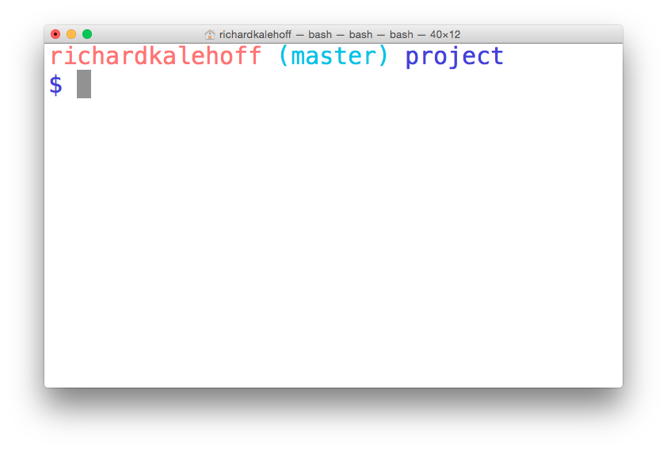*Mac OS 上的终端应用。终端已经过配置，可以显示版本控制信息。*](https://classroom.udacity.com/courses/ud123/lessons/1b369991-f1ca-4d6a-ba8f-e8318d76322f/concepts/63a6f935-dea7-43c2-aaa3-61deea5070c8#)

#### 配置步骤

要配置终端，我们将执行以下步骤：

1. 下载 zip 文件
2. 将目录 `udacity-terminal-config` 移到你的主目录下，并命名为 `.udacity-terminal-config`（注意前面有个点）
3. 将 `bash_profile` 文件移到你的主目录下，并命名为 `.bash_profile`（注意前面有个点）
4. 如果主目录下已经有 `.bash_profile` 文件，则将下载的 `bash_profile` 文件中的内容复制到现有的 `.bash_profile` 文件中

下载课程资源面板中的 zip 文件即可开始。

#### 提示

对于 **Ubuntu** 用户，你需要把设置信息复制到 `.bashrc` 文件中，而不是 `.bash_profile`


---


我已经下载了这些文件并解压了目录，在终端中，我要输入 cd 以确保我在主目录中。使用 mv（移动）命令将 udacity-terminal-config 目录移动到我的主目录，但我还想在前面添加一个点来重命名它。

由于终端位于主目录中，我要将此目录（config 目录）移动到主目录并将其命名为 .udacity-terminal-config（这里他是直接拖拽进了终端窗口）。

```shell
mv (被拖动进来的 udacity-terminal-config 所在目录) .udacity-terminal-config
```

bash_profile 文件也需要在我的主目录中，但这是一个很常见的文件，如果我已经有这个文件，我不想覆盖它。我要使用 ls -a 来检查我是否已经有这个文件。

```shell
ls -a
```

我已经有一个 bash_profile 文件，所以我要在代码编辑器中将其打开：

```shell
atom .bash_profile
```

并且将下载好的 bash_profile 文件中内容复制粘贴到刚刚打开的已存在的 bash_profile 文件的最后。

如果主目录没有 bash_profile 文件，我们可以将下载好的 bash_profile 移动到主目录 并且更改名称：

```shell
mv /Users/harry/Downloads/bash_profile .bash_profile
```

- 我所下载的 bash_profile 位于 /Users/harry/Downloads/bash_profile
- 注意更改名称实际上是在前面添加一个 `.`

完成以上的操作之后，你的终端应该是这样的：

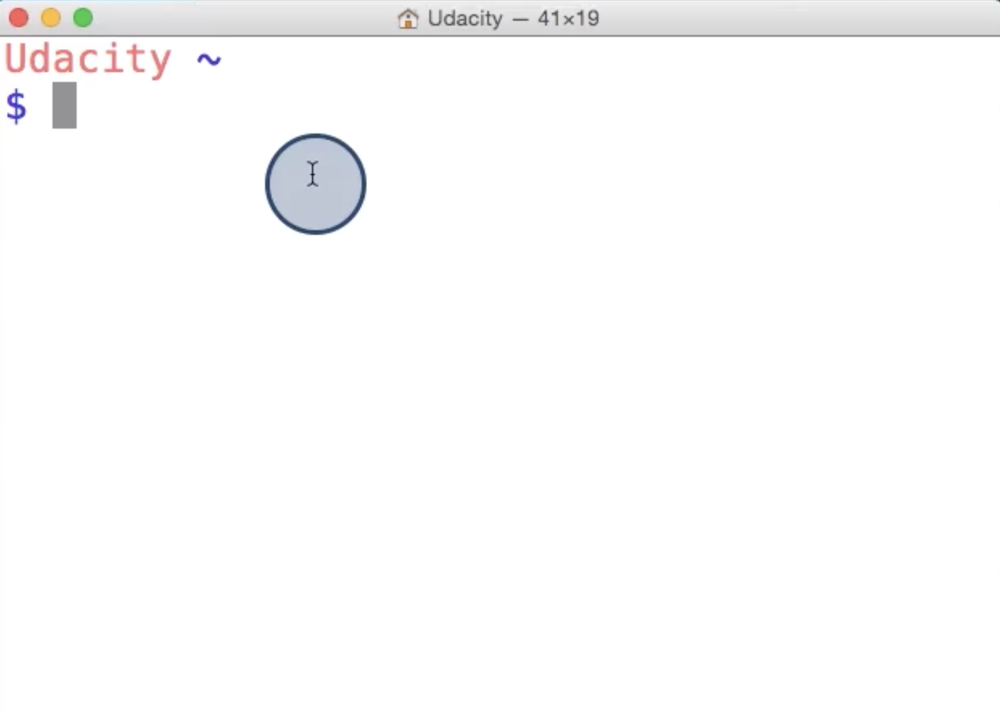

---

#### 初次配置 Git

在开始使用 Git 之前，你需要配置 Git。在命令行工具中运行以下每行，确保所有选项都已被配置好。

```
# 设置你的 Git 用户名
git config --global user.name "<Your-Full-Name>"

# 设置你的 Git 邮箱
git config --global user.email "<your-email-address>"

# 确保 Git 输出内容带有颜色标记
git config --global color.ui auto

# 对比显示原始状态
git config --global merge.conflictstyle diff3

git config --list
```

### Git 与代码编辑器

最后一个配置步骤是让 Git 能与你的代码编辑器结合使用。以下是三个最热门的代码编辑器。如果你使用的是其他编辑器，则在 Google 中搜索“修改 Git 默认编辑器为 X 编辑器”（将 X 替换为你的代码编辑器的名称）。

#### Atom Editor 设置

```
git config --global core.editor "atom --wait"
```

### Sublime Text 设置

```
git config --global core.editor "'/Applications/Sublime Text 2.app/Contents/SharedSupport/bin/subl' -n -w"
```

#### VSCode 设置

```
git config --global core.editor "code --wait"
```

如果你有任何问题，请发布到论坛上。

#### 辅助材料

[ udacity-terminal-config.zip](http://video.udacity-data.com.s3.amazonaws.com/topher/2017/March/58d31ce3_ud123-udacity-terminal-config/ud123-udacity-terminal-config.zip)


## 5. Windows 设置步骤

### 安装 Git

要下载 Git：

1. 转到 <https://git-scm.com/downloads>
2. 下载 Windows 版软件
3. 安装 Git 并选择所有默认选项

安装完毕后，你应该能够在命令行工具中运行 `git`。如果显示了使用信息，则一切正常！

如果遇到任何问题，请在论坛中告诉我们。

### 在 Windows 上配置命令提示符

我们即将配置命令提示符，以便当我们位于版本控制目录下时，可以显示有用的信息。*这是可选步骤！*重新配置命令提示符并非 Git 运行的必要步骤。你可以在不重新配置命令提示符的情况下完成整个课程。但是，重新配置的话，使用起来更方便。

如果你选择配置命令提示符，那么在你完成后的效果应该是这样的。

[*Windows 上的命令提示符应用。命令提示符已经配置过，可直接显示版本控制信息。*](https://classroom.udacity.com/courses/ud123/lessons/1b369991-f1ca-4d6a-ba8f-e8318d76322f/concepts/8a5af628-7a18-49cf-bbc8-02691762f862#)


---

这是下载的配置文件：

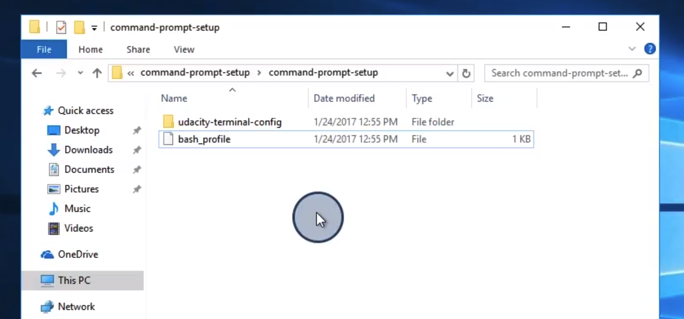

我们需要将这些文件移动到主目录中，最简单的方法是右键点击窗口，并从选项列表中选择 Git Bash Here，出现这个选项是因为我们已经在此机器上安装了 Git。

在 shell 中，只需输入 cd 然后按回车键，即可将 shell 移动到主目录中。

要在 Windows 资源管理器中打开此目录，请输入 start 和一个句点。

如果希望能随时跳转到这个目录，我们可以将其固定到“快速访问”菜单中。要做到这一点，请右键点击“快速访问”然后选择“将当前文件夹固定到快速访问”。

现在我们已经打开了主目录，可以将配置文件移动过来。选择这两个项目，并将它们拖到主目录窗口。然后我们就需要正确命名了。

这两个文件都需要在名称开头加一个点，由于 Windows 重命名功能不允许这样操作，所以我们必须在命令行上这样做。我们使用 mv 命令将 bash_profile 重命名为 .bash_profile，并对文件夹采取同样的操作。

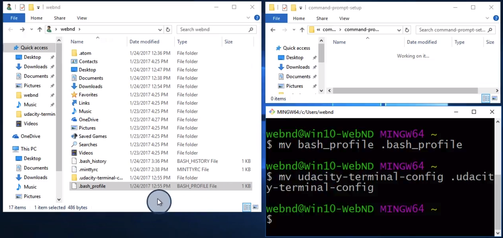

要查看更改，必须打开一个新的 shell。如果想要改变窗口中的样式，比如你可能比较喜欢白色背景和黑色文本，那么可以这样操作：

- 点击应用程序左上角，选择 Options，将前景色更新为黑色，背景色更新为白色。


---


### 初次配置 Git

在开始使用 Git 之前，你需要配置 Git。在命令行工具中运行以下每行，确保所有选项都已被配置好。

```
# 设置你的 Git 用户名
git config --global user.name "<Your-Full-Name>"

# 设置你的 Git 邮箱
git config --global user.email "<your-email-address>"

# 确保 Git 输出内容带有颜色标记
git config --global color.ui auto

# 对比显示原始状态
git config --global merge.conflictstyle diff3

git config --list
```

#### Git 与代码编辑器

最后一个配置步骤是让 Git 能与你的代码编辑器结合使用。以下是三个最热门的代码编辑器。如果你使用的是其他编辑器，则在 Google 中搜索“修改 Git 默认编辑器为 X 编辑器”（将 X 替换为你的代码编辑器的名称）。

#### Atom Editor 设置

```
git config --global core.editor "atom --wait"
```

#### Sublime Text 设置

```
git config --global core.editor "C:/Program Files/Sublime Text 2/sublime_text.exe' -n -w"
```

#### VSCode 设置

```
git config --global core.editor "code --wait"
```

如果你有任何问题，请发布到论坛上。


#### 辅助材料

[ udacity-terminal-config.zip](http://video.udacity-data.com.s3.amazonaws.com/topher/2017/March/58d31ce3_ud123-udacity-terminal-config/ud123-udacity-terminal-config.zip)