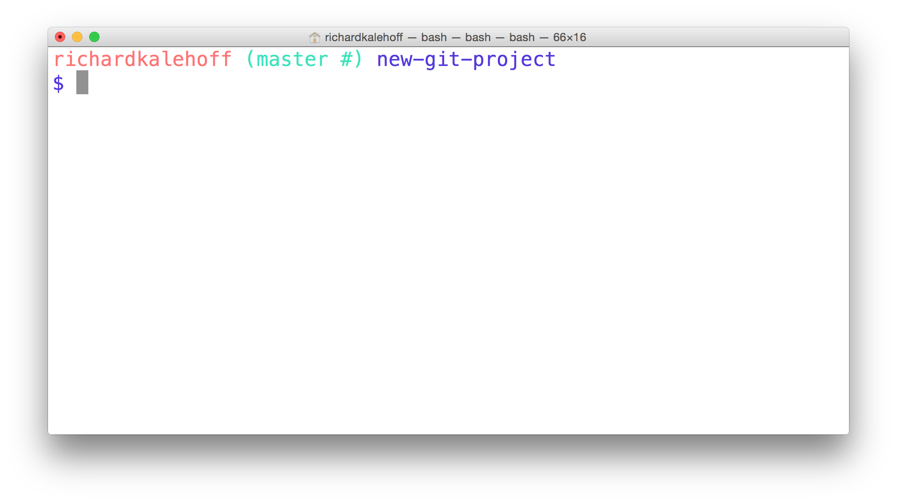
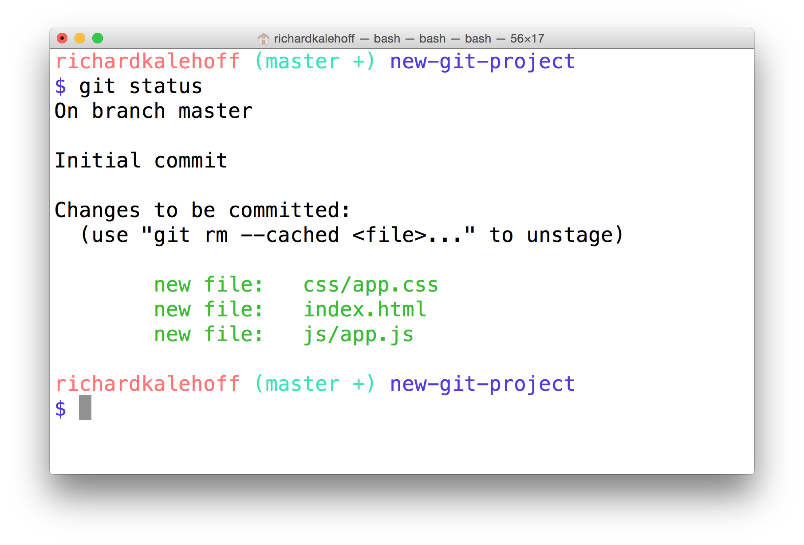
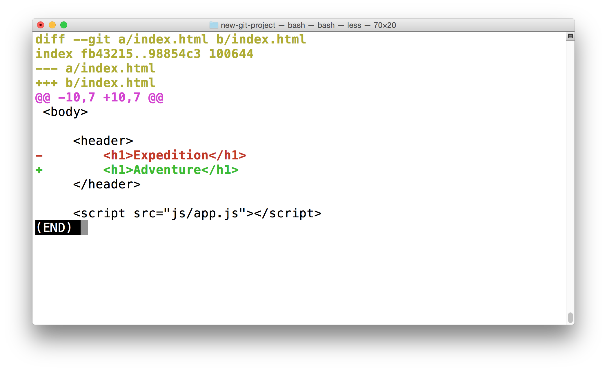

# 课程4：向仓库中添加 commit

> 没有 commit 的仓库就什么也不是。在这节课，你将学习如何提交 commit，编写具有描述性的提交说明，以及验证保存到仓库中的更改。

[TOC]

---


## 1. 简介

在本课中，我们要学习如何创建自己的提交。

我们已经打好基础

- 学会了使用 `git init` 命令来创建新仓库
- 使用 `git clone` 命令来复制现有仓库
- 使用 `git log` 命令来查看现有的提交
- 以及使用非常重要的 `git status` 命令来查看仓库状态

顺便提一句，请记得下载包含所有术语的速查表，并在本课中作为参考，因为我们将使用该表中的几乎每个术语。

在本课中，我们要在这些只是的基础上添加 `git add`、`git commit` 和 `git diff`

- `git add` 可以让你将文件从工作目录添加到暂存区中
- `git commit` 可以让你将文件从暂存区中取出并保存在仓库区，也就是你实际将要提交的地方
- `git diff` 命令非常好用，你可能对它非常熟悉，因为你之前已经看过它的输出了。`git diff` 可以显示文件两个版本之间的差异。它的输出与上节课中使用的 `git log -p` 命令的输出完全一样。

所以，我们有几个新的命令要学，有一个是你非常熟悉的。


---


## 2.  git add


### 移至正确的项目

如果你一直跟着操作，那么现在你的计算机中，应该在两个目录下有 git 项目：

- new-git-project - 使用 `git init` 转换为 git 仓库的空目录
- course-git-blog-project - 使用 `git clone` 获得的现有博客项目

为了避免与已有的 commit 产生混淆，我们将向 new-git-project 仓库提交 commit。

在终端上，确保使用 `cd` 命令转到 `new-git-project` 目录中。如果你没有 `new-git-project` 目录，现在创建一个。位于该目录中后，运行 `git init` 命令。如果你之前已经运行了 `git init`，没关系。多次运行 `git init` 不会导致任何问题，因为它只是重新初始化 Git 目录。

#### 正确设置

##### 现在该确保我们的配置是一样的了：

Task List

- 我已经在终端上使用 `cd` 命令转到 `new-git-project` 目录中
- 我已经运行 `git init` 创建了新的 git 仓库

你的终端应该如下图所示：

[*位于 new-git-project 目录中的终端。*](https://classroom.udacity.com/courses/ud123/lessons/5f584ce7-1b7b-4848-80c1-b559739ea363/concepts/85cd2f5e-a3a9-467f-9043-96d8b627787b#)

### 状态！状态！状态！

我已经多次提到，但是还是要提下，`git status` 命令在这节课将非常有用。你应该在任何一个其他 git 命令之前和之后运行 `git status` 命令。

我们立即运行该命令吧！

[*终端显示了 git status 命令的输出结果。*](https://classroom.udacity.com/courses/ud123/lessons/5f584ce7-1b7b-4848-80c1-b559739ea363/concepts/85cd2f5e-a3a9-467f-9043-96d8b627787b#)

### git status 输出总结

以下是输出：

```
On branch master

Initial commit

nothing to commit (create/copy files and use "git add" to track)
```

注意最后一行 – `nothing to commit (create/copy files and use "git add" to track)`。注意到它推荐使用的 `git add` 命令了吗？这很有帮助！`git status` 的输出结果将给出下一步应该怎么做的建议或提示。

我们根据反馈的建议操作，并创建一些文件。

### 创建 HTML 文件

首先，创建一个叫做 `index.html` 的文件，并添加一些起始代码：

```html
<!doctype html>
<html lang="en">
<head>
    <meta charset="utf-8">
    <title>Blog Project</title>
    <meta name="viewport" content="width=device-width, initial-scale=1">
    <meta name="description" content="">
    <link rel="stylesheet" href="css/app.css">
</head>
<body>

    <script src="js/app.js"></script>
</body>
</html>
```

注意，代码引用了 CSS 文件和 JavaScript 文件。

现在创建这些 CSS 和 JavaScript 文件。你可以让这两个文件留空。稍后我们将向文件中添加内容。

### 验证项目设置

##### 在继续之前，确保我们的设置相同。完成后请清点一下这些状态进行确认：

Task List

- 我已经创建了 `index.html` 并加入了上述起始代码（并保存了文件）
- 我已经创建了 `css` 文件夹并在其中创建了 `app.css`
- 我已经创建了 `js` 文件夹并在其中创建了 `app.js`

### 快速检查 git 状态

我们刚刚通过添加了文件和内容对仓库进行了几个更改。现在该快速检查下 git 的状态了：

```shell
          $ git status
```

我的终端显示了以下内容：

[*终端在新加入的"Untracked files"部分显示了 index.html 文件，以及 css 与 js 文件夹。*](https://classroom.udacity.com/courses/ud123/lessons/5f584ce7-1b7b-4848-80c1-b559739ea363/concepts/85cd2f5e-a3a9-467f-9043-96d8b627787b#)

### 整体回顾

很酷吧？我们尚未对 git 执行任何特殊操作，但是它已经在观察这个目录（因为它是 git 项目），并且知道我们创建了几个新的文件。`git status` 命令的输出同样十分简洁地告诉我们 git 没有跟踪这些文件。

我们快速回顾一下正在进行的操作以及将要执行的操作：

- 我们新建了几个希望 git 开始跟踪的文件
- 为了让 git 能跟踪文件，需要将该文件提交到仓库中
- 要提交文件，需要将该文件放入暂存区
- 可以使用 `git add` 命令将文件从工作目录移到暂存区
- 工作目录中目前有三个未跟踪文件
- `index.html`
- `css` 目录下的 `app.css`
- `js` 目录下的 `app.js`

要将所有文件提交到仓库中，首先需要将这些文件从工作目录移到暂存区。我们将使用 `git add` 命令将这三个文件移到暂存区。

[*未跟踪的 HTML、CSS 和 JavaScript 文件从工作目录添加到了暂存区。*](https://classroom.udacity.com/courses/ud123/lessons/5f584ce7-1b7b-4848-80c1-b559739ea363/concepts/85cd2f5e-a3a9-467f-9043-96d8b627787b#)

### 暂存文件

是时候行动了！在终端上运行以下命令，使用 `git add` 将 `index.html` 添加到暂存区：

```
$ git add index.html
```

注意：我们仅添加了 `index.html` 文件。稍后我们将添加 CSS 和 JavaScript 文件。

[*终端正在输入命令"git add index.html"以将该文件添加到暂存区。*](https://classroom.udacity.com/courses/ud123/lessons/5f584ce7-1b7b-4848-80c1-b559739ea363/concepts/85cd2f5e-a3a9-467f-9043-96d8b627787b#)

运行 `git add` 命令没有任何输出（同样也没有错误）。如何让 git 告诉我们它执行了什么操作以及添加的 `index.html` 文件发生了什么呢？`git status` 就可以告诉我们这些信息。**你可能对我一直在强调 `git status` 命令的重要性开始感到厌烦了，但是它是非常重要的命令，特别是在你对版本控制/命令行工具不是非常熟练的时期，更要注重该命令。**

我们来看看项目的状态：

```
 $ git status
```

这是我获得的输出结果：

[*终端运行 git status 命令的结果如下。它显示 index.html 现在位于"Changes to be committed"分类下。*](https://classroom.udacity.com/courses/ud123/lessons/5f584ce7-1b7b-4848-80c1-b559739ea363/concepts/85cd2f5e-a3a9-467f-9043-96d8b627787b#)

### Changes to be committed

输出结果中现在出现了全新的区域："Changes to be committed"区域！这一新的"Changes to be committed"区域显示了位于暂存区的文件！目前只显示了 `index.html` 文件，因此暂存区只有这个文件。继续这一思路，如果我们现在提交 commit，则只有 index.html 文件会被提交。

> 提示：你注意到"Changes to be committed"下方的帮助文本了吗？它提示 `(use "git rm --cached <file>..." to unstage)`，也就是当你不小心运行了 `git add` 并提供了错误文件，它会提示你应该怎么操作。
>
> 顺便提下，`git rm --cached` 与 shell 的 `rm` 命令不同。**`git rm --cached` 不会破坏任何属于你的文件，它只是从暂存区删掉了文件。**
>
> 此外，帮助文本中出现了"unstage"（撤消暂存）字眼。将文件从工作目录移到暂存区叫做"staging"（暂存）。如果已移动文件，则叫做"staged"（已暂存）。从暂存区将文件移回工作目录将"unstage"（撤消暂存）。如果你阅读的文档中提示“stage the following files”，则表明你应该使用 `git add` 命令。

### 暂存剩余的文件

`index.html` 文件已暂存。我们再暂存另外两个文件。现在我们可以运行以下命令：

```
$ git add css/app.css js/app.js
```

但是要输入的内容好多啊。我们可以使用一个特殊的命令行字符：

#### 句点 `.`

句点指代当前目录，可以用来表示所有文件和目录（包括所有嵌套文件和目录！）。

```shell
​```bash
$ git add css/app.css js/app.js
# 等同于
$ git add .
```
唯一要注意的是，你可能会不小心包含多余的文件。现在，我们希望同时暂存 `css/app.css` 和 `js/app.js`，因此运行该命令没问题。现在假设你向 `img` 目录添加了一些图片，但是暂时不想暂存这些图片。运行 `git add .` 将暂存这些图片。如果你暂存了不想暂存的文件，`git status` 会告诉你撤消暂存需要用到的命令。

### 暂存剩余的文件

我们使用以下简写命令暂存剩余的文件：

`$ git add .`

然后运行 `git status`：

[*终端显示 index.html、css/app.css 和 js/app.js 已被暂存。*](https://classroom.udacity.com/courses/ud123/lessons/5f584ce7-1b7b-4848-80c1-b559739ea363/concepts/85cd2f5e-a3a9-467f-9043-96d8b627787b#)

### git add 小结

`git add` 命令用于将文件从工作目录移到暂存区。

```shell
$ git add <file1> <file2> … <fileN>
```

此命令：

- **可接受多个文件名（用空格分隔）**
- 此外，可以使用句点 `.` 来代替文件列表，告诉 git 添加当前目录至暂存区（以及所有嵌套文件）

## 3. git commit

### 快速检测

我们即将提交首个 commit，先进行以下验证以确保我们的项目设置相同：

Task List

- `index.html` 文件存在，并包含起始代码
- `app.css` 文件存在于 `css` 文件夹中
- `app.js` 文件存在于 `js` 文件夹中
- 所有三个文件都已暂存

### 最后一次 git 状态检查

如果你尚未向工作目录添加任何文件或修改任何现有文件，则不会有任何被修改内容，但是为了进行确认，我们需要在提交 commit 之前再次快速运行下 `git status`，以确保项目是我们预期的状态。

[*终端显示 index.html、css/app.css 和 js/app.js 已被暂存，并准备好被提交。*](https://classroom.udacity.com/courses/ud123/lessons/5f584ce7-1b7b-4848-80c1-b559739ea363/concepts/95564c00-5060-45e7-aa24-e26fb9039f90#)

### 提交 Commit

我们开始提交吧！

要在 git 中提交 commit，你需要使用 `git commit` 命令，但是先别运行这条命令。运行这条命令将会打开你在第一节课配置的代码编辑器。如果你尚未运行以下命令：

```shell
$ git config --global core.editor <your-editor's-config-went-here>
```

回到 git 配置步骤并让 git 使用你所选的编辑器。

如果你尚未执行这一步骤并且已经运行 `git commit`，那么 git 可能会默认使用 Vim 编辑器。Vim 很受 Unix 或 Linux 系统用户的欢迎，但是对新用户来说，并不太好用。这门课程肯定不推荐使用该编辑器。请参阅这篇关于[如何退出 Vim](https://discussions.udacity.com/t/escaping-from-vim-in-the-command-line/235917) 的帖子，了解如何回到普通的命令提示符界面。

如果你配置了编辑器，那么可以使用 `git commit` 命令提交 commit：

$ git commit

注意，你的编辑器应该会打开并且会出现以下界面：

[*代码编辑器显示默认的 commit 消息内容，并等待提供提交说明。*](https://classroom.udacity.com/courses/ud123/lessons/5f584ce7-1b7b-4848-80c1-b559739ea363/concepts/95564c00-5060-45e7-aa24-e26fb9039f90#)

### 终端冻结了

如果你快速切回终端，会看到**终端冻结**了，并等待你在弹出的代码编辑器完成编辑。不用担心。当我们向代码编辑器添加必要的内容，并最终关闭代码编辑器窗口后，终端将不再冻结，并回到正常状况。

[*终端显示 git commit，但是似乎被挂起并在等待中。*](https://classroom.udacity.com/courses/ud123/lessons/5f584ce7-1b7b-4848-80c1-b559739ea363/concepts/95564c00-5060-45e7-aa24-e26fb9039f90#)

### 代码编辑器 Commit 消息解释说明

回到代码编辑器。我的编辑器显示了以下内容：

```
# Please enter the commit message for your changes. Lines starting
# with '#' will be ignored, and an empty message aborts the commit.
# On branch master
#
#Initial commit
#
# Changes to be committed:
#    new file:   css/app.css
#    new file:   index.html
#    new file:   js/app.js
#
```

第一段精确地告诉了我们需要执行的操作 - 我们需要为该 commit 提供一条消息。此外 ，任何以字符 `#` 开头的行将被忽略。在后面还提示：这将是初始 commit。最后，给出了将提交 commit 的文件列表。

因为这是存储库的第一个 commit，我们将使用 commit 消息 "Initial commit"。文本 "Initial commit" 并不特殊，只是第一个 commit 的常用消息。如果你想使用其他消息，完全可以！

#### 在代码编辑器的第一行输出 commit 消息：

[*在第一行输入了提交说明的代码编辑器。*](https://classroom.udacity.com/courses/ud123/lessons/5f584ce7-1b7b-4848-80c1-b559739ea363/concepts/95564c00-5060-45e7-aa24-e26fb9039f90#)

### 完成提交

现在保存文件并关闭编辑器窗口（只关闭面板/标签页还不够，你还需要关闭 `git commit` 命令打开的代码编辑器窗口）。

现在回到终端，你应该能看到类似于以下内容的界面：

[*关闭代码编辑器后的终端。它显示了新 commit 的 SHA 以及关于该 commit 的信息，例如被添加的文件以及添加了多少行代码。*](https://classroom.udacity.com/courses/ud123/lessons/5f584ce7-1b7b-4848-80c1-b559739ea363/concepts/95564c00-5060-45e7-aa24-e26fb9039f90#)

### 终于提交了第一个 commit，恭喜！

你刚刚提交了第一个 commit - 哇！ 🙌🏼 有何感受？是不是有点虎头蛇尾的感觉。说实话，当我第一次提交 commit 时，我的感受就如同

> “等等...就这样？只是把将要进行提交的文件添加到了暂存区，然后运行 'git commit'？”

答案是 “是的”。是的，就这些内容。一开始，你会觉得版本控制是一个要克服的庞大障碍，然后才能成为真正的程序员/开发者/设计师等等。但是当你理解术语（我认为是最具挑战的部分）后，实际运用版本控制就不是那么可怕了。

> #### 使用 `-m` 选项绕过编辑器
>
> 提示：如果你要编写的提交说明很简短，不想等打开代码编辑器后再输入信息，可以直接在命令行中使用 `-m` 选项传入信息：
>
> ```
> $ git commit -m "Initial commit"
> ```
>
> 在上述示例中，文本`"Initial commit"`被作为提交说明信息。但是注意，不能为 commit 提供信息的描述（description），只能提供信息部分（message）。

### 第二个 commit - 添加更改

我们已经短暂休息了一下，现在提交第二个 commit！将以下内容添加到 `index.html` 中的 `body` 标记中：

```html
<header>
   <h1>Expedition</h1>
</header>
```

下一步是什么？没错，运行 `git status`！

[*终端显示了 git status 命令的结果。它显示了"Changes not staged for commit"部分，其中包含修改后的"index.html"文件。*](https://classroom.udacity.com/courses/ud123/lessons/5f584ce7-1b7b-4848-80c1-b559739ea363/concepts/95564c00-5060-45e7-aa24-e26fb9039f90#)

> 提示：如果你运行了 `git status`，但是没有看到 `index.html` 已更改，确保文件已被保存。我经常在修改文件以后忘记保存文件！我觉得修改文件后是否记得保存是衡量真正的专业人士的标准。

### 具有多个作用的 git add

我们修改了文件。git 看到该文件已被修改。到目前为止，一切正常。注意，要提交 commit，待提交的文件必须位于暂存区。要将文件从工作目录移到暂存区，我们应该使用哪个命令？答对了，是 `git add`！

我们使用 `git add` 向暂存区添加了新建的文件，同样的，我们也能使用同一命令将修改的文件暂存。

现在使用 `git add` 命令将文件移到暂存区，并使用 `git status` 验证文件是否位于暂存区。

### 第二个 commit

现在我们的文件已经具有可以提交的更改，让我们提交第二个 commit 吧！使用 `git commit` 命令提交 commit，并添加提交说明 `Add header to blog`。

现在，你可能会问自己：“Richard 为何会这样书写提交说明？” 或 “何为好的提交说明？”。问的好，我们将在下一部分探讨这些问题！

#### 练习题

假设你有一个个人博客，并且想要更改文章标题的颜色。

- 你修改了 HTML 文件并为每个标题设定了一个类
- 你修改了 CSS 文件，添加了新的类并为其设定了颜色
- 你保存了所有文件
- 你在终端运行了 `git commit`

用于输入提交说明的代码编辑器会打开吗？

- 是
- 否
  - 答对了！运行 `git commit` 将显示 `git status` 的输出结果："no changes added to commit"。这是因为你没有使用 `git add` 将文件从工作目录移到暂存区。 


#### commit 中应该包含什么内容

我一直在告诉你要创建什么文件，提供需要要包含的内容，并告诉你何时应该进行 commit。但是你自己知道应该在 Commit 中包含什么内容，以及何时/多久进行 commit 吗？

**关键在于使每个 commit 都有其侧重点。**每个 commit 应该记录一项更改。这种说法可能比较主观（完全没问题），但是**每个 commit 应该只对项目的一个方面做出更改**。

这并不限制可以添加/删除多少行代码或添加/删除/修改多少个文件。假设你想更改侧栏，并向其中添加新的图片。你可能会：

- 向项目文件中添加新的图片
- 更改 HTML
- 添加/修改 CSS 以包含新图片

完全可以使用一个 commit 记录所有这些更改！

但是，一个 commit 不应包含不相关的更改，更改侧栏，然后重新描述脚注内容。**这两项更改相互没有关系，不应包含在同一 commit 中。先进行一项更改，提交该更改，然后再进行第二项更改。这样的话，如果一个更改有 bug，你需要撤消该更改时，则不用同时撤消另一个更改。**

我认为在判断应该在 commit 中包含什么内容时，最好的方法是思考下“如果该 commit 中的所有更改都清空了，会怎样？”。如果删除了某个 commit，应该只撤消一项更改。

> 别担心，commit 不会随机地被清除。
>
> 在后面的课程中，我们将学习使用 git 撤消 commit 中进行的更改，以及如何谨慎地手动删除最后提交的一个 commit。

### git commit 小结

`git commit` 命令会取出暂存区的文件并保存到仓库中。

```
$ git commit
```

此命令：

- 将打开配置中指定的代码编辑器
- （请参阅第一节课中的 git 配置流程，了解如何配置编辑器）

在代码编辑器中：

- 必须提供提交说明
- 以 `#` 开头的行是注释，将不会被记录
- 添加提交说明后保存文件
- 关闭编辑器以进行提交

然后使用 `git log` 检查你刚刚提交的 commit！

### 深入研究

- [将文本编辑器与 git 相关联 - 英](https://help.github.com/articles/associating-text-editors-with-git/) GitHub 帮助文档
- 起步 - 初次运行 Git 前的配置 (git book)：[英](https://git-scm.com/book/en/v2/Getting-Started-First-Time-Git-Setup) | [中](https://git-scm.com/book/zh/v2/%E8%B5%B7%E6%AD%A5-%E5%88%9D%E6%AC%A1%E8%BF%90%E8%A1%8C-Git-%E5%89%8D%E7%9A%84%E9%85%8D%E7%BD%AE)


---


## 4. 提交说明


#### 良好的提交说明

我们来思考一个问题：

> 如何编写良好的提交说明？为何要编写好的提交说明？

问的好！花点时间编写良好的提交说明，再怎么强调这一点都不为过。

何为好的提交说明呢？问的好，很多人发表过关于这一问题的文章，比如： [如何编写 Git Commit Message - 英](https://chris.beams.io/posts/git-commit/)|[译文](https://www.jianshu.com/p/0117334c75fc) 、[Commit message 和 Change log 编写指南](http://www.ruanyifeng.com/blog/2016/01/commit_message_change_log.html)。在编写好的提交说明时，需要注意以下几个事项：

**建议**

- 消息篇幅简短（少于 60 个字符）
- **解释提交的作用**（不是如何更改或为何更改！）

**禁忌**

- 请勿解释为何做出了这些更改（下文会深入讲解这一点）
- 请勿解释如何进行了更改（这是 `git log -p` 的目的！）
- 请勿使用单词"and"
- 如果你必须使用 "and"，则你的提交说明可能进行了太多的更改，将这些更改拆分为独立的 commit
- 例如 "make the background color pink *and* increase the size of the sidebar"

在编写提交说明时，我喜欢用以下短语造句："This commit will…"。你可以补充完整该句子并作为提交说明使用。

最重要的是，在编写提交说明时**保持一致性**！

#### 习题 1/3

根据如何书写好的提交说明的相关指南，判断以下提交说明是否符合规范？

"Update the footer to copyright information"

- 是
  - 很棒！这个提交说明很短。它解释了更改了什么，但是没有解释如何更改，以及为何这么更改。 
- 否


#### 习题 2/3

下面的提交说明符合规范吗？

"Add a tag to the body"

- 是
- 否
  - 这条提交说明不应该详细描述如何进行了更改。这些信息可以在 `git log -p` 中找到。 


#### 习题 3/3

下面的提交说明符合规范吗？

"Add changes to app.js"

- 是
- 否
  - 确保解释下你更改了什么。不要只陈述进行了更改或在何处进行了更改。 

提交

### 解释原因

如果你需要解释为何进行了提交，也可以！

在编写提交说明时，第一行是消息本身。消息之后空一行，然后输入正文或说明，包括关于为何需要该 commit 的原因详情（例如 URL 链接）。

以下是编辑提交说明时屏幕可能显示的内容：

[*代码编辑器显示提交说明编辑窗口。输入了消息，接着空了一行，然后是对说明消息的描述。*](https://classroom.udacity.com/courses/ud123/lessons/5f584ce7-1b7b-4848-80c1-b559739ea363/concepts/0186fd0c-3929-4f0d-82bf-999ab24df61b#)

提交说明的详情描述部分包含在 `git log` 中。要查看带有详情描述的提交说明，请参阅博客项目仓库并查看 commit `8a11b3f`。

但是 `git log --oneline` 中仅包含了说明（第 一行）！

### 优达学城的提交样式要求

正如我之前提到的，编写提交说明的方式有多种。如果你属于某个团队，他们可能已经制定了提交说明编写方式。在优达学城，我们也有自己的提交说明标准。你可以参阅我们的 [git 提交说明样式指南](https://github.com/udacity/frontend-nanodegree-styleguide-zh/blob/master/%E5%89%8D%E7%AB%AF%E5%B7%A5%E7%A8%8B%E5%B8%88%E7%BA%B3%E7%B1%B3%E5%AD%A6%E4%BD%8D%E6%A0%B7%E5%BC%8F%E6%8C%87%E5%8D%97%20-%20Git.md)。

如果你没有选择某种提交说明样式，可以使用我们的样式。但是如果你正在处理现有的项目，则使用他们的现有样式。与实际团队保持一致比与我们保持一致更为重要！

### 下一个是 git diff！

在下一部分，我们将学习一个新的工具（具有相似的输出！）。此工具可以在进行提交之前告诉我们已对文件进行了什么样的更改！


---


## 5. git diff


#### 为何需要该命令

你可能会像我一样，在晚上开始构建项目的下个功能，但是在完成之前就去睡觉了。也就是说，当我第二天开始工作的时候，有一些没有提交的更改。这很正常，因为我还没有完成新的功能，但是我不记得自上次 commit 起我到底完成了哪些代码。`git status` 将告诉我们哪些文件更改了，但是不会显示到底是什么样的更改。

`git diff` 命令可以用来查找此类信息！

#### `git diff`

The `git diff` 命令可以用来查看已被加入但是尚未提交的更改。

```
$ git diff
```

要查看 `git diff` 的实际运行效果，我们需要一些未经提交的更改！在 `index.html` 中，我们重新组织标题的措辞。将标题从"Expedition"改为"Adventure"。保存文件，然后在终端上运行 `git diff`。

你应该会看到以下结果：

[*终端显示了 git diff 命令的输出结果。*](https://classroom.udacity.com/courses/ud123/lessons/5f584ce7-1b7b-4848-80c1-b559739ea363/concepts/60adab01-79c2-4bed-8ffc-384ad22a9e30#)

哇，看起来是不是很熟悉啊？**和运行 `git log -p` 的结果一样！告诉你个秘密，`git log -p` 其实就是在后台使用了 `git diff`。**所以你实际上已经知道如何阅读 `git diff` 的输出结果！

如果你不知道每个部分都是什么内容，请参阅上节课中带注解的"git log -p"输出结果。

### git diff 小结

总结下，`git diff` 命令用来查看已经执行但是尚未 commit 的更改：

```
$ git diff
```

此命令会显示：

- 已经修改的文件
- 添加/删除的行所在的位置
- 执行的实际更改

#### 深入研究

- [git diff](https://git-scm.com/docs/git-diff) git 文档 (**英**)


---


## 6. 让 git 忽略某些文件


### 为何要忽略文件

还记得在几个章节之前学习的 `git add` 吗？我们可以使用一个特殊的字符来表示当前目录和所有子目录，而不用一个个地添加文件。还记得是什么字符吗？

没错，是句点 (`.`)！

### 问题

假设你向项目所在目录添加了一个 Word 文档等文件，但是不希望将该文件添加到仓库中。git 会看到这个新文件，所以在你运行 `git status` 时，它将显示在文件列表中。

[*终端显示了 git status 命令的输出结果。git 的"Untracked files"部分显示了新的 Word 文档。*](https://classroom.udacity.com/courses/ud123/lessons/5f584ce7-1b7b-4848-80c1-b559739ea363/concepts/d4275710-06eb-431c-bec6-13a202f1dfbb#)

在项目中包含此文件存在的潜在问题是，因为 `git add .` 会添加所有文件，因此该 Word 文档可能会不小心 commit 到仓库。

### gitignore

如果你想将某个文件保留在项目的目录结构中，但是确保它不会意外地提交到项目中，可以使用名称特殊的文件 `.gitignore`（注意文件名开头的点，很重要！）。将此文件添加到 `new-git-project`项目根目录。你只需列出希望 git ignore（忽略，不跟踪）的文件名，git 将忽略这些文件。

我们用"project.docx"文件试一下。将以下行添加到 `.gitignore` 文件中：

```
project.docx
```

现在运行 `git status` 并查看输出结果：

[*终端显示了 git status 的输出结果。Word 文档已不再列为未跟踪文件。但是列出了新的".gitignore"文件。*](https://classroom.udacity.com/courses/ud123/lessons/5f584ce7-1b7b-4848-80c1-b559739ea363/concepts/d4275710-06eb-431c-bec6-13a202f1dfbb#)

git 知道查看名称为 `.gitignore` 的文件的内容。因为它在其中看到"project.docx"，所以忽略了该文件，并且没有在 `git status` 的输出结果中显示该文件。

### 通配符速成课程

假设你向项目中添加了 50 个图片，但是希望 git 忽略所有这些图片。这样的话，是否需要将每个文件名都列在 `.gitignore` 文件中呢？当然不用了，要不然太可怕了！相反，你可以采用一个叫做 **通配符(英|中)** 的概念。

通配符允许你使用特殊的字符来表示某些格式/字符。在 `.gitignore` 文件中，你可以使用：

- 空白行作为空格
- `#` - 将行标记为注释
- `*` - 与 0 个或多个字符匹配
- `?` - 与 1 个字符匹配
- `[abc]` - 与 a、b 或 c 匹配
- `**` - 与嵌套目录匹配 - `a/**/z` 与以下项匹配
  - a/z
  - a/b/z
  - a/b/c/z

因此如果所有 50 个图片都是 JPEG 图片，并且位于"samples"文件夹中，那么我们可以向 `.gitignore` 中添加以下行，使 git 忽略所有这 50 个图片。

```
samples/*.jpg
```

#### 习题 1/2

如果在 `.gitignore` 文件中输入 `*.png`，以下哪些文件将被忽略？

- ocean.jpg
- √ trees.png
- png-format.pdf
- not-a-png.jpeg
- √ bg-pattern.png
- logo.gif
- √ LOUDFILE.PNG


#### 习题 2/2

如果你让 git 忽略"be?rs”，那么会忽略下面的哪些文件名？

- bears
- beavers
- BeArS
- beers
- boars


### gitignore 小结

总结下，`.gitignore` 文件用来告诉 git 不应跟踪的文件。该文件应该放在 `.git` 目录所在的目录。

#### 深入研究

- [忽略文件 - 英](https://git-scm.com/book/en/v2/Git-Basics-Recording-Changes-to-the-Repository#Ignoring-Files)|[中](https://git-scm.com/book/zh/v2/Git-%E5%9F%BA%E7%A1%80-%E8%AE%B0%E5%BD%95%E6%AF%8F%E6%AC%A1%E6%9B%B4%E6%96%B0%E5%88%B0%E4%BB%93%E5%BA%93) git 图书
- [gitignore - 英](https://git-scm.com/docs/gitignore#_pattern_format) git 文档
- [忽略文件 - 英](https://help.github.com/articles/ignoring-files/) GitHub 文档
- [gitignore.io](https://www.gitignore.io/)


---


## 7. 总结


这节课我们学习了如下知识：

- 使用 git add 来暂存内容
- 使用 git commit 将变更提交到仓库区中
- 什么是好的提交说明
- 了解了 git diff 多么有用，可以帮助我们记起尚未提交的变更
- git ignore 文件，它可以告诉 git 不应该跟踪什么文件

现在，你已经知道如何创建或克隆仓库，如何创建包含清晰的描述性说明的专业提交，以及如何审阅现有提交。凭借这些知识，你已经可以开始对任何 git 仓库进行操作了。

我们将在下节课中学习一个强大的概念，就是分支，分支可以让你在多个不同状态中处理项目，它将把你的 git 技能提升到一个新的层次。


