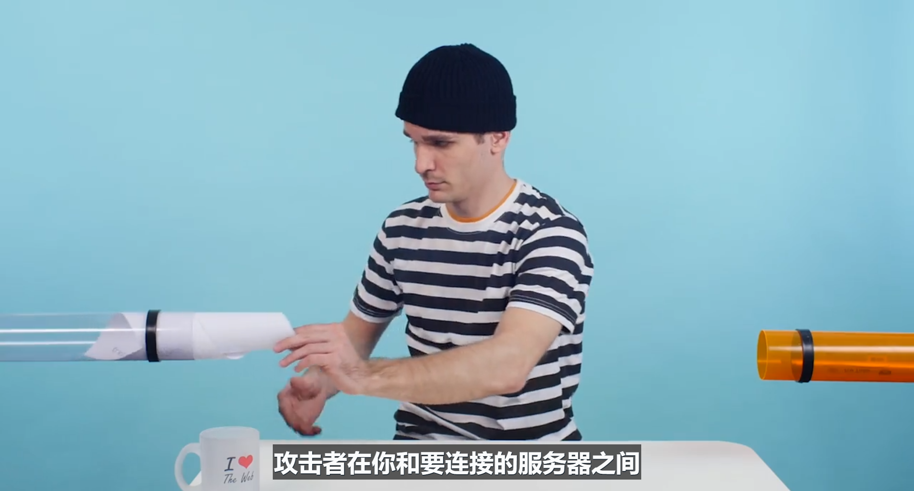

# 3. HTTPS

> 你会发现安全对网络的重要性。你将了解 TLS，发现加载混合内容的问题，快速入门了解加密并验证证书颁发机构。

[TOC]

---

## 3.1 HTTPS 简介

你有没有想过，在咖啡厅或类似的公共场合使用免费 Wi-Fi 多么的傻么？你信任店主没有做出什么狡猾的事，并且相信当前正在使用 Wi-Fi 热点的人不是坏人。但，他们能监听你的网络操作，毕竟你是通过无线电波进行传播，而且他们能够篡改你所接受的数据。

如果你想通过公共 Wi-Fi 查看你的银行账户呢？想想有很多人都能够读取或更改你的数据，我们肯定不希望发生这种事，HTTPS 可以保护你和你的用户免遭恶意咖啡店主及访问者的攻击。作为网络开发者 HTTPS 甚至更重要，因为**所有现代浏览器 API 仅支持通过 HTTPS 加密的网站**。

要充分利用网络的强大功能，你需要开始使用 HTTPS，不仅仅是用于登录网页，而是所有网页。

知道网页使用了 HTTPS 可以让用户在这些公共场合对你的网页放心，**如何判断网站是否使用了 HTTPS？网站是否正确使用了 HTTPS？以及如何在你自己的网站上使用 HTTPS？**

这些正是这节课的内容。


---

## 3.2 加密 HTTP

现在，我们知道 HTTP 很容易读懂，甚至普通人都能读懂，这很让人头疼。你几乎可以在控制台上实时查看发送的请求，并且依然理解所发生的情况。因此我认为，有人能够以某种方式偷听开放的 HTTP 连接，偷听者能够阅读所有的请求和响应并提取所需的所有数据。

那么偷听连接有多容易呢？

正如我在简介部分提到的，Wi-Fi 使偷听过程更加容易，因为你直接通过无线电波广播连接。因此偷听者只需偷听即可，如果有特殊的监听软件，偷听起来更简单。

加密 Wi-Fi 有所帮助，但是你无法控制咖啡厅的 Wi-Fi 设置并且以前的加密方法很容易破解。**因此 HTTPS 推出了加密功能，它将使浏览器<u>加密请求</u>只有你要连接的服务器能够解密这些请求**，咖啡厅的店主或恶意偷听者都无法阅读你的数据流：


但是**如果你以为你连接到了正确的服务器，而实际上没有呢**？



在中**间人攻击（简称 MITM man-in-the-middle）中，攻击者在你和要连接的服务器之间扮演着中间人的角色，发生这种情况时，浏览器将以加密的方式连接到他们的服务器，而不是你以为你尝试连接的服务器**。例如 Facebook，攻击者将解密你的数据，阅读你的所有私密信息，重新加密这些信息，然后将信息传达给 Facebook 的服务器，反之亦然，你和 Facebook 都不知道中间有个攻击者。

**为了解决这个问题，除了加密功能之外，HTTPS 还推出了验证功能，服务器需要标识自己的身份，只有真正的服务器才能标识自己。因此你能够确定你与之通信的服务器是正确的服务器。**


- [Firesheep](https://codebutler.github.io/firesheep/)
- [Firesheep 维基百科](https://en.wikipedia.org/wiki/Firesheep)


---

## 3.3 练习：MITM 1

对于这道练习，你需要在你的系统上设置一个代理，通过代理加载一个网站，然后检查结果：


**代理是合理的中间人**，并且具有很多优势，例如

- 通过额外的压缩功能节省带宽
- 对图片下载采样
- 以及主动进行缓存。

你将使用的代理的作用是，这你得自己去探索。对于这道练习，选择一个非 HTTPS 网站进行测试，你将在下道练习中测试 HTTPS 网站。


- 网站的文本消失了吗?
- 网站的图片上下颠倒了吗？
- 网站的颜色颠倒了吗？
- 网站无法访问吗？
- 外观没有辩护啊，网站看起来完全正常。

为了防止出现缓存，你需要在隐身窗口下运行此网站。注意，你需要在自己的计算机上运行代理，你将在下面找到代理的二进制文件，以及如何设置浏览器。


###  讲师注释

转到 Chrome 中的设置，搜索代理服务器，然后单击代理服务器设置按钮，并将你的 HTTP 和 HTTPS 代理设置设置为本地端口13370。


答案：

下载并运行代理：


配置 chrome 以便经过该代理，加载 xkcd 的首页显示：


所有图片都上下颠倒了。

---

### 如何设置谷歌 Chrome

#### 在 Mac 电脑上:

1. 转到 Chrome 中的设置，搜索"代理服务器"(proxy) 或复制粘贴该地址进入 Chrome's 的地址栏 `chrome://settings/search#proxy` 2.点击" 代理服务器设置" 按钮。

[](https://classroom.udacity.com/nanodegrees/nd019-cn/parts/8f508d0f-3ede-4438-a76a-1388a0fc3082/modules/2ade007c-9ac6-4dad-995d-6dec0deb7c8f/lessons/8150909334/concepts/82373411050923#)

3.启用HTTP代理

- 将Web代理服务器设置为`localhost`，将端口设置为`8080`
  - 启用HTTPS代理
  - 将安全Web代理服务器设置为`localhost`，将端口设置为`8080`
  - 单击“确定”以验证对代理设置的更改
  - 点击“应用”以使这些更改生效

[](https://classroom.udacity.com/nanodegrees/nd019-cn/parts/8f508d0f-3ede-4438-a76a-1388a0fc3082/modules/2ade007c-9ac6-4dad-995d-6dec0deb7c8f/lessons/8150909334/concepts/82373411050923#)

#### 在 Windows 电脑上：

按照Mac说明中的步骤1-2进行操作

- 点击**局域网设置**按钮
- 启用**为您的局域网使用代理服务器**
- 将**地址**设置为`localhost`，将**端口**设置为`8080`
- 单击“确定”以验证对代理设置的更改
- 点击“确定”以使这些更改生效

[](https://classroom.udacity.com/nanodegrees/nd019-cn/parts/8f508d0f-3ede-4438-a76a-1388a0fc3082/modules/2ade007c-9ac6-4dad-995d-6dec0deb7c8f/lessons/8150909334/concepts/82373411050923#)

[](https://classroom.udacity.com/nanodegrees/nd019-cn/parts/8f508d0f-3ede-4438-a76a-1388a0fc3082/modules/2ade007c-9ac6-4dad-995d-6dec0deb7c8f/lessons/8150909334/concepts/82373411050923#)

#### 在 Linux 上:

在 Linux 上，代理服务器设置需要通过命令行实现。 运行如下的命令行：

```
$ export http_proxy=http://localhost:8080/
$ export https_proxy=$http_proxy
$ chromium
```

#### 辅助材料

[ L3-MITM-Binary](http://video.udacity-data.com.s3.amazonaws.com/topher/2016/June/57571716_l3-mitm-binary/l3-mitm-binary.zip)


---

## 3.4 练习：MITM2

在上道练习中，你通过代理加载了一个网站，对于这道练习，你需要执行相同的步骤，但是将加载一个 HTTPS 网站。看看安全的网站结果如何？


＃无效的证书澄清 **无效证书是指证书的 URL 与浏览器的地址栏中的 URL 不匹配**。 


结果是无法加载：


我的浏览器和优达学城服务器之间存在代理，**因为代理在配置时使用的证书无效，所以 chrome 阻止我访问该网站**。


---

## 3.5 TLS 与证书颁发机构

**当我们提到 HTTPS 时，实际上说的是两个不同的概念：**

- **HTTP **
- **TLS（之前称为 SSL）。**

我们已经知道 HTTP 以及 TLS，TLS 是传输层安全协议（Transport Layer Security）的简称。TLS 并非只针对 HTTP，它可以用于任何协议，**例如 FTPS，它由 FTP 和 TLS 构成**，用于安全地传输文件。TLS 对通信进行特殊加密，使得目标接收者之外的任何人都无法读取数据。

在现实中，我们根本无法破解 TLS 加密，**为了确保通信的服务器是你要通信的服务器，TLS 会用到信任链这一功能。服务器通过证书来表示自己的身份，该证书中包含关于服务器本身，以及加密密钥指纹的元数据**：


这些证书由证书授权机构颁发，证书授权机构有很多。当证书由此类授权机构签名了，那么如果你要使用的密钥与该指纹匹配，你将知道你与之通信的服务器是正确的服务器。

实际上，你可以在浏览器中查看证书授权机构列表，甚至可以添加你自己的授权机构：


你在这里看到的大多数是你能够从对方那购买证书的公司，它们需要支付费用，因为它们不仅会验证你的服务器，而且会验证你作为该服务器的所有者的身份。因为并非所有开发者都能够或想要支付证书费用以便向用户提供基本的安全性，因此 **Let’s Encrypt** 应运而生：


它可以免费提供证书。

我们来看看证**书的原理以及提供的安全性。**


TLS = 传输层安全 (Transport Layer Security)

- [文件传输协议 (FTP)](https://en.wikipedia.org/wiki/File_Transfer_Protocol)
- [FTPS](https://en.wikipedia.org/wiki/FTPS)
- 如果你使用的是 Chrome 浏览器，请将其复制并粘贴到浏览器中以跳转到你的计算机证书chrome://settings/search#Certificates


---

## 3.6 TLS：密码学入门

TLS 有两个重要的密码构建组件，加密和哈希。当人们听到加密一词时，可能会想到**对称加密，加密一些数据并将加密的数据提供给其他人**：


> 锁表示加密后的数据，解密就需要相应的钥匙。

接收者需要使用**相同的密钥**来解密收到的数据，否者无法查看数据。

借助一些数学技巧，浏览器能够利用加密算法来使用一个密钥进行加密（encryption）并得使用另一个密钥进行解密（decryption）：


通常，加密消息的密钥已经公开，任何想要发送消息的人都可以使用该密钥加密，他们或任何其他人都无法使用同一密钥解密消息，只有拥有解密密钥的你能够解密消息，通过后台的数学算法，**两个密钥都可以用来加密和解密**。用**一个密钥加密后，只能用另一个密钥解密。**因此，可以说**有一个任何人都可以访问的公钥**，以及**一个只有所有者可以访问的私钥，私钥需要安全地存储**。

**非对称加密**，也称**公钥加密**。


---

## 3.7 TLS：哈希

我们了解了加密功能，注意 TLS 由两部分组成

- 加密
- 哈希

哈希是**将数据转换为原始数据简短表示的流程**。原始数据的小小改动，将在哈希中有巨大的变化，如果两个文档的哈希值一样，那么它们非常非常非常有可能是同一文档：


> 可以看到，就一个字母不同其产生的哈希值就完全不一样。

对于哈希函数，我们需要注意几点。

- 首先，应该**无法颠倒转换流程**。表示数据一旦转换为哈希，则无法再恢复成原始数据。
- 其次，应该**无法找到生成完全一样的哈希值的另一个文档**。

最常见的哈希函数是 SHA，它有多个版本，例如 SHA-256 或 SHA-512，后面的数字表示哈希的输出有多大（单位是位）。无论文档有多大，当你使用 SHA-256 时，输出将始终为 256 位。


---

## 3.8 练习：哈希

你刚刚看到 Surma 演示了这个很酷的小哈希项目，对于这道练习，你将使用项目实际感受不同的哈希函数。

启动提供的服务器并加载它所提供的 URL 后，你应该能看到项目，然后输入一些文本，看看不同的哈希函数生成的结果。

输入你的文本后，在提供的文本框中输入哈希，然后稍微修改下文本并将新的 SHA256 哈希粘贴到下面：


#### 辅助材料

[ L3-Hashing-Binary](http://video.udacity-data.com.s3.amazonaws.com/topher/2016/June/575716f2_l3-hashing-binary/l3-hashing-binary.zip)


答案想告诉我，就算有人想要改一个字符也会改变整个哈希值，因此浏览器和服务器很容易看到这种区别，从而也很容易知道数据被更改了。


---

## 3.9 证书颁发机构签名

我们已经充分理解了 TLS，现在来讨论下签名。

我之前提到了证书授权机构，**它们的任务是对证书签名**，是什么意思呢？为何有人需要签名的证书？

当我们提到有人签名了文档，我们**指的是证书授权机构已经审查并验证该文档中的内容**，目的是**证明该实体已查看甚至创建该文档**。就像在文件上签名，证明你已经看过该文件的法律证据，**服务器也可以通过电子签名来证明**。

**服务器对文档签名并使用它们的私钥加密文档，然后返回签名的文档**。因为只有私钥的持有者能够解密文档，因此你知道你接受的文档与服务器发送的文档完全一样：


但是，文档可能会很庞大，例如 DVD 影像。使用非对称密码加密和解密需要很长时间，因此我们可以**只加密文档的哈希**，而不是整个文档本身。如果你想检测签名是否有效，可以**解密签名和哈希**并自己对文档进行哈希转换，看看这两个值是否匹配，这样我们就知道所接受的文档与服务器发送的文档是否完全一样，如果文档在传输中被更改了，则哈希与服务器作为签名提供的值不匹配，这叫做**无效签名**。


> 这里有些东西我还是很不理解，到底什么是签名？
>
> 这上面的步骤只是证明签名是否有效？


---

## 3.10 TLS 连接成功

现在我们已经拥有非对称的加密数据和分配数据的工具，我提到这些工具是 TLS 的构建基石，现在我将证明给你看，我们来逐步了解浏览器。为了简单起见，我依然会忽略一些复杂的细节，但不会对概念有影响。

第一步是**让服务器向你发送证书**，证书中包含**服务器的公钥**以及其他一些信息，例如证书的**目标网域**，以及**证书授权机构的签名**：


接着，客户端检查网域是否正确并检查授权机构的签名是否有效。正如之前讨论的，所有浏览器都在本地具有证书授权机构列表包括它们的公钥，因此不用检查签名是否有效：


现在客户端生成一个对称加密随机密钥，并一直使用下去，浏览器使用服务器的公钥对随机密钥进行加密并发送出去：


> 红框处是生成的加密文件


> 然后通过加密文件与公钥解密生成一个私钥：


与非对称加密相比，**对称加密**速度快了很多并且更加高效，能够更好地扩展到大型数据。但是更重要的是，服务器只有真的拥有私钥并且能够解密新的随机密钥才能继续通信。这样就可以验证服务器的身份。（这样服务器就能有一个和我们在本地计算机相同的私钥）

如果所有这些步骤都成功了，**最后的连接将建立成功，HTTP 协议能够接管任务，此时，你将在浏览器的网址栏中获得绿色挂锁符号。**


---

## 3.11 练习：SSL 错误

在上个场景中，只有两个地方可以出错，要么是证书授权机构在证书上的签名无效，要么是服务器在切换到对称加密后无法通信。

在现实中，出错的地方有很多，证书有一个截止期限，因此可能会过期，证书规定了哈希集合和支持的对称加密函数。这几年事实证明，某些加密函数比较薄弱。有时候证书有效，但是服务器的其他设置无效：


在 badssl.com 上可以查看 TLS 连接有问题时浏览器的行为：


badssl.com 具有自己的有效证书，但是也具有故意无效的证书和无效的设置，因此我们能够了解在不同情形下浏览器的行为。我们来看看 sha1-2016，可以看到绿色锁不见了：


点击此图标可以看到关于连接的更多信息也可以看到被使用的证书的具体详情。

对于这道练习，请使用 badssl.com 网站判断哪些设置导致 chrome 拒绝访问网站：


- 过期证书会发生这种情况吗？
- 另一个主机的证书呢？
- 混合内容会导致 chrome 拒绝访问网站吗？
- 信任链不完整
- 使用 SHA256


- <https://badssl.com/>


网站中每个链接的背景色差不多就表明了会发生的情况，红色表示不可行，绿色表示可能，橘色等其他颜色表示结果可疑：


**过期证书**或**主机错误**的证书都拒绝访问。

混合内容，信任链不完整和 SHA256，都允许用户访问。但是并非都会出现绿色锁。


---

## 3.12 混合内容

如果索引文档通过 HTTPS 呈现，不错。那网站的资源呢？它们也通过 HTTPS 呈现吗？

失去绿色锁的快速方式是通过普通的 HTTP 呈现资源，发生这种情况时，网站就会进入混合内容状态。当你打开一个本应通过 HTTPS 呈现，但是其中包含来自非 TLS 加密来源的资源（例如图片 iframe 样式表或脚本）的网站时，就会出现混合内容：


一个常见错误是从非 TLS CDN 获取 jQuery。

通过非安全渠道传输的资源类型不同，导致的后果可能有所不同，可能会失去绿色挂锁，但是依然可以运行。资源可能被屏蔽或使网页崩溃，甚至可能会出现红色挂锁。不同的；浏览器的行为不尽相同，因此你肯定需要避免这种情况，检查网站是否有混合内容。

实际上， Google 建议通过 HTTPS 呈现所有资源。这样才能够避免混合内容警告，你的网站和其中的资源将安全地传输。


- [在 MDN 上的混合内容](https://developer.mozilla.org/en-US/docs/Security/Mixed_content)


---

## 3.13 练习：混合内容

在本地开发时，开发者通常会使用**自签名证书**，**这些证书将自己称为自己的证书授权机构。因为它们是自签名，因此不提供任何类型的身份验证，浏览器将抱怨并显示红色挂锁**。但是可以让你测试你的网站是否包含混合内容。

请启动该项目的二进制文件，并在浏览器中加载提供的 URL，你可能会注意到，当你启动该服务器时，它会自动为你生成一个自签名证书，因为这是一个自签名证书，因此你可能会看到错误网页：


你可以继续安全使用，点击高级（advanced）然后点击底部的“继续前往”链接。

你将看到优达学城徽标被拆分成多个图块，有任何混合内容违规行吗？如果有，是哪个图块导致了问题？


#### 辅助材料

[ L3-Mixed-Content-Binary](http://video.udacity-data.com.s3.amazonaws.com/topher/2016/June/57571768_l3-mixed-content-binary/l3-mixed-content-binary.zip)


虽然网页本身是通过 HTTPS 加载的，但是有一个图片是通过 HTTP 加载的，导致出现混合内容警告，实际上有多重方式来解决此问题。

最简单的方式是查看控制台，存在问题的会打印出现在控制台中。

另一种方式是查看 Security 窗格，下面会有混合内容警告：


点击上面的链接会使我们转到 Network 窗格，并添加了混合内容过滤器。

我们可以使用开发者工具fico轻松地诊断混合内容问题，如果你要开发任何网络内容，应该始终打开开发者工具，相信我，它会为你节省大量时间。


---

## 3.14 小结

安全性非常重要，有时候是网络开发比较头疼的部分。如果在这节课之前，你不知道什么是 HTTPS，那么现在应该非常熟悉了。

大部分托管服务和 CND 现在都支持 TLS，随着越来越多的浏览器 API 仅支持 HTTPS 的网站，你应该为了你的用户和你的网站始终使用 HTTPS。

在下节课，我们将了解新的 HTTP/2 标准，以及对你和你的项目构建步骤来说有何影响。