# 3.状态管理

> 你将学习如何**向组件中传递数据**、如何创建**函数式组件**、何时及如何使用 **PropType**、如何创建**受控制的组件**，以及它们提供的优势。

---

[TOC]

---

## 3.1 简介

我们来认识一下 React 的三个新概念。

- 它们是 Props，你**可以通过它将数据传入组件中**
- 函数式组件（Functional Components），它是可选的，并且**是一种更加符合直觉的方式去创建 React 组件**
- 受控组件（Controlled Components），它可以**让你将应用中的表单连接到组件状态**。

---

在开始构建应用之前，先介绍一下我们将要构建的应用。

**构建一个大型 React 应用的方法是先构建一堆较小的 React 组件，然后再将它们组合起来。**

所以向你展示这个应用，是想让你思考你会如何**从组件层面来构建它**。

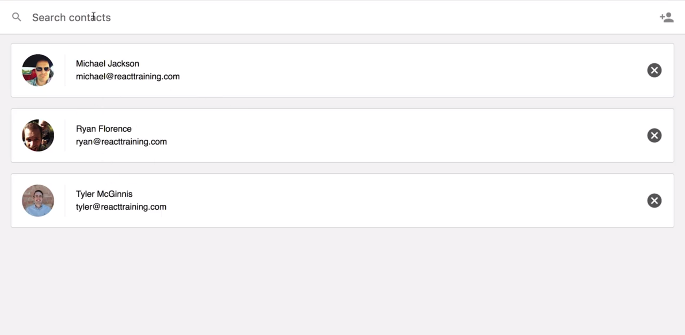

这个应用的目的是让我们能够管理我们的联系人，你会注意到我们有三个不同的联系人，上面这里有搜索框，如何我们在这里输入内容，它会筛选联系人。

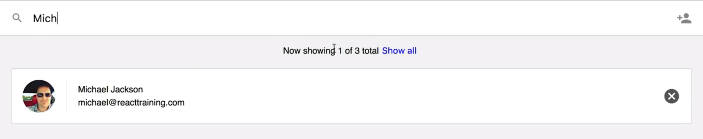

这里，我们还有这个部分（Show all），它能够重置搜索框，并使我们再次看到所有联系人。

你还会注意到这个图标，如你所料，它用于删除联系人，接着，如果我们点击这里这个图表，你会发现我们跳转到了 /create 路由下，所以我们也有路由（routing）。


在这里可以输入一个新的联系人，我们可以选择一个头像，一旦我们添加联系人后，我们会被带回至主页路由（home route），新添加的联系人就会显示在我们的联系人列表中。

---

### 删除默认文件

Create React App 将生成大量默认文件和起始代码，我们需要删掉它们。你需要作出两组更改，删除起始内容并且增加我们提供给你的文件。你可以自己手动删除。或者克隆 [此资源库](https://github.com/udacity/reactnd-contacts-complete) 并检出 `starter-files-added` 分支，它已经帮你删掉所有要删的文件。

如果你想删掉起始代码并手动添加我们的代码，直接操作即可。如果你决定克隆已经做出这些更改的资源库，请跳到此页面下面并设置后端服务器。

如果你想手动执行更改，那么第一步是删除 Create React App 添加的这些样板文件。请参阅 [此 commit](https://github.com/udacity/reactnd-contacts-complete/commit/b1959521da8d914374bd2a61b17e55088ffab9f5) 以了解具体说明。

##### 删除以下内容：

- 删除文件 `src/App.css`
- 删除文件 `src/Logo.svg`
- 删除 `src/index.css` 中的所有内容
- 删除 `src/App.js` 中我们的内容

### 我们的起始文件

在这门课程中，我们的重点是学习 React 和使用它来构建应用。我们不用太关心样式。但是，我们不希望看起来太糟糕，因此为你提供了一些样式和各种图标。 必要文件可以在 [此 commit](https://github.com/udacity/reactnd-contacts-complete/commit/6f38f078634d104a62e3024cab4cc2d592dd82f6) 中找到。请查看该 commit 中包含的文件路径，并作出相应的修改。如果你要克隆资源库，别忘了运行 `npm install` 以确保安装所有依赖项！

##### 添加提供的内容：

- 创建目录 `src/icons/`
- 向 `src/icons/` 添加所有图标
- 向 `src/index.css` 添加项目样式
- 创建目录 `src/utils/`
- 向 `src/utils/` 添加 `ContactsAPI.js` 文件
- 向 `src/` 添加 `ImageInput.js` 文件
- 让 `src/App.js` 中的 `render()` 方法返回 `<div>Hello World</div>`

### 后端服务器

我们要构建的 Contacts 应用项目是一个前端项目。但是，我们最终会将通讯录存储在后端服务器上。因为在这门课程中，我们仅侧重于前端内容，因此我们将为你构建该服务器，使你能够只关注此课程的 React 部分。

服务器只是简单的 Node/Express 应用。该项目的资源库位于 <https://github.com/udacity/reactnd-contacts-server> 。你只需：

- 使用 `git clone https://github.com/udacity/reactnd-contacts-server.git` 克隆该项目
- 使用 `npm install` 安装项目依赖项
- 使用 `node server.js` 启动该服务器

启动服务器后，就不用管它了。我们将处理的 Contacts 项目将与此服务器互动，但是我们不会修改任何服务器代码。

> #### 💡 运行两个服务器💡
>
> 现在，你应该在你的本地机器上运行**两个不同的服务器**了：
>
> - 前端开发服务器：可以在 **端口 3000** 上访问（使用 `npm start` 或 `yarn start`）
> - 后端服务器：可以在 **端口 5001** 上访问（使用 `node server.js`）
>
> 在继续学习这节课之前，请确保这两个服务器都在运行。

##### 为了确保我们处理的是相同的代码，请检查以下各项：

- 已克隆 Contacts 服务器
- 已将目录改为 Contacts 目录
- 已安装服务器的依赖项
- 已启动后端服务器

## 3.2 使用 props 传递数据

这里我们有一个非常基本的 fetchUser 函数，此函数的唯一目标是获取特定的用户。

问题是我们需要告诉该函数要获取哪个用户，我们可以在函数定义时添加一个参数并在调用函数时传入用户名称：

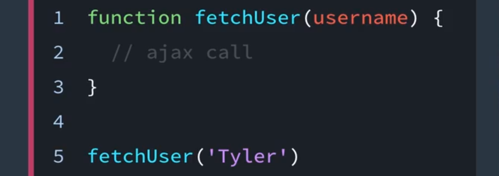

我真正喜欢 React 的一点在于你可以将使用函数的直觉应用于创建 React 组件中。

这里我们有一个非常基本的 React 组件，其目的是向 UI（用户界面）显示一个用户，现在，我们遇到了与 fetchUser 函数相同的问题。我们需要通过一种方式向 User 组件传递一个用户名以让它知道向视图显示哪个用户。


为此，我们可以向组件添加一个自定义属性并给它一个值。（如上图）

现在，我们可以使用 this.props.username，从组件内部访问该值：

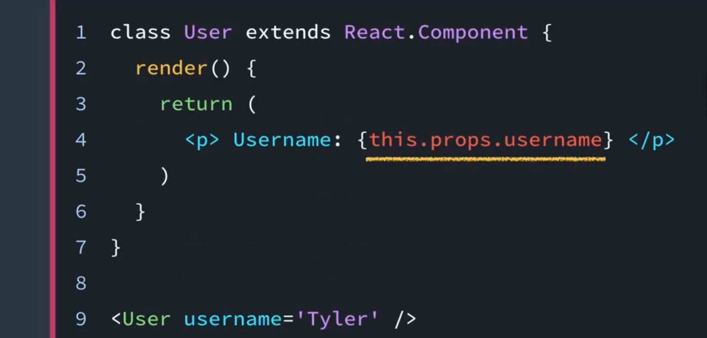

事实上，**添加到一个组件的任何属性都可在该组件内的 prop 对象上访问**：


---

在接下来的视频中你将需要这个 `contacts` 数组：

```react
 const contacts = [
   {
     "id": "ryan",
     "name": "Ryan Florence",
     "email": "ryan@reacttraining.com",
     "avatarURL": "http://localhost:5001/ryan.jpg"
   },
   {
     "id": "michael",
     "name": "Michael Jackson",
     "email": "michael@reacttraining.com",
     "avatarURL": "http://localhost:5001/michael.jpg"
   },
   {
     "id": "tyler",
     "name": "Tyler McGinnis",
     "email": "tyler@reacttraining.com",
     "avatarURL": "http://localhost:5001/tyler.jpg"
   }
 ]
```

这个 `contacts` 数组只是临时的。最终，我们将从后端服务器检索通讯录并向里面存储通讯录。但是现在，我们不知道如何发出网络请求或向何处发出网络请求。很快会介绍的，暂时先使用这个静态通讯录列表。

> ### 应用在运行吗？
>
> 为了跟着操作，请确保 Contacts 应用和后端服务器都在运行。

---

我们就直接开始讲了，在这个视频中，我们将构建这里的这部分：

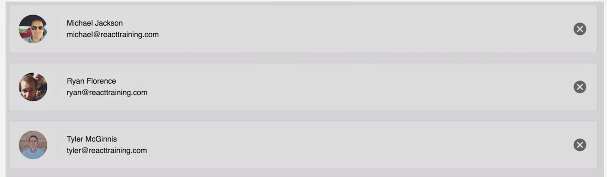

这是我们应用现在的样子：

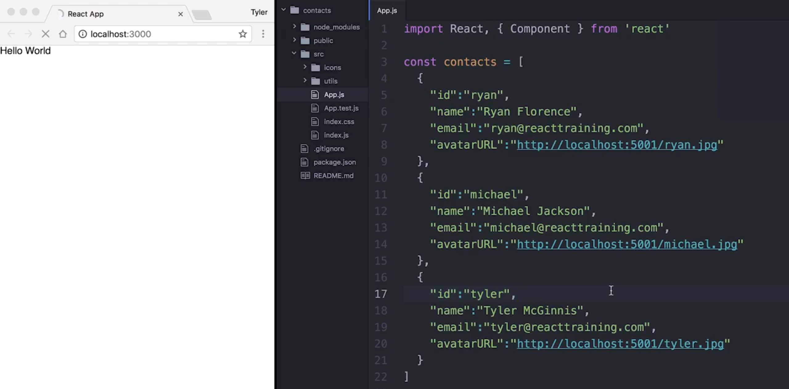

我们使用 create-react-app 初始化了一个新项目。

在之前的视频中，我们在 utils 文件夹下创建了图标，我们从 create-react-app 中删除了所有额外的东西。完成这些操作后，我粘贴了你应该从前面的 contacts 部分收到的联系人，你会注意到我们有三个联系人：Ryan、Michael 和 Tyler，每位联系人都有一个 id、name、email 以及头像 URL，这是我们要遍历的（指 contacts 数组），为了显示我们刚刚谈到的联系人列表。

那么现在我们想要做的是，创建我们的第一个组件，这个组件的作用是接受这些联系人并将它们显示在视图上。**而 react 的好处在于我们可以拥有动态的 state 而不是存储在 App.js 文件中**。（应该是说，我们不需要将数据存放在 App.js 文件中的一个变量里，而是存放在组件拥有动态更新机制的 state 中。）

我们可以创建一个组件来处理显示这些联系人的视图，我们将它们分离出来。接下来我们要做的是，**就像向函数传递参数一样，将这些联系人传递给我们即将创建的新组件**。

**我们在 src 文件夹中创建一个新文件，称之为 listContacts.js，因为它将是列出我们联系人的一个组件**。那么每当我们创建 react 组件时，我们需要做的是导入 react，然后是用 class 语法构建我们的组件，它将继承 Component，所以我们从 React 中提取出 Component 属性（因为他使用的是 Component 继承的类而不是 React.Component），并且在我们遗忘之前导出该组件，这样我们就能在 App.js 文件中导入它：

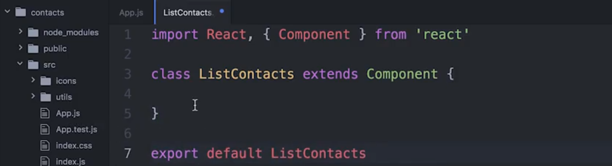

接下来我们要做的是，**为此组件指定特定的用户界面**。而允许我们这样做的属性是 **render 属性**，它也是我们在组件 class 中始终需要指定的唯一一个属性，这是 react 中必需的，**如果不指定它，组件就不能正常运作**。

那么这个组件的用于界面**看起来会是什么样的呢**？

一个有序列表，我们给它一个名为“contact-list”的类，这是我们在 index.css 文件中的一个类。现在，如我们之前所说的，**此组件的作用是遍历联系人数组的每个对象，然后向视图显示每个特定的联系人**。

那么，我们需要做两件事：

- 我们需要渲染 ListContacts 组件
- 并在渲染时确保向它传递此 contacts 数组。

那么，首先我们导入 ListContacts 组件：

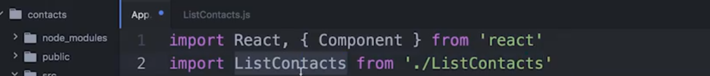

然后为了使用此组件，我们可以做的是在下面这里删除 Hello World 并添加 ListContacts：

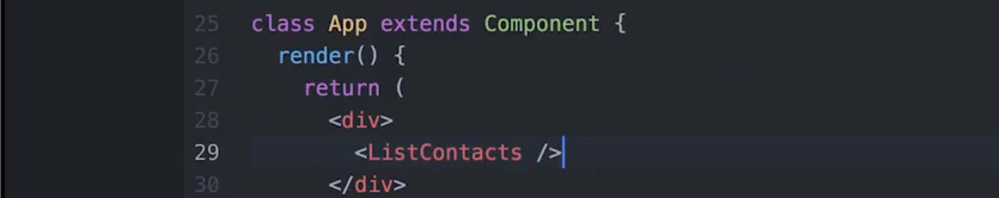

当我点击刷新后，你会发现我们的应用中什么都没有，但是如果我们检查 DOM 的内容，你会注意到我们确实获得了一个有序的列表，但显然里面什么都没有，因为我们还未在里面放入任何东西：

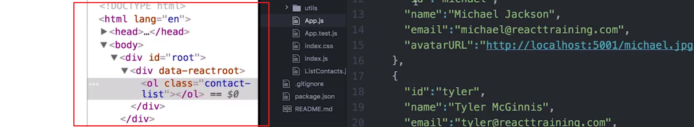

所以下一步我们需要将我们的 contacts 数组传递给 ListContacts 组件，这样做的方法是我们向 ListContacts 组件添加一个属性：


我们正在做的是，获取 contacts 数组，将它传递给 ListContacts 组件，然后 ListContacts **组件中**我们访问此数组的方式就像下面这样：

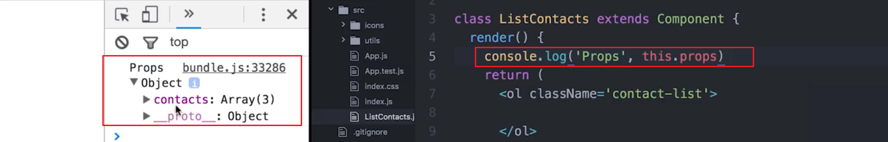

你会注意到 props 是一个对象，它具有一个属性，就是 contacts，它是存在于我们 App.js 文件中的数组。这就是你从一个组件或一个文件向一个组件传递数据的方法，就是在调用组件时，给组件的添加一个属性并传入数据，然后通过 this.props 访问它。

那么，在下一个视频中我们会展示怎样去真正遍历 this.props.contacts 以在视图上显示每个联系人。

---

[这是本视频中所做更改的 commit。](https://github.com/udacity/reactnd-contacts-complete/commit/664306f50a05aafe47f4109860e00593fcbf0321)

#### 习题 1/4

将以下项目对应到相应的概念：

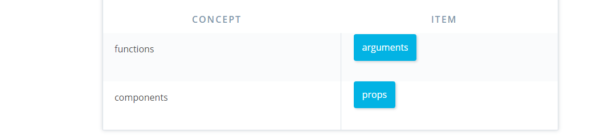

我们可以认为**向组件传递属性就像向函数传递参数**。就像我们可以访问传入普通 JavaScript 函数的参数，我们也可以使用 `this.props`（或者在无状态函数式组件中使用 `props`）访问组件的属性。 

#### 习题 2/4

如果你构建的应用中有 `<Clock />` 组件，你如何向其中传入 `currentTime` `属性`？

- `<Clock {new Date().getTime()} />`
- `<Clock this.props={new Date().getTime()} />`
- `<Clock currentTime={new Date().getTime()} />`
  - 大部分情况下，要传入属性，只需输入属性的名称（**就像普通的 HTML 属性**），虽然**也有少数例外情况**。 
- `<Clock this.currentTime={new Date().getTime()} />`

---

上一个视频中我们结束的地方是将 contacts 数组**传递**给了 ListContacts 组件，然后在 ListContacts 组件内，我们记录了 this.props 是什么，它是一个具有 contacts 属性的对象。

现在我们想做的是真正遍历在 this.props 上的 contacts 属性，然后对于 contacts 中的每项，我们想展示特定的信息在视图上。

我们删除 console.log，然后在有序列表中，使用这种类似对象的语法，因为在它里面像 Michael 之前所说的，我们将放入一个表达式，我们说 this.props.contacts 并调用它的 .map 属性，记得 contacts 只是一个数组，所以拥有 .map 属性，它只是一个 JavaScript 方法。如果你不熟悉 .map 的用途，它的作用是让你修改数组中的每一项，然后返回一个全新的由这些修改后的数组项所组成的数组。

那么对于 contacts 中的每一项，我们想创建一个列表项，这样我们的有序列表就会被列表项填满。我们这样做的方法是向 map 传递一个函数，这个函数会被数组中的每一项逐个调用。接下来我们要做的是在这写入一些内容，它们将会成为数组中每一项的指定用户界面：

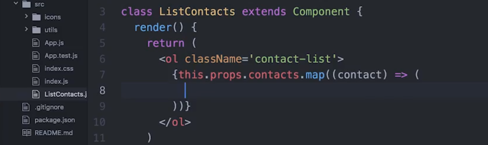

> 这里截图的原因是，我们要明白这个返回的内容正是我们要渲染的内容。

那么要看到它，我们就需要有一个列表项，然后我们想显示 contact.name，现在刷新页面就能看到出现 Ryan、Michael 和 Tyler：

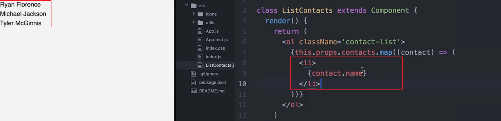

记得，显示这些是因为我们在遍历我们的联系人，并且对于 contacts 数组中的每一项我们创建了一个列表项，并显示一个特定的联系人姓名。

> 这里也能这样理解：我们只是使用了在组件中传入的数据，然后通过数据来渲染我们的组件。

但是出现一个问题，你注意到我们收到的控制台的错误信息，它说数组或迭代器中的每个子元素都应该有一个唯一个 key 属性。

我们收到这个错误信息，是因为每当我们在 React 中使用 .map 向屏幕显示一系列项目时，就像这里说的，你需要向每一项添加一个唯一的 key 属性，那么我们能做的是将数组中每个对象数据中的 id 值传入到每一项的 key 中：

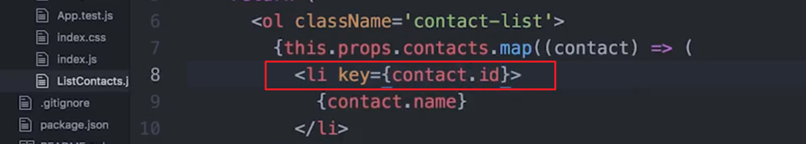

我们需要这样做的原因是，最终某个列表项可能会发生改变，而当每个列表项有了一个唯一的 key 属性，React 就能够**明确地知道列表中的哪一项发生了变化而<u>无需每次都重新创建那个列表</u>**。

[这是本视频中所做更改的 commit。](https://github.com/udacity/reactnd-contacts-complete/commit/eaa138af7d992f05449f524d514ac4224f736ae4)

---


#### 习题 3/4

使用 `<Clock />` 组件的示例：

```
<Clock currentTime='3:41pm' />
```

如何在组件中访问值 `3:41pm`？

- Clock.currentTime
- currentTime
- this.currentTime
- this.props.currentTime
  - 任何传入组件的属性都可通过 `this.props` 对象访问。 

---

现在我们想要做的是，让列表项不只是人名，而是像项目所呈现的效果那样，有头像、姓名、电子邮件以及一个删除图标。

首先我们要做的是给我们的列表项一个类名，contact-list-item。接下来我们创建头像，给它一个类名 contact-avatar，我们想做的是让这个 div 的背景是联系人的头像，那么我们还可以给 div 添加一个 style 属性，style 将会是一个对象，这就像是将样式内联到这个 div 中，所以我们可以使用 className 或者给它一个 style 对象，然后我们说 backgroundImage 是 url，然后我们希望它的值是 avatarURL 的值。这样我们就会看到三个头像：

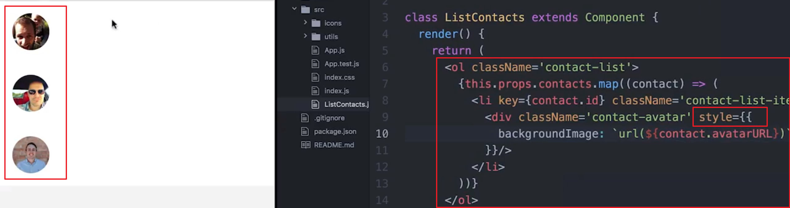

接下来我们要做的是添加姓名、电子邮箱和按钮，我们在这里创建另一个 div，给它一个类名 contact-details，然后在这里面，像我前面提到的，我们要添加姓名和电子邮箱地址：

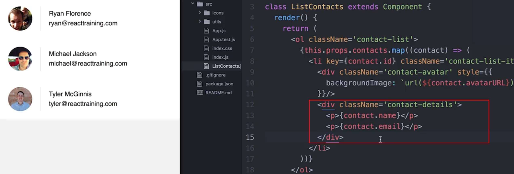

我们要做的最后一件事是创建按钮，尽管我们现在不将它与任何东西绑定起来，但如果将来我们需要绑定它，这个用户界面就会派上用场，那么这个按钮将有一个类名叫 contact-remove 然后在这里写 Remove（内容里）：

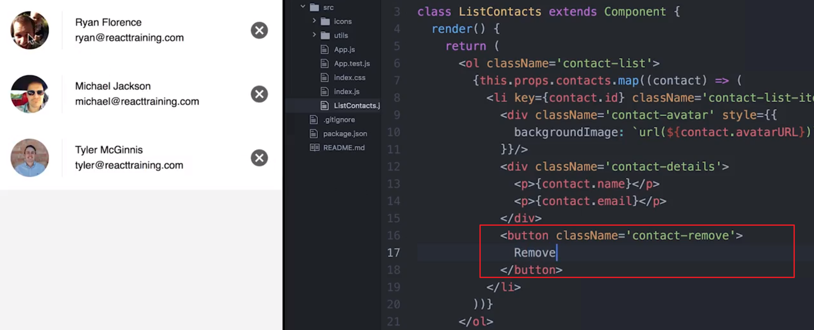

现在点击刷新后，我们就会看到这里排列整齐的用户界面。你会注意到我们做的这些都是在 App.js 内，我们有这个 contacts 数组，它目前暂时存在于 App.js 文件中，我们稍后会更改它，因为最终这个 contacts 数组实际上会来自一个 API 请求，我们会在将来的视频中讲解。

所以，现在我们做了将 contacts 传入 ListContacts，然后在 ListContacts 组件中我们要做的是创建一个有序列表，然后对于 contacts 数组中的每个联系人，我们遍历它们并使用此用户界面创建列表项。

[这是本视频中所做更改的 commit。](https://github.com/udacity/reactnd-contacts-complete/commit/43add2a640214483b00d9ca491990bb86104501e)

---

> 如果你在自己的机器上跟着操作，但是头像没有加载出来，请检查服务器是否在运行。

#### 习题 4/4

如何单独向组件中传入多个属性？

- `<Clock time={Date.now()} zone='MST' />`
  - 就像对待任何其他 HTML 属性一样传入单个属性。 
- `<Clock props={{time: Date.now(), zone: 'MST'}} />`
- `<Clock [time=Date.now(), zone='MST'] />`
- `<Clock props={[Date.now(), 'MST']}/>`


### 使用 props 传递数据总结

`props`是传递给 React 组件的任何输入内容。就像 HTML 属性一样，`props`名称和值会添加到组件中。

```react
// passing a prop to a component
<LogoutButton text='Wanna log out?' />
```

在上述代码中，`text` 是`props`，字符串 `'Wanna log out?'` 是值。

所有属性都存储在 `this.props` 对象上。因此，要在组件中访问此 `text` `props`，我们使用 `this.props.text`：

```react
// access the prop inside the component
 ...
render() {
    return <div>{this.props.text}</div>
}
...
```

### 深入研究

- [组件和props](https://facebook.github.io/react/docs/components-and-props.html)|([翻译文档](https://doc.react-china.org/docs/components-and-props.html)) React 文档

## 3.3 函数式组件

目前为止，我们使用了 JavaScript 的 class 关键字，并通过 render 方法来构建组件。

最终，我们将向这些类添加更多的方法。但是现在你只需知道如果你的所有组件都拥有一个 render 方法，那么你实际上可以使用常规的旧函数来创建组件：

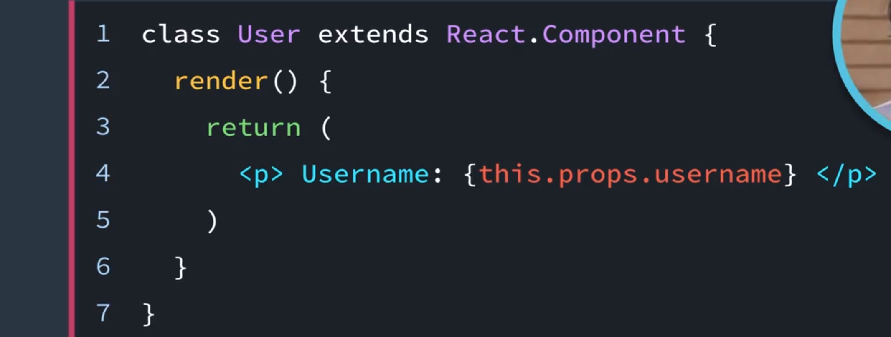

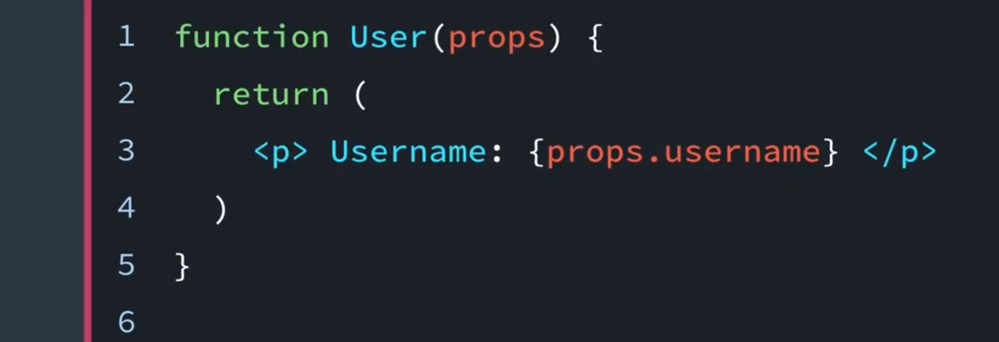

但是，注意**我们不再使用 this 关键字来访问组件的 props，而是将 props 作为函数的第一个参数传递给我们的函数式组件**。

---

> ###  💡 模板字符串 💡
>
> 在下面的视频中，你将看到我们在 "style" 属性的值中使用反引号 (\` \`)。这些[模板字符串](https://developer.mozilla.org/zh-CN/docs/Web/JavaScript/Reference/template_strings)可以用于嵌入表达式。借助模板字符串，你可以通过你的应用将表达式当做普通字符串进行插入。
>
> 要了解详情，请参阅 [ES6 - 改善的 JavaScript](https://www.udacity.com/course/es6-javascript-improved--ud356) 以获悉该语言的最新功能和改进。

---

 我们曾多次提到，你**对于函数的直觉也可以应用到 react 组件**。更重要是，你可以**用看待参数与函数关系的相同方式来看待 props 与组件的关系**。

就现在来说，当你创建单个 react 组件时，就得创建整个类，这似乎有点过于繁琐，但 react 好的一点在于，在几个版本之前，它推出了一个叫做**无状态函数组件**的东西：

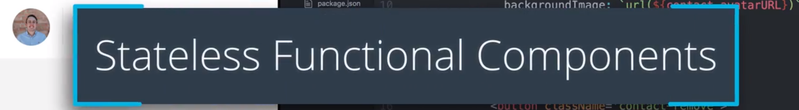

基本上它能让你做的是，**如果你的所有类或所有组件只拥有 render 方法，那么你就不必以类的形式创建组件，而是作为一个普通的函数就可以了**。

现在我们不再调用 render 方法，而是返回 JSX 就像我们习惯的那样：

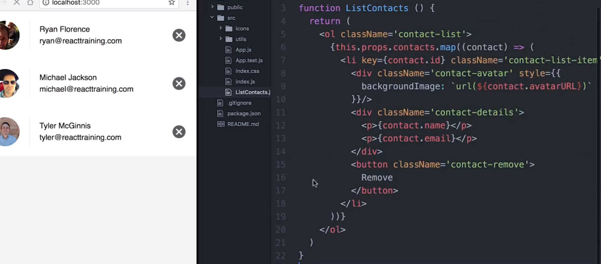

那么现在的问题是，之前我们是根据 this 关键字的特定实例来访问 props，现在我们不访问 this.props.contacts，而是从 props 获得它，而 props 实际上将**是 react 传递给我们特定无状态函数式组件的第一个参数**：

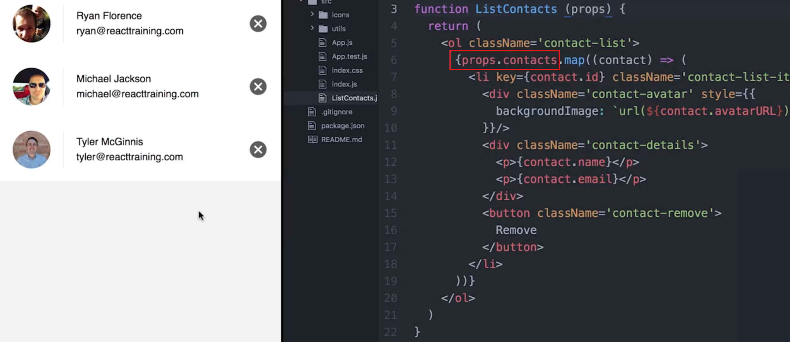

现在你会注意到我们的应用还是完全一样的，没有任何变化，除了我们不再为 ListContacts 组件创建整个类组件，而是用一个函数来接受一些 props 并渲染一些 UI。

我真正喜欢无状态函数式组件的一点，在于它们**非常直观**，你只需使用熟悉的函数就可以了。此函数会接受 props 作为参数，然后返回一些 UI。

我还喜欢无状态函数组件的另一点是**它不存在 this 关键字，你不需要担心这个函数会被什么环境所调用**。

概括一下，如果你的所有组件都只有 render 方法，你可以将它重构为一个所谓的无状态函数组件，或者只是一个接受 props 作为第一个参数的普通函数。

[这是本视频中所做更改的 commit。](https://github.com/udacity/reactnd-contacts-complete/commit/e763785368c5d99281182f5d11e03b5ba02541e0)

---

### 习题 1/2

何时适合使用无状态函数式组件？请选中所有适用项。

- 当组件需要初始化某些数据时
- 当组件只需 `render` 方法时
  - 如果组件仅使用 `render` 方法来显示内容，那么可以转换为无状态函数式组件。 
- 当组件没有传入任何属性时
- 当组件不使用 JSX 时


### 无状态函数式组件总结

**如果组件不用跟踪内部状态（即它只有 `render()` 方法），你可以将该组件声明为无状态函数式组件**。

最终，React 组件只是返回要渲染的 HTML 的 JavaScript 函数。因此，下面的两个简单电子邮件组件示例是同等的：

```react
class Email extends React.Component {
  render() {
    return (
      <div>
        {this.props.text}
      </div>
    );
  }
};
```

```react
const Email = (props) => (
  <div>	
    {props.text}
  </div>
);
```

> 注意返回时使用小括号，表示整个小括号中的代码为一行表达式，所以也就不用使用花括号。

在第二个示例（具有隐式返回的 ES6 函数）中，我们可以将属性当做参数直接传入函数本身，而不是通过 `this.props` 访问 `props`。反过来，这个普通的 JavaScript 函数可以充当 Email 组件的 `render()` 方法。

### 深入研究

- [创建无状态函数式组件](https://www.reactenlightenment.com/react-state/8.4.html) React 教科书
- [函数式组件与无状态函数式组件与无状态组件](https://tylermcginnis.com/functional-components-vs-stateless-functional-components-vs-stateless-components/)（作者 Tyler）


## 3.4 向组件中添加状态

### 状态

在这节课的之前部分，我们了解了 **`props` 指的是父组件传来的属性**。最终，**属性代表的是不可变的“只读”数据**。

另一方面，**组件的状态代表的是可变的数据**，并且最终会影响到页面上渲染的内容。**状态在内部由组件本身管理，会随着时间的推移而改变，经常因为用户输入（例如点击页面上的按钮）而改变**。

在这部分，我们将了解如何将状态管理的复杂过程封装到单个组件中。

---

目前为止，你学到了：

- 创建组件
- 将组件结合在一起
- 向组件传递数据

但是我们还未讲到 React 最精彩的部分——**状态管理（state management）**。

基于 React 的组件模型，我们能够**将复杂的状态管理封装到单个组件**，这使我们可以通过构建一堆小应用来构建一个大应用。而小应用实际上就是组件。

要向我们的组件添加状态，我们需要做的是**向我们的类添加一个状态属性**，其值是一个对象，**此对象表示组件的状态**：

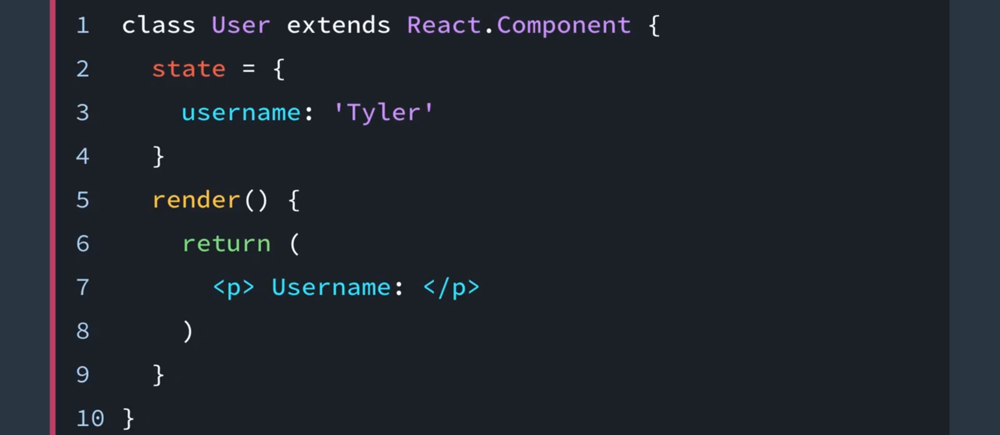

每个键和对象表示该组件的一部分特定状态，现在，就像我们对 props 做的一样，我们可以执行 this.state.username 来访问我们状态的 username 属性：

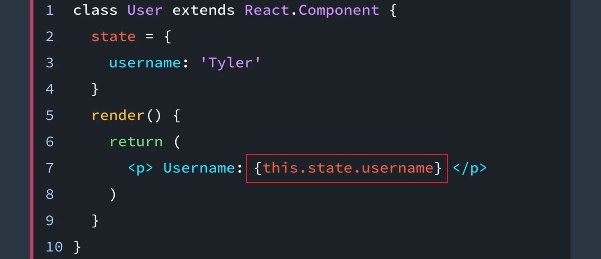

我喜欢 React 的一点在于，它能让我的大脑分开两个重要又复杂的概念：

- 第一，**组件看起来是什么样（其显示到页面上的样子）**
- 第二，**应用当前的状态是什么（也就是显示在页面上的数据）**

由于这种区分，UI 或应用的外观只是一个关于应用状态的函数。借助 React 你只需考虑的是**我的应用的状态是什么**，以及 **UI 如何根据此状态做出改变**。

---

### 💡 类字段 💡

在上述代码中，我们将 `state` 对象直接放入类中…而不是 `constructor()` 方法中！

```react
class User extends React.Component {
  state = {
    username: 'Tyler'
  } 
}

// rather than 而不是

class User extends React.Component {
  constructor(props) {
    super(props);
    this.state = {
      username: 'Tyler'
    }
  }
}
```

这与 Facebook 的 [设置初始状态文档](https://facebook.github.io/react/docs/react-without-es6.html#setting-the-initial-state)|([翻译文档](https://doc.react-china.org/docs/react-without-es6.html#%E8%AE%BE%E7%BD%AE%E5%88%9D%E5%A7%8B%E7%8A%B6%E6%80%81))稍微不同。

将 `state` 放在 `constructor()` 外面意味着**它是[类字段](https://github.com/tc39/proposal-class-fields)**，**这是对语言做出新更改的提议。暂时不受 JavaScript 支持，但是在 Babel 的强大转译功能的支持下，我们可以使用它！**

---

你记得吗？回到我们的 App.js 文件，我们在这，有这个联系人数组，我们要做的是将它传递给我们的 ListContacts 组件，这样 ListsContacts 就可以去遍历联系人并显示像这样的用户界面。但是我们目前设置的方式有点奇怪，因为这个 contacts 变量只是被定义在这个文件里面，它并不真的属于任何东西：

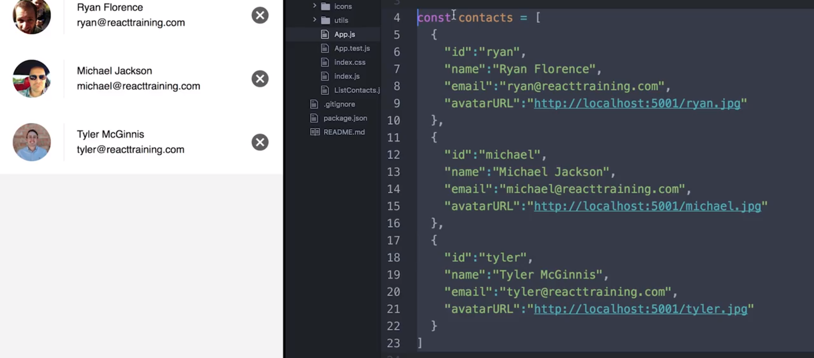

你还记得 React 的一个强项就是状态管理，特别是管理像这样的状态。但是由于这个 contacts 变量只是作为一个正常变量存在于这里，React 并不知道它。这样的话，如果我们想更改联系人，便无法通知 React 这个改变，**我们可以做的是将这个 contacts 数据移动到特定的组件中，之后当任何时候我们更新了联系人，React 都会知道并去更新相应的用户界面**。

再次说明，我们要做的是将此 contacts 变量移到组件中，**由 app 组件来管理其状态**，那么任何时候当其状态发生了改变，React 就会知道并基于状态变化来更新用户界面。

我们这样做的方式是到下面这里（App 组件内），向类添加一个属性：

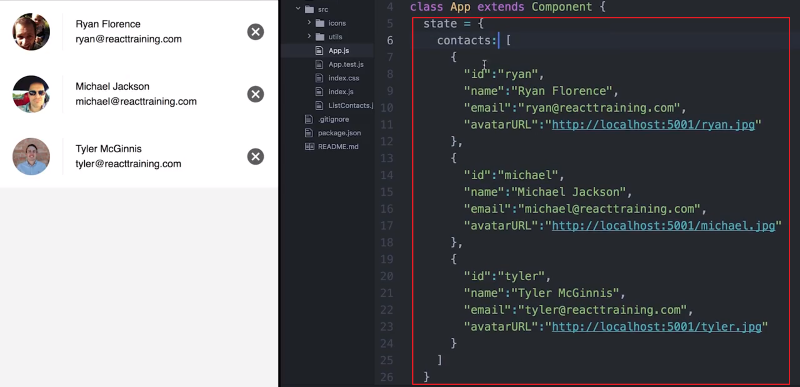

现在因为我们在一个对象中，所以 contacs 后面要改为冒号。

我们所做的是，**使我们的 app 组件现在管理着这块状态**。接下来，我们不能直接传入联系人，如果我们要从组件内部访问 state 属性，可以说 this.state. 加上属性名称，在这就是 contacts：

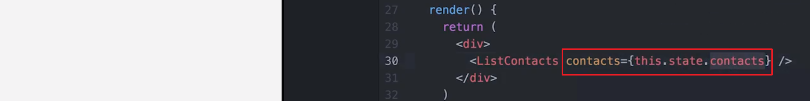

你会注意到，我们的用户界面还是完全一样的，我们仍然有三个联系人。但现在，我们的联系人数组**不再作为一个变量存在于此文件中**，我们所做的是**将它添加到组件状态中**。

一个很好的经验法则是，如果你要使用任何状态来渲染用户界面，就像我们这样做的，将状态传入 ListContacts 组件来渲染此用户界面，**该状态将存在于组件中的任何位置**。

记得我们这样做的原因是因为我们想要绑定删除按钮，**以便我们可以从特定状态中删除项目**。但是之后我们还会想要向此状态添加新的联系人，所以我们将这些联系人放在状态中的原因是想让 React 管理此状态，因为 React 会基于我们的组件中的状态来管理特定的 UI。

在这个视频中我们不会看到，但在下一个视频中我们将实际绑定删除按钮，以在点击它们时，它们会根据我们点击的按钮删掉状态的定义部分。

[这是本视频中所做更改的 commit。](https://github.com/udacity/reactnd-contacts-complete/commit/c4b43702554a8bf732eef6264c7053c370c6b201)

---

> #### ⚠️ 初始状态的属性 ⚠️
>
> **在定义组件的初始状态时，请避免使用 `props` 初始化该状态。这样容易引起错误，因为仅在组件首次被创建时，状态将使用 `props` 进行初始化。**
>
> ```react
> this.state = {
>    user: props.user
> }
> ```
>
> 在上述示例中，如果 `props` 被更新了，当前状态不会更改，除非组件“被刷新”。**使用 `props` 生成组件的初始状态还会出现重复的数据，背离了可信赖的 “单一数据源” 的原则**。

#### 练习题

关于 React 中的 `state`，哪些描述是正确的？请选中所有适用项：

- 组件的状态可以在初始化时加以定义
  - 状态是 React 组件的**关键属性**。熟悉状态的**使用方法**和**设置（重置）方法**将有助于**简化应用 UI 构建流程**。 
- 状态通常从组件之外传入进来
- 当你想要存储将始终不变的信息时，应该使用状态
- 组件可以更改它自己的内部状态
  - 状态是 React 组件的关键属性。熟悉状态的使用方法和设置（重置）方法将有助于简化应用 UI 构建流程。 


### 状态总结

通过让组件管理自己的状态，**任何时候该状态发生变化了，React 将知道并自动对页面做出必要的更新**。

这是使用 React 构建 UI 组件的关键优势之一**：如果要重新渲染页面，我们只需考虑更新状态**。每次有更新时，我们不需要知道到底是页面的哪个部分变化了。我们不需要判断如何有效地重新渲染页面。**React 会对比之前的输出和新的输出，判断哪些改变了，并为我们做出决策**。这种**判断之前的输出和新的输出之间哪些变化了的流程称为`一致性比较`**。

### 深入研究

- [判断状态应该位于何处](https://facebook.github.io/react/docs/thinking-in-react.html#step-4-identify-where-your-state-should-live)|([翻译文档](https://doc.react-china.org/docs/thinking-in-react.html#%E7%AC%AC%E5%9B%9B%E6%AD%A5%EF%BC%9A%E7%A1%AE%E5%AE%9A%E4%BD%A0%E7%9A%84-state-%E5%BA%94%E8%AF%A5%E4%BD%8D%E4%BA%8E%E5%93%AA%E9%87%8C))


## 3.5 使用 setState 更新状态

现在我们的应用中有了状态，下一步是搞清楚如何更新它，你的第一直觉可能是直接更新状态，可惜这样并不可行。原因是如果**直接改变状态的话，React 无法知道你的组件状态实际发生了变化**。要解决此问题，React 向我们提供了一个辅助方法，叫做 setState。

使用 setState 的方式有两个，第一种方法是向 setState 传递一个函数，并将之前的状态作为第一个参数传递给该函数，此函数返回的对象将与当前状态合并形成组件的新状态：

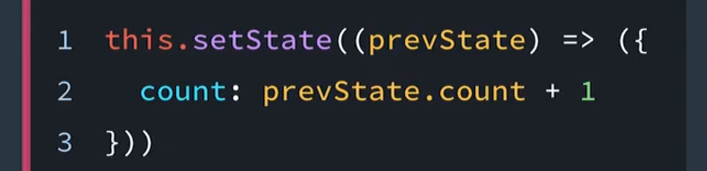

除了向 setState 传递函数，第二种方式是传入一个对象，此对象将与当前状态合并形成组件的新状态：


**如果组件的新状态取决于之前的状态，则使用 setState 的函数方法。而在其他情况下，则使用对象方法**。无论使用 setState 的方法是什么，最终的结果都是一样。

> 意思是：如果你现在的新数据需要通过之前的数据进行计算，也就是需要使用到之前的数据，则通过函数方法。如果你的数据和之前的数据没有关系则用对象方法。

无论何时调用 setState 默认情况下，React 都会重新渲染整个应用并更新 UI，这就是为什么我们说 React 中**用户界面只需通过一个传入状态的函数产生**。一旦状态发生变化，用户界面就会自动地更新：


---

现在我们想做的是，每当我们点击这些删除按钮中的一个时，我们便从联系人数组中删除特定的联系人。

你可能注意到这里有些东西很有趣，我们的联系人状态位于 App 组件内，但是删除联系人的特定图标位于我们的 ListContacts 组件内。那么我们要做的是，这是在 React 中很常见的一个模式，我们要将它变成 App 组件中的一个函数，因为这是状态所在的位置，然后让**函数负责更新我们的状态**，接下来我们要做的是将此函数放入 props 中并**向下传递**给 ListContacts，然后在我们的 ListContacts 组件中，我们将它与此按钮连接，这样每当此按钮被点击时，我们便向它传递特定联系人，然后它将被调用并更新组件的当前状态。

首先，像我之前提到的，我们在组件类上创建一个方法，我们称之为 removeContact，它的作用是**拿取被点击的特定联系人**。

接下来我们要做的是更新状态，但是我们要先删除其中的特定联系人，这么做的方式，我们在 React 中更新本地组件状态的方式，是使用 setState 的方法。我们可以通过两种不同的方式使用 setState，这里我两个都会讲，因为两个你都会见到。

第一种方法是向它传递一个函数，此函数将返回一个全新的对象，它将与当前状态合并：


第二种使用 setState 的方式是直接传递一个对象，此对象将与当前状态合并：


这两个方式的不同之处在于一个接受的是函数，而一个接受的是对象。而选择一个而不选择另一个的原因在于你是否需要根据当前状态更新状态。如果是，那就使用传入函数的模式，如果不是，则使用传入对象的模式。进一步解释来说就是，要传入此函数的第一个参数讲师当前状态，那么在我们的用例中，我们现在所做的是根据以前的状态更新联系人，所以我们用不到传入对象的模式。

然后，我们需要从当前状态删除特定联系人，并返回一个新的联系人列表。

我们输入 state.contacts.filter ，再次说明 state.contacts 将是我们状态的当前联系人数组。由于它是一个数组，它有 filter 属性，filter 方式类似于 map 方式，但是它不会返回全新的数组，而是让我们将数组中的特定项过滤出来。那么，它将向我们传递联系人，就像使用 .map 会看到的一样。现在我们想过滤出的是我们正在迭代的特定联系人，其 ID 属性不等于 contact.id 的地方：

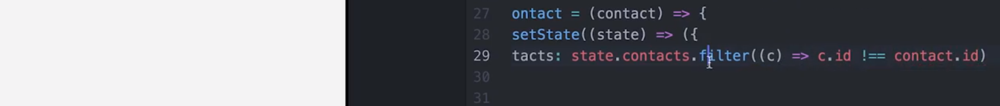

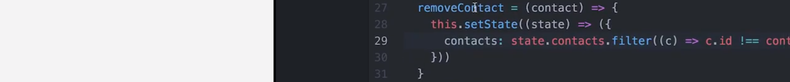

当 removeContact 被调用时，它将传递被点击的特定联系人，然后我们要做的是，过滤状态上的当前联系人。我们将删除状态联系人 ID 与被点击联系人 ID 不相等的地方，这将被评估为一个全新的数组，然后我们传递给 setState 的从 reducer 函数返回对象将于当前状态合并。在这个函数运行后，我们会看到的是我们会有一个全新的联系人状态，而被点击的特定联系人将被过滤掉。

现在我们有 removeContact 方法，我们想做的是在其中一个删除按钮被点击时调用它。我们要做的是将它作为 prop 传递给 ListContacts 组件，此方法称为 onDeleteContact 它将引用 this.removeContact：

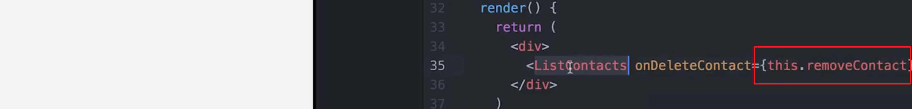

现在在 ListContacts 内，我们可以访问 props.onDeleteContact 然后每当此按钮被点击时便调用它，接下来我们可以在这里说每当发生点击时就调用这个箭头函数，而这个箭头函数的作用是，它将调用 props.onDeleteContact 向它传递我们正在迭代的特定联系人：

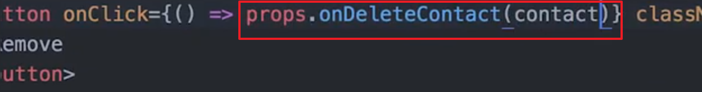

再次说明，我们这里的 removedContact 接受一个联系人并在使用 .filter 从我们的状态删除此联系人后更新状态，那么，我们要做的是将此方法向下传递给我们的 ListContacts 组件，作为 onDeleteContact，现在在 listContacts 中，每当此按钮被点击后，此箭头函数将被调用，然后它将调用 props.onDeleteContact 传递我们在迭代的特定联系人，而此联系人来自这里的 .map 函数。

现在我们点击 Micheal 会怎么样，它被删除了。

[这是本视频中所做更改的 commit。](https://github.com/udacity/reactnd-contacts-complete/commit/f794f553e4937f6b2afaab2acdb14c623d8eb8c1)

---

### 如何设置状态

之前，我们了解了如何在初始化时定义组件的状态。因为**状态表示的是可改变的信息**，最终会影响到所渲染的输出内容，因此组件可能还**会使用 `this.setState()` 在其生命周期内更新其状态**。我们已经知道，每次本地状态变化时，React 将通过调用其 `render()` 方法触发重新渲染组件。

可以通过两种方法来使用 `setState()`。第一个是合并状态更新。请看看下面的组件代码段：

```react
class Email extends React.Component {
  state = {
    subject: '',
    message: ''
  }
  // ...
});
```

虽然该组件的初始状态包含两个属性（`subject` 和 `message`），但是它们可以被独立地更新。例如：

```react
this.setState({
  subject: 'Hello! This is a new subject'
})
```

这样，我们可以让 `this.state.message` 保持不变，但是将 `this.state.subject` 替换为新的值。

使用 `setState()` 的第二种方式是传入函数，而不是对象。例如：

```react
this.setState((prevState) => ({
  count: prevState.count + 1
}))
```

此处，传入的函数具有单个 `prevState` 参数。当组件的新状态**取决于上个状态**（即我们使上个状态中的 `count` 加一）时，我们需要使用函数 `setState()`。

#### 练习题

关于设置组件中的状态，哪些描述正确？请选中所有适用项：

- 每当 `setState()` 被调用时，组件还通过新状态调用 `render()` :artificial_satellite:
- 可以通过向 `setState() 传入对象合并状态更新` :closed_lock_with_key:
- 当你想要重新渲染组件时，直接更新状态是最佳方法（即，选择 `this.state.message = 'Hi there';` 而不是 `this.setState({ message: 'Hi there' });`）
  - 直接改变 `this.state` **不会触发重新渲染流程**。相反，用户在页面上看到的内容可能不会反映组件的内部状态。 
- 状态更新可以异步（即 `setState()` 可以接受将之前的状态当做其第一个参数的函数）:happy:
- `setState()` 应该在组件的 `render()` 方法内被调用

最终，**UI 只是状态的函数**。在**重置状态时，能够利用 React 的自动渲染功能使应用的用户真正获得了动态体验**。 


### `setState()` 总结

虽然组件在初始化时可以设置其状态，但是**我们预期状态会随着时间的推移而变化（通常因为用户输入）**。组件能够使用 `this.setState()` 更改其内部状态。**每次状态发生变化，React 都知道并调用 `render()` 来重新渲染该组件。这样可以快速有效地更新你的应用 UI。**

#### 深入研究

- [正确使用状态](https://facebook.github.io/react/docs/state-and-lifecycle.html) React 文档|([翻译](https://doc.react-china.org/docs/state-and-lifecycle.html))


## 3.6 使用 PropTypes 

### 使用 `PropTypes` 检查组件的属性类型

当我们向应用中实现更多的功能时，我们可能很快就发现**经常需要调试我们的组件**。例如，如果传递给组件的 `props` 不是期望的数据类型 （例如是对象，而不是数组），怎么办？PropTypes 是一个软件包，使我们能够在一开始就定义想要看到的数据类型，并且在开发过程中，**如果传递给组件的属性不是我们预期的类型，PropTypes 将提醒我们。**

要在应用中使用 PropTypes，我们需要安装 [prop-types](https://facebook.github.io/react/docs/typechecking-with-proptypes.html)|([翻译](https://doc.react-china.org/docs/typechecking-with-proptypes.html))：

```
npm install --save prop-types
```

或者，如果你一直在使用 [yarn](https://www.npmjs.com/package/yarn) 来管理包，那么你可以使用下面的命令来安装：

```
yarn add prop-types
```

我们跳转到该软件包，看看如何使用它！

---

你会注意到，我们应用当前的**设置**是我们向 ListContacts 组件传递了两个 props：onDeleteContact 函数和 contacts 数组。

但是如果我们不传递 this.state.contacts 这个数组，而是意外地传入一个对象呢？会发生的情况是，在 ListContacts 内，当我们调用 props.contacts.map 时会出错，因为 contacts 不再是数组。相反地，我们意外地传递了一个对象。

因此，我们希望确保任何人在使用我们的 ListContacts 组件时，他们传入了两样东西：contacts 与 onDeleteContact 并且 contacts 是一个数组，而 onDeleteContacts 是一个函数。为此我们可以做的是，使用一个叫做 propTypes 的包，它基本上使我们不仅可以指定你要传递的每个 prop 的具体类型，例如字符串、数组、对象、函数等等。而且如果我们想要的话，也**可以指定我们传入组件的特定属性是否是必需的**。

让我们来看看它是如何工作的。

你需要做的是转至控制台，然后运行 npm install prop-types，prop-types 以前是 React 本身的一部分，但在 React 15.5 中，它们被分离出来并构建了自己的包。所以为了使用它，你需要用 npm install 命令。

安装它，然后重启你的服务器，如我提到的，你过去可以这么做：


使用来自 React 对象自身的 prop-types，但现在你需要这么做：


我们要做的是从刚安装的包导入 PropTypes。接下来，向无状态函数组件添加一个属性：

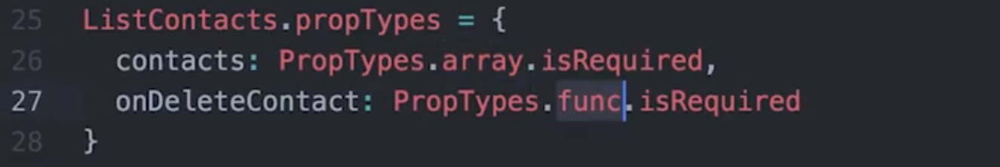

我们说 ListContacts.propTypes 它将等于一个对象并在这个对象上添两个属性，它们是 contacts 和 onDeleteContact：

- contacts: PropTypes.arrary.isRequired 表示让它是一个数组，并且是必需的。
- onDeleteContact: PropTypes.func.isRequired 表示让它是一个函数，并且必需。

也就是，数组我们使用 .array 函数我们使用 .func

接下来，我们保存这里的代码，你会发现应用停止了工作，因为哦我们在这里传入的是对象而非数组：

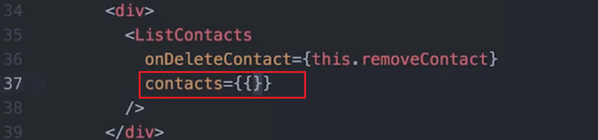

当我们打开控制台，你会发现出现了这些错误信息，并且还出现了这条警告：

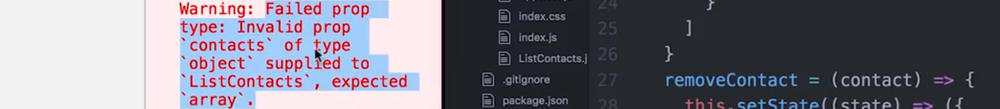

它说：proptype 出错：提供给 ListContacts 的 prop 'contacts'  类型 '对象' 无效，期望的类型为 '数组'。

再次强调 PropTypes 能够让我们指定具体的类型，给我们传递给特定组件的 props 并允许我们指定它是否是必需的。但是我们真正喜欢 PropTypes 的一点是，能够在控制台获得警告。

想象一下这是我们从NPM 安装的一个第三方组件，要了解你需要传递给此组件的具体 props，你可以阅读关于它的文档，或者如果此组件的作者在使用 PropTypes，你可以直接看看 PropTypes 设置。

PropTypes 基本上就像一篇清晰的文档，说明了如何使用特定组件本身。

---

[这是本视频中所做更改的 commit。](https://github.com/udacity/reactnd-contacts-complete/commit/a7f4728c61b539863b91752bfe21924eb81f3039)

Task List

- 已安装 [prop-types](https://www.npmjs.com/package/prop-types) package
- 已重启 Contacts 应用服务器

## 

看看下面的组件：

```react
import PropTypes from 'prop-types';

class Email extends React.Component {
  render() {
    return (
      <h3>Message: {this.props.text}</h3>
    );
  }
}

Email.propTypes = {
  text: // ???
};
```

我们想要验证的确传入的是 `text` 属性，它的数据类型是字符串。上述对象的 `text` 键应该是什么值？

答案：PropTypes.string.isRequired

- 当我们验证特定元素（例如 `数组`、`函数`、`数字`等）时，我们还可以**附上 `isRequired` 以便如果未提供该属性，则显示警告。** 

### PropTypes 总结

总之，PropTypes 是在 React 应用中验证数据类型的很好方式。通过 PropTypes 检查数据类型有助于我们在**开发阶段**发现 bug，确保用户获得顺畅的体验。

### 深入研究

- [prop-types](https://www.npmjs.com/package/prop-types) npm 库
- [使用 Proptypes 检查数据类型](https://facebook.github.io/react/docs/typechecking-with-proptypes.html) React 文档|([翻译](https://doc.react-china.org/docs/typechecking-with-proptypes.html))


## 3.7 受控组件

通常，**当你在 Web 应用中使用表单时，表单状态会位于 DOM 内**，但是像我们之前所说的，React 的主要作用在于更有效地管理你的应用程序的状态。所以表单状态通常存在于 DOM 内，但是 React 进行所有的状态管理，那么我们如何处理 React 中的表单呢？

我们可以通过 React 的受控组件来解决这个问题。

**受控组件**是**渲染表单的组件**，**但表单状态的来源位于组件状态内而非 DOM 内**。它们被称为受控组件的原因是，**因为 React 在控制表单的状态**。

这里我们有一个组件，它渲染了一个只有 input 元素的表单：

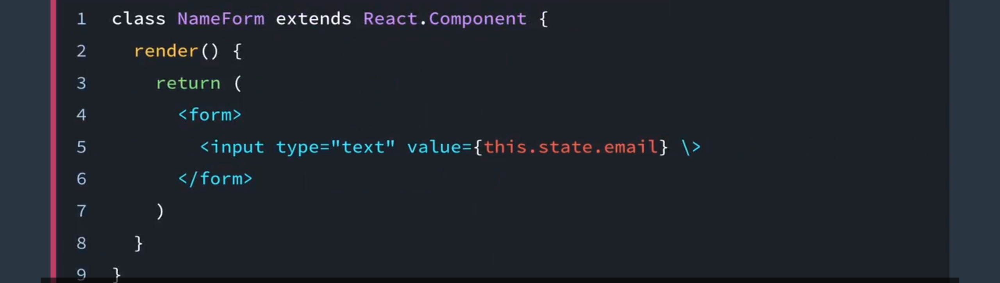

需要注意的第一点是，我们向 input 添加了一个属性值 this.state.email，它的意思是输入字段中的文本将是组件状态的 email 属性：

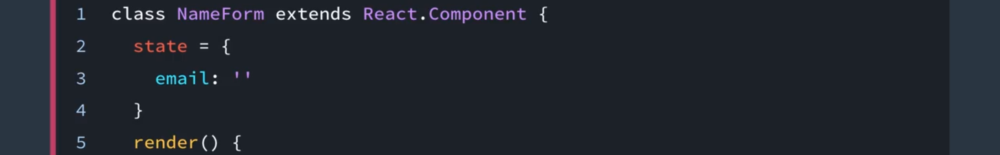

因此，更新输入字段的唯一方式是更新组件状态的 email 属性。

可以看出，这是一个真正的受控组件，因为 React 控制着我们状态的 email 属性。如果我们想让输入字段更改，我们可以创建一个 handleChange 方法，它用 setState 来更新邮件地址：

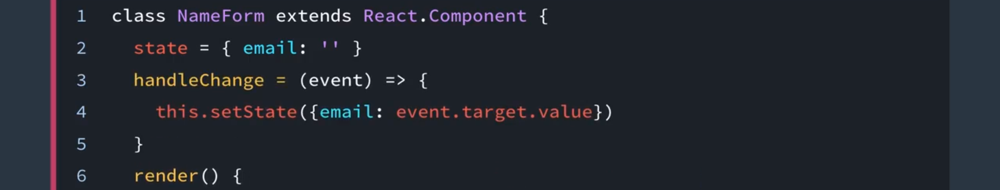

每当输入字段发生变化时，我们可以通过将它传递给 onChange 属性来调用此方法：

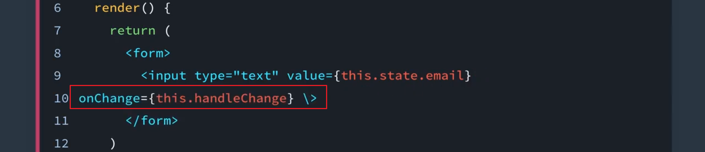

尽管受控组件的代码稍多，但它们确实有一些不错的优势：

- 第一，它们支持即时输入验证。
- 第二，它们允许你有条件地禁用或启用表单按钮。
- 第三，它们限制了输入的格式

注意，所有这些优点都涉及根据用户输入更新 UI。这不仅是受控组件，而且也是 React 的核心特征，**如果应用的状态发生变化，那么我们的 UI 会根据新状态进行更新**。

---

### React 开发者工具

在构建 React 应用时，有时候很难知道组件内部的发生情况。毕竟传递和访问了太多的属性，并嵌套了无数的组件，以及还有所有的 JSX 尚需渲染为 HTML，有时候很难让一切井然有序！

`React 开发者工具`使你能够检查组件的层次结构以及各自的属性和状态。安装该 [Chrome 扩展程序](https://chrome.google.com/webstore/detail/react-developer-tools/fmkadmapgofadopljbjfkapdkoienihi?hl=en-US)后，打开 Chrome 控制台并查看 `React` 标签页。要了解详情，请参阅该[官方文档 documentation](https://github.com/facebook/react-devtools)。

我们看看下面的实际使用案例！

---

又到我们的最终项目了，在这个视频中，我们要做的是构建这里的这个部分：

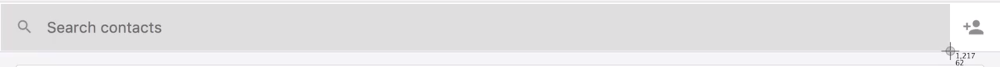

最后，它能使我们过滤我们的列表。

实际上，你可以用几种不同的方式来思考表单和 React：

- 第一种方法是完全绕过组件状态，直接将输入填入 DOM，然后每当你想从输入字段中获取特定值时，直接从 DOM 中抓取这些值。这是典型的方式。

- 但是如果你思考 React 的整个概念，React 非常擅长于管理状态，所以很多时候你也可以将表单状态放在 React 组件中。

在这个视频中，我们要做的是将输入字段与状态的特定属性的值绑定。而这样做的目的是，它允许我们**根据此表单数据来更新 UI**。

如果我们在这里输入 M，你会注意到我们在过滤列表：

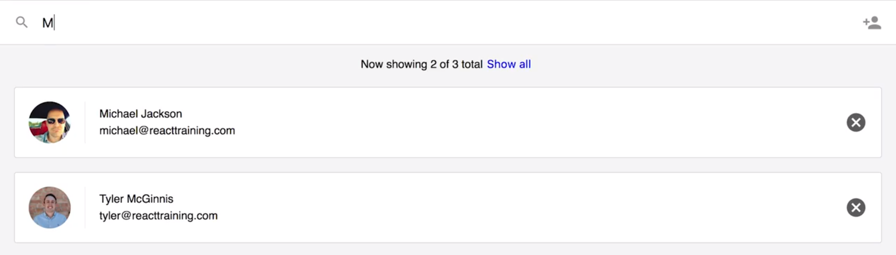

而且我们也显示这里的这部分（指输入框下的文字）

所以一个经验法则是，**如果你想让表单数据以任何其他方式更新 UI 而不只是更新实际输入的文本本身，那么你可以为表单创建一个所谓的“受控组件”，其中由 React 控制输入字段的状态**。

但是如果你只是想根据表单数据更新 UI，那么便可以直接**将表单数据粘贴到 DOM 的任何地方**，然后在需要时抓取它。

我发现我讲了很多，我们直接来看看操作吧。

我所做的是打开了 React 的开发工具，这是一个 Chrome 扩展程序，你可以在 Google Chrome 商店中获取它。它能让我们做的是以**树形结构**查看我们的应用，更好的是它能让我们看到**特定 Props 和组件状态**：

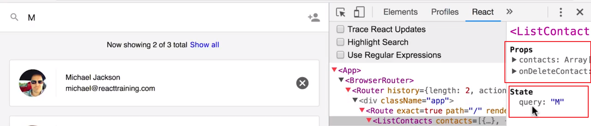

这里可以看到我们的 ListContacts 组件还有收到的这两个 props，然后我们还有这个 query 状态，那么如果我们在这里输入 I，则会发现状态也更新了：

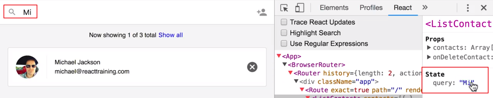

但是这里发生的一件事是我们的 UI 也在根据状态进行更新。

所以像我之前提到的，在这个视频中我们要做的是将这个输入字段绑定到 ListContacts 组件的状态。这可能有点反过来了，因为你可能会以为我们要做的是将状态上的这个 query 属性的值绑定到输入字段。而事实是，**输入字段的值将是 state.query 的值**，所以要更新输入字段，我们就得更新状态。

> 意思是，query 的属性值将去绑定输入字段（value），而不是 value 值绑定到 query 的属性值

这现在看起来可能不是很主观，但是这背后的原理是它让我们的输入字段状态存在于组件中，我们可以根据此状态更新 UI，我们来看看它的工作原理。

像刚才所说，我们需要向 ListContacts 组件引入状态，以跟踪输入字段的状态，但由于我们要引入状态，我们需要重构，将 ListContacts 从无状态函数组件变为类组件：

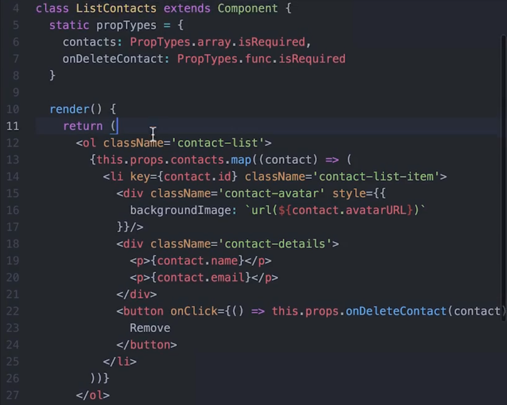

> 注意使用了 static 来声明 propTypes 静态属性。

在上面这里添加了 propTypes 作为我们类的静态属性，然后添加了 this.props，而不是 props，因为我们不再接收 prop 的参数了。

现在我们有了一个向 state 属性添加状态的类组件。

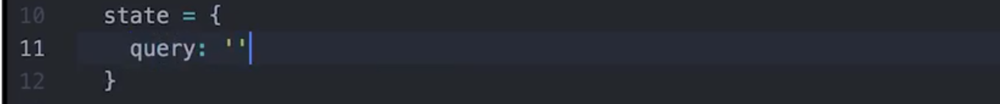

可以看到，我们将有一个 query 属性，它将是一个字符串。

现在我们创建输入字段，使用 React 你只能返回一个元素，我们要做的是添加一个 div，给它一个类名 list-contacts，然后在此 div 中，我们扔进自己的列表，然后在上面加入输入字段，我们创建另一个 div，然后在其中放入输入字段，一个叫做 search-contacts 的类名，类型为“text”，占位符就说“Search contacts”：

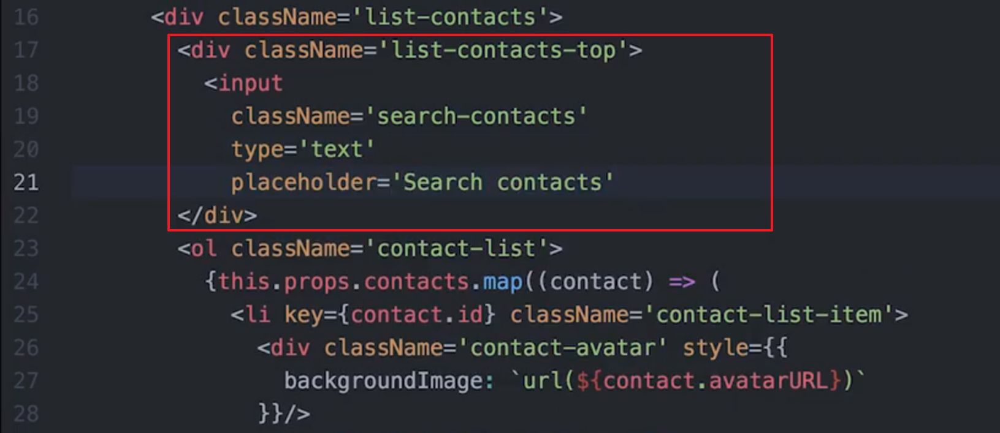

> 两点：
>
> - 首先是我们要将整个组件放入一个新的 div 中，因为在这个组件是由几个块所组成的。
> - 这个新的 div 的类名正好应该是组件的名称不过是使用小写 + 连接符组成

接下来我们需要两样东西，我们需要定义一个值，然后需要定义一个 onChange 函数：

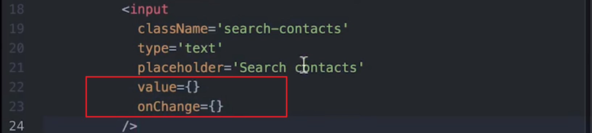

这里要发生的是，我们想让此输入字段的值始终等于 this.state.query 的值，然后我们希望发生的是，每当输入字段发生变化时，我们便更新 query，那么我们创建一个 updateQuery 方法，它将 query 作为输入，而我们要做的是更新状态，我们不会根据之前的状态来更新新状态，所以我们直接传递这个对象。让 query 等于 query.trim() 的值，并确保删掉它周围额外的空格：


接下来我们要做的是，我们定义每当输入字段发生变化时就会触发事件，此事件会调用 updateQuery，我们传递给它输入字段的特定值：


event 只是 React 提供给我们的 event 对象，为了获取输入字段的值，我们执行 event.target.value。

现在会发生的是，每当我们在输入框中打字时，就会调用这个 onChange 函数，这会进而调用 updateQuery 向它传递此输入字段内的新字符串，这会更新我们的状态，然后更新输入字段的特定值。

那么要看到它，我们可以说：将 this.state 的值显示到我们的视图中，query 状态会随着输入字段的更新而更新：

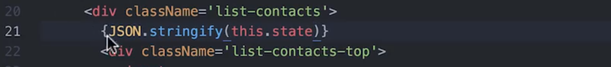

[这是本视频中所做更改的 commit。](https://github.com/udacity/reactnd-contacts-complete/commit/ce3a9a8a0f1d8d0224eba663e512cd309fb1f804)

---

注意 `value` 属性在 `<input>` 元素上设置。我们显示的值将始终为组件的`状态`中的值，**使`状态`成为“单一数据源”**。

因为是 React 最终控制输入表格元素的`值`，因此我们将该组件视为[受控组件](https://facebook.github.io/react/docs/forms.html#controlled-components)|([翻译](https://doc.react-china.org/docs/forms.html#%E5%8F%97%E6%8E%A7%E7%BB%84%E4%BB%B6))。

总结下用户输入如何影响到 `ListContacts` 组件自己的`状态`：

1. 用户在输入字段中输入文本。
2. 事件监听器在每个 `onChange` 事件上触发 `updateQuery()` 函数。
3. `updateQuery()` 然后调用 `setState()`，合并新状态以更新组件的内部状态。
4. 因为 `ListContacts` 的状态已变化，所以它会重新渲染。

我们看看如何利用这个更新后的`状态`过滤通讯录！为了帮助我们过滤通讯录，我们需要以下软件包：

- [escape-string-regexp](https://www.npmjs.com/package/escape-string-regexp)
- [sort-by](https://www.npmjs.com/package/sort-by)

```
npm install --save escape-string-regexp sort-by
```

### 习题 1/3

什么是受控组件？

- 控制其子组件的状态的组件
- 负责渲染表格，但是该表格状态的数据源位于组件状态里，而不是 DOM 里的组件
  - **React 擅长于处理状态**。它可能还会处理我们的表格状态！ 
- 会控制其子组件的 UI 的组件
- 负责渲染表格，但是该表格状态的数据源位于 DOM 里，而不是组件状态里的组件

---

现在我们要做的是，无论何时，当我们在输入框输入内容时，它不只是更新这里的本地查询状态，而且能够筛选联系人。

为了帮助我们实现筛选功能，我们要从 NPM 上安装几个小的包。那么转到你的终端，然后安装。

完成下载后，重新启动你的应用并回到代码。

那么要做的第一件事是导入刚刚安装的那些包，显示 escape-string-regexp 然后是 sort-by：

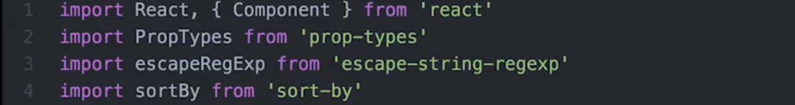

你会注意到，我们在下面这里正在做的是遍历整个联系人列表，但是实际上我们并不想遍历全部联系人，而只是遍历符合特定模式的联系人，比如输入框输入 M 就只显示 Michael 和 Tyler McGinnis

所以我们将使用正则表达式来这样做，如果你刚刚接触正则表达式，那要坚持一下了，这可能会有点令人退缩，但我们会陪你一起继续下去。

那么在 render 方法中，我们要做的是创建一个新的变量叫做 showingContacts，我们要做的是，不再遍历所有联系人，showingContacts 将只包含符合特定模式的联系人：

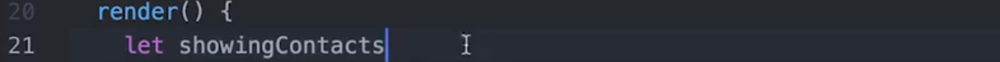

接下来我们在此创建一个 if 语句，因为如果（this.state.query）为真，也就是说有人在我们的输入框中输入了内容，那么我们该做什么呢？

那我们要找出，哪些联系人符合该特定模式，如果没人输入内容，那么我们说 showingContacts 将等于 this.props.contacts 或任何初始联系人：

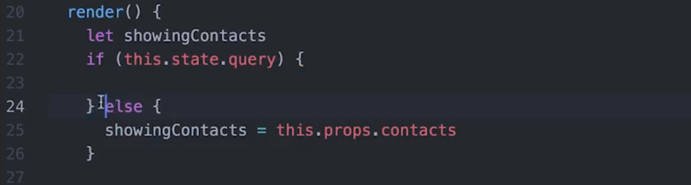

如果收到特定查询，我们想做的是创建一个新变量，而这个变量将是创建正则表达式新实例的结果。所以 match 将是匹配特定字段与模式的一个对象。那么我们想传递给 RegExp 的是，调用 escapeRegexp 向它传递**查询字段**以及第二个参数 “i”：

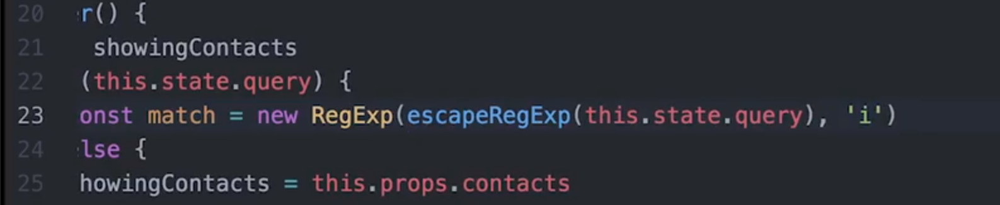

我们来简单总结协一下我们在这里所做的，在使用正则表达式时，有**一些字符具有特定的意义**，特别是像：

- 反斜线（\）backslash
- 乘方（^）carrot
- 货币符号（$） dollar sign

而这段代码的作用是说（指 `escapeRegExp(this.state.query)`），如果我们的**查询字段中有任何特殊符号则直接跳过，这样，我们就将这些特殊字符用作字符串字面量，而非特殊的正则表达式字符**。而 i 的作用是说直接忽略大小写。

> escapeRegExp 帮我们把那些特殊的字符进行了转译

那么现在我们有了 match 变量，我们可以做的是调用 match.test 传给它一个特定名称，如果我传入 Tyler，那么当 Tyler 匹配 this.state.query 中的特定模式时，它将返回 true。

知道了这点后，我们在这里说：

`showingContacts = this.props.contacts.filter( contact => match.test(contact.name))`

过滤器中的作用是筛选出符合我们特定正则表达式的联系人名称：

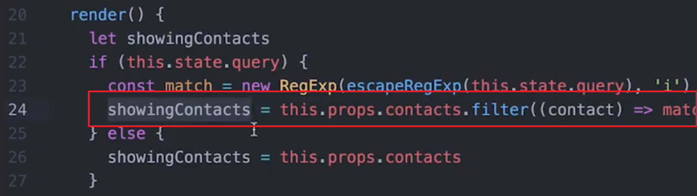

所以接下来发生是 showingContacts 将仅包含匹配此查询字段的联系人。所以，现在我们不再遍历 this.prop.contacts，而是遍历 showingContacts：

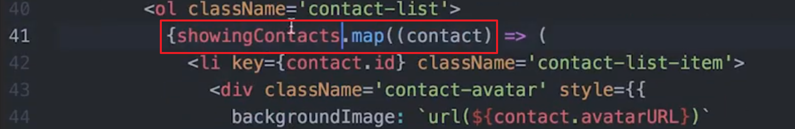

因为 showingContacts 是符合特定查询的所有联系人的筛选数组。

最后我们想做的是，确保我们的联系人始终按字母顺序排列人名。这时候，我们早些时候安装的 sortBy 函数就要派上用场了。

那么在下面这里，我们要做的是：


对 showingContacts 数组调用 sort 方法，而我们要传递给它的是我们安装的 sortBy 函数以及人名。

所以， **.sort 只是作用域所有数组的一个原生 JavaScript 方法**，sortBy 作为一个**辅助工具类**，**可以使我们将对象数组中的特定属性进行排序，而我们要排序的是人名**。

现在我们的联系人将始终按照字母排序。

[这是本视频中所做更改的 commit。](https://github.com/udacity/reactnd-contacts-complete/commit/abd5fccf9a69546e75d9c178379d3ef92405719e)

---

Task List

- 已安装 [escape-string-regexp package](https://www.npmjs.com/package/escape-string-regexp)
- 已安装 [sort-by package](https://www.npmjs.com/package/sort-by)
- 已重启 Contacts 应用服务器

### 💡 正则表达式 💡

在上个视频中，我们**创建了一个正则表达式对象**并**使用该对象检测通讯录姓名的格式**。正则表达式太复杂，这节课根本无法深入介绍，但是**它们在验证格式方面作用非常大**。

请参阅 MDN 对[正则表达式](https://developer.mozilla.org/zh-CN/docs/Web/JavaScript/Guide/Regular_Expressions)的介绍。此外，请参阅 [String `.match()` 方法](https://developer.mozilla.org/zh-CN/docs/Web/JavaScript/Reference/Global_Objects/String/match)如何使用正则表达式验证文本格式。

#### 习题 2/3

哪个优势是受控组件具备而不受控组件不具备的？

- 受控组件更像是“React 的处理方式”
- 受控组件需要输入更少的内容
- 受控组件性能更强大
- 受控组件使你能够根据表格本身更新 UI
  - 借助受控组件，表格状态将位于组件内。因此，我们可以根据该表格状态轻松更新 UI。 


目前，我们的组件有点混乱；`render()` 方法经常从状态对象访问 `query` (`this.state.query`)，并从属性对象访问 `contacts` (`this.props.contacts`)。因为属性和状态只是 JavaScript 对象，我们可以使用 ES6 功能将它们拆分为单个变量，而不是每次都将它们当做 `this.state.query` 和 `this.props.contacts`。这种拆分流程叫做[对象解构](https://developer.mozilla.org/zh-CN/docs/Web/JavaScript/Reference/Operators/Destructuring_assignment)。

总之，解构对象不会改变代码的返回值，但是可以让内容看起来更清晰。我们看看下面的实际使用案例。

---

我们需要做一点清理工作。

注意，我们在这里多次使用了 state 的 query 属性，并且多次从 this.props 中获取 contacts，那么我们可以使用 ES6 语法来这样简化代码：


现在我们可以不用 this.state.query 而直接使用 query，也可以不用 this.props.contacts 和 this.props.onDeleteContact 而是直接用特定的属性名 onDeleteContact 和 contacts


[这是本视频中所做更改的 commit。](https://github.com/udacity/reactnd-contacts-complete/commit/4f7055abb1c197c1c5c968b472a643dedcb90ba1)

---

### 显示通讯录条数

我们很快就处理完受控组件了！最后一步是让应用展示目前显示了多少条通讯录，总共有多少条。

---

你可能记得，当我们搜索单个联系人时，就会出现这部分内容：

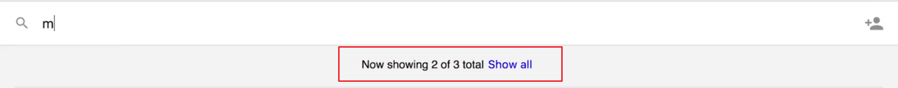

它想我们展示的是，我们从总联系人中搜索到多少联系人，它也允许我们清空搜索字段。

我真正喜欢 React 的一点是，你可以在大脑中分离两个不同的概念，总的来说，你使用 React 就是在**管理你应用中的状态**以及**确定 UI 该如何基于此状态发生变化**。

此视频中将充分展现此原则。因为我们要做的是，**仅在状态处于某种情况下时，渲染特定的 UI**。

在 input 控件下，我们添加一个表达式，我们定义如果 showingContacts.length 不等于 contacts.length，那么则显示一些 UI：

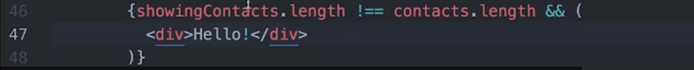

当我们输入“M”，将看到 Hello 字符，因为 showingContacts.length 等于 2，因为有两个联系人匹配此特定模式，而 contacts.length 等于 3，因为我们的联系人数组中有三个联系人。

所以我们在这里做的是，根据当前状态动态渲染此 div，再次强调 React 好的一点是我们可以在大脑中分离应用中的状态和 UI。这可以使我们更容易地思考复杂应用。

这里我们实际上要渲染的内容是：

```react
{showingContact.length !== contacts.length && (
	<div className='showing-contacts'>
		<span>Now showing {showingContacts.length} of {contacts.length} total</span>
         {/* 重置状态的按钮 */}
         <button>Show all</button>
	<div>
)}
```

然后我们要做的是创建一个方法以便点击此按钮可以清空查询字段，我们可以做的是，添加一个新的方法，我们定义为 clearQuery：


并把这个方法绑定到按钮上面：

`<button onClick={this.clearQuery}>Show all</button>`

现在当我们在应用中输入 M 会显示 Michael 和我自己，然后点击“显示全部联系人”则会重置查询并**重新渲染应用**，然后它会向我们显示全部联系人。


[这是本视频中所做更改的 commit。](https://github.com/udacity/reactnd-contacts-complete/commit/1ca08610c76a33da761b6d85e303cd8c436519de)

---

### 习题 3/3

在继续学习下节课之前，来检验下对受控组件的掌握情况！

关于受控组件的描述，下面哪些描述是正确的？请选中所有适用项。

- 状态的每次更新都具有相关的处理函数 :love_letter:
  - 借助受控组件，React 状态成为表格数据的“单一数据源”。这就是 `ListContacts`组件中的用户输入最终如何触发重新渲染页面内容。
- 表格元素通过属性接收它们的当前值 :book:
- 表格输入值通常存储在组件的状态中 :baby_bottle:
- `<textarea>` 和 `<select>` 不能是受控元素
- 受控组件的事件处理器会更新组件的状态 :bear:


### 受控组件总结

**受控组件是指渲染表格的组件，但是该表格状态的“数据源”位于组件状态里，而不是 DOM 里**。受控组件的优势包括： 

- 立即验证输入
- 有条件地停用/启用按钮
- 控制输入格式

在 `ListContacts` 组件中，该组件不仅会渲染表格，而且根据用户输入控制该表格中发生的情况。在这种情况下，事件处理器使用用户的搜索查询更新组件状态。我们已经知道，**对 React 状态的任何更改都将导致重新渲染页面内容，并有效地显示实时搜索结果**。


## 3.8 汇总所有信息

**在跟踪应用数据时，思考下需要如何处理该数据，并且当用户查看应用界面时，数据的外观看起来如何**。如果你希望组件**存储可变的本地数据**，可以**考虑使用状态存储该信息**。很多时候，系统会**使用状态来管理组件中的受控表格元素**。

另一方面，**如果某些信息一直不会变化，在整个应用中基本上是“只读”状态，可以考虑改为使用属性**。**状态和属性通常都是对象形式，更改任何一个都会触发重新渲染组件，但是它们各自在应用中扮演了截然不同的角色**。

在这节课，我们讲解了很多内容，并且你学到了很多知识。以下是可以帮助你巩固这些概念的课外资料：

- [React 思维方式](https://facebook.github.io/react/docs/thinking-in-react.html)|([翻译](https://doc.react-china.org/docs/thinking-in-react.html))
- [函数式组件与无状态函数式组件与无状态组件](https://tylermcginnis.com/functional-components-vs-stateless-functional-components-vs-stateless-components/)
- [受控组件](https://facebook.github.io/react/docs/forms.html)|([翻译](https://doc.react-china.org/docs/forms.html#%E5%8F%97%E6%8E%A7%E7%BB%84%E4%BB%B6))

