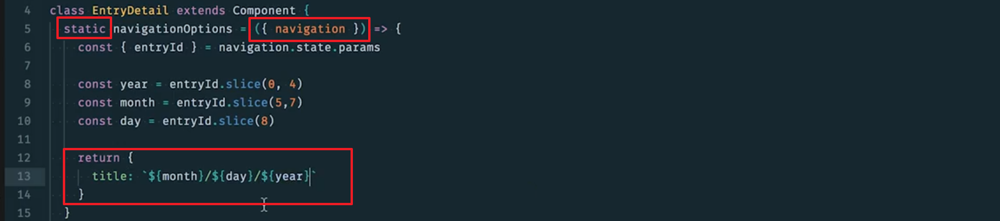

# 4.导航

> 你将学习如何实现 React Navigation 的导航器，以能够在应用中的选项卡和屏幕之间进行切换。

[TOC]

---

## 4.1 简介

在这节课，我们将学习导航知识，不可否认的是 react native 中的导航过程有点疯狂，解决的方案很棒，但是有很多不同的解决方案，并且各自具有利弊，我们将介绍的导航功能是 react navigation，选择该功能是因为它是由 Facebook 团队构建的，并且是 React Native 的官方导航方法。

在原生应用中进行导航与在网络上进行导航完全不一样，当你在网络上进行导航时，通常是将 URL 映射到特定的组件：


而在原生应用中，我们不再将 URL 映射到组件上，路由器会跟踪**路由堆栈**，可以看做一个路径数组，当你在应用中进行导航时，路由器从路径堆栈中弹出：


为了介绍这种新的路由模式，我们来看看 react navigation 的 TabNavigator API。

---

## 4.2 TabNavigator 简介

在本视频及后续几个视频中，我们将介绍 react-navigation，它是一个 react-native 导航库，react-navigation 的主要功能是提供导航器，默认情况下，它们提供了三个导航器：TabNavigator、StackNavigator、和 DrawerNavigator。

借助导航器，你能够定义应用的导航结构，在本视频中，我们将了解 TabNavigator，它使我们能够在应用中添加标签页，并在标签页之间来回切换，然后渲染不同的组件，无论是 Home 组件还是 Dashboard 组件：


在 Dashboard 函数下面新建一个变量，称之为 Tabs，如果你想了解下该组件，但是尚未安装，请运行 yarn add react-navigation。

我们在 TabNavigator 中传一个对象，**该对象上的属性将为具体的路径或标签页**。我们在这里输入 Home，它将是第一个标签页，然后将 screen 设为 Home，第二个标签页将是 Dashboard，我们希望屏幕显示这个 Dashboard 组件：


TabNavigator 返回的是实际组件，我们在 App 中渲染由 TabNavigator 返回的 Tab 组件：


我们来看看：


左边是 iOS 右边是 Android，你会发现二者之间的布局和样式不太一样，因为 iOS 具有自己的外观和行为，Android 也具有自己的外观和行为。当你在 iOS 上使用 TabNavigator 时，标签页是左边下面那样，虽然不明显，但点击确实会改变内容。如果你想向此 iOS 应用添加图标，因为没有图标的话，看起来太平淡了。  

在 TabNavigator 中，我们可以在不同的标签对象中添加一些 navigationOptions，添加 tabBarIcon，我们想要渲染 FontAwesome，名称为 home，Dashboard 屏幕的设置非常相似：


React Navigation 的强大之处是可以轻松地自定义，我们看看 TabNavigator 的官方文档，里面有很多设置，我们可以配置 tabBarPosition、initialRouteName、path，我们还可以配置一些样式，无论是 activeTintColor，还是如何显示标签、inactiveTintColor 等等。如果你需要用 React Navigation 实现某个效果，一般都能实现，因为这里有无数的选项，可能会有点复杂，因为你会传入大量的对象，就像这里一样，从而配置路由：


---

### TabNavigator

使用 React Navigation 的 `TabNavigator`，用户可以简单地按下渲染不同组件的选项卡来在应用中的不同页面间导航。假设我们有两个基本的功能组件，它们只能渲染一些文本 `Hello` 和 `Goodbye`:

```js
const Hello = () => (
  <View>
    <Text>Hello!</Text>
  </View>
);

const Goodbye = () => (
  <View>
    <Text>Goodbye!</Text>
  </View>
);
```

如果我们想添加两个选项卡供用户选择（一个渲染 `Hello`，另一个渲染 `Goodbye`），首先我们需要安装 `react-navigation` 然后导入 `TabNavigator`:

```bash
yarn add react-navigation
```

或

```bash
npm install --save react-navigation
Import { TabNavigator } from 'react-navigation';
```

完成后，我们可以像这样将一个对象传递给 `TabNavigator`:

```js
const Tabs = TabNavigator({
  Hello: {
    screen: Hello
  },
  Goodbye: {
    screen: Goodbye
  },
});
```

在对象内，每个键值对代表单个选项卡。键代表选项卡的**名称**；这是用户将看到并按下的东西。注意其中还包含一个 `screen` 属性，这是选项卡处于活动状态时渲染的组件。

下面这部分比较有趣: `TabNavigator` 返回的实际上是一个_组件_！由于我们将它存储在了一个 `Tabs` 变量中，我们可以像渲染任何其他组件一样渲染它:

```js
// App.js

// ...

export default class App extends React.Component {
  render() {
    return (
      <Tabs />
    );
  }
}
```

太好了！现在我们来看看实际操作，并将 `TabNavigator` 加入到我们的应用中。

---

History 视图现在看起来很棒了，还有一个 AddEntry 视图，看起来也不错。但是如果不添加导航功能的话，我们的应用就无法继续完善了。

首先，我们需要转到终端，运行 `yarn add react-navigation` 运行完毕后，重启应用，并回到 App.js 文件。

在此文件中，首先导入 Platform，因为我们需要用它来进行样式设置，然后从 react-navigation 中导入 TabNavigator，趁机导入一些颜色，从 utils/colors 导入 purple 和 white，然后我们还需要添加在即将构建的标签页中显示的具体图标，我们将使用 FontAwesome 和 Ionicons：


现在我们将创建 Tabs 组件，我们可以调用 TabNavigator ，我们要**传入的第一个对象将代表我们想在屏幕上看到的标签页**，我们首先要渲染的组件是 History，然后再添加一些 navigatonOptions 和 tabBarLabel，它将在标签栏上显示 “History”，tabBarIcon 将是一个函数，向其传入 tintColor，稍后设置该 tintColor，我们还要渲染这个图图标，因此导入它。然后我们再设置 Add Entry 标签页：


这些就是我们的标签页。

现在我们想为这些标签页指定一些选项，具体包括外观等，我们将向 TabNavigator 传入一个对象作为第二参数，然后给第一个属性 tabBarOptions，为其设置 activeTintColor，它将为所选标签页的颜色。然后在 tabBarOptions 中我们将添加一些要应用到标签栏上的样式：


现在 Tabs 是一个组件，因为 TabNavigator 返回的就是一个组件。

因此在 App 组件内，我们不再像之前那样渲染 History 或 AddEntry，而是渲染 Tabs：


我们来看看设备中的样子：


你会看到 Android 和 iOS 都具有自己的样式，我们可以在这两个标签页之间导航。

现在我们要快速添加一项内容，这项内容不会在此视频中影响到我们，但是在未来会有作用，我们在传入给 TabsNavigator 的第二个对象中添加一个属性 navigationOptions，将 header 设为 null，暂时先去掉任何报头，最终会在应用中设置报头，但是暂时先为空：


[这是包含此视频中所做更改的提交。](https://github.com/udacity/reactnd-UdaciFitness-complete/commit/9ff26370e4e5593195fdcad4d85e74f540a39220)

注意，这一课程的改动还比较大，但主要注意几点：

- `TabNavigator`  已经被弃用了，需要使用 `createBottomTabNavigator` 或者 `createMaterialTopTabNavigator`，可以根据 PlatForm.OS 来判断。
- 现在通过`createBottomTabNavigator` 或者 `createMaterialTopTabNavigator` 所返回的组件需要通过传入`createAppContainer` 来返回一个容器组件的方式使用。


`RouteConfigs` 和 `TabNavigatorConfig` 是与课程中所讲解的相同。

---

**现在我们能让用户在不同的屏幕之间导航了。效果如何？**

Task List

- 我安装了 `react-navigation`
- 我向 `TabNavigator` 传递了一个对象，并将返回值保存到了 `Tabs` 中
- 我正在 `App.js` 中渲染 `Tabs`
- 我创建了 `UdaciStatusBar` 组件
- 我正在 `App.js` 中渲染 `UdaciStatusBar`


### 总结

React Navigator 提供了一个 `TabNavigator` API，它允许通过各个选项卡在不同屏幕之间导航。每个选项卡专用于渲染特定组件。

本小节还详细介绍了 React Native 的 `StatusBar` 组件。`StatusBar` 的使用较为简单明了，并且完全可自定义 -- 我们通常是通过设置属性来更改它！

在下一小节中，我们将看看 React Navigator 的 `StackNavigator` API，它允许用户从堆栈中添加和删除屏幕。

#### 进一步研究

- [StatusBar props](https://facebook.github.io/react-native/docs/statusbar.html#props)，来自 React Native 文档

- [TabNavigator](https://reactnavigation.org/docs/navigators/tab)，来自 React Navigator 文档

---

## 4.3 StackNavigator 简介

之前我们看到 TabNavigator 使我们能够在应用中的不同标签导航，现在，我们将了解 StackNavigator 如何使我们能够转到**深层次的路径层级结构**，并且能够**从左到右地过渡**。

就像 TabNavigator 一样，我们调用 StackNavigator  返回一个组件给 Stack 变量，然后传入一个对象：


接着把 Stack 放到 App 中渲染：


我们看看应用的效果：


点击 To Dashboard 按钮并没有跳转到 Dashboard 屏幕，因为我们尚未将任何内容连接到 TouchableOpacity 组件。

我们在 Home 组件中传入了 navigation，在 TouchableOpacity 中添加 onPress 事件，当用户点击组件时，我们将输入 navigation.navigate，并转到 Dashboard 组件：


现在，当我们点击按钮时，我们就能跳转到新的页面。

React Navigation 的好处是，它会考虑不同平台具备的特性，因此 Android 上的动画效果与 iOS 上的有所不同。

接着，我们可以在下图红色部分的地方（标题部分）进行设置：


我们可以在 NavigationOptions 对象中进行设置，我希望在主屏幕上显示一个标题 “Home”，在 Dashboard 屏幕上显示标题“Dashboard”，但现在设置一些酷炫的效果，将 headerTintColor 设为 red，将 headerStyle 的 backgroundColor 设为 green，就会呈现如下效果：


ReactNavigation 非常强大，几乎可以设置任何效果，我们学习了 TabNavigator 它使我们能够在标签页之间切换，并且学习了 StackNavigator，它使我们能够转到深层次的路径层级。

最后要讲的是 DrawerNavigator，它将提供一个抽屉式导航栏，使我们能够在不同的项目之前导航。

---

### StackNavigator

在按下（假如说）索引视图中的一个项时，我们希望能转至显示该项详细信息的屏幕。React Navigation 提供另一个具有此功能的导航器！使用 `Stack Navigator`，新屏幕将作为一个_堆栈_添加和移除。这会以"先进先出"的方式将一个屏幕覆盖在另一个屏幕上，类似于`数组`的 `push()` 和 `pop()` 方法。

`StackNavigator` 的用法大体上类似于 `TabNavigator` 的用法。但是，我们不传入不同选项卡的对象，而是传入**该堆栈中可用的不同屏幕的对象**。首先，从 `react-navigation` 导入 `StackNavigator`。

```jsx
import { StackNavigator } from 'react-navigation';
```

假设我们有两个基本组件，`Home` 和 `Dashboard`:

```js
const Home = ({ navigation }) => (
  <View>
    <Text>This is the Home view</Text>
    <TouchableOpacity onPress={() => navigation.navigate('Dashboard')}>
      <Text>Press here for the Dashboard</Text>
    </TouchableOpacity>
  </View>
);

const Dashboard = () => (
  <View>
    <Text>This is the Dashboard</Text>
  </View>
);
```

注意一个 `navigation` 属性被传入到了无状态函数式 `Home` 组件，这允许导航到另一个路由。完成后，我们可以用类似于向 `TabNavigator` 传递对象的方式，将一个对象传入 `StackNavigator`:

```js
const Stack = StackNavigator({
  Home: {
    screen: Home
  },
  Dashboard: {
    screen: Dashboard
  }
})
```

将一个对象传递给 `StackNavigator` 后的返回值也是一个组件，并且我们可以这样渲染它！

```js
// App.js

// ...

export default class App extends React.Component {
  render() {
    return (
      <Stack />
    );
  }
}
```

`StackNavigator` 和 `TabNavigator` 通常是相互结合的。由于它们返回的都是_组件_，你经常会看到**一个嵌套在另一个中**。我们通过在 UdaciFitness 中实现这一点来看看实际操作！

---

**视频内容 2：**

现在我们的任务是让填充的每一天都可点击，每当我们点击这样的日期时，能够出现从左到右的过渡效果，进一步访问路径堆栈，我们看到一些相同的统计信息，并且看到一个重置按钮，因此我们需要完成几项任务。

首先在 component 中新建一个文件，称之为 EntryDetail，导入一些必要的和常用的组件和包，返回一个 View，其中具有文本“Entry Detail”，然后确保导出这个组件：


现在转到 App.js 文件，导入该组件。

### 我们目前正在渲染 Tabs 组件，但是我们要实现的是另一种导航，我们不再用到标签页，正如之前提到的，我们要访问路径层级结构，我们实际上需要 StackNavigator，因此，从 react-navigation 中导入 StackNavigator 函数。

转到构建 Tabs 的下面，就像 TabNavigator 那样，我们新建一个变量叫做 MainNavigator，设为等于 StackNavigator 的调用结果，该对象上的属性将为新的路径：


在 App 中，我们不再渲染 Tabs，而是渲染 MainNavigator：


现在当我们点击卡片并不会跳转，因为我们还没有设置 onPress。

来到 History.js 文件，当我们渲染该指标卡片时，我们将其封装在了 TouchableOpacity 组件中。因为现在 react-navagation 已经在控制我们的应用层次结构，并且在渲染这个 History 组件，现在我们可以访问的是函数 `this.props.navigation.navigate`，这样将会转到新的屏幕，传入的第一个参数将是我们要使用的屏幕，我们还可以传递一些信息，我们要在此屏幕上显示的是更多详情的具体条目，是一个 key，它是传递给 renderItem 的第三个参数：


现在，当我们点击指标卡片时，就能转到这个新的 EntryDetail 屏幕：


你会发现，红色部分的标题是紫色，因为我们在 App.js 中的 MainNavigator 进行了设置：


headerTintColors 的值是箭头的颜色。

现在，我们不再希望输出 Entry Detail，而是现实具体的 ID，即传递的具体的条目 ID。实现的方式是，输入 `this.props.navigation.state.params.entryId`：


看看应用状态：


现在出现要从 react store 中获取并显示在这里的数据的具体键。


[这是包含此视频中所做更改的提交。](https://github.com/udacity/reactnd-UdaciFitness-complete/commit/86af918722052eebafbc2892b6cd772b51a18dd4)


补充说明：

- `StackNavigator` 这个 API 已经启用了，现在需要使用 `createStackNavigator` 
- 依然需要将 `createStackNavigator` 返回的组件传入 `createAppContainer` ，使其有一个导航容器。
- 根据提交上有人回复的说明，使用了 `createStackNavigator` 需要设置 `header: null`，但我觉得应该需要根据情况来看，也有可能是在 iOS 的设备下会有问题。


---

#### 练习题

以下关于 `StackNavigator` 的说法哪个是正确的？请选择所有适用项

- `StackNavigator` 和_队列_的方式一样，实行"先进先出"的屏幕管理方式。（应该是`先进后出`）
- `StackNavigator` 无法渲染 `TabNavigator` 返回的组件; 它们必须单独使用。
- Android 和 iOS 中的 `StackNavigator` 动画渲染方式不同。:heart_eyes:
- 与 `TabNavigator` 类似，`StackNavigator` 也可以利用 `navigationOptions`。 :heart:


`StackNavigator` 非常简单，但又非常强大。我们只需定义对象中的所有屏幕，将其传递到 `TabNavigator` 中，就会返回可以渲染的组件！

---

**视频内容 3：**

这是 Android 和 iOS 版的 EntryDetail 视图，如果在顶部的标题部分显示当天的日期，会不会酷一些？


好消息是，我们可以实现这一点。

方法是，对于 StackNavigator 和 TabsNavigator，我们在 navigationOptions 下面传入了选项作为第二个参数：


如果我们想动态地设置特定的选项，我们可以在组件本身里**通过添加静态属性进行设置**。

转到 EntryDetail.js 输入 static，然后输入 navigationOptions，它是一个函数，向该函数中传入 navigation，这段代码的原理是，当我们转到 EntryDetail 视图时，我们可以返回一个 tilte，在这里输入的任何内容将显示在标题上。我们对日期进行格式设置，将 year 设为 entryId.slice(0, 4)，month 格式完全一样，但是从 5 到 7，day 将为 8，然后我们使用模板字符串，输入 `${month}/${day}/${year}`：



现在，当我们转到某一天的 EntryDetail 视图时，将在这里看到日期本身。


[这是包含此视频中所做更改的提交。](https://github.com/udacity/reactnd-UdaciFitness-complete/commit/7d4fba6fba7e0f9833e9645c2f34e9c058c9feed)

---

**视频内容  4：**

下一步的内容很明显，我们将使这个屏幕看起来更棒，将此屏幕连接到 Redux 然后获取特定键对应的日期的信息。

转到 EntryDetail.js 文件，导入一些内容：


然后我们不再导出 EntryDetail，而是导出 connect，然后在构建 mapStateToProps 函数，传入 state，也需要**传入具有 navigation 属性的当前 props**。然后在这里，获取转到 EntryDetail 视图时所获的 entryId，我们可以从 `navigation.state.params` 中获取该 ID，然后返回要**传递给组件**的所有信息，向其传递 entryId，然后传递 metrics，设为该 entryId 对应的状态，entryId 将为特定日期的键，将该 entryId 传递给组件的同时传递 metrics 属性下关于这一天的具体信息：


现在转到 EntryDetail 组件下，从属性下获取这些 metrics，然后我们将 MetricCard 组件导入并使用，用来渲染 metrics 中的数据，然后创建 styles：


[这是包含此视频中所做更改的提交。](https://github.com/udacity/reactnd-UdaciFitness-complete/commit/78657a10caa7e483bf9016208e4abe5a60911533)

---

**视频内容 5：**

现在我们想点击按钮它会重置特定日期的这些信息。

首先导入 addEntry，它是我们在很早之前创建的一个 action creator，接着，从 api 文件中导入 removeEntry，它将从数据库中删除特定的条目：


现在创建一个 mapDispatchToProps 函数，传入 dispatch，然后传入来自 props 的 navigation，首先，和之前一样，获取传递的 entryId，然后返回两种不同的方法，一个是从 store 中删除特地日期的项目，另一个方法使我们能够跳转到主屏幕视图。

输入 remove，它将调用 dispatch，然后调用 addEntry action creator，现在输入 [entryId]，在此 entryId 下，我们要做的重置信息，问题是，如果你还记得的话，我们要重置的日期是当天，则不能重置为 null，而是重置为这些信息：


转到 EntryDetail，导入两项内容，第一个是 timeToString 以便获得**当前日期的 ID**，第二个是 getDailyReminderValue 以便获得该日期的对象，现在转到 mapDispatchToProps 的 remove 中，但我们删除它时，要么设为 `timeToString() === entryId`，如果是今天，则设为 getDailyReminderValue 返回的内容，也就是提示：“嘿，别忘了记录数据”或设为 null：


我们要添加到该对象的第二个内容是 goBack，调用 navigation.goBack()：


现在我们可以在组件中访问 remove 和 goBack 了，转到我们的组件中，在这里设置一个 reset 方法，每当我们点击 reset 首先获取 remove，goBack 和 entryId 来自于 this.prop，entryId 来自于 mapStateToProps 中，然后调用 remove()，调用 goBack()， 然后调用 removeEntry()，来自于 api 文件中，传入 entryId：


到目前为止，看起来不错，现在设置一个 UI 来调用 reset，导入 TextButton ，然后输入 `onPress={this.reset}`：


现在会出现的情况是，当我们点击 RESET 按钮时，这个组件将重新渲染，然后将会出现故障，因为它会尝试获取特定 entryId 的状态，如果不是当前日期则为 null，然后将所有 metrics 传入 MetricCard 接着就会出现故障。

这个问题可以有几种解决方法，我认为最合适的方法是，输入 shouldComponentUpdate，如果 nextProps.metrics 不为 null，并且 nextProps.metrics.today 为假，那么该组件应该更新，但是如果不是这种情况，则不更新组件：


当我点击 RESET 按钮，组件将自然地重新渲染，虽然我们要回到主屏幕，因为 EntryDetail 依然在路径堆栈中，而 shouldComponentUpdate 的作用是不要重新渲染组件，除非 nextProps.metrics 不等于 null，表示日期具有当前信息，并且 nextProps.metrics.today 为假。但是，如果没有这段代码，则 MetricCard 将渲染，并传入 metrics，他将是 null 或者是一个带有 today 属性的对象，然后一切都会出现故障。

（这里我是这样理解的，因为 EntryDetail 组件依然在堆栈中，所以依然会重新渲染，只是它的屏幕位置会位于下方而已）


[这是包含此视频中所做更改的提交。](https://github.com/udacity/reactnd-UdaciFitness-complete/commit/7b2103a06e2394f938168d9f1040dd6ba9ac2e2d)

---

在完成导航器部分之前，我们还需要进行几项小的更改。

在我们构建 AddEntry 组件中，我们在 submit 方法与 reset 方法中预留了一些注释，即 Navigate to Home 和 Route to Home，每当我们提交新的日期信息或重置当天信息，我们想要执行所有这些操作，并且返回主屏幕。

我们在此组件中使用方法 NavigationAcitons，来自于 ‘react-navigation’ 软件包，实现方法是，先新建一个方法，叫做 toHome，它将调用 this.props.navigation.dispatch 类似于 Redux，我们将分派 NavigationsActions.back，我们想要回到某个某地，我们从哪里回去呢？也就是具有 key: ‘AddEntry’ 的位置，我们想从当前所在的位置回到之前的位置：


然后将这个方法调用到 submit 方法与 reset 方法注释，即 Navigate to Home 和 Route to Home 的下面。

你会发现，我们并没太关心事情的发生顺序，你可以对顺序比较严格，但是我不太在意，如果你想遵守一定的顺序，完全可以这么做。我们的顺序是：分派、设置状态（相当于异步状态）、设置路由跳转、提交条目：


如果你想重构执行顺序，完全可以。

现在你可以到 AddEntry 屏幕，设置一些指标，然后提交，现在会跳转到主页面。


[这是包含此视频中所做更改的提交。](https://github.com/udacity/reactnd-UdaciFitness-complete/commit/18aeee6aac40702c2d86cf976a9a67c5691505cf)

---

**导航现在应该可以正常使用了！确保您完成了以下操作：**

Task List

- 我创建了 `EntryDetail` 组件
- 我创建了 `MainNavigator` 组件，并将`选项卡`嵌套到了其中
- 我更新了 `History` 中的 `renderItem()` 方法
- 我向 `EntryDetail` 添加了 `navigationOptions`
- 我使用 `connect()` 将 `EntryDetail` 连接到了**存储器上下文**
- 我向 `EntryDetail` 实现了**重置**功能
- 我将 `NavigationActions` 集成到了 `AddEntry`


### 总结

React Navigation 的 `StackNavigator` 是另一个可自定义的导航选项，基于向堆栈添加和移除新屏幕。它的 API 与 `TabNavigator` 的类似；它接收定义所有屏幕的对象，然后返回一个组件。由于 `StackNavigator` 和 `TabNavigator` 返回的都是组件，通常的做法是将这些导航器彼此嵌套。

在下一个小节中，我们将看看 `DrawerNavigator`，其中屏幕从屏幕侧面弹出的抽屉菜单切换出来！

### 进一步研究

- [React Native 中的堆栈导航](https://medium.com/@swathylenjini/stack-navigation-in-react-native-2cd00374ff3a)

---

## 4.4 DrawerNavigator 简介

**视频内容 1：**

我们已经讨论了 TabNavigator 和 StackNavigtor，最后一个要讨论导航器是 DrawerNavigator，它使我们能够使用在屏幕左侧或右侧弹出抽屉式导航栏浏览应用。

这里现在有两个组件，我们不再像之前那样，从 Home 组件转到 Dashboard 组件，最终我们将添加这个按钮，点击该按钮后，无论位于哪个页面都会打开抽屉式导航栏并转到其他页面：


首先转到 Dashboard 函数组件的下方，创建 Drawer 组件，将其设为调用 DrawerNavigator 后的结果，传入的参数和之前其他导航器很像：


现在要做的是，因为 React Navigation 正在渲染这两个视图，两个视图将被传入 navigation。正如之前看到的那样，在 Home 组件的 TouchableOpacity 组件中，设置点击事件，当这个组件被点击后我们可以调用 navigation.navigate，然后传入字符串 DrawerOpen：


这段代码的作用是打开抽屉式导航栏。

同样的我们在 Dashboard 中也添加这段代码。

现在，我们在 Home 组件和 Dashboard 组件中都添加了导航栏，我们可以打开抽屉式导航栏，直接弹出：


这样，我们就可以使用抽屉式导航栏在两个页面之间切换了。

我们快速添加一些修改，我们希望在抽屉导航栏中显示图标，和之前一样，添加一些导航选项，将 drawerLabel 设为 Home，将 DrawerIcon 设为 FontAwesome 图标：


现在当我们点击 Open Drawer 按钮打开 Drawer 时，就能看到这些图标了：


---

### DrawerNavigator

React Navigation 还提供另一个基本的导航器，以在 React Native 应用中创建自定义导航：`DrawerNavigator`。`TabNavigator` 使用选项卡来帮助用户在特定屏幕间导航，而 `DrawerNavigator` 使用会划入屏幕侧面的抽屉式菜单导航。虽然我们不会在 UdaciFitness 中实现这一点 - 但知道这一点也很重要，而且这在 React Native 应用中很常见！

要使用 `DrawerNavigator`，请确保从 `react-navigation` 导入它:

```
Import { StackNavigator } from 'react-navigation';
```

幸运的是，`StackNavigator` 和 `TabNavigator`有许多相同的理念，同样可以适用于此！让我们再一次看看这两个基本组件，了解`DrawerNavigator` 如何对它们进行渲染：

```js
const Home = ({ navigation }) => (
  <View>
    <Text>This is the Home view</Text>
    <TouchableOpacity onPress={() => navigation.navigate('DrawerOpen')}>
      <Text>Press here to open the drawer!</Text>
    </TouchableOpacity>
  </View>
);

const Dashboard = ({ navigation }) => (
  <View>
    <Text>This is the Dashboard view</Text>
    <TouchableOpacity onPress={() => navigation.navigate('DrawerOpen')}>
      <Text>Press here to open the drawer!</Text>
    </TouchableOpacity>
  </View>
);
```

注意，每个 `TouchableOpacity` 包装器会打开抽屉菜单，而不是路由到另一个组件。同样，也可以使用 `DrawerClose` 关闭抽屉。为了简化，React Navigation 还提供 `DrawerToggle` 来根据当前的抽屉状态自动选择适合的导航。

类似于 `TabNavigator` 和 `StackNavigator`，之后我们可以将一个对象传递给 `DrawerNavigator`，渲染返回的组件，然后就完工了！

```js
const Drawer = DrawerNavigator({
  Home: {
    screen: Home
  },
  Dashboard: {
    screen: Dashboard
  }
});
// App.js

// ...

export default class App extends React.Component {
  render() {
    return (
      <Drawer />
    );
  }
}
```


### 习题 1/2

关于 `DrawerNavigator` 的说法哪个是正确的？请选择所有适用项：

- `DrawNavigator` 的抽屉通常跨越整个屏幕的高度。 :+1:
- `StackNavigator` 返回的组件可嵌套在 `DrawNavigator` 内。 :star2:
- `DrawerNavigator` 由 `react-native` 提供。
- 与 `TabNavigator` 和 `StackNavigator` 不同，`DrawNavigator` 不会返回组件。


很多本机应用包含一个抽屉菜单，可帮助用户浏览应用程序。`DrawerNavigator` 为我们提供了一个简单又强大的方法，以在 React Native 应用中实现抽屉菜单！

### 习题 2/2

我们来快速回顾一下！请将导航器与其管理屏幕的方式相匹配：


### 总结

React Navigation 的 `DrawerNavigator` 用于轻松设置带抽屉导航的屏幕。我们用于设置 `StackNavigator` 和 `TabNavigator` 的很多相同做法也适用于 `DrawerNavigator`。只需传入包含不同屏幕的对象，便可返回可以渲染的组件。因此，这使 `DrawerNavigator` 组件非常容易与其他导航器嵌套！

#### 进一步研究

- [DrawerNavigator](https://reactnavigation.org/docs/navigators/drawer) 来自 React Navigation文档

---

## 4.5 课程总结

在这节课，你学习了如何使用 react-navigation 进行导航

- TabNavigator 使你能够在应用屏幕中添加多个标签页。
- StackNavigator 使应用能够在不同的屏幕之前转换，并且每个新屏幕都互相堆叠在一起。
- DrawerNavigator 可以用来轻松地设置抽屉式导航栏。

- 最后，你学习了如何嵌套不同的导航器以获得所需的路由方案。

在下节课，你将学习如何利用原生功能增强应用的功能。