# 基础篇 | 第二部分

[TOC]

## 10 | 理解虚拟 DOM 及 key 属性的作用

### 回顾 JQuery

在 Vue、React、Angular 之前，JQuery 可以说是前端的标志，几乎占据了整个前端市场，直到现在也有很多项目依然在使用 JQuery。

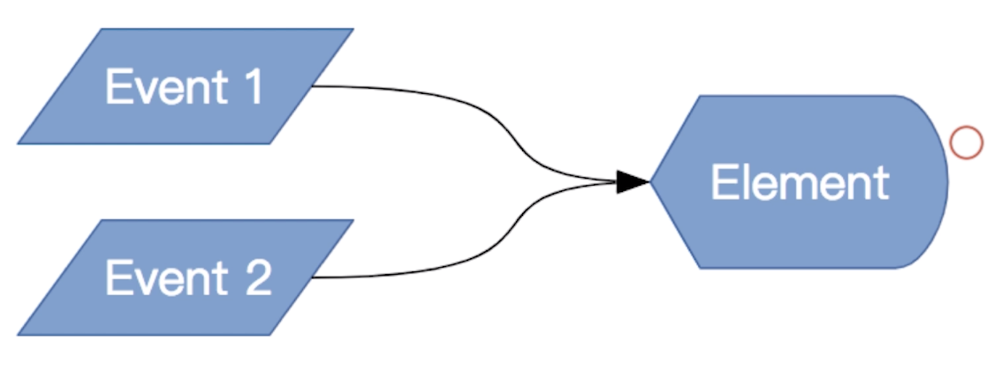

它帮助我们简化了操作 DOM 的 API，可以很容易为 DOM 绑定事件来操作 DOM。

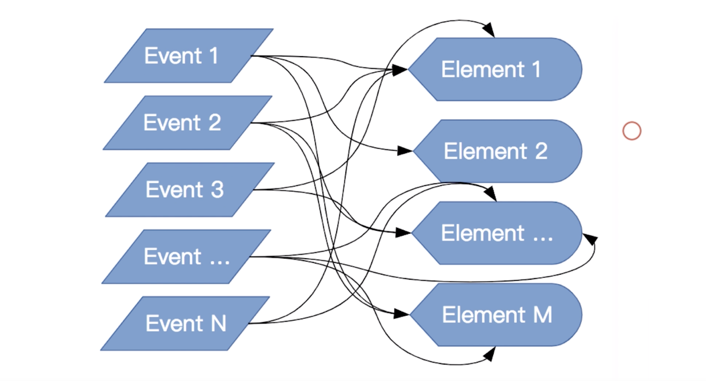

但随着系统越来越复杂，会出现越来越多的事件，使我们通过事件来操作不同的 DOM 或者是相同的 DOM 的每次迭代都很小心翼翼，可以说就是这个痛点造就了 React 和 Vue 的诞生。

### 再看 Vue

我们来看一下 vue 是如何解决这个痛点的。

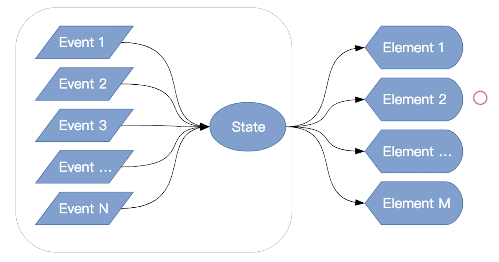

可以说，在这一块 React 和 Vue 没有太大的区别，都是通过引入一个数据中间层，我们的事件不再是直接操作 DOM，而是事件去改变数据，数据映射到真实的 DOM，这部分的功能是由 Vue 的底层帮助我们处理的，也就是说我们不再直接操作 DOM。

数据的更新引起 DOM 的更新，那么我们如何尽可能的高效的更新 DOM 呢？

因为操作 DOM 是一件非常消耗性能的一件事情，而为了用户体验更好，那么我们就应该尽可能的使用之前的 DOM，这个时候我们就要引入虚拟 DOM 的机制了。

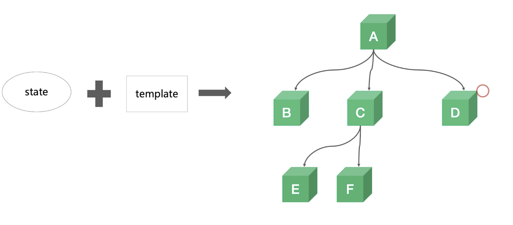

如上图所示，state（数据）+ template（模版）就能够最终生成一个类似于 DOM 的数据结构（注意，是数据结构），在这个数据结构中我们保留着这个节点的一些信息，包括类型、属性、事件等，当数据更新之后，我们会生成一个新的数据结构，前后的数据结构我们通过算法的对比，然后查找出需要更新的节点，尽可能的复用 DOM，提升性能。

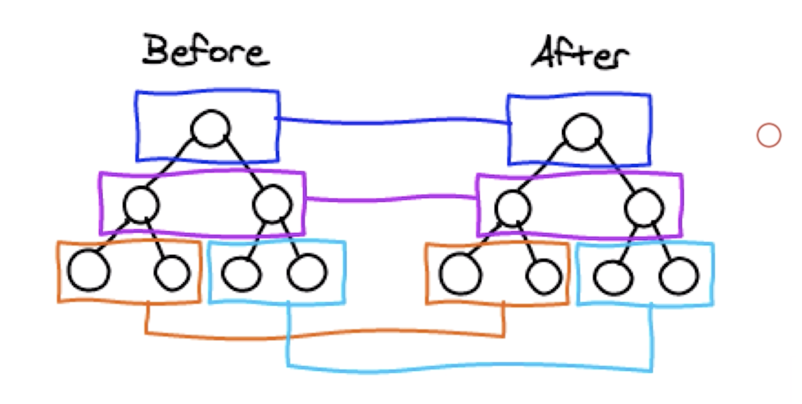

那要查找两棵树的差别，其时间复杂度是 O(n3)，其性能很差。考虑到前端页面的结构，我们很少会出现跨层级的移动节点，基于这个假设，我们引入一个新的算法，只需要比对同层级的节点，如上图所示，比对相同颜色框中的节点，得出需要更新的节点。

#### 场景 1 - 移动

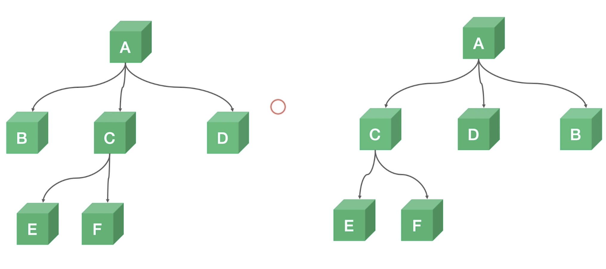

> B C D 为不同的元素节点，可能分别是 span、div、p

如上图所示，左边的树结构中，A 节点下有 B、C、D 三个节点，C 节点下有 E、F，我们需要将左边的树状结构变为右边的树状结构，那么对于操作 DOM 而言，其实只需要将 C、D、B 的节点位置进行更换就行。

#### 场景 2 - 删除新建

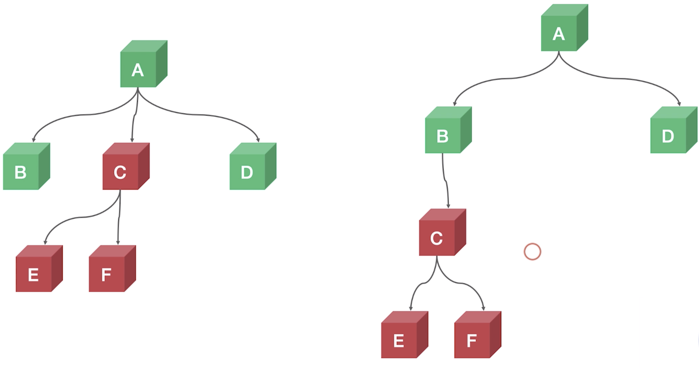

这个场景中，我们需要将 C 节点移动到 B 节点的子节点中，对于算法而言，比对的过程中，会将 C 节点删除，然后再在 B 节点中创建新的 C 节点，然后在 C 节点中创建 E、F 节点，所以 C、E、F 并不能直接**复用**。虽然这并不是最为理想的算法方式（最为理想是直接移动 C 节点，但由于同层比较算法的假设，这是没有办法做到的），但好的一点是我们不需要手动的操作 DOM。

#### 场景 3 - 删除新建

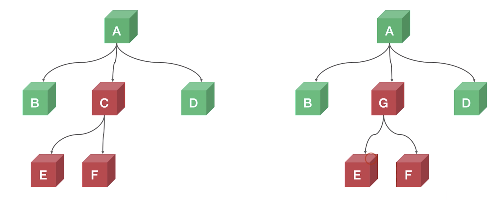

如上所示，将 C 节点更换为 G 节点，E、F 节点不换，但对于同层比较的算法而言，当发现 C 节点已经不存在时就直接删除掉，其 E、F 节点也会被相应的删除，然后才是添加 G 节点和 E、F 节点。

#### 场景 4 - 更新删除新建（无 key）

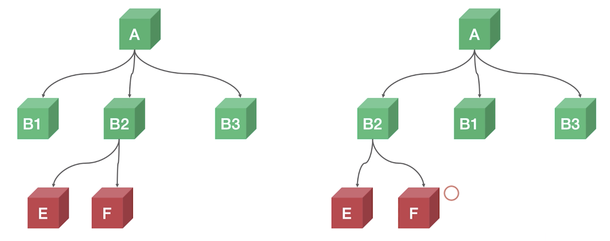

> B1 B2 B3 是相同类型的节点，可能全是 li

当改变如上图所示时，算法比较 B1、B2 并不知道我们是要移动还是更新，那么这个时候就是直接将 B1 更新为了 B2，B2 更新为了 B1，B3 还是保留着，这时 E、F 节点实际上无法复用，而会新建。所以，针对这样的场景我们增加 key 属性来解决这个问题。

#### 场景 5 - 移动（有 key）

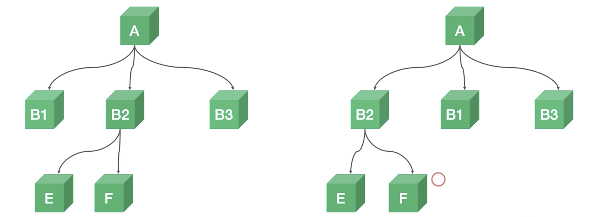

当有了 key 之后，就会变得和场景 1 相同，最终就只是节点的移动。

#### 场景 6 - 插入（有 key）

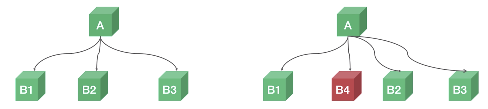

如上图更新过程，如果没有 key，则会是将 B2 更新为 B4，B3 更新为 B2，然后新建 B3。如果有 key，则我们只需要插入 B4 就可以了。

### demo

> 演示 DEMO 源码 /src/views/1.3
>
> 请花时间理解这些 demo，这些 demo 就是将上面所讲到的内容通过 vue 的操作来实现了一遍。

这里将第一个场景的代码拿来说一下：

```jsx
<template>
  <div class="border">
    <h1>A 结点</h1>
    <button @click="orderAsc = !orderAsc">移动</button>
    <div v-if="orderAsc">
      <ChildrenB />
      <ChildrenC></ChildrenC>
      <ChildrenD />
    </div>
    <div v-else>
      <ChildrenC> </ChildrenC>
      <ChildrenD />
      <ChildrenB />
    </div>
  </div>
</template>
<script>
import ChildrenB from "./ChildrenB";
import ChildrenC from "./ChildrenC";
import ChildrenD from "./ChildrenD";
export default {
  components: {
    ChildrenB,
    ChildrenC,
    ChildrenD
  },
  data() {
    return {
      orderAsc: true
    };
  }
};
</script>

```

- 当我们点击 `<button>` 之后，orderAsc 会取反从而改变下面节点的排列。由于每个组件（ChildrenB、C、D）在其内部都对组件在不同的生命周期执行控制台的打印操作，所以可以知道当页面中的节点发生变化时，这些组件是否重新挂载、更新、删除。比如 ChildrenB 节点的代码：

  ```jsx
  <template>
    <div class="border1">
      <h2>B 结点 {{ number }}</h2>
      <slot></slot>
    </div>
  </template>
  <script>
  export default {
    props: {
      number: Number
    },
    mounted() {
      console.log(`B${this.number || ""} mounted`);
    },
    updated() {
      console.log(`B${this.number || ""} updated`);
    },
    destroyed() {
      console.log(`B${this.number || ""} destroyed`);
    }
  };
  </script>
  
  ```

- 在场景一中，由于同级节点都为不同的组件，当算法进行对比之后，会发现只需要移动位置就可以完成操作，所以并不会将这些组件节点删除，因此在控制台中也会不执行这些生命周期函数。

### 课后习题 5

为什么我们不能使用 index 来作为 key？

> 有同学的回答：
>
> 测试发现，最好不要用index作为key，用index作为key有时候会导致bug，尤其是item是具有某种状态的时候。举个简单的例子，如果有ABC三个item，其中第一个A是选中的，这个时候如果我在A前面添加D，用index作为key就会变成D是选中的了，建议用唯一id来作为key。


## 11 | vue 如何触发组件的更新

vue 是由数据驱动的视图框架，所谓数据驱动就是我们的 DOM 是通过数据来映射的，我们只有在数据改变的时候视图才会改变。

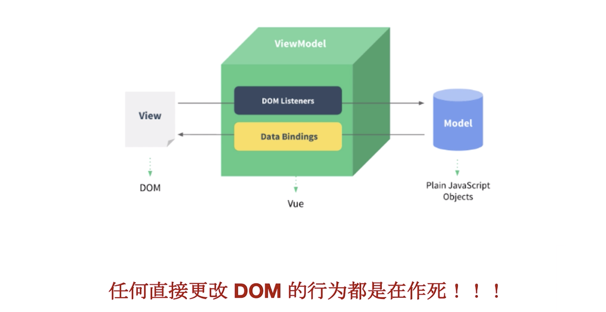

没有特殊情况我们不要去直接更改 DOM，并且「特殊情况」很有可能是你所认为的「特殊情况」，遇到这种「特殊情况」时，我们最好静下来好好想想是不是真的「特殊情况」。

### 数据来源（单向的）

三个部分：

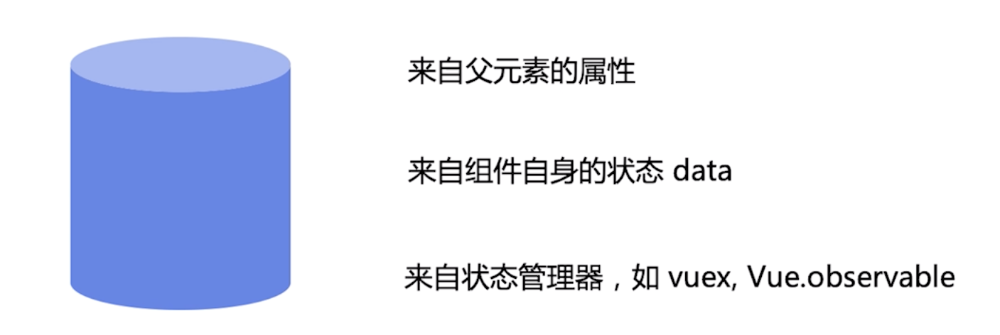

### 状态 data VS 属性 props

- 状态是组件自身的数据
- 属性是来自父组件的数据
- 状态的改变未必会触发更新
- 属性的改变未必会触发更新

### demo

> 演示 DEMO 源码 /src/views/1.4

通过这个 demo 来了解组件的何时更新何时不更新。

先看代码：

```jsx
export default {
  components: {
    PropsAndData
  },
  data() {
    this.name = name;
    return {
      info: {},
      // info: {
      //   number: undefined
      // },
      list: []
    };
  },
  methods: {
    handleNameChange() {
      this.name = "vue" + Date.now();
      console.log("this.name 发生了变化，但是并没有触发子组件更新", this.name);
    },
    handleInfoChange() {
      this.info.number = 1;
      // this.$set(this.info, 'number', 1)
      console.log("this.info 发生了变化，但是并没有触发子组件更新", this.info);
    },
    handleListChange() {
      this.list.push(1, 2, 3);
      console.log("this.list 的引用没有发生变化，但是触发了子组件更新", this.list);
    }
  }
};
```

- 当我们触发 `handleNameChang` 和 `handleInfoChange` 方法时，方法内会改变 `this.name` 和 `this.info.number` 的值，但并不会触发子组件的更新，原因在于：
  - `this.name` 并没有通过 data 方法进行返回，只是在 data 方法中通过 `this.name = name` 进行了赋值。
  - `this.info.number`，虽然 `this.info` 进行了返回，但 `this.info.number` 并没有赋予初始值。
- 当我们触发 `handleListChange` 方法时，虽然 `this.list` 的引用没有发生变化，但 `push` 方法被 vue 更改过，只要调用此方法改变数据则会触发更新。

再来看一种情况，代码如下：

```jsx
<template>
  <div>
    <p>props.info: {{ info }}</p>
    <p>props.name: {{ name }}</p>
    <p>props.list: {{ list }}</p>
    <p>data.a: {{ a }}</p>
    <p>
      <button @click="handleBChange">change data.b</button>
    </p>
  </div>
</template>
<script>
export default {
  name: "PropsAndData",
  props: {
    info: Object,
    name: String,
    list: Array
  },
  data() {
    return {
      a: "hello",
      b: "world"
    };
  },
  updated() {
    console.log("触发 PropsAndData updated");
  },
  methods: {
    handleBChange() {
      this.b = "vue" + Date.now();
      console.log("data.b 发生了变化，但是并没有触发组件更新", this.b);
    }
  }
};
</script>
```

- 当我们通过点击按钮触发点击事件从而执行 `handleBChange` 方法时，虽然 `this.b` 在 `data` 方法中进行了返回，但并没有更新，原因是这个状态并没有在模版中使用。

### 响应式更新

我们来看一下 Vue 是如何做响应式更新，哪些数据来做依赖收集，哪些数据不需要。先看图：

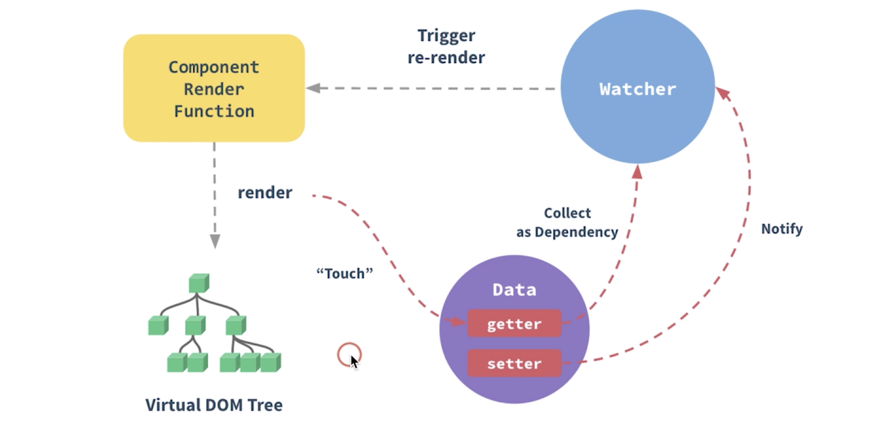

当 vue 做实例化时会对 Data 下的数据做 `getter` 和 `setter` 的转化，所谓的转化可以说直白一点其实就是对此数据做了一个中间的代理层，无论是取数据也好还是设置更改数据重新赋值也好，它都会经过代理层然后再去执行相应的操作，我们在这个代理层中可以做任何的一个事情，这就是我们实例化对数据做的转化。

那么当组件进行渲染的时候（render），如果我们会需要一些 Data 中的数据，它就会将这个数据放到 Watcher 之中，如果没有用到则不会进入 Watcher 之中（比如上面第二个示例的情况），这也就是为什么组件中的数据更改了，却没有触发组件更新的原因。

### 课后习题 6

数组有哪些方法支持响应式更新？如不支持如何处理，底层原理是如何实现的？

问这个问题的原因是，数组的一些方法是不会改变其引用的，其数组本身的引用并没有改变，那么本应该不会触发 Watcher。


## 12 | 合理应用计算属性和侦听器

### 计算属性 computed

可以直接理解为能够执行计算逻辑的属性，特点如下：

- 减少模版中计算逻辑
- 数据缓存
- 依赖固定的数据类型（响应式数据），也就是不能是其他的全局数据。

好处当然是提高性能。

#### demo

> 演示 DEMO 源码 /src/views/1.5

```jsx
<template>
  <div>
    <p>Reversed message1: "{{ reversedMessage1 }}"</p>
    <p>Reversed message2: "{{ reversedMessage2() }}"</p>
    <p>{{ now }}</p>
    <button @click="() => $forceUpdate()">forceUpdate</button>
    <br />
    <input v-model="message" />
  </div>
</template>
<script>
  export default {
    data() {
      return {
        message: "hello vue"
      };
    },
      computed: {
        // 计算属性的 getter
        reversedMessage1: function() {
          console.log("执行reversedMessage1");
          return this.message
            .split("")
            .reverse()
            .join("");
        },
          now: function() {
            return Date.now();
          }
      },
        methods: {
          reversedMessage2: function() {
            console.log("执行reversedMessage2");
            return this.message
              .split("")
              .reverse()
              .join("");
          }
        }
  };
</script>
```

- 上面代码中，我们可以通过两种方式来更新组件，一是使用 `button` 来强制更新，二是在 `input` 中输入一些字符更改响应式数据 `message` 来触发更新。第一种更新方式也可以想象成，组件因为其他数据的改变而被更新了。
- 这个示例主要是用于让我们理解为什么需要使用 computed 计算属性。当我们需要使用现有数据用于计算后的数据时，如果使用 `methods` 方法，则无论此现有数据是否发生变化，只要组件发生更新则都会执行，而当我们使用 computed 时则不会有这个问题，因为 computed 中的方法属性只有当其所使用的响应式数据发生改变时才会重新执行并计算返回出所需要的数据。

### 侦听器 watch

watch 是用于监听数据的变化的，特点：

- 更加灵活、通用
- watch 中可以执行任何逻辑，如函数防抖节流，Ajax 异步获取数据，甚至操作 DOM

#### demo

```jsx
<template>
  <div>
    {{ $data }}
    <br />
    <button @click="() => (a += 1)">a+1</button>
  </div>
</template>
<script>
export default {
  data: function() {
    return {
      a: 1,
      b: { c: 2, d: 3 },
      e: {
        f: {
          g: 4
        }
      },
      h: []
    };
  },
  watch: {
    a: function(val, oldVal) {
      this.b.c += 1;
      console.log("new: %s, old: %s", val, oldVal);
    },
    "b.c": function(val, oldVal) {
      this.b.d += 1;
      console.log("new: %s, old: %s", val, oldVal);
    },
    "b.d": function(val, oldVal) {
      this.e.f.g += 1;
      console.log("new: %s, old: %s", val, oldVal);
    },
    e: {
      handler: function(val, oldVal) {
        this.h.push("😄");
        console.log("new: %s, old: %s", val, oldVal);
      },
      // e 对象下的任何属性发生变化都会触发这个监听器方法的执行
      deep: true
    },
    h(val, oldVal) {
      console.log("new: %s, old: %s", val, oldVal);
    }
  }
};
</script>
```

- 当我们点击 `button` 后会使 `a` 状态 +1，从而触发 a 的监听器，使 b.c 发生变化，触发 b.c 的监听器（这里注意在 27 行代码中可以看到使用字符串的方式可以传入对某个对象下的属性进行监听），然后是触发 b.d 的变化，b.d 又会触发 e.f.g 的变化，由于 e 状态的监听器添加了 `deep: true` 配置，所以虽然没有改变 e，但 e 对象下的任何属性发生变化都会触发 e 的监听器函数的执行，最后，h 的监听器也被触发。

### computed VS watch

- computed 能做的，watch 都能做，反之则不行
- 能用 computed 的尽量用 computed，这是因为 computed 在大多数情况下更简单

那我们什么时候用 computed，什么时候用 watch 呢？先看 demo：

使用 computed：

```jsx
<template>
  <div>
    {{ fullName }}

    <div>firstName: <input v-model="firstName" /></div>
    <div>lastName: <input v-model="lastName" /></div>
  </div>
</template>
<script>
export default {
  data: function() {
    return {
      firstName: "Foo",
      lastName: "Bar"
    };
  },
  computed: {
    fullName: function() {
      return this.firstName + " " + this.lastName;
    }
  },
  watch: {
    fullName: function(val, oldVal) {
      console.log("new: %s, old: %s", val, oldVal);
    }
  }
};
</script>
```

- 注意这里 computed 的属性依然可以用于 watch 进行监听

使用 watch：

```jsx
<template>
  <div>
    {{ fullName }}

    <div>firstName: <input v-model="firstName" /></div>
    <div>lastName: <input v-model="lastName" /></div>
  </div>
</template>
<script>
export default {
  data: function() {
    return {
      firstName: "Foo",
      lastName: "Bar",
      fullName: "Foo Bar"
    };
  },
  watch: {
    firstName: function(val) {
      this.fullName = val + " " + this.lastName;
    },
    lastName: function(val) {
      this.fullName = this.firstName + " " + val;
    }
  }
};
</script>

```

- 首先说一下这个功能，一个能够改变 firstName 的 input 框和一个能够改变 lastName 的 input 框，通过改变其中之一然后显示整个名称。
- 使用 computed，我们只需要在 computed 字段下添加一个 `fullName` 方法属性，然后通过 `this.firstName` 和 `this.lastName` 的值来返回即可，当这两个状态发生变化时，fullName 就会发生变化从而改变更新组件。
- 使用 watch，我们就需要在 `data` 字段中添加 `fullName` 状态，然后分别监听 `firstName` 和 `lastName`，这样相比于 computed 而言就会稍微冗余一些。

对于到底是使用 computed 还是 watch，其实在很多时候你很难在第一时间就想到到底应该用哪一个，比如上面这个例子，虽然 watch 相对而言比较冗余，但也能够接受。当你项目做多了，它们之间的选择会成为一件水到渠成的事情。

> 这里我想说明一种使用 computed 而非 watch 的情况，当你需要用到多个状态（比如上面用到了两个）时，就尽量使用 computed 而非 watch，因为使用 watch 你需要监听多个状态会比较麻烦。

### 课后习题

> 对 Watch Demo 进行防抖改造，既直到用户停止输入超过 500ms 后，才更新 fullName

```jsx
export default {
  data: function() {
    return {
      firstName: "Foo",
      lastName: "Bar",
      fullName: "Foo Bar"
    };
  },
  watch: {
    firstName: function(val) {
      clearTimeout(this.firstTimeout);
      this.firstTimeout = setTimeout(() => {
        this.fullName = val + " " + this.lastName;
      }, 500);
    },
    lastName: function(val) {
      clearTimeout(this.lastTimeout);
      this.lastTimeout = setTimeout(() => {
        this.fullName = this.firstName + " " + val;
      }, 500);
    }
  }
};
```

- 我们可以直接使用 `this.xxx` 来接收 `setTimeout` 的返回值，用于取消延时器。


## 13 | 生命周期的应用场景和函数式组件

每个 vue 组件在被创建的时候都会经历一个初始化过程，数据更新和组件销毁时也会触发一系列的钩子函数，这些钩子函数可以用于执行一些业务逻辑代码。

### 生命周期

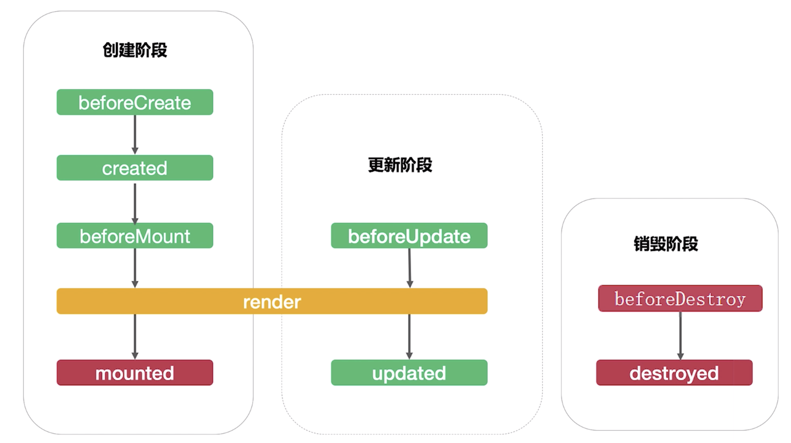

生命周期主要分为三个阶段：

- 创建
- 更新
- 销毁

创建和销毁只会执行一次，而更新则会执行多次。

#### 创建阶段

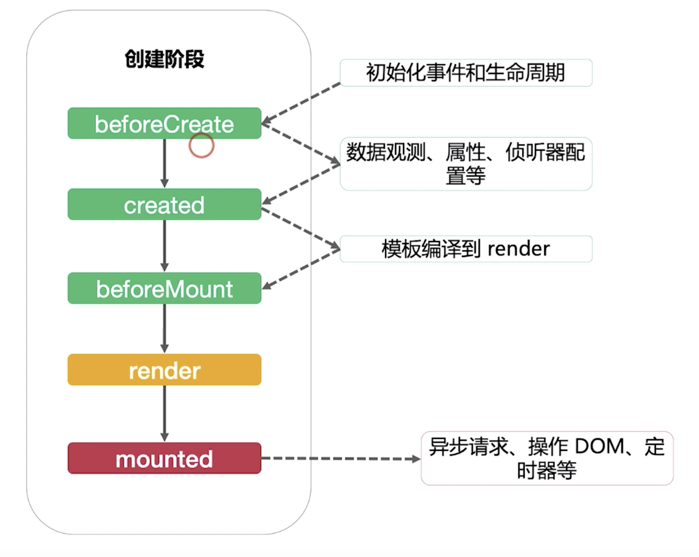

- 在 `beforeCreate` 之前组件实例会初始化事件和生命周期
- 执行 `beforeCreate`
- `beforeCreate` 之后会对数据做响应式化的处理（数据观测），还有属性、侦听器配置等
-  执行 `created`
- `created` 之后则是我们模版编译到 render，如果是直接写 render 函数的话，则此阶段被跳过，但一般情况下我们都是写 `<template>` 这样的形式
- 执行 `beforeMount`
- 执行 `render` ，render 会生成虚拟 DOM，然后挂载到浏览器，实现真实 DOM
- 执行 `mounted` ，我们一般会在 `mounted` 中会做异步请求、操作 DOM、定时器等操作
- 在 `mounted` 之后，vue 并不承诺其子组件也会实现挂载（也就是形成真实 DOM），所以有时我们需要使用 `this.$nextTick` 来执行操作 DOM 

#### 更新阶段

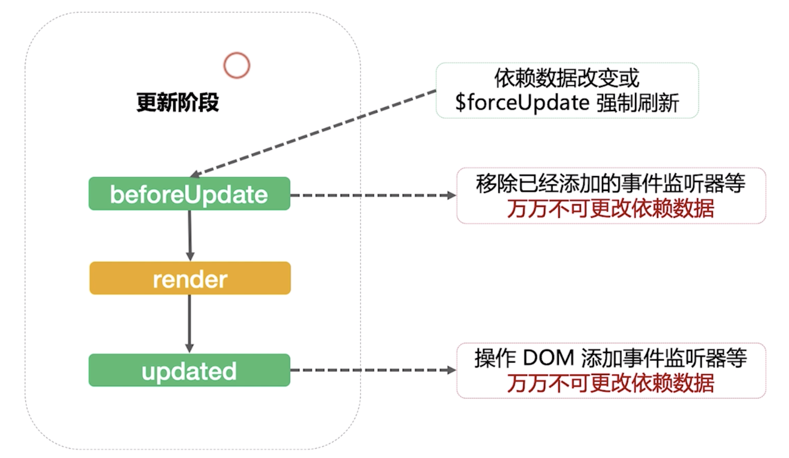

首先我们要知道，更新阶段是多次执行的阶段，在数据发生变化或者调用 `$forceUpdate` 进行强制更新的时候，则会开始更新阶段。

- 首先，会执行 `beforeUpdate`，在此钩子中，我们一般会移除已经添加的事件监听器（平时的业务开发很难用到，一般是在开发组件库会用到）等，但切记万万不可更改依赖数据，会造成死循环。
- 执行 `render`，生成最新的虚拟 DOM，然后更新挂载真实 DOM
- 然后，执行 `updated` ，同 `mounted` 相同也不承诺子组件会更新完毕实现挂载，所以操作 DOM 依然也需要使用到 `this.$nextTick` 。这个生命周期中我们可以操作 DOM 添加事件监听器等，也同样，对于普通的业务开发可能很难使用到，切记万万不可更改依赖数据。

#### 销毁阶段

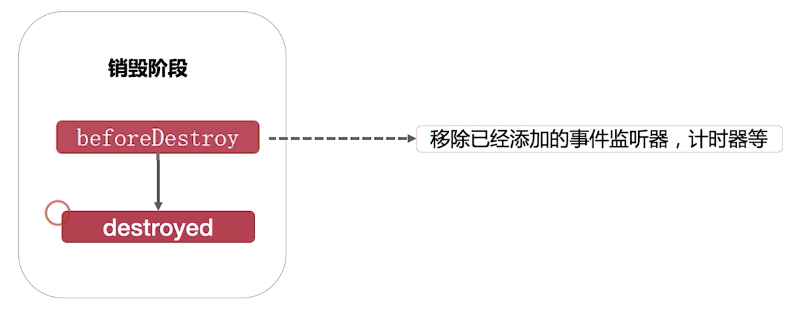

组件被销毁之后也会提供给我们两个钩子：

- `beforeDestroy` 是销毁之前执行的，一般用于移除添加的事件监听器，计时器等。
- `destroyed` 这个生命周期极少使用，基本上使用 `beforeDestroy` 就足够满足基本的使用。

#### demo

> 演示 DEMO 源码 /src/views/1.6

这个 demo 主要是通过在 data 字段和每一个生命周期中在控制台打印生命周期的字符串，这样我们就能够了解生命周期的执行顺序了。

代码中，如何销毁组件的：

```jsx
<Clock v-if="!destroyClock" />
```

- 通过 `v-if` 指令我们就可以很简单的根据一个状态来创建和销毁一个组件

代码中，如何更新组件的：

```jsx
methods: {
  startClock() {
    clearInterval(this.clockInterval);
    if (this.start) {
      this.clockInterval = setInterval(() => {
        this.now = moment(new Date()).format("YYYY-MM-DD HH:mm:ss");
      }, 1000);
    }
  }
}
```

- 不断的更新响应式状态 `this.now` 的值
- 使用 `setInterval` 之前，一定得记得先清除之前所添加的定时器

render 钩子的执行位置：

```jsx
<template>
  <div>
    {{ log("render") }}
    {{ now }}
    <button @click="start = !start">{{ start ? "停止" : "开始" }}</button>
  </div>
</template>
```

- 第三行中我们打印了 `"render"`，因为我们使用了 `template`，所以 `template` 就会添加进 render 之中

### 函数式组件

函数式组件相对于普通组件而言有如下特点：

- functional: true
- 无状态、无实例、没有 this 上下文、无生命周期

可以认为是一个简单的方法，当我们在组件定义时，给一个 `functional: true` 的配置则声明为了一个函数式组件。

函数式组件一般是作为一个展示型组件来使用的，并且就像在之前所看到的，可以用于渲染 VNode。

函数式组件也可以在模版中做**临时变量**，在 vue 的模版中是没有提供临时变量这个功能的，但是开发过程中临时变量是非常有必要的，否则在模版中会出现多次重复的逻辑计算，当然，计算属性在很大程度上已经帮我们避免了这个事情，但计算属性有一个限制，需要依赖于响应式数据，而且模版中也需要一些 `v-if` `v-for` 的数据是来源全局的，这种情况下为了避免重复计算，我们就需要一个临时变量。下面我们来看一下实现的代码：

先是在父组件中：

```jsx
<Functional :name="name" />
<TempVar
  :var1="`hello ${name}`"
  :var2="destroyClock ? 'hello vue' : 'hello world'"
  >
  <template v-slot="{ var1, var2 }">
    {{ var1 }}
    {{ var2 }}
  </template>
</TempVar>
```

然后是 `Functional` 组件：

```jsx
<template functional>
  <div>
    {{ props }}
  </div>
</template>
```

- 可以看到，当我们使用 `.vue` 的单文件组件时，只需要在 `template` 中添加 `functional` 属性就行。

最后是 `TempVar` 组件：

```jsx
export default {
  functional: true,
  render: (h, ctx) => {
    return ctx.scopedSlots.default && ctx.scopedSlots.default(ctx.props || {});
  }
};
```

- 首先要说明的是，`TempVar` 组件实际上是 `.js` 文件而非 `.vue` 文件
- 需要在返回的对象中添加 `functional: ture` 的属性
- 添加 `render` 方法，这里所做的处理是，先判断是否有 scopedSlots 为 default 的插槽，如果有则我们就向该默认插槽添加函数组件所获得的所有 props，也就是将 props 返回给位于父组件中的调用方。
- 因此，回到父组件代码中，在第 3 和 4 行我们向函数组件传入了两个 prop var1 和 var2，然后在 `<template>` 和其 `default slot` （作用域插槽）中通过 `v-slot={ var1, var2 }` 解构返回这两个 prop（当然子组件内部也需要传递），这个时候 var1 和 var2 就成为了我们的**临时变量**，在 `<template>` 中可以随时使用。

### 课后习题

> 设计一个秒杀倒计时组件


## 14 | 指令的本质是什么

如果经常使用 `<template>` 语法，则会经常使用指令；如果使用 render 函数与 JSX 的话，则指令就不会显的那么常用。


### 内置指令 - 14 种

- v-text
- v-html
- v-show
- v-if
- v-else
- v-else-if
- v-for
- v-on
- v-bind
- v-model
- v-slot
- v-pre
- v-cloak
- V-once

指令实际上是一种语法糖、标志位，当处于编译阶段时，从 `<template>` 编译到 `render` 函数时，会把这些语法糖编译为 js 代码，这也是为什么 `render` 函数与 JSX 并不支持内置指令的原因。

不过指令确实能够简化我们的开发过程，并且 JSX 也是语法糖，所以 JSX 也在逐渐的开始支持指令。

### demo

> 演示 DEMO 源码 /src/views/1.7

我们先从代码中来看一看这些指令的使用和作用：

**v-text：**

```jsx
<div v-text="'hello vue'">hello world</div>
```

- 我们使用 `v-text` 传入了 `'hello vue'` 字符串，然后在 `div` 元素的内容中添加了 `hello world` 的内容，最终 `v-text` 的值会替换掉 `div` 元素中的所有内容

**v-html：**

```jsx
<div v-html="'<span style=&quot;color: red&quot;>hello vue</span>'">
  hello world
</div>
```

- 与 `v-text` 相似，不同的是其中内容中的 html 会被转换为 html 代码，而不是字符串
- 当然由于可以写入 html，所以存在 XSS 风险

**v-show：**

```jsx
<div v-show="show">hello vue</div>
<button @click="show = !show">change show</button>
```

- 根据传入 `v-show` 中的值来判断此节点是否显示
- 但与 `v-if` 的不同点在于其是通过 `display: none` 来使节点不显示，其依然存在与 DOM 之中

**v-if | v-else-if | v-else：**

```jsx
<div v-if="number === 1">hello vue {{ number }}</div>
<div v-else-if="number === 2">hello world {{ number }}</div>
<div v-else>hello geektime {{ number }}</div>
```

- 三个指令是相互配合的，且 `v-else-if` 和 `v-else` 是不能单独存在的，需要和 `v-if` 一起使用。
- 这三个指令和 JS 语言中的判断语句是相似的
- 它会直接将元素节点从 DOM 中移除

**v-for | v-bind：**

```jsx
<div v-for="num in [1, 2, 3]" v-bind:key="num">hello vue {{ num }}</div>
```

- `v-for` 实际上就是 for 循环
- `v-bind` 的简写是 `:` ，对于我而言，就是可以使用 JS 表达式的方式来传值

**v-on：**

```jsx
<button v-on:click="number = number + 1">number++</button>
```

- `v-on` 绑定事件，简写为 `@`

**v-model：**

```jsx
<input v-model="message" />
```

- `v-model` 是双向绑定的语法糖

**v-pre：**

```jsx
<div v-pre>{{ this will not be compiled }}</div>
```

- `v-pre` 在开发中很少用到，因为 `{{}}` 双括号的写法在 vue 中是具有特殊意义的，会将其中的内容认为是表达式进行编译，而使用 `v-pre` 则会绕开编译过程而直接输出字符串。

**v-once：**

```jsx
<div v-once>
  {{ number }}
</div>
```

- `v-once` 在平时的开发过程中也很少使用，对于使用 `v-once` 的元素，其内容中的变量只会使用第一次加载时的值，对于之后如果响应式变量发生改变，也不会发生变化。

**v-cloak：**

- 使用最少的内置指令，并且不能在 template 中使用。


### 自定义指令

除了内置指令之外，vue 也为我们提供了可以自定义指令的功能。

自定义指令并不是一个刚性需求，因为自定义指令能够完成的功能，我们完全可以通过其他的方式去实现。比如说 `v-show` 这个指令，实际上我们可以在组件的内部通过判断一个状态来添加一些逻辑来实现这个功能，但这存在一个问题是如果其他组件也也想要实现这个功能，则其他组件也依然需要添加这些逻辑，会使代码变得更加冗余。所以，指令给我们带来的好处就是抽象代码，使代码更加的简洁。

vue 为我们暴露了自定义指令的五个钩子函数：

- bind
- inserted
- update
- componentUpdated
- unbind

这实际上就是自定义指令的组成，和生命周期有很大的关系。我们就可以在这些钩子中做一些逻辑操作，然后在模版中使用，来看一下 demo：

```jsx
<template>
  <div>
    <button @click="show = !show">
      销毁
    </button>
    <button v-if="show" v-append-text="`hello ${number}`" @click="number++">
      按钮
    </button>
  </div>
</template>
<script>
export default {
  directives: {
    appendText: {
      bind() {
        console.log("bind");
      },
      inserted(el, binding) {
        el.appendChild(document.createTextNode(binding.value));
        console.log("inserted", el, binding);
      },
      update() {
        console.log("update");
      },
      componentUpdated(el, binding) {
        el.removeChild(el.childNodes[el.childNodes.length - 1]);
        el.appendChild(document.createTextNode(binding.value));
        console.log("componentUpdated");
      },
      unbind() {
        console.log("unbind");
      }
    }
  },
  data() {
    return {
      number: 1,
      show: true
    };
  }
};
</script>
```

- 这是一个位于组件内的局部指令，如果想要注册一个全局指令请使用 `Vue.directive`
- 在 `directives` 字段中，添加属性，属性名为指令名称，比如这里的 `appendText` ，则在模版中就通过 `v-append-text` 来使用
- 在指令属性中设置钩子函数，钩子函数会在组件创建、更新、销毁的过程中调用。
- `v-apped-text` 指令的功能是将传入指令的文本添加到元素内容的后面。


### 课后习题

> 查看组件生命周期和指令周期钩子的运行顺序
>
> 了解组件生命周期和指令生命周期关系

> ```js
> 
> ----------------
> create stage
> ----------------
> beforeCreate
> data
> created
> beforeMount
> render
> d-bind
> mounted
> d-inserted
> ----------------
> update stage
> ----------------
> d-update
> d-componentUpdated
> beforeUpdate
> render
> updated
> ------------------
> destory stage
> ------------------
> beforeDestroy
> destroyed
> d-unbind
> ```


## 15 | 常用高级特性 provide/inject

provide/inject 在平时的业务开发过程中可能很少用到，但如果要去开发底层的业务组件则使用频率相当高，其主要解决的依然是组件间的通信问题。

### 组件通信

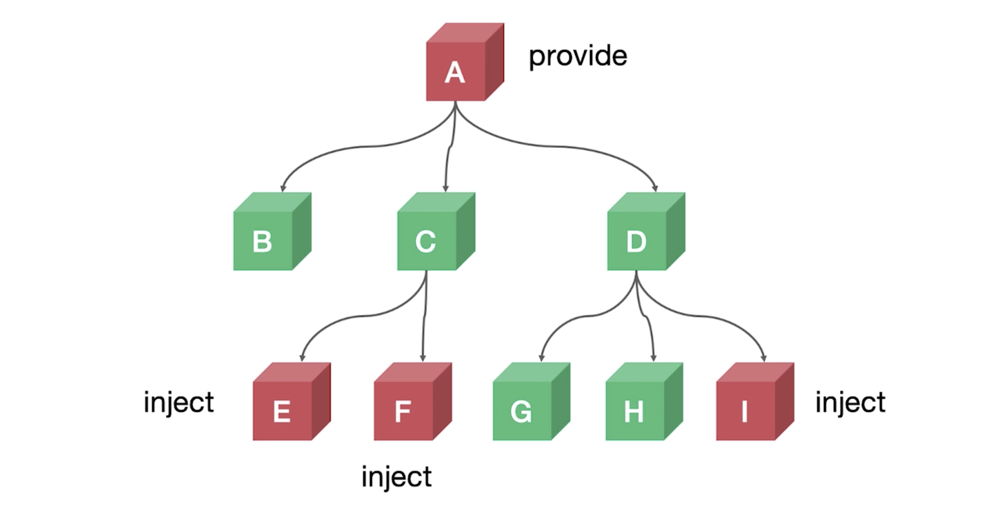

如上树形结构，父子组件间的通信，比如 A 与 B，通常是 A 节点通过 props 传递数据给 B，B 通过触发事件 `this.$emit` 来传递数据。那如果是 A 向 E 传递数据，则需要使用 props 通过 A 向 C 传递之后再向 E 传递数据，这样的传递还并不复杂，如果是 E 要向 I 传递数据，除了要使用 prop 之外，还需要通过事件来一层一层的传递数据来进行通信，这样的成本是非常高的，而且没有什么健壮性可言，非常的脆弱，provide/inject 就是为了解决这个问题。

> [计算机科学](https://www.wikiwand.com/zh-hans/计算机科学)中，**健壮性**（英语：Robustness）是指一个计算机系统在执行过程中处理错误，以及算法在遭遇输入、运算等异常时继续正常运行的能力。 诸如[模糊测试](https://www.wikiwand.com/zh-hans/模糊测试)之类的[形式化方法](https://www.wikiwand.com/zh-hans/形式化方法)中，必须通过制造错误的或不可预期的输入来验证程序的健壮性。很多商业产品都可用来测试软件系统的健壮性。健壮性也是[失效评定](https://www.wikiwand.com/zh-hans/失效评定)分析中的一个方面。

provide 提供数据（比如这里的 A 节点），inject 注入数据（比如这里的 E F I）

### demo

> 演示 DEMO 源码 /src/views/1.8

demo 部分就是模拟上面的树形结构。先放在这里吧，一般我们也都会使用 vuex。

### 课后习题

> 我们提供数据时，是通过响应式数据，this 来传递的，这样有一个弊端，this 下会挂载一些并不需要的数据，那么如果按需的提供响应式数据呢？
>
> 可以使用 2.6 最新 API Vue.obserbvable 优化响应式 provide


## 16 | 如何优雅地获取跨层级组件实例（拒绝递归）

上节课我们所讲的是组件之间如何跨层级通信的问题，这节课则是讲组件之间如何跨层级的获得实例。

### 什么是组件实例

组件在渲染完成之后都会生成一个实例，就像在 JS 中 new 一个对象。

理想状态下我们并不需要访问这个实例，而只需要关注数据就可以了。可随着业务越来越复杂，难免会访问 vue 实例的情况，比如我们使用 echart，一个业界很有名的数据可视化的库，如果我们使用 echart 就很难避免不去使用组件实例的情况；再比如我们的 input 节点，需要手动的触发它的 focus 状态，这个时候依然需要去访问我们的实例。

基于这些情况，vue 提供给了我们访问 vue 实例的 API，也就是 ref

### ref 引用信息

我们可以通过  `this.$refs.xxx` 或是 `vm.$refs.xxx` 来访问到我们的实例，如下：

```html
<!-- `vm.$refs.p` will be the DOM node -->
<p ref="p">hello</p>

<!-- `vm.$refs.child` will be the child component instance -->
<child-component ref="child"></child-component>
```

- 就如注释所描述的，当我们通过 `$refs` 来获取元素时则为 DOM 节点，如果是组件则是组件实例。

通过 `this.$refs.xxx` 可以很方便的获取到当前组件上下文的实例，但如果想要获取跨层级的组件实例则非常的不方便，对于想要获取父组件，可以通过 parent，子组件可以通过 child，但如果层级又十几级则非常的不方便。

### 递归查找

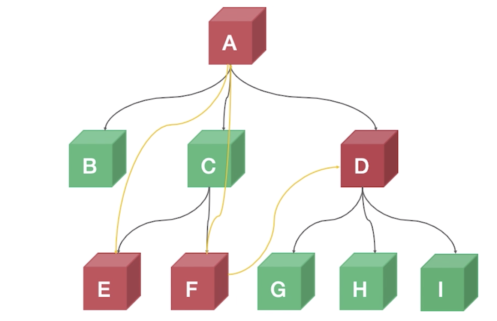

比如上图这种情况，A 节点想要获取 E，F 想要获取 A 和 D，这种情况可能需要我们使用递归的方式去查看，并且很多开源项目也是这样去做的，但是这样存在一些问题，比如：

- 代码繁琐
- 性能低效
  - 因为无法被缓存，则每一次使用都需要去重新查找

### callback ref

React 中的 ref 是可以通过回调来获取的，那么我们便可以在回调中做很多事情，就相对比较灵活。那么在 vue 中我们可以使用一种方案：

- 主动通知（setXxxRef）（名称是可以随意取的，这里是为了方便理解）
- 主动获取（getXxxRef）

假如 A 要获取 E 的实例，则 A 只需要提供一个钩子函数，E 生成或者更新之后主动的调用这个钩子函数来通知 A 节点，我这个实例已经生成好了，A 节点则将这个实例进行缓存，A 节点访问 E 的时候总是能够拿到最新的，因为 E 节点更新之后会主动告诉 A 节点。这就是整个方法的过程。

那么如何实现 callback ref 则成为了一个新的难点。先来看看 demo

### demo

> 演示 DEMO 源码 /src/views/1.9

节点和上面图示中是相同的。

A 节点：

```jsx
export default {
  components: {
    ChildrenB,
    ChildrenC,
    ChildrenD
  },
  provide() {
    return {
      setChildrenRef: (name, ref) => {
        this[name] = ref;
      },
      getChildrenRef: name => {
        return this[name];
      },
      getRef: () => {
        return this;
      }
    };
  },
  data() {
    return {
      color: "blue"
    };
  },
  methods: {
    getEH3Ref() {
      console.log(this.childrenE);
    }
  }
};
```

- A 节点中使用 `provide` 字段提供 `setChildrenRef` 方法用于缓存，提供 `getChildrenRef` 用于获取
- 在 26 行中可以通过 `getEH3Ref` 方法来获得从 E 节点传递过来的 ref
- 注意 `provide` 中提供的函数都是箭头函数，所以其中的 this 实际上是 A 的实例

```jsx
<template>
  <div class="border2">
    <h3 v-ant-ref="c => setChildrenRef('childrenE', c)">
      E 结点
    </h3>
  </div>
</template>
<script>
export default {
  components: {},
  inject: {
    setChildrenRef: {
      default: () => {}
    }
  }
};
</script>
```

- 然后在需要获取的节点处，通过 `inject` 接收到 `setChildrenRef` 方法，并使用 `v-ant-ref` 指令，在这个指令中传入一个回调，回调的第一个参数则是此元素的引用，然后将参数传入 `setChildrenRef` 之中即可。

再来看看 F 节点的代码：

```jsx
<template>
  <div class="border2">
    <h3>F 结点</h3>
    <button @click="getARef">获取A Ref</button>
    <button @click="getHRef">获取H Ref</button>
  </div>
</template>
<script>
export default {
  components: {},
  inject: {
    getParentRef: {
      from: "getRef",
      default: () => {}
    },
    getParentChildrenRef: {
      from: "getChildrenRef",
      default: () => {}
    }
  },
  methods: {
    getARef() {
      console.log(this.getParentRef());
    },
    getHRef() {
      console.log(this.getParentChildrenRef("childrenH"));
    }
  }
};
</script>
```

- 注入了 `getRef` 方法和 `getChildrenRef` 方法（这里已经更换名称）
- `getRef` 当然可以直接获取到 A 节点
- `getChildrenRef` 则是通过在 D 节点中使用 `setChildrenRef` 来存储了 H 及诶但从而可以获取。

D 节点代码：

```jsx
<template>
  <div class="border1">
    <h2>D 结点</h2>
    <ChildrenG />
    <ChildrenH v-ant-ref="c => setChildrenRef('childrenH', c)" />
    <ChildrenI />
  </div>
</template>
<script>
import ChildrenG from "./ChildrenG";
import ChildrenH from "./ChildrenH";
import ChildrenI from "./ChildrenI";
export default {
  components: {
    ChildrenG,
    ChildrenH,
    ChildrenI
  },
  inject: {
    setChildrenRef: {
      default: () => {}
    }
  }
};
</script>
```

- 第 5 行中通过 `setChildrenRef` 将 `ChildrenH` 组件存储在了 A 节点之中。

注意，这种方法的原理是，通过将其他节点使用 `v-ant-ref` 指令将其存储到根节点之下，然后通过根节点所提供的方法在其他组件中获取想要获取的节点。

### 课后习题

> v-ant-ref 指令回调中能否更改响应式数据？为什么？
>
> 会不停触发update回调。


## 17 | template 和 JSX 的对比以及它们的本质

JSX 是伴随着 React 诞生的，不过 React 和 JSX 可以说是相互独立的个体，通过一些插件的形式，我们依然可以在 vue 中使用 JSX。

### template

- 模版语法（HTML 的扩展）
- 数据绑定使用 Mustache 语法（双大括号）（JQuery 用的很多）

```jsx
<span>Message: {{ msg }}</span>
```

### JSX

- JavaScript 的语法扩展
- 数据绑定使用单引号

```jsx
<span>Message: {this.msg}</span>
```

从上面示例来看，似乎 template 与 JSX 没有太大的差别，可 JSX 是 JS 的扩展，我们可以在其中写各种 JS 的逻辑，所以相比于 template 来说就会更加的灵活。

### template vs JSX

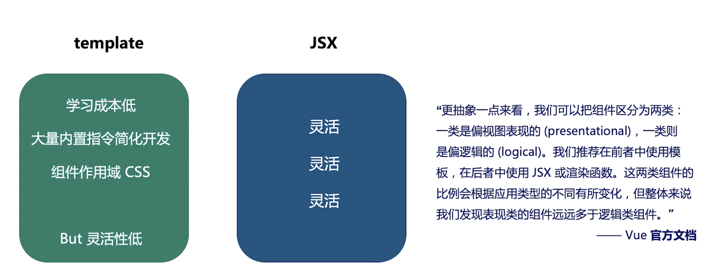

一个框架的推出必然需要一些特点来吸引用户的使用，而 tempalte 就是 vue 的一大特点。

但为什么需要 JSX，原因在于，虽然我们开发的系统越来越复杂，难免会碰到一些逻辑复杂的情况，这个时候使用 template 来写逻辑就会非常的吃力，而这个使用 JSX 或者 render 渲染函数就会是一个非常好的方式。

### demo

> 演示 DEMO 源码 /src/views/1.10

#### **template**

```jsx
<template>
  <h1 v-if="level === 1">
    <slot></slot>
  </h1>
  <h2 v-else-if="level === 2">
    <slot></slot>
  </h2>
  <h3 v-else-if="level === 3">
    <slot></slot>
  </h3>
  <h4 v-else-if="level === 4">
    <slot></slot>
  </h4>
  <h5 v-else-if="level === 5">
    <slot></slot>
  </h5>
  <h6 v-else-if="level === 6">
    <slot></slot>
  </h6>
</template>
<script>
export default {
  props: {
    level: {
      type: Number,
      default: 1
    }
  }
};
</script>
```

- 如果要实现一个根据一个 `prop` `level` 来渲染几级标题，使用 template 则需要使用到 `v-if` `v-else-if` 来逐级判断，会比较麻烦。

#### **JSX**

```jsx
export default {
  props: {
    level: {
      type: Number,
      default: 1
    }
  },
  render: function(h) {
    const Tag = `h${this.level}`;
    return <Tag>{this.$slots.default}</Tag>;
  }
};
```

- 使用 JSX 则是直接在 `render` 函数中，通过字符串模版来拼接一个标签，然后通过渲染这个标签即可，很方便。

#### JS 渲染函数

```jsx
export default {
  props: {
    level: {
      type: Number,
      default: 1
    }
  },
  render: function(createElement) {
    return createElement(
      "h" + this.level, // 标签名称
      this.$slots.default // 子元素数组
    );
  }
};
```

- 渲染函数则需要我们使用到 `createElement` 方法，虽然也可以很方便的通过字符串拼接的形式来传入需要渲染的元素是什么，但是如果需要渲染的嵌套过多就会很乱，因为会不断的调用 `createElement` 方法。

#### Vue 提供的混合方法

```jsx
<template>
  <div>
    <span>Message: {{ msg }}</span>
    <br />
    <VNodes :vnodes="getJSXSpan()" />
    <anchored-heading1 :level="1">Hello world!</anchored-heading1>
    <anchored-heading2 :level="2">Hello world!</anchored-heading2>
    <anchored-heading3 :level="3">Hello world!</anchored-heading3>
    <VNodes :vnodes="getAnchoredHeading(4)" />
  </div>
</template>
<script>
import AnchoredHeading1 from "./AnchoredHeading.vue";
import AnchoredHeading2 from "./AnchoredHeading.js";
import AnchoredHeading3 from "./AnchoredHeading.jsx";

export default {
  components: {
    AnchoredHeading1,
    AnchoredHeading2,
    AnchoredHeading3,
    VNodes: {
      functional: true,
      render: (h, ctx) => ctx.props.vnodes
    }
  },
  data() {
    return {
      msg: "hello vue"
    };
  },
  methods: {
    getJSXSpan() {
      return <span>Message: {this.msg}</span>;
    },
    getAnchoredHeading(level) {
      const Tag = `h${level}`;
      return <Tag>Hello world!</Tag>;
    }
  }
};
</script>
```

- 第 5 行和第 9 行中，使用 `Vnodes` 标签可以通过向 `:vnodes` 属性中传入 `JSX` 来实现在 `template` 中使用 JSX 的效果。

在平常的开发过程中一开始我们可能都是使用 `template`，当我们遇到逻辑比较复杂的情况时，也不用着急的使用 JSX，因为可以使用上面这样的混合方式。

### But 语法糖

不管用 `template` 也好，还是 `JSX` 也好，实际上都是语法糖，如图；

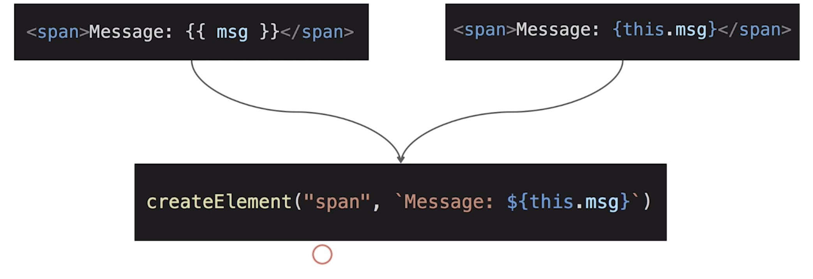

### 课后习题

> 将 1.1 章节的 Demo 改成 JSX 形式，从而进一步加深对 template 与 JSX 之间的差别，比如如何通过 JSX 来传递事件和插槽。