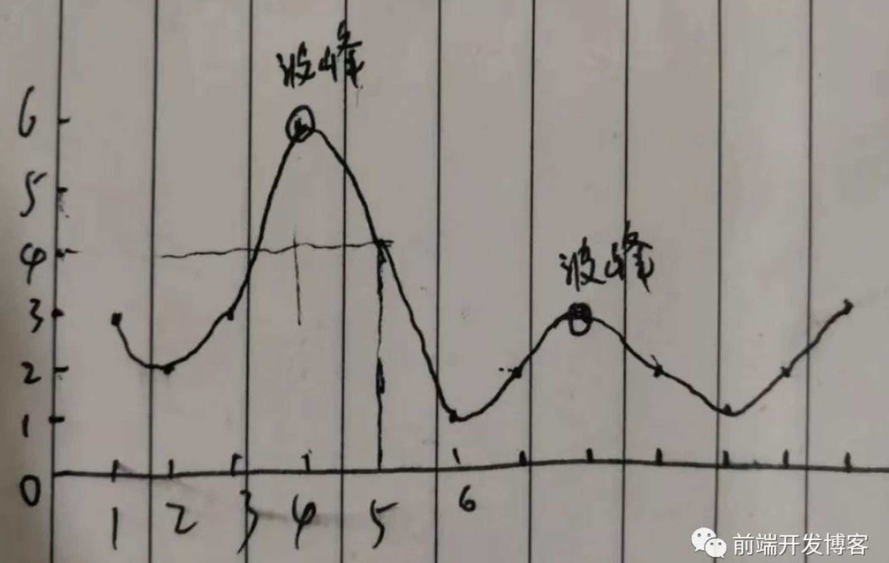

# 前端开发博客面试题汇总

[TOC]

## 第一周汇总

>  地址：[前端开发博客微信群一周面试题汇总20190301](http://caibaojian.com/20190301-interview-question.html)

### 1.[清除浮动](https://codepen.io/harmsworth/pen/MLdyZd?utm_source=caibaojian.com)

**已知浮动是元素脱离了普通文档流；如果当前空间允许，则其后的元素会向上提升至与其平起平坐。** 然而，浮动有一个明显的缺陷：**包围浮动的父元素会产生高度坍塌**。 那么，如何清除浮动？请尽可能的写出清除浮动的多种方式，并说明哪一种最合适？

#### ①.为父元素添加overflow: hidden或overflow: auto。

父容器形成了BFC（块级格式化上下文），从而使浮动子元素的高度也能作为计算的一部分。

```html
<section class="wrap">
  
  <p>这是一只猫</p>
</section>
.wrap{
  overflow: hidden;
  /* overflow: auto; */
}
section{
  border: 1px solid blue;
  margin: 0 0 10px 0;
}
img{
  float: left;
}
p{
  margin:0;
  font-size:1em;
}
```

#### ②.浮动父元素float:left

```html
<section class="wrap">
  
  <p>这是一只猫</p>
</section>
.wrap{
  float: left;
}
section{
  border: 1px solid blue;
  margin: 0 0 10px 0;
}
img{
  float: left;
}
p{
  margin:0;
  font-size:1em;
}
```

- 但需注意，这样的方式会使父元素的宽度不再是其父元素宽度的 100%

#### ③.在父元素末尾添加非浮动块级元素

```html
<section class="wrap">
  
  <p>这是一只猫</p>
  <div class="clear_left"></div>
</section>
.clear_left{
  clear: left;
}
section{
  border: 1px solid blue;
  margin: 0 0 10px 0;
}
img{
  float: left;
}
p{
  margin:0;
  font-size:1em;
}
```

#### ④.为父元素添加一个清除浮动的伪元素

```html
<section class="clearfix">
  
  <p>这是一只猫</p>
</section>
.clearfix:after {
    content:".";
    display:block;
    height:0;
    visibility:hidden;
    clear:both;
}
section{
  border: 1px solid blue;
  margin: 0 0 10px 0;
}
img{
  float: left;
}
p{
  margin:0;
  font-size:1em;
}
```

- 3 和 4 实际上原理相同

#### ⑤.没有父元素如何清除浮动

给一个元素应用 clear:both，将它定位在浮动元素下方。

```html

  
img{
  float: left;
}
.clear{
  clear:both
}
```

**总结： 方式1会形成块级格式化上下文，不会影响外部元素，亦不受外部元素影响。 方式1和方式4都不必添加多余的元素，此2种方式最常用。**

### 2.[求一个数组所有波峰位置和波峰峰值？](https://codepen.io/CometBoom/pen/oREgrG)



```javascript
/**
求一个数组所有波峰位置和波峰峰值？
pos: 保存波峰元素所在下标数组
peaks: 保存波峰元素值的数组
例如：
var arr = [3, 2, 3, 6, 4, 1, 2, 3, 2, 1, 2, 3]
pickPeaks(arr) // {positions: [3, 7], peaks: [6, 3]}
pickPeaks([]) // {positions: [], peaks: []}
*/
function pickPeaks(arr){
  const positions = []
  const peaks = []
  for (let i = 1; i < arr.length - 1; i++) {
    if (arr[i] > arr[i - 1] && arr[i] > arr[i + 1]) {
      positions.push(i)
      peaks.push(arr[i])
    }
  }
  return {pos,peaks}
}
```

- 一段连续的数据，比如这里的数组，要满足波峰位置，则需要比前一个和后一个值大，这样才会形成波峰。因此，第一个值与最后一个值一定不是波峰位置，所以也可以不用遍历他们。

### 3.[for/in、Object.keys 和 Object.getOwnPropertyNames 对属性遍历有什么区别？你还知道其他遍历对象属性的方式吗？请说明。](https://codepen.io/harmsworth/pen/mvNGXa)

[ES6](http://caibaojian.com/es6/) 中共有 5 种遍历对象属性的方法

1. for...in
2. Object.keys(obj)
3. Object.getOwnPropertyNames(obj)
4. Object.getOwnPropertySymbols(obj)
5. Reflect.ownKeys(obj)

```javascript
var parent = {}
Object.defineProperties(parent, {
    a: {
        value: 1,
        writable: true,
        enumerable: true,
        configurable: true
    },
    b: {
        value: 1,
        writable: true,
        enumerable: false,
        configurable: true
    },
    [Symbol('parent')]: {
        value: 1,
        writable: true,
        enumerable: true,
        configurable: true
    }
})
var child = Object.create(parent, {
    c: {
        value: 1,
        writable: true,
        enumerable: true,
        configurable: true
    },
    d: {
        value: 1,
        writable: false,
        enumerable: true,
        configurable: true
    },
    e: {
        value: 1,
        writable: true,
        enumerable: false,
        configurable: true
    },
    f: {
        value: 1,
        writable: true,
        enumerable: true,
        configurable: false
    },
    [Symbol('child')]: {
        value: 1,
        writable: true,
        enumerable: true,
        configurable: true
    }
})
```

#### for...in

`for…in` 遍历对象**自身的**和**继承的**所有**可枚举**的属性，但不包含`Symbol`属性。

```javascript
for (const key in child) {
    console.log(key)
}
// c d f a
```

#### Object.keys(obj)

`Object.keys(obj)`返回对象**自身的**所有**可枚举**属性的数组，但不包含`Symbol`属性。

```javascript
Object.keys(child)
// ["c", "d", "f"]
```

#### Object.getOwnPropertyNames(obj)

`Object.getOwnPropertyNames(obj) `返回对象**自身**和**不可枚举**属性，但不包含`Symbol`属性。

```javascript
Object.getOwnPropertyNames(child)
// ["c", "d", "e", "f"]
```

#### Object.getOwnPropertySymbols(obj)

`Object.getOwnPropertySymbols(obj)` 返回对象自身所有`Symbol`属性的数组。

```javascript
Object.getOwnPropertySymbols(child)
// [Symbol(child)]
```

#### Reflect.ownKeys(obj)

`Reflect.ownKeys(obj)` 返回对象自身所有属性，无论是否可枚举、是否是`Symbol`属性。

```javascript
Reflect.ownKeys(child)
// ["c", "d", "e", "f", Symbol(child)]
```

### 4.[请写出兼容各种浏览器版本的事件绑定函数？](https://codepen.io/harmsworth/pen/vPBBEP?editors=0010)

```javascript
// 添加事件
function addHandler(element, type, handler) {
    if (element.addEventListener) {
        element.addEventListener(type, handler)
    } else if (element.attachEvent) {
        element.attachEvent(`on${type}`, handler)
    } else {
        element[`on${type}`] = handler
    }
}
```

### 5.[CSS](http://caibaojian.com/css3/) 选择器优先级怎么计算的？（权重）

CSS 选择器优先级通过计算选择器中特指度对 CSS 规则进行层叠。 特指度指选择器中ID、类、标签名出现的次数，并以ID-CLASS-ELEMENT顺序计算。 有如下 4 条简要规则：

- ID选择器 > 类选择器 > 标签选择器
- 行类样式 > 嵌入样式 > 链接样式;
- 后声明样式 > 先声明样式
- 设定的样式 > 继承的样式

### 6.[请写出一个判断质数的函数，返回布尔值。](https://codepen.io/harmsworth/pen/drbbYw)

```javascript
function isPrime(num){
 if(!Number.isInteger(num)) return false
 for(let i = 2; i < num ; i++){
    if(num % i === 0){
		return false
	}
  }
  return num > 1
}
```

### 7.[请写出一个延迟执行的函数](https://codepen.io/harmsworth/pen/eXOOgy)

```javascript
function sleep (ms) {
  let start = Date.now()
  while (Date.now() < start + ms){}
}
console.time('sleep');
sleep(1000)
console.timeEnd("sleep");
```

- 利用`while`循环来阻塞程序的运行，直到在 ms 毫秒之后才解除阻塞，虽然能够达到目的，但是这其中会循环执行很多次没有意义的代码。
- 通过`console.time`和`console.timeEnd`方法能够获得这之间程序的执行时间


### 8.请问类数组转数组有哪几种实现方式？

```javascript
var obj = {
    0: 'a',
    1: 'b',
    length: 2
}
console.log(Array.from(obj))
console.log(Array.prototype.slice.call(obj))
console.log([].slice.call(obj))
// 已知对象原型没有迭代器接口，故无法使用展开运算符将对象类型的类数组转数组
// 在对象的原型上添加该接口，就可以用[...obj]了
Object.prototype[Symbol.iterator] = function() {
  let index = 0;
  let propKeys = Reflect.ownKeys(obj);
  let lIndex = propKeys.findIndex(v => v === "length");
  propKeys.splice(lIndex, 1);
  return {
    next() {
      if (index < propKeys.length) {
        let key = propKeys[index];
        index++;
        return { value: obj[key] };
      } else {
        return { done: true };
      }
    }
  };
};
console.log([...obj])
```

---

## 第三周汇总

### 1.[请描述第 2 行代码的执行顺序](https://codepen.io/harmsworth/pen/jJWyoV)

```js
var obj = {a:1}
obj.b = obj = {a:2}
// 假设：上面第2行代码从右到左赋值
var obj = {a:1}
// 创建cobj指向obj
var cobj = obj
obj.b = obj = {a:2}
console.log(obj.b) // undefined
console.log(cobj.b) // {a: 2}
```

`obj.b`的值是`undefined`，`cobj`的属性`b`并未赋值过，但是`cobj.b`的值是`{a: 2}`。
`cobj`指向`obj({a: 1})`，只有`obj.b = {a: 2}`，这一步执行了`obj.b`才有值！
故第 2 行代码执行顺序是从右到左赋值。可分解为：

```js
// obj指向新对象{a: 2}
obj = {a: 2}
// obj({a: 1}) 的 b 属性指向新对象 {a: 2}
obj.b = {a: 2}
		obj.b = obj = {a: 2}
		 |       |
	   {a: 1}  {a: 2}
```

- 这个题目最为关键的是要知道在如上代码第 5 行`obj.b = obj = {a: 2}`中，`obj`都是指向于`{a:1}`对象的，但是由于`obj = {a: 2}`语句的原因，使其指向了`{a:2}`，因此`obj.b`为`undefined`，而为何`cobj.b`有值，是因为`cobj`是指向于`{a:1}`的，而`obj.b = obj = {a: 2}`语句，实际上让`{a:1}`对象添加了一个 b 属性

### 2.有 1 到 10000 共 10000 个数，如果我从中随机拿走一个数，你如何知道我拿走了哪个？

方式一：相加
1 ~ 10000个数相加然后减去随机拿走后的1 ~ 9999个数即可得出拿走的那个数。
方式二：相乘
1 ~ 10000个数相乘除以随机拿走后的1 ~ 9999个数即可得出拿走的那个数。
方式三：位运算符

```js
(1^2^3^...^10000)^(n1^n2^...nm)
		|				|
	  10000个数        9999个数
```

### 3.[请写出隐藏一个 html 元素的各种方式？](https://codepen.io/harmsworth/pen/LaZYqe)

```html
<!-- 1.表单元素type=hidden
未脱离文档流，无法触发绑定事件
-->
<input type='hidden' />
<!-- 2.display:none; 或者 html的hidden属性
脱离文档流，无法触发绑定事件
-->
<div style='display:none;'></div>
<div hidden></div>
<!-- 3.visibility: hidden;
未脱离文档流，无法触发绑定事件
 -->
<div style='visibility:hidden;'></div>
<!-- 4.透明度opacity:0;
未脱离文档流，可以触发绑定事件
-->
<div style='opacity:0;'></div>
<!-- 5.绝对定位position:absolute;
未脱离文档流，可以触发绑定事件
-->
<div style='position:absolute;left:-9999px'></div>
```

### 4.[请写出一个获取数组最大值的函数？](https://codepen.io/harmsworth/pen/moEdoz)

```js
var arr = [22,18,2,10,9,3]
arr.reduce((prev, next) => {
    return Math.max(prev, next)
})
Math.max.apply(null, arr)
Math.max(...arr)
Reflect.apply(Math.max, Math, arr)
```

### 5.你知道链接 target 属性值的区别吗？请写出。

- **_self(默认)**：默认。在相同的框架中打开被链接文档。
- **_blank**：在新窗口中打开被链接文档。
- **_parent**：在父框架集中打开被链接文档。
- **_top**：在整个窗口中打开被链接文档。
- **name**：在指定的框架中打开被链接文档。
  其中 **name **的是frame标签或者[iframe](http://caibaojian.com/t/iframe)标签的 name 属性。
  html5 已经不支持 [frame标签和frameset标签](http://www.w3school.com.cn/html5/tag_frameset.asp)，若需使用框架建议使用 iframe 标签。

### 6.[CSS](http://caibaojian.com/css3/)有几种引入方式？link和[@import](https://github.com/import)有什么区别？

#### 引入方式

- 行内样式

```html
// index.html
<div style='width:100px;height:100px;border:1px solid;'></div>
```

- 嵌入样式

```html
// index.html
<style>
*{
	margin:0;
	padding:0;
}
</style>
```

- 链接样式

```html
// index.html
<link rel="stylesheet" type="text/css" href="reset.css" />
```

- 导入样式

```css
// index.css
@import url(common.css);
// index.html
<style>
@import url(index.css);
</style>
```

### link和[@import](https://github.com/import)的区别

- link是html引入css方式，[@import](https://github.com/import)是css引入方式
- 浏览器会先加载页面时同步加载 link 引入的css文件；页面加载完成后，再加载[@import](https://github.com/import)引入的css
- 浏览器对link的兼容性更高
- 优先级：link > [@import](https://github.com/import)

### 7.[请写出一个秒转时分秒的函数。hh:mm:ss格式。](https://codepen.io/harmsworth/pen/OqWqWR)

```js
function getTime (num) {
	const hours = Math.floor(num / 3600)
    const minutes = Math.floor(num % 3600 / 60)
    const seconds = Math.floor(num % 60)
    return `${String(hours).padStart(2, '0')}:${String(minutes).padStart(2, '0')}:${String(seconds).padStart(2, '0')}`
}

function getTime(seconds) {
  return [seconds / 3600, seconds % 3600 / 60, seconds % 60].map(v => {
    return `${Math.floor(v).toString().padStart(2, '0')}`
  }).join(':')
}
```

- `String()`能够将非字符串转换为字符串
- `str.padStart(targetLength [, padString])` 能够在原字符串开头填充指定的填充字符串直到目标长度所形成的新字符串。
  - `targetLength`：当前字符串需要填充到的目标长度。如果这个数值小于当前字符串的长度，则返回当前字符串本身。
  - `padString`(可选)：填充字符串。如果字符串太长，使填充后的字符串长度超过了目标长度，则只保留最左侧的部分，其他部分会被截断。此参数的缺省值为 " "（U+0020）。
  - [MDN 地址](https://developer.mozilla.org/zh-CN/docs/Web/JavaScript/Reference/Global_Objects/String/padStart)

### 8.[已知年月，求该月共多少天？](https://codepen.io/harmsworth/pen/PLzLmR)

```js
function getDays (year, month) {
	return new Date(year, month + 1, 0).getDate()
}
```

- 注意：month 是从 0 开始计算，而 day 是以 1 开始
- 所以，这是一个非常巧妙的办法，通过传入比当前月大一月的月份值，再传入 day 为 0 的值来回到上一个月的最后一天，返回当前"日"，则正好是本月的天数。

---

## 第四周汇总

原文链接：

http://caibaojian.com/20190316-interview.html

### 1.[如何实现数组的随机排序？](https://codepen.io/harmsworth/pen/mowVRE)

关于数组的排序，可以看看我以前写过的一篇文章：[js随机数组，js随机洗牌算法](http://caibaojian.com/js-random-array.html)

我的方法：

```jsx
function getRandomInteger(min, max) {
  return Math.floor(Math.random() * (max - min) + min);
}

function randomSort(arr){
  let newArr = []
  while(arr.length){
    let randomIndex = getRandom(0, arr.length - 1)
    newArr.push(arr.splice(randomIndex,1))
  }
  return newArr
}
```


```js
var arr = [1,2,3,4,5,6,7,8,9]

function randomsort1 (arr) {
	for (let i = 0, len = arr.length; i < len; i++) {
		const ran = parseInt(Math.random() * len)
		const temp = arr[ran]
		arr[ran] = arr[i]	
		arr[i] = temp
	}
	return arr
}

function randomsort2 (arr) {
	const newarr = []
	while (arr.length) {
		const ran = parseInt(Math.random() * arr.length)
		newarr.push(arr[ran])
		arr.splice(ran, 1)
	}
	return newarr
}

function randomsort3 (arr) {
	return arr.sort(() => Math.random() - 0.5)
}
```

- `randomsort1`方法和`randomsort2`方法基本相同，都是循环数组，然后随机获取一个在 0 到数组最大 index 的 index 值，不同之处在于：
  - `randomsort1`是将随机 index 与当前循环 index 所对应的值进行交换
  - `randomsort2`则是在当前数组中利用随机 index 获取值以后 push 到一个新的数组中
- `randomsort3`利用了数组的`sort`方法
  - `sort( (a, b) => a - b)`在传入的回调中：
    - 如果大于 0 则 a 排到 b 之后，为升序
    - 如果等于 0 则 a 和 b 的位置不动
    - 如果小雨 0 则 a 排到 b 之前，为降序
    - 必须总是对相同的输入返回相同的比较结果，否则排序的结果将是不确定的。（利用这一点）
  - [MDN - 描述](https://developer.mozilla.org/zh-CN/docs/Web/JavaScript/Reference/Global_Objects/Array/sort#Description)
    - 如果有时间可以看看 [使用映射改善排序](https://developer.mozilla.org/zh-CN/docs/Web/JavaScript/Reference/Global_Objects/Array/sort#Example:_Sorting_maps)，特别是第 11 行代码，非常简洁的实现了三种判断

### 2.[请将数组中所有的 0 移动到数组尾部](https://codepen.io/harmsworth/pen/pYwOGx)

```js
var arr = ['a',1,0,'d',1,0,2]
function moveZeros (arr) {
  return [...arr.filter(v => v !== 0), ...arr.filter(v => v === 0)]
}
```


### 3.如果需要手动写动画，你认为最小时间间隔是多久，为什么？

显示器默认频率是60HZ，即1秒刷新60次，故最小时间间隔是 1000/60 = 16.7毫秒。

### 4.什么是 Cookie 隔离？

若静态文件位于主域名下，请求静态文件时会携带 cookie 到服务器，浪费流量，故需隔离。
 由于 cookie 有域的限制，不能跨域提交请求，故将静态文件置于非主要域名下，请求静态文件时便不会携带cookie 数据。如此可降低请求头大小和请求时间，以便达到降低整体请求耗时的目的。[·](http://caibaojian.com/20190316-interview.html)

### 5.请写出 js 中取整的方式？哪一种方式效率更高？

- Math.floor() & Math.ceil()
- ~~ 按位非
- <<0 左移
- |0 按位或
- parseInt
- toFixed()

```js
// 准备一个包含100000个小数的数组
var numbers = []
for(var i = 0; i < 100000; i++) {
  numbers[i] = Math.floor(Math.random() * 100000) / 10000
}
var test
console.time('Math.floor()')
for (var i = 0; i < 100000; i++) {
  test = Math.floor(numbers[i])
}
console.timeEnd('Math.floor()')
var test
console.time('~~')
for (var i = 0; i < 100000; i++) {
  test = ~~ (numbers[i])
}
console.timeEnd('~~')
var test
console.time('<<0')
for (var i = 0; i < 100000; i++) {
  test = (numbers[i]) << 0
}
console.timeEnd('<<0')
var test
console.time('|0')
for (var i = 0; i < 100000; i++) {
  test = numbers[i] | 0
}
console.timeEnd('|0')
var test
console.time('parseInt')
for (var i = 0; i < 100000; i++) {
  test = parseInt(numbers[i])
}
console.timeEnd('parseInt')
var test
console.time('toFixed()')
for (var i = 0; i < 100000; i++) {
  test = numbers[i].toFixed(0)
}
console.timeEnd('toFixed()')
/*
Math.floor(): 5.799072265625ms
~~: 5.5419921875ms
<<0: 7.20703125ms
|0: 7.76513671875ms
parseInt: 11.83984375ms
toFixed(): 68.804931640625ms
*/
```

以上运算耗时并不固定，与浏览器版本、操作系统等都有关联。
 测试结果表明：
 ~~按位非、<<0左移、|0按位或、Math.floor()运算速度都挺快，
 parseInt 紧随其后，toFixed() 最耗时。

### 6.[给定整数数组和单个整数，返回整数数组中2个值相加为单个整数的值。](https://codepen.io/harmsworth/pen/oVpZOQ)

```js
function sum_pairs (arr, sum) {
  const seen = {};
  const results = [];
  for (let x of arr) {
    if (seen[sum - x]) {
		  results.push([sum - x, x])
		} else {
			seen[x] = true
		}
  }
  return results
}

sum_pairs([11, 3, 7, 5], 10)
sum_pairs([4, 3, 2, 3, 4], 6)
sum_pairs([0, 0, -2, 3], 2)
sum_pairs([10, 5, 2, 3, 7, 5], 10)
```

### 7.[请写出一个判断字符串是否是回文的函数](https://codepen.io/harmsworth/pen/aMqgab)

```js
//code from http://caibaojian.com/20190316-interview.html
function reverseStr(str) {
    return str === str.split('').reverse().join('')
}
```

