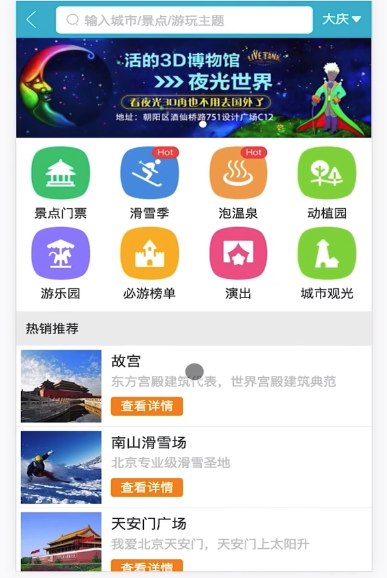
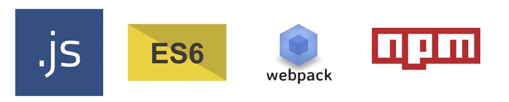

# 1.课程简介

[TOC]

## Vue 2.0 的特点

- NUXT 框架
  - 快速实现 Vue 的**服务器端渲染**。
- WEEX
  - 使用 Vue 的语法来编写原生 APP
- 社区的完善
  - 在开发中的问题都可以去社区寻找答案

总之，主流前端框架能做的事情，如今 Vue 也能做。 

## 教程的梗概

### 基础内容

- 1.基础语法
- 2.MVVM 模式
- 3.前端组件化概念
- 4.Vue 实例的生命周期函数
- 5.动画特效

### 实战项目

- 1.搭建 Vue 的**项目开发环境**
- 2.使用 Git 对代码进行**版本管理**
- 3.本地**模拟后端接口数据**，进行**本地代码开发**
- 4.在 Vue 项目中如何实现**前后端的代码联调**
- 5.如何完成对 Vue 项目的**真机测试**
- 6.Vue 项目的完整**上线流程**

## 项目简介

### 项目首页图示：

### 实现功能：

- 根据不同城市选择不同景点的功能
- 首页上实现了**多区域轮播**
- 多区域列表的循环展示
- 城市选择页：
  - 城市展示
  - 城市搜索
  - 右侧字母对应相应城市，并实现联动效果
- 切换城市成功后，首页会发生相应的变化
- 景点详情页面：
  - 公用画廊组件
  - 渐隐渐现的 header 组件
  - 递归展示的列表组件

### 项目中所使用的 vue 知识点

- 使用 **Axios** 来进行 **Ajax 数据的获取**。
- 使用 **Vue Router** 做**多页面之间的路由**
- 使用 **Vuex** 来做**各个组件之间的数据共享**
- 使用 **异步组件** 让代码上线、性能更优
- 使用 **Stylus** 来编写前端样式
- 使用 递归组件 实现组件自身调用自己的效果
- 使用各种插件
  - swiper 实现轮播
  - 公用组件的拆分

## 课程安排

- 第 1 章 课程简介（本课）
- 第 2 章 Vue 初探
  - 讲解 Vue 的基础知识
- 第 3 - 5 章 基础知识精讲
- 第 6 - 9 章 Vue 项目实战
- 第 10 章 项目测试上线流程及后续学习指南

## 学习前提

- js 基础语法
- ES6
- webpack
- npm
  - node 包管理工具
  - 用于安装项目中所使用的依赖包

## 讲授方式

- 通俗易懂的案例讲解基础
- 借助基础知识实现项目
- 带着你编写每一行代码
-  图文搭配讲解复杂知识点

## 课程收获

- 彻底入门 Vue 的使用
- 理解整个 Vue 项目的开发流程
- 移动端页面布局技巧
- 上手中型 Vue 项目的开发
- 规范的代码编写

